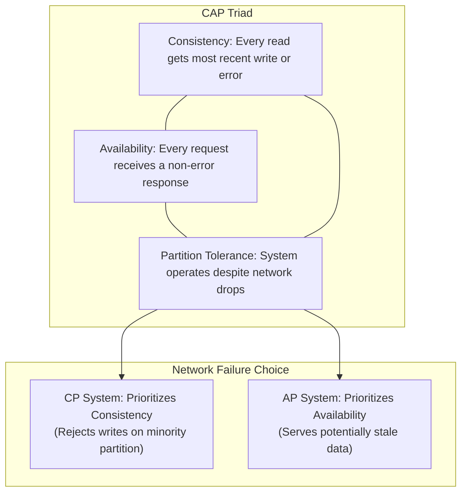
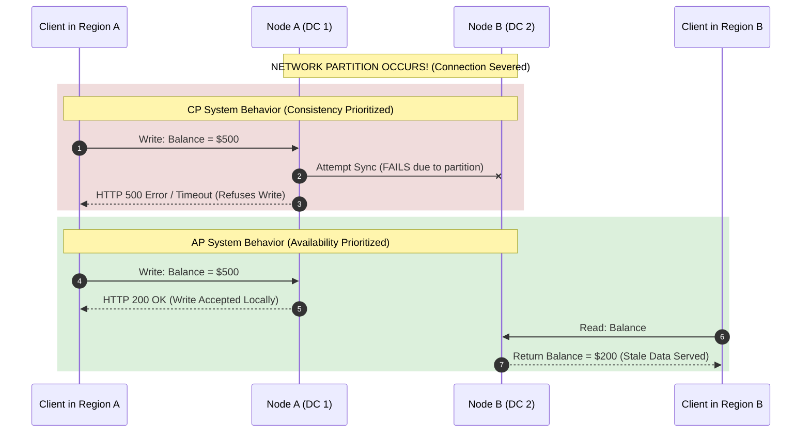

# 1.1.1 CAP Theorem: Consistency, Availability, and Partition Tolerance

## Intuitive Explanation

Imagine you are managing a chain of coffee shops (a distributed system). Each shop has a board listing the price of a Latte.

The **CAP Theorem** states that if the connection between the shops breaks (a Partition), you must choose which of the remaining two properties to uphold:

1. **Consistency (C):** Do all shops show the exact same price, even if it means some shops can't take orders because they can't confirm the price?
2. **Availability (A):** Can every shop always take an order, even if the price they show might be slightly outdated compared to other shops?

```
                 /--- [C] Consistency (All nodes see same data at same time)
    Pick TWO ---+--- [A] Availability (Every request gets a non-error response)
                 \--- [P] Partition Tolerance (System works despite network failures)
```

You can only guarantee two out of three: *Consistency*, *Availability*, or *Partition Tolerance*. Since network partitions are inevitable in real-world distributed networks, the choice in practice is between `CP` and `AP`.

---

## In-Depth Analysis

The CAP theorem applies to distributed data stores operating over a network.



### Visualizing Network Partitions in CP vs AP Systems



---

## Key Concepts / Tradeoffs

- **CP Systems (Consistency + Partition Tolerance):** If a partition occurs, nodes on the "minority" side of the partition will deliberately go offline or reject writes until the partition is resolved and data can be synced.
  - *Examples:* Traditional RDBMS with synchronous replication, HBase, MongoDB (with primary election), CockroachDB.
- **AP Systems (Availability + Partition Tolerance):** If a partition occurs, all nodes remain active and accept reads and writes. Data conflicts will be resolved later once the partition heals, leading to Eventual Consistency.
  - *Examples:* Apache Cassandra, Amazon DynamoDB (by default), Couchbase.
- **Partition Scope:** `P` in the CAP theorem refers to network link degradation or split-brain network failures across physical nodes.

> **Beyond CAP:** See [1.1.11 PACELC Theorem](1.1.11-pacelc-theorem-consensus.md) for how distributed systems trade off **Latency (L)** vs **Consistency (C)** during normal, non-partitioned operation!

---

## 💡 Real-World Use Cases

- **Banking Transactions (CP):** Financial ledger systems must be **CP**. If a network link breaks, the system will reject a transaction rather than risk showing a customer a wrong balance or double-spending money.
- **Social Media Feeds (AP):** Showing a user a slightly older version of their friend's feed (stale data) is acceptable if it means the user can still access the platform. **Availability** is prioritized over strong consistency.
- **DNS (AP):** Domain Name Servers (DNS) prioritize availability so you can always access a website. Updates to DNS records can take up to 48 hours to propagate globally (a clear example of eventual consistency).

---

## ✏️ Design Challenge

### Problem

You are designing a user profile service. User profiles are read far more often than they are written. If a network partition occurs between your two main data centers, would you choose an AP or a CP model for your service, and why?

### Solution

#### Scenario Analysis

- You’re designing a User Profile Service.
- Reads ≫ Writes (profiles are mostly read, rarely updated).
- There are two main data centers.
- Occasionally, a network partition can occur between them.

#### Step 1 — Understand what happens during a partition

When a partition occurs, the two data centers cannot communicate.

- **AP system:** Both data centers stay online and serve requests (possibly stale data).
- **CP system:** One data center (or both) may refuse requests to preserve strict consistency.

#### Step 2 — Evaluate based on business needs

- Reads dominate (profiles are displayed constantly).
- Writes (profile updates) are infrequent.
- Slightly stale data is tolerable (e.g., user updates bio $\rightarrow$ others can see it a few seconds later).
- Total unavailability (“Can’t load profile”) is unacceptable for user experience.

#### ✅ Final Recommendation

**👉 Choose an AP (Available + Partition-tolerant) model.**

| Aspect | Choice | Reason |
| :--- | :--- | :--- |
| **Consistency vs Availability** | **Prefer Availability (AP)** | User experience benefits from always-on reads, even if stale |
| **Tolerance** | **Partition Tolerant** | Network partitions between DCs are expected |
| **Justification** | Reads >> Writes, so eventual consistency is acceptable; availability is more important |
