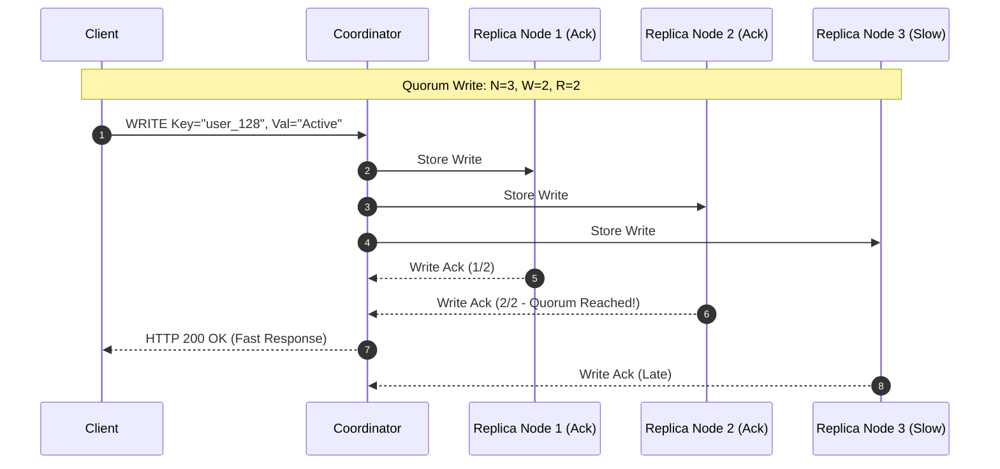
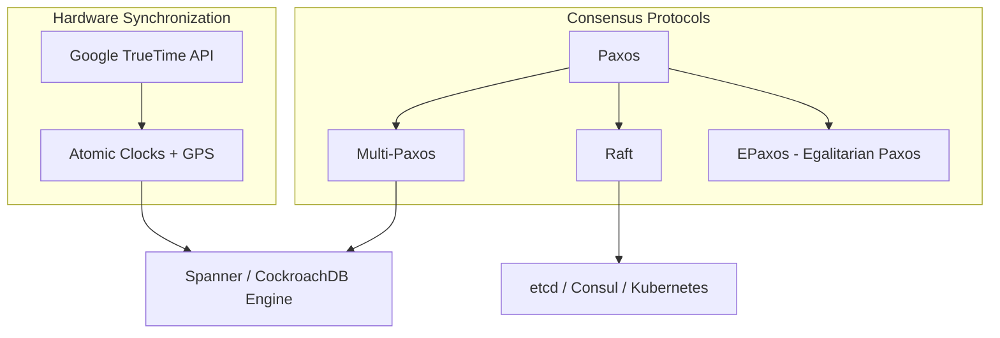

# 1.1.11 PACELC Theorem and Distributed Consensus Mechanics

## Intuitive Explanation

The **CAP Theorem** tells us what happens when a system breaks (during a network partition **P**). But what happens during normal, healthy operations when there is **no** network partition?

That's where the **PACELC Theorem** comes in.

Imagine a bank with branches in New York and London:
- **If there is a Partition (P):** You choose between **Availability (A)** (letting London accept money without telling New York) or **Consistency (C)** (blocking London until New York is back online).
- **Else (E) - Normal Operation:** You choose between **Latency (L)** (returning immediately to the user without waiting for London to acknowledge) or **Consistency (C)** (waiting for London to confirm before telling the customer "Success").

```
                     /--- [P] Partition? ---> IF YES: Choose [A]vailability OR [C]onsistency
PACELC Decision Tree
                     \--- [E] Else (Normal)? -> IF NO:  Choose [L]atency      OR [C]onsistency
```

PACELC completes CAP by acknowledging that even when a system is 100% healthy, you still face a fundamental trade-off between **speed (latency)** and **data accuracy (consistency)**.

---

## In-Depth Analysis

### 1. PACELC Formalization

Formulated by Daniel Abadi in 2012, PACELC states:

> **If there is a Partition (P), how does the system trade off Availability (A) and Consistency (C); Else (E), how does the system trade off Latency (L) and Consistency (C)?**

```mermaid
flowchart TD
    Start[System Operation] --> IsPartition{Network Partition?}
    IsPartition -- Yes (P) --> PAC_Choice{Choose Priority}
    PAC_Choice -- Availability --> PA[PA System: Cassandra, DynamoDB]
    PAC_Choice -- Consistency --> PC[PC System: Bigtable, HBase, MongoDB]

    IsPartition -- No (E) --> ELC_Choice{Choose Priority}
    ELC_Choice -- Latency --> EL[EL System: Cassandra (One/Quorum Read), DynamoDB]
    ELC_Choice -- Consistency --> EC[EC System: Spanner, CockroachDB, PostgreSQL Sync Replication]
```

### 2. System Classifications Under PACELC

| System | Classification | Behavior under Partition (P) | Behavior under Normal Ops (E) |
| :--- | :--- | :--- | :--- |
| **Cassandra / DynamoDB** | **PA/EL** | Remains available; allows stale reads/writes. | Writes return immediately after local node ack; syncs replicas in background (low latency). |
| **MongoDB / HBase** | **PC/EC** | Rejects writes on minority side to prevent split-brain. | Waits for primary and majority secondary write acknowledgments before returning. |
| **Spanner / CockroachDB** | **PC/EC** | Rejects writes on minority partition. | Uses Raft/Paxos consensus; ensures strict serializability even at higher latency. |
| **PostgreSQL (Async Rep)** | **PA/EL** | Replicas serve stale reads if primary fails. | Primary returns success immediately after local commit (low latency, risk of data loss). |
| **PostgreSQL (Sync Rep)** | **PC/EC** | Writes fail if synchronous standby dies. | Waits for standby node flush before returning success (higher latency). |

---

## Quorum Math in Distributed Systems

To achieve strict consistency in distributed databases without global locking, systems use **Quorum Consensus** governed by the formula:

$$\text{Read Quorum } (R) + \text{Write Quorum } (W) > \text{Nodes } (N)$$



### Quorum Configurations

1. **Strong Consistency ($R + W > N$):**
   - $N=3, W=2, R=2$: Guaranteed to read the latest write because at least one node in the read set overlaps with the write set ($2 + 2 = 4 > 3$).
   - $N=5, W=3, R=3$: High fault tolerance (can survive 2 node crashes).
2. **Fast Writes ($W=1, R=N$):**
   - Writes return instantaneously, but reads are expensive because every node must be queried.
3. **Fast Reads ($W=N, R=1$):**
   - Reads return instantaneously, but writes are slow and fail if any single node is down.

---

## Consensus Mechanics: Paxos, Raft & TrueTime

Consensus is the process of getting multiple independent nodes to agree on a single data value or state transition sequence.



### 1. Raft Protocol Mechanics
Raft decomposes consensus into three clear sub-problems:
- **Leader Election:** A single leader is chosen using randomized election timeouts to avoid split votes.
- **Log Replication:** The leader accepts log entries from clients, replicates them to followers, and commits once a majority ($N/2 + 1$) acknowledges.
- **Safety:** If a node's log is uncommitted or behind, it cannot be elected leader.

### 2. Multi-Paxos & Leaderless Consensus
- **Multi-Paxos:** Optimizes basic Paxos by electing a stable leader for a stream of commands, eliminating the initial proposal round-trip for every write.
- **EPaxos (Egalitarian Paxos):** Eliminates the single-leader bottleneck. Any node can command writes concurrently without a central leader, resolving conflicts dynamically using dependency graphs.

### 3. Google TrueTime & External Consistency
Google Cloud Spanner achieves global distributed transactions without cross-region locks by relying on hardware:
- **TrueTime API:** Uses synchronized GPS receivers and Atomic Clocks in every data center.
- **Time Uncertainty Window ($\epsilon$):** Guarantees time drift is bounded (usually $\le 1\text{ms}$).
- **Commit Wait:** A transaction delays completion by $2\epsilon$ to guarantee that timestamp $T_{commit}$ is strictly in the absolute past before any subsequent transaction starts across the globe.

---

## 💡 Real-World Architectural Trade-Offs

- **Amazon DynamoDB:** Exposes PACELC explicitly. By default, reads are eventually consistent (**PA/EL**). Passing `ConsistentRead=true` switches to strong quorum reads (**PC/EC**).
- **Apache Cassandra:** Configurable per-query consistency levels (`LOCAL_QUORUM`, `QUORUM`, `ONE`, `ALL`).
- **CockroachDB:** Prioritizes **PC/EC**. Uses Raft consensus groups per data range, ensuring zero data loss and strict serializability at the expense of higher WAN latency.

---

## ✏️ Design Challenge

### Problem
You are building an e-commerce inventory system where 100,000 users are attempting to purchase 500 remaining units of a high-demand item during a Flash Sale. You have a 5-node distributed cluster ($N=5$).

1. What $W$ and $R$ values should you configure under PACELC to guarantee no overselling while maximizing write throughput?
2. If a network partition isolates 2 nodes from the other 3, can the system still process purchases? Explain why.

### Solution

#### 1. Quorum Configuration
- To strictly prevent double-spending / overselling, we require **Strong Consistency** ($R + W > N$).
- With $N = 5$, set **$W = 3$** and **$R = 3$** ($3 + 3 = 6 > 5$).
- **Reasoning:** $W=3$ ensures that any write is committed to a majority (3 out of 5 nodes). Any subsequent read with $R=3$ will hit at least one of those updated nodes, ensuring absolute inventory accuracy before confirming an order.

#### 2. Network Partition Behavior (3 vs 2 Split)
- **Majority Partition (3 nodes):** Can achieve write quorum ($W=3$) and read quorum ($R=3$). It **remains fully operational** and continues selling inventory.
- **Minority Partition (2 nodes):** Cannot form a majority quorum ($2 < 3$). Any write request to these nodes will fail or time out, preventing inconsistent sales.
- **Result:** The system enforces **PC/EC** principles—preserving inventory consistency at the expense of localized availability in the isolated partition.
