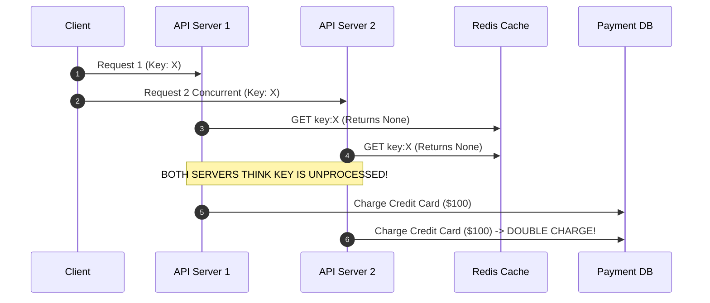
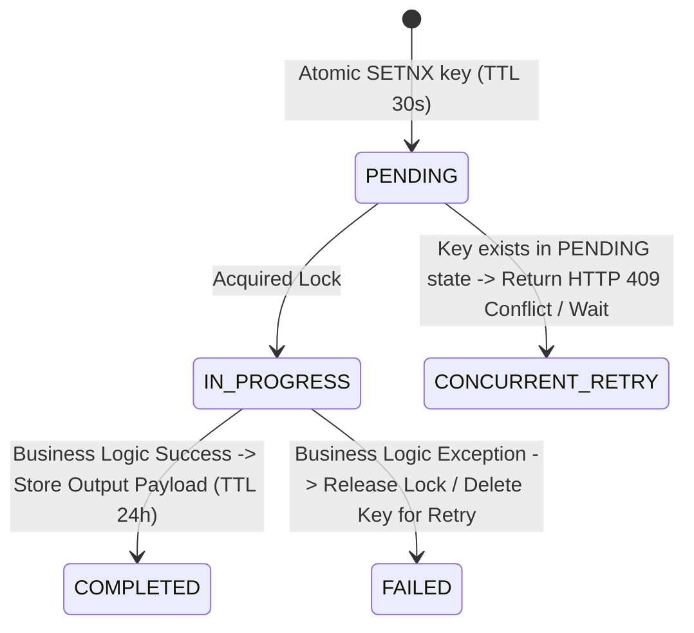

# 1.1.7 Idempotency: Safe Retries in Distributed Systems

## Intuitive Explanation

Imagine you're paying for a coffee using a mobile payment app. You tap "Pay" but your phone's network connection is
unstable. The app shows "Payment failed" and asks you to try again. You tap "Pay" again.

**Without Idempotency:** You might be charged twice for the same coffee—once for the first attempt (which actually
succeeded on the server) and once for the retry.

**With Idempotency:** The system recognizes that this is the same payment request (using a unique ID) and ensures you're
only charged once, even if you retry multiple times.

**Idempotency** is the property that allows an operation to be safely retried without causing unintended side effects.
Executing an idempotent operation multiple times has the same effect as executing it once.

---

## In-Depth Analysis

### Definition

An operation is **idempotent** if performing it multiple times produces the same result as performing it once.

**Mathematical Definition:**

```
f(f(x)) = f(x)
```

**Key Properties:**

- **Safe Retries:** Network failures, timeouts, and client retries don't cause duplicate operations
- **Exactly-Once Semantics:** Achieves "at-least-once delivery" with "exactly-once processing"
- **Client-Generated Keys:** The client provides a unique identifier (idempotency key) for each operation

### Why Idempotency Matters

In distributed systems, failures are common:

- **Network Timeouts:** Request succeeds on server but client times out
- **Client Crashes:** Client crashes after sending request but before receiving response
- **Load Balancer Retries:** Load balancer retries failed requests
- **Service Restarts:** Service restarts and reprocesses queued messages

Without idempotency, these scenarios cause:

- Duplicate charges (payment systems)
- Duplicate orders (e-commerce)
- Duplicate data (database writes)
- Incorrect state (inventory decrements)

### Idempotent vs Non-Idempotent Operations

#### ✅ Idempotent Operations

| Operation           | Why It's Idempotent                       | Example                                                                |
|---------------------|-------------------------------------------|------------------------------------------------------------------------|
| **GET**             | Reading data doesn't change state         | `GET /users/123` → Same result every time                              |
| **PUT**             | Replaces entire resource                  | `PUT /users/123 {name: "John"}` → Same result if repeated              |
| **DELETE**          | Deleting already-deleted resource is safe | `DELETE /users/123` → Same result if repeated                          |
| **Idempotent POST** | Uses idempotency key                      | `POST /payments {idempotency_key: "abc123"}` → Same result if repeated |

#### ❌ Non-Idempotent Operations

| Operation              | Why It's Not Idempotent        | Problem                                                      |
|------------------------|--------------------------------|--------------------------------------------------------------|
| **POST (without key)** | Creates new resource each time | `POST /orders` → Creates new order on each retry             |
| **Increment Counter**  | Adds to value each time        | `POST /counters/increment` → Count increases with each retry |
| **Transfer Money**     | Moves money each time          | `POST /transfer` → Money transferred multiple times          |

---

## Key Concepts / Tradeoffs

### 1. Idempotency Keys

**What:** A unique identifier (usually UUID) provided by the client for each operation.

**How It Works:**

```
1. Client generates UUID: "idem_abc123"
2. Client sends request: POST /payments {amount: 100, idempotency_key: "idem_abc123"}
3. Server checks: Has this key been processed?
   - If NO: Process payment, store result with key
   - If YES: Return cached result (same response as first time)
4. Client retries with same key: Server returns cached result (no duplicate charge)
```

**Key Properties:**

- **Client-Generated:** Client creates the key (not server)
- **Unique Per Operation:** Each distinct operation gets a unique key
- **Time-Limited:** Keys expire after reasonable time (e.g., 24 hours)
- **Scoped:** Usually scoped per client/merchant (different clients can use same key)

### 2. Idempotency Store

**Requirements:**

- **Fast Lookups:** Sub-millisecond latency (Redis, in-memory cache)
- **Durability:** Survive server restarts (Redis with persistence, or database)
- **TTL Support:** Automatically expire old keys
- **High Throughput:** Handle millions of keys per second

**Storage Options:**

| Option              | Pros                           | Cons                               | Use Case                    |
|---------------------|--------------------------------|------------------------------------|-----------------------------|
| **Redis**           | Fast (1ms lookup), TTL support | Memory-bound, eventual consistency | Most common choice          |
| **Database**        | Durable, ACID guarantees       | Slower (10-50ms), more expensive   | When durability is critical |
| **In-Memory Cache** | Fastest (<1ms)                 | Lost on restart                    | Non-critical operations     |

### 3. Idempotency Scope

**Per-Client Scope:**

- Different clients can use the same idempotency key
- Example: Merchant A and Merchant B can both use key "abc123"
- Key format: `{client_id}:{idempotency_key}`

**Global Scope:**

- Keys must be globally unique
- More complex, requires coordination
- Rarely needed

### 4. Response Caching

**Critical:** When an idempotency key is reused, return the **exact same response** as the first request.

**Why:**

- Client expects same result
- Prevents confusion (different status codes, different IDs)
- Maintains consistency

**Implementation:**

```
Store: idempotency:{key} → {status: "COMPLETED", status_code: 200, response_body: {...}, timestamp: 1722340000}
On retry: Return cached response (same status_code, same body)
```

---

## ⚠️ Crucial Production Caveats & Race Condition Edge Cases

### 1. The Concurrent Dual-Request Race Condition
- **Problem:** If a client or mobile app fires two identical HTTP requests with the **same idempotency key** concurrently at the exact same millisecond (e.g., rapid double-tap or client thread retry), both requests might hit two separate API Gateway servers simultaneously!
- **Naïve Bug:** Both server workers query Redis `EXISTS idempotency:key`, both get `False`, and both execute the payment concurrently, causing a **Double Charge** despite using an idempotency key!



### 2. The Idempotency State Machine Solution
To solve concurrent retries and long-running operations, an Idempotency record must implement a **3-State Lock Protocol**:



1. **Atomic Lock Acquisition (`SETNX` / `SET key val NX EX 30`):**
   - Execute an atomic `SET key "PROCESSING" NX EX 30`.
   - Only **one** server will succeed. The second server receives `nil` and must return `HTTP 409 Conflict` or wait/poll for completion.
2. **Handle In-Flight Retries:** If a retry arrives while status is `PROCESSING`, do not execute business logic. Wait up to 3 seconds for completion or inform client "Request is currently processing".
3. **Failure Handling:** If downstream payment processing fails with a transient error (e.g., database timeout), **delete the idempotency key lock** so the client can retry cleanly.

---

## 💡 Real-World Use Cases


### Payment Gateways (Stripe, PayPal)

**Problem:** Network timeouts cause payment retries → duplicate charges

**Solution:**

- Client sends `Idempotency-Key` header with each payment
- Server caches payment result for 24 hours
- Retries return cached result (same payment ID, same status)

**Example:**

```http
POST /v1/charges
Idempotency-Key: abc123-def456-ghi789
{
  "amount": 1000,
  "currency": "usd",
  "source": "tok_visa"
}

# Retry with same key → Returns same charge ID, no duplicate charge
```

### E-commerce Order Creation

**Problem:** User clicks "Place Order" multiple times → duplicate orders

**Solution:**

- Frontend generates idempotency key on button click
- Backend uses key to prevent duplicate orders
- User sees same order confirmation on retry

### Database Writes

**Problem:** Message queue retries cause duplicate inserts

**Solution:**

- Include idempotency key in message
- Check key before processing
- Skip if already processed

### API Rate Limiting

**Problem:** Rate limit errors cause retries → multiple API calls

**Solution:**

- Use idempotency keys for safe retries
- Cached responses don't count against rate limit
- Prevents unnecessary API calls

---

## ✏️ Design Challenge

### Problem

You are designing a payment processing service that handles credit card charges. The service receives payment requests
from mobile apps over unreliable networks (frequent timeouts).

**Requirements:**

1. Prevent duplicate charges when clients retry failed requests
2. Handle 10,000 payments per second
3. Return the same payment ID and status on retries
4. Support idempotency keys for 24 hours

Design an idempotency system that:

- Prevents duplicate charges
- Handles high throughput
- Maintains low latency (<5ms for idempotency check)
- Handles server restarts gracefully

### Solution

#### 🧩 Scenario

- **Service:** Payment processing (credit card charges)
- **Scale:** 10,000 payments/sec
- **Network:** Unreliable (frequent timeouts)
- **Requirement:** Prevent duplicate charges on retries
- **TTL:** 24 hours for idempotency keys

#### ✅ Step 1: Idempotency Key Format

**Client-Generated UUID:**

```
Format: {merchant_id}:{uuid}
Example: merchant_123:550e8400-e29b-41d4-a716-446655440000
```

**Why This Format:**

- Merchant ID scopes keys (different merchants can use same UUID)
- UUID ensures uniqueness
- Easy to parse and validate

#### ✅ Step 2: Idempotency Store Design

**Choice: Redis Cluster**

**Why Redis?**

- **Fast:** <1ms lookup latency
- **TTL Support:** Built-in expiration (24 hours)
- **High Throughput:** 100k+ operations/sec per node
- **Scalable:** Redis Cluster for horizontal scaling

**Data Structure:**

```
Key: idempotency:{merchant_id}:{uuid}
Value: JSON {
  "payment_id": "pay_abc123",
  "status": "succeeded",
  "amount": 1000,
  "response": {...},
  "created_at": 1699123456
}
TTL: 86400 seconds (24 hours)
```

**Redis Cluster Configuration:**

- **Nodes:** 6 nodes (3 masters + 3 replicas)
- **Sharding:** By merchant_id hash
- **Memory:** 64 GB per node (384 GB total)
- **Persistence:** RDB snapshots every 5 minutes (for durability)

#### ✅ Step 3: Idempotency Check Flow

```
1. Client Request:
   POST /payments
   Headers: {
     "Idempotency-Key": "merchant_123:550e8400-e29b-41d4-a716-446655440000"
   }
   Body: {amount: 1000, card_token: "tok_abc"}

2. Server Processing:
   a. Extract idempotency key from header
   b. Check Redis: GET idempotency:merchant_123:550e8400...
   c. If EXISTS:
      → Return cached response (same payment_id, same status)
   d. If NOT EXISTS:
      → Process payment
      → Store result in Redis: SET idempotency:merchant_123:550e8400... {result} EX 86400
      → Return response

3. Client Retry (same key):
   → Server finds cached result
   → Returns same response (no duplicate charge)
```

#### ✅ Step 4: Handling Concurrent Requests

**Problem:** Two requests with same key arrive simultaneously

**Solution: Distributed Lock**

```
1. Try to acquire lock: SETNX lock:idempotency:{key} {server_id} EX 10
2. If lock acquired:
   → Check Redis for existing result
   → If not exists, process payment
   → Store result
   → Release lock
3. If lock not acquired:
   → Wait 100ms
   → Retry check (first request may have completed)
```

**Alternative: Atomic Check-and-Set**

```
Use Redis Lua script for atomic operation:
- Check if key exists
- If not, set key with payment result
- Return result
```

#### ✅ Step 5: Durability and Recovery

**Problem:** Redis restarts → lose idempotency keys → duplicate charges

**Solution: Hybrid Approach**

**Primary: Redis (Fast)**

- Handle 99% of requests (<1ms latency)
- RDB snapshots every 5 minutes

**Fallback: Database (Durable)**

- Store idempotency keys in PostgreSQL
- Check database if Redis miss
- Async write to database (don't block payment)

**Flow:**

```
1. Check Redis (fast path)
2. If Redis miss:
   a. Check PostgreSQL (slow path, 10-20ms)
   b. If found in DB:
      → Return cached result
      → Warm Redis (async)
   c. If not found:
      → Process payment
      → Write to Redis + PostgreSQL (async)
```

#### ✅ Step 6: Performance Optimization

**Batching:**

- Batch Redis GET operations (pipeline)
- Reduces network round-trips

**Caching Strategy:**

- Hot keys (frequent retries) stay in Redis
- Cold keys expire after 24 hours
- Memory-efficient (only active keys stored)

**Monitoring:**

- Idempotency hit rate (should be ~5-10% for retries)
- Redis memory usage
- Database fallback rate

#### ✅ Complete Implementation

```python
def process_payment(request):
    idempotency_key = request.headers.get('Idempotency-Key')
    
    # Step 1: Check Redis (fast path)
    cached = redis.get(f"idempotency:{idempotency_key}")
    if cached:
        return json.loads(cached)  # Return cached response
    
    # Step 2: Acquire distributed lock
    lock_key = f"lock:idempotency:{idempotency_key}"
    if not redis.setnx(lock_key, server_id, ex=10):
        # Another request is processing, wait and retry
        time.sleep(0.1)
        cached = redis.get(f"idempotency:{idempotency_key}")
        if cached:
            return json.loads(cached)
    
    try:
        # Step 3: Double-check (race condition protection)
        cached = redis.get(f"idempotency:{idempotency_key}")
        if cached:
            return json.loads(cached)
        
        # Step 4: Check database (fallback)
        db_result = database.get_idempotency_result(idempotency_key)
        if db_result:
            # Warm Redis cache
            redis.setex(f"idempotency:{idempotency_key}", 86400, json.dumps(db_result))
            return db_result
        
        # Step 5: Process payment (not cached)
        payment_result = charge_credit_card(request.body)
        
        # Step 6: Store result
        result = {
            "payment_id": payment_result.id,
            "status": payment_result.status,
            "amount": payment_result.amount,
            "response": payment_result.to_dict()
        }
        
        # Store in Redis (primary)
        redis.setex(f"idempotency:{idempotency_key}", 86400, json.dumps(result))
        
        # Store in database (async, for durability)
        async_write_to_db(idempotency_key, result)
        
        return result
        
    finally:
        # Release lock
        redis.delete(lock_key)
```

#### ⚖️ Trade-offs Summary

| Decision                  | What We Gain             | What We Sacrifice                    |
|---------------------------|--------------------------|--------------------------------------|
| **Redis Primary Store**   | Fast lookups (<1ms)      | Memory cost, eventual consistency    |
| **Database Fallback**     | Durability               | Slower lookups (10-20ms)             |
| **24-Hour TTL**           | Prevents old key reuse   | Memory usage (keys stored for 24h)   |
| **Client-Generated Keys** | Simple, no coordination  | Client must generate UUIDs           |
| **Distributed Lock**      | Prevents race conditions | Adds complexity, potential deadlocks |

#### ✅ Final Summary

**Architecture:**

- **Primary Store:** Redis Cluster (fast, <1ms)
- **Fallback Store:** PostgreSQL (durable, 10-20ms)
- **Locking:** Distributed lock for concurrent requests
- **TTL:** 24 hours

**Performance:**

- **Idempotency Check:** <1ms (Redis hit), 10-20ms (DB fallback)
- **Throughput:** 10,000 payments/sec (handled by Redis Cluster)
- **Hit Rate:** ~5-10% (retries)

**Result:**

- ✅ Prevents duplicate charges
- ✅ Handles high throughput
- ✅ Low latency (<5ms for 99% of requests)
- ✅ Survives Redis restarts (database fallback)

