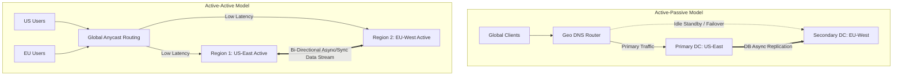
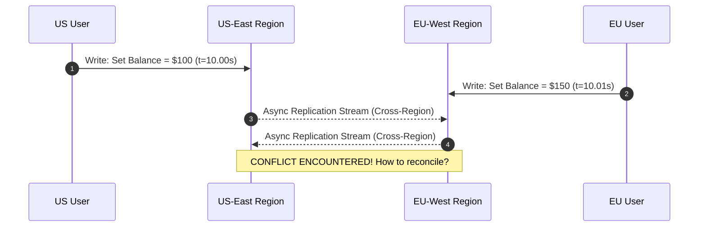
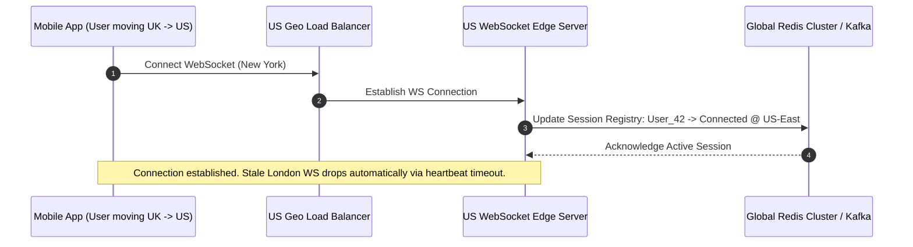

# 1.2.6 Multi-Region Active-Active Systems Architecture

## Intuitive Explanation

Imagine a global ridesharing company operating in New York, London, and Tokyo. 

If all user requests had to travel across the ocean to a single primary database in New York (Active-Passive architecture), users in Tokyo would experience horrible latency (250ms+ per click). Worse, if the New York data center went down, the entire global business would grind to a halt.

**Multi-Region Active-Active Architecture** deploys fully functional system stacks across multiple geographically distributed regions simultaneously. Users interact with the region closest to them, and all regions continuously replicate state with each other in real-time.

```
[ User in US ]      ---> [ US Data Center (Active) ] \
                                                     <== Sync Replication ==> [ Global Shared State ]
[ User in EU ]      ---> [ EU Data Center (Active) ] /
```

---

## In-Depth Analysis

### 1. Architectural Patterns: Active-Passive vs. Active-Active



### 2. Global Traffic Routing Strategies

1. **Anycast BGP Routing:**
   - Single IP address advertised globally via BGP (Border Gateway Protocol).
   - Network routers direct traffic to the nearest data center topologically.
   - Used by Cloudflare, AWS Route53, and Google Front End.
2. **GeoDNS & Latency-Based Routing:**
   - Resolves domain queries to specific regional IP addresses based on client location or lowest latency measurements.
3. **Health-Aware Failover:**
   - Global load balancers automatically withdraw IP routes when a regional health check fails, diverting traffic within seconds.

---

## Conflict Resolution & Data Synchronization Mechanics

When two users update the same record concurrently in different data centers (e.g., in US-East and EU-West), an **Active-Active write collision** occurs.



### Strategies for Handling Multi-Region Conflicts

1. **Last-Write-Wins (LWW):**
   - Resolves conflicts using client/server wall-clock timestamps.
   - **Risk:** Clock drift between servers can cause valid newer updates to be accidentally overwritten by older ones.
2. **Conflict-free Replicated Data Types (CRDTs):**
   - Data structures mathematically designed so that concurrent updates on independent nodes always converge to the exact same state without locks or coordination.
   - **State-based (CvRDT):** Merges full states using commutative and idempotent merge operations (e.g., LWW-Element-Set, PN-Counters).
   - **Operation-based (CmRDT):** Replicates atomic operations over reliable networks.
3. **Partitioning by Region (Data Residency & Home-Regioning):**
   - Assigns ownership of specific user data to a designated primary home region (e.g., US users write to US-East).
   - Reads occur anywhere, but cross-region writes are routed back to the user's home region, eliminating cross-DC write conflicts.
4. **Global Distributed Consensus (Spanner / CockroachDB):**
   - Uses multi-region Raft groups or Paxos clusters with TrueTime or Hybrid Logical Clocks (HLC) to maintain strict serializability globally.

---

## Multi-Region Trade-Off Matrix

| Dimension | Active-Passive | Active-Active (LWW) | Active-Active (CRDT/Home-Region) | Distributed SQL Active-Active |
| :--- | :--- | :--- | :--- | :--- |
| **Write Latency** | Low (Single DC) | Ultra-Low (Local DC) | Ultra-Low (Local DC) | Higher (Cross-DC Raft Quorum) |
| **Read Latency** | Low | Ultra-Low | Ultra-Low | Ultra-Low (Stale/Follower Read) |
| **RPO (Recovery Point)** | $> 0$ (Async loss) | Potential Data Conflict | 0 (No conflicts) | 0 (Zero data loss) |
| **RTO (Recovery Time)** | Minutes (Failover) | $< 1$ Second (Instant) | $< 1$ Second (Instant) | $< 1$ Second (Automated) |
| **Operational Complexity** | Medium | High | Very High | High |

---

## 💡 Real-World Architectural Case Studies

- **Netflix Chaos & Global Resilience:** Uses AWS Multi-Region Cassandra with active-active asynchronous replication. Netflix designed custom fallback mechanisms so if one region fails, traffic shifts instantly to another.
- **Uber Ringpop & Geohashing:** Routes driver and rider socket connections to regional clusters bounded by geographical geohash cells, minimizing cross-region locking.
- **Stripe Multi-Region Ledger:** Uses home-region pinning for account data combined with synchronous distributed consensus for balance transfers to avoid double-spend risks.

---

## ✏️ Design Challenge

### Problem
You are designing a global user notification service. A user can trigger notifications from anywhere in the world, and they must be delivered within 5 seconds to recipient devices.

1. Would you use an Active-Active or Active-Passive multi-region deployment?
2. How would you handle WebSocket connections when a user travels from London to New York while active?

### Solution

#### 1. Deployment Choice: Active-Active Architecture
- **Choice:** ✅ **Multi-Region Active-Active Deployment**
- **Reasoning:**
  - Notification publishing and delivery require low latency globally.
  - Push notifications are stateless and idempotent (using a unique `notification_id`).
  - If the EU region experiences an outage, US or APAC regions can immediately consume messages from Kafka/EventHubs and push to Apple APNs / Google FCM servers without downtime.

#### 2. Cross-Region WebSocket Connection Handoff

- **Handoff Steps:**
  1. The client detects network disruption during travel and reconnects to the nearest Anycast IP (US-East).
  2. The new US WebSocket Gateway authenticates the JWT token and writes a **Session Location Record** (`user_id -> region_id, gateway_id`) to a global Redis cluster with a short TTL (15s heartbeat).
  3. The UK WebSocket Gateway detects a missed client ping/heartbeat and terminates the stale socket, ensuring single-gateway message routing.
