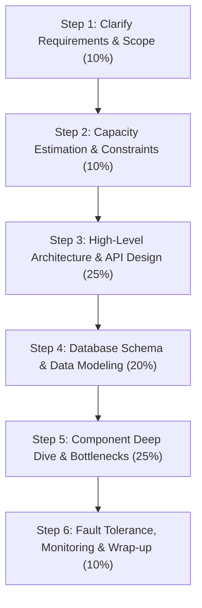
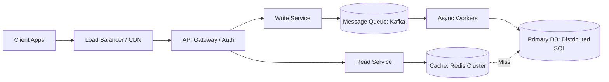

# 1.2.7 The Master HLD System Design & Interview Framework

## Intuitive Explanation

Designing a high-level system in an engineering interview or real-world architectural design review is like building a skyscraper. 

If you start picking out window blinds before calculating the foundation loads, the building will collapse. 

A great system designer uses a **repeatable, structured framework** to systematically decompose complex, ambiguous requirements into scalable, fault-tolerant, and maintainable software architectures.

---

## The 6-Step HLD Master Framework



---

## Detailed Step-by-Step Execution Guide

### Step 1: Clarify Requirements & Scope (5–8 minutes)

Never jump straight into drawing boxes and arrows. Clarify **Functional** and **Non-Functional** requirements explicitly.

#### Functional Requirements (What the system does)
- Focus on the core 3–5 user features.
- Define what is explicitly **out of scope**.
- *Example (Twitter):* Users can post tweets, follow users, view a home timeline, and search tweets. (Out of scope: Direct messaging, ads targeting).

#### Non-Functional Requirements (How the system performs)
- **Scale:** Active Users (DAU/MAU), Read vs Write ratios.
- **Latency SLAs:** Low latency vs Batch processing (e.g., Timeline read $< 100\text{ms}$, Post tweet $< 500\text{ms}$).
- **Availability vs Consistency (CAP/PACELC):** $99.99\%$ (Four Nines $= 52.6$ min downtime/year) vs $99.999\%$ (Five Nines $= 5.26$ min downtime/year).
- **Data Durability & Retention:** Zero data loss vs acceptable eventual loss.

---

### Step 2: Capacity Estimation & Back-of-the-Envelope Math (5 minutes)

Use standardized scale benchmarks to estimate Traffic, Storage, and Bandwidth requirements.

#### 1. Quick Scale Cheat Sheet
- $1 \text{ Million DAU} \approx 12 \text{ Requests/sec}$ (assuming 1 req/user/day average).
- $100 \text{ Million DAU} \approx 1,200 \text{ Requests/sec}$ average $\rightarrow$ Peak traffic (3x–5x) $\approx 4,000\text{–}6,000 \text{ QPS}$.
- $1 \text{ Byte} = 8 \text{ bits}$; $1 \text{ KB} = 10^3 \text{ Bytes}$; $1 \text{ MB} = 10^6 \text{ Bytes}$; $1 \text{ GB} = 10^9 \text{ Bytes}$; $1 \text{ TB} = 10^{12} \text{ Bytes}$; $1 \text{ PB} = 10^{15} \text{ Bytes}$.

#### 2. Calculation Template
```
Write QPS = (DAU * Writes per User per Day) / 86,400 seconds
Read QPS  = (DAU * Reads per User per Day) / 86,400 seconds
Storage Per Day = (Write QPS * 86,400) * Size per Payload
Network Bandwidth Ingress = Write QPS * Size per Write Payload
Network Bandwidth Egress  = Read QPS * Size per Read Payload
Memory Cache Needed = 20% of Daily Read Volume (80/20 Rule)
```

---

### Step 3: High-Level Architecture Block Diagram & API Contracts (10–12 minutes)

Draw the fundamental end-to-end data flow: Client $\rightarrow$ Load Balancer $\rightarrow$ API Gateway $\rightarrow$ Microservices $\rightarrow$ Caching $\rightarrow$ Primary Storage $\rightarrow$ Async Processing.



#### Define Key API Endpoints
- Define REST, gRPC, or GraphQL contracts with explicit request/response schemas and HTTP methods.

```json
POST /v1/tweets
Headers: { "Authorization": "Bearer <JWT>", "X-Idempotency-Key": "uuid-v4" }
Request Body:
{
  "content": "Building scalable systems with HLD Handbook!",
  "media_ids": ["media_9921"]
}
Response: HTTP 202 Accepted
{
  "tweet_id": "184920491029401",
  "created_at": "2026-07-30T12:00:00Z",
  "status": "PROCESSING"
}
```

---

### Step 4: Database Schema & Data Storage Strategy (8 minutes)

1. **Select Storage Paradigm:** Relational (RDBMS), NoSQL Document, Columnar (Cassandra), Time-Series, Key-Value, or Vector DB.
2. **Define Data Access Patterns:** Read-heavy vs Write-heavy, Random vs Sequential access.
3. **Partitioning / Sharding Key Selection:** Choose keys that distribute write load evenly while avoiding cross-shard joins (e.g., `user_id` vs `timestamp`).

---

### Step 5: Component Deep Dive & Bottleneck Resolution (10–12 minutes)

Focus on the hardest 1–2 technical bottlenecks in the system:
- **Hot Key / Celebrity Problem:** How to handle 100M reads for a single viral post (Cache splitting, local L1 cache, read replicas).
- **Distributed Transactions & Consistency:** Sagas vs 2PC vs Eventual Consistency.
- **Real-Time Delivery:** WebSockets vs Server-Sent Events (SSE) vs Long Polling.
- **Concurrency & Locking:** Optimistic Locking (versioning) vs Pessimistic Locking (Redis Redlock).

---

### Step 6: Fault Tolerance, Observability & Trade-offs (5 minutes)

1. **Failure Modes & Disaster Recovery:** What happens if the Primary DB crashes? (Automated election, multi-DC failover, RPO/RTO targets).
2. **Rate Limiting & Load Shedding:** Protecting downstream services during traffic spikes.
3. **Observability Strategy:** Metrics (Prometheus), Distributed Tracing (OpenTelemetry), Centralized Logging (ELK).
4. **Trade-offs Summary:** Summarize "Why Option A was chosen over Option B".

---

## 💡 System Design Evaluation Checklist

| Category | Must-Have Design Verification |
| :--- | :--- |
| **Requirements** | Are functional scope and non-functional SLAs clearly documented? |
| **Math Check** | Are storage, memory cache, and bandwidth estimates realistic? |
| **Single Point of Failure** | Is every single component redundant ($N+1$ or active-active)? |
| **Database Scalability** | Is there a clear sharding key, index strategy, and read/write split? |
| **Idempotency** | Do write APIs accept idempotency keys to handle network retries safely? |
| **Security** | Is mTLS used service-to-service and JWT used for user authentication? |

---

## ✏️ Design Challenge

### Scenario
An interviewer asks: *"Design an online ticket booking system like Ticketmaster for high-demand concert tickets."* How do you structure your first 10 minutes?

### Solution Strategy
1. **First 2 minutes (Step 1):** Clarify scale (e.g., 50,000 seats sold out in 10 seconds, 1M users hitting 'Buy' button simultaneously). State out-of-scope items (e.g., event creator marketing dashboard).
2. **Next 3 minutes (Step 2):** Math: Peak Write QPS $= 1,000,000 \text{ requests} / 10 \text{ seconds} = 100,000 \text{ write QPS}$. State bottleneck: Primary RDBMS cannot handle 100,000 concurrent row lock updates for 50,000 seats without deadlocks.
3. **Next 5 minutes (Step 3 & 4):** Outline high-level architecture featuring an **In-Memory Reservation Queue (Redis Lua scripts / Distributed Lock)** to hold seats for 10 minutes, decoupling database writes using Kafka workers.
