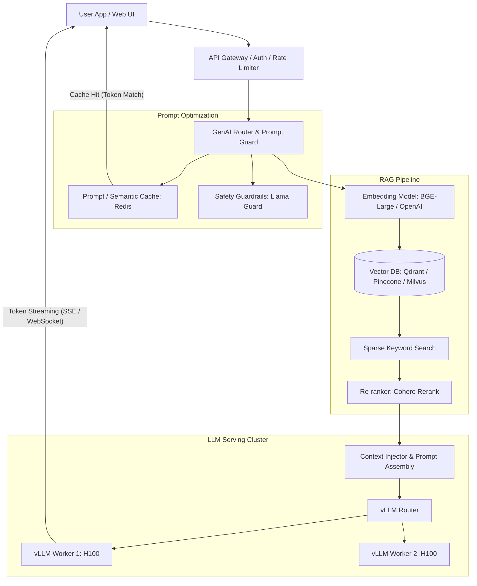
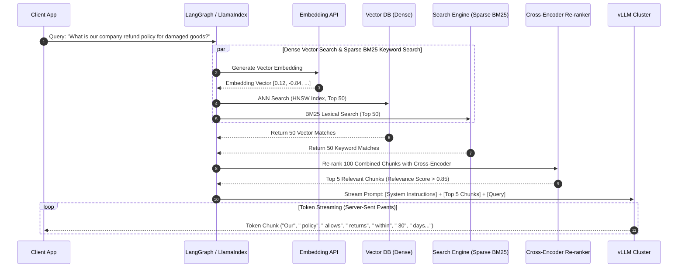

# 2.7.1 Generative AI & LLM Inference RAG Architecture Deep Dive

## Intuitive Explanation

Deploying Large Language Models (LLMs) in production is fundamentally different from serving traditional microservices.

Traditional web APIs spend most of their execution time waiting for I/O (database queries, network calls). LLMs, on the other hand, are extremely **GPU compute-bound** and **memory bandwidth-bound**. Generating a single word (token) requires loading hundreds of billions of model parameters into GPU VRAM for every single token step!

To build enterprise-grade AI systems, architects combine two core patterns:
1. **LLM Serving Engines:** Optimizing GPU VRAM usage and batching (vLLM, TensorRT-LLM, PagedAttention).
2. **Retrieval-Augmented Generation (RAG):** Grounding LLM responses in real-time private company knowledge using Vector Search and Hybrid Retrieval.

```
[ User Query ] ---> [ Hybrid Retrieval (Vector DB + BM25) ] ---> [ Top-K Context Docs ] 
                                                                         |
                                                                         v
[ Streaming Token Response ] <--- [ LLM Inference Engine (vLLM) ] <--- [ Prompt + Context ]
```

---

## In-Depth Analysis

### 1. High-Level Enterprise GenAI Architecture



---

## Key LLM Serving Optimization Techniques

### 1. KV Cache & PagedAttention (vLLM)
- **Problem:** During token generation (autoregressive decoding), computing Attention requires storing Key and Value matrices for all previous tokens in GPU memory. Storing this naively causes massive VRAM fragmentation and Out-Of-Memory (OOM) crashes.
- **Solution (PagedAttention):** Inspired by Virtual Memory Paging in OS design. Divides the KV Cache into fixed-size physical blocks, allocating memory dynamically on demand without requiring contiguous VRAM allocation. This increases GPU memory utilization from $20\%$ to over $96\%$, doubling system throughput!

```mermaid
flowchart LR
    subgraph Logical KV Blocks
        L0[Block 0: Tokens 0-15] --> L1[Block 1: Tokens 16-31] --> L2[Block 2: Tokens 32-47]
    end
    
    subgraph Page Table
        L0 --> P3[Physical VRAM Page 3]
        L1 --> P7[Physical VRAM Page 7]
        L2 --> P1[Physical VRAM Page 1]
    end

    subgraph Non-Contiguous GPU Memory (VRAM)
        P1
        P3
        P7
    end
```

### 2. Continuous Batching (Iteration-Level Scheduling)
- Traditional batching waits for **all** requests in a batch to finish before processing new ones (causing GPU idle time because generation lengths vary).
- **Continuous Batching:** Schedules new incoming queries into the batch on an *iteration-by-iteration* basis as soon as an existing query outputs an `<END>` token.

### 3. Prompt Caching (Prefix Caching)
- System prompts, RAG document contexts, and chat histories often share identical prefixes across users.
- Caching the KV Cache states of common prompt prefixes in GPU memory bypasses expensive re-computation of prefill phases, dropping time-to-first-token (TTFT) by up to $80\%$.

---

## Retrieval-Augmented Generation (RAG) Architecture



### Dense vs. Sparse vs. Hybrid Search

| Search Type | Algorithm / Tech | Strengths | Weaknesses |
| :--- | :--- | :--- | :--- |
| **Dense Search** | Vector DBs (Qdrant, Pinecone, Milvus) using HNSW / IVF-PQ | Captures semantic intent & synonyms ("automobile" matches "car"). | Misses exact part numbers, product SKUs, code identifiers. |
| **Sparse Search** | Elasticsearch / Meilisearch using BM25 / TF-IDF | Excellent for exact keyword matching, acronyms, and product IDs. | Fails when query uses synonyms without exact word matches. |
| **Hybrid Search** | Reciprocal Rank Fusion (RRF) combining Dense + Sparse | **Best Accuracy:** Merges semantic meaning with exact keyword precision. | Requires running two search indexes concurrently. |

---

## 💡 Real-World Architectural Case Studies

- **GitHub Copilot Code Completion:** Uses custom local prompt caching engines combined with low-latency LLM serving (<100ms TTFT) to deliver real-time inline code suggestions.
- **Perplexity AI Search:** Combines multi-step agentic query decomposition, parallel hybrid search over tens of billions of web pages, and cross-encoder re-ranking before streaming answers via WebSockets.

---

## ✏️ Design Challenge

### Problem
You are designing an Enterprise AI Assistant for a bank with 50,000 employees querying 10 million internal PDF documents.
- Target SLAs: Time-To-First-Token (TTFT) $< 400\text{ms}$; Token Generation Speed $> 30 \text{ tokens/sec/user}$.
- Security Requirement: Employees must only retrieve documents they have explicit active Directory permission (RBAC) to read.

### Solution

#### 1. Security & RBAC Metadata Filtering
- Store document access control lists (ACLs) directly inside the Vector DB payload metadata (e.g., `user_groups: ["FINANCE_DEPT", "LEVEL_3_EXEC"]`).
- When querying Qdrant/Pinecone, attach a **Pre-filtering Payload Constraint** to the ANN query so that unauthorized vectors are excluded before distance calculations occur.

#### 2. SLA Optimization Strategy
- **TTFT Optimization ($<400\text{ms}$):**
  1. Use semantic caching (Redis) for identical user queries.
  2. Implement **Prefix Caching** on the vLLM serving cluster for the fixed system prompt.
  3. Limit RAG context window size to top 3 re-ranked chunks (~1,500 tokens).
- **Token Generation Optimization ($>30\text{ tokens/sec}$):**
  1. Deploy FP8 / INT4 quantized LLM weights (AWQ / GPTQ) to reduce VRAM memory footprint and accelerate GPU matrix multiplications.
  2. Utilize **Speculative Decoding** (using a small draft model like Llama-3-8B to draft 5 tokens ahead, verified in parallel by the target Llama-3-70B model).
