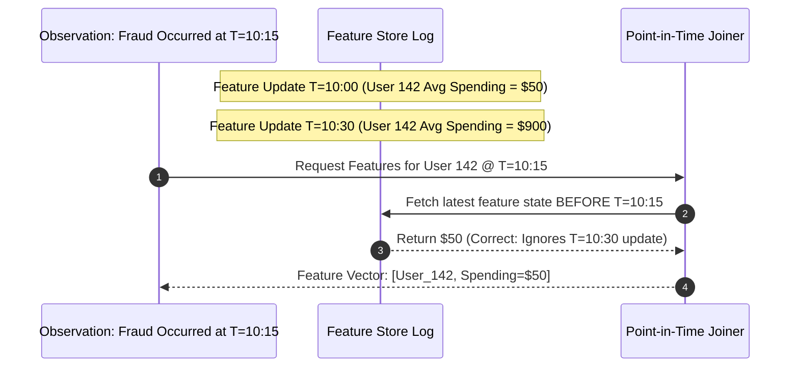
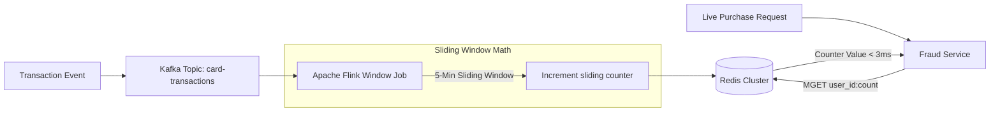

# 2.7.2 Machine Learning Feature Store & Real-Time ML Pipelines

## Intuitive Explanation

In traditional machine learning, data scientists spend up to $80\%$ of their time rewriting data transformation pipelines.

More dangerously, a phenomenon known as **Training-Serving Skew** occurs when features used during model training (e.g., computed offline via Spark once a day) differ from features calculated live during model inference (e.g., computed in Python in real-time).

A **Feature Store** acts as a centralized data platform for machine learning. It serves two distinct interfaces from a single source of truth:
1. **Offline Store (Batch):** High-throughput storage (Delta Lake / Snowflake) for historical feature extraction and point-in-time correct training data generation.
2. **Online Store (Real-Time):** Low-latency key-value storage (Redis / DynamoDB) serving feature vectors to online models under $10\text{ms}$.

```
[ Raw Event Streams / Databases ] 
               |
               v
[ Feature Computation Pipeline (Flink / Spark) ]
               |
      +--------+--------+
      |                 |
      v                 v
[ Online Store ]   [ Offline Store ]
(Redis <10ms)      (S3/Snowflake)
      |                 |
      v                 v
[ Live Inference ] [ Model Training ]
```

---

## In-Depth Analysis

### 1. High-Level Feature Store Architecture

```mermaid
flowchart TD
    subgraph Data Ingestion
        StreamSources[Kafka / Event Streams] --> Flink[Real-Time Engine: Apache Flink]
        BatchSources[Data Lake / DB Copies] --> Spark[Batch Engine: Apache Spark]
    end

    subgraph Feature Store Engine (e.g. Feast / Tecton)
        Flink --> Registry[Central Feature Registry & Metadata Catalog]
        Spark --> Registry
        
        Flink -- Dual-Write Streaming Features --> OnlineDB[(Online Store: Redis Cluster / DynamoDB)]
        Spark -- Batch Bulk Load --> OfflineDB[(Offline Store: Delta Lake / S3 / BigQuery)]
    end

    subgraph Serving Layer
        OnlineDB --> ServingAPI[Online Feature Serving API < 5ms]
        OfflineDB --> TrainingAPI[Offline Historical Feature Extractor]
    end

    ServingAPI --> RealTimeModel[Real-Time Fraud Model / Recommendation Engine]
    TrainingAPI --> TrainPipeline[Model Training & Hyperparameter Tuning]
```

---

## Core Feature Store Concepts

### 1. Point-in-Time Correctness (Time-Travel Joins)
When generating training datasets from historical data, combining features naive of timestamps causes **Data Leakage** (using future information to predict past events).

Feature Stores execute **As-Of Joins** (Point-in-Time joins): For every entity observation at timestamp $T_{obs}$, the feature store joins the exact feature values that were valid at timestamp $T_{obs} - \epsilon$, strictly excluding any feature updates that occurred after $T_{obs}$.



### 2. Dual Storage Engine Strategy

| Dimension | Online Feature Store | Offline Feature Store |
| :--- | :--- | :--- |
| **Primary Technology** | Redis, Amazon DynamoDB, Cassandra | AWS S3, Delta Lake, Snowflake, BigQuery |
| **Access Latency** | $< 5\text{ms}$ (Sub-10ms SLA) | Seconds to Hours |
| **Access Pattern** | Single entity key lookup (`GET user:99281`) | Bulk columnar scans over billions of rows |
| **Data Retention** | Latest snapshot of features only | Full immutable historical time-series log |

---

## 💡 Real-World Architectural Case Studies

- **Uber Michelangelo:** Uber's proprietary ML platform built on early feature store concepts. Serves billions of feature lookups per second for real-time ETA calculation, surge pricing, and driver matching.
- **DoorDash Real-Time Personalization:** Uses Redis as an online feature store fed by Apache Flink streams to update restaurant recommendations dynamically based on a user's current browsing session.

---

## ✏️ Design Challenge

### Problem
You are designing a real-time credit card fraud detection system processing 50,000 transactions per second.
- Requirement: The model needs to evaluate the feature `user_transaction_count_last_5_minutes` in under $15\text{ms}$ per transaction.
- How do you compute and serve this streaming feature without overloading the primary database?

### Solution

#### Architecture Flow


1. **Streaming Sliding Window (Apache Flink):** Flink consumes transaction events from Kafka, maintaining a 5-minute sliding window grouped by `user_id`.
2. **Online Feature Store (Redis):** Flink emits window count updates to Redis using `SET user:1029:txn_count_5m <val> EX 300` (5-minute expiration).
3. **Inference Serving:** The Fraud Service queries Redis using pipelined `MGET` calls. Feature retrieval completes in $< 3\text{ms}$, well within the $15\text{ms}$ total SLA.
