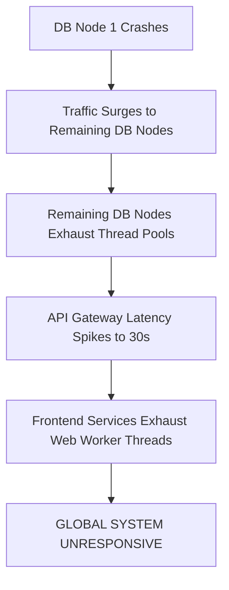
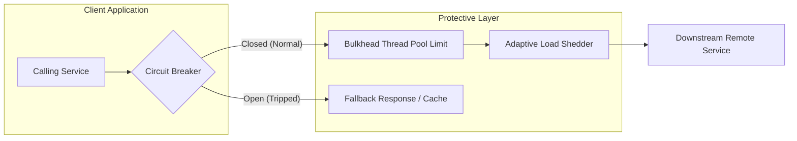
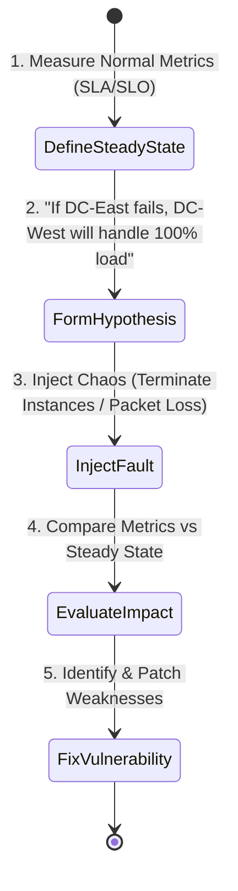
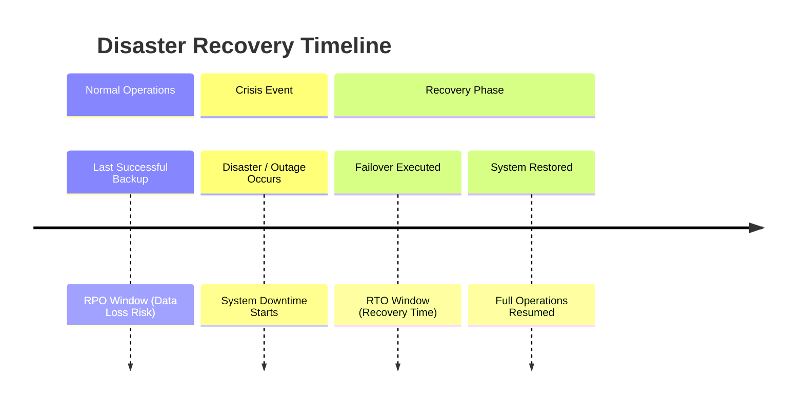
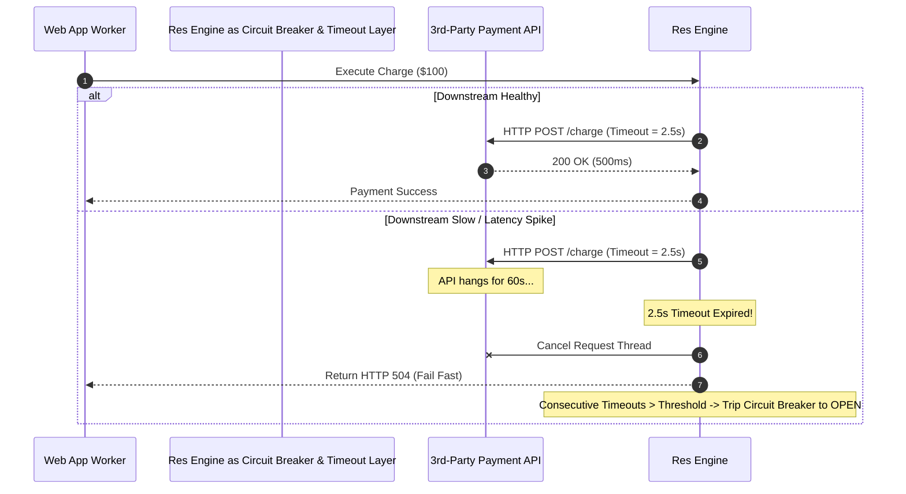

# 2.8.1 Resilience Engineering, Chaos Testing & Cascading Failure Prevention

## Intuitive Explanation

In large-scale distributed systems, failures are not an anomaly—they are an absolute certainty.

With thousands of microservices, cloud instances, network links, and databases running concurrently, at least one component is failing right now. **Resilience Engineering** is the practice of designing systems to withstand these failures gracefully without causing total outages.

Think of resilience like a modern navy ship:
- **Bulkheads:** If one compartment fills with water, watertight doors seal it off so the ship doesn't sink.
- **Circuit Breakers:** If an electrical line shorts out, the breaker trips to prevent a house fire.
- **Chaos Engineering:** Injecting controlled experiments (like deliberately tripping a breaker) during daylight hours to verify that safety mechanisms actually work before an actual emergency hits.

---

## In-Depth Analysis

### 1. The Anatomy of Cascading Failures

A **cascading failure** occurs when a fault in a single minor component triggers a chain reaction that knocks out the entire infrastructure.

---

## Core Resilience Patterns

### 1. Circuit Breaker Pattern (Netflix Hystrix / Resilience4j / Envoy)
Monitors downstream call failures. Operates as a state machine:
- **Closed State:** Requests flow normally. Failures increment a failure counter.
- **Open State:** If failure rate exceeds a threshold (e.g., $>50\%$ error rate over 10s), the breaker trips **OPEN**. All incoming calls fail-fast immediately without hitting the downstream service.
- **Half-Open State:** After a sleep window (e.g., 30s), a trial request is allowed through. If it succeeds, the breaker resets to **Closed**; if it fails, it returns to **Open**.

### 2. Bulkhead Pattern
Isolates critical resources into dedicated pools so that a failure in one non-critical domain cannot starve the rest of the application.
- *Example:* Allocate separate thread pools or HTTP connection pools for "Payment Processing" vs "User Profile Avatar Loading".

### 3. Load Shedding & Adaptive Rate Limiting
- When a service CPU or RAM utilization crosses $85\%$, the system enters **Load Shedding** mode, immediately dropping low-priority background traffic (e.g., telemetry batch logs, recommendations) with `HTTP 539 / 429` to preserve capacity for critical user actions (e.g., checkout).

---

## Chaos Engineering Principles

Co-founded by Netflix (Chaos Monkey), Chaos Engineering tests system resilience by proactively injecting failures into production environment sandboxes.

### Chaos Experiment Taxonomy
1. **Infrastructure Faults:** Killing random Kubernetes pods or AWS EC2 instances (Chaos Monkey).
2. **Network Faults:** Simulating high latency, packet loss, or DNS resolution failures (Chaos Mesh / Gremlin).
3. **State Faults:** Inducing primary database failovers or cache cluster partition events.

---

## Disaster Recovery Metrics: RPO and RTO

- **RPO (Recovery Point Objective):** The maximum tolerable amount of data loss measured in time. (e.g., $\text{RPO} = 0$ means zero data loss allowed).
- **RTO (Recovery Time Objective):** The maximum acceptable duration of system downtime. (e.g., $\text{RTO} < 1 \text{ minute}$ means failover must complete within 60 seconds).

---

## 💡 Real-World Architectural Case Studies

- **Amazon Prime Day Load Shedding:** Amazon checkout services use dynamic priority queues. Under extreme peak load, non-essential calls like personalized item recommendations are shed automatically, returning fallback static recommendations while keeping the payment button active.
- **GitHub November Outage Mitigation:** Implemented automated MySQL read-replica failovers combined with aggressive circuit breaking on search indexing pipelines to prevent total site crashes during primary database degradations.

---

## ✏️ Design Challenge

### Problem
You are designing a critical microservice that calls a 3rd-party Payment Gateway API. The 3rd-party API occasionally experiences intermittent 60-second latency spikes, which causes your web application threads to freeze and crash.

Design a resilient client integration that protects your service.

### Solution

1. **Strict Request Timeout:** Wrap all outgoing HTTP calls in a strict $2.5\text{s}$ socket timeout to release worker threads immediately.
2. **Circuit Breaker:** Configure Resilience4j with a $50\%$ slow-call threshold. If downstream calls take $>2\text{s}$, trip the breaker open for $30\text{s}$.
3. **Idempotency & Retries:** Combine timeouts with exponential backoff and jitter, using a unique `idempotency_key` on retries to ensure double-charging never occurs.
