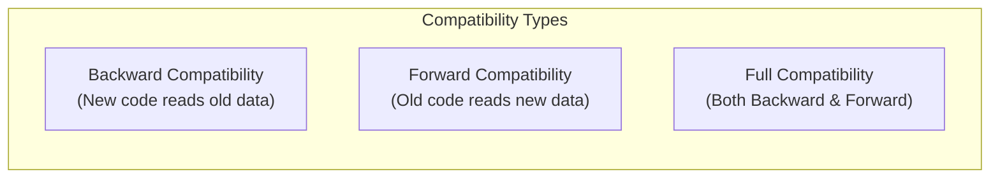
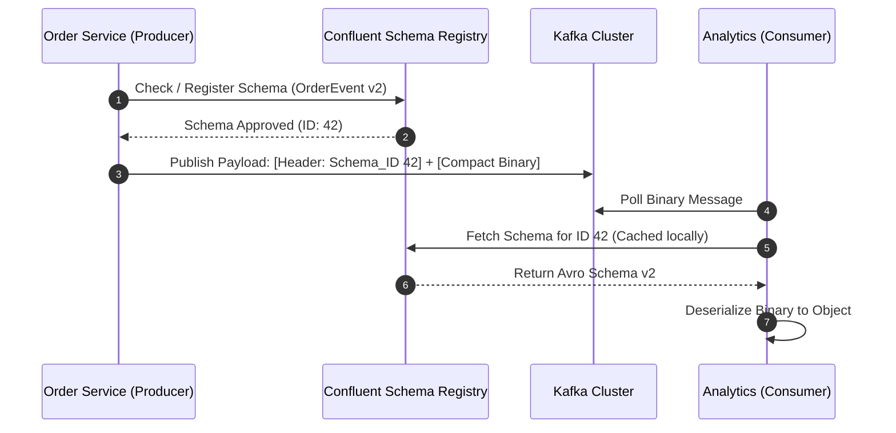
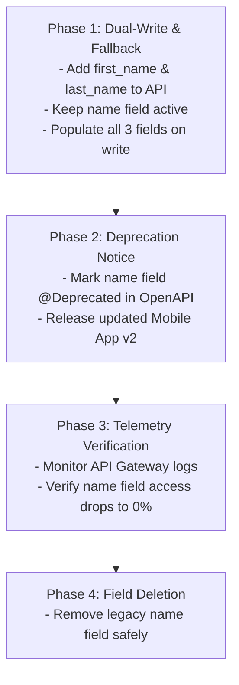

# 2.9.1 API Design, Schema Evolution & Contract Compatibility

## Intuitive Explanation

In a microservices architecture, services do not exist in isolation. They communicate constantly using API contracts.

Imagine sending a physical letter through the mail formatted in English, but the recipient suddenly receives the letter translated into hieroglyphics without warning. Communication fails completely.

Similarly, when software engineers change a database schema, gRPC Protobuf definition, or JSON payload, they risk breaking downstream consumer services. **Schema Evolution** is the discipline of managing changes to data structures over time while maintaining **Backward and Forward Compatibility** so independent teams can deploy services safely without coordinated lock-step deployments.

---

## In-Depth Analysis

### 1. Compatibility Models



1. **Backward Compatibility:** A new version of a service or schema can consume data written by an older version.
   - *Example:* Adding an optional field to a Protobuf schema. Old producers send payloads without the field; new consumers parse it safely with default values.
2. **Forward Compatibility:** An older version of a service can parse data generated by a newer version without crashing.
   - *Example:* Old consumers ignore unknown fields present in new payloads instead of throwing deserialization errors.
3. **Full Compatibility:** The schema is simultaneously backward and forward compatible.

---

## Data Serialization Systems: JSON vs. Protobuf vs. Avro

```mermaid
flowchart TD
    subgraph Text-Based (Human Readable)
        JSON[JSON / XML] --> SelfDescribing[Self-Describing: Field names included in every payload]
    end

    subgraph Binary Schema-Driven (High Performance)
        Proto[gRPC / Protobuf] --> NumericTags[Field Tags: Field numbers instead of names]
        Avro[Apache Avro] --> SchemaReg[Schema Registry: Single binary stream + Schema ID]
    end
```

### Protocol Buffers (Protobuf) Compatibility Rules

```protobuf
// Version 1
message UserProfile {
  string user_id = 1;
  string email = 2;
}

// Version 2 (Backward Compatible Evolution)
message UserProfile {
  string user_id = 1;
  string email = 2;
  string phone_number = 3; // Added field with unique tag 3
  reserved 4 to 10;        // Reserves tags for future allocation
}
```

#### Golden Rules of Protobuf Schema Evolution
1. **NEVER change the numeric tag** of any existing field.
2. **NEVER remove a field tag** without marking it `reserved`. Removing a tag allows someone else to reuse it later, corrupting deserialized data.
3. **NEVER change the data type** of an existing field tag (e.g., `int32` to `string`).

---

## Centralized Schema Registry Architecture (Confluent Avro)

In Kafka message streams, sending full JSON payloads with field names repeated in every event wastes gigabytes of network bandwidth.

Using a **Schema Registry**, producers register a binary Avro schema once. Events are sent as ultra-compact raw binary payloads prefixed with a 4-byte `Schema_ID`.



---

## API Versioning Strategies

| Strategy | Example | Pros | Cons |
| :--- | :--- | :--- | :--- |
| **URI Path Versioning** | `/api/v1/users`<br>`/api/v2/users` | Simple to route at API Gateway; explicit for client developers. | Can lead to code duplication across controllers. |
| **Header Versioning** | `Accept: application/vnd.company.v2+json` | Clean RESTful URLs; supports fine-grained content negotiation. | Harder to test directly in browser address bars. |
| **Query Parameter** | `/api/users?version=2` | Easy to test and pass dynamically. | Can cause caching issues on CDN edge proxies. |

---

## 💡 Real-World Architectural Case Studies

- **LinkedIn Rest.li Engine:** Uses explicit contract definitions with automated backward-compatibility checkers in CI/CD pipelines. If an engineer submits a Pull Request that removes a field or changes a field type, the build fails automatically.
- **Uber Kafka Schema Registry:** Processes over 1 trillion messages per day using Avro schemas validated against strict schema evolution rules, preventing broken downstream analytics pipelines.

---

## ✏️ Design Challenge

### Problem
You are refactoring a legacy E-Commerce User Service API. You need to replace a single `name` string field with `first_name` and `last_name` without breaking mobile app clients currently in production.

### Solution

#### Step-by-Step Evolution Plan



1. **Phase 1 (Backward-Compatible Schema):** Update the database and API schema to include `first_name` and `last_name` alongside the existing `name` field.
2. **Phase 2 (Getter Logic Fallback):**
   ```python
   def get_user_profile(user_id):
       user = db.find(user_id)
       return {
           "first_name": user.first_name,
           "last_name": user.last_name,
           # Fallback for old app clients still expecting 'name'
           "name": user.name or f"{user.first_name} {user.last_name}".strip()
       }
   ```
3. **Phase 3 (Deprecation Monitoring):** Track traffic metrics on API Gateway for legacy mobile app versions. Once adoption of the new app version reaches $100\%$, safely sunset the `name` field.
