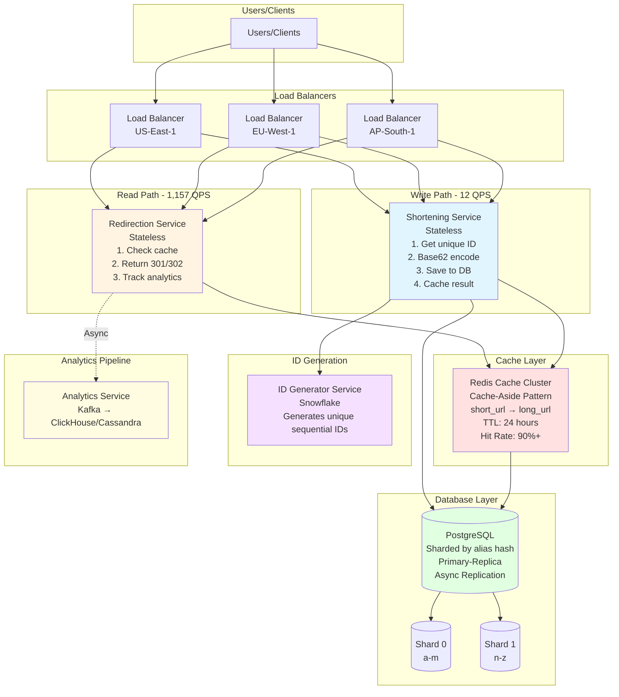
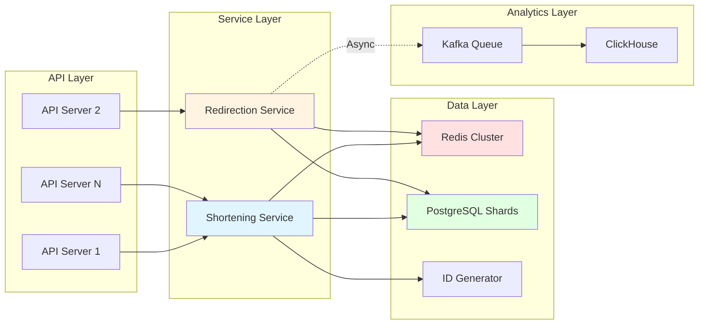
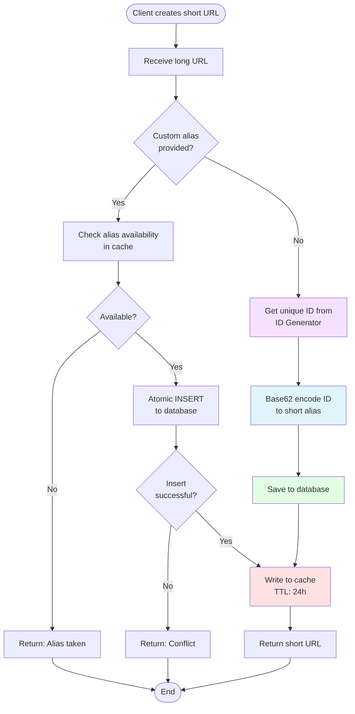
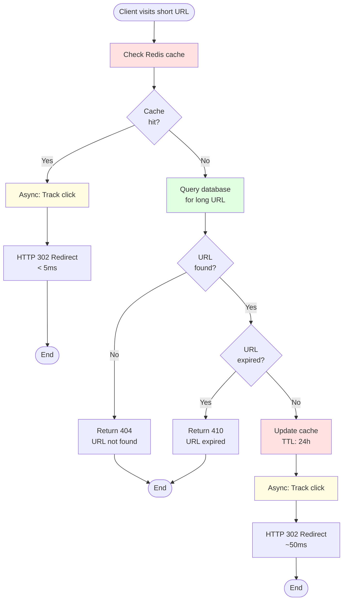
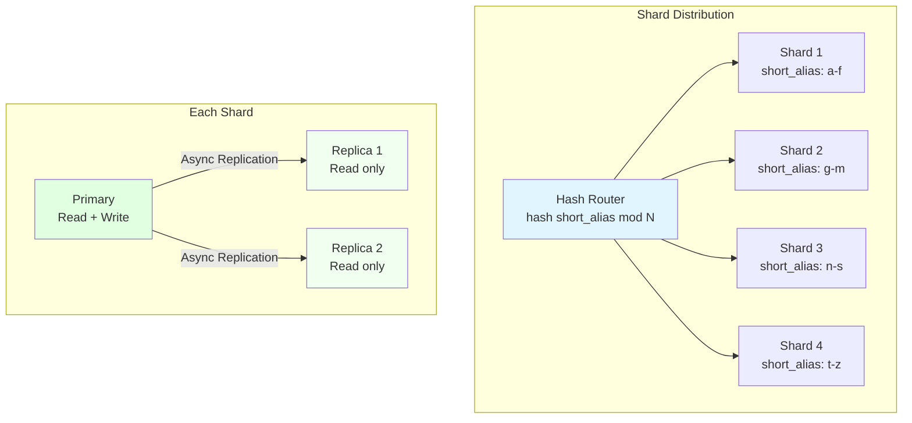
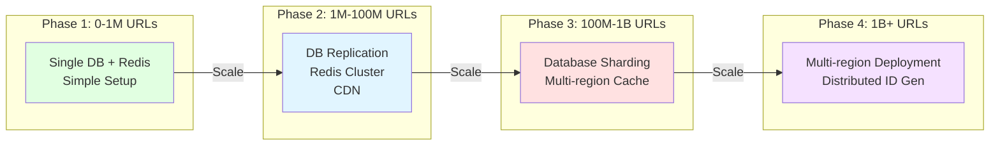

# URL Shortener - High-Level Design

## Table of Contents

1. [System Architecture Diagram](#system-architecture-diagram)
2. [Component Architecture](#component-architecture)
3. [Data Flow Diagrams](#data-flow-diagrams)
4. [Sharding Strategy](#sharding-strategy)
5. [Scaling Path](#scaling-path)

---

## System Architecture Diagram

**Flow Explanation:**
This diagram shows the complete system architecture for a globally distributed URL shortener. 

**Key Flows:**
1. **Write Path (Create Short URL):** Users → Load Balancer → Shortening Service → ID Generator (get unique ID) → Base62 encode → Save to Database → Cache result → Return short URL
2. **Read Path (Redirect):** Users → Load Balancer → Redirection Service → Check Redis Cache (90% hit rate) → If miss: Query Database → Return HTTP 301/302 redirect → Async track analytics
3. **Cache Layer:** Redis cluster stores short→long URL mappings with 24-hour TTL, dramatically reducing database load
4. **Database:** PostgreSQL sharded by alias hash (Shard 0: a-m, Shard 1: n-z) with primary-replica setup
5. **Analytics:** Async pipeline via Kafka to ClickHouse/Cassandra for click tracking without blocking redirects

**Traffic Distribution:** Read-heavy (1,157 QPS reads vs 12 QPS writes = 100:1 ratio)

## Component Architecture

**Flow Explanation:**
Shows the layered architecture and component interactions.

**Layers:**
1. **API Layer:** Stateless API servers behind load balancer, horizontally scalable
2. **Service Layer:** Shortening Service (write path) and Redirection Service (read path) as separate microservices
3. **Data Layer:** Redis Cache (hot data), PostgreSQL Shards (persistent storage), ID Generator (unique IDs)
4. **Analytics Layer:** Async pipeline via Kafka to ClickHouse for non-blocking click tracking

**Key Design:** Separation of concerns - each layer can scale independently based on traffic patterns.

## Data Flow Diagrams

### Write Path (URL Creation)

**Flow Explanation:**
Detailed flow for creating a shortened URL with two paths: custom alias vs auto-generated.

**Custom Alias Path:** Client provides desired alias → Check availability in cache → Atomic INSERT to database → If conflict: Return error → If success: Cache and return
**Auto-Generated Path:** Get unique ID from ID Generator → Base62 encode → Save to database → Cache → Return short URL

**Key Decision Point:** Custom alias check happens BEFORE database to fail fast, but database UNIQUE constraint is the source of truth to prevent race conditions.

### Read Path (URL Redirection)

**Flow Explanation:**
Optimized flow for fast redirects with cache-first strategy.

**Fast Path (90% of requests):** Check Redis cache → Hit → Async track click → Return HTTP 302 redirect (~5ms total)
**Slow Path (10% cache miss):** Query database → Check if URL exists and not expired → Update cache → Async track click → Return HTTP 302 redirect (~50ms total)

**Optimization:** Analytics tracking is fully asynchronous to not block redirect response. Cache TTL of 24 hours balances freshness and performance.

## Sharding Strategy

**Flow Explanation:**
Database sharding strategy to distribute load and enable horizontal scaling.

**Sharding Logic:** Hash-based routing using `hash(short_alias) mod N` distributes URLs evenly across 4 shards (example: a-f, g-m, n-s, t-z)
**Per-Shard Setup:** Each shard has 1 Primary (read+write) and 2 Replicas (read-only) with async replication
**Benefits:** 
- Even distribution of load
- Independent scaling per shard
- Read scaling via replicas
- Fault tolerance (replica promotion on primary failure)

## Scaling Path

**Flow Explanation:**
Progressive scaling strategy as system grows from thousands to billions of URLs.

**Phase 1 (0-1M URLs):** Single database + Redis → Simple monolithic setup → Good for MVP
**Phase 2 (1M-100M URLs):** Add DB replication + Redis cluster + CDN → Improved read performance
**Phase 3 (100M-1B URLs):** Database sharding + Multi-region cache → Horizontal scaling unlocked
**Phase 4 (1B+ URLs):** Multi-region deployment + Distributed ID Generator → Global scale with low latency

**Key Insight:** Start simple, scale incrementally based on actual traffic patterns and bottlenecks.

