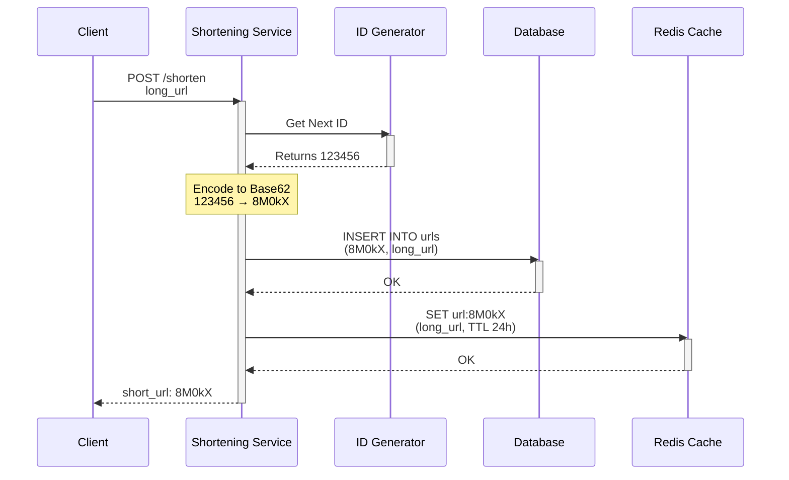
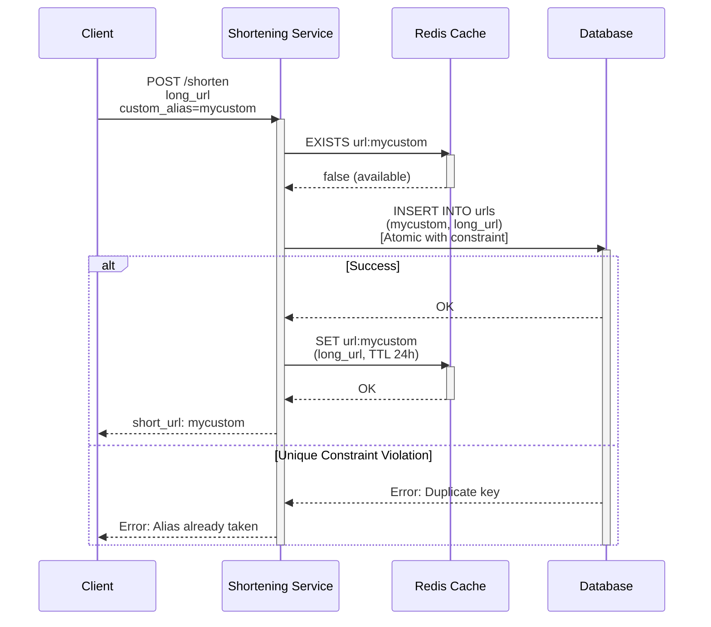
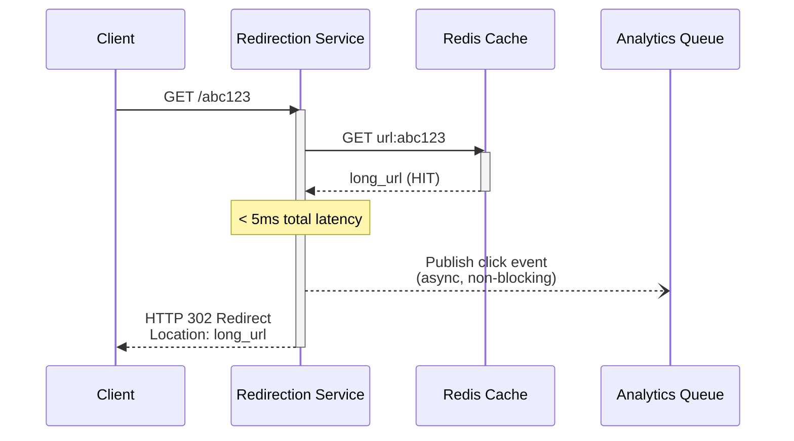
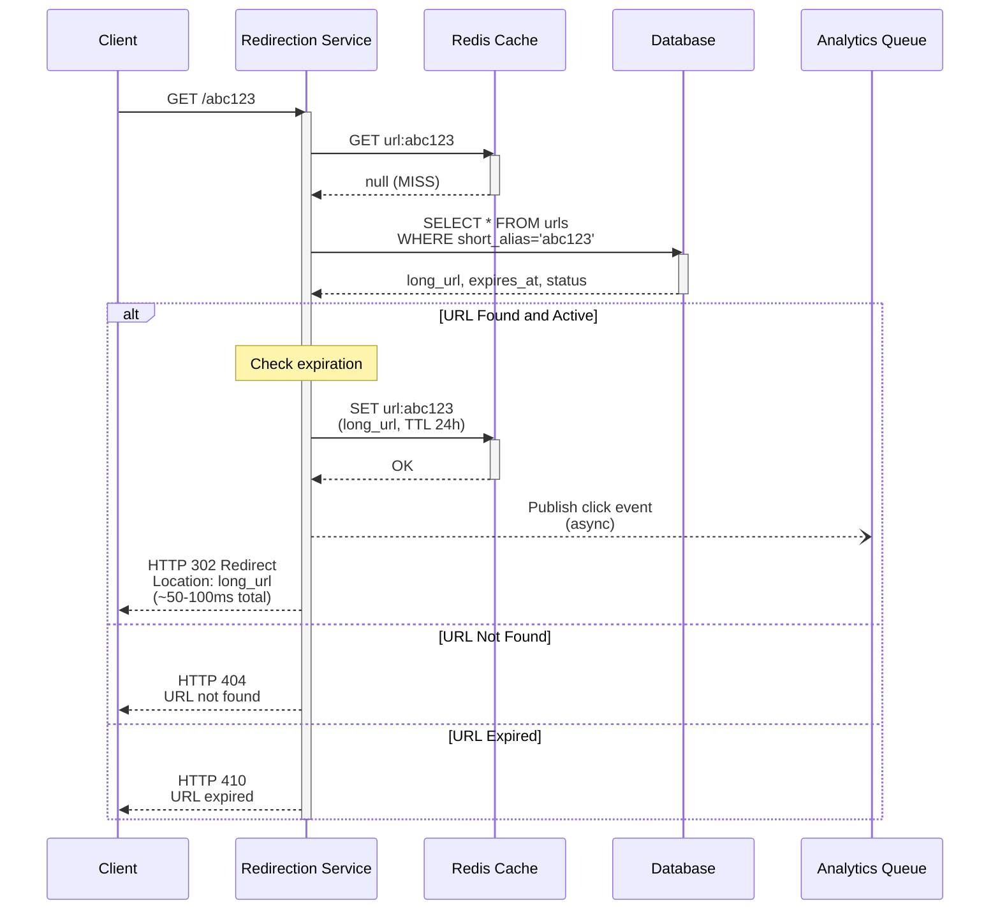
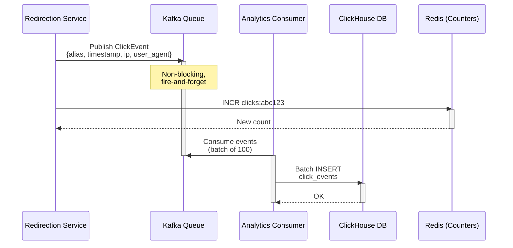
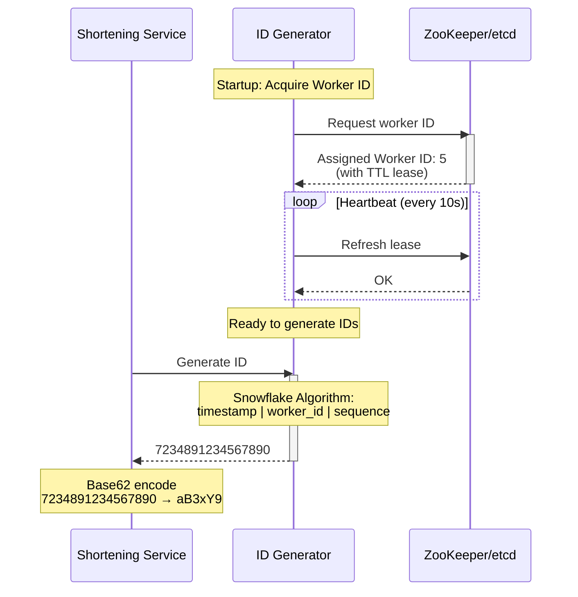
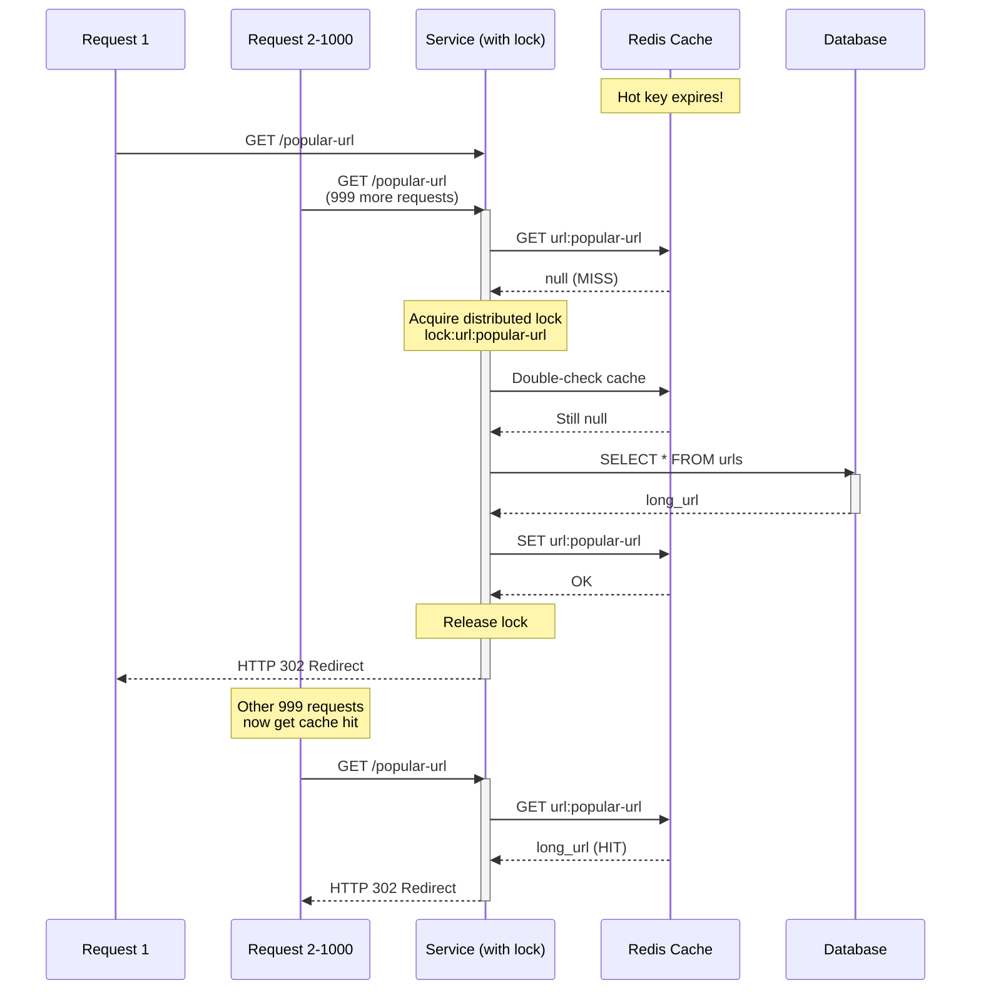
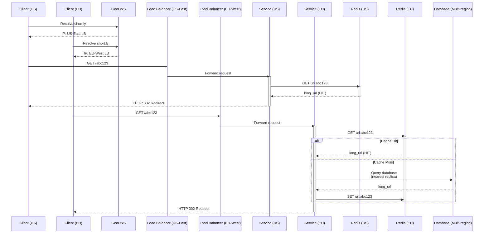
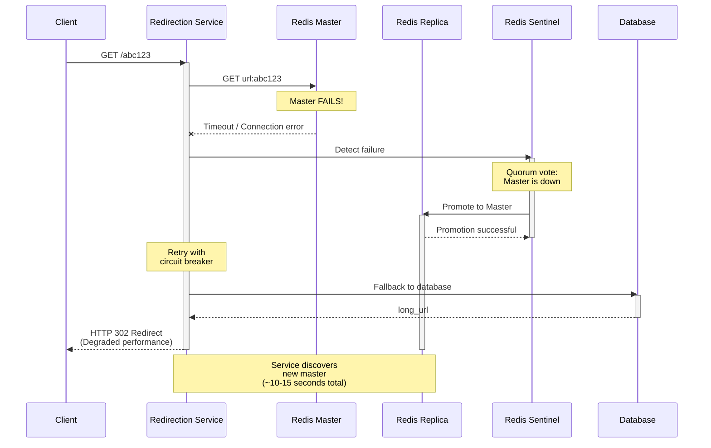

# URL Shortener - Sequence Diagrams

## Write Path: URL Shortening (Creation)

### Standard Flow (Auto-generated Alias)

**Flow Explanation:**
This shows the standard URL shortening flow when the system auto-generates the short alias.

**Steps:**
1. Client sends POST request with long URL
2. Service requests unique ID from ID Generator (e.g., 123456)
3. Service encodes ID using Base62 algorithm (123456 → "8M0kX")
4. Service saves mapping to database (short_alias as primary key)
5. Service caches mapping in Redis with 24-hour TTL
6. Service returns short URL to client

**Latency:** ~30-50ms total (ID generation: 1ms, DB write: 20ms, Cache write: 5ms)

### Custom Alias Flow

**Flow Explanation:**
Handles user-provided custom aliases with race condition protection.

**Steps:**
1. Client provides desired custom alias (e.g., "mycustom")
2. Service checks Redis cache for availability (fast pre-check)
3. Service attempts atomic INSERT to database with UNIQUE constraint
4. **Success path:** Insert succeeds → Cache the mapping → Return success
5. **Conflict path:** UNIQUE constraint violation → Return "Alias already taken" error

**Race Condition Protection:** Database UNIQUE constraint is the source of truth. Cache check is just an optimization to fail fast.

## Read Path: URL Redirection

### Cache Hit (Fast Path - 90% of requests)

**Flow Explanation:**
The optimized path when URL is cached (90% of requests).

**Steps:**
1. Client requests short URL (GET /abc123)
2. Service checks Redis cache
3. **Cache HIT** - long URL found in cache
4. Service publishes click event to analytics queue (async, non-blocking)
5. Service immediately returns HTTP 302 redirect

**Performance:** <5ms total latency (cache lookup ~1ms, redirect response ~3ms). Analytics is async so doesn't block.

### Cache Miss (Slow Path - 10% of requests)

**Flow Explanation:**
Slower path when URL is not cached (10% of requests).

**Steps:**
1. Client requests short URL
2. Service checks Redis cache → **MISS**
3. Service queries database for URL mapping
4. **If found:** Update cache with 24h TTL → Track analytics async → Return redirect (~50ms)
5. **If not found:** Return HTTP 404 error

**Performance:** ~50ms total latency (DB query ~30ms, cache write ~5ms, redirect ~10ms). Still acceptable for 10% of traffic.

## Analytics Flow

**Flow Explanation:**
Asynchronous analytics pipeline to track clicks without blocking redirects.

**Steps:**
1. Redirection Service publishes click event to Kafka (non-blocking, <1ms)
2. Kafka stores event in durable log
3. Consumer reads events in batches
4. Consumer writes to ClickHouse (columnar analytics DB)
5. Analytics dashboard queries ClickHouse for reports

**Key Design:** Fully asynchronous to not impact redirect latency. Event loss is acceptable (monitoring/analytics, not critical path).

## ID Generation Flow (Snowflake)

**Flow Explanation:**
Shows how the ID Generator creates unique, sequential 64-bit IDs using Snowflake algorithm.

**Steps:**
1. Shortening Service requests new ID
2. ID Generator checks current timestamp
3. If same millisecond: increment sequence counter
4. If sequence overflow (>4095): wait for next millisecond
5. Compose ID: [timestamp(41 bits) | worker_id(10 bits) | sequence(12 bits)]
6. Return 64-bit ID

**Capacity:** 4,096 IDs per millisecond per worker = ~4.1 million IDs/second per worker. Multiple workers for higher throughput.

## Cache Stampede Prevention

**Flow Explanation:**
Prevents thundering herd when popular URL's cache expires and 1000+ requests hit simultaneously.

**Without Protection:** All requests → cache miss → all query DB → DB overwhelmed
**With Protection (Shown):**
1. First request acquires distributed lock
2. Other requests wait at lock
3. First request queries DB and populates cache
4. First request releases lock
5. Waiting requests now hit cache (no DB queries)

**Result:** 1,000 concurrent requests → Only 1 DB query instead of 1,000. Critical for high-traffic URLs.

## Multi-Region Deployment

**Flow Explanation:**
Shows global deployment with region-specific routing for low latency.

**Steps:**
1. User in Asia hits nearest region (AP-South-1)
2. Request routed to regional load balancer
3. Regional cache checked first (Redis cluster in same region)
4. If cache miss: Query regional database replica
5. If data not in regional replica: Query primary in US
6. Return result and cache regionally

**Benefits:** <50ms latency for users worldwide. Cache and read replicas in each region. Writes go to primary but reads are local.

## Failure Scenarios

### Redis Failover

**Flow Explanation:**
Shows graceful degradation when Redis cache fails.

**Steps:**
1. Client requests redirect
2. Service tries Redis → **Connection timeout/error**
3. Service catches exception and logs error
4. Service falls back to database (slower but works)
5. Service queries database for URL
6. Service returns redirect (degraded mode: ~100ms instead of ~5ms)
7. Meanwhile, operations team is alerted
8. Sentinel promotes replica to new master
9. Service reconnects to new Redis master

**Key Design:** Service continues operating (slower) even when cache is down. No data loss, just higher latency.

