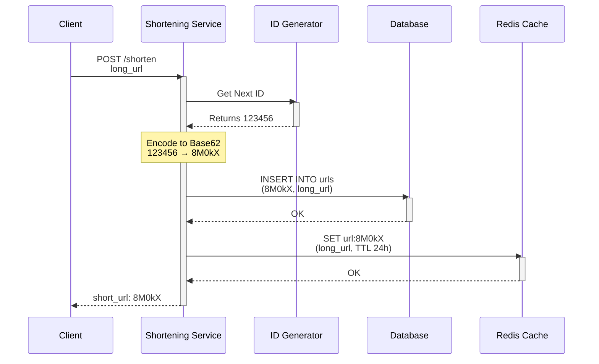
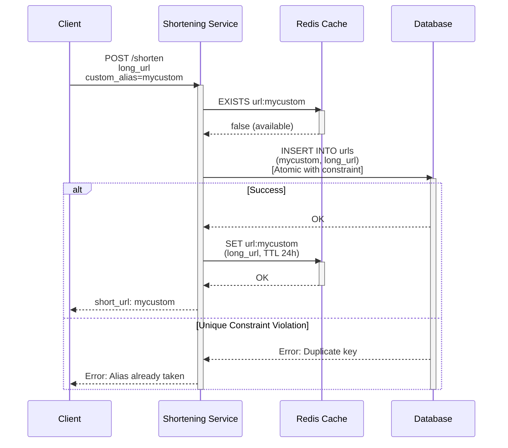
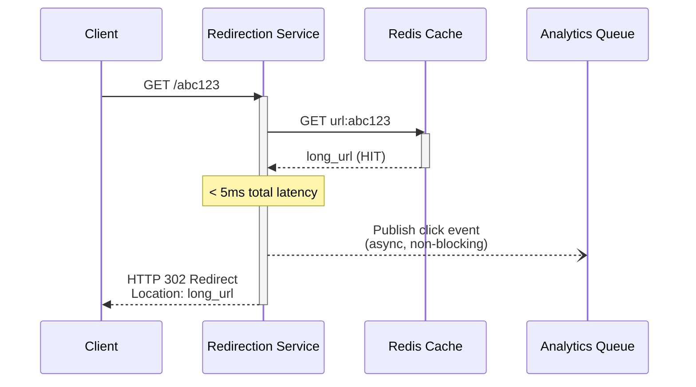
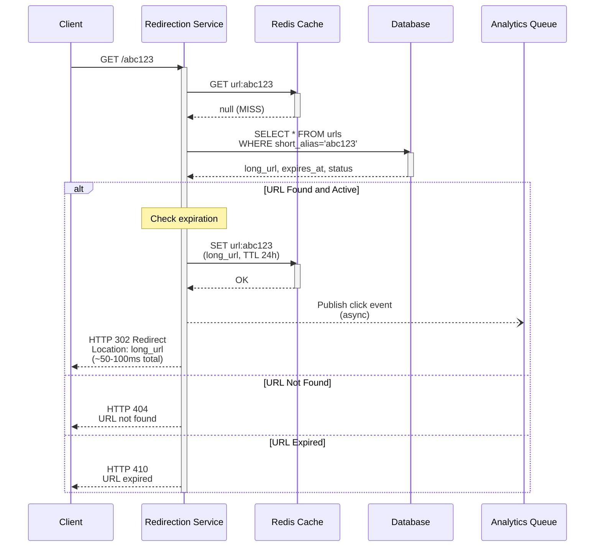
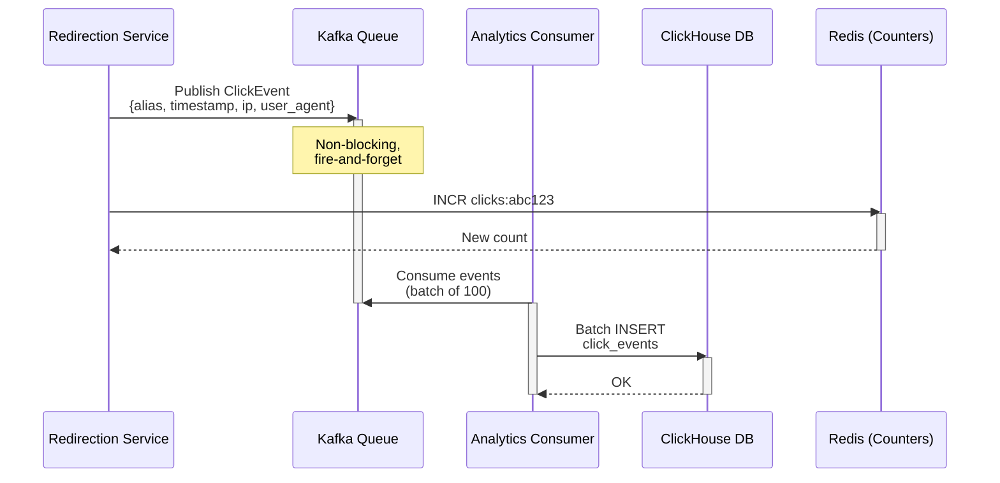
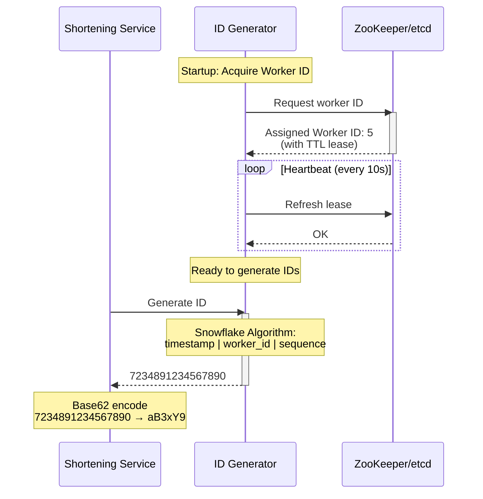
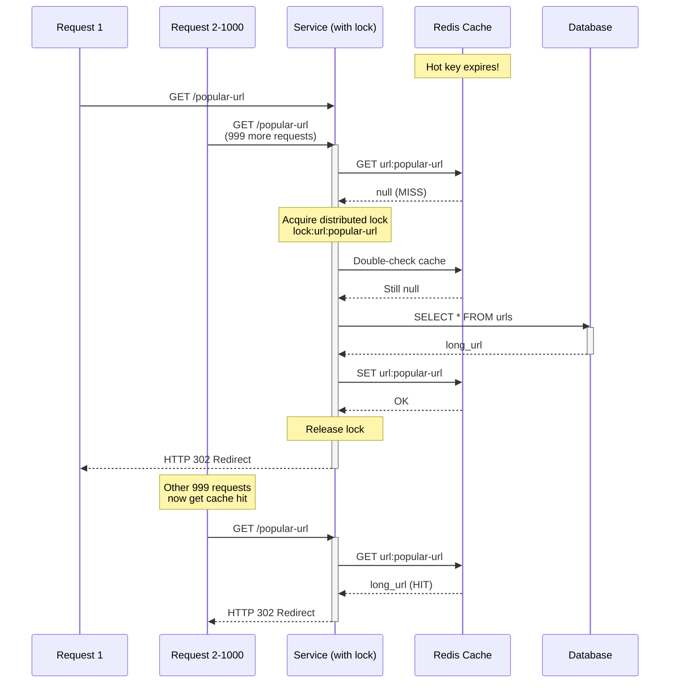
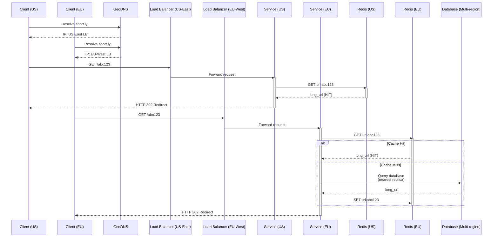
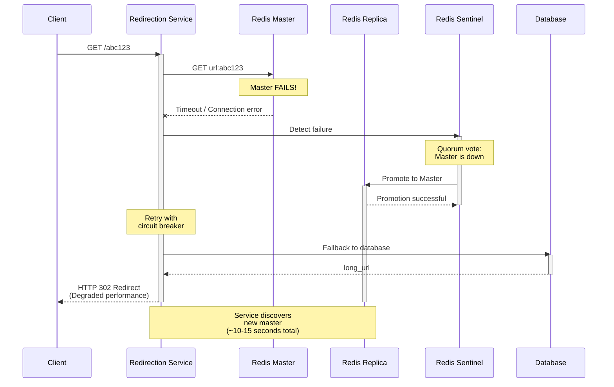

# URL Shortener - Sequence Diagrams

## Write Path: URL Shortening (Creation)

### Standard Flow (Auto-generated Alias)

### Custom Alias Flow

## Read Path: URL Redirection

### Cache Hit (Fast Path - 90% of requests)

### Cache Miss (Slow Path - 10% of requests)

## Analytics Flow

## ID Generation Flow (Snowflake)

## Cache Stampede Prevention

## Multi-Region Deployment

## Failure Scenarios

### Redis Failover

