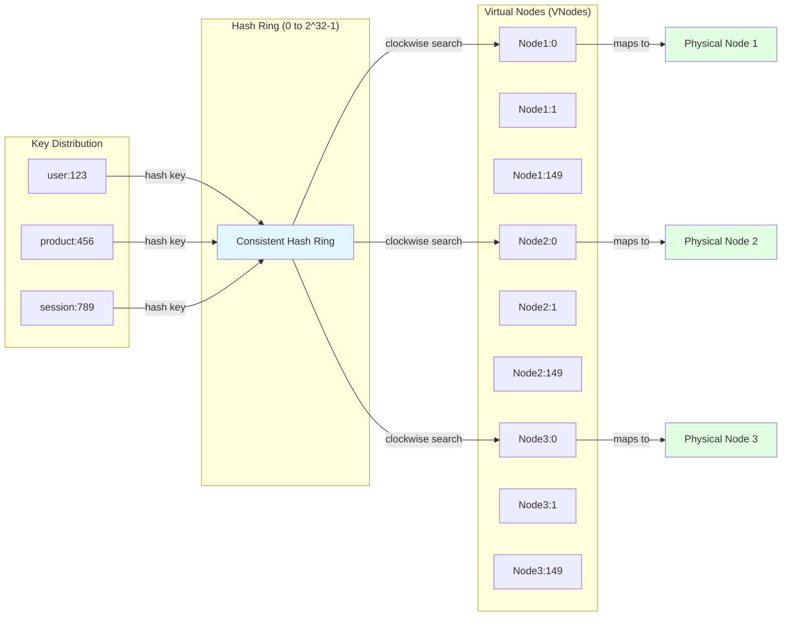
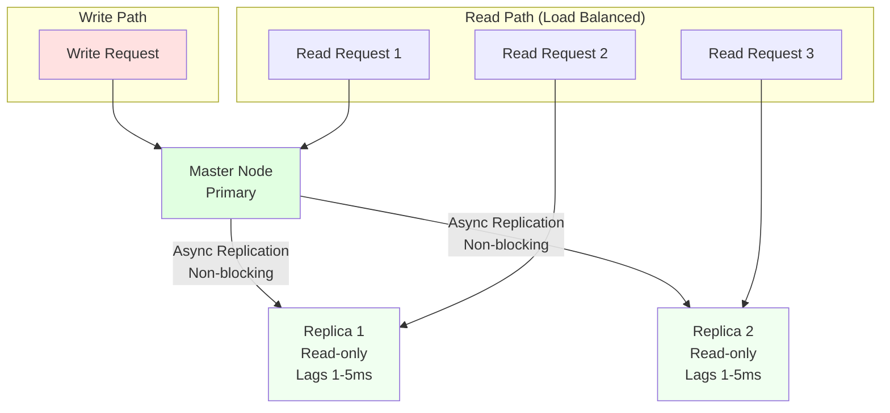
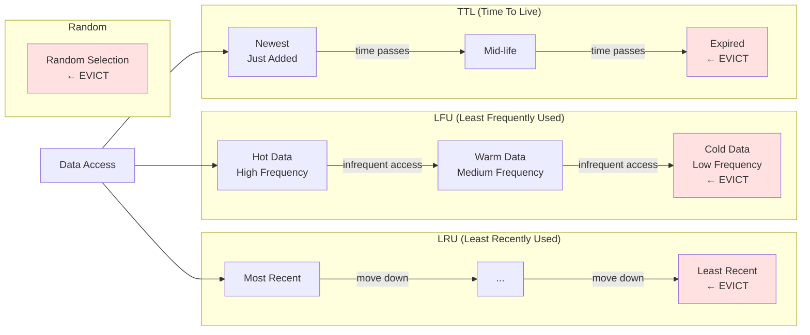
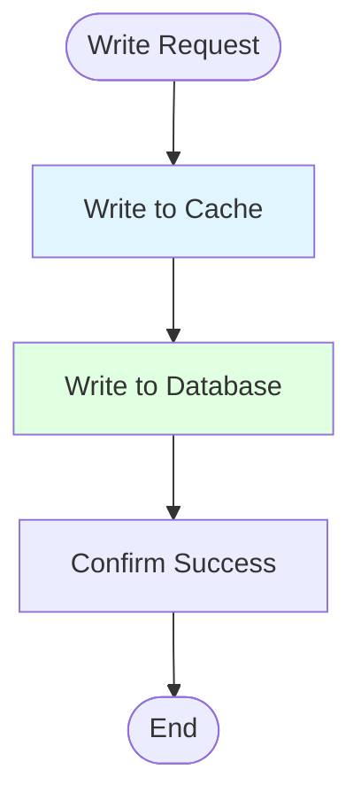
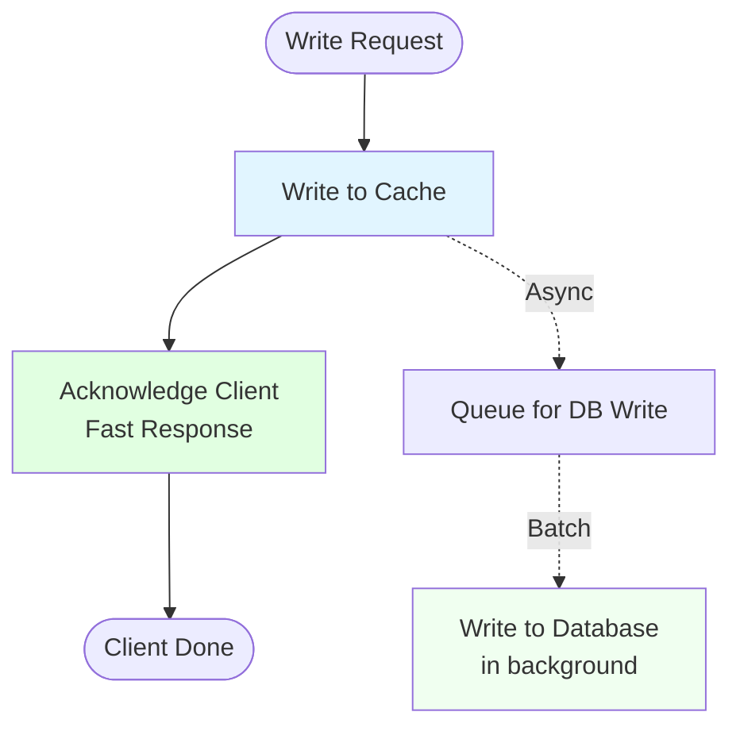
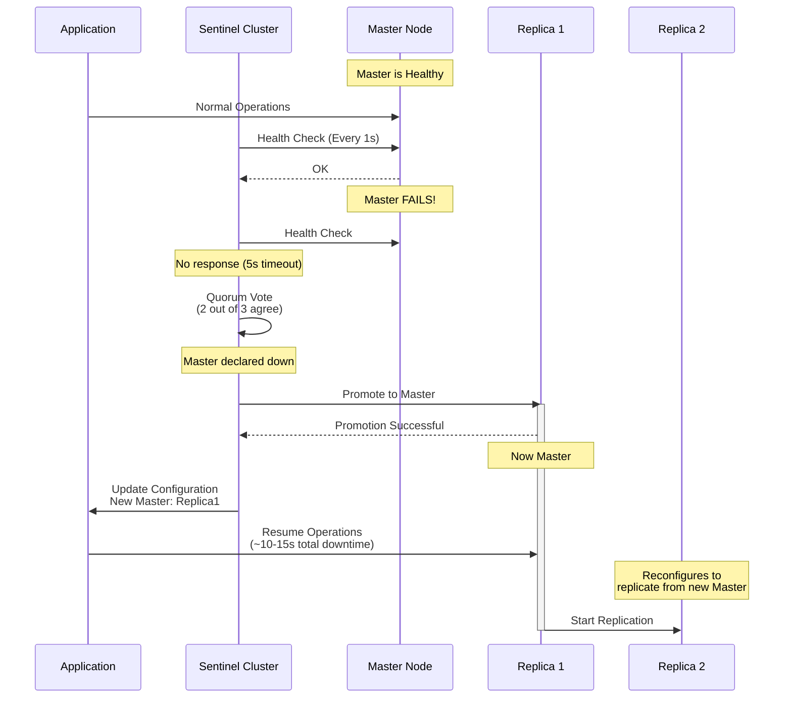
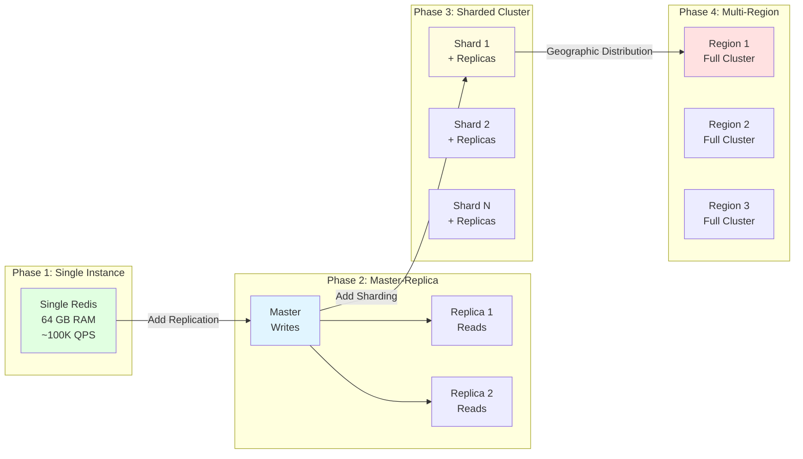
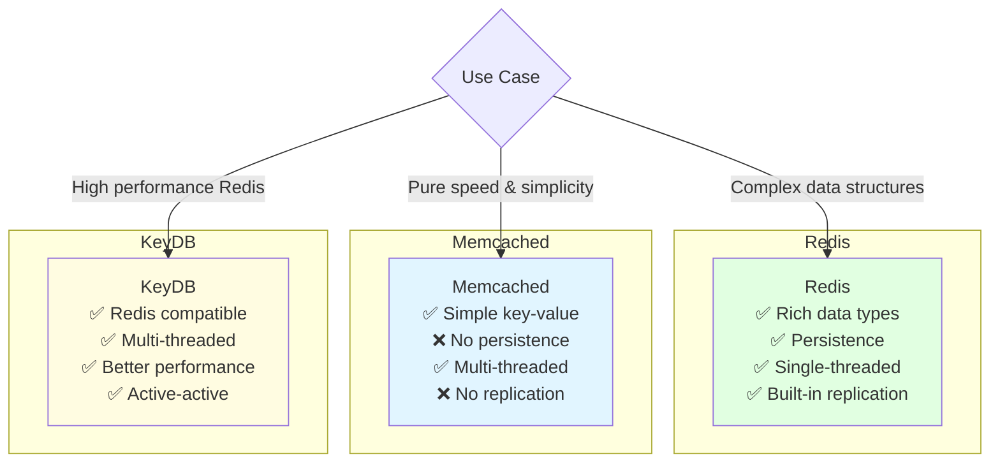
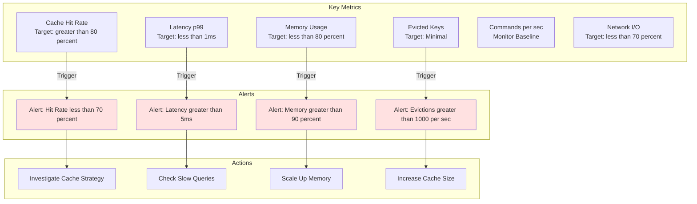

# Distributed Cache - High-Level Design

## System Architecture Diagram

## Consistent Hashing Ring

## Replication Architecture

## Cache Eviction Policies

## Data Flow Patterns

### Cache-Aside (Lazy Loading)

### Write-Through Pattern

### Write-Behind (Write-Back) Pattern

## Failover Mechanism

## Cluster Sharding (Redis Cluster)

## Performance Optimization Techniques

```mermaid
graph TB
    subgraph "Connection Pooling"
        App[Application]
        Pool[Connection Pool<br/>50 connections<br/>Reuse connections]
        Cache1[Cache Node]
    end

    App --> Pool
    Pool <-->|Reuse| Cache1

    subgraph "Pipelining"
        App2[Application]
        Pipeline[Pipeline<br/>Batch 1000 commands]
        Cache2[Cache Node]
    end

    App2 -->|1 request| Pipeline
    Pipeline -->|1 network RTT| Cache2
    Cache2 -->|1 response| Pipeline
    Pipeline -->|1000 results| App2

subgraph "Compression"
App3[Application]
Compress[Compress<br/>10 KB → 1 KB]
Cache3[Cache Node]
end

App3 -->|Large Data|Compress
Compress -->|Compressed|Cache3
Cache3 -->|Compressed|Compress
Compress -->|Decompressed| App3

style Pool fill: #e1f5ff
style Pipeline fill: #e1ffe1
style Compress fill: #fffce1
```

## Scaling Strategy

## Technology Comparison

## Monitoring Dashboard

