# Distributed Cache - High-Level Design

## Table of Contents

1. [System Architecture Diagram](#system-architecture-diagram)
2. [Consistent Hashing Ring](#consistent-hashing-ring)
3. [Replication Architecture](#replication-architecture)
4. [Cache Eviction Policies](#cache-eviction-policies)
5. [Data Flow Patterns](#data-flow-patterns)
6. [Failover Mechanism](#failover-mechanism)
7. [Cluster Sharding (Redis Cluster)](#cluster-sharding-redis-cluster)
8. [Performance Optimization Techniques](#performance-optimization-techniques)
9. [Scaling Strategy](#scaling-strategy)
10. [Technology Comparison](#technology-comparison)
11. [Monitoring Dashboard](#monitoring-dashboard)

---

## System Architecture Diagram

**Flow Explanation:**
Complete architecture of a distributed cache cluster with sharding, replication, and high availability.

**Key Components:**

1. **Application Layer:** Multiple app servers connect via cache client library
2. **Cache Client:** Implements consistent hashing to route requests, connection pooling for efficiency, retry logic for
   resilience
3. **Primary Nodes (3 Masters):** Each handles 1/3 of keyspace (16,384 slots total) using hash slots, 64GB RAM each,
   100K QPS capacity
4. **Replica Layer:** Each master has 2 replicas with async replication (1-5ms lag), provides read scaling and failover
   capability
5. **Sentinel Monitoring:** Detects failures, triggers automatic promotion of replica to master

**Data Flow:** Client hashes key → Determines slot → Routes to correct master → Async replication to replicas → Read
from master or replica

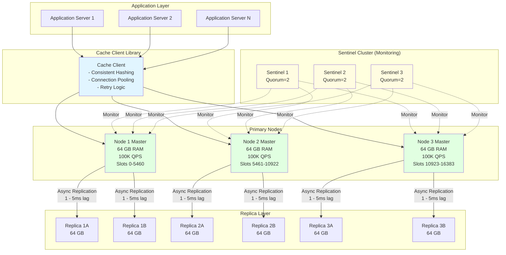

## Consistent Hashing Ring

**Flow Explanation:**
Shows how consistent hashing distributes keys evenly across nodes using virtual nodes.

**Mechanism:**

1. Hash ring spans 0 to 2^32-1
2. Each physical node creates 150 virtual nodes (VNodes) on the ring
3. Key is hashed (e.g., hash("user:123"))
4. Search clockwise on ring to find next VNode
5. VNode maps back to physical node

**Benefits:** When adding/removing nodes, only ~1/N keys need remapping (vs. ~100% with modulo hashing). Virtual nodes
ensure even distribution even with unequal node count.

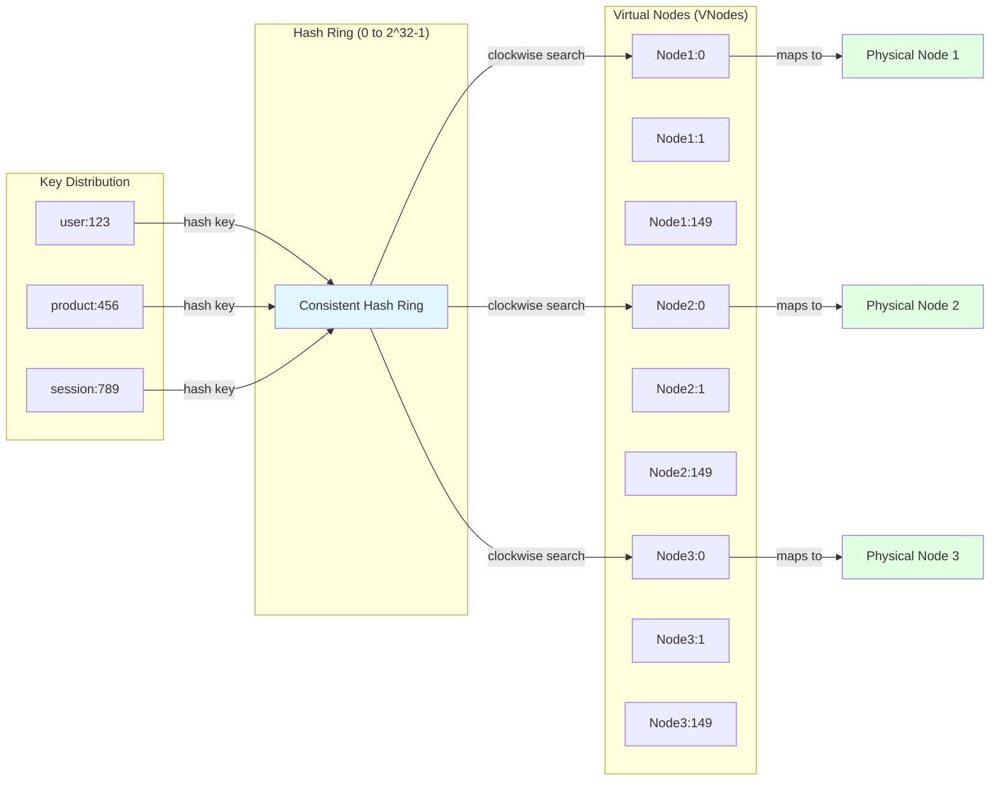

## Replication Architecture

**Flow Explanation:**
Master-replica setup for high availability and read scaling.

**Write Path:** All writes go to master → Master performs async replication to 2 replicas (non-blocking, 1-5ms lag)
**Read Path:** Reads load-balanced across master + 2 replicas (3x read capacity)

**Trade-off:** Async replication means eventual consistency - replicas may lag behind master by 1-5ms. Acceptable for
cache use case (vs. database where consistency is critical).

## Cache Eviction Policies

**Flow Explanation:**
Comparison of algorithms for deciding which data to evict when cache is full.

**LRU (Least Recently Used):** Doubly-linked list tracks access order → Evict tail (least recent)
**LFU (Least Frequently Used):** Counter tracks access frequency → Evict lowest frequency
**TTL (Time To Live):** Each key has expiry timestamp → Evict expired keys first
**Random:** Random selection → Simple but unpredictable

**Recommendation:** LRU for most use cases (80-90% hit rate). LFU for access patterns with clear hot/cold data
distinction.

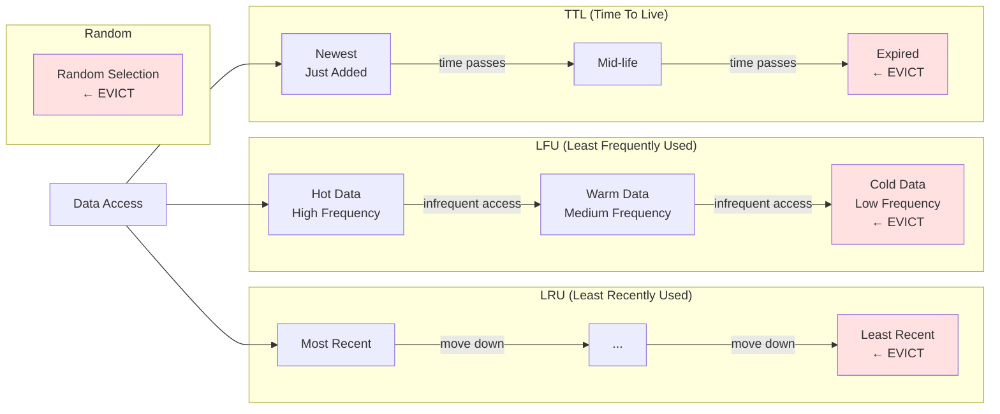

## Data Flow Patterns

### Cache-Aside (Lazy Loading)

**Flow Explanation:**
Most common caching pattern where application manages cache population.

**Read:** App checks cache → If miss: Query DB → Write to cache → Return data
**Write:** App writes to DB → Invalidate cache (optional)

**Pros:** Simple, cache only stores accessed data. **Cons:** Cache misses add latency, risk of stale data.

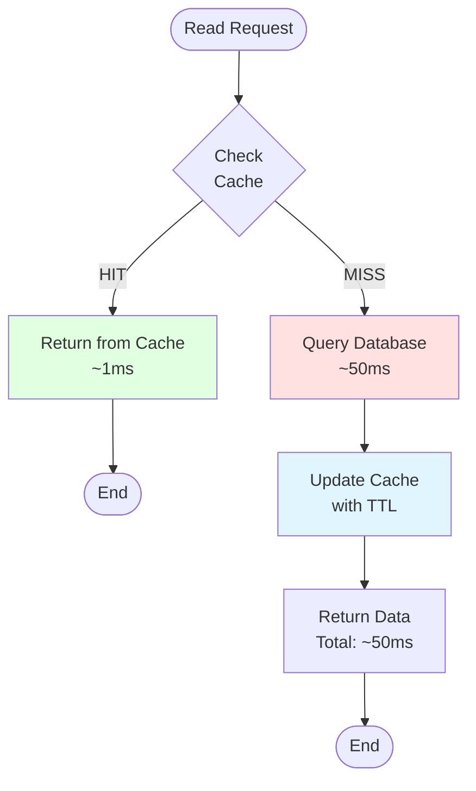

### Write-Through Pattern

**Flow Explanation:**
Cache is always in sync with database - writes go through cache.

**Write:** App → Cache → DB (synchronous) → Return. **Read:** App → Cache (always has latest data).

**Pros:** Cache never stale, simple consistency. **Cons:** Higher write latency (must wait for DB), unused data cached.

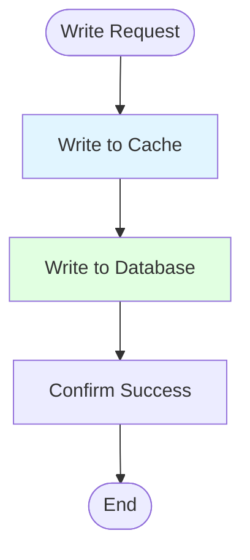

### Write-Behind (Write-Back) Pattern

**Flow Explanation:**
Writes batched and persisted asynchronously for maximum write performance.

**Write:** App → Cache (immediate return) → Async batch write to DB. **Read:** App → Cache.

**Pros:** Ultra-fast writes, reduced DB load. **Cons:** Risk of data loss if cache fails before DB write, eventual
consistency.

## Failover Mechanism

**Flow Explanation:**
Automatic recovery when master node fails using Redis Sentinel.

**Steps:**

1. Master node crashes
2. Sentinel detects failure (heartbeat timeout)
3. Sentinels form quorum (majority vote required)
4. Promote Replica 1 to new master
5. Update clients with new master address
6. Old master becomes replica when it recovers

**Downtime:** ~5-30 seconds depending on Sentinel configuration. Minimal data loss (only data not yet replicated).

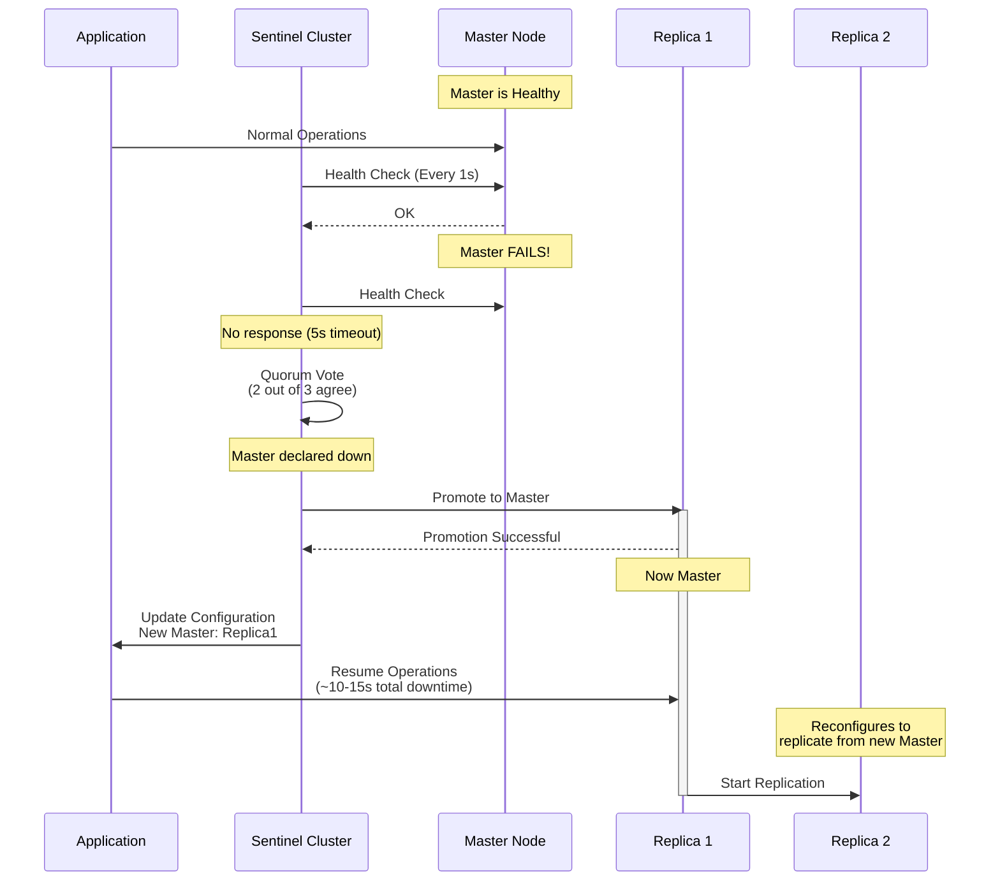

## Cluster Sharding (Redis Cluster)

**Flow Explanation:**
Horizontal scaling by partitioning data across multiple masters using hash slots.

**Sharding Logic:** 16,384 total hash slots divided evenly across N masters. Key hashed to slot: `CRC16(key) mod 16384`.

**Example (3 masters):**

- Master 1: Slots 0-5460
- Master 2: Slots 5461-10922
- Master 3: Slots 10923-16383

**Benefits:** Linear scaling (add masters for more capacity), automatic slot migration, built-in client-side routing.

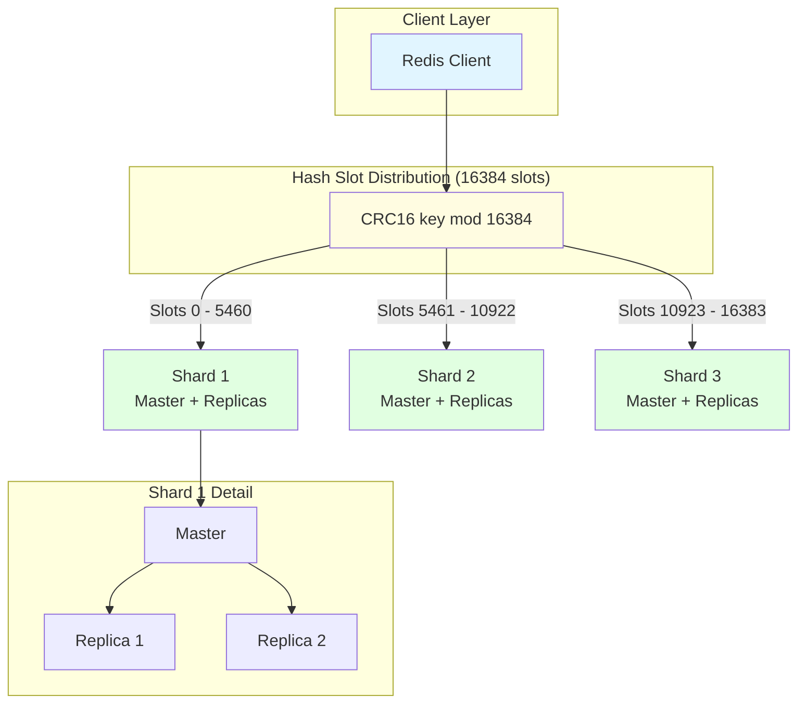

## Performance Optimization Techniques

**Flow Explanation:**
Key optimizations to maximize throughput and minimize latency.

**Techniques:**

1. **Connection Pooling:** Reuse TCP connections → Avoid 3ms handshake overhead
2. **Pipelining:** Batch multiple commands in single round-trip → 10x throughput improvement
3. **Compression:** gzip/snappy for large values (>1KB) → 10x memory savings
4. **TTL Management:** Automatic expiration → No manual cleanup needed
5. **Read from Replicas:** Load balance reads across 3 nodes → 3x read capacity

**Impact:** Sub-millisecond P99 latency, 300K+ QPS per node.

```mermaid
graph TB
    subgraph "Connection Pooling"
        App[Application]
        Pool[Connection Pool<br/>50 connections<br/>Reuse connections]
        Cache1[Cache Node]
    end

    App --> Pool
    Pool <-->|Reuse| Cache1

    subgraph "Pipelining"
        App2[Application]
        Pipeline[Pipeline<br/>Batch 1000 commands]
        Cache2[Cache Node]
    end

    App2 -->|1 request| Pipeline
    Pipeline -->|1 network RTT| Cache2
    Cache2 -->|1 response| Pipeline
    Pipeline -->|1000 results| App2

subgraph "Compression"
App3[Application]
Compress[Compress<br/>10 KB → 1 KB]
Cache3[Cache Node]
end

App3 -->|Large Data|Compress
Compress -->|Compressed|Cache3
Cache3 -->|Compressed|Compress
Compress -->|Decompressed| App3

style Pool fill: #e1f5ff
style Pipeline fill: #e1ffe1
style Compress fill: #fffce1
```

## Scaling Strategy

**Flow Explanation:**
Progressive scaling path from single instance to distributed cluster.

**Phase 1 (Small):** Single Redis instance (64GB RAM, 100K QPS) → Good for MVP
**Phase 2 (Medium):** Master + 2 replicas → 3x read capacity, high availability
**Phase 3 (Large):** 3 masters with sharding + replicas → 300K QPS, 180GB total capacity
**Phase 4 (Massive):** Multi-region clusters → Global scale, low latency worldwide

**When to scale:** Monitor memory usage (>70%), QPS (>80% capacity), or latency (P99 > 10ms).

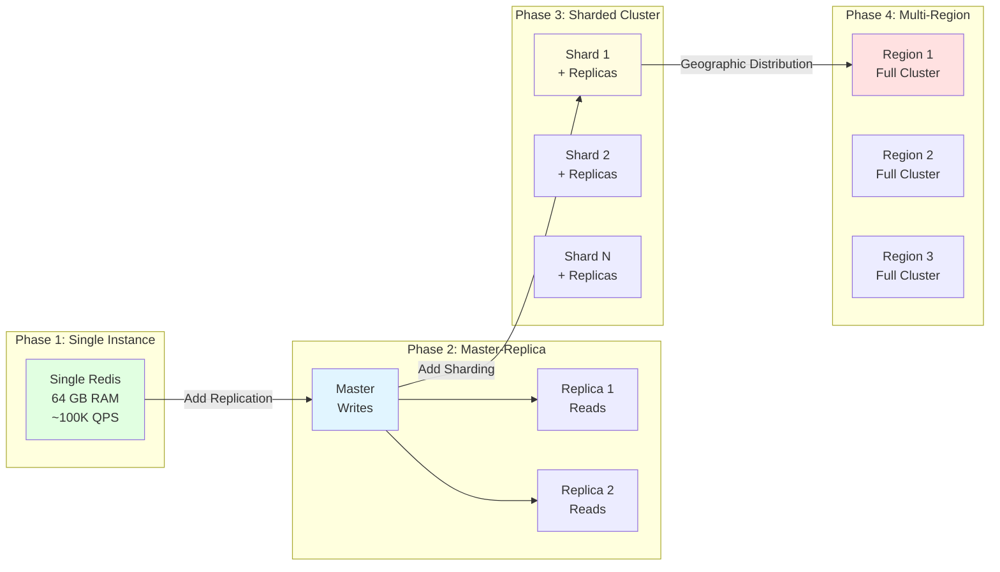

## Technology Comparison

**Flow Explanation:**
Comparison matrix of popular caching solutions to guide technology selection.

**Redis:** Best all-around choice - rich data structures, persistence, Lua scripting, pub/sub. Use for: most
applications.
**Memcached:** Simpler, pure key-value, slightly faster for basic ops. Use for: simple caching needs.
**Hazelcast:** Java-native, distributed data structures, compute grid. Use for: Java microservices.
**Apache Ignite:** SQL support, compute capabilities, ML integration. Use for: data-intensive applications.

**Decision factors:** Language ecosystem, data structure needs, persistence requirements, operational complexity.

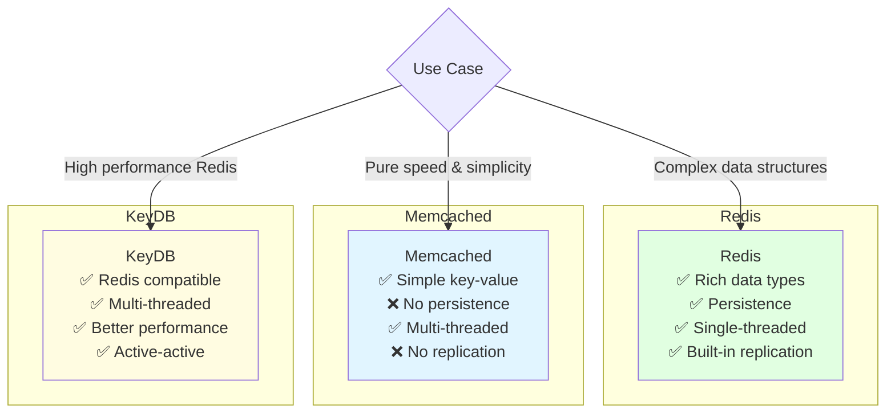

## Monitoring Dashboard

**Flow Explanation:**
Key metrics to monitor for cache health and performance.

**Critical Metrics:**

1. **Hit Rate:** % of cache hits vs misses (target: >80%)
2. **Memory Usage:** Current/max memory (alert at >70%)
3. **QPS:** Queries per second (watch for capacity limits)
4. **Latency:** P50/P99/P999 response times (target: P99 <5ms)
5. **Eviction Rate:** Keys evicted per second (high = undersized cache)
6. **Network I/O:** Bandwidth utilization per node

**Alerts:** Hit rate <70%, memory >80%, P99 latency >10ms, replication lag >100ms, node failures.

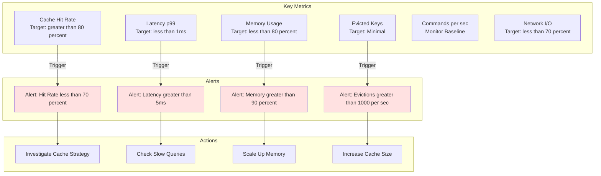

