# Distributed Cache - Sequence Diagrams

## Table of Contents

1. [Cache-Aside Pattern (Lazy Loading)](#cache-aside-pattern-lazy-loading)
2. [Write-Through Pattern](#write-through-pattern)
3. [Write-Behind (Write-Back) Pattern](#write-behind-write-back-pattern)
4. [Cache Stampede Prevention](#cache-stampede-prevention)
5. [Consistent Hashing: Node Addition](#consistent-hashing-node-addition)
6. [Replication Flow](#replication-flow)
7. [Failover Process](#failover-process)
8. [Redis Cluster Resharding](#redis-cluster-resharding)
9. [Connection Pooling](#connection-pooling)
10. [Pipelining for Batch Operations](#pipelining-for-batch-operations)
11. [Monitoring and Alerting Flow](#monitoring-and-alerting-flow)
12. [Multi-Region Deployment](#multi-region-deployment)
13. [Cache Warming on Startup](#cache-warming-on-startup)

---

## Cache-Aside Pattern (Lazy Loading)

### Read Flow - Cache Hit

**Flow:** App → Cache → HIT → Return (~1ms). Fast path for 80-90% of requests.

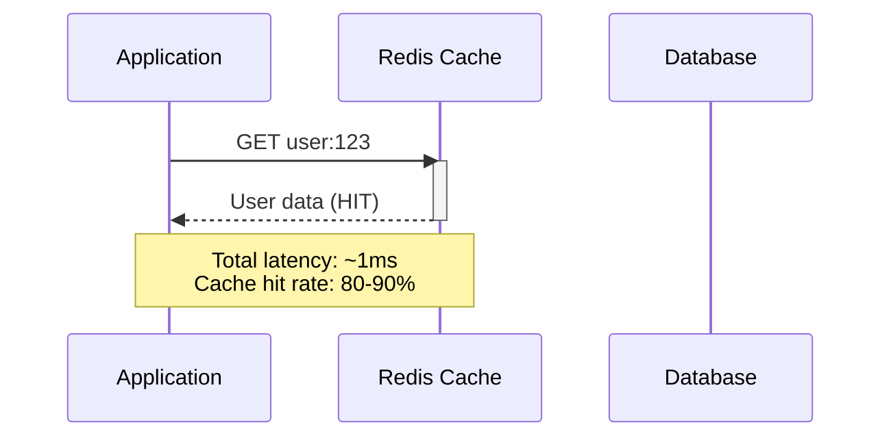
```mermaid
sequenceDiagram
    participant App as Application
    participant Cache as Redis Cache
    participant DB as Database
    App ->> Cache: GET user:123
    activate Cache
    Cache -->> App: User data (HIT)
    deactivate Cache
    Note over App, Cache: Total latency: ~1ms<br/>Cache hit rate: 80-90%
```

### Read Flow - Cache Miss

**Flow:** App → Cache (MISS) → Query DB → Write to cache with TTL → Return (~50ms). Happens for 10-20% of requests (cold
data).

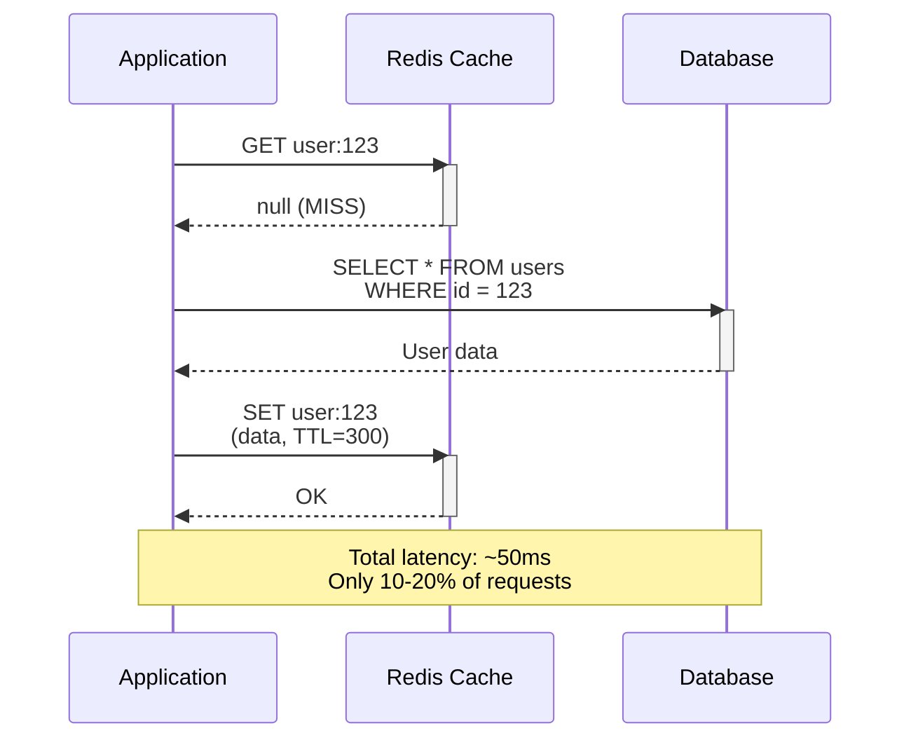
```mermaid
sequenceDiagram
    participant App as Application
    participant Cache as Redis Cache
    participant DB as Database
    App ->> Cache: GET user:123
    activate Cache
    Cache -->> App: null (MISS)
    deactivate Cache
    App ->> DB: SELECT * FROM users<br/>WHERE id = 123
    activate DB
    DB -->> App: User data
    deactivate DB
    App ->> Cache: SET user:123<br/>(data, TTL=300)
    activate Cache
    Cache -->> App: OK
    deactivate Cache
    Note over App, DB: Total latency: ~50ms<br/>Only 10-20% of requests
```

### Write Flow

**Flow:** App → Update DB → Invalidate cache (delete key). Next read will fetch fresh data from DB. Simple consistency
model.

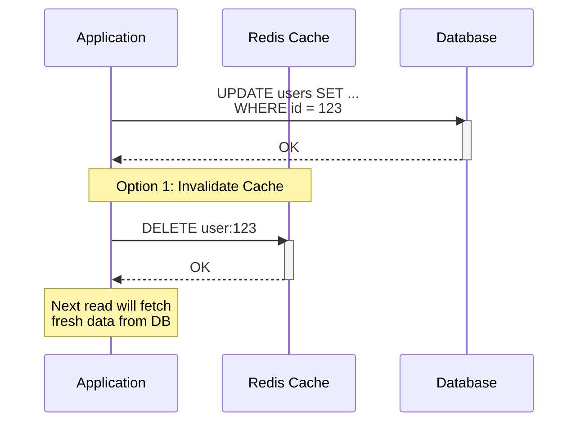
```mermaid
sequenceDiagram
    participant App as Application
    participant Cache as Redis Cache
    participant DB as Database
    App ->> DB: UPDATE users SET ...<br/>WHERE id = 123
    activate DB
    DB -->> App: OK
    deactivate DB
    Note over App, Cache: Option 1: Invalidate Cache
    App ->> Cache: DELETE user:123
    activate Cache
    Cache -->> App: OK
    deactivate Cache
    Note over App: Next read will fetch<br/>fresh data from DB
```

## Write-Through Pattern

**Flow:** App → Write to cache → Cache writes to DB (sync) → Return. Cache always consistent with DB. Higher write
latency but simple.

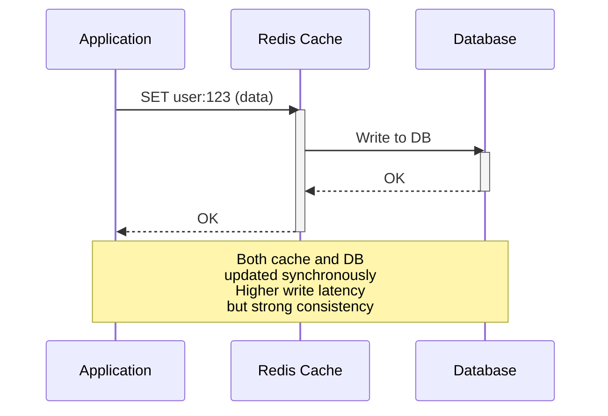
```mermaid
sequenceDiagram
    participant App as Application
    participant Cache as Redis Cache
    participant DB as Database
    App ->> Cache: SET user:123 (data)
    activate Cache
    Cache ->> DB: Write to DB
    activate DB
    DB -->> Cache: OK
    deactivate DB
    Cache -->> App: OK
    deactivate Cache
    Note over App, DB: Both cache and DB<br/>updated synchronously<br/>Higher write latency<br/>but strong consistency
```

## Write-Behind (Write-Back) Pattern

**Flow:** App → Write to cache (instant return) → Async batch write to DB (background). Ultra-fast writes, risk of data
loss if cache fails.

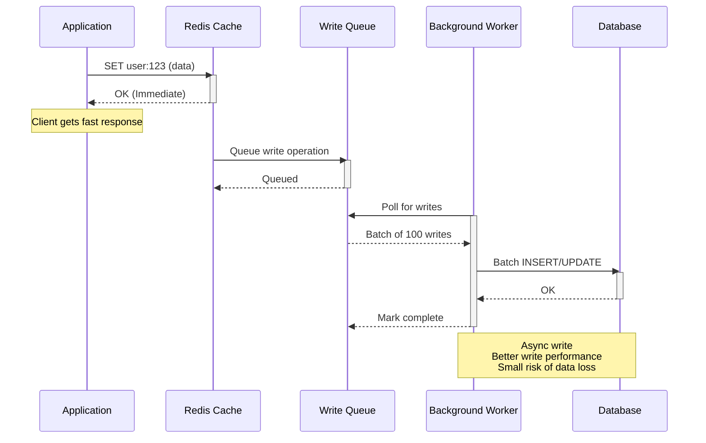
```mermaid
sequenceDiagram
    participant App as Application
    participant Cache as Redis Cache
    participant Queue as Write Queue
    participant Worker as Background Worker
    participant DB as Database
    App ->> Cache: SET user:123 (data)
    activate Cache
    Cache -->> App: OK (Immediate)
    deactivate Cache
    Note over App: Client gets fast response
    Cache ->> Queue: Queue write operation
    activate Queue
    Queue -->> Cache: Queued
    deactivate Queue
    Worker ->> Queue: Poll for writes
    activate Worker
    Queue -->> Worker: Batch of 100 writes
    Worker ->> DB: Batch INSERT/UPDATE
    activate DB
    DB -->> Worker: OK
    deactivate DB
    Worker -->> Queue: Mark complete
    deactivate Worker
    Note over Worker, DB: Async write<br/>Better write performance<br/>Small risk of data loss
```

## Cache Stampede Prevention

### Problem: Thundering Herd

**Flow:** Popular key expires → 1000 concurrent requests all miss → All query DB → DB overwhelmed. Classic stampede
problem.

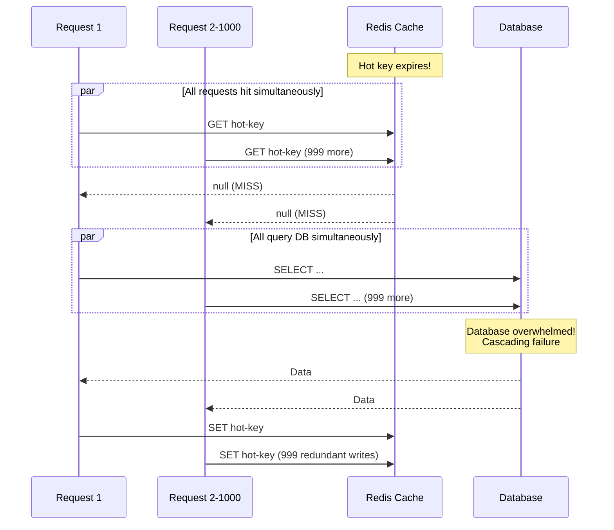
```mermaid
sequenceDiagram
    participant R1 as Request 1
    participant R2 as Request 2-1000
    participant Cache as Redis Cache
    participant DB as Database
    Note over Cache: Hot key expires!

    par All requests hit simultaneously
        R1 ->> Cache: GET hot-key
        R2 ->> Cache: GET hot-key (999 more)
    end

    Cache -->> R1: null (MISS)
    Cache -->> R2: null (MISS)

    par All query DB simultaneously
        R1 ->> DB: SELECT ...
        R2 ->> DB: SELECT ... (999 more)
    end

    Note over DB: Database overwhelmed!<br/>Cascading failure
    DB -->> R1: Data
    DB -->> R2: Data
    R1 ->> Cache: SET hot-key
    R2 ->> Cache: SET hot-key (999 redundant writes)
```

### Solution 1: Single Flight Request

**Flow:** First request acquires lock → Queries DB → Populates cache → Releases lock. Other 999 requests wait, then hit
cache. Only 1 DB query!

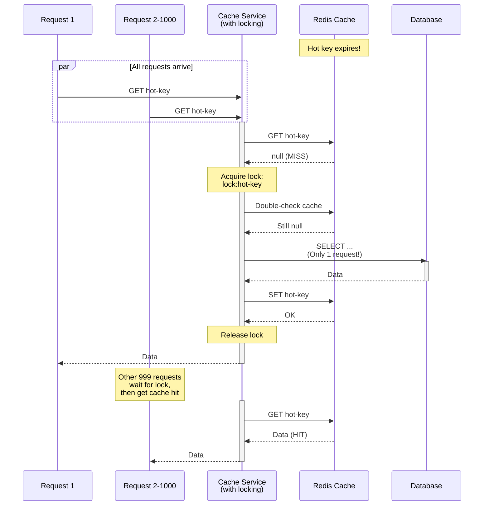
```mermaid
sequenceDiagram
    participant R1 as Request 1
    participant R2 as Request 2-1000
    participant Service as Cache Service<br/>(with locking)
    participant Cache as Redis Cache
    participant DB as Database
    Note over Cache: Hot key expires!

    par All requests arrive
        R1 ->> Service: GET hot-key
        R2 ->> Service: GET hot-key
    end

    activate Service
    Service ->> Cache: GET hot-key
    Cache -->> Service: null (MISS)
    Note over Service: Acquire lock:<br/>lock:hot-key
    Service ->> Cache: Double-check cache
    Cache -->> Service: Still null
    Service ->> DB: SELECT ...<br/>(Only 1 request!)
    activate DB
    DB -->> Service: Data
    deactivate DB
    Service ->> Cache: SET hot-key
    Cache -->> Service: OK
    Note over Service: Release lock
    Service -->> R1: Data
    deactivate Service
    Note over R2: Other 999 requests<br/>wait for lock,<br/>then get cache hit
    activate Service
    Service ->> Cache: GET hot-key
    Cache -->> Service: Data (HIT)
    Service -->> R2: Data
    deactivate Service
```

### Solution 2: Probabilistic Early Expiration

**Flow:** Check TTL remaining. If <10% left, probabilistically refresh cache in background. Cache never fully expires -
always warm.

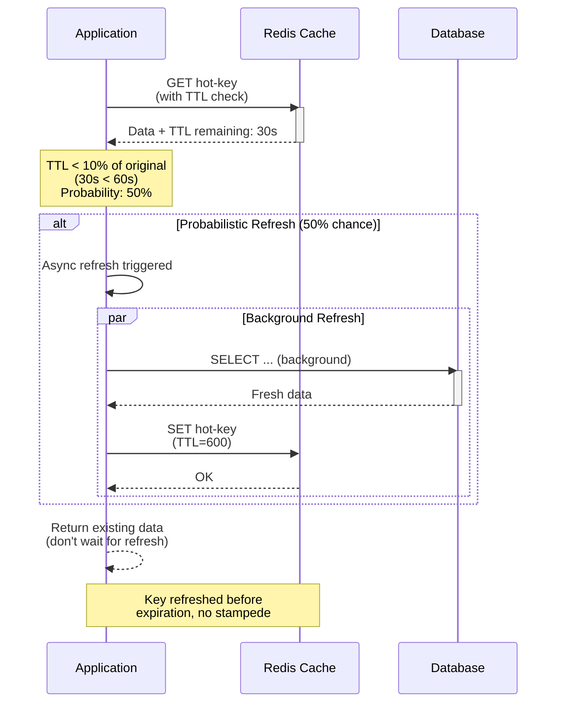
```mermaid
sequenceDiagram
    participant App as Application
    participant Cache as Redis Cache
    participant DB as Database
    App ->> Cache: GET hot-key<br/>(with TTL check)
    activate Cache
    Cache -->> App: Data + TTL remaining: 30s
    deactivate Cache
    Note over App: TTL < 10% of original<br/>(30s < 60s)<br/>Probability: 50%

    alt Probabilistic Refresh (50% chance)
        App ->> App: Async refresh triggered

        par Background Refresh
            App ->> DB: SELECT ... (background)
            activate DB
            DB -->> App: Fresh data
            deactivate DB
            App ->> Cache: SET hot-key<br/>(TTL=600)
            Cache -->> App: OK
        end
    end

    App -->> App: Return existing data<br/>(don't wait for refresh)
    Note over App, Cache: Key refreshed before<br/>expiration, no stampede
```

## Consistent Hashing: Node Addition

### Before Adding Node

**Flow:** 3 nodes, keys distributed via hash ring. Each node owns ~33% of keys. System working but approaching capacity.

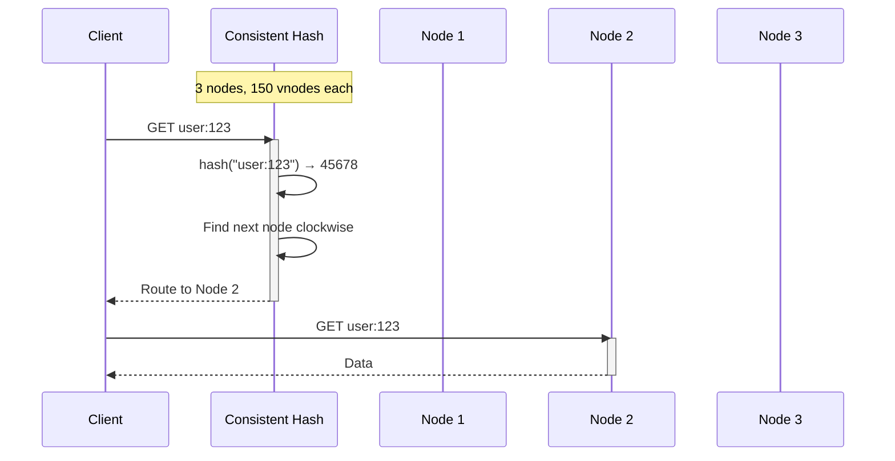
```mermaid
sequenceDiagram
    participant Client as Client
    participant CH as Consistent Hash
    participant N1 as Node 1
    participant N2 as Node 2
    participant N3 as Node 3
    Note over CH: 3 nodes, 150 vnodes each
    Client ->> CH: GET user:123
    activate CH
    CH ->> CH: hash("user:123") → 45678
    CH ->> CH: Find next node clockwise
    CH -->> Client: Route to Node 2
    deactivate CH
    Client ->> N2: GET user:123
    activate N2
    N2 -->> Client: Data
    deactivate N2
```

### After Adding Node 4

**Flow:** Add Node 4 → Only ~25% of keys remapped (those between Node 3 and Node 4 on ring). 75% of keys stay in place.
Minimal disruption!

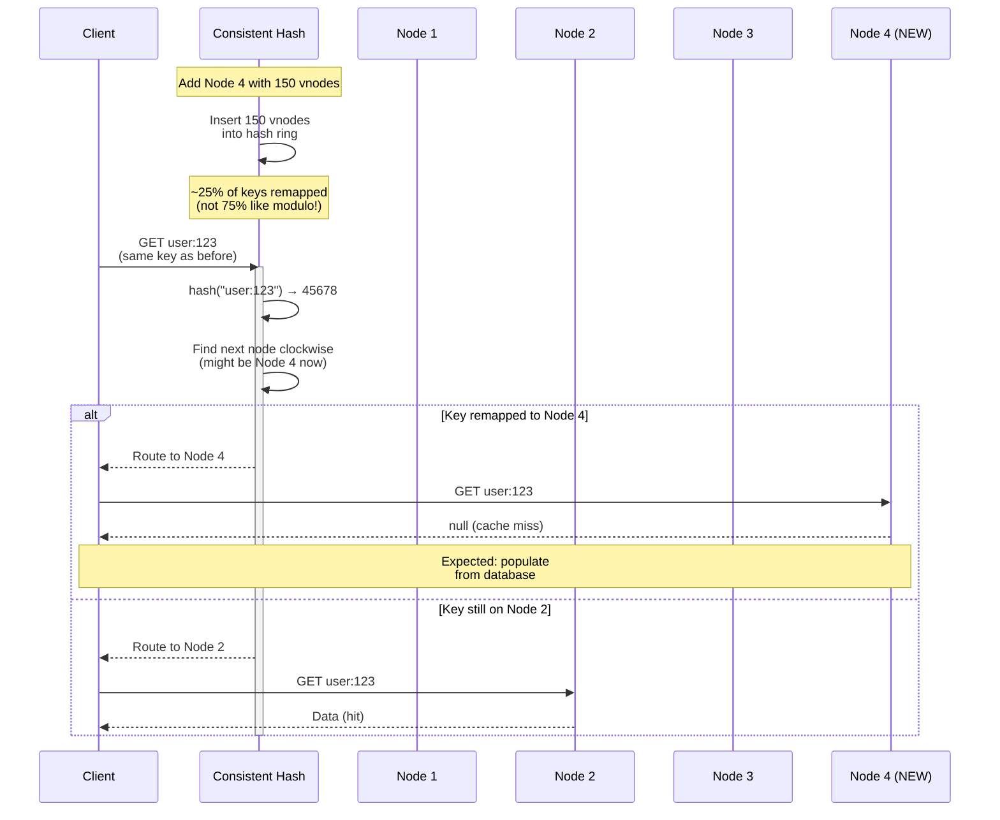
```mermaid
sequenceDiagram
    participant Client as Client
    participant CH as Consistent Hash
    participant N1 as Node 1
    participant N2 as Node 2
    participant N3 as Node 3
    participant N4 as Node 4 (NEW)
    Note over CH: Add Node 4 with 150 vnodes
    CH ->> CH: Insert 150 vnodes<br/>into hash ring
    Note over CH: ~25% of keys remapped<br/>(not 75% like modulo!)
    Client ->> CH: GET user:123<br/>(same key as before)
    activate CH
    CH ->> CH: hash("user:123") → 45678
    CH ->> CH: Find next node clockwise<br/>(might be Node 4 now)

    alt Key remapped to Node 4
        CH -->> Client: Route to Node 4
        Client ->> N4: GET user:123
        N4 -->> Client: null (cache miss)
        Note over Client, N4: Expected: populate<br/>from database
    else Key still on Node 2
        CH -->> Client: Route to Node 2
        Client ->> N2: GET user:123
        N2 -->> Client: Data (hit)
    end

    deactivate CH
```

## Replication Flow

### Async Replication (Default)

**Flow:** Client writes to master → Master returns OK immediately → Master replicates to replicas async (1-5ms lag).
Fast writes, eventual consistency.

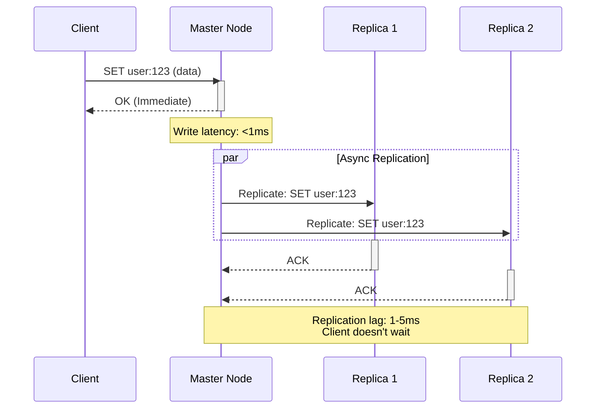
```mermaid
sequenceDiagram
    participant Client as Client
    participant Master as Master Node
    participant Replica1 as Replica 1
    participant Replica2 as Replica 2
    Client ->> Master: SET user:123 (data)
    activate Master
    Master -->> Client: OK (Immediate)
    deactivate Master
    Note over Master: Write latency: <1ms

    par Async Replication
        Master ->> Replica1: Replicate: SET user:123
        Master ->> Replica2: Replicate: SET user:123
    end

    activate Replica1
    Replica1 -->> Master: ACK
    deactivate Replica1
    activate Replica2
    Replica2 -->> Master: ACK
    deactivate Replica2
    Note over Master, Replica2: Replication lag: 1-5ms<br/>Client doesn't wait
```

### Sync Replication (Optional)

**Flow:** Client writes to master → Master replicates to replicas (wait for ACK) → Master returns OK. Slower writes (~
10ms) but strong consistency.

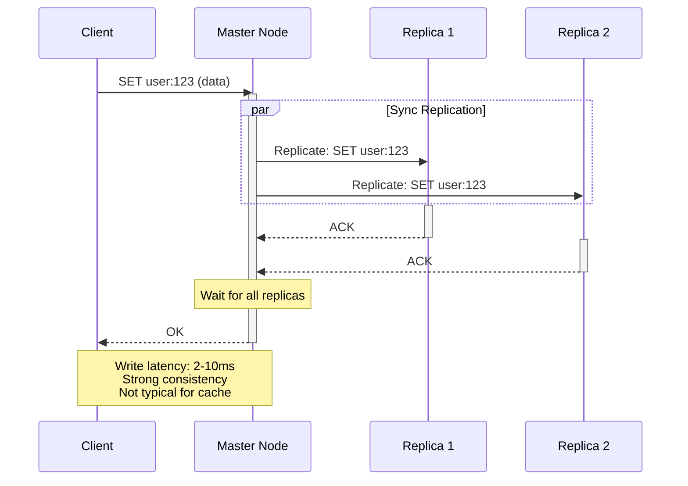
```mermaid
sequenceDiagram
    participant Client as Client
    participant Master as Master Node
    participant Replica1 as Replica 1
    participant Replica2 as Replica 2
    Client ->> Master: SET user:123 (data)
    activate Master

    par Sync Replication
        Master ->> Replica1: Replicate: SET user:123
        Master ->> Replica2: Replicate: SET user:123
    end

    activate Replica1
    Replica1 -->> Master: ACK
    deactivate Replica1
    activate Replica2
    Replica2 -->> Master: ACK
    deactivate Replica2
    Note over Master: Wait for all replicas
    Master -->> Client: OK
    deactivate Master
    Note over Client, Master: Write latency: 2-10ms<br/>Strong consistency<br/>Not typical for cache
```

## Failover Process

### Automatic Failover with Sentinel

**Flow:** Master fails → Sentinels detect via heartbeat timeout → Quorum vote → Promote Replica 1 to master → Notify
clients. ~5-30s downtime.

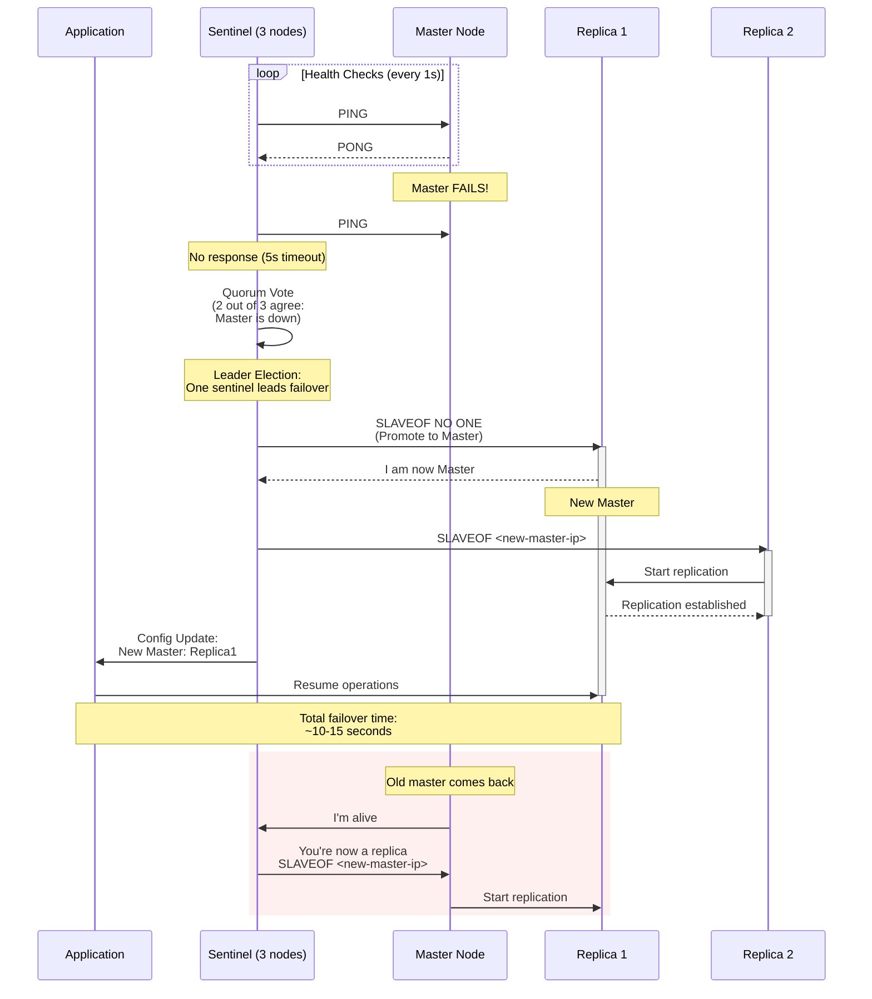
```mermaid
sequenceDiagram
    participant App as Application
    participant Sentinel as Sentinel (3 nodes)
    participant Master as Master Node
    participant Replica1 as Replica 1
    participant Replica2 as Replica 2

    loop Health Checks (every 1s)
        Sentinel ->> Master: PING
        Master -->> Sentinel: PONG
    end

    Note over Master: Master FAILS!
    Sentinel ->> Master: PING
    Note over Sentinel: No response (5s timeout)
    Sentinel ->> Sentinel: Quorum Vote<br/>(2 out of 3 agree:<br/>Master is down)
    Note over Sentinel: Leader Election:<br/>One sentinel leads failover
    Sentinel ->> Replica1: SLAVEOF NO ONE<br/>(Promote to Master)
    activate Replica1
    Replica1 -->> Sentinel: I am now Master
    Note over Replica1: New Master
    Sentinel ->> Replica2: SLAVEOF <new-master-ip>
    activate Replica2
    Replica2 ->> Replica1: Start replication
    Replica1 -->> Replica2: Replication established
    deactivate Replica2
    Sentinel ->> App: Config Update:<br/>New Master: Replica1
    App ->> Replica1: Resume operations
    deactivate Replica1
    Note over App, Replica1: Total failover time:<br/>~10-15 seconds

    rect rgb(255, 240, 240)
        Note over Master: Old master comes back
        Master ->> Sentinel: I'm alive
        Sentinel ->> Master: You're now a replica<br/>SLAVEOF <new-master-ip>
        Master ->> Replica1: Start replication
    end
```

## Redis Cluster Resharding

**Flow:** Add new node → Admin initiates reshard → Cluster moves hash slots from existing nodes to new node → Zero
downtime, seamless migration.

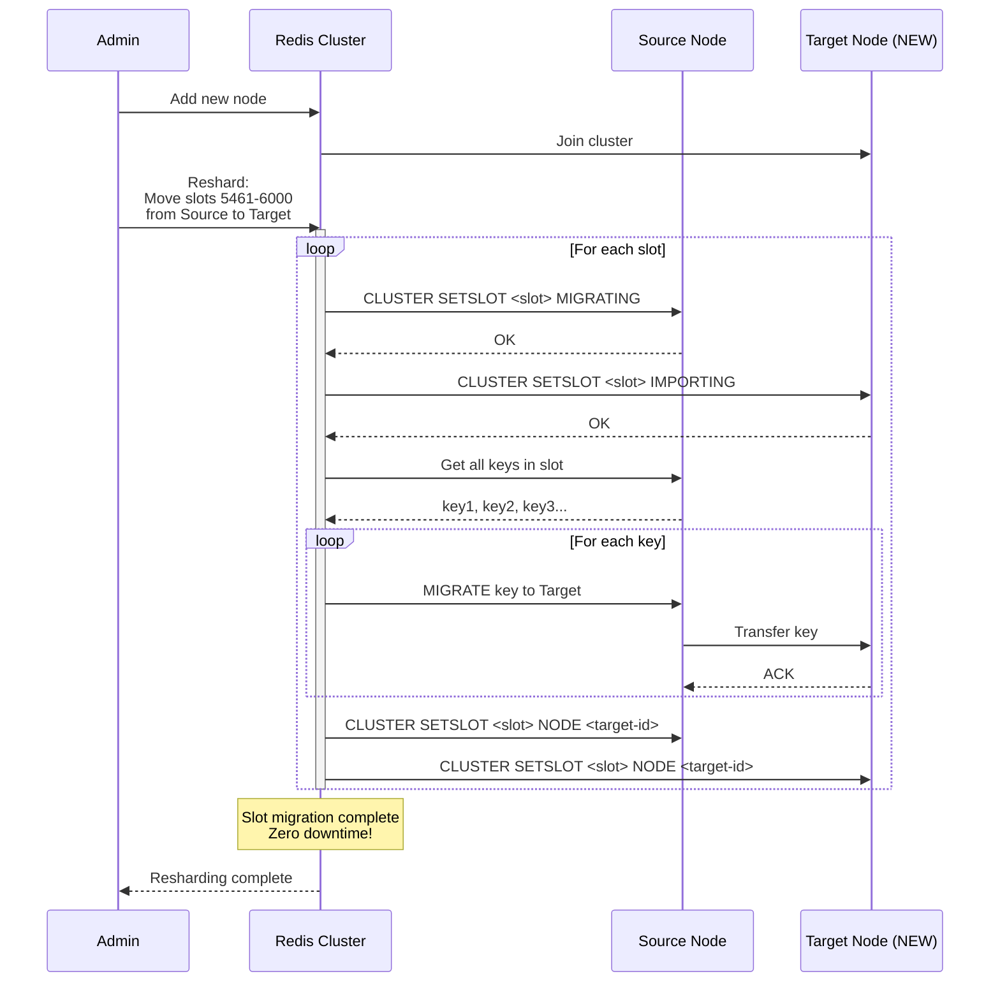
```mermaid
sequenceDiagram
    participant Admin as Admin
    participant Cluster as Redis Cluster
    participant Source as Source Node
    participant Target as Target Node (NEW)
    Admin ->> Cluster: Add new node
    Cluster ->> Target: Join cluster
    Admin ->> Cluster: Reshard:<br/>Move slots 5461-6000<br/>from Source to Target
    activate Cluster

    loop For each slot
        Cluster ->> Source: CLUSTER SETSLOT <slot> MIGRATING
        Source -->> Cluster: OK
        Cluster ->> Target: CLUSTER SETSLOT <slot> IMPORTING
        Target -->> Cluster: OK
        Cluster ->> Source: Get all keys in slot
        Source -->> Cluster: key1, key2, key3...

        loop For each key
            Cluster ->> Source: MIGRATE key to Target
            Source ->> Target: Transfer key
            Target -->> Source: ACK
        end

        Cluster ->> Source: CLUSTER SETSLOT <slot> NODE <target-id>
        Cluster ->> Target: CLUSTER SETSLOT <slot> NODE <target-id>
    end

    deactivate Cluster
    Note over Cluster: Slot migration complete<br/>Zero downtime!
    Cluster -->> Admin: Resharding complete
```

## Connection Pooling

### Without Connection Pool (Inefficient)

**Flow:** Each request creates new TCP connection (~3ms handshake) → Query → Close connection. Wasteful! 3ms overhead
per request.

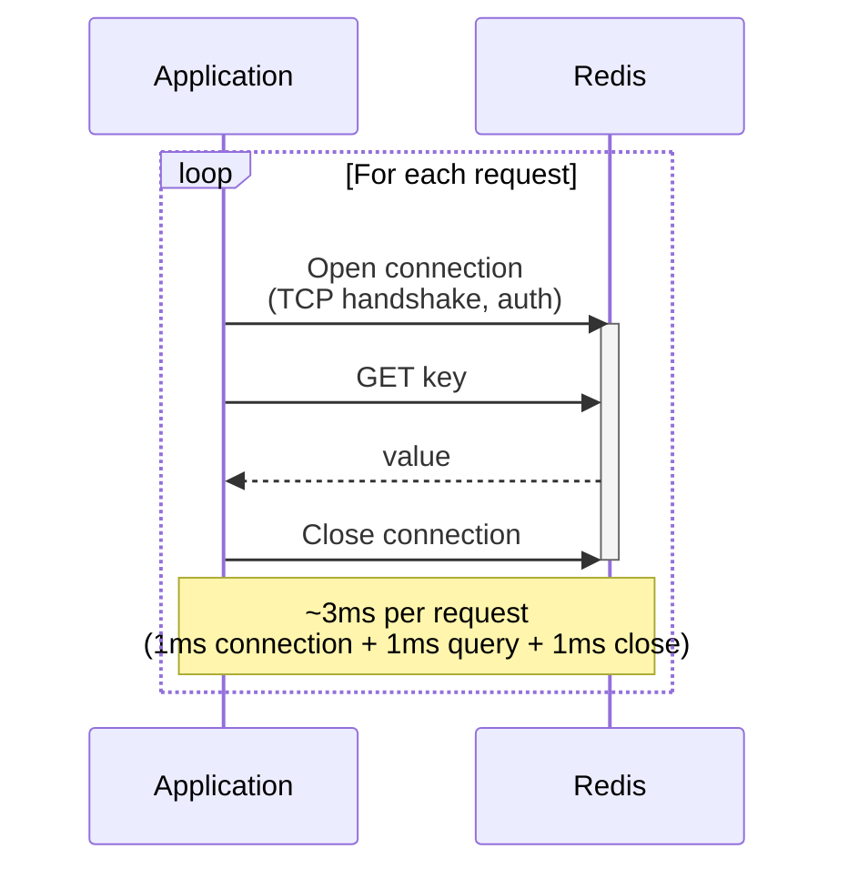
```mermaid
sequenceDiagram
    participant App as Application
    participant Redis as Redis

    loop For each request
        App ->> Redis: Open connection<br/>(TCP handshake, auth)
        activate Redis
        App ->> Redis: GET key
        Redis -->> App: value
        App ->> Redis: Close connection
        deactivate Redis
        Note over App, Redis: ~3ms per request<br/>(1ms connection + 1ms query + 1ms close)
    end
```

### With Connection Pool (Efficient)

**Flow:** Reuse pre-established connections from pool → No handshake overhead → Query → Return connection to pool. ~3x
faster!

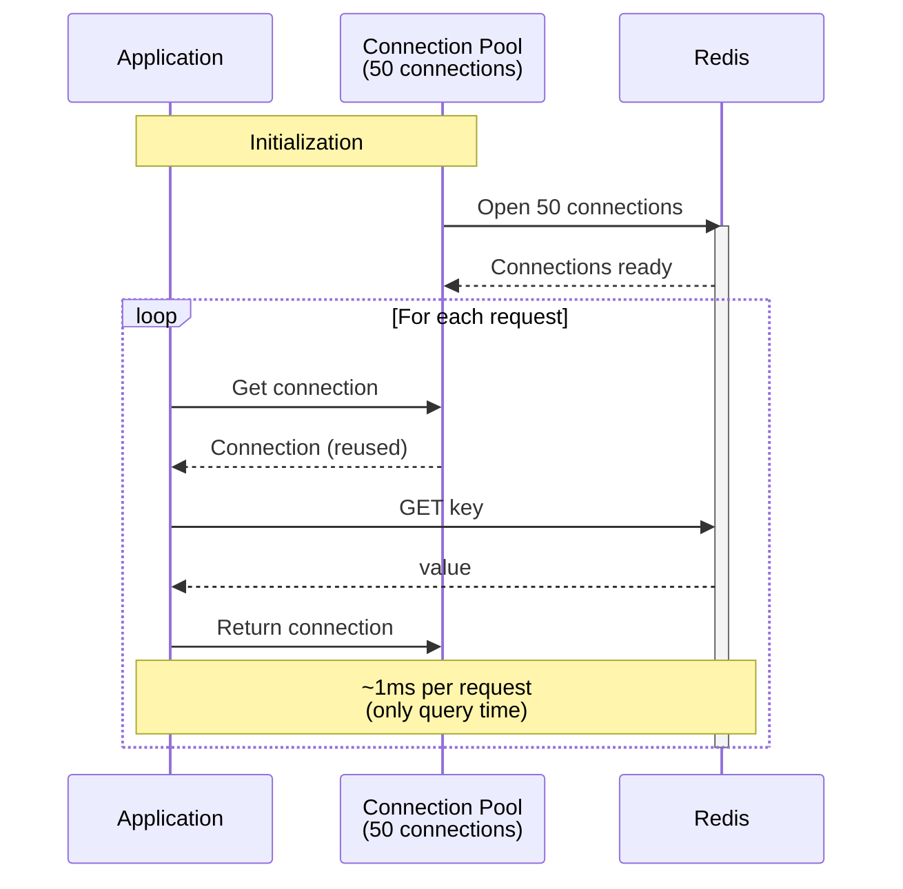
```mermaid
sequenceDiagram
    participant App as Application
    participant Pool as Connection Pool<br/>(50 connections)
    participant Redis as Redis
    Note over App, Pool: Initialization
    Pool ->> Redis: Open 50 connections
    activate Redis
    Redis -->> Pool: Connections ready

    loop For each request
        App ->> Pool: Get connection
        Pool -->> App: Connection (reused)
        App ->> Redis: GET key
        Redis -->> App: value
        App ->> Pool: Return connection
        Note over App, Redis: ~1ms per request<br/>(only query time)
    end

    deactivate Redis
```

## Pipelining for Batch Operations

### Without Pipelining

**Flow:** 10 commands → 10 round-trips → 10 * 0.5ms = 5ms total. Each command waits for previous to complete.

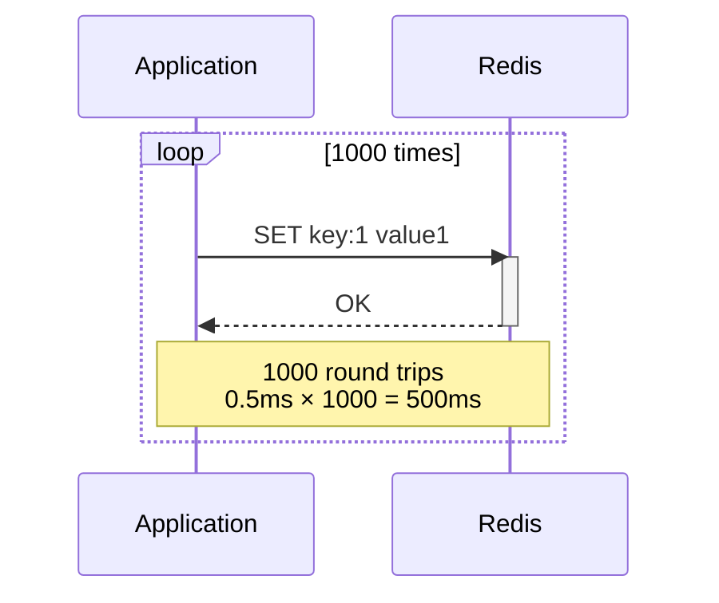
```mermaid
sequenceDiagram
    participant App as Application
    participant Redis as Redis

    loop 1000 times
        App ->> Redis: SET key:1 value1
        activate Redis
        Redis -->> App: OK
        deactivate Redis
        Note over App, Redis: 1000 round trips<br/>0.5ms × 1000 = 500ms
    end
```

### With Pipelining

**Flow:** Batch 10 commands together → 1 round-trip → 0.5ms total. 10x faster! All commands sent at once, responses
batched.

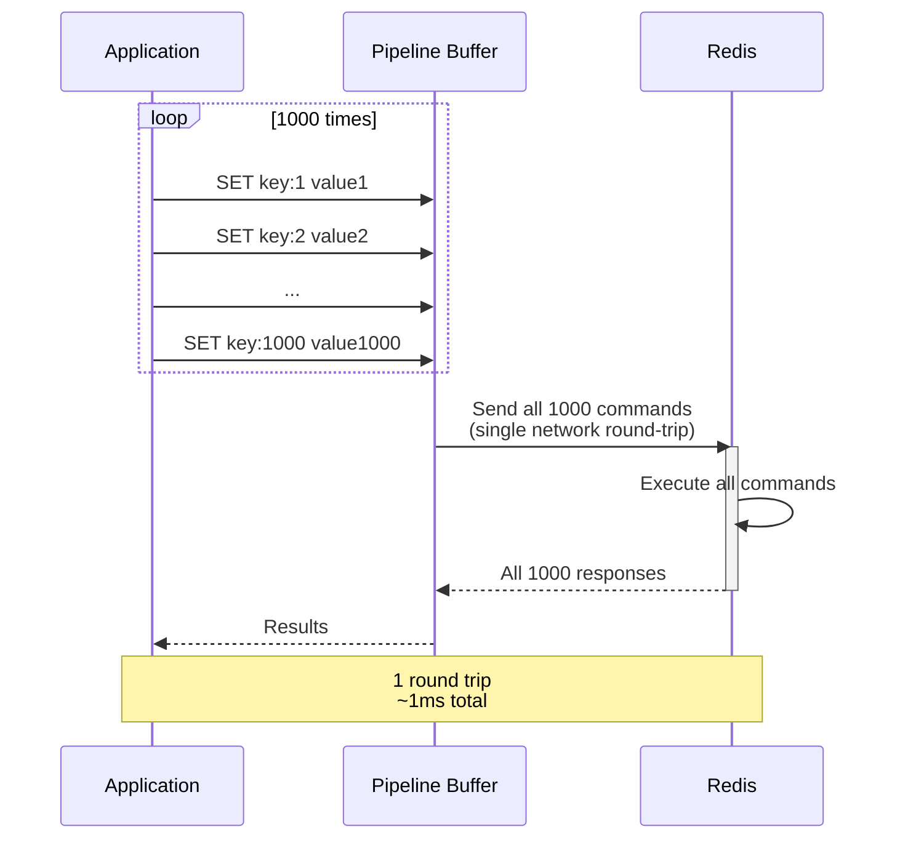
```mermaid
sequenceDiagram
    participant App as Application
    participant Pipeline as Pipeline Buffer
    participant Redis as Redis

    loop 1000 times
        App ->> Pipeline: SET key:1 value1
        App ->> Pipeline: SET key:2 value2
        App ->> Pipeline: ...
        App ->> Pipeline: SET key:1000 value1000
    end

    Pipeline ->> Redis: Send all 1000 commands<br/>(single network round-trip)
    activate Redis
    Redis ->> Redis: Execute all commands
    Redis -->> Pipeline: All 1000 responses
    deactivate Redis
    Pipeline -->> App: Results
    Note over App, Redis: 1 round trip<br/>~1ms total
```

## Monitoring and Alerting Flow

**Flow:** Cache exposes metrics → Prometheus scrapes → Evaluates alert rules → Alertmanager notifies ops → Ops
investigates. Proactive monitoring.

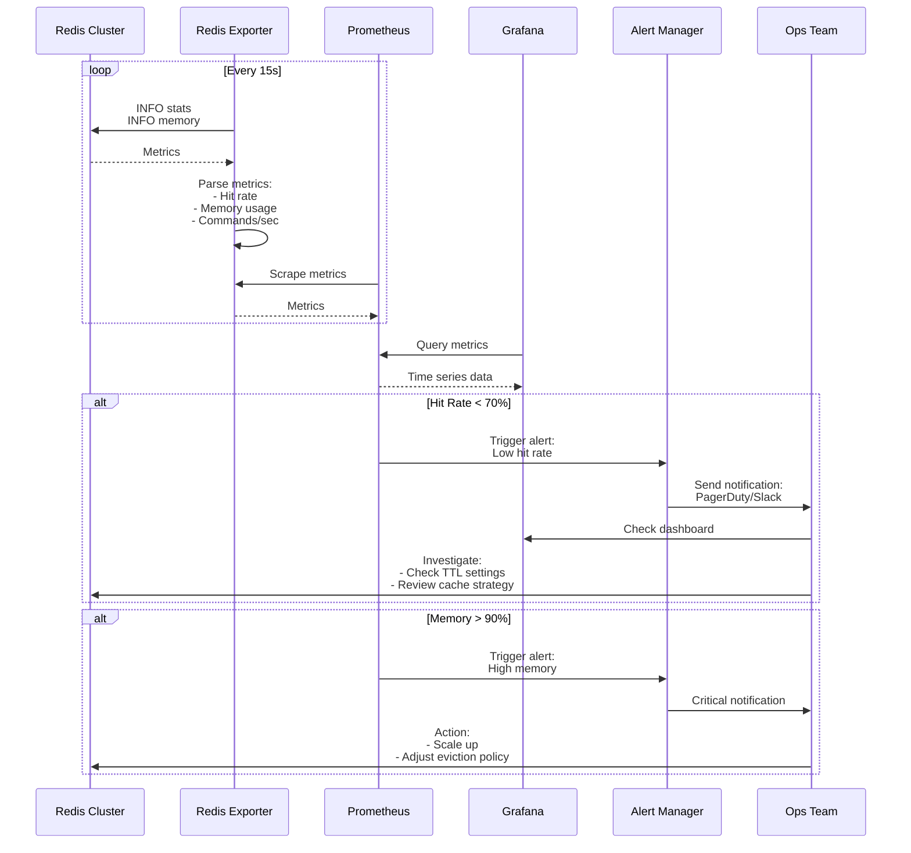
```mermaid
sequenceDiagram
    participant Redis as Redis Cluster
    participant Exporter as Redis Exporter
    participant Prometheus as Prometheus
    participant Grafana as Grafana
    participant Alert as Alert Manager
    participant Ops as Ops Team

    loop Every 15s
        Exporter ->> Redis: INFO stats<br/>INFO memory
        Redis -->> Exporter: Metrics
        Exporter ->> Exporter: Parse metrics:<br/>- Hit rate<br/>- Memory usage<br/>- Commands/sec
        Prometheus ->> Exporter: Scrape metrics
        Exporter -->> Prometheus: Metrics
    end

    Grafana ->> Prometheus: Query metrics
    Prometheus -->> Grafana: Time series data

    alt Hit Rate < 70%
        Prometheus ->> Alert: Trigger alert:<br/>Low hit rate
        Alert ->> Ops: Send notification:<br/>PagerDuty/Slack
        Ops ->> Grafana: Check dashboard
        Ops ->> Redis: Investigate:<br/>- Check TTL settings<br/>- Review cache strategy
    end

    alt Memory > 90%
        Prometheus ->> Alert: Trigger alert:<br/>High memory
        Alert ->> Ops: Critical notification
        Ops ->> Redis: Action:<br/>- Scale up<br/>- Adjust eviction policy
    end
```

## Multi-Region Deployment

**Flow:** Client routed to nearest region by GeoDNS → Query regional cache cluster → If miss: Query regional DB
replica → Low latency globally.

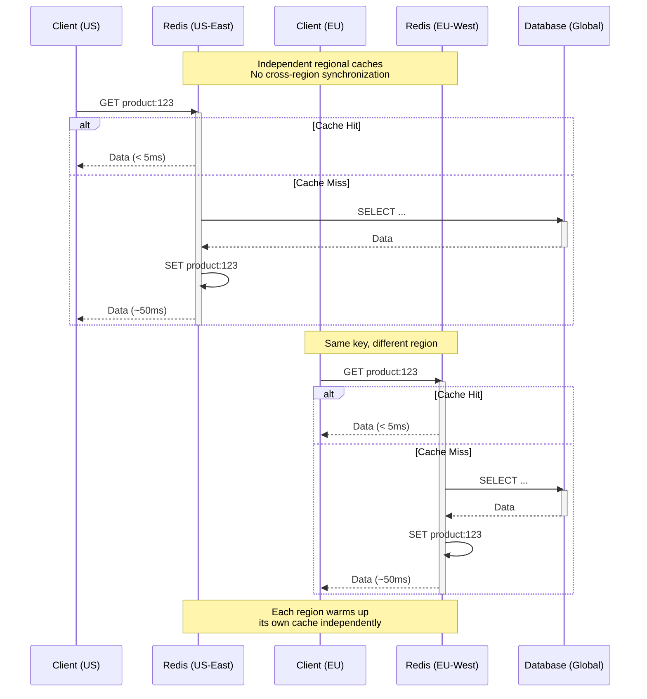
```mermaid
sequenceDiagram
    participant US_Client as Client (US)
    participant US_Cache as Redis (US-East)
    participant EU_Client as Client (EU)
    participant EU_Cache as Redis (EU-West)
    participant DB as Database (Global)
    Note over US_Cache, EU_Cache: Independent regional caches<br/>No cross-region synchronization
    US_Client ->> US_Cache: GET product:123
    activate US_Cache

    alt Cache Hit
        US_Cache -->> US_Client: Data (< 5ms)
    else Cache Miss
        US_Cache ->> DB: SELECT ...
        activate DB
        DB -->> US_Cache: Data
        deactivate DB
        US_Cache ->> US_Cache: SET product:123
        US_Cache -->> US_Client: Data (~50ms)
    end
    deactivate US_Cache
    Note over EU_Client, EU_Cache: Same key, different region
    EU_Client ->> EU_Cache: GET product:123
    activate EU_Cache

    alt Cache Hit
        EU_Cache -->> EU_Client: Data (< 5ms)
    else Cache Miss
        EU_Cache ->> DB: SELECT ...
        activate DB
        DB -->> EU_Cache: Data
        deactivate DB
        EU_Cache ->> EU_Cache: SET product:123
        EU_Cache -->> EU_Client: Data (~50ms)
    end
    deactivate EU_Cache
    Note over US_Cache, EU_Cache: Each region warms up<br/>its own cache independently
```

## Cache Warming on Startup

**Flow:** New cache node starts → Fetch top N hot keys from DB → Pre-populate cache → Mark ready. Avoids cold start
stampede.

```mermaid
sequenceDiagram
    participant Admin as Admin
    participant Warmer as Cache Warmer
    participant DB as Database
    participant Cache as Redis Cache (NEW)
    Admin ->> Warmer: Start cache warming
    activate Warmer
    Warmer ->> DB: SELECT top 10000 hot products
    activate DB
    DB -->> Warmer: Product data
    deactivate DB

    loop For each product
        Warmer ->> Cache: SET product:<id><br/>(data, TTL=3600)
        Cache -->> Warmer: OK
    end

    Warmer -->> Admin: Warming complete:<br/>10000 keys loaded
    deactivate Warmer
    Note over Cache: Cache ready to serve<br/>80%+ hit rate from start
    participant Client as Client
    Client ->> Cache: GET product:123
    activate Cache
    Cache -->> Client: Data (HIT)<br/>No cold start!
    deactivate Cache
```

