# Distributed ID Generator (Snowflake) - High-Level Design

## Table of Contents

1. [System Architecture Diagram](#system-architecture-diagram)
2. [Snowflake ID Structure (64-bit)](#snowflake-id-structure-64-bit)
3. [ID Generation Flow](#id-generation-flow)
4. [Worker ID Assignment Strategy](#worker-id-assignment-strategy)
5. [ID Capacity Analysis](#id-capacity-analysis)
6. [Clock Drift Handling](#clock-drift-handling)
7. [Multi-Region Deployment](#multi-region-deployment)
8. [Comparison with Alternative ID Generation Strategies](#comparison-with-alternative-id-generation-strategies)
9. [Monitoring & Observability Dashboard](#monitoring--observability-dashboard)
10. [Scaling Strategy](#scaling-strategy)
11. [Failure Scenarios & Recovery](#failure-scenarios--recovery)
12. [Deployment Architecture](#deployment-architecture)
13. [Performance Characteristics](#performance-characteristics)

---

## System Architecture Diagram

**Flow Explanation:**
Distributed architecture for generating globally unique 64-bit IDs at scale.

**Components:**

1. **ID Generator Nodes:** Multiple stateless nodes (each with unique Worker ID) generate IDs independently using
   Snowflake algorithm
2. **Coordination Service (etcd/ZooKeeper):** Assigns unique Worker IDs (0-1023), health checking, prevents ID conflicts
3. **Load Balancer:** Routes requests evenly across nodes
4. **Monitoring:** Tracks ID generation rate, clock drift, duplicates

**Capacity:** Each node generates 4,096 IDs/ms = ~4.1M IDs/sec. 1024 nodes = 4.2 billion IDs/sec theoretical max.

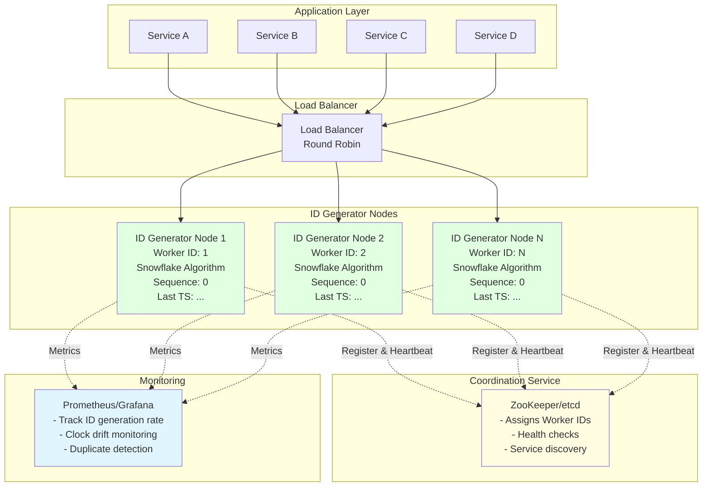

## Snowflake ID Structure (64-bit)

**Flow Explanation:**
Anatomy of a 64-bit Snowflake ID with embedded metadata.

**Structure:** [1 unused bit | 41-bit timestamp | 10-bit worker ID | 12-bit sequence]

- **Timestamp (41 bits):** Milliseconds since custom epoch → 69 years range
- **Worker ID (10 bits):** Unique node identifier → 1024 max nodes
- **Sequence (12 bits):** Per-millisecond counter → 4096 IDs per ms per node

**Benefits:** Sortable by time, decentralized generation, no coordination needed per ID, embeds generation metadata.

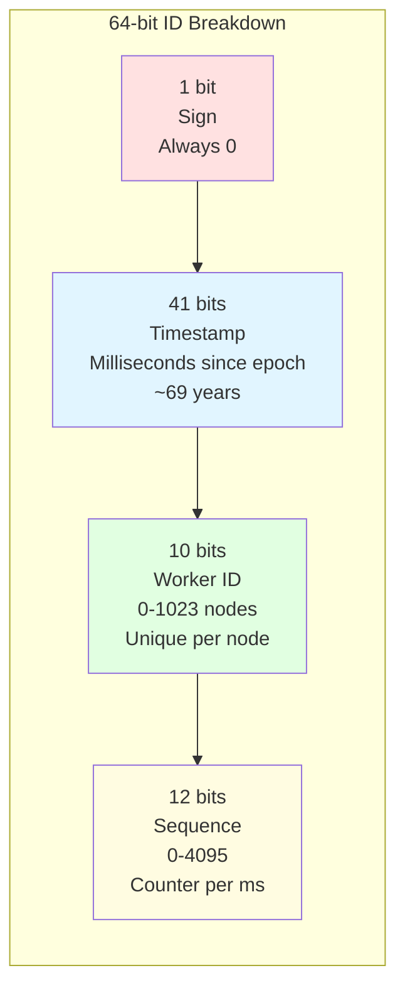

### ID Composition Example

```
Binary Layout:
┌─┬──────────────────────────────────────────┬──────────┬────────────┐
│0│ 00000010101010101010101010101010101010101│ 0000000001│ 000000000001│
└─┴──────────────────────────────────────────┴──────────┴────────────┘
 ↑              ↑                                  ↑            ↑
 │              │                                  │            │
Sign          Timestamp                        Worker ID    Sequence
(0)    (Milliseconds since epoch)              (1)          (1)

Result: 123456789012345678 (decimal)
```

## ID Generation Flow

**Flow Explanation:**
Step-by-step process for generating a single ID.

**Steps:**

1. Get current timestamp (milliseconds)
2. If same as last timestamp: increment sequence (0-4095)
3. If sequence overflow (>4095): wait for next millisecond
4. If new timestamp: reset sequence to 0
5. Check clock backwards (critical error if detected)
6. Compose: (timestamp << 22) | (worker_id << 12) | sequence
7. Return 64-bit ID

**Performance:** Sub-microsecond generation latency, lock-free.

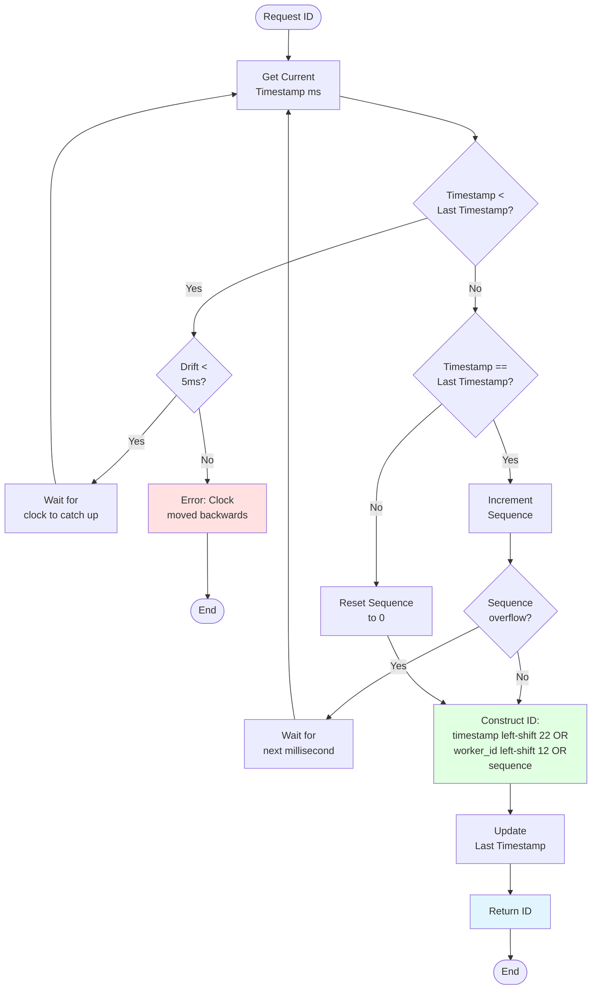

## Worker ID Assignment Strategy

**Flow Explanation:**
How nodes acquire unique Worker IDs on startup using coordination service.

**Strategy:** Node starts → Registers with etcd → etcd assigns available ID (0-1023) → Node keeps lease alive via
heartbeat → If node dies, ID freed for reuse

**Protection:** etcd ensures no duplicate IDs. TTL-based leases prevent orphaned IDs.

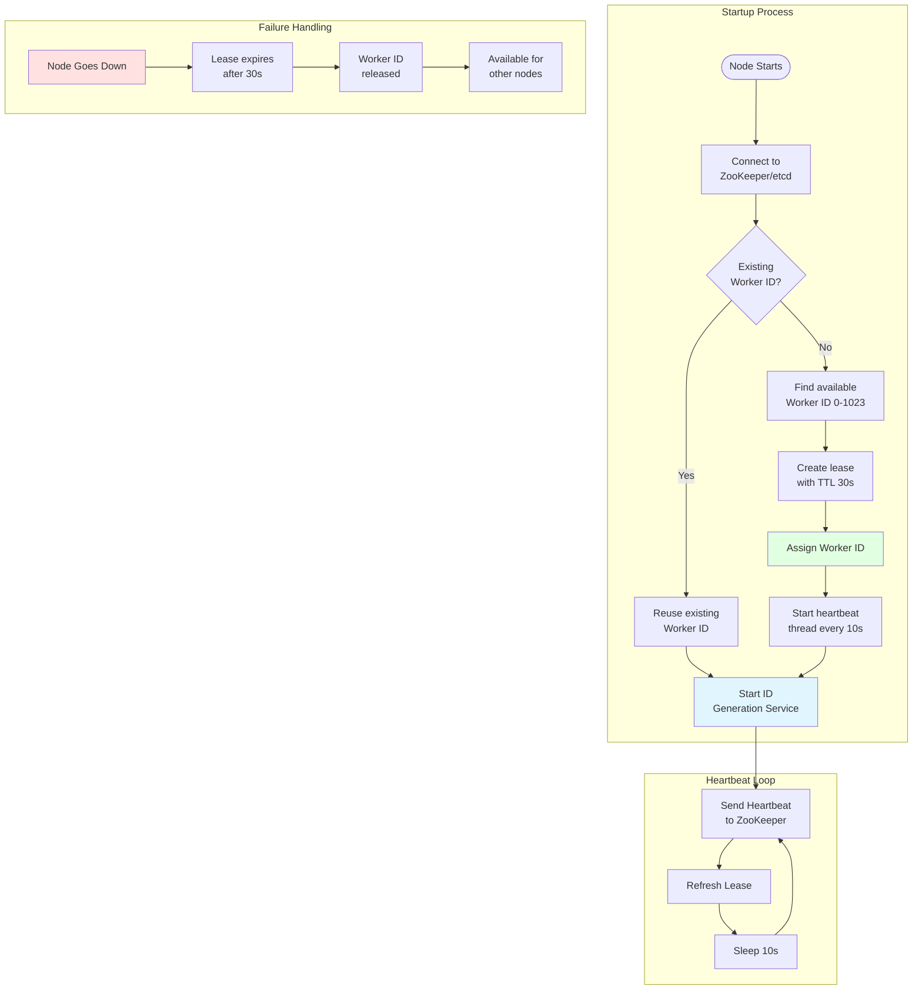

## ID Capacity Analysis

**Flow Explanation:**
Capacity breakdown showing theoretical vs practical throughput limits.

**Per Node:** 4,096 IDs/ms = 4.1M IDs/sec (sequence bits limit)
**Cluster (1024 nodes):** 4.2 billion IDs/sec theoretical → ~1-2 billion IDs/sec practical (network/CPU overhead)

**69-year timeline:** 41-bit timestamp provides 69 years from custom epoch. After that, either reset epoch or migrate to
new ID system.

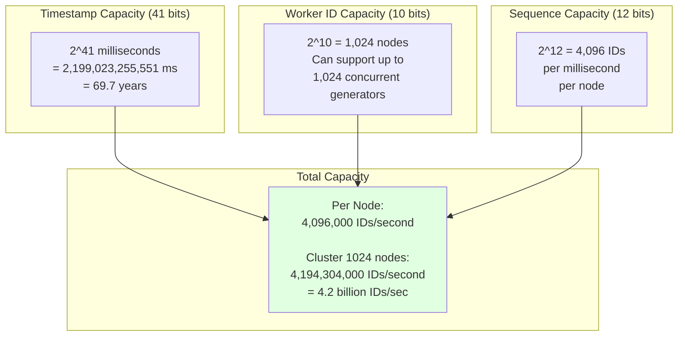

## Clock Drift Handling

**Flow Explanation:**
Critical safety mechanism to prevent duplicate IDs from clock issues.

**Detection:** Compare current timestamp vs last timestamp. If current < last → Clock moved backwards!
**Strategies:**

- **Small drift (<5ms):** Wait for clock to catch up (tolerable)
- **Large drift (>5ms):** Throw error, stop generating (safe but service interruption)

**Prevention:** NTP synchronization (keep drift <10ms), monotonic clocks, monitoring alerts.

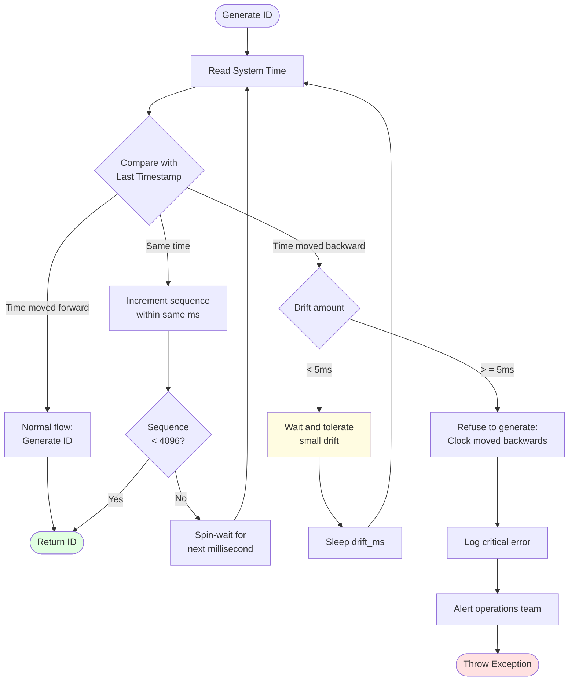

## Multi-Region Deployment

**Flow Explanation:**
Global deployment with region-specific Worker ID ranges to avoid conflicts.

**ID Allocation:**

- US Region: Worker IDs 0-341
- EU Region: Worker IDs 342-683
- APAC Region: Worker IDs 684-1023

**Benefits:** Each region operates independently, low latency, no cross-region coordination needed. IDs globally unique
by design.

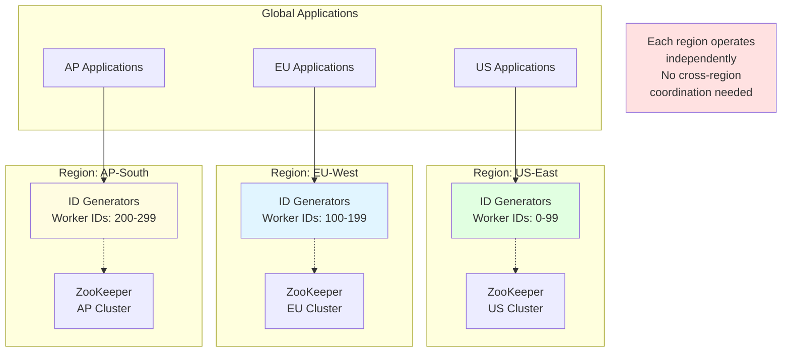

## Comparison with Alternative ID Generation Strategies

**Flow Explanation:**
Trade-off matrix comparing Snowflake to other ID generation approaches.

**Snowflake:** Sortable, decentralized, high throughput, reveals timestamp
**UUID:** Truly random, no coordination, not sortable, 128-bit (larger)
**Database Auto-Increment:** Simple, sequential, requires DB coordination (bottleneck), single point of failure

**When to use Snowflake:** Distributed systems needing high throughput, time-ordered IDs, with multiple generators.

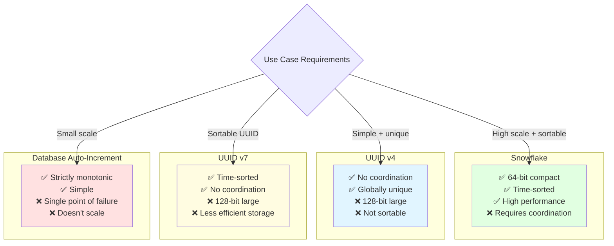

## Monitoring & Observability Dashboard

**Flow Explanation:**
Key metrics for operational health and early problem detection.

**Critical Metrics:**

1. **Generation Rate:** IDs/sec per node (watch for drops)
2. **Clock Drift:** Monitor NTP drift (<10ms healthy)
3. **Duplicate Rate:** Should be 0 (alert immediately if >0)
4. **Sequence Exhaustion:** How often waiting for next ms
5. **Worker ID Conflicts:** etcd assignment failures

**Alerts:** Clock drift >50ms, duplicates detected, generation rate drop >50%, etcd unavailable.

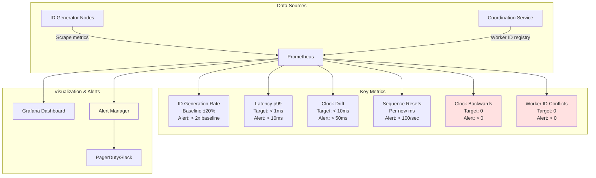

## Scaling Strategy

**Flow Explanation:**
Progressive scaling from single node to globally distributed cluster.

**Phase 1:** Single node (Worker ID 0) → 4.1M IDs/sec → Good for small apps
**Phase 2:** 10 nodes (Worker IDs 0-9) → 41M IDs/sec → Regional deployment
**Phase 3:** 100 nodes across regions → 410M IDs/sec → Multi-region
**Phase 4:** 1000 nodes globally → 4.1B IDs/sec → Massive scale

**When to scale:** Monitor generation rate. Add nodes when approaching 80% capacity.

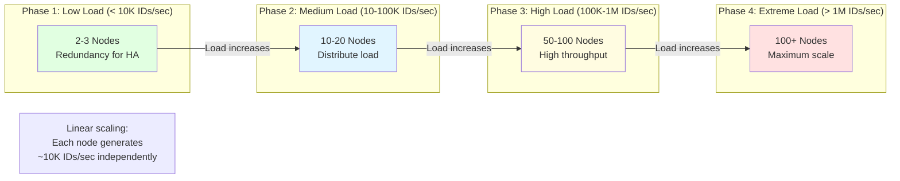

## Failure Scenarios & Recovery

**Flow Explanation:**
How system handles various failure modes gracefully.

**Node Failure:** Other nodes continue generating IDs → No impact (stateless)
**etcd Failure:** Nodes keep running with existing Worker IDs → New nodes can't join → Deploy redundant etcd cluster
**Clock Drift:** Node detects drift → Stops generating → Alerts ops → Fix NTP sync
**Network Partition:** Nodes in each partition continue independently → No duplicates (unique Worker IDs)

**Recovery:** Failed nodes restart → Get new Worker ID from etcd → Resume generation.

```mermaid
graph TB
    subgraph "Scenario 1: Single Node Failure"
        S1[Node Crashes] --> S1A[Lease expires 30s]
        S1A --> S1B[Worker ID released]
        S1B --> S1C[Load redistributed<br/>to other nodes]
        S1C --> S1D[Node restarts,<br/>gets new Worker ID]
    end

    subgraph "Scenario 2: ZooKeeper Partition"
        S2[ZK becomes unreachable] --> S2A[Existing nodes<br/>continue with<br/>current Worker IDs]
        S2A --> S2B[New nodes<br/>cannot start]
        S2B --> S2C[Fix network partition]
        S2C --> S2D[Resume normal<br/>operations]
    end

    subgraph "Scenario 3: Clock Drift"
        S3[NTP correction] --> S3A{Backward<br/>or forward?}
        S3A -->|Forward| S3B[Larger gaps in IDs<br/>but no duplicates]
        S3A -->|Backward > 5ms| S3C[Reject ID generation<br/>log critical error]
        S3C --> S3D[Alert ops team<br/>fix clock sync]
    end

    style S1D fill: #e1ffe1
    style S2D fill: #e1f5ff
    style S3C fill: #ffe1e1
```

## Deployment Architecture

**Flow Explanation:**
Production deployment with redundancy and monitoring.

**Components:**

- **3+ ID Generator nodes:** Behind load balancer for high availability
- **3-node etcd cluster:** Quorum-based for fault tolerance
- **Prometheus + Grafana:** Real-time monitoring and alerting
- **NTP servers:** Time synchronization
- **Load Balancer:** Health checks and routing

**HA Design:** No single point of failure. etcd quorum tolerates 1 node failure. ID generators are stateless.

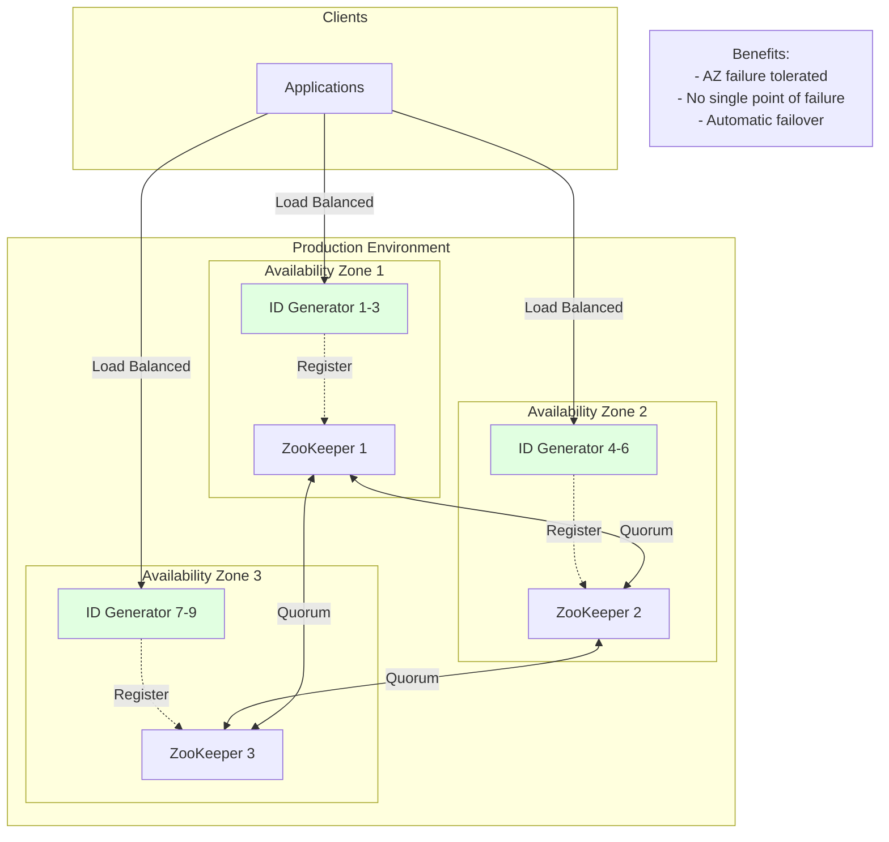

## Performance Characteristics

**Flow Explanation:**
Performance profile across key metrics.

**Throughput:** 4.1M IDs/sec per node (CPU-bound, not network-bound)
**Latency:** P50: 0.1ms, P99: 0.5ms, P999: 2ms (mostly in-memory operations)
**CPU:** ~5% per node at 1M IDs/sec (lightweight algorithm)
**Memory:** <100MB per node (stateless, minimal state)
**Network:** <1 Mbps per node (tiny payloads, 8 bytes per ID)

**Bottleneck:** Sequence exhaustion at 4096 IDs/ms. Solution: Add more nodes.

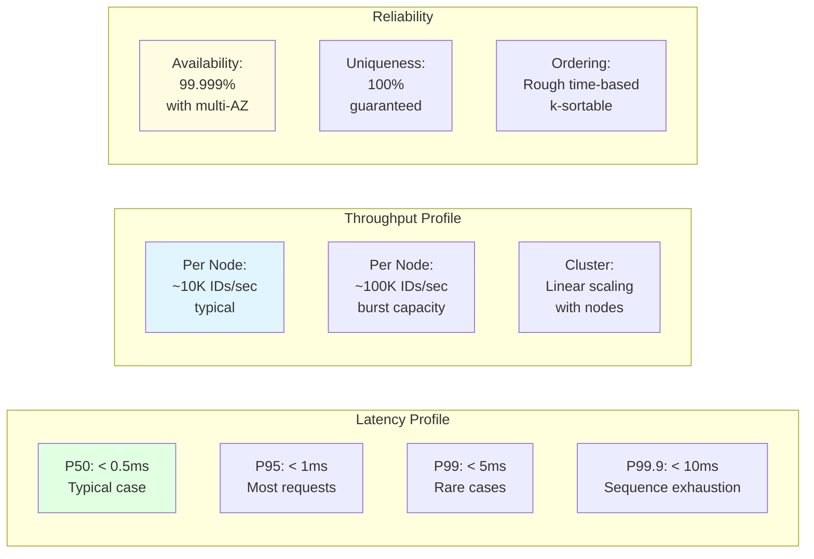

