# Distributed ID Generator (Snowflake) - Sequence Diagrams

## ID Generation Flow (Happy Path)

**Flow:** Client → ID Generator → Check timestamp → Increment sequence → Compose 64-bit ID → Return. Sub-millisecond latency, lock-free.

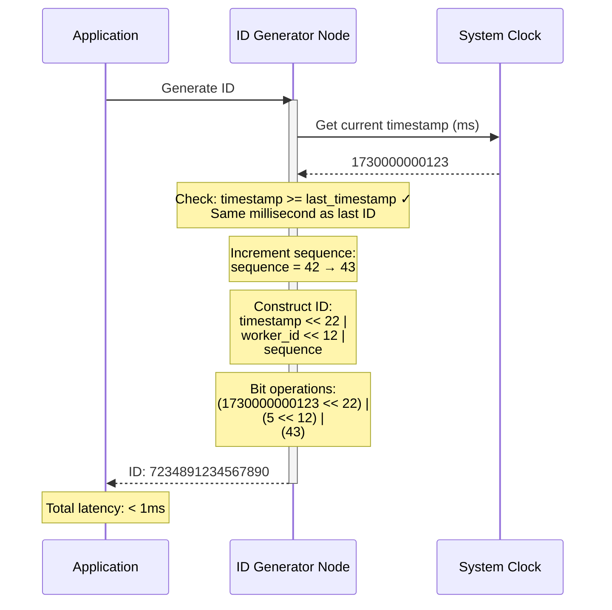
```mermaid
sequenceDiagram
    participant App as Application
    participant IDGen as ID Generator Node
    participant Clock as System Clock

    App->>IDGen: Generate ID
    activate IDGen
    
    IDGen->>Clock: Get current timestamp (ms)
    Clock-->>IDGen: 1730000000123
    
    Note over IDGen: Check: timestamp >= last_timestamp ✓<br/>Same millisecond as last ID
    
    Note over IDGen: Increment sequence:<br/>sequence = 42 → 43
    
    Note over IDGen: Construct ID:<br/>timestamp << 22 |<br/>worker_id << 12 |<br/>sequence
    
    Note over IDGen: Bit operations:<br/>(1730000000123 << 22) |<br/>(5 << 12) |<br/>(43)
    
    IDGen-->>App: ID: 7234891234567890
    deactivate IDGen
    
    Note over App: Total latency: < 1ms
```

## Worker ID Assignment (Startup)

**Flow:** Node starts → Register with etcd → Check for existing Worker ID → If none: Find available slot → Create lease → Start heartbeat → Begin generating IDs.

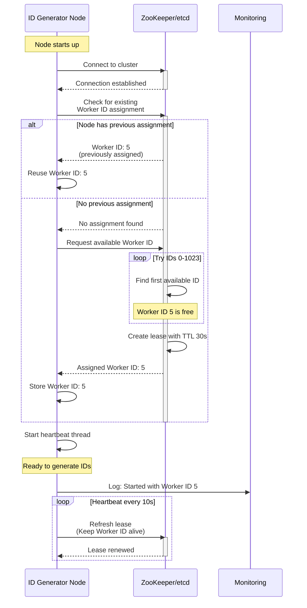
```mermaid
sequenceDiagram
    participant Node as ID Generator Node
    participant ZK as ZooKeeper/etcd
    participant Monitor as Monitoring

    Note over Node: Node starts up
    
    Node->>ZK: Connect to cluster
    activate ZK
    ZK-->>Node: Connection established
    deactivate ZK
    
    Node->>ZK: Check for existing<br/>Worker ID assignment
    activate ZK
    
    alt Node has previous assignment
        ZK-->>Node: Worker ID: 5<br/>(previously assigned)
        Node->>Node: Reuse Worker ID: 5
    else No previous assignment
        ZK-->>Node: No assignment found
        
        Node->>ZK: Request available Worker ID
        
        loop Try IDs 0-1023
            ZK->>ZK: Find first available ID
            Note over ZK: Worker ID 5 is free
        end
        
        ZK->>ZK: Create lease with TTL 30s
        ZK-->>Node: Assigned Worker ID: 5
        
        Node->>Node: Store Worker ID: 5
    end
    
    deactivate ZK
    
    Node->>Node: Start heartbeat thread
    
    Note over Node: Ready to generate IDs
    
    Node->>Monitor: Log: Started with Worker ID 5
    
    loop Heartbeat every 10s
        Node->>ZK: Refresh lease<br/>(Keep Worker ID alive)
        activate ZK
        ZK-->>Node: Lease renewed
        deactivate ZK
    end
```

## Sequence Exhaustion Handling

**Flow:** Generate ID → Sequence reaches 4095 (max) → Wait for next millisecond → Reset sequence to 0 → Resume generation. Adds ~1ms latency occasionally.

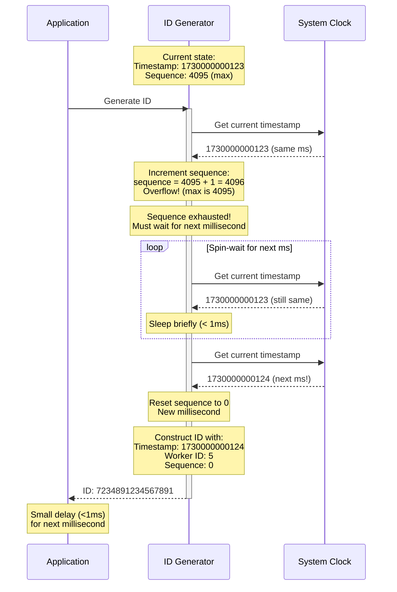
```mermaid
sequenceDiagram
    participant App as Application
    participant IDGen as ID Generator
    participant Clock as System Clock

    Note over IDGen: Current state:<br/>Timestamp: 1730000000123<br/>Sequence: 4095 (max)
    
    App->>IDGen: Generate ID
    activate IDGen
    
    IDGen->>Clock: Get current timestamp
    Clock-->>IDGen: 1730000000123 (same ms)
    
    Note over IDGen: Increment sequence:<br/>sequence = 4095 + 1 = 4096<br/>Overflow! (max is 4095)
    
    Note over IDGen: Sequence exhausted!<br/>Must wait for next millisecond
    
    loop Spin-wait for next ms
        IDGen->>Clock: Get current timestamp
        Clock-->>IDGen: 1730000000123 (still same)
        Note over IDGen: Sleep briefly (< 1ms)
    end
    
    IDGen->>Clock: Get current timestamp
    Clock-->>IDGen: 1730000000124 (next ms!)
    
    Note over IDGen: Reset sequence to 0<br/>New millisecond
    
    Note over IDGen: Construct ID with:<br/>Timestamp: 1730000000124<br/>Worker ID: 5<br/>Sequence: 0
    
    IDGen-->>App: ID: 7234891234567891
    deactivate IDGen
    
    Note over App: Small delay (<1ms)<br/>for next millisecond
```

## Clock Drift Detection & Handling

### Scenario 1: Small Backward Drift (Tolerable)

**Flow:** Detect clock backwards by 3ms (< 5ms threshold) → Wait 3ms for clock to catch up → Resume generation. Minimal service disruption.

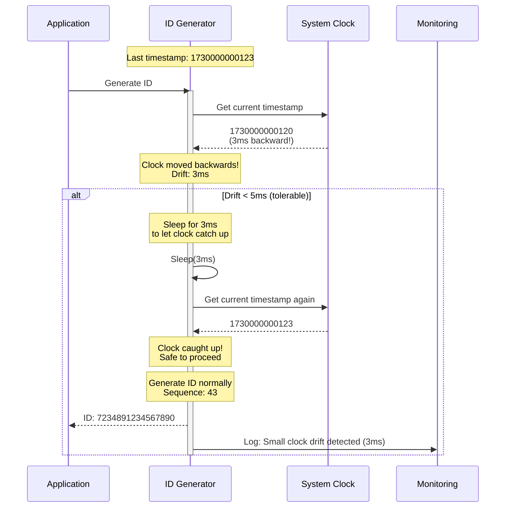
```mermaid
sequenceDiagram
    participant App as Application
    participant IDGen as ID Generator
    participant Clock as System Clock
    participant Monitor as Monitoring

    Note over IDGen: Last timestamp: 1730000000123
    
    App->>IDGen: Generate ID
    activate IDGen
    
    IDGen->>Clock: Get current timestamp
    Clock-->>IDGen: 1730000000120<br/>(3ms backward!)
    
    Note over IDGen: Clock moved backwards!<br/>Drift: 3ms
    
    alt Drift < 5ms (tolerable)
        Note over IDGen: Sleep for 3ms<br/>to let clock catch up
        
        IDGen->>IDGen: Sleep(3ms)
        
        IDGen->>Clock: Get current timestamp again
        Clock-->>IDGen: 1730000000123
        
        Note over IDGen: Clock caught up!<br/>Safe to proceed
        
        Note over IDGen: Generate ID normally<br/>Sequence: 43
        
        IDGen-->>App: ID: 7234891234567890
        
        IDGen->>Monitor: Log: Small clock drift detected (3ms)
    end
    
    deactivate IDGen
```

### Scenario 2: Large Backward Drift (Critical)

**Flow:** Detect clock backwards by 100ms (> 5ms threshold) → Log error → Alert ops → Refuse to generate IDs. Service interruption to prevent duplicates.

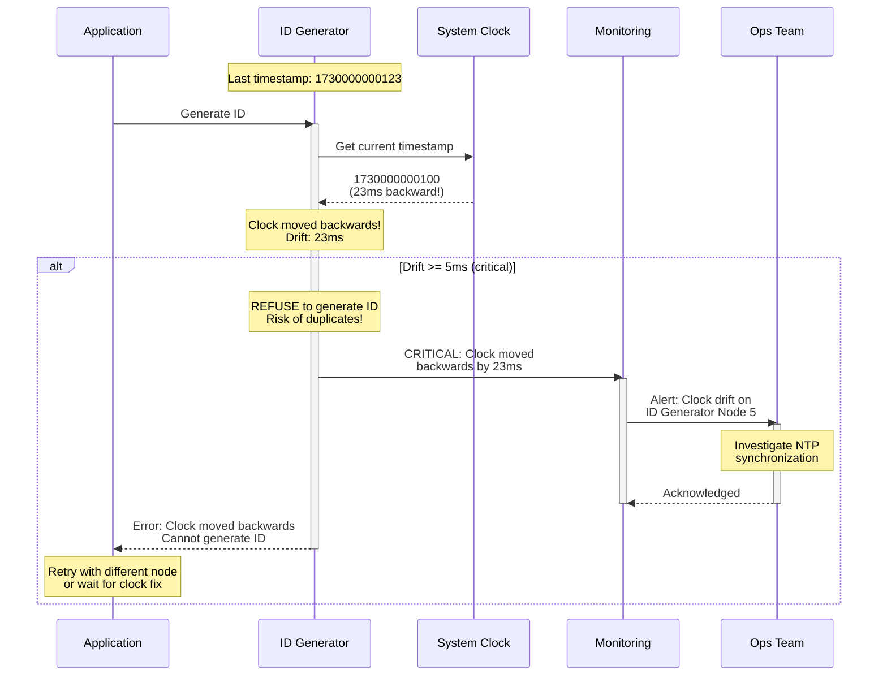
```mermaid
sequenceDiagram
    participant App as Application
    participant IDGen as ID Generator
    participant Clock as System Clock
    participant Monitor as Monitoring
    participant Ops as Ops Team

    Note over IDGen: Last timestamp: 1730000000123
    
    App->>IDGen: Generate ID
    activate IDGen
    
    IDGen->>Clock: Get current timestamp
    Clock-->>IDGen: 1730000000100<br/>(23ms backward!)
    
    Note over IDGen: Clock moved backwards!<br/>Drift: 23ms
    
    alt Drift >= 5ms (critical)
        Note over IDGen: REFUSE to generate ID<br/>Risk of duplicates!
        
        IDGen->>Monitor: CRITICAL: Clock moved<br/>backwards by 23ms
        activate Monitor
        
        Monitor->>Ops: Alert: Clock drift on<br/>ID Generator Node 5
        activate Ops
        
        Note over Ops: Investigate NTP<br/>synchronization
        
        Ops-->>Monitor: Acknowledged
        deactivate Ops
        deactivate Monitor
        
        IDGen-->>App: Error: Clock moved backwards<br/>Cannot generate ID
        deactivate IDGen
        
        Note over App: Retry with different node<br/>or wait for clock fix
    end
```

## Comparison: Snowflake vs UUID vs Auto-Increment

### Snowflake ID Generation

**Flow:** Fast generation (0.1ms), decentralized, time-sortable. Requires worker ID coordination but no per-ID coordination.

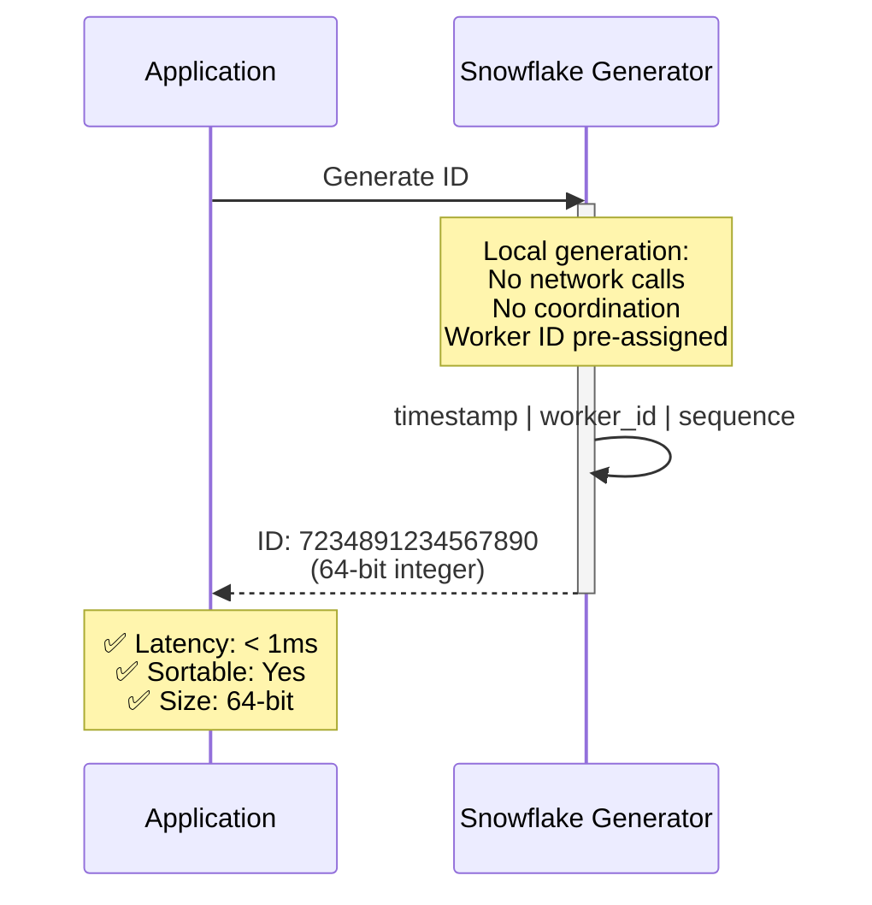
```mermaid
sequenceDiagram
    participant App as Application
    participant IDGen as Snowflake Generator

    App->>IDGen: Generate ID
    activate IDGen
    
    Note over IDGen: Local generation:<br/>No network calls<br/>No coordination<br/>Worker ID pre-assigned
    
    IDGen->>IDGen: timestamp | worker_id | sequence
    
    IDGen-->>App: ID: 7234891234567890<br/>(64-bit integer)
    deactivate IDGen
    
    Note over App: ✅ Latency: < 1ms<br/>✅ Sortable: Yes<br/>✅ Size: 64-bit
```

### UUID v4 Generation

**Flow:** Pure random generation (0.1ms), no coordination needed, 128-bit. Not sortable, larger storage footprint.

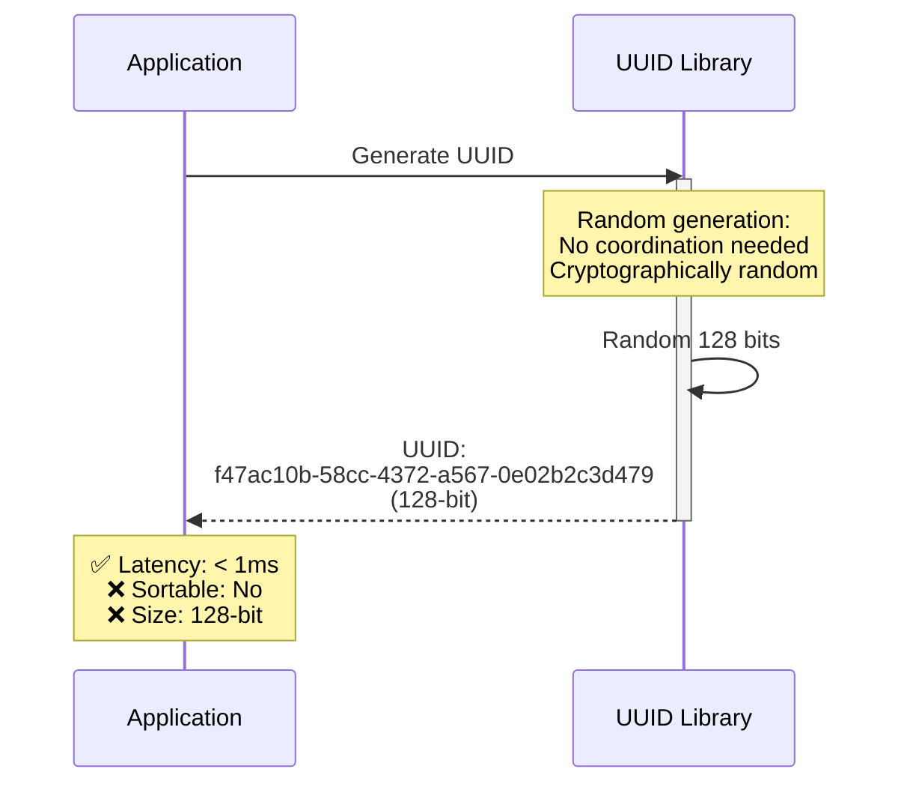
```mermaid
sequenceDiagram
    participant App as Application
    participant UUID as UUID Library

    App->>UUID: Generate UUID
    activate UUID
    
    Note over UUID: Random generation:<br/>No coordination needed<br/>Cryptographically random
    
    UUID->>UUID: Random 128 bits
    
    UUID-->>App: UUID:<br/>f47ac10b-58cc-4372-a567-0e02b2c3d479<br/>(128-bit)
    deactivate UUID
    
    Note over App: ✅ Latency: < 1ms<br/>❌ Sortable: No<br/>❌ Size: 128-bit
```

### Database Auto-Increment

**Flow:** DB-coordinated ID generation (50ms latency), single point of failure, simple but doesn't scale. Sequential IDs reveal business metrics.

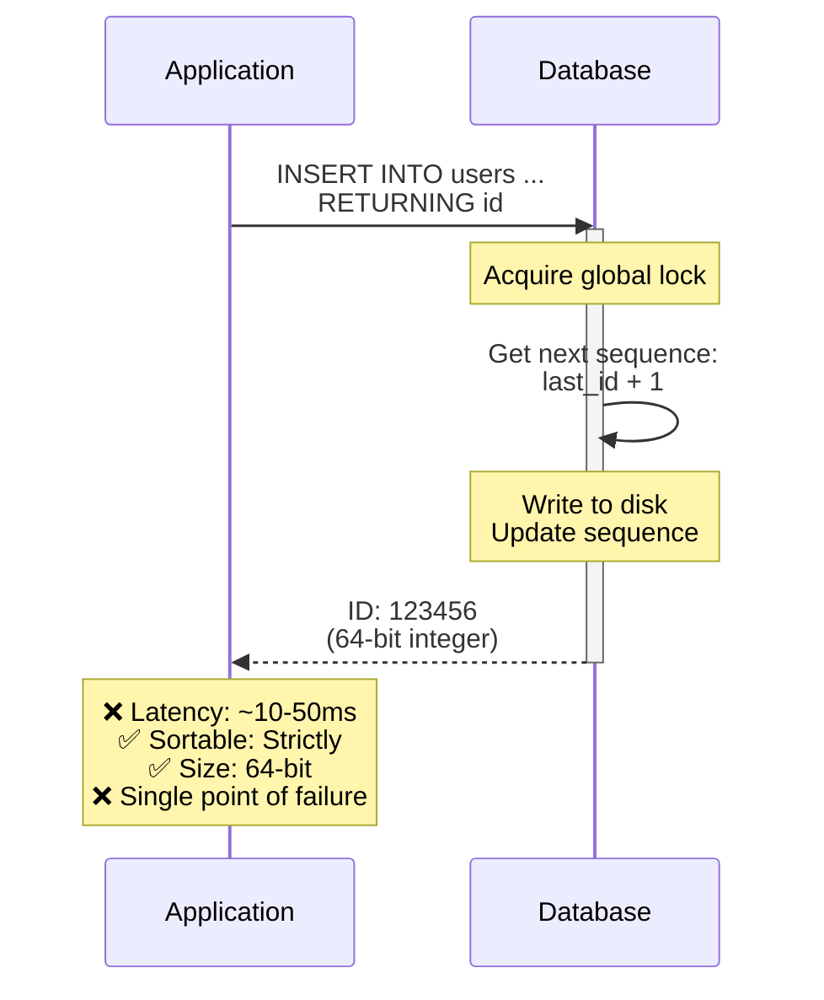
```mermaid
sequenceDiagram
    participant App as Application
    participant DB as Database

    App->>DB: INSERT INTO users ...<br/>RETURNING id
    activate DB
    
    Note over DB: Acquire global lock
    
    DB->>DB: Get next sequence:<br/>last_id + 1
    
    Note over DB: Write to disk<br/>Update sequence
    
    DB-->>App: ID: 123456<br/>(64-bit integer)
    deactivate DB
    
    Note over App: ❌ Latency: ~10-50ms<br/>✅ Sortable: Strictly<br/>✅ Size: 64-bit<br/>❌ Single point of failure
```

## Failover Scenario: Node Failure

**Flow:** Node 1 fails → Load balancer detects (health check) → Routes traffic to Node 2 → etcd releases Node 1's Worker ID after TTL → Service continues uninterrupted.

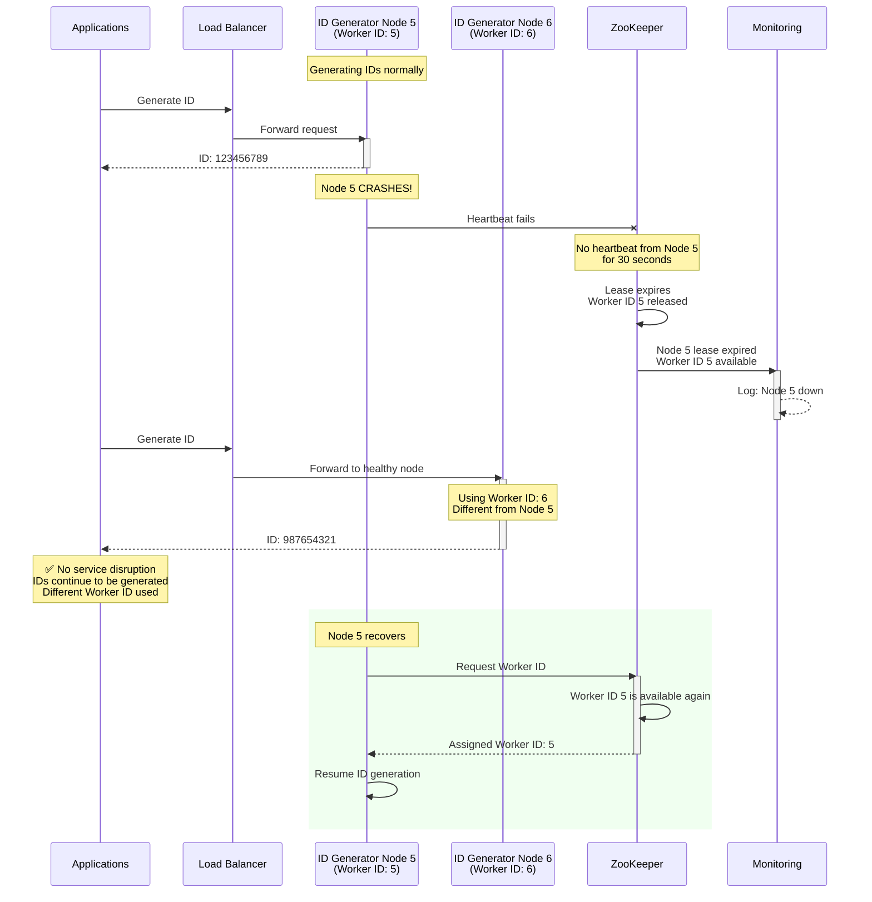
```mermaid
sequenceDiagram
    participant App as Applications
    participant LB as Load Balancer
    participant Node5 as ID Generator Node 5<br/>(Worker ID: 5)
    participant Node6 as ID Generator Node 6<br/>(Worker ID: 6)
    participant ZK as ZooKeeper
    participant Monitor as Monitoring

    Note over Node5: Generating IDs normally
    
    App->>LB: Generate ID
    LB->>Node5: Forward request
    activate Node5
    Node5-->>App: ID: 123456789
    deactivate Node5
    
    Note over Node5: Node 5 CRASHES!
    
    Node5-XZK: Heartbeat fails
    
    Note over ZK: No heartbeat from Node 5<br/>for 30 seconds
    
    ZK->>ZK: Lease expires<br/>Worker ID 5 released
    
    ZK->>Monitor: Node 5 lease expired<br/>Worker ID 5 available
    activate Monitor
    Monitor-->>Monitor: Log: Node 5 down
    deactivate Monitor
    
    App->>LB: Generate ID
    LB->>Node6: Forward to healthy node
    activate Node6
    
    Note over Node6: Using Worker ID: 6<br/>Different from Node 5
    
    Node6-->>App: ID: 987654321
    deactivate Node6
    
    Note over App: ✅ No service disruption<br/>IDs continue to be generated<br/>Different Worker ID used
    
    rect rgb(240, 255, 240)
    Note over Node5: Node 5 recovers
    Node5->>ZK: Request Worker ID
    activate ZK
    ZK->>ZK: Worker ID 5 is available again
    ZK-->>Node5: Assigned Worker ID: 5
    deactivate ZK
    
    Node5->>Node5: Resume ID generation
    end
```

## Multi-Region ID Generation

**Flow:** Global users → GeoDNS routes to nearest region → Regional ID generators operate independently → IDs globally unique (non-overlapping Worker ID ranges).

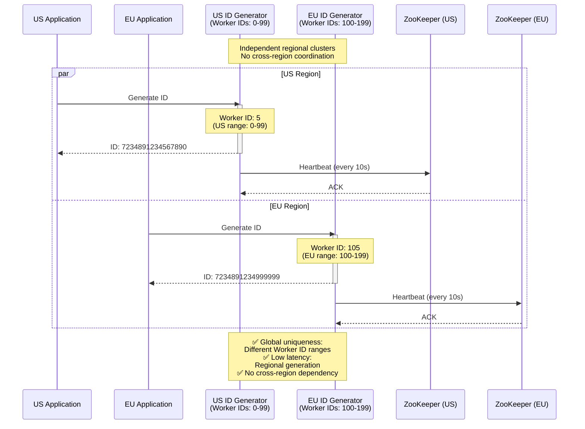
```mermaid
sequenceDiagram
    participant US_App as US Application
    participant EU_App as EU Application
    participant US_Gen as US ID Generator<br/>(Worker IDs: 0-99)
    participant EU_Gen as EU ID Generator<br/>(Worker IDs: 100-199)
    participant US_ZK as ZooKeeper (US)
    participant EU_ZK as ZooKeeper (EU)

    Note over US_Gen,EU_Gen: Independent regional clusters<br/>No cross-region coordination
    
    par US Region
        US_App->>US_Gen: Generate ID
        activate US_Gen
        
        Note over US_Gen: Worker ID: 5<br/>(US range: 0-99)
        
        US_Gen-->>US_App: ID: 7234891234567890
        deactivate US_Gen
        
        US_Gen->>US_ZK: Heartbeat (every 10s)
        US_ZK-->>US_Gen: ACK
    and EU Region
        EU_App->>EU_Gen: Generate ID
        activate EU_Gen
        
        Note over EU_Gen: Worker ID: 105<br/>(EU range: 100-199)
        
        EU_Gen-->>EU_App: ID: 7234891234999999
        deactivate EU_Gen
        
        EU_Gen->>EU_ZK: Heartbeat (every 10s)
        EU_ZK-->>EU_Gen: ACK
    end
    
    Note over US_Gen,EU_Gen: ✅ Global uniqueness:<br/>Different Worker ID ranges<br/>✅ Low latency:<br/>Regional generation<br/>✅ No cross-region dependency
```

## Monitoring & Alerting Flow

**Flow:** ID Generator exports metrics → Prometheus scrapes → Evaluates alert rules (clock drift, duplicate IDs) → Alertmanager notifies ops → Ops investigates.

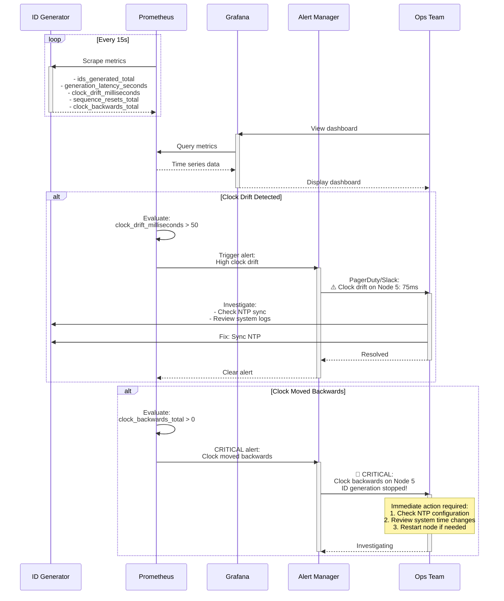
```mermaid
sequenceDiagram
    participant IDGen as ID Generator
    participant Prometheus as Prometheus
    participant Grafana as Grafana
    participant Alert as Alert Manager
    participant Ops as Ops Team

    loop Every 15s
        Prometheus->>IDGen: Scrape metrics
        activate IDGen
        IDGen-->>Prometheus: - ids_generated_total<br/>- generation_latency_seconds<br/>- clock_drift_milliseconds<br/>- sequence_resets_total<br/>- clock_backwards_total
        deactivate IDGen
    end
    
    Ops->>Grafana: View dashboard
    activate Grafana
    Grafana->>Prometheus: Query metrics
    Prometheus-->>Grafana: Time series data
    Grafana-->>Ops: Display dashboard
    deactivate Grafana
    
    alt Clock Drift Detected
        Prometheus->>Prometheus: Evaluate:<br/>clock_drift_milliseconds > 50
        Prometheus->>Alert: Trigger alert:<br/>High clock drift
        activate Alert
        
        Alert->>Ops: PagerDuty/Slack:<br/>⚠️ Clock drift on Node 5: 75ms
        activate Ops
        
        Ops->>IDGen: Investigate:<br/>- Check NTP sync<br/>- Review system logs
        
        Ops->>IDGen: Fix: Sync NTP
        
        Ops-->>Alert: Resolved
        deactivate Ops
        
        Alert-->>Prometheus: Clear alert
        deactivate Alert
    end
    
    alt Clock Moved Backwards
        Prometheus->>Prometheus: Evaluate:<br/>clock_backwards_total > 0
        Prometheus->>Alert: CRITICAL alert:<br/>Clock moved backwards
        activate Alert
        
        Alert->>Ops: 🚨 CRITICAL:<br/>Clock backwards on Node 5<br/>ID generation stopped!
        activate Ops
        
        Note over Ops: Immediate action required:<br/>1. Check NTP configuration<br/>2. Review system time changes<br/>3. Restart node if needed
        
        Ops-->>Alert: Investigating
        deactivate Ops
        deactivate Alert
    end
```

## Performance Test Scenario

**Flow:** Load testing to measure throughput and latency. Ramp up to 1M requests/sec, measure P99 latency, verify no duplicates, check CPU/memory usage.

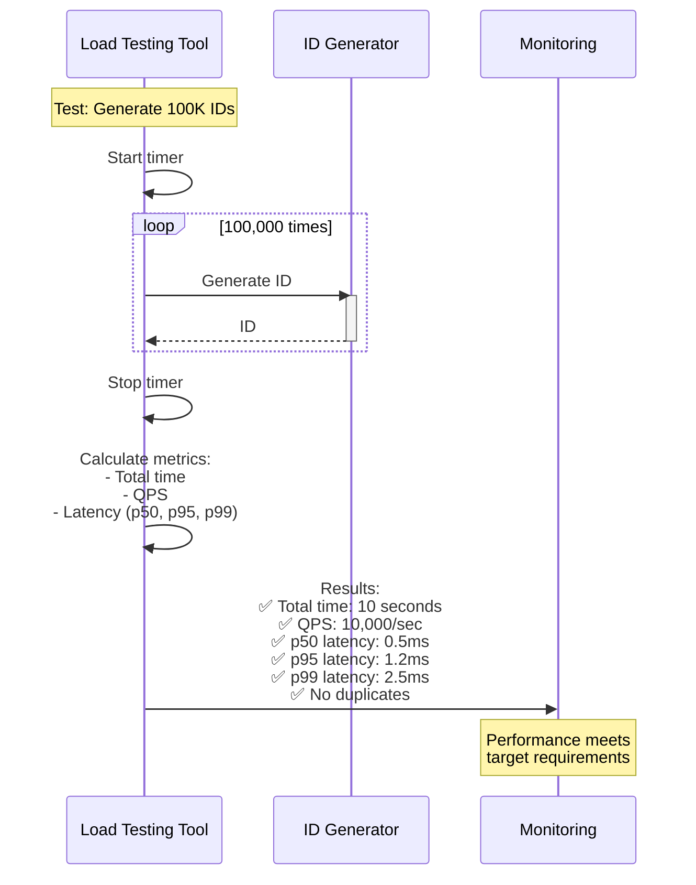
```mermaid
sequenceDiagram
    participant LoadTest as Load Testing Tool
    participant IDGen as ID Generator
    participant Monitor as Monitoring

    Note over LoadTest: Test: Generate 100K IDs
    
    LoadTest->>LoadTest: Start timer
    
    loop 100,000 times
        LoadTest->>IDGen: Generate ID
        activate IDGen
        IDGen-->>LoadTest: ID
        deactivate IDGen
    end
    
    LoadTest->>LoadTest: Stop timer
    
    LoadTest->>LoadTest: Calculate metrics:<br/>- Total time<br/>- QPS<br/>- Latency (p50, p95, p99)
    
    LoadTest->>Monitor: Results:<br/>✅ Total time: 10 seconds<br/>✅ QPS: 10,000/sec<br/>✅ p50 latency: 0.5ms<br/>✅ p95 latency: 1.2ms<br/>✅ p99 latency: 2.5ms<br/>✅ No duplicates
    
    Note over Monitor: Performance meets<br/>target requirements
```

## Batch ID Generation (Optimization)

**Flow:** Client requests 1000 IDs → Generator produces batch → Returns all at once. Reduces network round-trips, higher throughput.

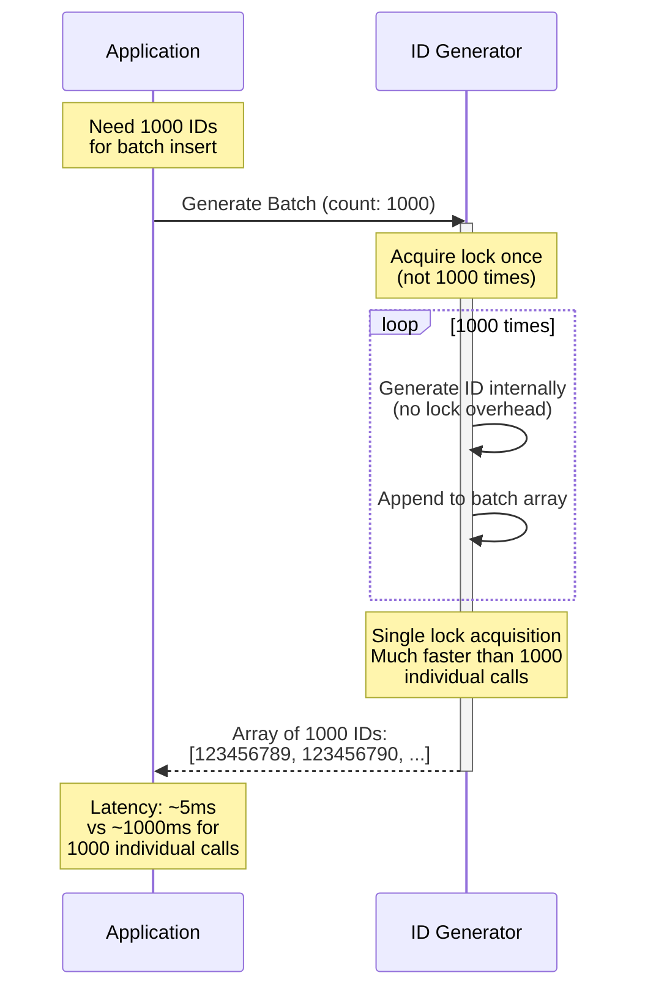
```mermaid
sequenceDiagram
    participant App as Application
    participant IDGen as ID Generator

    Note over App: Need 1000 IDs<br/>for batch insert
    
    App->>IDGen: Generate Batch (count: 1000)
    activate IDGen
    
    Note over IDGen: Acquire lock once<br/>(not 1000 times)
    
    loop 1000 times
        IDGen->>IDGen: Generate ID internally<br/>(no lock overhead)
        IDGen->>IDGen: Append to batch array
    end
    
    Note over IDGen: Single lock acquisition<br/>Much faster than 1000<br/>individual calls
    
    IDGen-->>App: Array of 1000 IDs:<br/>[123456789, 123456790, ...]
    deactivate IDGen
    
    Note over App: Latency: ~5ms<br/>vs ~1000ms for<br/>1000 individual calls
```

## Distributed Tracing

**Flow:** Request tagged with trace ID (Jaeger) → Spans track ID generation latency → Full request path traced → Helps debug performance issues.

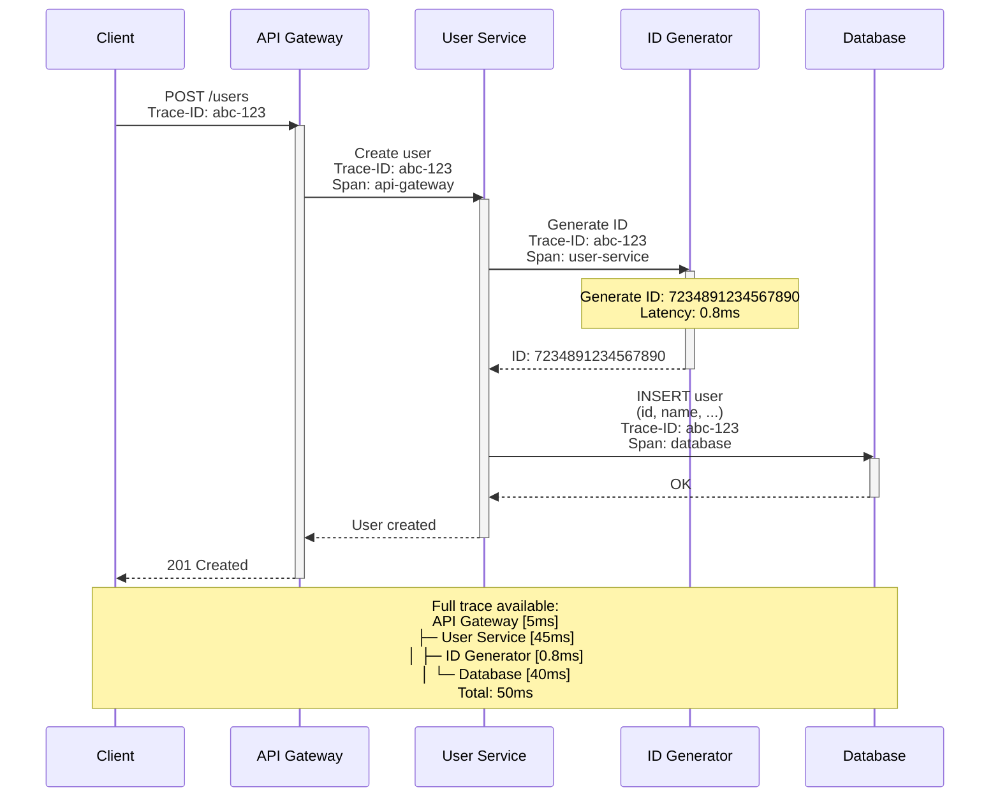
```mermaid
sequenceDiagram
    participant Client as Client
    participant API as API Gateway
    participant Service as User Service
    participant IDGen as ID Generator
    participant DB as Database

    Client->>API: POST /users<br/>Trace-ID: abc-123
    activate API
    
    API->>Service: Create user<br/>Trace-ID: abc-123<br/>Span: api-gateway
    activate Service
    
    Service->>IDGen: Generate ID<br/>Trace-ID: abc-123<br/>Span: user-service
    activate IDGen
    
    Note over IDGen: Generate ID: 7234891234567890<br/>Latency: 0.8ms
    
    IDGen-->>Service: ID: 7234891234567890
    deactivate IDGen
    
    Service->>DB: INSERT user<br/>(id, name, ...)<br/>Trace-ID: abc-123<br/>Span: database
    activate DB
    DB-->>Service: OK
    deactivate DB
    
    Service-->>API: User created
    deactivate Service
    
    API-->>Client: 201 Created
    deactivate API
    
    Note over Client,DB: Full trace available:<br/>API Gateway [5ms]<br/>├─ User Service [45ms]<br/>│  ├─ ID Generator [0.8ms]<br/>│  └─ Database [40ms]<br/>Total: 50ms
```

## ID Parsing & Debugging

**Flow:** Given an ID → Extract timestamp, worker ID, sequence → Debug when/where ID was generated → Useful for troubleshooting, audit trails.

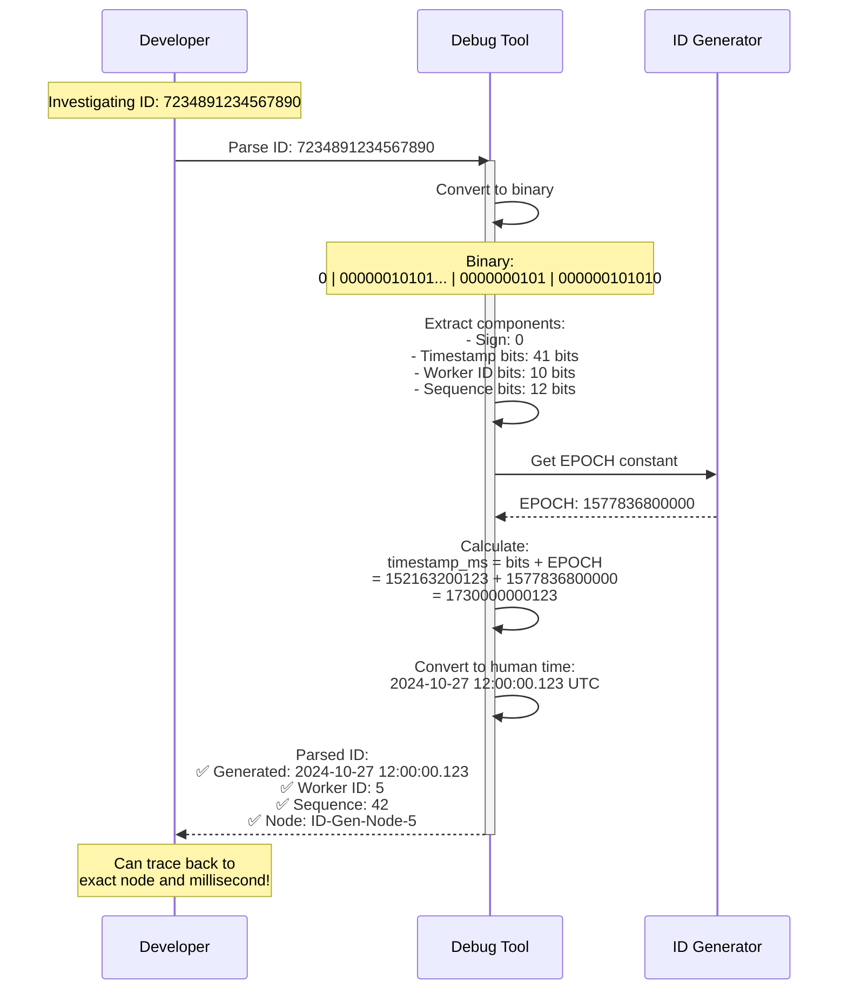
```mermaid
sequenceDiagram
    participant Dev as Developer
    participant Tool as Debug Tool
    participant IDGen as ID Generator

    Note over Dev: Investigating ID: 7234891234567890
    
    Dev->>Tool: Parse ID: 7234891234567890
    activate Tool
    
    Tool->>Tool: Convert to binary
    
    Note over Tool: Binary:<br/>0 | 00000010101... | 0000000101 | 000000101010
    
    Tool->>Tool: Extract components:<br/>- Sign: 0<br/>- Timestamp bits: 41 bits<br/>- Worker ID bits: 10 bits<br/>- Sequence bits: 12 bits
    
    Tool->>IDGen: Get EPOCH constant
    IDGen-->>Tool: EPOCH: 1577836800000
    
    Tool->>Tool: Calculate:<br/>timestamp_ms = bits + EPOCH<br/>= 152163200123 + 1577836800000<br/>= 1730000000123
    
    Tool->>Tool: Convert to human time:<br/>2024-10-27 12:00:00.123 UTC
    
    Tool-->>Dev: Parsed ID:<br/>✅ Generated: 2024-10-27 12:00:00.123<br/>✅ Worker ID: 5<br/>✅ Sequence: 42<br/>✅ Node: ID-Gen-Node-5
    deactivate Tool
    
    Note over Dev: Can trace back to<br/>exact node and millisecond!
```

## Clock Synchronization (NTP)

**Flow:** ID Generator periodically syncs with NTP servers → Measures drift → Adjusts system clock → Keeps drift <10ms → Critical for preventing clock-related duplicate IDs.

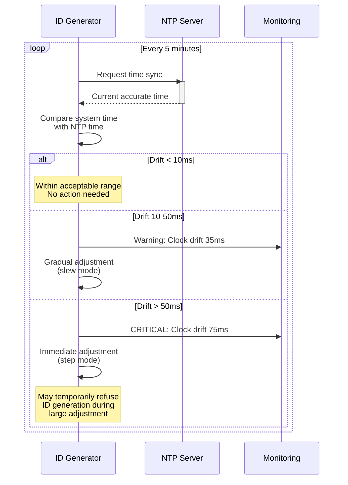
```mermaid
sequenceDiagram
    participant IDGen as ID Generator
    participant NTP as NTP Server
    participant Monitor as Monitoring

    loop Every 5 minutes
        IDGen->>NTP: Request time sync
        activate NTP
        NTP-->>IDGen: Current accurate time
        deactivate NTP
        
        IDGen->>IDGen: Compare system time<br/>with NTP time
        
        alt Drift < 10ms
            Note over IDGen: Within acceptable range<br/>No action needed
        else Drift 10-50ms
            IDGen->>Monitor: Warning: Clock drift 35ms
            IDGen->>IDGen: Gradual adjustment<br/>(slew mode)
        else Drift > 50ms
            IDGen->>Monitor: CRITICAL: Clock drift 75ms
            IDGen->>IDGen: Immediate adjustment<br/>(step mode)
            Note over IDGen: May temporarily refuse<br/>ID generation during<br/>large adjustment
        end
    end
```

