# Distributed ID Generator (Snowflake) - Sequence Diagrams

## ID Generation Flow (Happy Path)

**Flow:** Client → ID Generator → Check timestamp → Increment sequence → Compose 64-bit ID → Return. Sub-millisecond latency, lock-free.

```mermaid
sequenceDiagram
    participant App as Application
    participant IDGen as ID Generator Node
    participant Clock as System Clock

    App->>IDGen: Generate ID
    activate IDGen
    
    IDGen->>Clock: Get current timestamp (ms)
    Clock-->>IDGen: 1730000000123
    
    Note over IDGen: Check: timestamp >= last_timestamp ✓<br/>Same millisecond as last ID
    
    Note over IDGen: Increment sequence:<br/>sequence = 42 → 43
    
    Note over IDGen: Construct ID:<br/>timestamp << 22 |<br/>worker_id << 12 |<br/>sequence
    
    Note over IDGen: Bit operations:<br/>(1730000000123 << 22) |<br/>(5 << 12) |<br/>(43)
    
    IDGen-->>App: ID: 7234891234567890
    deactivate IDGen
    
    Note over App: Total latency: < 1ms
```

## Worker ID Assignment (Startup)

**Flow:** Node starts → Register with etcd → Check for existing Worker ID → If none: Find available slot → Create lease → Start heartbeat → Begin generating IDs.

## Sequence Exhaustion Handling

**Flow:** Generate ID → Sequence reaches 4095 (max) → Wait for next millisecond → Reset sequence to 0 → Resume generation. Adds ~1ms latency occasionally.

## Clock Drift Detection & Handling

### Scenario 1: Small Backward Drift (Tolerable)

**Flow:** Detect clock backwards by 3ms (< 5ms threshold) → Wait 3ms for clock to catch up → Resume generation. Minimal service disruption.

### Scenario 2: Large Backward Drift (Critical)

**Flow:** Detect clock backwards by 100ms (> 5ms threshold) → Log error → Alert ops → Refuse to generate IDs. Service interruption to prevent duplicates.

## Comparison: Snowflake vs UUID vs Auto-Increment

### Snowflake ID Generation

**Flow:** Fast generation (0.1ms), decentralized, time-sortable. Requires worker ID coordination but no per-ID coordination.

```mermaid
sequenceDiagram
    participant App as Application
    participant IDGen as Snowflake Generator

    App->>IDGen: Generate ID
    activate IDGen
    
    Note over IDGen: Local generation:<br/>No network calls<br/>No coordination<br/>Worker ID pre-assigned
    
    IDGen->>IDGen: timestamp | worker_id | sequence
    
    IDGen-->>App: ID: 7234891234567890<br/>(64-bit integer)
    deactivate IDGen
    
    Note over App: ✅ Latency: < 1ms<br/>✅ Sortable: Yes<br/>✅ Size: 64-bit
```

### UUID v4 Generation

**Flow:** Pure random generation (0.1ms), no coordination needed, 128-bit. Not sortable, larger storage footprint.

```mermaid
sequenceDiagram
    participant App as Application
    participant UUID as UUID Library

    App->>UUID: Generate UUID
    activate UUID
    
    Note over UUID: Random generation:<br/>No coordination needed<br/>Cryptographically random
    
    UUID->>UUID: Random 128 bits
    
    UUID-->>App: UUID:<br/>f47ac10b-58cc-4372-a567-0e02b2c3d479<br/>(128-bit)
    deactivate UUID
    
    Note over App: ✅ Latency: < 1ms<br/>❌ Sortable: No<br/>❌ Size: 128-bit
```

### Database Auto-Increment

**Flow:** DB-coordinated ID generation (50ms latency), single point of failure, simple but doesn't scale. Sequential IDs reveal business metrics.

```mermaid
sequenceDiagram
    participant App as Application
    participant DB as Database

    App->>DB: INSERT INTO users ...<br/>RETURNING id
    activate DB
    
    Note over DB: Acquire global lock
    
    DB->>DB: Get next sequence:<br/>last_id + 1
    
    Note over DB: Write to disk<br/>Update sequence
    
    DB-->>App: ID: 123456<br/>(64-bit integer)
    deactivate DB
    
    Note over App: ❌ Latency: ~10-50ms<br/>✅ Sortable: Strictly<br/>✅ Size: 64-bit<br/>❌ Single point of failure
```

## Failover Scenario: Node Failure

**Flow:** Node 1 fails → Load balancer detects (health check) → Routes traffic to Node 2 → etcd releases Node 1's Worker ID after TTL → Service continues uninterrupted.

```mermaid
sequenceDiagram
    participant App as Applications
    participant LB as Load Balancer
    participant Node5 as ID Generator Node 5<br/>(Worker ID: 5)
    participant Node6 as ID Generator Node 6<br/>(Worker ID: 6)
    participant ZK as ZooKeeper
    participant Monitor as Monitoring

    Note over Node5: Generating IDs normally
    
    App->>LB: Generate ID
    LB->>Node5: Forward request
    activate Node5
    Node5-->>App: ID: 123456789
    deactivate Node5
    
    Note over Node5: Node 5 CRASHES!
    
    Node5-XZK: Heartbeat fails
    
    Note over ZK: No heartbeat from Node 5<br/>for 30 seconds
    
    ZK->>ZK: Lease expires<br/>Worker ID 5 released
    
    ZK->>Monitor: Node 5 lease expired<br/>Worker ID 5 available
    activate Monitor
    Monitor-->>Monitor: Log: Node 5 down
    deactivate Monitor
    
    App->>LB: Generate ID
    LB->>Node6: Forward to healthy node
    activate Node6
    
    Note over Node6: Using Worker ID: 6<br/>Different from Node 5
    
    Node6-->>App: ID: 987654321
    deactivate Node6
    
    Note over App: ✅ No service disruption<br/>IDs continue to be generated<br/>Different Worker ID used
    
    rect rgb(240, 255, 240)
    Note over Node5: Node 5 recovers
    Node5->>ZK: Request Worker ID
    activate ZK
    ZK->>ZK: Worker ID 5 is available again
    ZK-->>Node5: Assigned Worker ID: 5
    deactivate ZK
    
    Node5->>Node5: Resume ID generation
    end
```

## Multi-Region ID Generation

**Flow:** Global users → GeoDNS routes to nearest region → Regional ID generators operate independently → IDs globally unique (non-overlapping Worker ID ranges).

## Monitoring & Alerting Flow

**Flow:** ID Generator exports metrics → Prometheus scrapes → Evaluates alert rules (clock drift, duplicate IDs) → Alertmanager notifies ops → Ops investigates.

```mermaid
sequenceDiagram
    participant IDGen as ID Generator
    participant Prometheus as Prometheus
    participant Grafana as Grafana
    participant Alert as Alert Manager
    participant Ops as Ops Team

    loop Every 15s
        Prometheus->>IDGen: Scrape metrics
        activate IDGen
        IDGen-->>Prometheus: - ids_generated_total<br/>- generation_latency_seconds<br/>- clock_drift_milliseconds<br/>- sequence_resets_total<br/>- clock_backwards_total
        deactivate IDGen
    end
    
    Ops->>Grafana: View dashboard
    activate Grafana
    Grafana->>Prometheus: Query metrics
    Prometheus-->>Grafana: Time series data
    Grafana-->>Ops: Display dashboard
    deactivate Grafana
    
    alt Clock Drift Detected
        Prometheus->>Prometheus: Evaluate:<br/>clock_drift_milliseconds > 50
        Prometheus->>Alert: Trigger alert:<br/>High clock drift
        activate Alert
        
        Alert->>Ops: PagerDuty/Slack:<br/>⚠️ Clock drift on Node 5: 75ms
        activate Ops
        
        Ops->>IDGen: Investigate:<br/>- Check NTP sync<br/>- Review system logs
        
        Ops->>IDGen: Fix: Sync NTP
        
        Ops-->>Alert: Resolved
        deactivate Ops
        
        Alert-->>Prometheus: Clear alert
        deactivate Alert
    end
    
    alt Clock Moved Backwards
        Prometheus->>Prometheus: Evaluate:<br/>clock_backwards_total > 0
        Prometheus->>Alert: CRITICAL alert:<br/>Clock moved backwards
        activate Alert
        
        Alert->>Ops: 🚨 CRITICAL:<br/>Clock backwards on Node 5<br/>ID generation stopped!
        activate Ops
        
        Note over Ops: Immediate action required:<br/>1. Check NTP configuration<br/>2. Review system time changes<br/>3. Restart node if needed
        
        Ops-->>Alert: Investigating
        deactivate Ops
        deactivate Alert
    end
```

## Performance Test Scenario

**Flow:** Load testing to measure throughput and latency. Ramp up to 1M requests/sec, measure P99 latency, verify no duplicates, check CPU/memory usage.

```mermaid
sequenceDiagram
    participant LoadTest as Load Testing Tool
    participant IDGen as ID Generator
    participant Monitor as Monitoring

    Note over LoadTest: Test: Generate 100K IDs
    
    LoadTest->>LoadTest: Start timer
    
    loop 100,000 times
        LoadTest->>IDGen: Generate ID
        activate IDGen
        IDGen-->>LoadTest: ID
        deactivate IDGen
    end
    
    LoadTest->>LoadTest: Stop timer
    
    LoadTest->>LoadTest: Calculate metrics:<br/>- Total time<br/>- QPS<br/>- Latency (p50, p95, p99)
    
    LoadTest->>Monitor: Results:<br/>✅ Total time: 10 seconds<br/>✅ QPS: 10,000/sec<br/>✅ p50 latency: 0.5ms<br/>✅ p95 latency: 1.2ms<br/>✅ p99 latency: 2.5ms<br/>✅ No duplicates
    
    Note over Monitor: Performance meets<br/>target requirements
```

## Batch ID Generation (Optimization)

**Flow:** Client requests 1000 IDs → Generator produces batch → Returns all at once. Reduces network round-trips, higher throughput.

## Distributed Tracing

**Flow:** Request tagged with trace ID (Jaeger) → Spans track ID generation latency → Full request path traced → Helps debug performance issues.

## ID Parsing & Debugging

**Flow:** Given an ID → Extract timestamp, worker ID, sequence → Debug when/where ID was generated → Useful for troubleshooting, audit trails.

## Clock Synchronization (NTP)

**Flow:** ID Generator periodically syncs with NTP servers → Measures drift → Adjusts system clock → Keeps drift <10ms → Critical for preventing clock-related duplicate IDs.

