# High-Level Design Diagrams: Twitter/X Timeline

This document contains Mermaid diagrams illustrating the system architecture, component design, data flow, and scaling strategies for the Twitter Timeline system.

---

## 1. Complete System Architecture


**Flow Explanation:**

This diagram shows the complete Twitter Timeline system architecture with all major components.

**Key Components:**
1. **Load Balancer** → Routes traffic to nearest data center
2. **API Gateway** → Handles authentication, rate limiting, request routing
3. **Post Service (Write Path)** → Validates tweets, saves to PostgreSQL, publishes to Kafka
4. **Timeline Service (Read Path)** → Checks Redis cache, queries Cassandra for timelines
5. **Kafka** → Message queue that decouples write path from fanout operations
6. **Fanout Workers** → Consume tweet events, fetch followers, insert into timelines
7. **Redis Cluster** → Hot timeline cache for sub-10ms reads
8. **Cassandra** → Persistent timeline storage (denormalized)
9. **PostgreSQL** → Source of truth for tweets (ACID)
10. **Follower Graph** → Social graph for follower lookups

**Benefits:**
- **Separation of Concerns:** Write and read paths are independent
- **Async Processing:** Kafka enables non-blocking fanout
- **High Availability:** Redis + Cassandra both support multi-master replication
- **Horizontal Scaling:** All components scale independently

---

## 2. Write Path (Posting a Tweet)


**Flow Explanation:**

Shows the complete flow of posting a tweet from client to fanout completion.

**Steps:**
1. **Validation** (5ms): Check content length, spam detection, rate limits
2. **ID Generation** (1ms): Generate time-sortable Snowflake ID
3. **Save to DB** (20ms): Insert into PostgreSQL tweets table
4. **Publish to Kafka** (5ms): Async event, non-blocking
5. **Return to Client** (~100ms total): User doesn't wait for fanout
6. **Fanout Workers** (async, ~10 seconds): Background processing
   - Consume tweet event from Kafka
   - Fetch all followers from Follower Graph
   - **Decision point:** Celebrity check (follower count threshold)
   - If normal user: Insert tweet into each follower's UserTimeline (Cassandra)
   - If celebrity: Skip fanout (will use pull model)
   - Update Redis cache for active followers

**Benefits:**
- Fast user experience (client waits <100ms)
- Kafka absorbs write spikes
- Celebrity problem handled gracefully
- Async fanout scales independently

---

## 3. Read Path (Loading Timeline)


**Flow Explanation:**

Shows how timelines are loaded for users, including the hybrid fanout model.

**Steps:**
1. **Cache Check** (1ms): Look for `user_id` in Redis
2. **Cache Hit Path** (~10ms total):
   - Return pre-computed timeline from Redis
   - Fastest path (90% of requests)
3. **Cache Miss Path** (~50ms total):
   - Query Cassandra UserTimeline table
   - Fetch most recent 50 tweets
   - Populate Redis cache with TTL
   - Return timeline
4. **Hybrid Enhancement** (for users following celebrities):
   - Check if user follows any celebrities
   - Fetch celebrity tweets on-demand (pull model)
   - Merge pre-computed timeline + celebrity tweets
   - Sort by timestamp, return top 50

**Benefits:**
- Sub-10ms latency for cache hits (90%+ requests)
- Hybrid model provides balance for celebrity content
- Cache miss path still fast (<50ms)
- Pagination support for infinite scroll

**Performance:**
- Cache Hit: <10ms (P99)
- Cache Miss: <50ms (P99)
- Hybrid Merge: +20ms overhead

---

## 4. Fanout Strategies Comparison


**Flow Explanation:**

Compares the three fanout strategies side-by-side.

**Strategy 1: Fanout-on-Write (Push)**
- **Flow:** Tweet posted → Fetch followers → Insert into each timeline → Fast O(1) read
- **Pros:** Fast reads (<10ms), simple read logic
- **Cons:** Expensive writes (N writes per tweet), celebrity problem
- **Best For:** Normal users (<10K followers)

**Strategy 2: Fanout-on-Read (Pull)**
- **Flow:** Timeline request → Fetch followees → Get their tweets → Merge & sort → Return
- **Pros:** Cheap writes (1 write per tweet), no celebrity problem
- **Cons:** Slow reads (>100ms), complex merge logic O(N log N)
- **Best For:** Celebrity users (>10K followers)

**Strategy 3: Hybrid (Recommended)**
- **Flow:** Celebrity check at write time → Push for normal, skip for celebrities → Read merges both
- **Pros:** Balanced approach, handles both cases efficiently
- **Cons:** Increased complexity, requires careful threshold tuning
- **Best For:** Production systems with diverse user types

**Trade-offs:**
- Write Cost vs Read Latency
- System Complexity vs Performance
- Storage Cost vs User Experience

---

## 5. Data Storage Architecture


**Flow Explanation:**

Shows the four-tier storage architecture and data flow between storage systems.

**Storage Layers:**

1. **PostgreSQL (Source of Truth)**:
   - **Purpose:** Persistent, consistent storage for tweets
   - **Sharding:** By `tweet_id` (time-based for range queries)
   - **Replication:** Primary-Replica async replication
   - **Guarantees:** ACID, strong consistency

2. **Cassandra (Timeline Storage)**:
   - **Purpose:** Denormalized timeline entries (high-throughput writes)
   - **Partitioning:** By `user_id` (efficient timeline lookups)
   - **Clustering:** By `tweet_id DESC` (chronological order)
   - **Replication:** Multi-region, RF=3

3. **Redis (Cache Layer)**:
   - **Purpose:** Hot timeline cache (sub-ms reads)
   - **Distribution:** Consistent hashing for load balancing
   - **Availability:** Master-Replica with Redis Sentinel
   - **TTL:** 1 hour for automatic expiration

4. **Neo4j (Follower Graph)**:
   - **Purpose:** Social graph traversals (follower lookups)
   - **Partitioning:** Graph partitioning by `user_id`
   - **Performance:** Sub-millisecond graph queries
   - **Query:** `MATCH (u)-[:FOLLOWS]->(f) RETURN f`

**Data Flow:**
- PostgreSQL → Cassandra (fanout process)
- Cassandra → Redis (cache population)
- Neo4j → Cassandra (fanout uses follower list)

**Benefits:**
- Right tool for each job (polyglot persistence)
- PostgreSQL for consistency, Cassandra for scale, Redis for speed, Neo4j for graphs
- Each layer scales independently

---

## 6. Scaling Timeline Cache (Redis)


**Flow Explanation:**

Shows how Redis cache is distributed using consistent hashing and replicated for high availability.

**Architecture:**

1. **Consistent Hashing**:
   - Hash user_id to find responsible virtual node
   - Virtual nodes map to physical Redis nodes
   - 150 virtual nodes per physical node for even distribution

2. **Physical Nodes**:
   - 3 master nodes (example: can scale to 100+)
   - Each handles a portion of the key space
   - Hash range divided: Node1(0-333), Node2(334-666), Node3(667-999)

3. **Replication**:
   - Each master has 2 replicas
   - Async replication for low latency
   - Replicas in different availability zones

4. **Redis Sentinel**:
   - Monitors master health (heartbeat)
   - Automatic failover if master dies
   - Promotes replica to master in <30 seconds

**Benefits:**
- **Minimal Reshuffling:** Adding/removing nodes only affects ~1/N keys
- **High Availability:** Replicas provide automatic failover
- **Horizontal Scaling:** Add more nodes as traffic grows
- **Load Balancing:** Consistent hashing distributes load evenly

**Performance:**
- 99.99% cache hit rate for hot users
- Sub-1ms latency per operation
- 100K+ QPS per node

---

## 7. Multi-Region Deployment


**Flow Explanation:**

Shows multi-region deployment for low-latency global access and disaster recovery.

**Architecture:**

1. **Regional Independence**:
   - Each region has complete stack (services, Kafka, Redis, Cassandra)
   - Users routed to nearest region (geo-DNS)
   - Read path served locally (<50ms latency)

2. **Write Path**:
   - Writes go to primary region (US-East-1)
   - PostgreSQL async replication to other regions
   - Kafka MirrorMaker replicates events cross-region
   - Cassandra multi-datacenter replication (tunable consistency)

3. **Read Path**:
   - Served from local region (lowest latency)
   - Redis cache populated per region
   - Cassandra reads use `LOCAL_QUORUM` (fast)

4. **Data Consistency**:
   - **PostgreSQL:** Async replication (eventual consistency across regions)
   - **Cassandra:** Multi-datacenter with NetworkTopologyStrategy
   - **Redis:** Independent per region (eventual consistency)
   - **Kafka:** MirrorMaker for event propagation

**Benefits:**
- **Low Latency:** Users always access nearest region (<100ms globally)
- **High Availability:** Region failure doesn't affect others
- **Disaster Recovery:** Full data replication across regions
- **Compliance:** Data residency requirements met

**Trade-offs:**
- **Cross-Region Lag:** Tweets might appear seconds later in other regions
- **Complexity:** More infrastructure to manage
- **Cost:** 3× infrastructure for full replication

---

## 8. Cassandra Data Model


**Flow Explanation:**

Shows how Cassandra's data model is optimized for timeline queries.

**Schema Design:**

1. **Partition Key (`user_id`)**:
   - Determines which nodes store the data
   - All tweets for a user co-located on same partition
   - Enables fast lookups: O(1) to find partition

2. **Clustering Key (`tweet_id DESC`)**:
   - Data sorted within partition by tweet_id (descending)
   - Most recent tweets first (natural timeline order)
   - No sort needed on read

3. **Denormalized Data (`tweet_data BLOB`)**:
   - Full tweet content stored in timeline
   - Avoids joins (no foreign keys in Cassandra)
   - Trades storage for read performance

**Query Pattern:**
```sql
SELECT * FROM user_timeline 
WHERE user_id = ? 
LIMIT 50;
```

**Execution:**
1. Hash `user_id` to find partition
2. Read first 50 rows (already sorted)
3. Return results (~5ms total)

**Benefits:**
- **Fast Reads:** O(1) partition lookup + sequential read
- **Horizontal Scaling:** Add nodes, data redistributes automatically
- **High Throughput:** 50K+ writes/sec per node
- **No Joins:** Denormalization eliminates expensive joins

**Trade-offs:**
- **Storage Cost:** Denormalization duplicates data
- **Update Complexity:** Changes to tweet require updating all timelines
- **Eventual Consistency:** Cassandra uses BASE model (not ACID)

---

## 9. Kafka Partitioning Strategy


**Flow Explanation:**

Shows how Kafka partitions tweet events for parallel processing.

**Partitioning Strategy:**

1. **Partition Key:** `author_user_id`
   - All tweets from same user go to same partition
   - Ensures ordering (same user's tweets processed in order)
   - Load distribution across partitions

2. **Partition Assignment:**
   - Hash(user_id) % num_partitions
   - 64 partitions (example: can scale to 1000+)
   - Each partition assigned to one consumer in group

3. **Consumer Groups:**
   - Fanout Workers form consumer group
   - Each worker processes assigned partitions
   - Horizontal scaling: Add workers = more throughput

4. **Processing:**
   - Worker receives tweet event
   - Fetches followers from graph
   - Inserts into timelines (Cassandra)
   - Commits offset to Kafka

**Benefits:**
- **Parallel Processing:** N partitions = N workers processing simultaneously
- **Ordering Guarantee:** Same user's tweets processed in order
- **Fault Tolerance:** If worker dies, Kafka reassigns partition to another
- **Backpressure Handling:** Workers consume at their own pace

**Performance:**
- 64 partitions → 64 parallel workers
- Each worker handles ~36 tweets/sec (2,300 total / 64)
- Consumer lag monitored (alert if >10K messages behind)

**Scaling:**
- Add more partitions as write traffic grows
- Add more consumers to process faster
- Kafka brokers scale independently

---

## 10. Celebrity vs Normal User Flow


**Flow Explanation:**

Compares the processing flow for normal users vs celebrities.

**Normal User Flow (< 10K followers):**
1. **Write Time:** Fanout-on-write (push model)
   - Fetch all followers (~5,000)
   - Insert tweet into each follower's timeline (Cassandra)
   - Update Redis cache for active followers
   - **Duration:** ~5 seconds for fanout completion
2. **Read Time:** Fast cache hit
   - Timeline already pre-computed
   - Redis cache hit returns immediately
   - **Latency:** <10ms

**Celebrity User Flow (> 10K followers):**
1. **Write Time:** Skip fanout
   - Mark tweet as "celebrity tweet"
   - No timeline writes (saves millions of operations)
   - **Duration:** <1 second (just save tweet to PostgreSQL)
2. **Read Time:** Merge on-the-fly
   - Fetch user's pre-computed timeline (from normal users they follow)
   - Fetch celebrity tweets separately (pull model)
   - Merge both, sort by timestamp
   - **Latency:** ~30ms (+20ms overhead for merge)

**Thresholds:**
- **Normal → Celebrity:** When follower count crosses 10,000
- **Celebrity → Normal:** When follower count drops below 10,000
- **Monitoring:** Track distribution (95% normal, 5% celebrity)

**Benefits:**
- **Normal users:** Fast reads (<10ms), optimized for common case
- **Celebrities:** Avoids crushing system with millions of writes
- **Hybrid:** Best of both worlds

**Trade-offs:**
- **Complexity:** Two different code paths
- **Celebrity Latency:** Slightly slower reads for users following many celebrities
- **Tuning:** Threshold (10K) needs adjustment based on traffic patterns

---

## 11. Activity-Based Fanout Optimization


**Flow Explanation:**

Shows optimization to reduce wasted fanout writes to inactive users.

**Problem:**
- User has 100K followers
- 60% haven't logged in for months
- Fanning out to them wastes 60K writes

**Solution: Activity-Based Fanout**

1. **Filter Followers by Activity**:
   - Query last login time for each follower
   - Active: Logged in last 30 days
   - Inactive: Not logged in for 30+ days

2. **Fanout to Active Only** (40K users):
   - Insert tweet into their timelines (Cassandra)
   - Update Redis cache
   - **Savings:** 60% reduction in writes

3. **Handle Inactive** (60K users):
   - Skip fanout (no timeline writes)
   - On next login: Pull recent tweets (fanout-on-read)
   - Build timeline on-demand

**Implementation:**
```sql
SELECT follower_id 
FROM followers 
WHERE followee_id = ? 
  AND last_login > NOW() - INTERVAL '30 days';
```

**Benefits:**
- **Cost Reduction:** 60% fewer writes (saves infrastructure cost)
- **Faster Fanout:** Smaller fanout set completes quicker
- **No User Impact:** Inactive users don't notice (they build timeline on login)

**Trade-offs:**
- **Complexity:** Need to track last login time
- **First Login Slow:** Inactive users experience slower first timeline load
- **Threshold Tuning:** 30 days is configurable based on user behavior

**Metrics:**
- Active user ratio: 40%
- Write savings: 60%
- Fanout time improvement: 50% faster

---

## 12. Monitoring Dashboard Layout

```mermaid
graph TB
    subgraph "Write Path Metrics"
        W1[Tweet Creation Rate<br/>2,300 QPS avg]
        W2[Kafka Publish Latency<br/>5ms p99]
        W3[PostgreSQL Write Latency<br/>20ms p99]
    end
    
    subgraph "Fanout Metrics"
        F1[Fanout Lag<br/>10 seconds p99]
        F2[Kafka Consumer Lag<br/>500 messages]
        F3[Cassandra Write Throughput<br/>50K writes/sec]
    end
    
    subgraph "Read Path Metrics"
        R1[Timeline Request Rate<br/>115K QPS avg]
        R2[Cache Hit Rate<br/>92%]
        R3[Read Latency<br/>10ms cache hit<br/>50ms cache miss]
    end
    
    subgraph "System Health"
        S1[Redis CPU: 60%<br/>Memory: 70%]
        S2[Cassandra CPU: 75%<br/>Disk: 50%]
        S3[PostgreSQL Replication Lag<br/>2 seconds]
    end
    
    subgraph "Alerts"
        A1[🔴 Fanout Lag >60s]
        A2[🟡 Cache Hit Rate <70%]
        A3[🔴 Kafka Consumer Lag >10K]
    end
    
    style W1 fill:#e1f5ff
    style R1 fill:#e1ffe1
    style F1 fill:#fff4e1
    style A1 fill:#ffe1e1
```



**Flow Explanation:**

Shows key metrics and alerts for monitoring the Twitter Timeline system.

**Dashboard Sections:**

1. **Write Path Metrics**:
   - **Tweet Creation Rate:** Current QPS (baseline 2,300, alert if >20K spike)
   - **Kafka Publish Latency:** Time to publish to Kafka (target <5ms p99)
   - **PostgreSQL Write Latency:** Time to insert tweet (target <20ms p99)

2. **Fanout Metrics**:
   - **Fanout Lag:** Time from tweet posted to timeline updated (target <10s p99)
   - **Kafka Consumer Lag:** How many messages behind (alert if >10K)
   - **Cassandra Write Throughput:** Timeline inserts/sec (capacity 50K/sec)

3. **Read Path Metrics**:
   - **Timeline Request Rate:** Current read QPS (baseline 115K)
   - **Cache Hit Rate:** Percentage served from Redis (target >90%)
   - **Read Latency:** P50, P99, P999 (target <10ms cache hit, <50ms miss)

4. **System Health**:
   - **Redis:** CPU, memory, connection count, eviction rate
   - **Cassandra:** CPU, disk I/O, compaction rate, repair status
   - **PostgreSQL:** Replication lag, query time, connection pool

5. **Alerts (PagerDuty/Slack)**:
   - 🔴 **Critical:** Fanout lag >60s, consumer lag >10K, cache hit <50%
   - 🟡 **Warning:** Cache hit <70%, read latency >200ms, CPU >80%
   - 🟢 **Info:** New deployments, config changes

**Monitoring Tools:**
- **Metrics:** Prometheus + Grafana
- **Logs:** ELK Stack (Elasticsearch, Logstash, Kibana)
- **Tracing:** Jaeger for distributed tracing
- **Alerts:** PagerDuty for on-call rotations

---

**Next:** See [sequence-diagrams.md](sequence-diagrams.md) for detailed interaction flows and failure scenarios.

