# Sequence Diagrams: Twitter/X Timeline

This document contains Mermaid sequence diagrams illustrating detailed interaction flows, failure scenarios, and edge
cases for the Twitter Timeline system.

## Table of Contents

1. [Standard Tweet Posting Flow (Normal User)](#1-standard-tweet-posting-flow-normal-user)
2. [Timeline Loading (Cache Hit - Fast Path)](#2-timeline-loading-cache-hit---fast-path)
3. [Timeline Loading (Cache Miss - Slow Path)](#3-timeline-loading-cache-miss---slow-path)
4. [Hybrid Fanout: Celebrity Tweet](#4-hybrid-fanout-celebrity-tweet)
5. [Timeline Loading with Celebrity Tweets (Hybrid Read)](#5-timeline-loading-with-celebrity-tweets-hybrid-read)
6. [Fanout with Activity-Based Filtering](#6-fanout-with-activity-based-filtering)
7. [Kafka Failover and Consumer Rebalancing](#7-kafka-failover-and-consumer-rebalancing)
8. [Multi-Region Tweet Propagation](#8-multi-region-tweet-propagation)
9. [Rate Limiting Flow](#9-rate-limiting-flow)
10. [Cache Invalidation on Tweet Deletion](#10-cache-invalidation-on-tweet-deletion)
11. [Cassandra Write Failure and Retry](#11-cassandra-write-failure-and-retry)
12. [PostgreSQL Failover (Primary Failure)](#12-postgresql-failover-primary-failure)

---

## 1. Standard Tweet Posting Flow (Normal User)

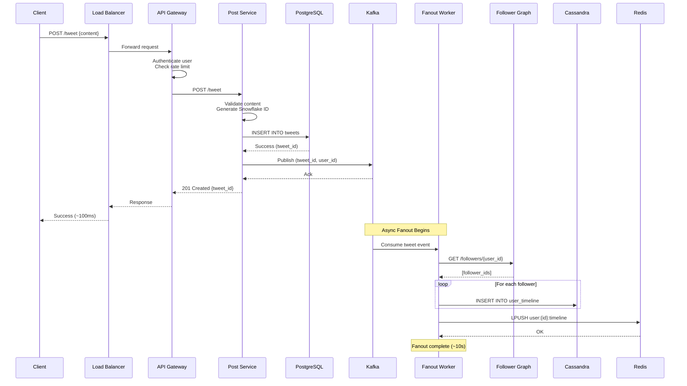

**Flow:**

This shows the complete flow of a normal user posting a tweet from client request to fanout completion.

**Steps:**

1. **Client Request** (0ms): User posts tweet via mobile/web app
2. **Load Balancer** (5ms): Routes to nearest data center
3. **API Gateway** (10ms): JWT validation, rate limit check (e.g., 300 tweets/hour)
4. **Post Service** (20ms):
    - Validates content (length ≤280 chars, no spam)
    - Generates Snowflake ID (time-sortable, unique)
5. **PostgreSQL** (20ms): Inserts tweet into tweets table (ACID)
6. **Kafka** (5ms): Publishes event to `new_tweets` topic (non-blocking)
7. **Return to Client** (~100ms total): User sees "Tweet posted" confirmation

**Async Fanout** (background, ~10 seconds):

8. **Fanout Worker** consumes event from Kafka
9. **Follower Graph** query returns list of followers (e.g., 5,000 users)
10. **Cassandra** inserts tweet into each follower's timeline (batch writes)
11. **Redis** updates cache for active followers

**Performance:**

- Client response: <100ms (user doesn't wait for fanout)
- Fanout completion: ~10 seconds (for 5,000 followers)
- Celebrity handling: Different flow (see diagram #4)

---

## 2. Timeline Loading (Cache Hit - Fast Path)

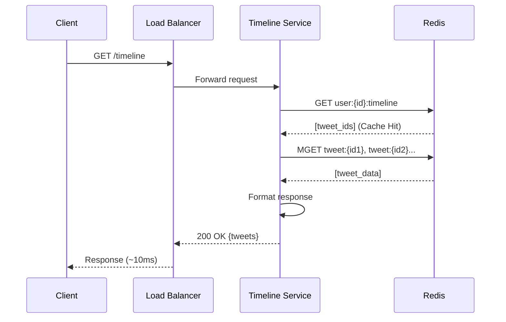

**Flow:**

Shows the fastest path - timeline served entirely from Redis cache.

**Steps:**

1. **Client Request** (0ms): User opens app/refreshes timeline
2. **Load Balancer** (2ms): Routes to nearest Timeline Service
3. **Timeline Service** (1ms): Constructs cache key `user:{user_id}:timeline`
4. **Redis GET** (2ms): Retrieves list of tweet IDs from cache
5. **Cache Hit** ✅: Timeline exists in cache (90% of requests)
6. **Redis MGET** (3ms): Batch-fetch full tweet data (50 tweets in one call)
7. **Format Response** (2ms): JSON serialization, add metadata
8. **Return to Client** (~10ms total): User sees timeline instantly

**Cache Data Structure:**

```
user:12345:timeline → [tweet_id_1, tweet_id_2, ..., tweet_id_50]
tweet:67890 → {id, user_id, content, created_at, likes, ...}
```

**Performance:**

- P50: 5ms
- P99: 10ms
- P999: 20ms

**Cache TTL:** 1 hour (automatic expiration)

---

## 3. Timeline Loading (Cache Miss - Slow Path)

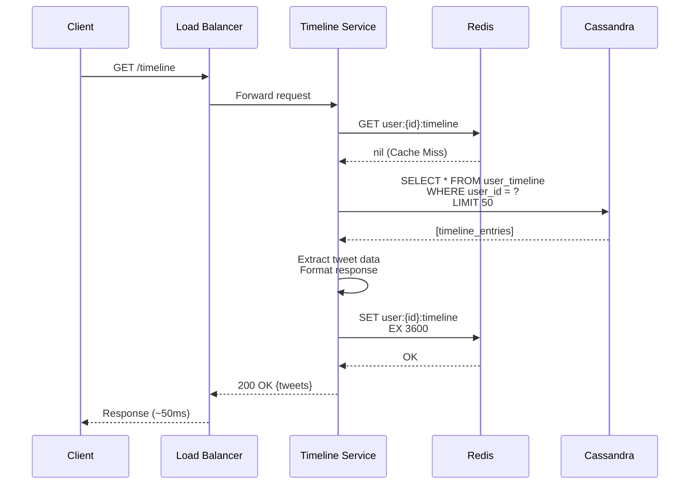

**Flow:**

Shows the slower path when timeline is not in cache (10% of requests).

**Steps:**

1. **Client Request** (0ms): User opens app (first time or after cache expiry)
2. **Timeline Service** (1ms): Constructs cache key
3. **Redis GET** (2ms): Attempts to retrieve from cache
4. **Cache Miss** ❌: Timeline not in cache (user inactive or cache evicted)
5. **Cassandra Query** (30ms):
   ```sql
   SELECT * FROM user_timeline 
   WHERE user_id = 12345 
   LIMIT 50;
   ```
    - Partition key lookup (user_id) → O(1)
    - Clustering key sorted (tweet_id DESC) → no sort needed
    - Returns 50 most recent tweets
6. **Format Response** (5ms): Deserialize tweet data, apply ranking
7. **Populate Cache** (5ms): Store in Redis with 1-hour TTL
8. **Return to Client** (~50ms total): Acceptable latency for cache miss

**Performance:**

- P50: 30ms
- P99: 50ms
- P999: 100ms

**Cache Warming:** Background job pre-populates cache for active users.

---

## 4. Hybrid Fanout: Celebrity Tweet

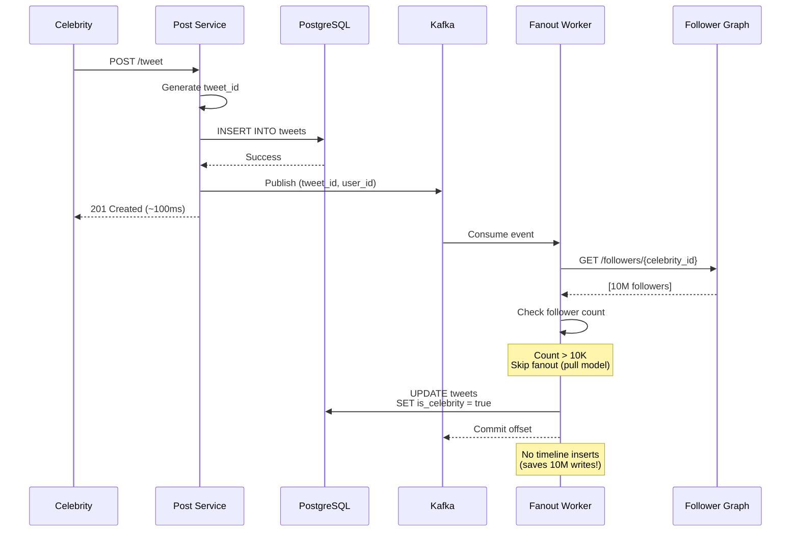

**Flow:**

Shows how the system handles celebrity tweets to avoid the fanout explosion.

**Steps:**

1. **Celebrity Posts** (0ms): @Cristiano (500M followers) posts tweet
2. **Post Service** (same as normal): Validate, generate ID, save to PostgreSQL
3. **Kafka Publish** (5ms): Event published to queue
4. **Return to Celebrity** (~100ms): Same experience as normal user
5. **Fanout Worker** consumes event
6. **Follower Graph Query** returns massive follower count (10M+)
7. **Celebrity Detection** ✅: Follower count > 10,000 threshold
8. **Skip Fanout** 🚫: Do NOT insert into timelines
9. **Mark Tweet** (optional): Flag as celebrity tweet for pull-based retrieval

**Savings:**

- **Normal user (5K followers):** 5,000 writes
- **Celebrity (10M followers):** 0 writes (100% reduction)
- **Infrastructure cost:** Saves millions in database writes

**Read-Time Handling:** See next diagram.

---

## 5. Timeline Loading with Celebrity Tweets (Hybrid Read)

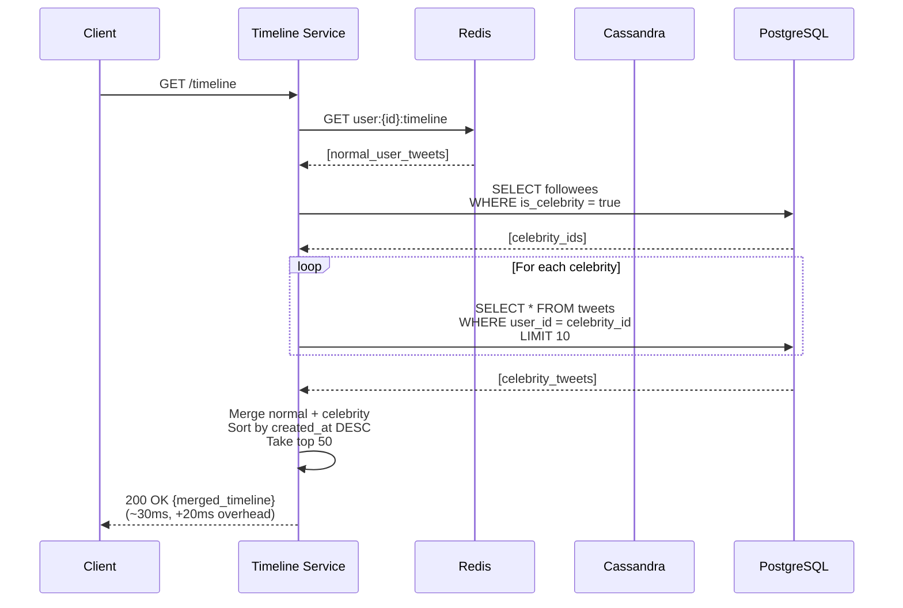

**Flow:**

Shows how timelines are loaded for users following celebrities (hybrid model).

**Steps:**

1. **Client Request** (0ms): User who follows @Cristiano requests timeline
2. **Fetch Pre-computed Timeline** (10ms):
    - Get from Redis cache (tweets from normal users)
    - Contains ~40 tweets from non-celebrity followees
3. **Identify Celebrities** (2ms):
    - Query which followees are celebrities
    - User follows 3 celebrities
4. **Fetch Celebrity Tweets** (10ms):
    - For each celebrity: Get their 10 most recent tweets
    - Batch query or parallel fetch
    - Total: 30 celebrity tweets
5. **Merge & Sort** (5ms):
    - Combine pre-computed (40) + celebrity (30) = 70 tweets
    - Sort by `created_at DESC`
    - Take top 50
6. **Return to Client** (~30ms total): 20ms overhead vs pure cache hit

**Optimization: Celebrity Tweet Cache**

```
celebrity:12345:recent_tweets → [last 100 tweet_ids]
TTL: 10 minutes
```

**Performance:**

- Without optimization: ~50ms (query PostgreSQL each time)
- With celebrity cache: ~30ms (20ms overhead)
- Pure cache hit (no celebrities): ~10ms

**Trade-off:** Slightly slower for users following many celebrities, but system remains stable.

---

## 6. Fanout with Activity-Based Filtering

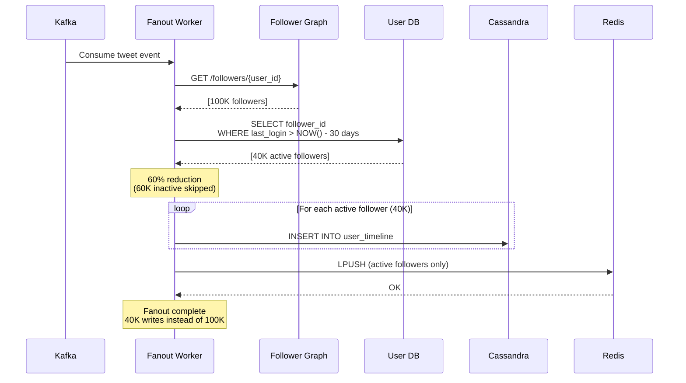

**Flow:**

Shows optimization to reduce wasted writes to inactive users.

**Steps:**

1. **Kafka Event** (0ms): Tweet posted by user with 100K followers
2. **Fetch All Followers** (50ms): Get complete follower list
3. **Activity Filter** (100ms):
   ```sql
   SELECT follower_id 
   FROM followers f
   JOIN users u ON f.follower_id = u.user_id
   WHERE f.followee_id = ?
     AND u.last_login > NOW() - INTERVAL '30 days';
   ```
    - Returns 40K active followers (40% of total)
    - Skips 60K inactive followers
4. **Fanout to Active Only** (5 seconds):
    - Insert tweet into 40K timelines (Cassandra)
    - Update Redis cache for active users
5. **Complete** ✅: 60% reduction in writes

**Inactive User Handling:**

- On next login: Pull recent tweets (fanout-on-read)
- Build timeline on-demand
- Slightly slower first load (acceptable)

**Benefits:**

- **Cost Savings:** 60% fewer database writes
- **Faster Fanout:** 60% faster completion
- **No User Impact:** Inactive users don't notice

**Monitoring:**

- Track active ratio (target: 40-50%)
- Alert if active ratio drops (indicates retention problem)

---

## 7. Kafka Failover and Consumer Rebalancing

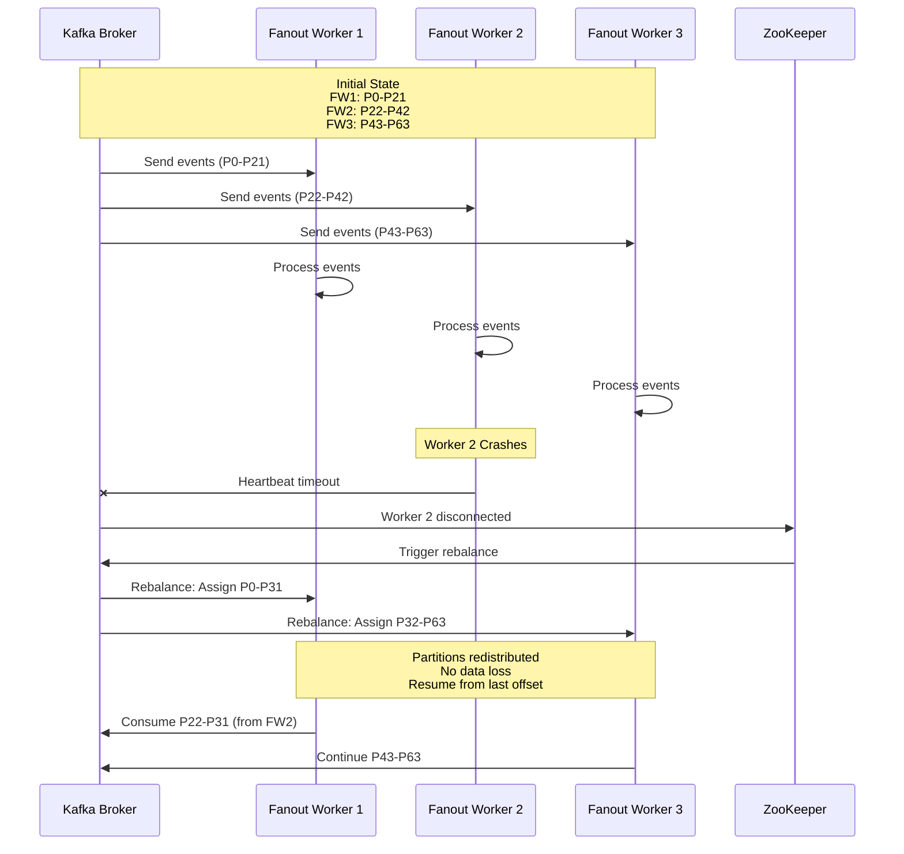

**Flow:**

Shows Kafka's automatic failover when a fanout worker dies.

**Normal Operation:**

1. **Initial State**:
    - 3 fanout workers in consumer group
    - 64 partitions divided evenly
    - Each worker processes ~21 partitions
2. **Processing:**
    - Each worker consumes from assigned partitions
    - Commits offsets periodically (every 5 seconds)
    - Processes tweets, inserts into timelines

**Failure Scenario:**

3. **Worker 2 Crashes** (e.g., OOM, deployment, hardware failure)
4. **Heartbeat Timeout** (30 seconds):
    - Worker 2 stops sending heartbeats to Kafka
    - Kafka coordinator detects failure
5. **Rebalance Triggered**:
    - ZooKeeper notifies all workers
    - Kafka pauses consumption briefly (~5 seconds)
6. **Partition Reassignment**:
    - P22-P42 (from FW2) redistributed to FW1 and FW3
    - FW1 now handles P0-P31 (10 extra partitions)
    - FW3 now handles P32-P63 (10 extra partitions)
7. **Resume from Last Offset**:
    - Workers start from last committed offset
    - No messages lost (durability guaranteed)
    - Processing continues with 2 workers (degraded capacity)

**Recovery:**

8. **Auto-Scaling** (optional): Deploy new worker to restore capacity
9. **Another Rebalance:** Partitions redistributed to 3 workers

**Performance Impact:**

- **During Rebalance:** ~5 seconds pause (acceptable)
- **Post-Rebalance:** 50% higher load per worker (temporary)
- **Consumer Lag:** May increase temporarily, recovers as workers catch up

**Monitoring:**

- Alert when consumer group size changes
- Track consumer lag during rebalance
- Auto-scale if lag exceeds threshold

---

## 8. Multi-Region Tweet Propagation

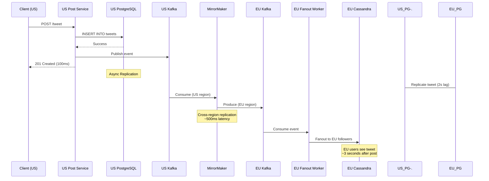

**Flow:**

Shows how tweets are propagated across geographic regions for global availability.

**Steps:**

1. **US User Posts Tweet** (0ms): Client in US posts to US data center
2. **US Processing** (100ms):
    - Save to US PostgreSQL
    - Publish to US Kafka
    - Return success to client
3. **US Fanout** (10 seconds): Fanout to US-based followers
4. **Cross-Region Replication** (async):
    - **PostgreSQL:** Master-slave async replication (~2 second lag)
    - **Kafka:** MirrorMaker copies events to EU Kafka (~500ms lag)
5. **EU Fanout** (10 seconds): EU workers fanout to EU-based followers
6. **EU Users See Tweet** (~3 seconds total):
    - From tweet post (US) to visible in timeline (EU)
    - Acceptable eventual consistency

**Consistency Model:**

- **Within Region:** Strong consistency (<1 second)
- **Cross-Region:** Eventual consistency (2-5 seconds)
- **User Experience:** Imperceptible delay for most users

**Benefits:**

- **Low Latency:** Users always access nearest region
- **High Availability:** Region failure doesn't affect others
- **Data Residency:** Compliance with local regulations

**Edge Case:** User in US follows user in EU

- EU user posts → Replicates to US (~3 seconds)
- US follower sees tweet with ~3 second delay
- Acceptable for social media use case

---

## 9. Rate Limiting Flow

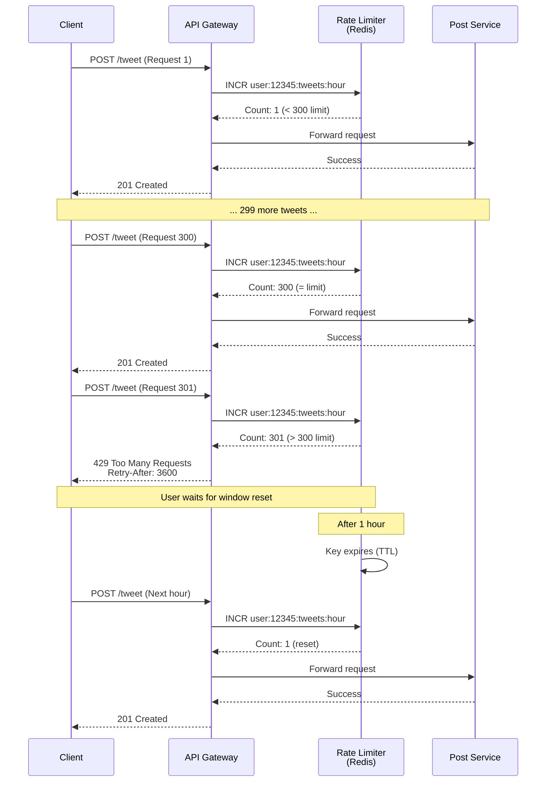

**Flow:**

Shows rate limiting implementation to prevent spam and abuse.

**Steps:**

1. **First Request** (0ms): User posts tweet
2. **Rate Limit Check** (2ms):
   ```redis
   INCR user:12345:tweets:hour
   EXPIRE user:12345:tweets:hour 3600
   ```
    - Increment counter for this user
    - Set TTL to 1 hour (sliding window)
3. **Within Limit** (Count ≤ 300): Allow request, forward to Post Service
4. **Subsequent Requests**: Counter increments with each tweet
5. **At Limit** (Count = 300): Last allowed tweet, warn user
6. **Exceed Limit** (Count > 300):
    - Return `429 Too Many Requests`
    - Include `Retry-After: 3600` header (seconds until reset)
    - Block request (don't forward to Post Service)
7. **Window Reset** (1 hour later):
    - Redis key expires (TTL)
    - Counter resets to 0
    - User can post again

**Rate Limit Tiers:**

- **Free Users:** 300 tweets/hour, 2,400 tweets/day
- **Verified Users:** 500 tweets/hour, 5,000 tweets/day
- **Premium Users:** 1,000 tweets/hour, 10,000 tweets/day

**Implementation (Redis):**

```
user:12345:tweets:hour → 150 (TTL: 1800s remaining)
user:12345:tweets:day → 800 (TTL: 43200s remaining)
```

**Benefits:**

- **Spam Prevention:** Blocks automated bots
- **Fair Usage:** Ensures platform quality
- **Cost Control:** Prevents infrastructure abuse

**Monitoring:**

- Track rate limit hit rate per tier
- Alert if >10% users hitting limits (may indicate limit too low)

---

## 10. Cache Invalidation on Tweet Deletion

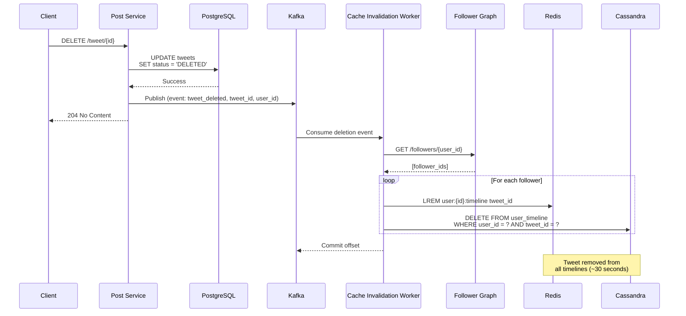

**Flow:**

Shows how deleted tweets are removed from all followers' timelines.

**Steps:**

1. **User Deletes Tweet** (0ms): Author requests deletion
2. **Soft Delete** (20ms):
    - Update tweet status to 'DELETED' in PostgreSQL
    - Don't actually delete (for audit/moderation)
    - Tweet no longer visible via API
3. **Return to Client** (~50ms): Immediate confirmation
4. **Publish Deletion Event** (5ms):
    - Kafka topic: `tweet_deleted`
    - Contains: tweet_id, author_user_id
5. **Cache Invalidation Worker** (async):
    - Consumes deletion events
    - Fetches all followers (same as fanout)
6. **Remove from Redis** (10ms per follower):
   ```redis
   LREM user:67890:timeline 0 tweet_id_123
   ```
    - Removes tweet from cached timeline
7. **Remove from Cassandra** (20ms per follower):
   ```sql
   DELETE FROM user_timeline 
   WHERE user_id = ? AND tweet_id = ?;
   ```
8. **Complete** (~30 seconds): Tweet removed from all timelines

**Edge Cases:**

- **Cache TTL:** Timelines in cache might show deleted tweet for up to 1 hour (until TTL expires)
- **Eventual Consistency:** Some users might see deleted tweet for ~30 seconds
- **Acceptable:** Social media doesn't require immediate deletion

**Optimization:**

- **Lazy Deletion:** Only remove from cache, leave in Cassandra
- **Filter on Read:** Timeline Service filters out deleted tweets
- **Trade-off:** Faster deletion vs more storage used

**Compliance:**

- **Legal Deletion:** If legally required (GDPR), hard delete from all systems
- **Process:** Separate compliance worker does thorough cleanup

---

## 11. Cassandra Write Failure and Retry

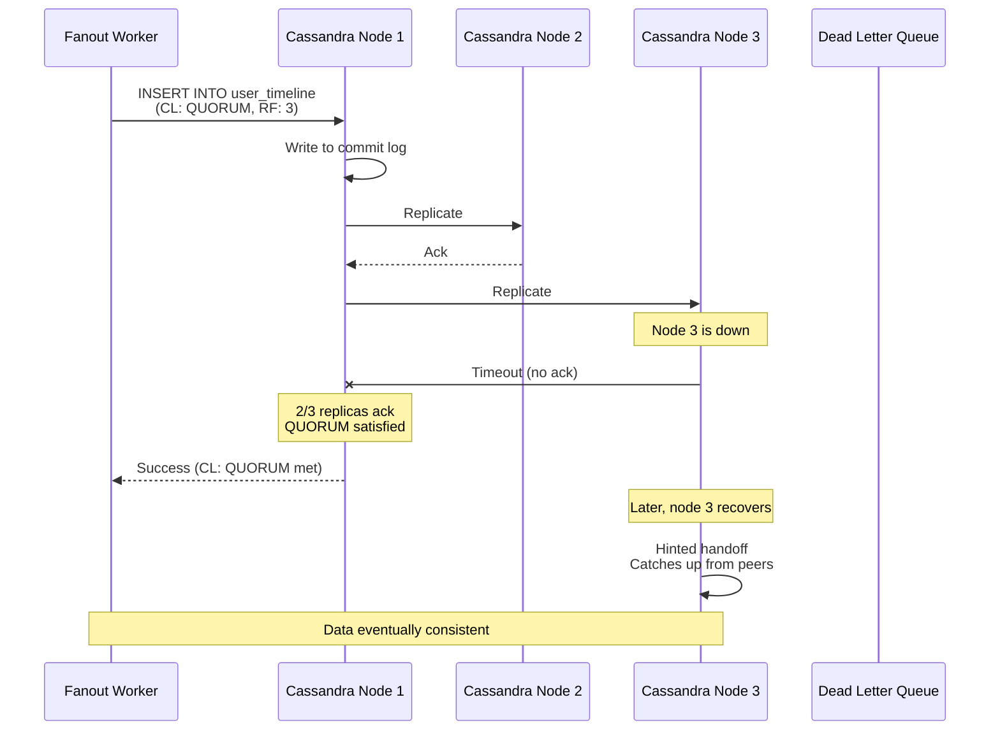

**Flow:**

Shows Cassandra's fault tolerance when a replica node is down.

**Normal Write (Success):**

1. **Fanout Worker** writes to Cassandra (Replication Factor = 3)
2. **Coordinator (Node 1)** receives write
3. **Replication**:
    - Write to local commit log (Node 1)
    - Replicate to Node 2 ✅ (Ack received)
    - Replicate to Node 3 ❌ (Node is down, timeout)
4. **Quorum Check:**
    - Consistency Level: QUORUM (requires 2/3 acks)
    - Received: 2 acks (Node 1 + Node 2)
    - QUORUM met → Return success to client
5. **Write Succeeds** ✅ (despite Node 3 failure)

**Recovery:**

6. **Hinted Handoff:**
    - Node 1 stores hint: "Node 3 needs this write"
    - When Node 3 recovers, hint replayed
    - Node 3 catches up asynchronously
7. **Eventual Consistency:** All 3 replicas have data within seconds

**Failure Modes:**

**Scenario 1: 1 Node Down (2/3 acks)**

- QUORUM met → Write succeeds
- System continues normally

**Scenario 2: 2 Nodes Down (1/3 acks)**

- QUORUM NOT met → Write fails
- Fanout worker retries with exponential backoff
- If retry limit exceeded → Send to Dead Letter Queue

**Scenario 3: All Nodes Down**

- Writes fail immediately
- Fanout worker writes to DLQ
- Manual intervention required

**Benefits:**

- **High Availability:** System tolerates single node failure
- **No Data Loss:** Hinted handoff ensures eventual delivery
- **Tunable Consistency:** Adjust CL based on requirements

**Monitoring:**

- Track hinted handoff queue size (should be ~0 normally)
- Alert if multiple nodes down (degraded replication)
- Monitor write latency (increases during failures)

---

## 12. PostgreSQL Failover (Primary Failure)

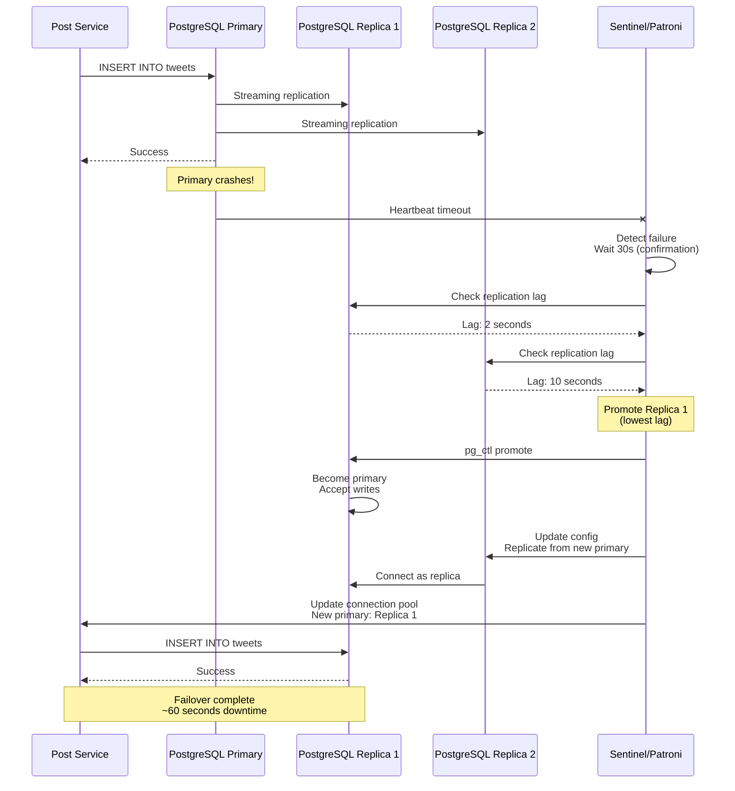

**Flow:**

Shows automatic failover when PostgreSQL primary fails.

**Normal Operation:**

1. **Primary Receives Writes:** All writes go to primary node
2. **Streaming Replication:** Changes stream to replicas in real-time
3. **Replicas Serve Reads:** Read queries load-balanced across replicas

**Failure Scenario:**

4. **Primary Crashes:**
    - Hardware failure, network partition, or OOM
    - Heartbeat to Sentinel stops
5. **Failure Detection** (30 seconds):
    - Sentinel (or Patroni) detects missing heartbeats
    - Confirms failure (avoids false positive)
6. **Candidate Selection**:
    - Query replication lag on all replicas
    - Replica 1: 2 seconds lag (best candidate)
    - Replica 2: 10 seconds lag
    - Choose Replica 1 (lowest lag = least data loss)
7. **Promotion** (15 seconds):
   ```bash
   pg_ctl promote -D /data
   ```
    - Replica 1 stops replicating
    - Becomes new primary
    - Starts accepting writes
8. **Reconfiguration** (15 seconds):
    - Update Replica 2 to replicate from new primary
    - Update DNS/load balancer (optional)
    - Notify application (connection pool update)
9. **Resume Operations** (~60 seconds total):
    - Post Service reconnects to new primary
    - Writes resume normally

**Data Loss:**

- **Best Case:** 0 seconds (if primary failure caught immediately)
- **Worst Case:** 2 seconds (replication lag)
- **Acceptable:** Social media tweets are not financial transactions

**Benefits:**

- **Automatic Recovery:** No manual intervention
- **Minimal Downtime:** ~60 seconds (industry-leading)
- **No Data Loss:** Synchronous replication option available (higher latency)

**Monitoring:**

- Alert when primary is down
- Track replication lag (should be <1 second normally)
- Verify automatic failover in test environment monthly
