# High-Level Design Diagrams: Notification Service

This document contains comprehensive system architecture diagrams for the Notification Service design challenge.

## Table of Contents

1. [Complete System Architecture](#1-complete-system-architecture)
2. [Notification Service Component Architecture](#2-notification-service-component-architecture)
3. [Kafka Topic Structure](#3-kafka-topic-structure)
4. [Multi-Channel Worker Architecture](#4-multi-channel-worker-architecture)
5. [WebSocket Real-Time Architecture](#5-websocket-real-time-architecture)
6. [Caching Architecture](#6-caching-architecture)
7. [Data Flow: Notification Creation](#7-data-flow-notification-creation)
8. [Data Flow: Notification Delivery](#8-data-flow-notification-delivery)
9. [Failure Handling Architecture](#9-failure-handling-architecture)
10. [Circuit Breaker Pattern](#10-circuit-breaker-pattern)
11. [Dead Letter Queue Workflow](#11-dead-letter-queue-workflow)
12. [Multi-Region Deployment](#12-multi-region-deployment)
13. [Horizontal Scaling Strategy](#13-horizontal-scaling-strategy)
14. [Monitoring and Observability Architecture](#14-monitoring-and-observability-architecture)
15. [Network Topology and Load Balancing](#15-network-topology-and-load-balancing)

---

## 1. Complete System Architecture

**Flow Explanation:**

This diagram shows the end-to-end architecture of the notification service, from event generation to final delivery across multiple channels.

**Key Components:**

1. **Event Sources**: Upstream microservices (Order Service, Social Service, etc.) that trigger notifications
2. **API Gateway**: Entry point with authentication, rate limiting, and load balancing
3. **Notification Service**: Core orchestration service that processes notification requests
4. **Kafka**: Message stream that buffers and guarantees delivery
5. **Channel Workers**: Specialized workers for each delivery channel
6. **Third-Party Providers**: External services (SendGrid, Twilio, FCM, APNS)
7. **Storage Layer**: PostgreSQL for user data, Cassandra for logs, Redis for caching
8. **WebSocket Server**: Real-time delivery for in-app notifications

**Benefits:**

- **Decoupled Architecture**: Each component can scale independently
- **Fault Tolerance**: Kafka ensures no message loss even during failures
- **Multi-Channel Support**: Separate workers handle channel-specific logic
- **High Throughput**: Can handle 57k+ QPS peak load

**Trade-offs:**

- **Complexity**: Multiple components to manage and monitor
- **Eventual Delivery**: ~100-200ms latency due to async processing
- **Operational Overhead**: Requires Kafka, Redis, and Cassandra expertise

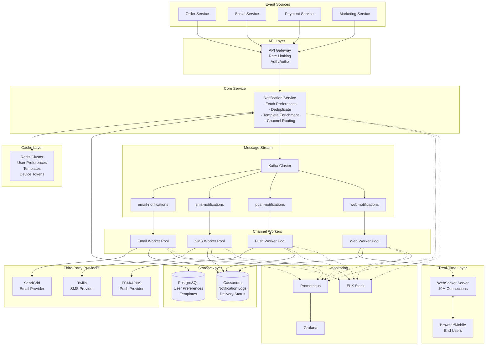

---

## 2. Notification Service Component Architecture

**Flow Explanation:**

This diagram details the internal architecture of the Notification Service, showing how incoming requests are processed before being published to Kafka.

**Processing Steps:**

1. **Request Validation**: Validate payload, check required fields
2. **Authentication**: Verify API key or JWT token
3. **Idempotency Check**: Query Redis for duplicate idempotency key (TTL: 24 hours)
4. **Preference Lookup**: Fetch user notification preferences from Redis (cache) or PostgreSQL (cache miss)
5. **Template Enrichment**: Fetch template and substitute variables (e.g., {{order_id}})
6. **Channel Selection**: Determine which channels to use based on user preferences
7. **Event Publishing**: Publish to appropriate Kafka topics
8. **Response**: Return 202 Accepted to caller

**Benefits:**

- **Idempotency**: Prevents duplicate notifications from retries
- **Fast Response**: Returns 202 immediately without waiting for delivery
- **Preference Respect**: Honors user opt-out settings
- **Template Flexibility**: Non-engineers can update notification content

**Performance:**

- **Latency**: <50ms for request processing (most time spent on cache lookups)
- **Throughput**: Can handle 10k+ requests/second per instance
- **Scalability**: Stateless service, easily horizontally scalable

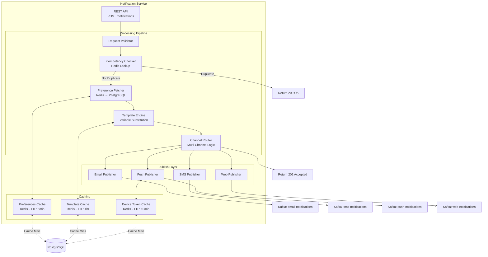

---

## 3. Kafka Topic Structure

**Flow Explanation:**

This diagram shows the Kafka topic organization for the notification service, including partitioning strategy and consumer groups.

**Topic Design:**

1. **Separate Topics per Channel**: Enables independent scaling and failure isolation
2. **Partitioning by user_id**: Ensures ordering per user, distributes load evenly
3. **Consumer Groups**: Each worker pool forms a consumer group for parallel processing
4. **Dead Letter Topics**: Capture failed messages after max retries

**Partition Strategy:**

- **email-notifications**: 12 partitions (high volume)
- **sms-notifications**: 6 partitions (moderate volume)
- **push-notifications**: 12 partitions (high volume)
- **web-notifications**: 6 partitions (moderate volume)

**Benefits:**

- **Scalability**: Add more partitions to increase parallelism
- **Ordering**: Messages for same user are ordered within partition
- **Replay**: Can replay messages for debugging or reprocessing
- **Durability**: Messages retained for 7 days (configurable)

**Performance:**

- **Throughput**: Kafka can handle 1M+ messages/second
- **Latency**: <10ms to write to Kafka
- **Retention**: 7-day retention allows debugging and replay

```mermaid
graph TB
    subgraph "Kafka Cluster"
        subgraph "Email Channel"
            TE[Topic: email-notifications<br/>12 Partitions<br/>Replication: 3]
            DLE[DLQ: dlq-email<br/>Failed Emails]
        end
        
        subgraph "SMS Channel"
            TS[Topic: sms-notifications<br/>6 Partitions<br/>Replication: 3]
            DLS[DLQ: dlq-sms<br/>Failed SMS]
        end
        
        subgraph "Push Channel"
            TP[Topic: push-notifications<br/>12 Partitions<br/>Replication: 3]
            DLP[DLQ: dlq-push<br/>Failed Push]
        end
        
        subgraph "Web Channel"
            TW[Topic: web-notifications<br/>6 Partitions<br/>Replication: 3]
            DLW[DLQ: dlq-web<br/>Failed Web]
        end
    end
    
    subgraph "Consumer Groups"
        subgraph "Email Workers"
            EW1[Email Worker 1]
            EW2[Email Worker 2]
            EW3[Email Worker 3]
        end
        
        subgraph "SMS Workers"
            SW1[SMS Worker 1]
            SW2[SMS Worker 2]
        end
        
        subgraph "Push Workers"
            PW1[Push Worker 1]
            PW2[Push Worker 2]
            PW3[Push Worker 3]
        end
        
        subgraph "Web Workers"
            WW1[Web Worker 1]
            WW2[Web Worker 2]
        end
    end
    
    TE -->|Partitions 0-3| EW1
    TE -->|Partitions 4-7| EW2
    TE -->|Partitions 8-11| EW3
    
    TS -->|Partitions 0-2| SW1
    TS -->|Partitions 3-5| SW2
    
    TP -->|Partitions 0-3| PW1
    TP -->|Partitions 4-7| PW2
    TP -->|Partitions 8-11| PW3
    
    TW -->|Partitions 0-2| WW1
    TW -->|Partitions 3-5| WW2
    
    EW1 -.->|Max Retries Exceeded| DLE
    EW2 -.->|Max Retries Exceeded| DLE
    EW3 -.->|Max Retries Exceeded| DLE
    
    SW1 -.->|Max Retries Exceeded| DLS
    SW2 -.->|Max Retries Exceeded| DLS
    
    PW1 -.->|Max Retries Exceeded| DLP
    PW2 -.->|Max Retries Exceeded| DLP
    PW3 -.->|Max Retries Exceeded| DLP
    
    WW1 -.->|Max Retries Exceeded| DLW
    WW2 -.->|Max Retries Exceeded| DLW
```

---

## 4. Multi-Channel Worker Architecture

**Flow Explanation:**

This diagram shows the detailed architecture of channel workers, including retry logic, rate limiting, and third-party API integration.

**Worker Components:**

1. **Kafka Consumer**: Consumes messages from assigned partitions
2. **Rate Limiter**: Token Bucket algorithm to stay within provider limits
3. **Circuit Breaker**: Protects against cascading failures
4. **Retry Handler**: Exponential backoff for transient failures
5. **API Client**: HTTP client for third-party APIs
6. **Logger**: Writes delivery status to Cassandra

**Processing Flow:**

1. Consumer pulls batch of messages from Kafka (batch size: 100)
2. Rate limiter checks if we can send (based on provider limits)
3. Circuit breaker checks if provider is healthy
4. Worker calls third-party API (SendGrid, Twilio, FCM, APNS)
5. On success: Log to Cassandra, commit offset
6. On failure: Retry with exponential backoff (3 attempts)
7. After max retries: Move to Dead Letter Queue

**Benefits:**

- **Rate Limiting**: Prevents overwhelming third-party APIs
- **Circuit Breaker**: Fast failure during provider outages
- **Retry Logic**: Handles transient failures automatically
- **Batch Processing**: Improves throughput for push notifications

**Performance:**

- **Email Worker**: ~1000 emails/second per worker
- **SMS Worker**: ~100 SMS/second per worker (Twilio limit)
- **Push Worker**: ~5000 push notifications/second per worker (batching)
- **Web Worker**: ~10,000 WebSocket messages/second per worker

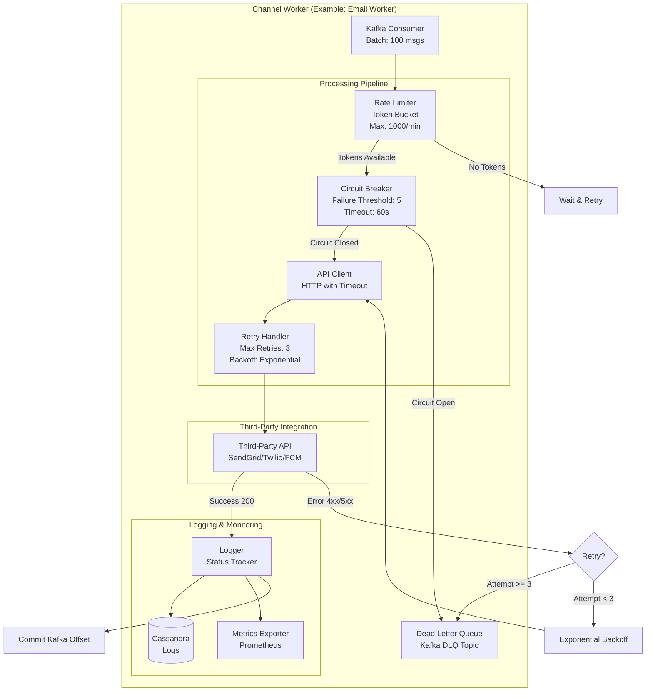

---

## 5. WebSocket Real-Time Architecture

**Flow Explanation:**

This diagram shows the WebSocket server architecture for real-time in-app notifications, including connection management and cross-server communication.

**Architecture Components:**

1. **Load Balancer**: Routes connections using sticky sessions (hash by user_id)
2. **WebSocket Server Pool**: Multiple servers handling 10k connections each
3. **Redis Pub/Sub**: Enables cross-server message delivery
4. **Connection Registry**: Tracks which server holds each user's connection
5. **Heartbeat Monitor**: Detects and closes stale connections

**Connection Flow:**

1. **Client Connect**: User opens WebSocket connection via browser/mobile app
2. **Sticky Session**: Load balancer routes to same server for user (based on user_id hash)
3. **Registration**: Server stores connection in Redis: `user:{user_id} → server:{server_id}`
4. **Notification Arrival**: Web Worker receives notification from Kafka
5. **Server Lookup**: Worker queries Redis to find which server holds the connection
6. **Pub/Sub**: Worker publishes to Redis channel: `server:{server_id}:notifications`
7. **Delivery**: Server receives from Redis, pushes to WebSocket connection
8. **Acknowledgment**: Client sends ACK, server logs to Cassandra

**Benefits:**

- **Real-Time**: <100ms latency from event to user
- **Scalable**: Horizontal scaling by adding more WebSocket servers
- **Resilient**: Automatic reconnection on failure
- **Efficient**: No repeated polling, battery-friendly

**Performance:**

- **Concurrent Connections**: 10M total (10k per server × 1000 servers)
- **Message Latency**: <100ms end-to-end
- **Throughput**: 10,000 messages/second per server
- **Memory Usage**: ~10KB per connection → 100MB for 10k connections

**Trade-offs:**

- **Sticky Sessions**: Requires load balancer support
- **State Management**: Must track connections in Redis
- **Reconnection Logic**: Clients must handle connection drops

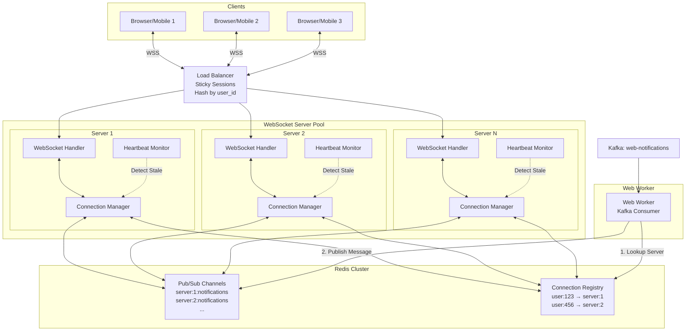

---

## 6. Caching Architecture

**Flow Explanation:**

This diagram shows the Redis caching strategy for user preferences, templates, and device tokens, including cache invalidation patterns.

**Cached Data Types:**

1. **User Preferences**: Email/SMS/Push/Web enabled flags, frequency limits (TTL: 5 minutes)
2. **Templates**: Notification templates with variables (TTL: 1 hour)
3. **Device Tokens**: FCM/APNS tokens for push notifications (TTL: 10 minutes)
4. **Idempotency Keys**: Prevent duplicate notifications (TTL: 24 hours)

**Cache Flow:**

1. **Read Path**: Notification Service → Redis (cache hit) → Use cached data
2. **Cache Miss**: Notification Service → Redis (miss) → PostgreSQL → Update Redis → Return
3. **Write Path**: User updates preferences → PostgreSQL → Invalidate Redis cache
4. **TTL Expiry**: Redis automatically evicts expired keys

**Benefits:**

- **Reduced DB Load**: 95%+ cache hit rate reduces PostgreSQL queries
- **Low Latency**: <1ms Redis lookup vs 10-50ms PostgreSQL query
- **Scalability**: Redis cluster handles millions of requests/second
- **Cost Savings**: Allows smaller PostgreSQL instances

**Cache Hit Rates:**

- **User Preferences**: ~98% (rarely change)
- **Templates**: ~99% (almost never change)
- **Device Tokens**: ~90% (users reconnect daily)
- **Idempotency**: 100% (always checked)

**Trade-offs:**

- **Stale Data**: Up to 5 minutes for preference changes
- **Memory Cost**: Redis cluster with 100GB+ memory
- **Invalidation Complexity**: Must invalidate on updates

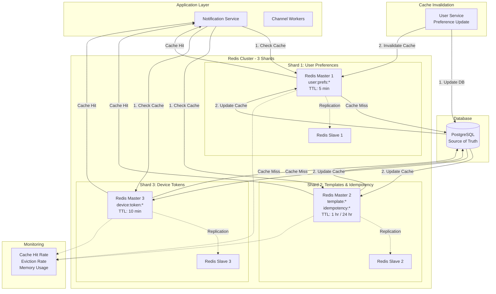

---

## 7. Data Flow: Notification Creation

**Flow Explanation:**

This diagram shows the complete data flow from event generation to Kafka publication, with all processing steps and decision points.

**End-to-End Flow:**

1. **Event Trigger** (0ms): Order Service completes order, triggers notification
2. **API Call** (0-10ms): POST /notifications with event data and idempotency key
3. **API Gateway** (10-20ms): Authentication, rate limiting, load balancing
4. **Validation** (20-25ms): Validate payload, check required fields
5. **Idempotency Check** (25-30ms): Query Redis for duplicate key
6. **Preference Lookup** (30-35ms): Fetch user preferences from Redis (cache hit)
7. **Template Fetch** (35-40ms): Fetch template from Redis (cache hit)
8. **Variable Substitution** (40-45ms): Replace {{order_id}}, {{amount}}, etc.
9. **Channel Selection** (45-50ms): Determine channels based on preferences
10. **Kafka Publish** (50-60ms): Write to email, push, web topics
11. **Response** (60ms): Return 202 Accepted to caller

**Total Latency**: ~60ms from API call to 202 response

**Benefits:**

- **Fast Response**: User doesn't wait for actual notification delivery
- **Idempotent**: Safe to retry without duplicate notifications
- **Decoupled**: Kafka buffers for worker processing
- **Flexible**: Templates allow content changes without code deploy

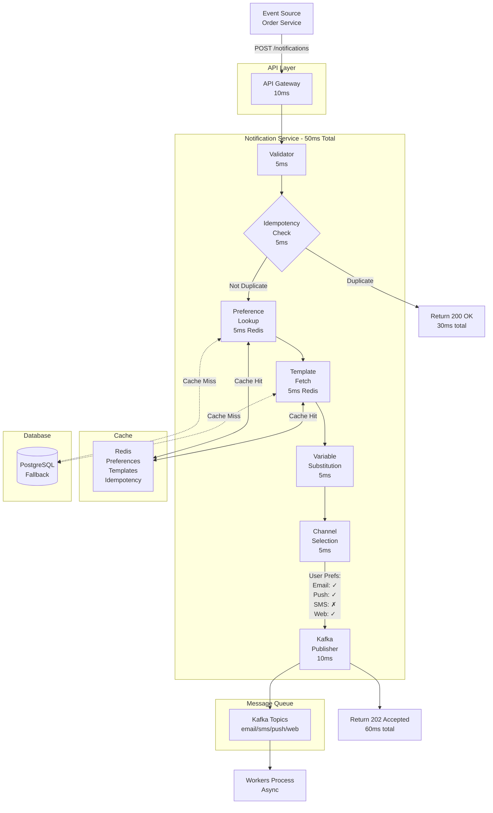

---

## 8. Data Flow: Notification Delivery

**Flow Explanation:**

This diagram shows the asynchronous delivery flow after messages are published to Kafka, including parallel processing across multiple channels.

**Delivery Steps:**

1. **Kafka Buffer** (0s): Messages sit in Kafka partitions
2. **Worker Consumption** (0-1s): Workers poll messages in batches
3. **Rate Limit Check** (1s): Token Bucket verifies we can send
4. **Circuit Breaker Check** (1s): Verify provider is healthy
5. **API Call** (1-2s): Call third-party API (SendGrid, Twilio, FCM)
6. **Provider Processing** (2-5s): Provider delivers to end user
7. **Status Logging** (5s): Write delivery status to Cassandra
8. **Offset Commit** (5s): Commit Kafka offset for message

**Channel-Specific Latency:**

- **Email**: 2-5 seconds (SMTP delivery)
- **SMS**: 1-3 seconds (cellular network)
- **Push**: 1-2 seconds (FCM/APNS)
- **Web**: <0.5 seconds (WebSocket delivery)

**Benefits:**

- **Parallel Processing**: All channels process simultaneously
- **Independent Scaling**: Scale each channel based on load
- **Fault Isolation**: Email failure doesn't affect Push delivery
- **Guaranteed Delivery**: Kafka ensures no message loss

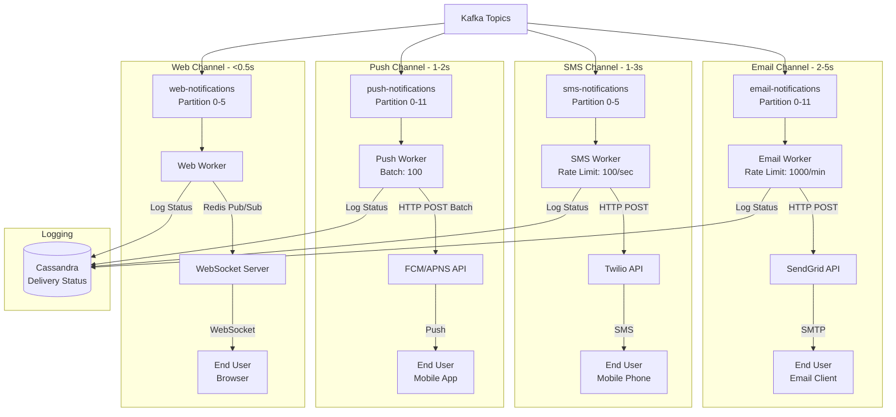

---

## 9. Failure Handling Architecture

**Flow Explanation:**

This diagram shows how the system handles various failure scenarios, including retry logic, circuit breakers, and dead letter queues.

**Failure Scenarios:**

1. **Transient Failure** (Network timeout, 5xx error):
   - Worker retries with exponential backoff
   - Attempt 1: 1 second delay
   - Attempt 2: 2 seconds delay
   - Attempt 3: 4 seconds delay
   - Success: Log to Cassandra, commit offset

2. **Provider Outage** (SendGrid down):
   - Circuit Breaker opens after 5 consecutive failures
   - Messages remain in Kafka (no data loss)
   - Circuit Breaker tests recovery every 60 seconds
   - When recovered, resume processing

3. **Permanent Failure** (Invalid device token, expired email):
   - After 3 retries, move to Dead Letter Queue
   - Alert monitoring system
   - Manual investigation or batch retry later

4. **Rate Limit Exceeded**:
   - Token Bucket blocks request
   - Worker waits until tokens available
   - No message loss, just delayed delivery

**Benefits:**

- **No Message Loss**: Kafka persistence ensures delivery
- **Automatic Recovery**: System resumes when provider recovers
- **Fast Failure**: Circuit Breaker prevents cascading failures
- **Observability**: DLQ makes failed messages visible

**Recovery Time:**

- **Transient Failure**: <10 seconds (3 retries)
- **Provider Outage**: 60 seconds (circuit breaker test interval)
- **Permanent Failure**: Moved to DLQ immediately after max retries

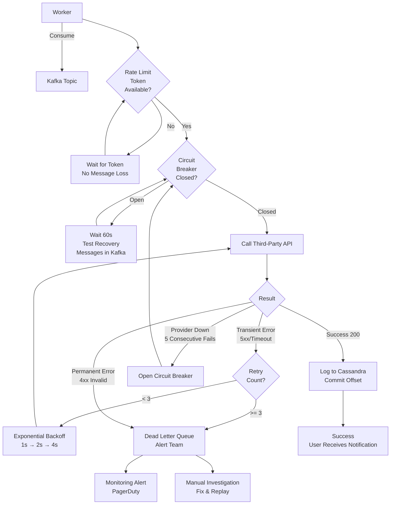

---

## 10. Circuit Breaker Pattern

**Flow Explanation:**

This diagram shows the three states of the Circuit Breaker pattern (Closed, Open, Half-Open) and state transitions.

**Circuit Breaker States:**

1. **Closed** (Normal Operation):
   - All requests pass through to third-party API
   - Track success/failure rate
   - If failures >= threshold (5 consecutive), transition to Open

2. **Open** (Fast Failure):
   - All requests fail immediately without calling API
   - Messages remain in Kafka (no loss)
   - After timeout (60 seconds), transition to Half-Open

3. **Half-Open** (Testing Recovery):
   - Allow single test request to API
   - If success: Transition to Closed (resume normal operation)
   - If failure: Transition back to Open (continue waiting)

**Configuration:**

- **Failure Threshold**: 5 consecutive failures
- **Open Timeout**: 60 seconds
- **Half-Open Test**: 1 request
- **Success Threshold**: 3 consecutive successes to fully recover

**Benefits:**

- **Fast Failure**: Don't waste time on failing API calls
- **Automatic Recovery**: Tests for recovery without manual intervention
- **Resource Protection**: Prevents overwhelming struggling provider
- **User Experience**: Faster error response instead of long timeouts

**Performance:**

- **Closed State**: <5ms overhead (tracking)
- **Open State**: <1ms (immediate failure)
- **Half-Open State**: Normal API latency for test request

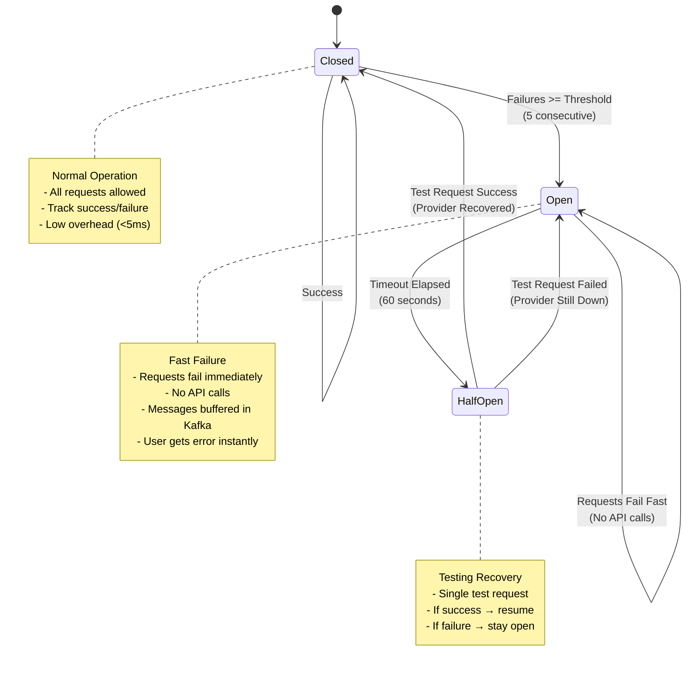

---

## 11. Dead Letter Queue Workflow

**Flow Explanation:**

This diagram shows how failed messages are handled, moved to DLQ, monitored, and eventually reprocessed or discarded.

**DLQ Workflow:**

1. **Failure Detection**: Worker exhausts all retries (3 attempts)
2. **Move to DLQ**: Publish message to DLQ topic (dlq-email, dlq-sms, etc.)
3. **Alerting**: Trigger alert if DLQ message count exceeds threshold (e.g., 10,000)
4. **Investigation**: Engineers investigate root cause
5. **Resolution**: Fix issue (e.g., update invalid device token, whitelist email)
6. **Replay**: Reprocess messages from DLQ back to main topic
7. **Discard**: Permanently discard if unfixable (e.g., user deleted account)

**DLQ Monitoring:**

- **Message Count**: Alert if >10,000 messages in DLQ
- **Age**: Alert if messages >24 hours old
- **Error Patterns**: Group by error type (4xx vs 5xx)
- **Cost**: Track DLQ storage and processing cost

**Benefits:**

- **Visibility**: Failed messages are not silently lost
- **Debuggability**: Preserve failed messages for investigation
- **Reprocessing**: Can replay after fixing issues
- **Metrics**: Track failure patterns over time

**Common DLQ Reasons:**

- **Invalid Device Token**: Push notification token expired
- **Email Bounced**: Email address doesn't exist
- **SMS Blocked**: Phone number on blocklist
- **Rate Limit**: Exceeded third-party quota

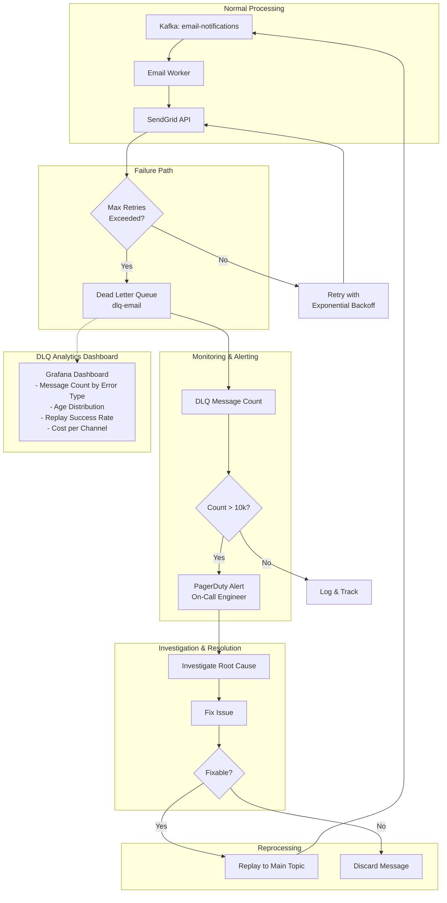

---

## 12. Multi-Region Deployment

**Flow Explanation:**

This diagram shows the multi-region architecture for global deployment, including data replication and geo-partitioning for compliance.

**Regional Architecture:**

1. **Regional Kafka Clusters**: Deploy Kafka in each region (US-East, EU-West, APAC-Singapore)
2. **Regional Channel Workers**: Deploy workers in same region as users
3. **Regional Cassandra Clusters**: Store logs in user's region (GDPR compliance)
4. **Global PostgreSQL**: Replicate user preferences and templates across regions
5. **Regional Redis**: Cache in each region, sync critical data

**Data Replication:**

- **User Preferences**: PostgreSQL master-slave replication across regions
- **Templates**: Replicated globally (same templates in all regions)
- **Notification Logs**: Stored regionally (no cross-region replication for logs)
- **Device Tokens**: Stored regionally with user data

**Benefits:**

- **Low Latency**: Users in EU served from EU region (<50ms)
- **Compliance**: GDPR data residency requirements met
- **Resilience**: Regional failures don't affect other regions
- **Scalability**: Scale each region independently

**Performance:**

- **Intra-Region Latency**: <50ms
- **Cross-Region Latency**: 100-300ms (only for reads, not critical path)
- **Data Residency**: 100% compliant (logs stay in region)

**Trade-offs:**

- **Complexity**: Must manage multiple Kafka/Cassandra clusters
- **Cost**: Higher infrastructure cost (3x resources)
- **Consistency**: Cross-region replication lag (1-5 seconds)

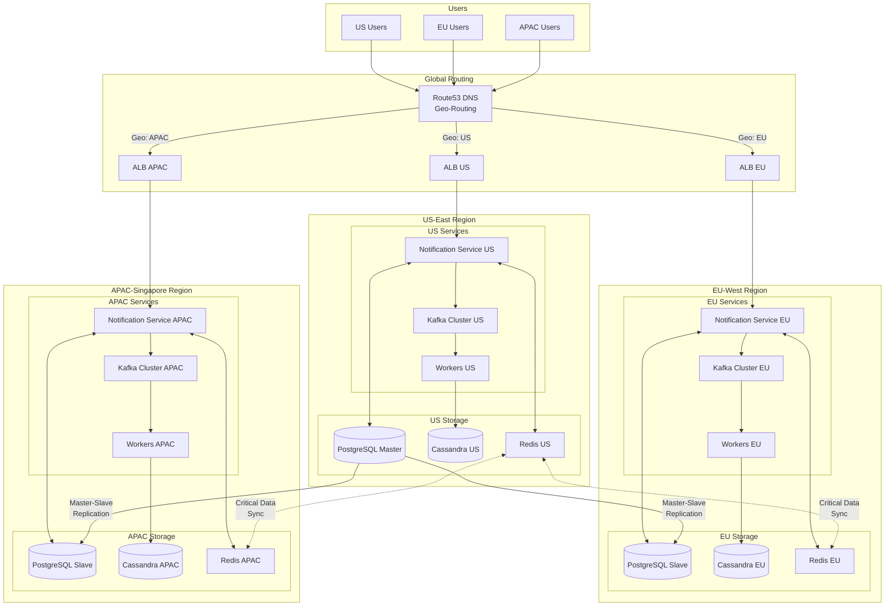

---

## 13. Horizontal Scaling Strategy

**Flow Explanation:**

This diagram shows how to scale the notification service horizontally by adding more instances of each component.

**Scaling Dimensions:**

1. **API Gateway**: Add more load balancer instances
2. **Notification Service**: Stateless, add more pods/instances
3. **Kafka**: Add more brokers and partitions
4. **Channel Workers**: Add more worker instances (auto-scaling based on lag)
5. **WebSocket Servers**: Add more servers, each handling 10k connections
6. **Redis**: Add more shards (consistent hashing)
7. **Cassandra**: Add more nodes (linear scalability)
8. **PostgreSQL**: Read replicas for query scaling (writes remain bottleneck)

**Auto-Scaling Triggers:**

- **Notification Service**: CPU > 70% or Request Queue > 1000
- **Channel Workers**: Kafka consumer lag > 5 minutes
- **WebSocket Servers**: Connection count > 8000 per server
- **Redis**: Memory usage > 80%
- **Cassandra**: Write latency > 50ms

**Scaling Limits:**

- **Notification Service**: Linear (stateless)
- **Kafka**: Linear up to ~1000 brokers
- **Workers**: Linear (independent consumers)
- **WebSocket**: Linear (connection sharding)
- **Cassandra**: Linear (add nodes)
- **PostgreSQL**: Vertical + read replicas (master write bottleneck)

**Benefits:**

- **Elastic**: Scale up during peak hours, scale down during off-peak
- **Cost-Effective**: Pay only for resources you need
- **Resilient**: No single point of failure
- **Performance**: Maintains latency SLAs under load

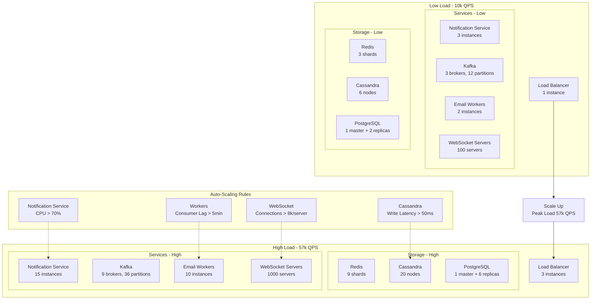

---

## 14. Monitoring and Observability Architecture

**Flow Explanation:**

This diagram shows the monitoring stack for the notification service, including metrics, logs, traces, and alerting.

**Monitoring Components:**

1. **Prometheus**: Collects metrics from all services (request rate, latency, error rate)
2. **Grafana**: Visualizes metrics in dashboards
3. **ELK Stack**: Centralized logging (Elasticsearch, Logstash, Kibana)
4. **Jaeger**: Distributed tracing (trace notification from API to delivery)
5. **PagerDuty**: Alerting for critical issues
6. **Slack**: Warning alerts for non-critical issues

**Key Dashboards:**

1. **Overview**: Total notifications, delivery rate, P99 latency
2. **Per-Channel**: Email/SMS/Push/Web metrics separately
3. **Kafka**: Consumer lag, throughput, partition distribution
4. **Workers**: Processing rate, error rate, retry rate
5. **Third-Party**: SendGrid, Twilio, FCM API latency and error rates
6. **Cost**: Per-channel cost breakdown

**Alerting Rules:**

- **Critical** (PagerDuty): Consumer lag >10min, Error rate >10%, DLQ count >10k
- **Warning** (Slack): Cache hit rate <80%, API latency >2s, Disk usage >70%

**Benefits:**

- **Proactive**: Detect issues before users complain
- **Debuggable**: Trace individual notifications end-to-end
- **Optimizable**: Identify bottlenecks and optimize
- **Accountable**: Track SLAs and report uptime

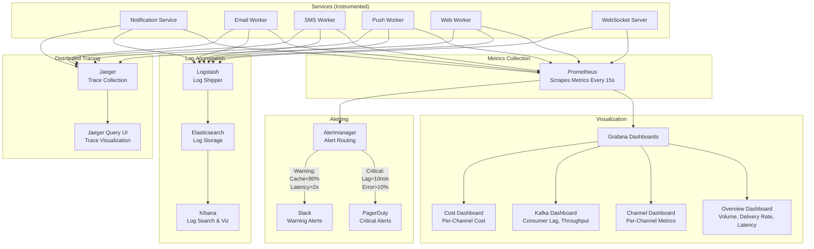

---

## 15. Network Topology and Load Balancing

**Flow Explanation:**

This diagram shows the network topology, including load balancers, security groups, and traffic routing.

**Network Layers:**

1. **Edge Layer**: CloudFlare/CDN for DDoS protection, TLS termination
2. **Load Balancer Layer**: Application Load Balancer (ALB) with health checks
3. **Service Layer**: Notification Service instances in private subnets
4. **Data Layer**: Databases and caches in private subnets with replication

**Load Balancing Strategy:**

- **API Gateway**: Round-robin across all instances
- **Notification Service**: Round-robin with health checks
- **WebSocket Servers**: Sticky sessions (hash by user_id)
- **Kafka**: Kafka's built-in partition assignment
- **Cassandra**: Consistent hashing by partition key

**Security:**

- **Edge**: DDoS protection, rate limiting, TLS termination
- **Service**: Only accept traffic from Load Balancer
- **Data**: Only accept traffic from Service Layer
- **Encryption**: TLS in transit, AES-256 at rest

**High Availability:**

- **Multi-AZ**: Deploy across 3 availability zones
- **Health Checks**: ALB removes unhealthy instances (5 failed checks)
- **Auto-Recovery**: Kubernetes/ECS restarts failed pods
- **Graceful Shutdown**: Drain connections before termination

**Benefits:**

- **Resilient**: No single point of failure
- **Secure**: Multiple layers of defense
- **Performant**: Low latency routing
- **Scalable**: Add more instances seamlessly

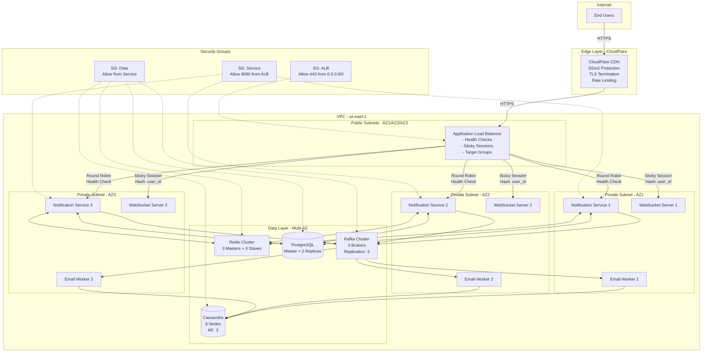

---

## Summary

These 15 high-level design diagrams provide a comprehensive visual guide to the Notification Service architecture. Key takeaways:

1. **End-to-End Flow**: From event generation to multi-channel delivery
2. **Scalability**: Horizontal scaling at every layer
3. **Resilience**: Circuit breakers, DLQs, multi-region deployment
4. **Performance**: <100ms API response, <2s notification delivery
5. **Observability**: Comprehensive monitoring and tracing

**Next Steps**:
- Review **[sequence-diagrams.md](./sequence-diagrams.md)** for detailed interaction flows
- Study **[this-over-that.md](./this-over-that.md)** for design decision rationale
- Examine **[pseudocode.md](./pseudocode.md)** for algorithm implementations

