# Sequence Diagrams: Notification Service

This document contains detailed sequence diagrams showing the interactions between components for various notification
scenarios.

## Table of Contents

1. [Complete Notification Creation Flow (Happy Path)](#1-complete-notification-creation-flow-happy-path)
2. [Email Notification Delivery](#2-email-notification-delivery)
3. [SMS Notification Delivery](#3-sms-notification-delivery)
4. [Push Notification Delivery](#4-push-notification-delivery)
5. [Web/WebSocket Notification Delivery](#5-webwebsocket-notification-delivery)
6. [Multi-Channel Notification Flow](#6-multi-channel-notification-flow)
7. [Failure Scenario: Third-Party API Down](#7-failure-scenario-third-party-api-down)
8. [Failure Scenario: Device Token Invalid](#8-failure-scenario-device-token-invalid)
9. [Failure Scenario: Rate Limit Exceeded](#9-failure-scenario-rate-limit-exceeded)
10. [Circuit Breaker Opening Flow](#10-circuit-breaker-opening-flow)
11. [Dead Letter Queue Flow](#11-dead-letter-queue-flow)
12. [Idempotency Handling (Duplicate Request)](#12-idempotency-handling-duplicate-request)
13. [Cache Miss Flow](#13-cache-miss-flow)
14. [WebSocket Reconnection Flow](#14-websocket-reconnection-flow)
15. [Cross-Region Notification Flow](#15-cross-region-notification-flow)

---

## 1. Complete Notification Creation Flow (Happy Path)

**Flow:**

Shows the complete flow from order confirmation event to notification being queued for delivery across multiple
channels.

**Steps:**

1. **Order Service** (0ms): Order completed successfully, triggers notification
2. **API Gateway** (10ms): JWT validation, rate limit check (user hasn't exceeded limit)
3. **Notification Service** (20ms): Receives POST /notifications request
4. **Idempotency Check** (25ms): Queries Redis for idempotency key (cache hit: not duplicate)
5. **Preference Lookup** (30ms): Fetches user notification preferences from Redis (cache hit)
6. **Template Fetch** (35ms): Retrieves order confirmation template from Redis (cache hit)
7. **Variable Substitution** (40ms): Replaces {{order_id}}, {{amount}}, {{eta}} in template
8. **Channel Selection** (45ms): User preferences: email ✓, push ✓, SMS ✗, web ✓
9. **Kafka Publish** (55ms): Publishes to 3 topics (email, push, web)
10. **Response to Client** (60ms): Returns 202 Accepted with notification_id
11. **Background Processing**: Workers consume from Kafka and deliver async

**Performance:**

- **Client Response**: 60ms (user doesn't wait for actual delivery)
- **Actual Delivery**: 1-5 seconds (happens asynchronously)
- **Cache Hit Rate**: 98% (most lookups hit Redis)

**Key Benefits:**

- Fast API response
- Idempotent (safe to retry)
- Respects user preferences
- Decoupled from delivery

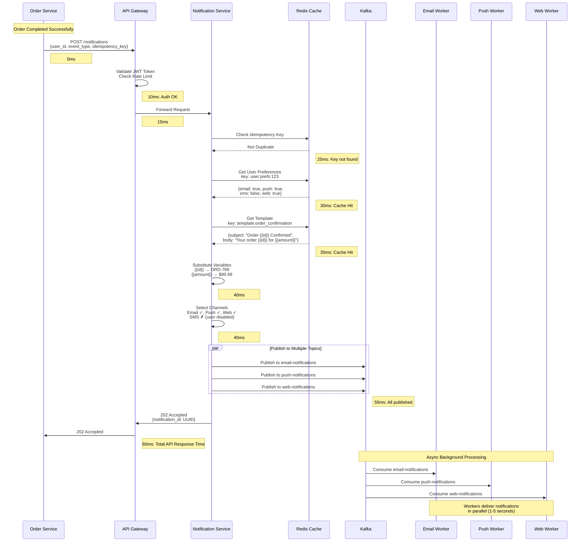
```mermaid
sequenceDiagram
    participant OS as Order Service
    participant AG as API Gateway
    participant NS as Notification Service
    participant RC as Redis Cache
    participant K as Kafka
    participant EW as Email Worker
    participant PW as Push Worker
    participant WW as Web Worker
    Note over OS: Order Completed Successfully
    OS ->> AG: POST /notifications<br/>{user_id, event_type, idempotency_key}
    Note right of OS: 0ms
    AG ->> AG: Validate JWT Token<br/>Check Rate Limit
    Note right of AG: 10ms: Auth OK
    AG ->> NS: Forward Request
    Note right of AG: 15ms
    NS ->> RC: Check Idempotency Key
    RC -->> NS: Not Duplicate
    Note right of RC: 25ms: Key not found
    NS ->> RC: Get User Preferences<br/>key: user:prefs:123
    RC -->> NS: {email: true, push: true,<br/>sms: false, web: true}
    Note right of RC: 30ms: Cache Hit
    NS ->> RC: Get Template<br/>key: template:order_confirmation
    RC -->> NS: {subject: "Order {{id}} Confirmed",<br/>body: "Your order {{id}} for {{amount}}"}
    Note right of RC: 35ms: Cache Hit
    NS ->> NS: Substitute Variables<br/>{{id}} → ORD-789<br/>{{amount}} → $99.99
    Note right of NS: 40ms
    NS ->> NS: Select Channels<br/>Email ✓, Push ✓, Web ✓<br/>SMS ✗ (user disabled)
    Note right of NS: 45ms

    par Publish to Multiple Topics
        NS ->> K: Publish to email-notifications
        NS ->> K: Publish to push-notifications
        NS ->> K: Publish to web-notifications
    end
    Note right of K: 55ms: All published
    NS ->> AG: 202 Accepted<br/>{notification_id: UUID}
    AG ->> OS: 202 Accepted
    Note right of AG: 60ms: Total API Response Time
    Note over K, WW: Async Background Processing
    K ->> EW: Consume email-notifications
    K ->> PW: Consume push-notifications
    K ->> WW: Consume web-notifications
    Note over EW, WW: Workers deliver notifications<br/>in parallel (1-5 seconds)
```

---

## 2. Email Notification Delivery

**Flow:**

Shows the detailed flow of email notification delivery from Kafka consumption to SendGrid API call and logging.

**Steps:**

1. **Email Worker** (0s): Consumes message from Kafka topic (batch of 100)
2. **Rate Limiter** (0.1s): Checks Token Bucket (tokens available: 50/1000)
3. **Circuit Breaker** (0.1s): Checks circuit state (CLOSED, healthy)
4. **API Call** (0.2s): POST to SendGrid API with email payload
5. **SendGrid Processing** (1s): SendGrid accepts email, returns 202
6. **SMTP Delivery** (3s): SendGrid delivers via SMTP to recipient's mail server
7. **Status Logging** (3.1s): Worker writes delivery status to Cassandra
8. **Offset Commit** (3.2s): Worker commits Kafka offset (message processed)
9. **User Receives** (3-5s): Email appears in user's inbox

**Performance:**

- **Worker Processing**: 200ms (from consume to API call)
- **SendGrid API**: 1 second (returns 202 Accepted)
- **Total Delivery**: 3-5 seconds (SMTP delivery time)
- **Throughput**: 1000 emails/second per worker

**Error Handling:**

- **Transient**: Retry with exponential backoff (max 3 attempts)
- **Permanent**: Move to Dead Letter Queue after max retries
- **Circuit Open**: Fast fail, keep messages in Kafka

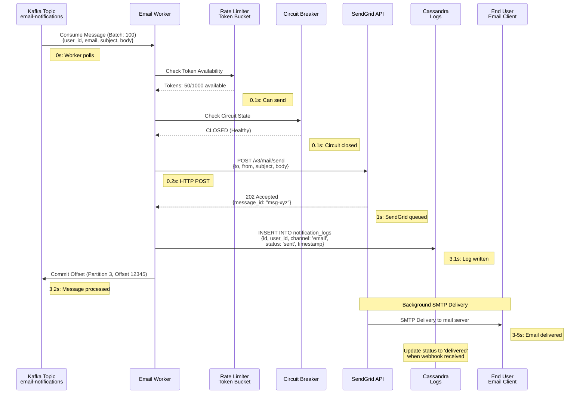
```mermaid
sequenceDiagram
    participant K as Kafka Topic<br/>email-notifications
    participant EW as Email Worker
    participant RL as Rate Limiter<br/>Token Bucket
    participant CB as Circuit Breaker
    participant SG as SendGrid API
    participant CS as Cassandra<br/>Logs
    participant U as End User<br/>Email Client
    K ->> EW: Consume Message (Batch: 100)<br/>{user_id, email, subject, body}
    Note right of K: 0s: Worker polls
    EW ->> RL: Check Token Availability
    RL -->> EW: Tokens: 50/1000 available
    Note right of RL: 0.1s: Can send
    EW ->> CB: Check Circuit State
    CB -->> EW: CLOSED (Healthy)
    Note right of CB: 0.1s: Circuit closed
    EW ->> SG: POST /v3/mail/send<br/>{to, from, subject, body}
    Note right of EW: 0.2s: HTTP POST
    SG -->> EW: 202 Accepted<br/>{message_id: "msg-xyz"}
    Note right of SG: 1s: SendGrid queued
    EW ->> CS: INSERT INTO notification_logs<br/>{id, user_id, channel: 'email',<br/>status: 'sent', timestamp}
    Note right of CS: 3.1s: Log written
    EW ->> K: Commit Offset (Partition 3, Offset 12345)
    Note right of K: 3.2s: Message processed
    Note over SG, U: Background SMTP Delivery
    SG ->> U: SMTP Delivery to mail server
    Note right of U: 3-5s: Email delivered
    Note over CS: Update status to 'delivered'<br/>when webhook received
```

---

## 3. SMS Notification Delivery

**Flow:**

Shows SMS notification delivery via Twilio API, including rate limiting to respect Twilio's 100 requests/second limit.

**Steps:**

1. **SMS Worker** (0s): Consumes message from Kafka (batch of 50)
2. **Rate Limiter** (0.05s): Token Bucket check (limit: 100 req/s for Twilio)
3. **Circuit Breaker** (0.05s): Verify Twilio is healthy (CLOSED state)
4. **API Call** (0.1s): POST to Twilio API with phone number and message
5. **Twilio Processing** (0.5s): Twilio returns 201 Created with message SID
6. **Cellular Network** (1.5s): Twilio sends SMS via carrier network
7. **Status Logging** (1.6s): Write to Cassandra with status 'sent'
8. **Delivery Confirmation** (2s): Twilio webhook confirms delivery
9. **Update Status** (2.1s): Update Cassandra log to 'delivered'

**Performance:**

- **API Call**: 500ms to Twilio
- **Total Delivery**: 1-3 seconds (cellular network latency)
- **Throughput**: 100 SMS/second per worker (Twilio limit)
- **Cost**: $0.0075 per SMS (varies by country)

**Rate Limiting:**

- **Twilio Limit**: 100 requests/second
- **Worker Strategy**: Token Bucket with 80 tokens/second (20% buffer)
- **Multiple Workers**: 5 workers × 80 req/s = 400 SMS/second total

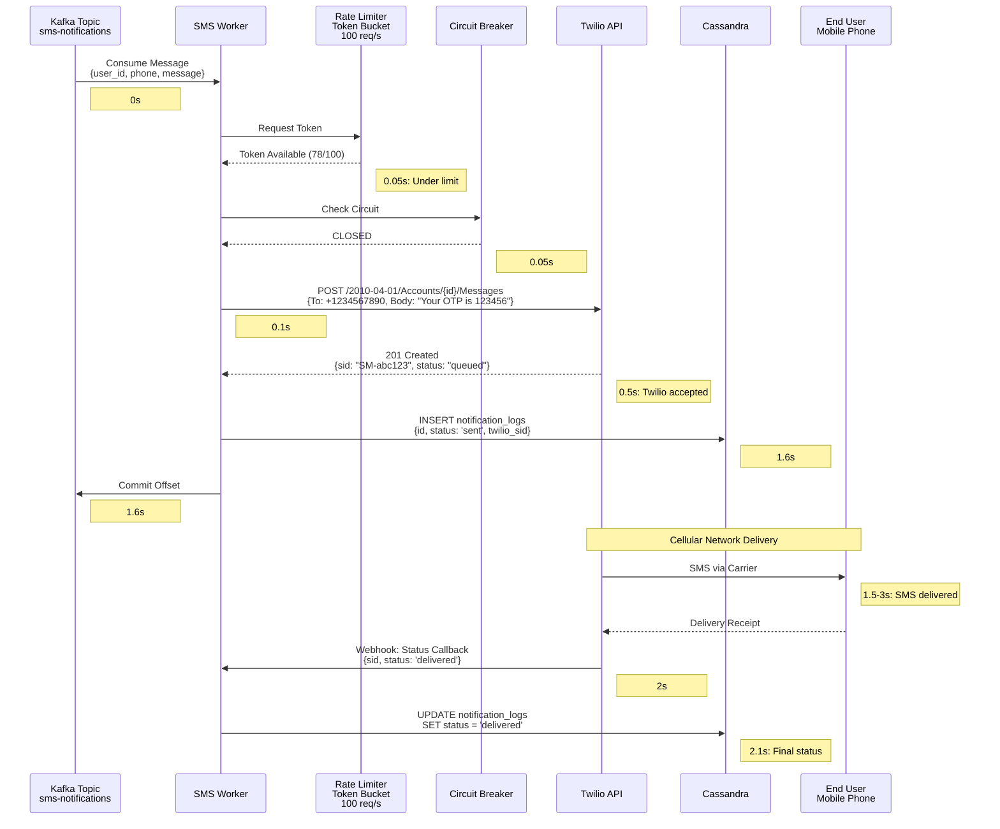
```mermaid
sequenceDiagram
    participant K as Kafka Topic<br/>sms-notifications
    participant SW as SMS Worker
    participant RL as Rate Limiter<br/>Token Bucket<br/>100 req/s
    participant CB as Circuit Breaker
    participant TW as Twilio API
    participant CS as Cassandra
    participant U as End User<br/>Mobile Phone
    K ->> SW: Consume Message<br/>{user_id, phone, message}
    Note right of K: 0s
    SW ->> RL: Request Token
    RL -->> SW: Token Available (78/100)
    Note right of RL: 0.05s: Under limit
    SW ->> CB: Check Circuit
    CB -->> SW: CLOSED
    Note right of CB: 0.05s
    SW ->> TW: POST /2010-04-01/Accounts/{id}/Messages<br/>{To: +1234567890, Body: "Your OTP is 123456"}
    Note right of SW: 0.1s
    TW -->> SW: 201 Created<br/>{sid: "SM-abc123", status: "queued"}
    Note right of TW: 0.5s: Twilio accepted
    SW ->> CS: INSERT notification_logs<br/>{id, status: 'sent', twilio_sid}
    Note right of CS: 1.6s
    SW ->> K: Commit Offset
    Note right of K: 1.6s
    Note over TW, U: Cellular Network Delivery
    TW ->> U: SMS via Carrier
    Note right of U: 1.5-3s: SMS delivered
    U -->> TW: Delivery Receipt
    TW ->> SW: Webhook: Status Callback<br/>{sid, status: 'delivered'}
    Note right of TW: 2s
    SW ->> CS: UPDATE notification_logs<br/>SET status = 'delivered'
    Note right of CS: 2.1s: Final status
```

---

## 4. Push Notification Delivery

**Flow:**

Shows push notification delivery to mobile devices via FCM (Android) and APNS (iOS), including batch processing and
device token handling.

**Steps:**

1. **Push Worker** (0s): Consumes messages from Kafka (batch of 200)
2. **Device Token Lookup** (0.1s): Query Redis for FCM/APNS tokens (cache hit)
3. **Batch Grouping** (0.2s): Group notifications by platform (iOS vs Android)
4. **Rate Limiter** (0.2s): Check token availability (FCM allows 3000 req/s)
5. **Circuit Breaker** (0.2s): Verify FCM/APNS are healthy
6. **Batch API Call** (0.3s): Send batch of 100 notifications to FCM
7. **FCM Processing** (1s): FCM returns success/failure for each device
8. **Device Delivery** (1.5s): FCM pushes to devices via persistent connection
9. **Status Logging** (1.6s): Write results to Cassandra (including failures)
10. **Token Cleanup** (1.7s): Remove invalid tokens from database

**Performance:**

- **Batch Size**: 100 notifications per API call
- **API Latency**: 1 second for batch
- **Total Delivery**: 1-2 seconds to device
- **Throughput**: 5000 push/second per worker (with batching)

**Error Handling:**

- **Invalid Token**: Remove from database, move to DLQ
- **Device Offline**: FCM queues for later delivery (up to 4 weeks)
- **Permanent Failure**: Notify app developer to update token

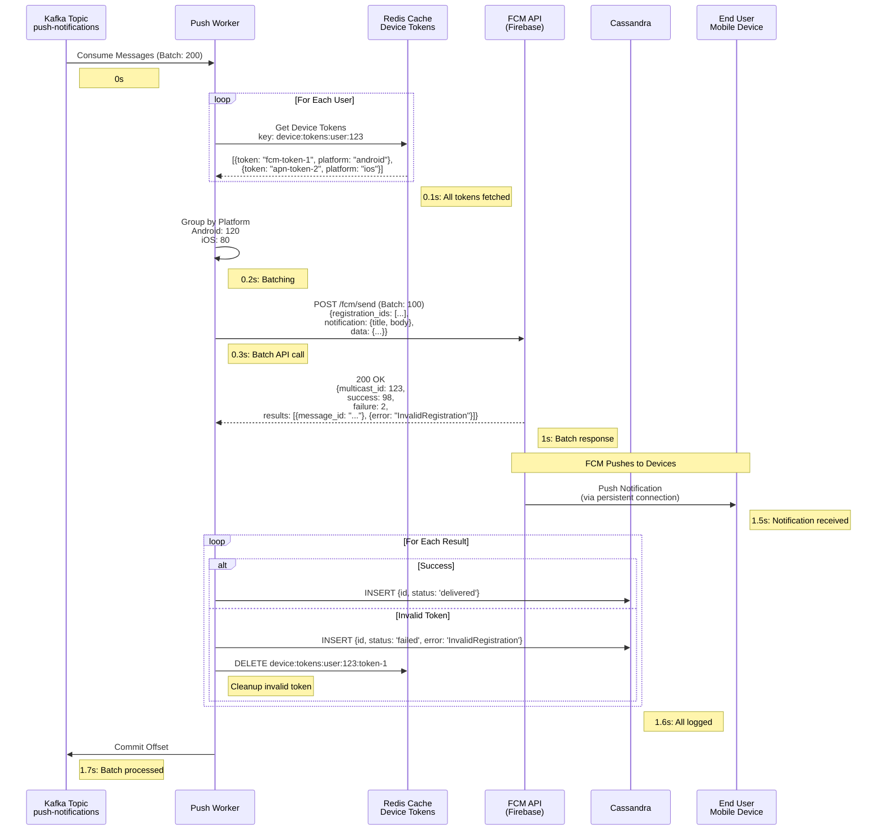
```mermaid
sequenceDiagram
    participant K as Kafka Topic<br/>push-notifications
    participant PW as Push Worker
    participant RC as Redis Cache<br/>Device Tokens
    participant FCM as FCM API<br/>(Firebase)
    participant CS as Cassandra
    participant D as End User<br/>Mobile Device
    K ->> PW: Consume Messages (Batch: 200)
    Note right of K: 0s

    loop For Each User
        PW ->> RC: Get Device Tokens<br/>key: device:tokens:user:123
        RC -->> PW: [{token: "fcm-token-1", platform: "android"},<br/>{token: "apn-token-2", platform: "ios"}]
    end
    Note right of RC: 0.1s: All tokens fetched
    PW ->> PW: Group by Platform<br/>Android: 120<br/>iOS: 80
    Note right of PW: 0.2s: Batching
    PW ->> FCM: POST /fcm/send (Batch: 100)<br/>{registration_ids: [...],<br/>notification: {title, body},<br/>data: {...}}
    Note right of PW: 0.3s: Batch API call
    FCM -->> PW: 200 OK<br/>{multicast_id: 123,<br/>success: 98,<br/>failure: 2,<br/>results: [{message_id: "..."}, {error: "InvalidRegistration"}]}
    Note right of FCM: 1s: Batch response
    Note over FCM, D: FCM Pushes to Devices
    FCM ->> D: Push Notification<br/>(via persistent connection)
    Note right of D: 1.5s: Notification received

    loop For Each Result
        alt Success
            PW ->> CS: INSERT {id, status: 'delivered'}
        else Invalid Token
            PW ->> CS: INSERT {id, status: 'failed', error: 'InvalidRegistration'}
            PW ->> RC: DELETE device:tokens:user:123:token-1
            Note right of PW: Cleanup invalid token
        end
    end
    Note right of CS: 1.6s: All logged
    PW ->> K: Commit Offset
    Note right of K: 1.7s: Batch processed
```

---

## 5. Web/WebSocket Notification Delivery

**Flow:**

Shows real-time in-app notification delivery via WebSocket persistent connection, including cross-server message routing
via Redis Pub/Sub.

**Steps:**

1. **Web Worker** (0s): Consumes message from Kafka topic
2. **Connection Lookup** (0.05s): Query Redis to find which WebSocket server holds user's connection
3. **Pub/Sub Publish** (0.1s): Publish message to Redis channel for that specific server
4. **Server Subscribe** (0.15s): WebSocket server receives message from Redis
5. **WebSocket Push** (0.2s): Server pushes notification through WebSocket connection
6. **Client Receives** (0.25s): Browser/mobile app receives notification
7. **Client ACK** (0.3s): Client sends acknowledgment back to server
8. **Status Logging** (0.35s): Server writes delivery status to Cassandra
9. **Worker Commit** (0.4s): Web worker commits Kafka offset

**Performance:**

- **End-to-End Latency**: <500ms (from Kafka to client)
- **WebSocket Latency**: <100ms (server to client)
- **Throughput**: 10,000 messages/second per WebSocket server
- **Concurrent Connections**: 10k per server, 10M total (1000 servers)

**Key Benefits:**

- Real-time delivery (<500ms)
- Bi-directional (can receive ACKs)
- Efficient (no repeated polling)
- Battery-friendly on mobile

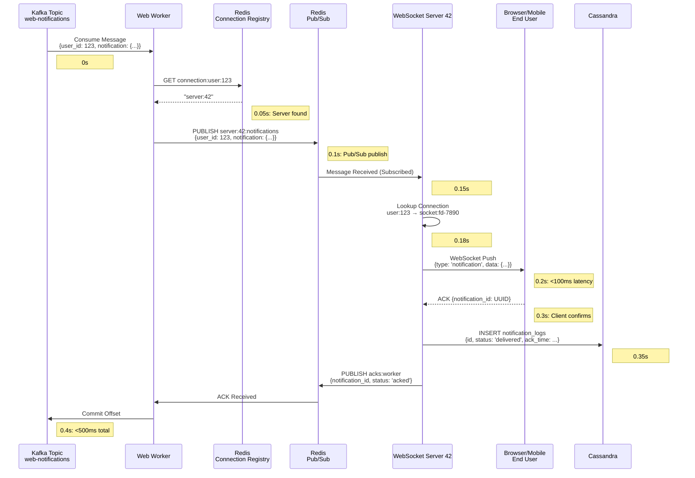
```mermaid
sequenceDiagram
    participant K as Kafka Topic<br/>web-notifications
    participant WW as Web Worker
    participant CR as Redis<br/>Connection Registry
    participant PS as Redis<br/>Pub/Sub
    participant WSS as WebSocket Server 42
    participant C as Browser/Mobile<br/>End User
    participant CS as Cassandra
    K ->> WW: Consume Message<br/>{user_id: 123, notification: {...}}
    Note right of K: 0s
    WW ->> CR: GET connection:user:123
    CR -->> WW: "server:42"
    Note right of CR: 0.05s: Server found
    WW ->> PS: PUBLISH server:42:notifications<br/>{user_id: 123, notification: {...}}
    Note right of PS: 0.1s: Pub/Sub publish
    PS ->> WSS: Message Received (Subscribed)
    Note right of WSS: 0.15s
    WSS ->> WSS: Lookup Connection<br/>user:123 → socket:fd-7890
    Note right of WSS: 0.18s
    WSS ->> C: WebSocket Push<br/>{type: 'notification', data: {...}}
    Note right of C: 0.2s: <100ms latency
    C -->> WSS: ACK {notification_id: UUID}
    Note right of C: 0.3s: Client confirms
    WSS ->> CS: INSERT notification_logs<br/>{id, status: 'delivered', ack_time: ...}
    Note right of CS: 0.35s
    WSS ->> PS: PUBLISH acks:worker<br/>{notification_id, status: 'acked'}
    PS ->> WW: ACK Received
    WW ->> K: Commit Offset
    Note right of K: 0.4s: <500ms total
```

---

## 6. Multi-Channel Notification Flow

**Flow:**

Shows how a single notification event is delivered across multiple channels (Email, Push, Web) in parallel based on user
preferences.

**Steps:**

1. **Notification Service** (0s): Processes order confirmation event
2. **Preference Lookup** (0.03s): User has email ✓, push ✓, web ✓, SMS ✗
3. **Kafka Publish** (0.06s): Publishes to 3 topics simultaneously
4. **Parallel Processing** (0-5s): Three workers consume and process independently
    - **Email Worker** → SendGrid (3-5s)
    - **Push Worker** → FCM (1-2s)
    - **Web Worker** → WebSocket (0.5s)
5. **User Experience**: User sees notification in app first (0.5s), push arrives second (1-2s), email last (3-5s)

**Performance:**

- **Fastest Channel**: Web (0.5s) - user sees in-app bell icon
- **Medium Channel**: Push (1-2s) - mobile notification
- **Slowest Channel**: Email (3-5s) - SMTP delivery
- **Total API Response**: 60ms (user doesn't wait)

**Key Benefits:**

- Parallel delivery (not sequential)
- User receives via fastest available channel first
- Redundancy (if push fails, email still works)
- Respects user preferences (SMS disabled)

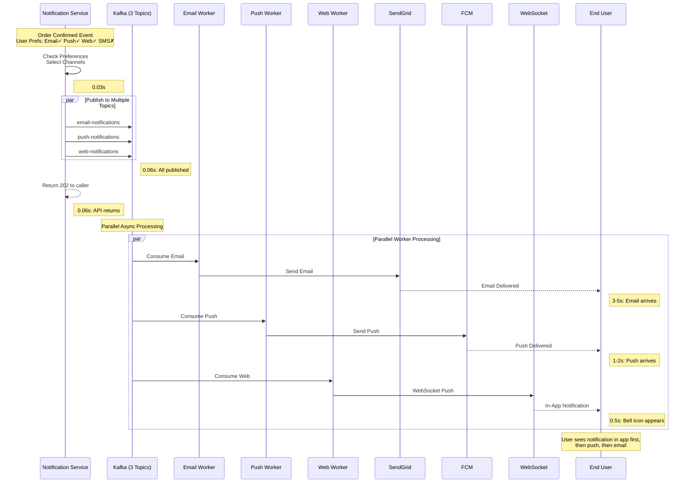
```mermaid
sequenceDiagram
    participant NS as Notification Service
    participant K as Kafka (3 Topics)
    participant EW as Email Worker
    participant PW as Push Worker
    participant WW as Web Worker
    participant SG as SendGrid
    participant FCM as FCM
    participant WSS as WebSocket
    participant U as End User
    Note over NS: Order Confirmed Event<br/>User Prefs: Email✓ Push✓ Web✓ SMS✗
    NS ->> NS: Check Preferences<br/>Select Channels
    Note right of NS: 0.03s

    par Publish to Multiple Topics
        NS ->> K: email-notifications
        NS ->> K: push-notifications
        NS ->> K: web-notifications
    end
    Note right of K: 0.06s: All published
    NS -->> NS: Return 202 to caller
    Note right of NS: 0.06s: API returns
    Note over K: Parallel Async Processing

    par Parallel Worker Processing
        K ->> EW: Consume Email
        EW ->> SG: Send Email
        SG -->> U: Email Delivered
        Note right of U: 3-5s: Email arrives
        K ->> PW: Consume Push
        PW ->> FCM: Send Push
        FCM -->> U: Push Delivered
        Note right of U: 1-2s: Push arrives
        K ->> WW: Consume Web
        WW ->> WSS: WebSocket Push
        WSS -->> U: In-App Notification
        Note right of U: 0.5s: Bell icon appears
    end

    Note over U: User sees notification in app first,<br/>then push, then email
```

---

## 7. Failure Scenario: Third-Party API Down

**Flow:**

Shows how the system handles a third-party provider outage (SendGrid down), including retry logic and circuit breaker.

**Steps:**

1. **Email Worker** (0s): Consumes message, attempts to send
2. **SendGrid API** (1s): Returns 503 Service Unavailable
3. **Retry Attempt 1** (2s): Exponential backoff (1 second delay)
4. **SendGrid API** (3s): Still returning 503
5. **Retry Attempt 2** (5s): Exponential backoff (2 second delay)
6. **SendGrid API** (6s): Still 503
7. **Retry Attempt 3** (10s): Exponential backoff (4 second delay)
8. **SendGrid API** (11s): Still 503 (5th consecutive failure)
9. **Circuit Breaker Opens** (11s): Circuit breaker detects pattern, opens circuit
10. **Fast Failure** (11s): Subsequent requests fail immediately without calling API
11. **Kafka Buffer** (11s+): Messages remain in Kafka (no data loss)
12. **Recovery Test** (71s): After 60 seconds, circuit breaker tests recovery
13. **SendGrid Recovered** (71s): Test request succeeds
14. **Circuit Closes** (71s): Resume normal processing
15. **Backlog Processing** (72s+): Workers process accumulated messages

**Performance:**

- **Detection Time**: <30 seconds (5 failures)
- **Recovery Time**: 60 seconds (circuit breaker timeout)
- **Message Loss**: 0 (all messages stay in Kafka)
- **Backlog**: Processed after recovery at normal rate

**Key Benefits:**

- **No Data Loss**: Kafka retains all messages
- **Fast Failure**: Don't waste time on failing API calls
- **Automatic Recovery**: System resumes when provider recovers
- **Resource Protection**: Don't overwhelm struggling provider

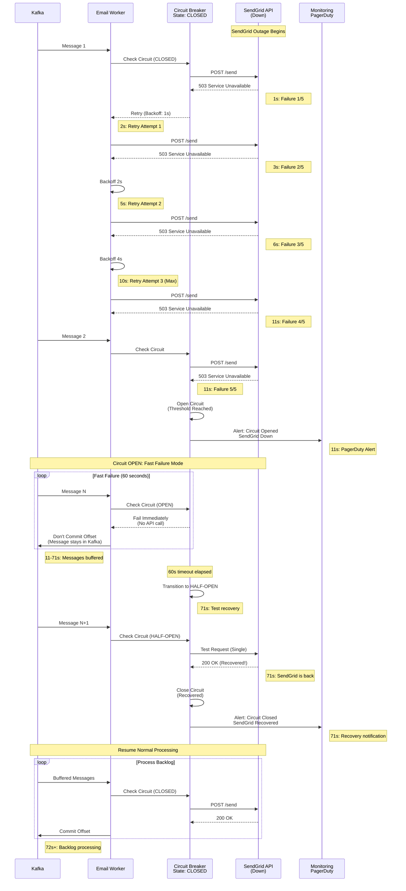
```mermaid
sequenceDiagram
    participant K as Kafka
    participant EW as Email Worker
    participant CB as Circuit Breaker<br/>State: CLOSED
    participant SG as SendGrid API<br/>(Down)
    participant M as Monitoring<br/>PagerDuty
    Note over SG: SendGrid Outage Begins
    K ->> EW: Message 1
    EW ->> CB: Check Circuit (CLOSED)
    CB ->> SG: POST /send
    SG -->> CB: 503 Service Unavailable
    Note right of SG: 1s: Failure 1/5
    CB -->> EW: Retry (Backoff: 1s)
    Note right of EW: 2s: Retry Attempt 1
    EW ->> SG: POST /send
    SG -->> EW: 503 Service Unavailable
    Note right of SG: 3s: Failure 2/5
    EW ->> EW: Backoff 2s
    Note right of EW: 5s: Retry Attempt 2
    EW ->> SG: POST /send
    SG -->> EW: 503 Service Unavailable
    Note right of SG: 6s: Failure 3/5
    EW ->> EW: Backoff 4s
    Note right of EW: 10s: Retry Attempt 3 (Max)
    EW ->> SG: POST /send
    SG -->> EW: 503 Service Unavailable
    Note right of SG: 11s: Failure 4/5
    K ->> EW: Message 2
    EW ->> CB: Check Circuit
    CB ->> SG: POST /send
    SG -->> CB: 503 Service Unavailable
    Note right of CB: 11s: Failure 5/5
    CB ->> CB: Open Circuit<br/>(Threshold Reached)
    CB ->> M: Alert: Circuit Opened<br/>SendGrid Down
    Note right of M: 11s: PagerDuty Alert
    Note over K, SG: Circuit OPEN: Fast Failure Mode

    loop Fast Failure (60 seconds)
        K ->> EW: Message N
        EW ->> CB: Check Circuit (OPEN)
        CB -->> EW: Fail Immediately<br/>(No API call)
        EW ->> K: Don't Commit Offset<br/>(Message stays in Kafka)
    end
    Note right of K: 11-71s: Messages buffered
    Note over CB: 60s timeout elapsed
    CB ->> CB: Transition to HALF-OPEN
    Note right of CB: 71s: Test recovery
    K ->> EW: Message N+1
    EW ->> CB: Check Circuit (HALF-OPEN)
    CB ->> SG: Test Request (Single)
    SG -->> CB: 200 OK (Recovered!)
    Note right of SG: 71s: SendGrid is back
    CB ->> CB: Close Circuit<br/>(Recovered)
    CB ->> M: Alert: Circuit Closed<br/>SendGrid Recovered
    Note right of M: 71s: Recovery notification
    Note over K, SG: Resume Normal Processing

    loop Process Backlog
        K ->> EW: Buffered Messages
        EW ->> CB: Check Circuit (CLOSED)
        CB ->> SG: POST /send
        SG -->> CB: 200 OK
        EW ->> K: Commit Offset
    end
    Note right of K: 72s+: Backlog processing
```

---

## 8. Failure Scenario: Device Token Invalid

**Flow:**

Shows how the system handles invalid or expired push notification device tokens, including cleanup and fallback to other
channels.

**Steps:**

1. **Push Worker** (0s): Consumes push notification message
2. **Device Token Lookup** (0.1s): Fetches FCM token from Redis
3. **FCM API Call** (0.3s): Attempts to send push notification
4. **FCM Error** (1s): Returns error "InvalidRegistration" (token expired/uninstalled)
5. **Token Cleanup** (1.1s): Worker removes invalid token from database
6. **DLQ Publish** (1.2s): Moves message to Dead Letter Queue
7. **Fallback Trigger** (1.3s): System triggers fallback notification via email
8. **Email Delivery** (4s): User receives email instead of push
9. **Status Logging** (4.1s): Log failed push + successful email fallback

**Performance:**

- **Detection**: 1 second (FCM returns error immediately)
- **Cleanup**: 100ms (remove from Redis and PostgreSQL)
- **Fallback**: 3 seconds (email delivery)
- **User Impact**: Still receives notification, just different channel

**Key Benefits:**

- Automatic token cleanup (database stays clean)
- Graceful degradation (fallback to email)
- User still receives notification
- DLQ for auditing and analysis

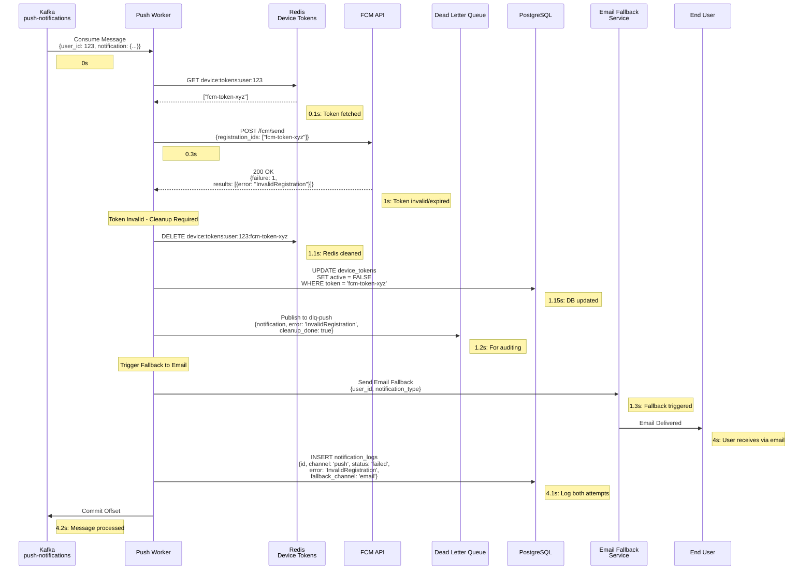
```mermaid
sequenceDiagram
    participant K as Kafka<br/>push-notifications
    participant PW as Push Worker
    participant RC as Redis<br/>Device Tokens
    participant FCM as FCM API
    participant DLQ as Dead Letter Queue
    participant PG as PostgreSQL
    participant EM as Email Fallback<br/>Service
    participant U as End User
    K ->> PW: Consume Message<br/>{user_id: 123, notification: {...}}
    Note right of K: 0s
    PW ->> RC: GET device:tokens:user:123
    RC -->> PW: ["fcm-token-xyz"]
    Note right of RC: 0.1s: Token fetched
    PW ->> FCM: POST /fcm/send<br/>{registration_ids: ["fcm-token-xyz"]}
    Note right of PW: 0.3s
    FCM -->> PW: 200 OK<br/>{failure: 1,<br/>results: [{error: "InvalidRegistration"}]}
    Note right of FCM: 1s: Token invalid/expired
    Note over PW: Token Invalid - Cleanup Required
    PW ->> RC: DELETE device:tokens:user:123:fcm-token-xyz
    Note right of RC: 1.1s: Redis cleaned
    PW ->> PG: UPDATE device_tokens<br/>SET active = FALSE<br/>WHERE token = 'fcm-token-xyz'
    Note right of PG: 1.15s: DB updated
    PW ->> DLQ: Publish to dlq-push<br/>{notification, error: 'InvalidRegistration',<br/>cleanup_done: true}
    Note right of DLQ: 1.2s: For auditing
    Note over PW: Trigger Fallback to Email
    PW ->> EM: Send Email Fallback<br/>{user_id, notification_type}
    Note right of EM: 1.3s: Fallback triggered
    EM ->> U: Email Delivered
    Note right of U: 4s: User receives via email
    PW ->> PG: INSERT notification_logs<br/>{id, channel: 'push', status: 'failed',<br/>error: 'InvalidRegistration',<br/>fallback_channel: 'email'}
    Note right of PG: 4.1s: Log both attempts
    PW ->> K: Commit Offset
    Note right of K: 4.2s: Message processed
```

---

## 9. Failure Scenario: Rate Limit Exceeded

**Flow:**

Shows how the Token Bucket rate limiter prevents exceeding third-party API limits (e.g., Twilio's 100 SMS/second limit).

**Steps:**

1. **SMS Worker** (0s): Consumes 150 messages from Kafka (burst)
2. **Rate Limiter** (0s): Token Bucket has 100 tokens available
3. **First 100 Messages** (0-1s): Processed successfully (tokens consumed)
4. **Token Bucket Empty** (1s): No tokens available
5. **Remaining 50 Messages** (1s): Worker waits for token refill
6. **Token Refill** (2s): Bucket refills at 100 tokens/second
7. **Resume Processing** (2s): Process remaining 50 messages
8. **All Messages Processed** (2.5s): No messages lost, just delayed

**Performance:**

- **Max Rate**: 100 SMS/second (Twilio limit)
- **Burst Handling**: Can accept bursts, smooths them out
- **Delay**: Extra 1 second for messages exceeding limit
- **Message Loss**: 0 (all messages processed, just rate-limited)

**Key Benefits:**

- Prevents API blocking from provider
- Smooth traffic instead of rejecting requests
- No message loss (buffered, not dropped)
- Configurable limits per provider

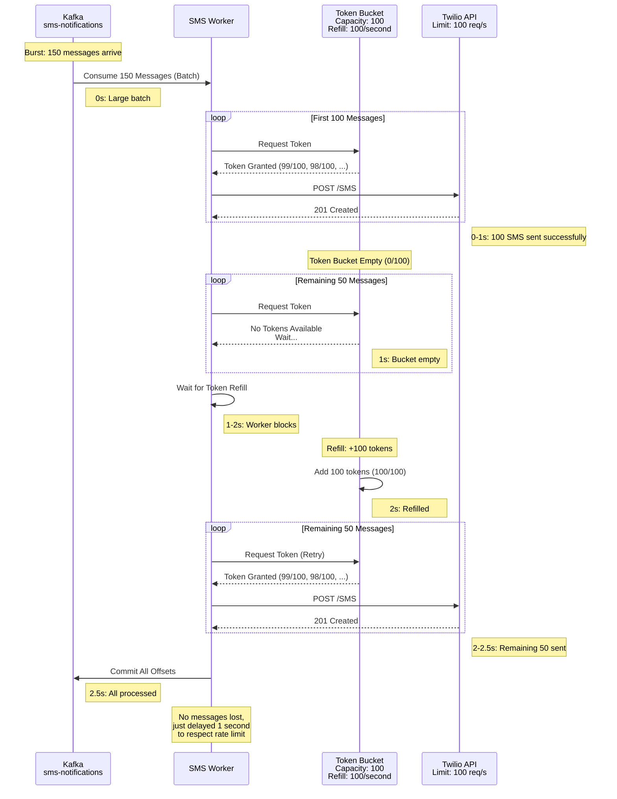
```mermaid
sequenceDiagram
    participant K as Kafka<br/>sms-notifications
    participant SW as SMS Worker
    participant TB as Token Bucket<br/>Capacity: 100<br/>Refill: 100/second
    participant TW as Twilio API<br/>Limit: 100 req/s
    Note over K: Burst: 150 messages arrive
    K ->> SW: Consume 150 Messages (Batch)
    Note right of K: 0s: Large batch

    loop First 100 Messages
        SW ->> TB: Request Token
        TB -->> SW: Token Granted (99/100, 98/100, ...)
        SW ->> TW: POST /SMS
        TW -->> SW: 201 Created
    end
    Note right of TW: 0-1s: 100 SMS sent successfully
    Note over TB: Token Bucket Empty (0/100)

    loop Remaining 50 Messages
        SW ->> TB: Request Token
        TB -->> SW: No Tokens Available<br/>Wait...
        Note right of TB: 1s: Bucket empty
    end

    SW ->> SW: Wait for Token Refill
    Note right of SW: 1-2s: Worker blocks
    Note over TB: Refill: +100 tokens
    TB ->> TB: Add 100 tokens (100/100)
    Note right of TB: 2s: Refilled

    loop Remaining 50 Messages
        SW ->> TB: Request Token (Retry)
        TB -->> SW: Token Granted (99/100, 98/100, ...)
        SW ->> TW: POST /SMS
        TW -->> SW: 201 Created
    end
    Note right of TW: 2-2.5s: Remaining 50 sent
    SW ->> K: Commit All Offsets
    Note right of K: 2.5s: All processed
    Note over SW: No messages lost,<br/>just delayed 1 second<br/>to respect rate limit
```

---

## 10. Circuit Breaker Opening Flow

**Flow:**

Shows the circuit breaker transitioning from CLOSED → OPEN state after detecting repeated failures from a third-party
API.

**Steps:**

1. **Normal Operation** (0s): Circuit breaker in CLOSED state, success rate 99%
2. **Provider Degradation** (10s): SendGrid starts having issues, latency increases
3. **Failure 1** (15s): First request times out after 5 seconds
4. **Failure 2** (20s): Second request returns 503
5. **Failure 3** (25s): Third request times out
6. **Failure 4** (30s): Fourth request returns 503
7. **Failure 5** (35s): Fifth consecutive failure (threshold reached)
8. **Circuit Opens** (35s): Circuit breaker transitions to OPEN state
9. **Alert Triggered** (35s): PagerDuty alert sent to on-call engineer
10. **Fast Failure Mode** (35-95s): All subsequent requests fail immediately
11. **Test Recovery** (95s): After 60 seconds, circuit transitions to HALF-OPEN
12. **Test Request** (95s): Single request sent to test if provider recovered
13. **Provider Still Down** (96s): Test request fails, circuit returns to OPEN
14. **Repeat Test** (156s): Test again after another 60 seconds
15. **Provider Recovered** (156s): Test succeeds, circuit transitions to CLOSED

**Configuration:**

- **Failure Threshold**: 5 consecutive failures
- **Timeout**: 60 seconds before testing recovery
- **Test Request**: 1 request in HALF-OPEN state
- **Success Threshold**: 3 consecutive successes to fully recover

**Key Benefits:**

- Fast failure detection (35 seconds)
- Automatic recovery testing (no manual intervention)
- Resource protection (stop calling failing API)
- Clear alerting (engineers notified immediately)

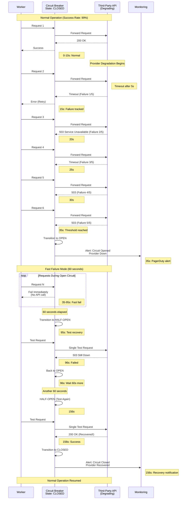
```mermaid
sequenceDiagram
    participant W as Worker
    participant CB as Circuit Breaker<br/>State: CLOSED
    participant API as Third-Party API<br/>(Degrading)
    participant M as Monitoring
    Note over W, API: Normal Operation (Success Rate: 99%)
    W ->> CB: Request 1
    CB ->> API: Forward Request
    API -->> CB: 200 OK
    CB -->> W: Success
    Note right of CB: 0-10s: Normal
    Note over API: Provider Degradation Begins
    W ->> CB: Request 2
    CB ->> API: Forward Request
    Note right of API: Timeout after 5s
    API -->> CB: Timeout (Failure 1/5)
    CB -->> W: Error (Retry)
    Note right of CB: 15s: Failure tracked
    W ->> CB: Request 3
    CB ->> API: Forward Request
    API -->> CB: 503 Service Unavailable (Failure 2/5)
    Note right of CB: 20s
    W ->> CB: Request 4
    CB ->> API: Forward Request
    API -->> CB: Timeout (Failure 3/5)
    Note right of CB: 25s
    W ->> CB: Request 5
    CB ->> API: Forward Request
    API -->> CB: 503 (Failure 4/5)
    Note right of CB: 30s
    W ->> CB: Request 6
    CB ->> API: Forward Request
    API -->> CB: 503 (Failure 5/5)
    Note right of CB: 35s: Threshold reached
    CB ->> CB: Transition to OPEN
    CB ->> M: Alert: Circuit Opened<br/>Provider Down
    Note right of M: 35s: PagerDuty alert
    Note over W, API: Fast Failure Mode (60 seconds)

    loop Requests During Open Circuit
        W ->> CB: Request N
        CB -->> W: Fail Immediately<br/>(No API call)
        Note right of CB: 35-95s: Fast fail
    end

    Note over CB: 60 seconds elapsed
    CB ->> CB: Transition to HALF-OPEN
    Note right of CB: 95s: Test recovery
    W ->> CB: Test Request
    CB ->> API: Single Test Request
    API -->> CB: 503 Still Down
    Note right of CB: 96s: Failed
    CB ->> CB: Back to OPEN
    Note right of CB: 96s: Wait 60s more
    Note over CB: Another 60 seconds
    CB ->> CB: HALF-OPEN (Test Again)
    Note right of CB: 156s
    W ->> CB: Test Request
    CB ->> API: Single Test Request
    API -->> CB: 200 OK (Recovered!)
    Note right of CB: 156s: Success
    CB ->> CB: Transition to CLOSED
    CB ->> M: Alert: Circuit Closed<br/>Provider Recovered
    Note right of M: 156s: Recovery notification
    Note over W, API: Normal Operation Resumed
```

---

## 11. Dead Letter Queue Flow

**Flow:**

Shows how messages that fail after max retries are moved to the Dead Letter Queue for investigation and potential
reprocessing.

**Steps:**

1. **Email Worker** (0s): Consumes message, attempts to send
2. **Attempt 1** (1s): SendGrid returns 4xx error (permanent failure)
3. **Retry Logic** (1s): 4xx errors typically indicate permanent failure (e.g., invalid email)
4. **Attempt 2** (2s): Retry anyway (configured max retries: 3)
5. **Attempt 3** (4s): Still failing with same 4xx error
6. **Max Retries Exceeded** (4s): Worker exhausts all retry attempts
7. **Move to DLQ** (4.1s): Publish message to dlq-email topic
8. **DLQ Consumer** (4.2s): DLQ consumer writes to DLQ storage
9. **Alert Triggered** (4.3s): If DLQ count exceeds threshold (10k), alert sent
10. **Investigation** (minutes later): Engineer investigates root cause
11. **Fix Applied** (hours/days later): Fix issue (e.g., whitelist email domain)
12. **Reprocess** (after fix): Replay messages from DLQ back to main topic
13. **Successful Delivery** (after replay): Previously failed messages now succeed

**Common DLQ Reasons:**

- **Invalid Email**: Email address doesn't exist or domain doesn't accept mail
- **Expired Token**: Device token no longer valid
- **Rate Limit**: Third-party quota exceeded
- **Content Blocked**: Spam filters or content policy violations

**DLQ Management:**

- **Retention**: Keep DLQ messages for 30 days
- **Monitoring**: Alert if >10k messages or >24 hours old
- **Replay**: Manual or automated replay after fixing issues
- **Discard**: Permanently discard unfixable messages

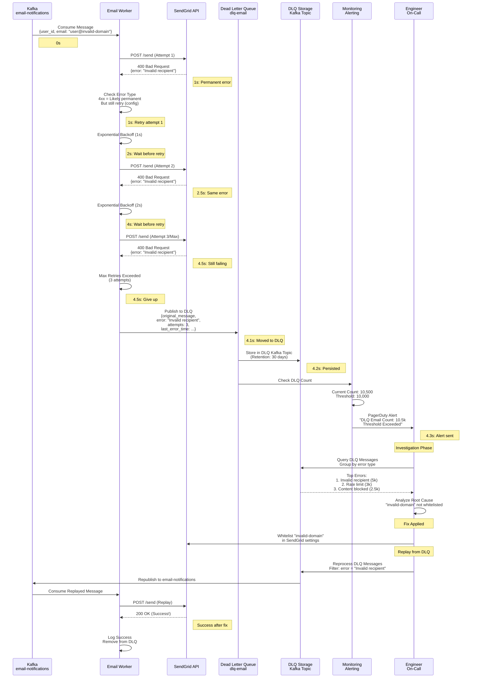
```mermaid
sequenceDiagram
    participant K as Kafka<br/>email-notifications
    participant EW as Email Worker
    participant SG as SendGrid API
    participant DLQ as Dead Letter Queue<br/>dlq-email
    participant DLQS as DLQ Storage<br/>Kafka Topic
    participant M as Monitoring<br/>Alerting
    participant ENG as Engineer<br/>On-Call
    K ->> EW: Consume Message<br/>{user_id, email: "user@invalid-domain"}
    Note right of K: 0s
    EW ->> SG: POST /send (Attempt 1)
    SG -->> EW: 400 Bad Request<br/>{error: "Invalid recipient"}
    Note right of SG: 1s: Permanent error
    EW ->> EW: Check Error Type<br/>4xx = Likely permanent<br/>But still retry (config)
    Note right of EW: 1s: Retry attempt 1
    EW ->> EW: Exponential Backoff (1s)
    Note right of EW: 2s: Wait before retry
    EW ->> SG: POST /send (Attempt 2)
    SG -->> EW: 400 Bad Request<br/>{error: "Invalid recipient"}
    Note right of SG: 2.5s: Same error
    EW ->> EW: Exponential Backoff (2s)
    Note right of EW: 4s: Wait before retry
    EW ->> SG: POST /send (Attempt 3/Max)
    SG -->> EW: 400 Bad Request<br/>{error: "Invalid recipient"}
    Note right of SG: 4.5s: Still failing
    EW ->> EW: Max Retries Exceeded<br/>(3 attempts)
    Note right of EW: 4.5s: Give up
    EW ->> DLQ: Publish to DLQ<br/>{original_message,<br/>error: "Invalid recipient",<br/>attempts: 3,<br/>last_error_time: ...}
    Note right of DLQ: 4.1s: Moved to DLQ
    DLQ ->> DLQS: Store in DLQ Kafka Topic<br/>(Retention: 30 days)
    Note right of DLQS: 4.2s: Persisted
    DLQ ->> M: Check DLQ Count
    M ->> M: Current Count: 10,500<br/>Threshold: 10,000
    M ->> ENG: PagerDuty Alert<br/>"DLQ Email Count: 10.5k<br/>Threshold Exceeded"
    Note right of ENG: 4.3s: Alert sent
    Note over ENG: Investigation Phase
    ENG ->> DLQS: Query DLQ Messages<br/>Group by error type
    DLQS -->> ENG: Top Errors:<br/>1. Invalid recipient (5k)<br/>2. Rate limit (3k)<br/>3. Content blocked (2.5k)
    ENG ->> ENG: Analyze Root Cause<br/>"invalid-domain" not whitelisted
    Note over ENG: Fix Applied
    ENG ->> SG: Whitelist "invalid-domain"<br/>in SendGrid settings
    Note over ENG: Replay from DLQ
    ENG ->> DLQS: Reprocess DLQ Messages<br/>Filter: error = "Invalid recipient"
    DLQS ->> K: Republish to email-notifications
    K ->> EW: Consume Replayed Message
    EW ->> SG: POST /send (Replay)
    SG -->> EW: 200 OK (Success!)
    Note right of SG: Success after fix
    EW ->> EW: Log Success<br/>Remove from DLQ
```

---

## 12. Idempotency Handling (Duplicate Request)

**Flow:**

Shows how the system prevents duplicate notifications when the same event is triggered multiple times (e.g., user
double-clicks submit button).

**Steps:**

1. **Order Service** (0s): Order completed, sends notification request
2. **API Gateway** (10ms): Forwards to Notification Service
3. **Idempotency Check** (20ms): Queries Redis for idempotency key `order-789-confirmation`
4. **Key Not Found** (25ms): First time seeing this key, proceed with processing
5. **Store Key** (30ms): Store in Redis with TTL 24 hours
6. **Process Notification** (60ms): Normal flow, publishes to Kafka
7. **Return 202** (60ms): Success response to Order Service
8. **Duplicate Request** (5s later): Order Service retries due to network timeout (didn't receive first response)
9. **API Gateway** (5.01s): Forwards duplicate request
10. **Idempotency Check** (5.02s): Queries Redis, finds existing key
11. **Return 200** (5.03s): Immediately returns success without reprocessing
12. **No Duplicate Notification**: User receives only one notification

**Performance:**

- **Idempotency Check**: <5ms (Redis lookup)
- **Storage Overhead**: 100 bytes per key × 1M requests/day = 100MB/day
- **TTL**: 24 hours (safe window for retries)
- **Hit Rate**: ~10% of requests are duplicates (based on typical retry patterns)

**Key Benefits:**

- Prevents duplicate notifications from retries
- Fast idempotency check (<5ms)
- Safe for client retries
- Configurable TTL based on use case

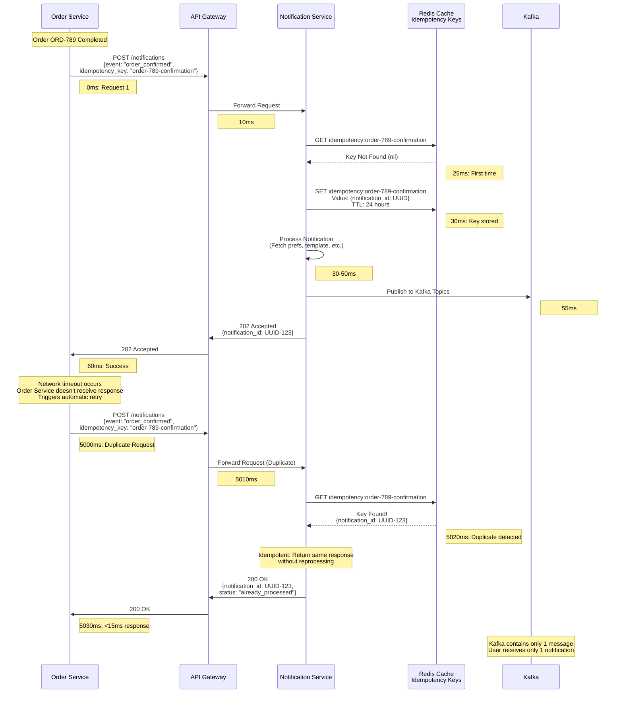
```mermaid
sequenceDiagram
    participant OS as Order Service
    participant AG as API Gateway
    participant NS as Notification Service
    participant RC as Redis Cache<br/>Idempotency Keys
    participant K as Kafka
    Note over OS: Order ORD-789 Completed
    OS ->> AG: POST /notifications<br/>{event: "order_confirmed",<br/>idempotency_key: "order-789-confirmation"}
    Note right of OS: 0ms: Request 1
    AG ->> NS: Forward Request
    Note right of AG: 10ms
    NS ->> RC: GET idempotency:order-789-confirmation
    RC -->> NS: Key Not Found (nil)
    Note right of RC: 25ms: First time
    NS ->> RC: SET idempotency:order-789-confirmation<br/>Value: {notification_id: UUID}<br/>TTL: 24 hours
    Note right of RC: 30ms: Key stored
    NS ->> NS: Process Notification<br/>(Fetch prefs, template, etc.)
    Note right of NS: 30-50ms
    NS ->> K: Publish to Kafka Topics
    Note right of K: 55ms
    NS ->> AG: 202 Accepted<br/>{notification_id: UUID-123}
    AG ->> OS: 202 Accepted
    Note right of OS: 60ms: Success
    Note over OS: Network timeout occurs<br/>Order Service doesn't receive response<br/>Triggers automatic retry
    OS ->> AG: POST /notifications<br/>{event: "order_confirmed",<br/>idempotency_key: "order-789-confirmation"}
    Note right of OS: 5000ms: Duplicate Request
    AG ->> NS: Forward Request (Duplicate)
    Note right of AG: 5010ms
    NS ->> RC: GET idempotency:order-789-confirmation
    RC -->> NS: Key Found!<br/>{notification_id: UUID-123}
    Note right of RC: 5020ms: Duplicate detected
    Note over NS: Idempotent: Return same response<br/>without reprocessing
    NS ->> AG: 200 OK<br/>{notification_id: UUID-123,<br/>status: "already_processed"}
    AG ->> OS: 200 OK
    Note right of OS: 5030ms: <15ms response
    Note over K: Kafka contains only 1 message<br/>User receives only 1 notification
```

---

## 13. Cache Miss Flow

**Flow:**

Shows what happens when Redis cache doesn't have the requested data, requiring a fallback to PostgreSQL database.

**Steps:**

1. **Notification Service** (0ms): Receives notification request
2. **Cache Lookup** (10ms): Query Redis for user preferences key `user:prefs:123`
3. **Cache Miss** (15ms): Redis returns nil (key not found or expired)
4. **Database Query** (20ms): Fallback to PostgreSQL to fetch preferences
5. **Database Response** (50ms): PostgreSQL returns user preferences (30ms query time)
6. **Update Cache** (55ms): Write preferences to Redis with 5-minute TTL
7. **Continue Processing** (60ms): Use fetched preferences for notification processing
8. **Return Response** (120ms): Slightly higher latency than cache hit (60ms vs 120ms)

**Performance Comparison:**

| Scenario       | Latency | Cache Hit Rate |
|----------------|---------|----------------|
| **Cache Hit**  | 60ms    | 98%            |
| **Cache Miss** | 120ms   | 2%             |
| **Average**    | 61.2ms  | -              |

**Cache Warming:**

- **On User Update**: Immediately update cache when user changes preferences
- **On First Access**: Populate cache on first request (cache miss)
- **Proactive Warming**: Background job to pre-populate cache for active users

**Key Benefits:**

- Graceful degradation (still works on cache miss)
- Automatic cache population (lazy loading)
- Reduced database load (98% requests hit cache)
- Acceptable latency on cache miss (120ms vs 60ms)

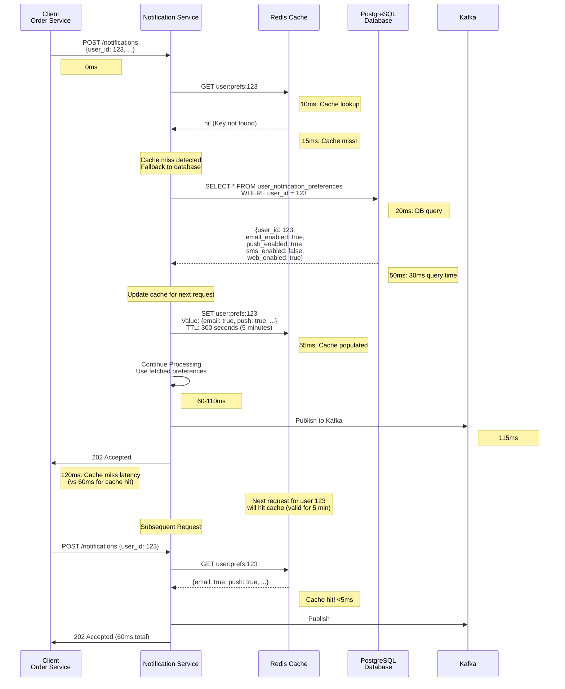
```mermaid
sequenceDiagram
    participant C as Client<br/>Order Service
    participant NS as Notification Service
    participant RC as Redis Cache
    participant PG as PostgreSQL<br/>Database
    participant K as Kafka
    C ->> NS: POST /notifications<br/>{user_id: 123, ...}
    Note right of C: 0ms
    NS ->> RC: GET user:prefs:123
    Note right of RC: 10ms: Cache lookup
    RC -->> NS: nil (Key not found)
    Note right of RC: 15ms: Cache miss!
    Note over NS: Cache miss detected<br/>Fallback to database
    NS ->> PG: SELECT * FROM user_notification_preferences<br/>WHERE user_id = 123
    Note right of PG: 20ms: DB query
    PG -->> NS: {user_id: 123,<br/>email_enabled: true,<br/>push_enabled: true,<br/>sms_enabled: false,<br/>web_enabled: true}
    Note right of PG: 50ms: 30ms query time
    Note over NS: Update cache for next request
    NS ->> RC: SET user:prefs:123<br/>Value: {email: true, push: true, ...}<br/>TTL: 300 seconds (5 minutes)
    Note right of RC: 55ms: Cache populated
    NS ->> NS: Continue Processing<br/>Use fetched preferences
    Note right of NS: 60-110ms
    NS ->> K: Publish to Kafka
    Note right of K: 115ms
    NS ->> C: 202 Accepted
    Note right of C: 120ms: Cache miss latency<br/>(vs 60ms for cache hit)
    Note over RC: Next request for user 123<br/>will hit cache (valid for 5 min)
    Note over NS: Subsequent Request
    C ->> NS: POST /notifications {user_id: 123}
    NS ->> RC: GET user:prefs:123
    RC -->> NS: {email: true, push: true, ...}
    Note right of RC: Cache hit! <5ms
    NS ->> K: Publish
    NS ->> C: 202 Accepted (60ms total)
```

---

## 14. WebSocket Reconnection Flow

**Flow:**

Shows how the system handles WebSocket connection drops and automatic reconnection, including message buffering during
disconnection.

**Steps:**

1. **Normal Operation** (0s): Client connected to WebSocket server, receiving notifications
2. **Connection Drop** (10s): Network issue causes WebSocket connection to drop
3. **Heartbeat Miss** (15s): Server detects 3 missed heartbeats (5s each)
4. **Connection Cleanup** (15s): Server removes connection from Redis registry
5. **Notification Arrives** (16s): New notification arrives while client is disconnected
6. **Fallback Storage** (16s): System stores notification in database for later retrieval
7. **Client Reconnect** (20s): Client detects disconnection, attempts to reconnect
8. **Reconnection** (21s): New WebSocket connection established with same server (sticky session)
9. **Missed Messages Query** (22s): Client requests missed notifications (last_received_id)
10. **Retrieve from DB** (23s): Server queries database for missed notifications
11. **Bulk Delivery** (24s): Server sends all missed notifications at once
12. **Resume Real-Time** (24s+): Connection returns to normal operation

**Performance:**

- **Reconnection Time**: <5 seconds (exponential backoff)
- **Message Loss**: 0 (all messages stored in DB)
- **Missed Message Retrieval**: <2 seconds
- **Downtime**: 10 seconds (from drop to reconnection)

**Key Benefits:**

- No message loss (fallback to database)
- Automatic reconnection (no user action)
- Bulk delivery of missed messages
- Seamless resume of real-time updates

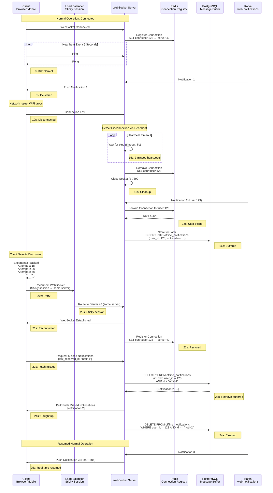
```mermaid
sequenceDiagram
    participant C as Client<br/>Browser/Mobile
    participant LB as Load Balancer<br/>Sticky Session
    participant WSS as WebSocket Server
    participant RC as Redis<br/>Connection Registry
    participant DB as PostgreSQL<br/>Message Buffer
    participant K as Kafka<br/>web-notifications
    Note over C, WSS: Normal Operation: Connected
    C ->> WSS: WebSocket Connected
    WSS ->> RC: Register Connection<br/>SET conn:user:123 → server:42

    loop Heartbeat Every 5 Seconds
        C ->> WSS: Ping
        WSS ->> C: Pong
    end
    Note right of C: 0-10s: Normal
    K ->> WSS: Notification 1
    WSS ->> C: Push Notification 1
    Note right of C: 5s: Delivered
    Note over C: Network Issue: WiFi drops
    C -x WSS: Connection Lost
    Note right of C: 10s: Disconnected
    Note over WSS: Detect Disconnection via Heartbeat

    loop Heartbeat Timeout
        WSS ->> WSS: Wait for ping (timeout: 5s)
        Note right of WSS: 15s: 3 missed heartbeats
    end

    WSS ->> RC: Remove Connection<br/>DEL conn:user:123
    WSS ->> WSS: Close Socket fd-7890
    Note right of WSS: 15s: Cleanup
    K ->> WSS: Notification 2 (User 123)
    WSS ->> RC: Lookup Connection for user:123
    RC -->> WSS: Not Found
    Note right of RC: 16s: User offline
    WSS ->> DB: Store for Later<br/>INSERT INTO offline_notifications<br/>{user_id: 123, notification: ...}
    Note right of DB: 16s: Buffered
    Note over C: Client Detects Disconnect
    C ->> C: Exponential Backoff<br/>Attempt 1: 1s<br/>Attempt 2: 2s<br/>Attempt 3: 4s
    C ->> LB: Reconnect WebSocket<br/>(Sticky session → same server)
    Note right of C: 20s: Retry
    LB ->> WSS: Route to Server 42 (same server)
    Note right of LB: 20s: Sticky session
    WSS ->> C: WebSocket Established
    Note right of C: 21s: Reconnected
    WSS ->> RC: Register Connection<br/>SET conn:user:123 → server:42
    Note right of RC: 21s: Restored
    C ->> WSS: Request Missed Notifications<br/>{last_received_id: "notif-1"}
    Note right of C: 22s: Fetch missed
    WSS ->> DB: SELECT * FROM offline_notifications<br/>WHERE user_id = 123<br/>AND id > "notif-1"
    DB -->> WSS: [Notification 2, ...]
    Note right of DB: 23s: Retrieve buffered
    WSS ->> C: Bulk Push Missed Notifications<br/>[Notification 2]
    Note right of C: 24s: Caught up
    WSS ->> DB: DELETE FROM offline_notifications<br/>WHERE user_id = 123 AND id <= "notif-2"
    Note right of DB: 24s: Cleanup
    Note over C, WSS: Resumed Normal Operation
    K ->> WSS: Notification 3
    WSS ->> C: Push Notification 3 (Real-Time)
    Note right of C: 25s: Real-time resumed
```

---

## 15. Cross-Region Notification Flow

**Flow:**

Shows how notifications are delivered in a multi-region deployment, including geo-routing and regional data residency
compliance.

**Steps:**

1. **Event Source** (0ms): EU-based Order Service triggers notification
2. **Geo DNS** (10ms): Route53 directs to EU region based on source IP
3. **EU Load Balancer** (20ms): Routes to EU Notification Service
4. **EU Notification Service** (30ms): Processes request using EU resources
5. **EU Redis** (35ms): Fetch user preferences from EU cache
6. **EU PostgreSQL Replica** (40ms): Fallback to local database replica
7. **EU Kafka** (60ms): Publish to EU Kafka cluster
8. **EU Workers** (1-5s): EU workers deliver notifications
9. **EU Cassandra** (5s): Log to EU Cassandra cluster (GDPR compliance)
10. **Cross-Region Sync** (background): Replicate user preferences to US/APAC (eventual consistency)

**Regional Architecture:**

- **3 Regions**: US-East, EU-West, APAC-Singapore
- **Data Residency**: Logs stay in user's region (GDPR)
- **Preference Replication**: PostgreSQL master-slave across regions
- **Regional Kafka**: Separate Kafka cluster per region

**Performance:**

- **Intra-Region Latency**: <50ms (same region)
- **Cross-Region Latency**: 100-300ms (only for reads, not critical path)
- **Availability**: 99.99% per region (independent failure domains)

**Key Benefits:**

- GDPR compliance (data residency)
- Low latency (serve from nearest region)
- Regional failover (isolated failures)
- Independent scaling per region

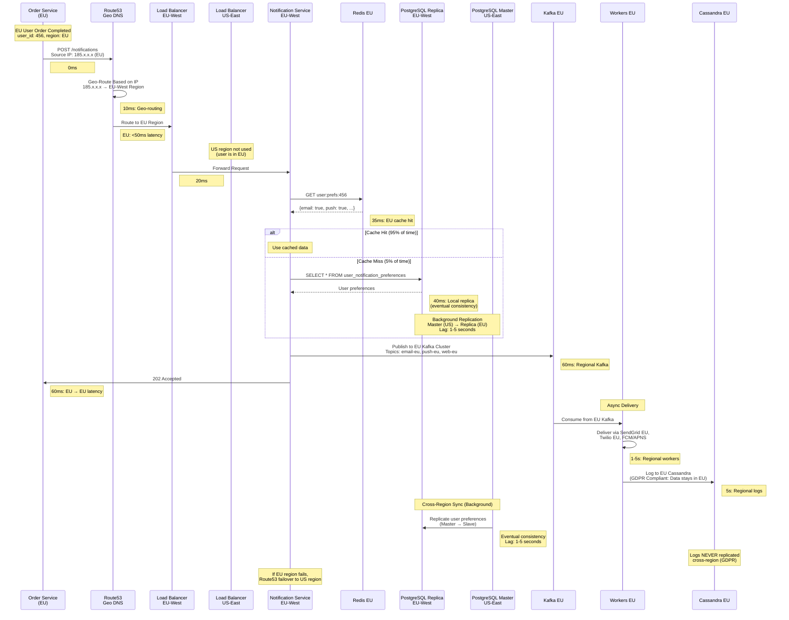
```mermaid
sequenceDiagram
    participant OS_EU as Order Service<br/>(EU)
    participant DNS as Route53<br/>Geo DNS
    participant LB_EU as Load Balancer<br/>EU-West
    participant LB_US as Load Balancer<br/>US-East
    participant NS_EU as Notification Service<br/>EU-West
    participant R_EU as Redis EU
    participant PG_EU as PostgreSQL Replica<br/>EU-West
    participant PG_US as PostgreSQL Master<br/>US-East
    participant K_EU as Kafka EU
    participant W_EU as Workers EU
    participant CS_EU as Cassandra EU
    Note over OS_EU: EU User Order Completed<br/>user_id: 456, region: EU
    OS_EU ->> DNS: POST /notifications<br/>Source IP: 185.x.x.x (EU)
    Note right of OS_EU: 0ms
    DNS ->> DNS: Geo-Route Based on IP<br/>185.x.x.x → EU-West Region
    Note right of DNS: 10ms: Geo-routing
    DNS ->> LB_EU: Route to EU Region
    Note right of DNS: EU: <50ms latency
    Note over LB_US: US region not used<br/>(user is in EU)
    LB_EU ->> NS_EU: Forward Request
    Note right of LB_EU: 20ms
    NS_EU ->> R_EU: GET user:prefs:456
    R_EU -->> NS_EU: {email: true, push: true, ...}
    Note right of R_EU: 35ms: EU cache hit

    alt Cache Hit (95% of time)
        Note over NS_EU: Use cached data
    else Cache Miss (5% of time)
        NS_EU ->> PG_EU: SELECT * FROM user_notification_preferences
        PG_EU -->> NS_EU: User preferences
        Note right of PG_EU: 40ms: Local replica<br/>(eventual consistency)
        Note over PG_EU, PG_US: Background Replication<br/>Master (US) → Replica (EU)<br/>Lag: 1-5 seconds
    end

    NS_EU ->> K_EU: Publish to EU Kafka Cluster<br/>Topics: email-eu, push-eu, web-eu
    Note right of K_EU: 60ms: Regional Kafka
    NS_EU ->> OS_EU: 202 Accepted
    Note right of OS_EU: 60ms: EU → EU latency
    Note over W_EU: Async Delivery
    K_EU ->> W_EU: Consume from EU Kafka
    W_EU ->> W_EU: Deliver via SendGrid EU,<br/>Twilio EU, FCM/APNS
    Note right of W_EU: 1-5s: Regional workers
    W_EU ->> CS_EU: Log to EU Cassandra<br/>(GDPR Compliant: Data stays in EU)
    Note right of CS_EU: 5s: Regional logs
    Note over PG_US, PG_EU: Cross-Region Sync (Background)
    PG_US ->> PG_EU: Replicate user preferences<br/>(Master → Slave)
    Note right of PG_US: Eventual consistency<br/>Lag: 1-5 seconds
    Note over CS_EU: Logs NEVER replicated<br/>cross-region (GDPR)
    Note over NS_EU: If EU region fails,<br/>Route53 failover to US region
```

---

## Summary

These 15 sequence diagrams provide detailed interaction flows for the Notification Service covering:

1. **Happy Paths**: Normal notification creation and multi-channel delivery
2. **Channel-Specific**: Email, SMS, Push, Web/WebSocket delivery flows
3. **Failure Scenarios**: Third-party outages, invalid tokens, rate limits
4. **Resilience Patterns**: Circuit breakers, DLQ, retry logic
5. **Operational**: Idempotency, cache miss, reconnection, multi-region

**Key Takeaways:**

- **API Response**: 60ms (async processing)
- **Delivery Latency**: 0.5s (web) to 5s (email)
- **Failure Handling**: Automatic retries, circuit breakers, DLQ
- **No Message Loss**: Kafka persistence and fallback mechanisms
- **Multi-Region**: <50ms intra-region, GDPR compliant