# Web Crawler - High-Level Design

## Table of Contents

1. [Complete System Architecture](#complete-system-architecture)
2. [URL Frontier (Kafka Partitioning)](#url-frontier-kafka-partitioning)
3. [Duplicate Detection (Two-Tier)](#duplicate-detection-two-tier)
4. [Politeness Controller](#politeness-controller)
5. [Fetcher Worker Architecture](#fetcher-worker-architecture)
6. [Parser Service Flow](#parser-service-flow)
7. [Storage Architecture](#storage-architecture)
8. [Bloom Filter Structure](#bloom-filter-structure)
9. [Rate Limiting (Token Bucket)](#rate-limiting-token-bucket)
10. [Distributed Locking (Per Domain)](#distributed-locking-per-domain)
11. [Complete Data Flow](#complete-data-flow)
12. [Multi-Region Deployment](#multi-region-deployment)
13. [Monitoring Dashboard](#monitoring-dashboard)

---

## Complete System Architecture

**Flow Explanation:**

This diagram shows the complete end-to-end architecture of the distributed web crawler system, from seed URLs to stored content.

**Key Components:**
1. **URL Frontier (Kafka):** Priority queue with partitions per domain
2. **Duplicate Filter:** Bloom Filter (12 GB) + Redis (500 GB) for memory efficiency
3. **Fetcher Workers:** 10-20 async workers fetching HTML
4. **Politeness Controller:** Redis locks + rate limiting per domain
5. **Parser Service:** Extracts text, links, metadata
6. **Storage:** S3 (raw HTML) + Elasticsearch (searchable text)

**Performance:**
- Throughput: 1,000 URLs/sec
- Latency: <5s per URL (fetch + parse + store)
- Scalability: Horizontal (add more workers)

**Trade-offs:**
- Complexity: Multiple distributed services (Kafka, Redis, ES)
- Cost: ~$5,500/month for infrastructure
- Bloom Filter false positives: ~1% duplicate crawls

---

## URL Frontier (Kafka Partitioning)

**Flow Explanation:**

The URL Frontier uses Kafka with multiple priority topics to ensure important pages are crawled first.

**Partitioning Strategy:**
1. **High Priority Topic:** Seed URLs, important domains (Wikipedia, news sites)
2. **Medium Priority Topic:** Links discovered from high-priority pages
3. **Low Priority Topic:** Links from low-priority pages
4. **Partitioning:** By domain hash (ensures all URLs from same domain go to same partition)

**Benefits:**
- **Priority-based crawling:** Important pages first
- **Fault tolerance:** Kafka replicates data across brokers
- **Scalability:** Add more partitions to increase throughput
- **Backpressure:** Kafka buffers URLs if workers are slow

**Trade-offs:**
- **Operational complexity:** Kafka cluster requires maintenance
- **Prioritization complexity:** Need separate topics per priority level

---

## Duplicate Detection (Two-Tier)

**Flow Explanation:**

Two-tier duplicate detection combines Bloom Filter (fast, memory-efficient) with Redis (accurate, persistent) to minimize memory usage while ensuring correctness.

**Tier 1: Bloom Filter (In-Memory)**
- Size: 12 GB RAM
- Capacity: 10 billion URLs
- False positive rate: ~1%
- Hash functions: 3 (MurmurHash3)

**Tier 2: Redis (Persistent)**
- Size: 500 GB disk
- Purpose: Confirm Bloom Filter positives
- Data structure: Redis Set with URL hashes

**Flow:**
1. Check Bloom Filter (O(1), ~1 microsecond)
2. If "definitely not crawled" → Proceed to fetch
3. If "maybe crawled" → Check Redis (O(1), ~1 millisecond)
4. If Redis confirms "crawled" → Drop URL
5. If Redis says "not crawled" → False positive, proceed to fetch

**Benefits:**
- **99% memory savings:** 12 GB vs 5 TB (pure Redis)
- **Fast:** Bloom Filter rejects 99% of URLs instantly
- **Accurate:** Redis provides 100% accuracy for confirmation

```mermaid
graph LR
    URL[Incoming URL]
    
    URL --> BF{Bloom Filter<br/>12 GB RAM<br/>Check}
    
    BF -->|Definitely<br/>Not Crawled<br/>99%| Crawl[✅ Crawl URL]
    BF -->|Maybe<br/>Crawled<br/>1%| Redis{Redis Check<br/>500 GB<br/>Confirm}
    
    Redis -->|Actually<br/>Crawled| Drop[❌ Drop URL<br/>Already Crawled]
    Redis -->|Not Crawled<br/>False Positive| Crawl
    
    Crawl --> AddBF[Add to Bloom Filter]
    AddBF --> AddRedis[Add to Redis Set]
    
    style BF fill:#fff3cd
    style Redis fill:#d1ecf1
    style Crawl fill:#d4edda
    style Drop fill:#f8d7da
```

---

## Politeness Controller

**Flow Explanation:**

The Politeness Controller enforces robots.txt rules and rate limits to avoid overloading domains and getting banned.

**Components:**
1. **robots.txt Cache (Redis):** Caches robots.txt files for 24 hours
2. **Rate Limiter (Token Bucket):** 1 request/sec per domain (configurable)
3. **Distributed Lock (Redis):** Ensures only one worker accesses a domain at a time

**Steps:**
1. Extract domain from URL
2. Check robots.txt cache (if not cached, fetch and store)
3. Verify URL is allowed by robots.txt
4. Check rate limit (Token Bucket algorithm)
5. Acquire distributed lock for domain
6. If all checks pass → Fetch URL
7. Release lock after fetch completes

**Benefits:**
- **Ethical:** Respects Robots Exclusion Protocol
- **Practical:** Avoids IP bans
- **Efficient:** Redis cache reduces robots.txt fetches by 99%

```mermaid
graph TB
    URL[URL to Fetch] --> Extract[Extract Domain<br/>example.com]
    
    Extract --> RobotsCheck{Check robots.txt<br/>Cache}
    
    RobotsCheck -->|Cached| ValidateRobots{URL Allowed?}
    RobotsCheck -->|Not Cached| FetchRobots[Fetch robots.txt<br/>Cache for 24h]
    
    FetchRobots --> ValidateRobots
    
    ValidateRobots -->|Allowed| RateCheck{Rate Limit Check<br/>Token Bucket}
    ValidateRobots -->|Disallowed| DropURL[❌ Drop URL<br/>robots.txt blocked]
    
    RateCheck -->|Tokens Available| AcquireLock[Acquire Lock<br/>lock:example.com<br/>TTL: 10s]
    RateCheck -->|No Tokens| Wait[⏳ Wait & Retry<br/>1 second]
    
    Wait --> RateCheck
    
    AcquireLock -->|Success| FetchURL[✅ Fetch URL]
    AcquireLock -->|Failed| Wait2[⏳ Wait<br/>Another worker has lock]
    
    Wait2 --> AcquireLock
    
    FetchURL --> ReleaseLock[Release Lock]
    
    style ValidateRobots fill:#fff3cd
    style RateCheck fill:#fff3cd
    style FetchURL fill:#d4edda
    style DropURL fill:#f8d7da
```

---

## Fetcher Worker Architecture

**Flow Explanation:**

Each Fetcher Worker is an asynchronous service that handles 100-200 concurrent HTTP requests using non-blocking I/O.

**Design:**
- **Async I/O:** Python (aiohttp) or Go (http.Client with goroutines)
- **Concurrency:** 100-200 concurrent requests per worker
- **Timeout:** 5 seconds per request
- **Retry:** 3 attempts with exponential backoff (1s, 2s, 4s)
- **User-Agent:** Identifies as bot (e.g., `MyBot/1.0`)

**Throughput:**
- Each worker: 100 concurrent requests
- Average fetch time: 500ms
- Throughput: 100 / 0.5s = **200 URLs/sec per worker**
- Total: 10 workers × 200 = **2,000 URLs/sec**

**Benefits:**
- **High throughput:** 100-200x faster than synchronous
- **Resource efficient:** Minimal CPU usage (mostly waiting for I/O)
- **Fault tolerant:** Retries handle transient failures

---

## Parser Service Flow

**Flow Explanation:**

The Parser Service extracts useful information from raw HTML: text content, outgoing links, and metadata.

**Extraction Tasks:**
1. **Links:** All `<a href="...">` tags (normalize relative → absolute URLs)
2. **Text:** Visible text (strip HTML tags, JS, CSS)
3. **Metadata:** Title, description, keywords, publish date
4. **Filtering:** Exclude non-HTML (PDFs, images, videos)

**Technologies:**
- **Python:** BeautifulSoup, lxml
- **Go:** goquery (jQuery-like parser)
- **URL Normalization:** Convert relative URLs to absolute

**Outputs:**
- **New URLs** → URL Frontier (Kafka)
- **Raw HTML** → Object Storage (S3)
- **Parsed Text** → Elasticsearch

---

## Storage Architecture

**Flow Explanation:**

Two-tier storage: S3 for raw HTML (archival), Elasticsearch for parsed text (searchable).

**S3 (Raw HTML Storage):**
- **Format:** Gzip-compressed HTML
- **Partitioning:** By crawl date (e.g., `s3://bucket/2025-01-15/`)
- **Size:** ~100 TB for 10B pages
- **Cost:** $2,300/month

**Elasticsearch (Searchable Text):**
- **Schema:** URL, title, content, crawl timestamp, domain, links, language
- **Indexing:** Full-text index on title + content
- **Sharding:** By domain hash
- **Size:** ~30 TB (compressed text)
- **Cost:** $3,000/month

**Benefits:**
- **Cost-effective:** S3 is cheap for cold storage
- **Searchable:** Elasticsearch enables fast queries
- **Scalable:** Both S3 and ES scale horizontally

---

## Bloom Filter Structure

**Flow Explanation:**

Bloom Filter uses multiple hash functions to map URLs to bit positions in a bit array.

**Structure:**
- **Bit Array Size:** 100 Gb (12.5 GB RAM)
- **Hash Functions:** 3 (MurmurHash3 with different seeds)
- **Capacity:** 10 billion URLs
- **False Positive Rate:** ~1%

**Operations:**
1. **Add URL:** Hash URL with 3 functions → Set 3 bits to 1
2. **Check URL:** Hash URL with 3 functions → If all 3 bits are 1 → "Maybe in set"
3. **False Positive:** If bits were set by other URLs → Incorrect "Maybe"

**Formula:**
- Bits required: $n \times k / \ln(2)$ where $n$ = number of URLs, $k$ = -log₂(false positive rate)
- For 10B URLs, 1% FP: $10^{10} \times 10 / \ln(2) = 144 \text{ billion bits} = 18 \text{ GB}$

---

## Rate Limiting (Token Bucket)

**Flow Explanation:**

Token Bucket algorithm allows bursts while maintaining average rate limit.

**Algorithm:**
- **Bucket Capacity:** 10 tokens (allows burst of 10 requests)
- **Refill Rate:** 1 token/sec (long-term average rate)
- **Request:** Consumes 1 token
- **If bucket empty:** Wait until token refills

**Example:**
- Domain: example.com
- Rate limit: 1 req/sec
- Bucket: 10 tokens (initially full)
- Request 1-10: Consume 10 tokens → All succeed immediately
- Request 11: Wait 1 second for token to refill
- Request 12: Wait 1 second again

**Benefits:**
- **Allows bursts:** Good for user experience
- **Maintains average rate:** Prevents sustained overload
- **Simple:** Easy to implement with Redis

```mermaid
graph TB
    Request[Request to<br/>example.com]
    
    Request --> GetBucket[Get Token Bucket<br/>Redis: tokens:example.com]
    
    GetBucket --> CheckTokens{Tokens Available?}
    
    CheckTokens -->|Yes| ConsumeToken[Consume 1 Token<br/>Decrement count]
    CheckTokens -->|No| Wait[⏳ Wait 1 Second<br/>Token refills]
    
    Wait --> GetBucket
    
    ConsumeToken --> FetchURL[✅ Fetch URL]
    
    FetchURL --> Refill[Background: Refill Tokens<br/>+1 token/sec<br/>Max: 10 tokens]
    
    style CheckTokens fill:#fff3cd
    style FetchURL fill:#d4edda
```

---

## Distributed Locking (Per Domain)

**Flow Explanation:**

Redis distributed locks ensure only one worker accesses a domain at a time, preventing overload.

**Lock Acquisition:**
1. Worker tries to acquire lock: `SET lock:example.com worker-id NX EX 10`
   - `NX`: Only set if key doesn't exist
   - `EX 10`: Expire after 10 seconds (prevents deadlocks)
2. If successful → Worker proceeds to fetch
3. If failed → Another worker holds the lock → Wait and retry

**Lock Release:**
1. After fetch completes, worker releases lock: `DEL lock:example.com`
2. Next worker can now acquire the lock

**Benefits:**
- **Prevents concurrent access:** Only one worker per domain
- **Deadlock prevention:** TTL ensures locks are released
- **Simple:** Single Redis command

---

## Complete Data Flow

**Flow Explanation:**

End-to-end data flow from seed URL to stored content, showing all major steps.

**Steps:**
1. Seed URL added to URL Frontier (Kafka high-priority topic)
2. Fetcher Worker consumes URL from Kafka
3. Check Duplicate Filter (Bloom + Redis) → If already crawled, drop
4. Check Politeness Controller (robots.txt, rate limit, lock)
5. Fetch HTML (HTTP GET, 5s timeout, 3 retries)
6. Parse HTML (extract text, links, metadata)
7. Store: Raw HTML → S3, Parsed text → Elasticsearch
8. New URLs → Back to URL Frontier (Kafka)
9. Mark URL as crawled (Bloom Filter + Redis)

**Timeline:**
- Total time per URL: ~2-5 seconds
- Throughput: 1,000 URLs/sec (parallel workers)

```mermaid
graph TB
    Start[Seed URL:<br/>example.com] --> Frontier[1. URL Frontier<br/>Kafka<br/>High Priority]
    
    Frontier --> Worker[2. Fetcher Worker<br/>Consumes URL]
    
    Worker --> DupCheck{3. Duplicate Check<br/>Bloom + Redis}
    
    DupCheck -->|New URL| PoliteCheck{4. Politeness Check<br/>robots.txt + Lock}
    DupCheck -->|Already Crawled| Drop1[❌ Drop]
    
    PoliteCheck -->|Allowed| Fetch[5. Fetch HTML<br/>HTTP GET<br/>Timeout: 5s]
    PoliteCheck -->|Blocked| Drop2[❌ Drop]
    
    Fetch -->|Success| Parse[6. Parse HTML<br/>Extract Text + Links]
    Fetch -->|Timeout/Error| Retry{Retry < 3?}
    
    Retry -->|Yes| Backoff[Exponential Backoff]
    Backoff --> Fetch
    Retry -->|No| Fail[❌ Mark Failed]
    
    Parse --> Store1[7a. Store Raw HTML<br/>→ S3]
    Parse --> Store2[7b. Store Text<br/>→ Elasticsearch]
    Parse --> NewURLs[7c. New URLs<br/>→ Kafka]
    
    NewURLs --> Frontier
    
    Parse --> MarkCrawled[9. Mark as Crawled<br/>Bloom + Redis]
    
    style DupCheck fill:#fff3cd
    style PoliteCheck fill:#fff3cd
    style Fetch fill:#d1ecf1
    style Parse fill:#d1ecf1
    style Store1 fill:#d4edda
    style Store2 fill:#d4edda
```

---

## Multi-Region Deployment

**Flow Explanation:**

For global crawling, deploy crawler clusters in multiple regions to reduce latency and distribute load.

**Regions:**
- **US-East:** Crawl US domains
- **EU-West:** Crawl EU domains
- **Asia-Pacific:** Crawl Asian domains

**Coordination:**
- **Global URL Frontier:** Centralized Kafka cluster (multi-region replication)
- **Regional Duplicate Filters:** Bloom Filter + Redis per region
- **Regional Workers:** Fetcher + Parser workers in each region

**Benefits:**
- **Lower latency:** Fetch from nearby servers
- **Regulatory compliance:** Store EU data in EU
- **Fault tolerance:** If one region fails, others continue

---

## Monitoring Dashboard

**Flow Explanation:**

Key metrics to monitor for crawler health and performance.

**Metrics:**
1. **Throughput:** URLs crawled/sec
2. **URL Frontier Size:** Number of pending URLs
3. **Duplicate Rate:** % of URLs rejected as duplicates
4. **Fetch Success Rate:** % of successful HTTP requests
5. **Parser Success Rate:** % of HTML parsed successfully
6. **Storage Lag:** Time delay between parse and storage
7. **Worker Health:** CPU, memory, network usage

**Alerts:**
- Throughput < 500 QPS → Scale up workers
- URL Frontier > 50M → Reduce link extraction
- Duplicate rate > 20% → Rebuild Bloom Filter
- Fetch success < 80% → Check network/DNS

```mermaid
graph TB
    subgraph "Monitoring Dashboard"
        Throughput[Throughput Metric<br/>URLs crawled/sec<br/>Target: 1,000<br/>Current: 950 ✅]
        
        Frontier[URL Frontier Size<br/>Pending URLs<br/>Target: <10M<br/>Current: 5M ✅]
        
        DupRate[Duplicate Rate<br/>% Rejected<br/>Target: <5%<br/>Current: 2% ✅]
        
        FetchRate[Fetch Success Rate<br/>% Successful<br/>Target: >95%<br/>Current: 97% ✅]
        
        ParseRate[Parser Success Rate<br/>% Parsed<br/>Target: >99%<br/>Current: 99.5% ✅]
        
        StorageLag[Storage Lag<br/>Parse → Store delay<br/>Target: <1s<br/>Current: 0.5s ✅]
        
        WorkerHealth[Worker Health<br/>CPU: 65%<br/>Memory: 70%<br/>Network: 80 Mbps ✅]
        
        Errors[Error Dashboard<br/>HTTP 5xx: 2%<br/>Timeouts: 1%<br/>DNS Errors: 0.5%]
    end
    
    Throughput -.->|Low| Alert1[🚨 Alert: Scale Up]
    Frontier -.->|High| Alert2[🚨 Alert: Reduce Links]
    DupRate -.->|High| Alert3[🚨 Alert: Rebuild Bloom]
    
    style Throughput fill:#d4edda
    style Frontier fill:#d4edda
    style DupRate fill:#d4edda
    style FetchRate fill:#d4edda
```

