# Web Crawler - Sequence Diagrams

## Table of Contents

1. [Complete Crawl Flow (Happy Path)](#complete-crawl-flow-happy-path)
2. [Duplicate Detection Flow](#duplicate-detection-flow)
3. [Politeness Check Flow](#politeness-check-flow)
4. [robots.txt Fetch and Cache](#robotstxt-fetch-and-cache)
5. [Rate Limiting with Token Bucket](#rate-limiting-with-token-bucket)
6. [Distributed Lock Acquisition](#distributed-lock-acquisition)
7. [HTTP Fetch with Retry](#http-fetch-with-retry)
8. [Parse and Extract Links](#parse-and-extract-links)
9. [Storage Flow (S3 + Elasticsearch)](#storage-flow-s3--elasticsearch)
10. [Bloom Filter False Positive Handling](#bloom-filter-false-positive-handling)
11. [DNS Resolution Failure](#dns-resolution-failure)
12. [Timeout and Retry Flow](#timeout-and-retry-flow)
13. [Worker Crash and Recovery](#worker-crash-and-recovery)
14. [Multi-Region URL Distribution](#multi-region-url-distribution)
15. [Priority Queue Processing](#priority-queue-processing)

---

## Complete Crawl Flow (Happy Path)

**Flow:**

Shows the complete end-to-end flow of crawling a URL from the URL Frontier to storing the content.

**Steps:**
1. **Fetcher Worker** (0ms): Consumes URL from Kafka URL Frontier
2. **Bloom Filter Check** (1ms): Quick in-memory check - "not crawled"
3. **Politeness Controller** (10ms): Check robots.txt cache, rate limit, acquire lock
4. **HTTP Fetch** (500ms): Download HTML from target server
5. **Parser** (100ms): Extract text, links, metadata
6. **Storage** (50ms): Save to S3 and Elasticsearch
7. **Update Duplicate Filter** (5ms): Add to Bloom Filter + Redis
8. **New URLs to Frontier** (10ms): Push discovered links to Kafka

**Performance:**
- Total time: ~676ms per URL
- Throughput: ~1.5 URLs/sec per worker
- With 10 workers × 100 concurrent requests: 1,000 QPS

```mermaid
sequenceDiagram
    participant Kafka as URL Frontier<br/>(Kafka)
    participant Worker as Fetcher Worker
    participant Bloom as Bloom Filter<br/>12 GB RAM
    participant Redis as Redis<br/>Duplicate Store
    participant Polite as Politeness<br/>Controller
    participant Server as Target Server
    participant Parser as Parser Service
    participant S3 as S3 Storage
    participant ES as Elasticsearch
    
    Kafka->>Worker: Consume URL (batch: 100)
    Worker->>Bloom: Check if URL crawled
    Bloom-->>Worker: Not found (definitely new)
    
    Worker->>Polite: Check politeness
    Polite->>Polite: Check robots.txt cache
    Polite->>Polite: Check rate limit (Token Bucket)
    Polite->>Polite: Acquire lock (lock:domain)
    Polite-->>Worker: ✅ Allowed to fetch
    
    Worker->>Server: HTTP GET (timeout: 5s)
    Server-->>Worker: HTML response (200 OK)
    
    Worker->>Parser: Send HTML
    Parser->>Parser: Extract text, links, metadata
    
    Parser->>S3: Store raw HTML (gzip)
    S3-->>Parser: Stored
    
    Parser->>ES: Index parsed text
    ES-->>Parser: Indexed
    
    Parser->>Kafka: Push new URLs (discovered links)
    Kafka-->>Parser: Queued
    
    Worker->>Bloom: Add URL to Bloom Filter
    Worker->>Redis: Add URL hash to Redis Set
    
    Worker->>Polite: Release lock (lock:domain)
    Polite-->>Worker: Lock released
```

---

## Duplicate Detection Flow

**Flow:**

Shows the two-tier duplicate detection: Bloom Filter (fast) → Redis (accurate).

**Steps:**
1. **Bloom Filter Check** (~1 microsecond): Hash URL with 3 functions
2. If "definitely not crawled" (99% case) → Proceed to fetch
3. If "maybe crawled" (1% case) → Check Redis for confirmation
4. If Redis confirms "already crawled" → Drop URL
5. If Redis says "not crawled" → False positive, proceed to fetch

**Performance:**
- 99% of URLs rejected by Bloom Filter instantly
- Only 1% need Redis lookup
- Memory savings: 12 GB vs 5 TB (99% reduction)

```mermaid
sequenceDiagram
    participant Worker as Fetcher Worker
    participant Bloom as Bloom Filter<br/>(In-Memory)
    participant Redis as Redis<br/>(Persistent)
    participant Fetch as Fetch Process
    
    Worker->>Bloom: Check URL (3 hash functions)
    
    alt 99% Case: Definitely Not Crawled
        Bloom-->>Worker: ❌ Not in filter
        Worker->>Fetch: ✅ Proceed to fetch
        Fetch->>Bloom: Add URL to Bloom Filter
        Fetch->>Redis: Add URL hash to Redis Set
    else 1% Case: Maybe Crawled (Check Redis)
        Bloom-->>Worker: ⚠️ Maybe in filter
        Worker->>Redis: GET url_hash
        
        alt Actually Crawled (True Positive)
            Redis-->>Worker: ✅ Found
            Worker->>Worker: 🚫 Drop URL (already crawled)
        else Not Crawled (False Positive)
            Redis-->>Worker: ❌ Not found
            Worker->>Fetch: ✅ Proceed to fetch
            Fetch->>Bloom: Add URL to Bloom Filter
            Fetch->>Redis: Add URL hash to Redis Set
        end
    end
    
    Note over Bloom,Redis: Bloom Filter: 99% rejection rate<br/>Redis: 100% accuracy for confirmation
```

---

## Politeness Check Flow

**Flow:**

Enforces robots.txt rules and rate limiting before fetching.

**Steps:**
1. Extract domain from URL
2. Check robots.txt cache (Redis, 24h TTL)
3. If not cached, fetch robots.txt and store in Redis
4. Verify URL is allowed by robots.txt rules
5. Check rate limit using Token Bucket algorithm
6. Acquire distributed lock for domain
7. If all checks pass → Allow fetch

**Performance:**
- robots.txt cache hit rate: ~99%
- Lock acquisition: ~5-10ms
- Total politeness check time: ~10-15ms

```mermaid
sequenceDiagram
    participant Worker as Fetcher Worker
    participant Redis as Redis<br/>(Cache + Locks)
    participant Server as Target Server
    participant Fetch as Fetch Process
    
    Worker->>Worker: Extract domain (example.com)
    
    Worker->>Redis: GET robots:example.com
    
    alt robots.txt Cached (99% case)
        Redis-->>Worker: robots.txt content
    else robots.txt Not Cached (1% case)
        Redis-->>Worker: NULL
        Worker->>Server: GET /robots.txt
        Server-->>Worker: robots.txt content
        Worker->>Redis: SET robots:example.com<br/>TTL: 24h
    end
    
    Worker->>Worker: Parse robots.txt<br/>Check if URL allowed
    
    alt URL Disallowed
        Worker->>Worker: 🚫 Drop URL (robots.txt blocked)
    else URL Allowed
        Worker->>Redis: Check Token Bucket<br/>tokens:example.com
        
        alt No Tokens Available
            Redis-->>Worker: 0 tokens
            Worker->>Worker: ⏳ Wait 1 second
            Worker->>Redis: Check Token Bucket (retry)
        else Tokens Available
            Redis-->>Worker: ✅ Token available
            Worker->>Redis: Decrement token count
            
            Worker->>Redis: SET lock:example.com<br/>worker-id NX EX 10
            
            alt Lock Acquired
                Redis-->>Worker: OK
                Worker->>Fetch: ✅ Proceed to fetch
                Fetch->>Redis: DEL lock:example.com
            else Lock Held by Another Worker
                Redis-->>Worker: NULL
                Worker->>Worker: ⏳ Wait 1 second
                Worker->>Redis: Retry lock acquisition
            end
        end
    end
```

---

## robots.txt Fetch and Cache

**Flow:**

Shows how robots.txt is fetched once and cached for 24 hours.

**Steps:**
1. Worker checks Redis cache for robots.txt
2. If not cached, fetch from server
3. Parse robots.txt content
4. Store in Redis with 24-hour TTL
5. Subsequent requests use cached copy

**Performance:**
- First request: ~500ms (HTTP fetch + parse)
- Cached requests: ~1ms (Redis lookup)
- Cache hit rate: 99%

```mermaid
sequenceDiagram
    participant W1 as Worker 1
    participant W2 as Worker 2
    participant Redis as Redis Cache
    participant Server as example.com
    
    Note over W1,Server: First request to example.com
    
    W1->>Redis: GET robots:example.com
    Redis-->>W1: NULL (not cached)
    
    W1->>Server: GET /robots.txt
    Server-->>W1: robots.txt content<br/>User-agent: *<br/>Disallow: /admin/<br/>Crawl-delay: 1
    
    W1->>W1: Parse robots.txt
    W1->>Redis: SET robots:example.com<br/>TTL: 86400 (24h)
    Redis-->>W1: OK
    
    W1->>W1: Check if URL allowed
    
    Note over W1,Server: 10 minutes later, Worker 2 needs robots.txt
    
    W2->>Redis: GET robots:example.com
    Redis-->>W2: ✅ robots.txt content (cached)
    
    W2->>W2: Check if URL allowed
    
    Note over Redis: Cache expires after 24 hours<br/>Next request will fetch fresh copy
```

---

## Rate Limiting with Token Bucket

**Flow:**

Token Bucket algorithm allows burst requests while maintaining average rate.

**Steps:**
1. Check current token count for domain
2. If tokens available, consume one token and proceed
3. If no tokens, wait for token refill (1 token/sec)
4. Background job refills tokens at configured rate

**Performance:**
- Burst capacity: 10 tokens (10 requests immediately)
- Refill rate: 1 token/sec (long-term average)
- Max sustained rate: 1 req/sec per domain

---

## Distributed Lock Acquisition

**Flow:**

Redis distributed locks ensure only one worker accesses a domain at a time.

**Steps:**
1. Worker 1 tries to acquire lock for domain
2. Redis SET with NX (only if not exists) and EX (expiration)
3. If successful, worker proceeds to fetch
4. If failed, another worker holds the lock → wait and retry
5. After fetch, worker releases lock

**Performance:**
- Lock acquisition: ~5ms
- Lock TTL: 10 seconds (prevents deadlocks)
- Prevents concurrent domain access

---

## HTTP Fetch with Retry

**Flow:**

HTTP fetch with timeout and exponential backoff retry logic.

**Steps:**
1. Send HTTP GET request with 5-second timeout
2. If successful (200 OK), return HTML
3. If timeout or 5xx error, retry with exponential backoff
4. Retry up to 3 times (1s, 2s, 4s delays)
5. If all retries fail, mark URL as failed

**Performance:**
- Average fetch time: 500ms
- Timeout: 5 seconds
- Total retry time: 1s + 2s + 4s = 7s + 3×5s = 22s max

---

## Parse and Extract Links

**Flow:**

Parser extracts text, links, and metadata from HTML.

**Steps:**
1. Receive HTML from Fetcher
2. Parse HTML using BeautifulSoup/goquery
3. Extract text content (strip tags, JS, CSS)
4. Extract all links (`<a href="...">`)
5. Normalize relative URLs to absolute
6. Filter out non-HTML links (PDFs, images)
7. Extract metadata (title, description, keywords)
8. Send outputs to storage and URL Frontier

**Performance:**
- Parse time: 50-100ms per page
- Average links per page: 50
- Throughput: 10-20 pages/sec per parser

```mermaid
sequenceDiagram
    participant Fetch as Fetcher Worker
    participant Parser as Parser Service
    participant Filter as Link Filter
    participant Frontier as URL Frontier<br/>(Kafka)
    participant S3 as S3 Storage
    participant ES as Elasticsearch
    
    Fetch->>Parser: Send HTML (example.com/page1)
    
    Parser->>Parser: Parse HTML<br/>(BeautifulSoup/goquery)
    
    par Extract Text
        Parser->>Parser: Strip HTML tags
        Parser->>Parser: Remove JS/CSS
        Parser->>Parser: Extract visible text
        Parser->>ES: Index text content
    and Extract Links
        Parser->>Parser: Find all <a href="...">
        Parser->>Parser: Normalize URLs<br/>(relative → absolute)
        Parser->>Filter: Send discovered links
        
        Filter->>Filter: Filter by type
        
        alt HTML Links
            Filter->>Frontier: Push to URL Frontier
        else Non-HTML (PDF, image)
            Filter->>Filter: 🚫 Drop link
        end
    and Extract Metadata
        Parser->>Parser: Extract title
        Parser->>Parser: Extract description
        Parser->>Parser: Extract keywords
        Parser->>ES: Add metadata to document
    and Store Raw HTML
        Parser->>Parser: Compress HTML (gzip)
        Parser->>S3: Store compressed HTML
    end
    
    S3-->>Parser: Stored
    ES-->>Parser: Indexed
    Frontier-->>Filter: URLs queued
    
    Parser-->>Fetch: ✅ Processing complete
```

---

## Storage Flow (S3 + Elasticsearch)

**Flow:**

Dual storage: S3 for raw HTML (archival), Elasticsearch for searchable text.

**Steps:**
1. Parser sends raw HTML to S3
2. S3 compresses and stores (gzip)
3. Parser sends parsed text to Elasticsearch
4. ES indexes text for full-text search
5. Both operations happen in parallel

**Performance:**
- S3 write: ~20-50ms
- ES index: ~50-100ms
- Total: ~100ms (parallel)

---

## Bloom Filter False Positive Handling

**Flow:**

Shows what happens when Bloom Filter incorrectly reports "maybe crawled".

**Steps:**
1. URL arrives, Bloom Filter says "maybe crawled" (1% case)
2. Check Redis for confirmation
3. If Redis says "not crawled" → False positive
4. Proceed to fetch anyway
5. Add to both Bloom Filter and Redis

**Performance:**
- False positive rate: ~1%
- Redis confirmation: ~1ms
- No URLs are missed (Redis provides 100% accuracy)

```mermaid
sequenceDiagram
    participant Worker as Fetcher Worker
    participant Bloom as Bloom Filter
    participant Redis as Redis
    participant Fetch as Fetch Process
    
    Note over Worker: URL: example.com/rare-page
    
    Worker->>Bloom: Check URL
    Bloom-->>Worker: ⚠️ Maybe crawled (False Positive)
    
    Note over Bloom: Bloom Filter incorrectly reports<br/>"maybe crawled" due to hash collision
    
    Worker->>Redis: GET hash(example.com/rare-page)
    Redis-->>Worker: ❌ Not found
    
    Note over Worker: Redis confirms: NOT crawled<br/>This was a Bloom Filter false positive
    
    Worker->>Worker: ℹ️ Log false positive
    Worker->>Fetch: ✅ Proceed to fetch
    
    Fetch->>Fetch: Fetch HTML successfully
    
    Fetch->>Bloom: Add URL to Bloom Filter
    Fetch->>Redis: Add URL hash to Redis Set
    
    Note over Bloom,Redis: Now both Bloom Filter and Redis<br/>know this URL is crawled
    
    Note over Worker: Next time: Both will report "crawled"<br/>No false negative (URL is never missed)
```

---

## DNS Resolution Failure

**Flow:**

Handles DNS lookup failures gracefully.

**Steps:**
1. Worker attempts to fetch URL
2. DNS lookup fails (NXDOMAIN)
3. Log error with details
4. Mark URL as permanently failed (don't retry)
5. Continue processing next URLs

**Performance:**
- DNS timeout: ~5 seconds
- No retry for DNS failures (saves time)

```mermaid
sequenceDiagram
    participant Worker as Fetcher Worker
    participant DNS as DNS Resolver
    participant Log as Error Log
    participant Kafka as URL Frontier
    
    Worker->>DNS: Resolve domain: nonexistent-site.com
    
    alt DNS Success
        DNS-->>Worker: IP: 93.184.216.34
        Worker->>Worker: ✅ Proceed to HTTP fetch
    else DNS Failure (NXDOMAIN)
        DNS-->>Worker: ❌ NXDOMAIN (domain not found)
        
        Worker->>Log: Log error:<br/>{<br/>  url: "nonexistent-site.com/page",<br/>  error: "DNS_RESOLUTION_FAILED",<br/>  code: "NXDOMAIN",<br/>  timestamp: "2025-01-15T10:30:00Z"<br/>}
        
        Worker->>Worker: 🚫 Mark URL as failed<br/>(permanent failure, no retry)
        
        Worker->>Kafka: Consume next URL
    end
    
    Note over Worker: DNS failures are permanent<br/>Don't retry (saves time)
```

---

## Timeout and Retry Flow

**Flow:**

Handles slow servers with timeout and retry logic.

**Steps:**
1. Send HTTP request with 5-second timeout
2. If server doesn't respond in 5s, timeout
3. Retry with exponential backoff (1s, 2s, 4s)
4. After 3 failed attempts, mark as failed

**Performance:**
- First timeout: 5s
- Retry 1: 5s + 1s wait = 6s
- Retry 2: 5s + 2s wait = 7s
- Retry 3: 5s + 4s wait = 9s
- Total max time: 22s

```mermaid
sequenceDiagram
    participant Worker as Fetcher Worker
    participant Server as Slow Server
    participant Log as Error Log
    
    Worker->>Server: HTTP GET (timeout: 5s)<br/>Attempt 1
    
    Note over Server: Server is slow,<br/>doesn't respond in 5s
    
    Server-->>Worker: ⏱️ Timeout (no response)
    
    Worker->>Worker: ⏳ Wait 1 second<br/>(Exponential backoff)
    
    Worker->>Server: HTTP GET (timeout: 5s)<br/>Attempt 2
    Server-->>Worker: ⏱️ Timeout again
    
    Worker->>Worker: ⏳ Wait 2 seconds
    
    Worker->>Server: HTTP GET (timeout: 5s)<br/>Attempt 3
    Server-->>Worker: ⏱️ Timeout again
    
    Worker->>Worker: ⏳ Wait 4 seconds
    
    Worker->>Server: HTTP GET (timeout: 5s)<br/>Attempt 4 (final)
    
    alt Server Finally Responds
        Server-->>Worker: HTML content (200 OK)
        Worker->>Worker: ✅ Parse HTML
    else Still Timeout
        Server-->>Worker: ⏱️ Timeout
        
        Worker->>Log: Log error: URL failed after 4 attempts
        Worker->>Worker: 🚫 Mark URL as failed
    end
    
    Note over Worker: Total max time: ~22 seconds<br/>Then move to next URL
```

---

## Worker Crash and Recovery

**Flow:**

Shows how Kafka's consumer groups handle worker crashes.

**Steps:**
1. Worker 1 crashes while processing URLs
2. Kafka detects loss of heartbeat
3. Kafka rebalances: assigns Worker 1's partitions to Worker 2
4. Worker 2 continues from last committed offset
5. URLs are not lost (Kafka guarantees durability)

**Performance:**
- Crash detection: ~10 seconds (heartbeat timeout)
- Rebalance time: ~5 seconds
- Recovery time: ~15 seconds total

---

## Multi-Region URL Distribution

**Flow:**

URLs are distributed to regional workers based on domain location.

**Steps:**
1. Global URL Frontier receives new URLs
2. Determine target region based on domain geo-location
3. Route URLs to regional Kafka topic
4. Regional workers consume from their local topic
5. Results are aggregated globally

**Performance:**
- Regional routing: <10ms
- Lower latency: Crawl from nearby servers
- Fault tolerance: If one region fails, others continue

```mermaid
sequenceDiagram
    participant Parser as Parser<br/>(Discovers URLs)
    participant Router as Geo Router
    participant USKafka as US Kafka<br/>(us-east)
    participant EUKafka as EU Kafka<br/>(eu-west)
    participant ASKafka as Asia Kafka<br/>(ap-south)
    participant USWorker as US Workers
    participant EUWorker as EU Workers
    participant ASWorker as Asia Workers
    
    Parser->>Router: Discovered URLs:<br/>- cnn.com/article<br/>- bbc.co.uk/news<br/>- toi.in/story
    
    Router->>Router: Geo-locate domains
    
    Router->>USKafka: Route: cnn.com → US
    Router->>EUKafka: Route: bbc.co.uk → EU
    Router->>ASKafka: Route: toi.in → Asia
    
    USKafka->>USWorker: Consume cnn.com URLs
    USWorker->>USWorker: Fetch from US servers<br/>(Low latency: ~50ms)
    
    EUKafka->>EUWorker: Consume bbc.co.uk URLs
    EUWorker->>EUWorker: Fetch from EU servers<br/>(Low latency: ~50ms)
    
    ASKafka->>ASWorker: Consume toi.in URLs
    ASWorker->>ASWorker: Fetch from Asia servers<br/>(Low latency: ~50ms)
    
    Note over USWorker,ASWorker: Benefits:<br/>- Lower latency<br/>- Regulatory compliance<br/>- Fault tolerance
```

---

## Priority Queue Processing

**Flow:**

Shows how high-priority URLs (seed URLs, important domains) are processed first.

**Steps:**
1. URLs are added to Kafka topics by priority (high/medium/low)
2. Workers are allocated proportionally (70% high, 20% med, 10% low)
3. High-priority URLs are consumed and processed first
4. This ensures important pages are crawled quickly

**Performance:**
- High-priority URLs: Crawled within minutes
- Medium-priority: Hours
- Low-priority: Days

