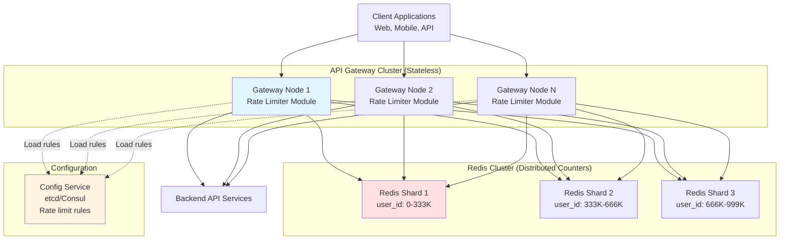
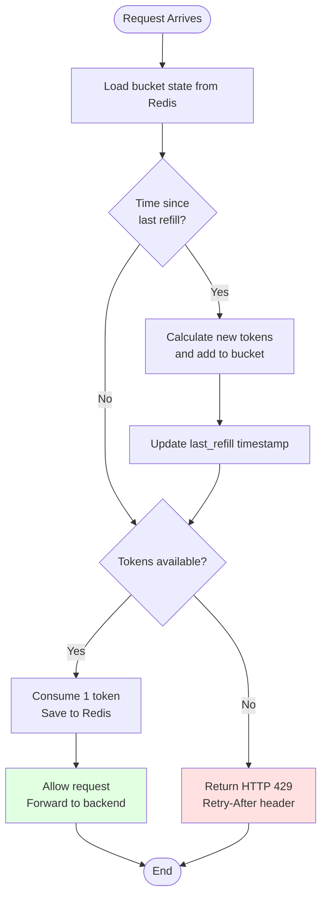
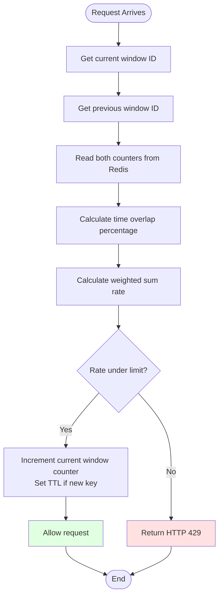
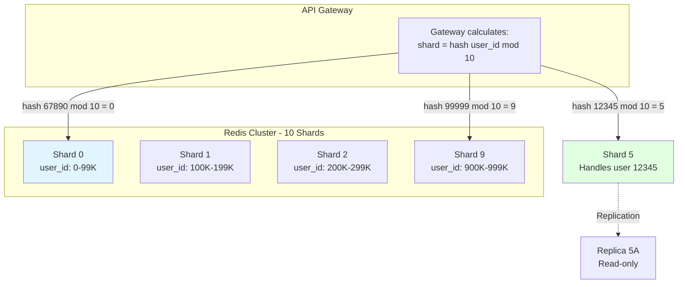
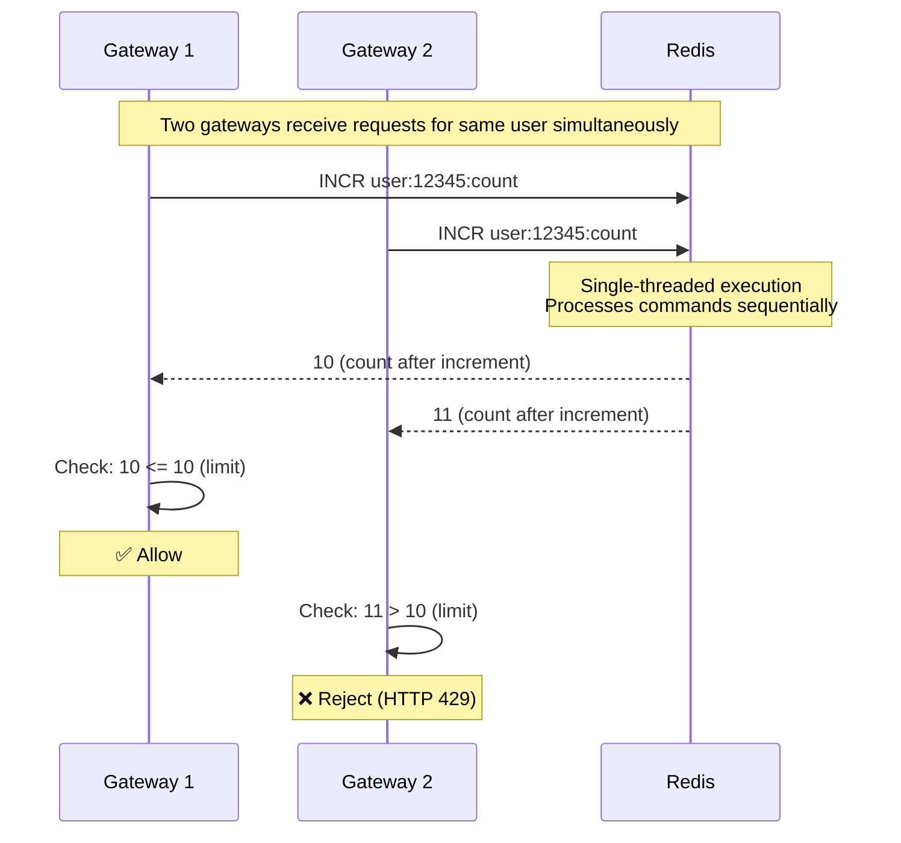
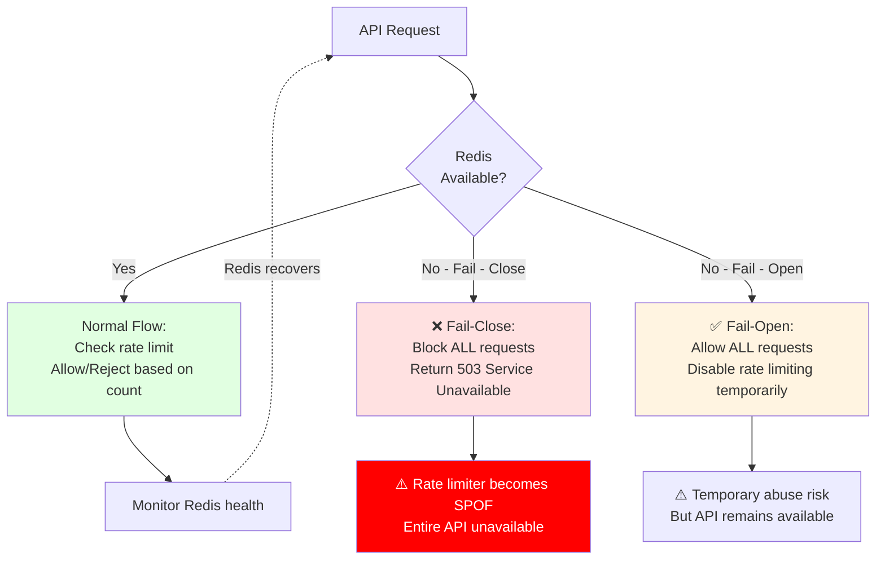
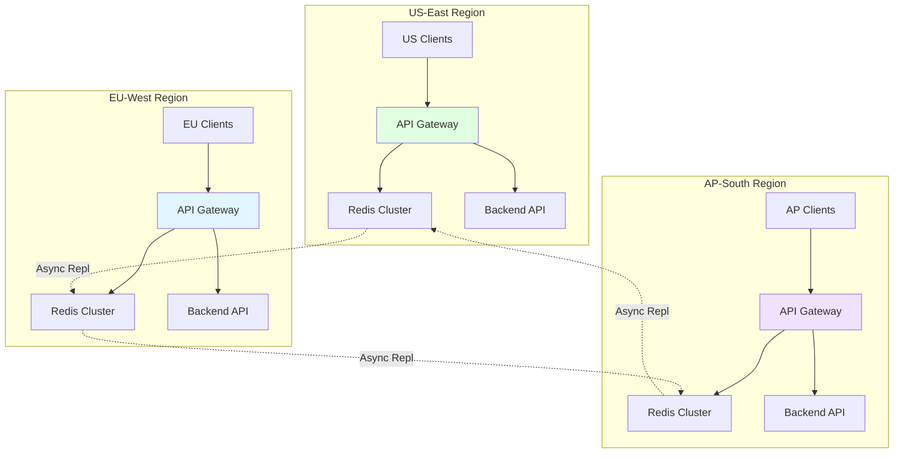
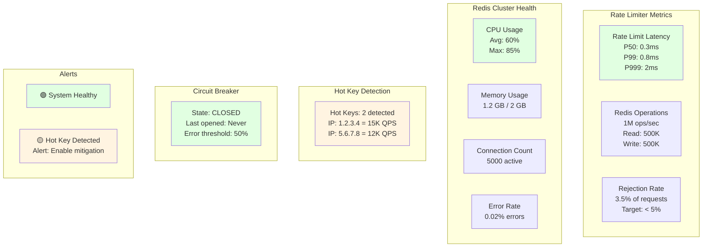

# Global Rate Limiter - High-Level Design

This document contains Mermaid diagrams illustrating the system architecture, component design, data flow, and scaling
strategies for the Global Rate Limiter system.

---

## Table of Contents

1. [Complete System Architecture](#1-complete-system-architecture)
2. [Rate Limiting Algorithms Comparison](#2-rate-limiting-algorithms-comparison)
3. [Token Bucket Algorithm Flow](#3-token-bucket-algorithm-flow)
4. [Sliding Window Counter Flow](#4-sliding-window-counter-flow)
5. [Redis Cluster Sharding Strategy](#5-redis-cluster-sharding-strategy)
6. [Atomic Counter Implementation](#6-atomic-counter-implementation)
7. [Fail-Open vs Fail-Close Strategy](#7-fail-open-vs-fail-close-strategy)
8. [Hot Key Problem and Mitigation](#8-hot-key-problem-and-mitigation)
9. [Multi-Region Deployment](#9-multi-region-deployment)
10. [Monitoring Dashboard](#10-monitoring-dashboard)

---

## 1. Complete System Architecture



**Flow Explanation:**

This diagram shows the complete Global Rate Limiter architecture with all major components.

**Key Components:**

1. **Client Applications** → Send API requests
2. **API Gateway Cluster** → Stateless nodes that route requests and enforce rate limits
3. **Rate Limiter Module** → Embedded in each gateway, checks Redis before allowing requests
4. **Redis Cluster** → Sharded distributed counter store (3 shards shown, production uses 10+)
5. **Config Service** → Stores rate limit rules (10 QPS for basic, 100 QPS for premium, etc.)
6. **Backend Services** → Actual API logic (only reached if rate limit passed)

**Flow:**

1. Client → Gateway Node (any node, load balanced)
2. Gateway → Redis (hash user_id to find shard)
3. Redis → Atomic INCR counter
4. If under limit → Forward to Backend
5. If over limit → Return HTTP 429

**Benefits:**

- **Stateless Gateways:** Can scale horizontally without coordination
- **Sharded Redis:** Distributes 1M ops/sec across multiple nodes
- **Low Latency:** Sub-millisecond Redis operations
- **Global Consistency:** All gateways use same Redis cluster

**Performance:**

- Gateway check: <1ms (p99)
- Redis roundtrip: 0.5ms (same AZ)
- Total overhead: <2ms per request

---

## 2. Rate Limiting Algorithms Comparison

```mermaid
graph TB
    subgraph "Token Bucket"
        TB1[Bucket holds tokens<br/>Max capacity: 10]
        TB2[Refill rate: 10 tokens/sec]
        TB3[Each request consumes 1 token]
        TB4[If tokens available:<br/>Allow + Consume<br/>Else: Reject]
        TB1 --> TB2 --> TB3 --> TB4
    end

subgraph "Sliding Window Counter"
SW1[Current window counter]
SW2[Previous window counter]
SW3[Weighted sum:<br/>prev × overlap% + current]
SW4[If sum < limit:<br/>Allow + INCR<br/>Else: Reject]
SW1 --> SW3
SW2 --> SW3
SW3 --> SW4
end

subgraph "Fixed Window Counter"
FW1[Counter for current window<br/>e.g. 10:00:00 - 10:00:59]
FW2[INCR counter]
FW3[If counter < limit:<br/>Allow<br/>Else: Reject]
FW4[Reset at window boundary]
FW1 --> FW2 --> FW3
FW3 -. Window expires.-> FW4
end

style TB4 fill:#e1ffe1
style SW4 fill: #e1ffe1
style FW3 fill: #ffe1e1
```



**Flow Explanation:**

Compares the three main rate limiting algorithms.

**Algorithm 1: Token Bucket**

- **Storage:** 2 values (current tokens + last refill timestamp)
- **Logic:** Refill tokens at constant rate, consume on request
- **Pros:** Allows bursts (accumulated tokens), smooth limiting
- **Cons:** Slightly more storage, more complex refill logic
- **Best For:** APIs with bursty traffic (video streaming, file uploads)

**Algorithm 2: Sliding Window Counter**

- **Storage:** 2 counters (current window + previous window)
- **Logic:** Weighted sum approximates true sliding window
- **Pros:** More accurate than fixed window, prevents boundary bursts
- **Cons:** Approximation (not 100% accurate), requires 2 reads
- **Best For:** Strict rate limiting (financial APIs, critical operations)

**Algorithm 3: Fixed Window Counter**

- **Storage:** 1 counter
- **Logic:** Count requests in fixed time bucket
- **Pros:** Simplest, fastest (single INCR)
- **Cons:** **Boundary burst problem** (can exceed 2× limit at boundaries)
- **Best For:** Coarse limits where bursts acceptable

**Example: Boundary Burst Problem (Fixed Window)**

```
Window: 10:00:00 - 10:00:59 (limit: 100 requests)
→ User makes 100 requests at 10:00:59
→ User makes 100 requests at 10:01:00 (new window)
→ Total: 200 requests in 1 second! ❌
```

**Recommendation:** Use **Token Bucket** or **Sliding Window** for production.

---

## 3. Token Bucket Algorithm Flow



**Flow Explanation:**

Shows the complete Token Bucket algorithm execution.

**Steps:**

1. **Load State** (0.3ms): Fetch current tokens and last_refill timestamp from Redis
2. **Calculate Refill** (0.1ms):
    - `elapsed_time = now - last_refill`
    - `new_tokens = refill_rate × elapsed_time`
    - `tokens = min(tokens + new_tokens, capacity)`
3. **Check Tokens** (0.1ms): If `tokens >= 1`, allow; else reject
4. **Consume Token** (0.3ms): Decrement tokens, save to Redis
5. **Forward Request** (varies): If allowed, pass to backend API

**Example:**

```
Capacity: 10 tokens
Refill rate: 10 tokens/second

Time 0s: tokens = 10
→ 10 requests → tokens = 0

Time 1s: Refill
→ tokens = 0 + (10 × 1) = 10

Time 1.5s: 5 requests
→ tokens = 10 - 5 = 5

Time 2s: Refill
→ tokens = 5 + (10 × 0.5) = 10 (capped at capacity)
```

**Benefits:**

- **Burst Tolerance:** Allows using accumulated tokens
- **Smooth:** Refills continuously (not reset at boundaries)
- **Fair:** Unused capacity doesn't go to waste

**Performance:**

- Redis operations: 2 (read + write)
- Latency: ~0.8ms (p99)

---

## 4. Sliding Window Counter Flow



**Flow Explanation:**

Shows the Sliding Window Counter algorithm that approximates a true sliding window.

**Steps:**

1. **Calculate Window IDs** (0.1ms):
    - Current window: `floor(timestamp / 1000)` (for 1-second windows)
    - Previous window: `current - 1`
2. **Read Counters** (0.4ms): Fetch both current and previous window counts from Redis
3. **Calculate Overlap** (0.1ms):
    - `overlap = (now % 1000) / 1000`
    - Example: If now = 1500ms into second, overlap = 0.5
4. **Weighted Sum** (0.1ms):
    - `rate = prev_count × (1 - overlap) + current_count`
5. **Check Limit** (0.1ms): If rate < limit, allow; else reject
6. **Increment** (0.3ms): INCR current window counter

**Example:**

```
Limit: 100 requests/second
Current time: 1500ms into second (50% overlap)

Previous window (0-999ms): 80 requests
Current window (1000-1999ms): 30 requests

Rate = 80 × (1 - 0.5) + 30
     = 80 × 0.5 + 30
     = 40 + 30
     = 70 requests

70 < 100 → Allow ✅
```

**Benefits:**

- **More Accurate:** No boundary burst problem (unlike fixed window)
- **Less Storage:** Only 2 counters vs full log (sliding log)
- **Approximation:** Close enough for most use cases

**Performance:**

- Redis operations: 3 (2 reads + 1 write)
- Latency: ~1ms (p99)

---

## 5. Redis Cluster Sharding Strategy



**Flow Explanation:**

Shows how Redis cluster is sharded to distribute 1M ops/sec across multiple nodes.

**Sharding Logic:**

1. **Hash Function:** Gateway calculates `shard_id = hash(user_id) % num_shards`
2. **Consistent Mapping:** Same user_id always maps to same shard
3. **Even Distribution:** Hash function distributes users evenly

**Example:**

```
User 12345 → hash(12345) = 987654321 → 987654321 % 10 = 1 → Shard 1
User 67890 → hash(67890) = 123456789 → 123456789 % 10 = 9 → Shard 9
```

**Cluster Sizing:**

- Redis capacity: ~100K ops/sec per node (single-threaded)
- Required: 1M ops/sec (500K reads + 500K writes)
- Nodes needed: 1M / 100K = **10 Redis nodes**

**Replication:**

- Each shard has 2 replicas (master + 2 replicas)
- Async replication for low latency
- Read replicas for read-heavy workloads (optional)

**Benefits:**

- **Horizontal Scaling:** Add more shards as traffic grows
- **Isolation:** Hot user on Shard 5 doesn't affect Shard 1
- **Consistency:** All requests for a user hit same shard

**Trade-offs:**

- **No Cross-Shard Transactions:** Cannot atomically update multiple users
- **Resharding:** Adding/removing shards requires data migration

---

## 6. Atomic Counter Implementation



**Flow Explanation:**

Shows how Redis atomic INCR prevents race conditions.

**Problem: Non-Atomic Check**

```
Gateway 1: READ count = 9
Gateway 2: READ count = 9
Gateway 1: Check (9 < 10) → Allow, INCR → 10
Gateway 2: Check (9 < 10) → Allow, INCR → 11
Result: Both allowed, limit exceeded! ❌
```

**Solution: Atomic INCR**

```
Gateway 1: INCR → 10
Gateway 2: INCR → 11
Gateway 1: Check (10 <= 10) → Allow ✅
Gateway 2: Check (11 > 10) → Reject ✅
Result: Only Gateway 1 allowed, limit enforced!
```

**Why It Works:**

1. **Redis Single-Threaded:** Commands executed sequentially (not parallel)
2. **INCR is Atomic:** One operation, no interleaving
3. **No Locks Needed:** Atomicity guaranteed by Redis execution model

**Benefits:**

- **No Race Conditions:** Impossible to exceed limit via concurrent requests
- **Fast:** O(1) operation, no lock overhead
- **Simple:** No distributed locking complexity

**Commands:**

- `INCR key` - Increment by 1, return new value
- `INCRBY key amount` - Increment by amount
- `HINCRBY hash field amount` - Increment hash field

**Performance:**

- Latency: <0.5ms per INCR
- Throughput: 100K+ INCR/sec per Redis node

---

## 7. Fail-Open vs Fail-Close Strategy



**Flow Explanation:**

Shows the critical decision of what happens when Redis fails.

**Option 1: Fail-Close ❌ (Not Recommended)**

**Behavior:** Block all API requests if Redis unavailable

**Pros:**

- ✅ Strict enforcement (no quota leakage)
- ✅ Prevents abuse during outage

**Cons:**

- ❌ **Self-inflicted DDoS:** Rate limiter becomes Single Point of Failure (SPOF)
- ❌ Entire API unavailable during Redis outage
- ❌ Catastrophic business impact
- ❌ Example: Redis down 10 minutes = $1M revenue loss

**When to Use:** Never for production (except government/defense)

---

**Option 2: Fail-Open ✅ (Recommended)**

**Behavior:** Allow all requests if Redis unavailable

**Pros:**

- ✅ **High Availability:** API remains available
- ✅ Rate limiter never causes outage
- ✅ Business continuity prioritized

**Cons:**

- ❌ Temporary abuse possible during outage
- ❌ Must rely on other protections (WAF, DDoS mitigation, L7 firewall)

**When to Use:** Production systems where availability > strict enforcement

---

**Implementation: Circuit Breaker**

1. **Monitor Redis Error Rate:** Track failed requests
2. **Open Circuit:** If error rate > 50% for 10 seconds → Fail-open
3. **Half-Open:** After 60 seconds, try 1 request to test recovery
4. **Close Circuit:** If test succeeds → Resume normal rate limiting

**Real-World:**

- **Stripe:** Fail-open (API availability critical for payment processing)
- **GitHub:** Fail-open (code access more important than strict limits)
- **AWS:** Fail-open (customer workloads must not be blocked)

---

## 8. Hot Key Problem and Mitigation

```mermaid
graph TB
    subgraph "Problem: Hot Key"
        Attacker[Malicious IP:<br/>100K requests/sec]
        Hash[hash attacker_ip mod 10 = 5]
        Shard5[Shard 5 OVERLOADED<br/>100K ops/sec<br/>CPU: 100%<br/>Latency: 50ms]
        Attacker --> Hash --> Shard5
    end

    subgraph "Solution 1: Local L1 Cache"
        Gateway[API Gateway]
        L1[L1 Cache in-memory:<br/>Check locally first<br/>Batch updates to Redis]
        L2[Redis L2:<br/>Receives batched updates]
        Gateway --> L1
        L1 -. Batch every 100ms .-> L2
    end

    subgraph "Solution 2: Hot Key Replication"
        Detect[Detect hot key<br/>access greater than 10K/sec]
        Replicate[Replicate to 3 nodes:<br/>Shard 5, 6, 7]
        LoadBalance[Load balance reads<br/>across replicas]
        Detect --> Replicate --> LoadBalance
    end

    style Shard5 fill: #ffe1e1
    style L1 fill: #e1ffe1
    style Replicate fill: #fff4e1
```



**Flow Explanation:**

Shows the hot key problem and two mitigation strategies.

**Problem:**

Single "hot" key overwhelms one Redis shard:

```
Attacker IP 1.2.3.4 makes 100K requests/sec
→ hash(1.2.3.4) % 10 = 5
→ All 100K requests hit Shard 5
→ Shard 5: 100K ops/sec (vs normal 10K)
→ CPU: 100%, Latency: 50ms (vs normal 0.5ms)
→ Other shards: idle
```

**Impact:**

- ❌ One shard overloaded while others idle
- ❌ Latency spike for all users on that shard
- ❌ Potential shard failure

---

**Solution 1: Local L1 Cache (90% Load Reduction)**

**How It Works:**

1. API Gateway maintains local in-memory cache
2. Check L1 cache first (microsecond latency)
3. If under limit locally, allow immediately
4. Batch updates to Redis every 100ms (10× fewer Redis ops)

**Example:**

```
100K requests from attacker
→ L1 Cache: 99K handled locally (99% hit rate)
→ Redis: Only 1K updates/sec (batched)
→ Load reduced: 100K → 1K (99% reduction)
```

**Benefits:**

- ✅ Massive Redis load reduction (90-99%)
- ✅ Sub-millisecond latency (no network call)

**Trade-offs:**

- ❌ Slightly less accurate (quota can exceed by ~10%)
- ❌ More complex (cache invalidation, sync)

---

**Solution 2: Hot Key Replication**

**How It Works:**

1. Monitor key access patterns
2. Detect "hot keys" (accessed >10K times/sec)
3. Replicate hot key to multiple Redis nodes
4. Load balance reads across replicas

**Example:**

```
Attacker IP detected as hot key
→ Replicate counter to Shards 5, 6, 7
→ Gateway reads distributed: 33K/33K/33K
→ Load per shard: 33K (vs 100K)
→ No single shard overloaded
```

**Benefits:**

- ✅ Spreads load across multiple nodes
- ✅ No accuracy loss (strong consistency)

**Trade-offs:**

- ❌ More complex (replication coordination)
- ❌ Higher Redis memory usage

---

## 9. Multi-Region Deployment



**Flow Explanation:**

Shows multi-region deployment for global low-latency rate limiting.

**Architecture:**

1. **Regional Independence:** Each region has complete stack (Gateway + Redis + Backend)
2. **Geo-Routing:** Clients routed to nearest region (DNS-based)
3. **Local Rate Limiting:** Rate limits enforced locally (no cross-region calls)

**Benefits:**

- **Low Latency:** Users always access nearest region (<50ms)
- **High Availability:** Region failure doesn't affect others
- **Compliance:** Data residency requirements met

**Trade-offs:**

- **Eventual Consistency:** User can exceed global limit via multi-region abuse
    - Example: User makes 10 requests in US + 10 in EU = 20 total (should be 10)
- **Cost:** 3× infrastructure (3 regions)

**When Acceptable:**

- Most users access single region (95%+ of traffic)
- Cost of global synchronization (50ms cross-region latency) too high
- Temporary multi-region abuse acceptable

**When Not Acceptable:**

- Financial APIs requiring strict global limits
- Must use global Redis cluster (higher latency but strict consistency)

---

## 10. Monitoring Dashboard



**Flow Explanation:**

Shows key metrics and alerts for monitoring rate limiter health.

**Metrics to Track:**

**1. Rate Limiter Performance:**

- **Latency (P99):** < 1ms (target), alert if > 5ms
- **Throughput:** 500K QPS (baseline), alert if drops
- **Rejection Rate:** < 5% normal, alert if > 20% (possible attack)

**2. Redis Cluster Health:**

- **CPU:** < 80% average, alert if > 90% (add shards)
- **Memory:** < 80% used, alert if > 90% (increase size)
- **Connections:** Track per shard, alert if connection pool exhausted
- **Error Rate:** < 0.1%, alert if > 5% (cluster issues)

**3. Hot Key Detection:**

- Track keys accessed > 10K times/sec
- Alert if hot key detected (enable mitigation)
- Leaderboard: Top 10 keys by QPS

**4. Circuit Breaker:**

- State: CLOSED (normal), OPEN (fail-open), HALF_OPEN (testing recovery)
- Alert if OPEN for > 5 minutes (Redis cluster unavailable)

**Dashboards:**

- **Latency heatmap:** Visualize P50/P99/P999 over time
- **QPS by shard:** Detect uneven load distribution
- **Rejection rate by user tier:** Identify abusive users
- **Geographic distribution:** Traffic by region

**Alerts (Priority):**

- 🔴 **Critical:** Redis cluster down, circuit breaker open > 5min
- 🟡 **Warning:** Latency > 5ms, hot key detected, CPU > 80%
- 🟢 **Info:** Config changes, shard added/removed