# Global Rate Limiter - Sequence Diagrams

This document contains Mermaid sequence diagrams illustrating detailed interaction flows, failure scenarios, and edge
cases for the Global Rate Limiter system.

---

## Table of Contents

1. [Standard Rate Limit Check (Token Bucket)](#1-standard-rate-limit-check-token-bucket)
2. [Rate Limit Check (Sliding Window)](#2-rate-limit-check-sliding-window)
3. [Request Rejected (Over Limit)](#3-request-rejected-over-limit)
4. [Atomic Counter Race Condition Prevention](#4-atomic-counter-race-condition-prevention)
5. [Redis Failure - Fail-Open](#5-redis-failure---fail-open)
6. [Circuit Breaker Activation](#6-circuit-breaker-activation)
7. [Hot Key Detection and Mitigation](#7-hot-key-detection-and-mitigation)
8. [Config Update - Dynamic Rate Limit Change](#8-config-update---dynamic-rate-limit-change)
9. [Multi-Tier Rate Limiting (Basic vs Premium)](#9-multi-tier-rate-limiting-basic-vs-premium)
10. [Redis Shard Failover](#10-redis-shard-failover)

---

## 1. Standard Rate Limit Check (Token Bucket)


**Flow:**

Shows the complete flow of a successful rate limit check using Token Bucket algorithm.

**Steps:**

1. **Client Request** (0ms): User makes API call
2. **Gateway** (1ms): Routes to Rate Limiter Module
3. **Fetch State** (0.3ms): Load current tokens and last refill timestamp from Redis
4. **Calculate Refill** (0.1ms):
    - Elapsed time: 2 seconds since last refill
    - New tokens: 10 tokens/sec × 2sec = 20 tokens
    - Final tokens: min(5 + 20, 10) = 10 (capped at capacity)
5. **Check** (0.1ms): 10 >= 1 → Allow
6. **Consume** (0.1ms): tokens = 10 - 1 = 9
7. **Save State** (0.3ms): Update tokens and timestamp in Redis
8. **Return** (0.1ms): Allow with rate limit headers
9. **Forward** (varies): Pass request to backend API

**Performance:**

- Total latency: ~1ms (Redis roundtrip)
- User sees: Normal API response with rate limit headers

**Rate Limit Headers (RFC 6585):**

- `X-RateLimit-Limit: 10` → Maximum requests per window
- `X-RateLimit-Remaining: 9` → Requests remaining
- `X-RateLimit-Reset: 1704067202` → Unix timestamp when limit resets

---

## 2. Rate Limit Check (Sliding Window)


**Flow:**

Shows Sliding Window Counter algorithm with weighted sum calculation.

**Steps:**

1. **Client Request** (0ms): User posts data
2. **Calculate Windows** (0.1ms):
    - Current time: 1.5 seconds = 1500ms
    - Current window: floor(1500/1000) = 1
    - Previous window: 1 - 1 = 0
3. **Fetch Counters** (0.4ms): Get both window counts from Redis
4. **Calculate Overlap** (0.1ms):
    - Overlap: 1500ms / 1000ms = 0.5 (50% into current window)
    - Rate: prev × (1 - overlap) + current
    - Rate: 80 × 0.5 + 30 = 70 requests
5. **Check Limit** (0.1ms): 70 < 100 → Allow
6. **Increment** (0.3ms): INCR current window counter, set TTL
7. **Return** (0.1ms): Allow with remaining quota

**Performance:**

- Total latency: ~1.1ms (2 reads + 1 write)
- More accurate than fixed window
- Prevents boundary bursts

**Why It Works:**

- At 50% into window: Previous window contributes 50%, current 100%
- At 99% into window: Previous window contributes 1%, current 100%
- Smoothly transitions between windows

---

## 3. Request Rejected (Over Limit)


**Flow:**

Shows what happens when a user exceeds their rate limit.

**Steps:**

1. **Client Request** (0ms): User makes 101st request (limit is 100)
2. **Increment Counter** (0.5ms): Atomic INCR returns 101
3. **Check Limit** (0.1ms): 101 > 100 → Reject
4. **Log Metrics** (async): Record rejection for abuse detection
5. **Return 429** (0.1ms): HTTP 429 Too Many Requests

**Response Headers:**

- `X-RateLimit-Limit: 100` → Your quota
- `X-RateLimit-Remaining: 0` → No requests left
- `X-RateLimit-Reset: 1704067260` → Quota resets at this timestamp
- `Retry-After: 60` → Wait 60 seconds before retrying

**Response Body:**

```json
{
  "error": "Rate limit exceeded",
  "message": "You have made 101 requests. Limit is 100 per hour.",
  "retry_after": 60,
  "documentation_url": "https://api.example.com/docs/rate-limits"
}
```

**Client Behavior:**

- Exponential backoff: Wait 60s, then retry
- If still rejected: Wait 120s, then 240s, etc.
- Monitor `X-RateLimit-Remaining` header to avoid hitting limit

**Metrics Tracked:**

- Rejection rate by user
- Rejection rate by IP
- Geographic distribution of rejections
- Time-of-day patterns (for capacity planning)

---

## 4. Atomic Counter Race Condition Prevention

```mermaid
sequenceDiagram
    participant GW1 as Gateway 1
    participant GW2 as Gateway 2
    participant Redis
    Note over GW1, GW2: Both gateways receive<br/>requests for same user<br/>at same time (10ms apart)

    par Gateway 1 Request
        GW1 ->> Redis: INCR user:555:count
    and Gateway 2 Request
        GW2 ->> Redis: INCR user:555:count
    end

    Note over Redis: Single-threaded execution<br/>Processes commands sequentially
    Redis -->> GW1: 100 (after increment)
    Redis -->> GW2: 101 (after increment)
    GW1 ->> GW1: Check: 100 <= 100 (limit)?<br/>Yes → ✅ Allow
    GW2 ->> GW2: Check: 101 > 100 (limit)?<br/>Yes → ❌ Reject (429)
    Note over GW1: Request forwarded to backend
    Note over GW2: Request rejected
```



**Flow:**

Shows how Redis atomic INCR prevents the race condition that occurs with non-atomic check-then-increment.

**Problem (Non-Atomic):**

```
Time 0ms:
  Gateway 1: READ count → 99
  Gateway 2: READ count → 99

Time 10ms:
  Gateway 1: Check (99 < 100) → Allow
  Gateway 2: Check (99 < 100) → Allow

Time 20ms:
  Gateway 1: INCR → 100
  Gateway 2: INCR → 101

Result: Both allowed, limit exceeded! ❌
```

**Solution (Atomic INCR):**

```
Time 0ms:
  Gateway 1: INCR → 100
  Gateway 2: INCR → 101 (queued)

Time 1ms:
  Gateway 1: Check (100 <= 100) → Allow ✅
  Gateway 2: Check (101 > 100) → Reject ✅

Result: Only Gateway 1 allowed, limit enforced!
```

**Why It Works:**

1. **Redis Single-Threaded:** Commands never execute in parallel
2. **INCR is Atomic:** Single operation, no window for race
3. **Sequential Processing:** Command queue ensures order

**Performance:**

- No lock overhead
- Sub-millisecond latency
- 100K+ INCR/sec per Redis node

**Key Takeaway:** Always use atomic operations (INCR) instead of read-check-write pattern.

---

## 5. Redis Failure - Fail-Open


**Flow:**

Shows fail-open behavior when Redis cluster is unavailable.

**Steps:**

1. **Client Request** (0ms): Normal API call
2. **Rate Limit Check** (0ms): Attempt to check Redis
3. **Redis Timeout** (5ms): No response after 5ms timeout
4. **Detect Failure** (0.1ms):
    - Track error rate: 10 consecutive failures
    - Error rate: 100% (> 50% threshold)
    - Decision: FAIL OPEN
5. **Alert** (async): Send critical alert to ops team
6. **Allow Request** (0.1ms): Skip rate limit check
7. **Forward** (varies): Pass to backend without enforcement

**Why Fail-Open:**

- ✅ **API Availability:** Service remains available
- ✅ **Business Continuity:** Revenue continues
- ❌ **Temporary Abuse:** Malicious users can exceed limits

**Alternative (Fail-Close):**

- ❌ **API Unavailable:** All requests blocked
- ❌ **Revenue Loss:** Business stops
- ✅ **No Abuse:** Limits strictly enforced

**Recovery:**

```
1. Ops team receives alert
2. Investigates Redis cluster (10 minutes)
3. Redis recovers
4. Rate limiter re-enables automatically
5. Normal rate limiting resumes
```

**Monitoring:**

- Alert severity: CRITICAL (PagerDuty)
- Runbook: https://docs.example.com/redis-failure
- Expected recovery: < 15 minutes

---

## 6. Circuit Breaker Activation

```mermaid
sequenceDiagram
    participant GW as API Gateway
    participant CB as Circuit Breaker
    participant Redis
    Note over CB: Initial state: CLOSED<br/>(Normal operation)

    loop 10 requests with errors
        GW ->> Redis: INCR user:123:count
        Redis --x GW: Error (connection refused)
        GW ->> CB: Record failure
    end

    CB ->> CB: Check error rate:<br/>10 failures / 10 requests = 100%<br/>Threshold: 50%<br/>Window: 10 seconds
    Note over CB: Error rate exceeded<br/>Open circuit!
    CB ->> CB: State: CLOSED → OPEN
    Note over GW: Next requests (circuit OPEN)
    GW ->> CB: Check rate limit
    CB -->> GW: ⚠️ Circuit OPEN<br/>Fail open (allow without check)
    Note over CB: Wait 60 seconds...
    CB ->> CB: State: OPEN → HALF_OPEN<br/>(Test recovery)
    GW ->> CB: Check rate limit
    CB ->> Redis: Test request (single)
    Redis -->> CB: Success!
    CB ->> CB: State: HALF_OPEN → CLOSED<br/>(Resume normal)
    Note over CB: Normal operation resumed
```



**Flow:**

Shows circuit breaker pattern for graceful degradation during Redis issues.

**Circuit States:**

**1. CLOSED (Normal):**

- All requests check Redis
- Track error rate
- If error rate > 50% for 10s → OPEN

**2. OPEN (Fail-Open):**

- Skip Redis checks
- Allow all requests (no rate limiting)
- After 60 seconds → HALF_OPEN

**3. HALF_OPEN (Testing):**

- Send 1 test request to Redis
- If success → CLOSED (resume normal)
- If failure → OPEN (wait another 60s)

**Example Timeline:**

```
00:00 - Circuit CLOSED (normal)
00:05 - Redis fails, 10 errors in 10s
00:05 - Circuit OPEN (fail-open mode)
01:05 - Circuit HALF_OPEN (test)
01:05 - Test succeeds
01:05 - Circuit CLOSED (normal)
```

**Benefits:**

- **Graceful Degradation:** System remains available
- **Automatic Recovery:** No manual intervention
- **Prevents Cascading Failures:** Doesn't overwhelm struggling Redis

**Configuration:**

- Error threshold: 50% (configurable)
- Window: 10 seconds
- Timeout (open → half-open): 60 seconds
- Test interval: 1 request every 60s

---

## 7. Hot Key Detection and Mitigation


**Flow:**

Shows hot key detection and L1 cache mitigation.

**Steps:**

1. **Attack Begins** (0s): Malicious IP makes 100K requests/sec
2. **Redis Overload** (5s):
    - All requests hit same Redis shard (Shard 5)
    - CPU: 100%, Latency: 50ms (vs normal 0.5ms)
3. **Detection** (10s):
    - Monitor tracks key access patterns
    - `attacker_ip` accessed 100K times/sec (> 10K threshold)
    - Flagged as "hot key"
4. **Mitigation** (12s):
    - Enable L1 cache on all gateway nodes
    - L1 cache: In-memory, local to gateway
5. **L1 Cache Mode** (ongoing):
    - Gateway checks local cache first (microsecond latency)
    - If under limit locally, allow immediately
    - Batch updates to Redis every 100ms
6. **Result**:
    - Redis load: 100K/sec → 10/sec (99.99% reduction)
    - Attacker requests: Handled locally (fast rejection)

**L1 Cache Implementation:**

```
Local counter per gateway:
  attacker_ip: 50 requests in last 100ms

Every 100ms:
  Send batch update to Redis: INCRBY attacker_ip 50
  Reset local counter to 0
```

**Benefits:**

- ✅ Massive Redis load reduction (99%+)
- ✅ Sub-millisecond latency (no network)
- ✅ Hot key can't overwhelm Redis

**Trade-offs:**

- ❌ Slightly less accurate (~10% quota overage possible)
- ❌ More memory on gateways

---

## 8. Config Update - Dynamic Rate Limit Change

```mermaid
sequenceDiagram
    participant Admin
    participant Config as Config Service (etcd)
    participant GW1 as Gateway 1
    participant GW2 as Gateway 2
    participant Redis
    Admin ->> Config: Update rate limit:<br/>user_tier=premium<br/>limit: 100 → 200 QPS
    Config -->> Admin: ✅ Config updated (version 42)
    Config ->> GW1: Push config update (watch API)
    Config ->> GW2: Push config update (watch API)
    GW1 ->> GW1: Reload config:<br/>premium_limit = 200 QPS<br/>Version: 42
    GW2 ->> GW2: Reload config:<br/>premium_limit = 200 QPS<br/>Version: 42
    Note over GW1, GW2: Config updated within 1 second<br/>(no restart required)
    Note over GW1, GW2: Next request uses new limit
    participant Client as Premium User
    Client ->> GW1: Request#101
    GW1 ->> Redis: INCR user:premium:count
    Redis -->> GW1: 101
    GW1 ->> GW1: Check: 101 <= 200 (new limit)?<br/>Yes → ✅ Allow
    GW1 -->> Client: 200 OK<br/>X-RateLimit-Limit: 200<br/>(Updated limit)
```



**Flow:**

Shows dynamic configuration update without service restart.

**Steps:**

1. **Admin Update** (0s): Change rate limit for premium tier
2. **Config Service** (0.1s): Store new config (version 42)
3. **Push to Gateways** (0.5s):
    - etcd watch API triggers callbacks
    - All gateway nodes notified
4. **Reload Config** (0.1s):
    - Gateway hot-reloads configuration
    - No restart, no downtime
5. **Apply Immediately** (1s total):
    - Next request uses new limit (200 QPS)
    - Client sees updated headers

**Configuration Schema (etcd):**

```json
{
  "rate_limits": {
    "basic": {
      "limit": 10,
      "window": "1s",
      "algorithm": "token_bucket"
    },
    "premium": {
      "limit": 200,
      "window": "1s",
      "algorithm": "sliding_window"
    }
  },
  "version": 42,
  "updated_at": "2024-01-01T10:00:00Z"
}
```

**Benefits:**

- ✅ Zero downtime updates
- ✅ Fast propagation (< 1 second)
- ✅ Consistent across all nodes

**Use Cases:**

- Emergency: Block abusive user (set limit = 0)
- Promotion: Temporarily increase limits
- Tier changes: User upgrades to premium

---

## 9. Multi-Tier Rate Limiting (Basic vs Premium)

```mermaid
sequenceDiagram
    participant Basic as Basic User
    participant Premium as Premium User
    participant Gateway as API Gateway
    participant Redis
    Note over Gateway: Load user tier from cache/DB
    Basic ->> Gateway: Request (user_id=111)
    Gateway ->> Gateway: Lookup tier: Basic<br/>Limit: 10 QPS
    Gateway ->> Redis: INCR user:111:basic:count
    Redis -->> Gateway: 5
    Gateway ->> Gateway: Check: 5 <= 10? Yes
    Gateway -->> Basic: ✅ Allow<br/>X-RateLimit-Limit: 10<br/>X-RateLimit-Remaining: 5
    Premium ->> Gateway: Request (user_id=222)
    Gateway ->> Gateway: Lookup tier: Premium<br/>Limit: 100 QPS
    Gateway ->> Redis: INCR user:222:premium:count
    Redis -->> Gateway: 75
    Gateway ->> Gateway: Check: 75 <= 100? Yes
    Gateway -->> Premium: ✅ Allow<br/>X-RateLimit-Limit: 100<br/>X-RateLimit-Remaining: 25
    Note over Basic, Premium: Different limits enforced<br/>based on user tier
```



**Flow:**

Shows how different user tiers get different rate limits.

**Steps:**

1. **Basic User Request**:
    - Lookup tier: Basic
    - Apply limit: 10 QPS
    - Counter key: `user:111:basic:count`
    - Check: 5 <= 10 → Allow
2. **Premium User Request**:
    - Lookup tier: Premium
    - Apply limit: 100 QPS
    - Counter key: `user:222:premium:count`
    - Check: 75 <= 100 → Allow

**Tier Configuration:**

```
Tiers:
  - Free: 10 requests/second
  - Basic: 100 requests/second
  - Premium: 1,000 requests/second
  - Enterprise: 10,000 requests/second
```

**User Tier Lookup:**

1. **Cache First:** Check local cache (LRU, 10K users)
2. **Cache Miss:** Query user database
3. **Cache:** Store for 5 minutes

**Benefits:**

- ✅ Monetization: Premium users get higher limits
- ✅ Fair usage: Free users limited to prevent abuse
- ✅ Flexible: Easy to add new tiers

---

## 10. Redis Shard Failover


**Flow:**

Shows Redis master failover with Sentinel for high availability.

**Steps:**

1. **Normal Operation** (0-10s):
    - Master handles writes
    - Async replication to 2 replicas
2. **Master Failure** (10s):
    - Hardware crash, network partition, or OOM
    - Gateway detects connection refused
3. **Sentinel Detection** (10-15s):
    - 3 sentinels confirm master down (quorum)
    - Begin failover process
4. **Select New Master** (15-20s):
    - Check replication lag on all replicas
    - Replica 1: 50ms lag (best)
    - Replica 2: 200ms lag
    - Choose Replica 1 (lowest lag = least data loss)
5. **Promotion** (20-25s):
    - Send `SLAVEOF NO ONE` to Replica 1
    - Replica 1 becomes new master
6. **Config Update** (25-30s):
    - Sentinel notifies all gateways
    - Gateways reconnect to new master
7. **Resume Operations** (30s):
    - Normal operations resume
    - Total downtime: ~30 seconds

**Data Loss:**

- Async replication: 50ms of data lost
- Impact: ~5 requests (at 100 QPS)
- Acceptable: Rate limiter counters can tolerate minor loss

**High Availability:**

- Sentinel quorum: 3 sentinels (prevents split-brain)
- Auto-failover: No manual intervention
- Multi-AZ: Replicas in different availability zones

**Monitoring:**

- Alert on failover events
- Track replication lag (should be <100ms normally)
- Monitor sentinel health

---

**Next:** See [this-over-that.md](this-over-that.md) for in-depth analysis of design decisions
and [pseudocode.md](pseudocode.md) for detailed algorithm implementations.
