# Live Chat System - High-Level Design

This document contains Mermaid diagrams illustrating the system architecture, component design, data flow, and scaling
strategies for the Live Chat System.

---

## Table of Contents

1. [Complete System Architecture](#1-complete-system-architecture)
2. [WebSocket Connection Management](#2-websocket-connection-management)
3. [Message Send Flow](#3-message-send-flow)
4. [Message Receive Flow](#4-message-receive-flow)
5. [Kafka Partitioning Strategy](#5-kafka-partitioning-strategy)
6. [Presence Service Architecture](#6-presence-service-architecture)
7. [Read Receipt Flow](#7-read-receipt-flow)
8. [Group Chat Fanout](#8-group-chat-fanout)
9. [Offline Message Handling](#9-offline-message-handling)
10. [Multi-Region Deployment](#10-multi-region-deployment)
11. [Sequence ID Generation](#11-sequence-id-generation)
12. [Monitoring Dashboard](#12-monitoring-dashboard)

---

## 1. Complete System Architecture


**Flow Explanation:**

This diagram shows the complete end-to-end architecture for the Live Chat System handling 100M concurrent connections
and 870K messages/sec.

**Key Components:**

1. **Client Layer:** Mobile, web, desktop apps connect via WebSocket
2. **Load Balancer:** Routes connections with sticky sessions (same user → same server)
3. **WebSocket Servers:** 1000 servers, each handling 100K persistent connections
4. **Message Router:** Validates messages, requests sequence IDs, publishes to Kafka
5. **Sequence Manager:** Generates globally unique, time-ordered message IDs
6. **Kafka Cluster:** Ordered, durable message log (1000 partitions by chat_id)
7. **History Workers:** Consume from Kafka, persist to Cassandra (25 TB/day)
8. **Delivery Workers:** Consume from Kafka, push to recipient's WebSocket server
9. **Cassandra:** 100-node cluster storing 45 PB of message history (5 years)
10. **Redis:** 20-node cluster for presence data and hot message cache

**Flow:**

1. Client sends message via WebSocket
2. Load balancer routes to sticky server
3. WebSocket server forwards to Message Router
4. Router gets sequence ID from Sequence Manager
5. Router publishes to Kafka (partitioned by chat_id)
6. Two consumer groups process in parallel:
    - History Workers → Write to Cassandra
    - Delivery Workers → Push to recipient
7. Recipient receives via WebSocket push

**Performance:**

- Message latency: < 500ms end-to-end
- Write throughput: 870K messages/sec peak
- Connection capacity: 100M concurrent connections
- Storage: 45 PB (5-year retention)

---

## 2. WebSocket Connection Management


**Flow Explanation:**

Shows the complete WebSocket connection lifecycle from establishment to cleanup.

**Steps:**

1. **DNS Resolution** (0ms): Client resolves load balancer IP
2. **Load Balancing** (1ms): Hash user_id to determine target server (sticky session)
3. **HTTP Upgrade** (10ms): Standard HTTP request upgraded to WebSocket protocol
4. **Authentication** (5ms): Validate JWT token, verify user identity
5. **Registration** (2ms): Store connection mapping in memory (user_id → ws_server_id)
6. **Presence Update** (1ms): Set Redis key `user:{user_id}:presence = "online"` with TTL 60s
7. **Heartbeat Loop** (ongoing): Every 30 seconds, refresh presence TTL
8. **Cleanup** (on disconnect): Remove connection, delete presence, close socket

**Connection State:**

```
{
  user_id: "12345",
  ws_server_id: "ws-server-42",
  socket_fd: 1234,
  connected_at: timestamp,
  last_heartbeat: timestamp
}
```

**Benefits:**

- **Sticky Sessions:** Same user always connects to same server (state preserved)
- **Automatic Cleanup:** TTL ensures presence accurate (no manual deletion)
- **Fast Reconnect:** Client retries with exponential backoff (1s, 2s, 4s, 8s)

**Performance:**

- Connection establishment: ~50ms
- Heartbeat overhead: 1 byte every 30s (minimal bandwidth)
- Server capacity: 100K connections per server

---

## 3. Message Send Flow


**Flow Explanation:**

Shows the complete path of a message from sender to recipient with all intermediate steps.

**Steps:**

1. **Client Send** (0ms): User types message, client sends via WebSocket
2. **Forward to Router** (5ms): WebSocket server forwards to Message Router
3. **Validation** (2ms): Check authentication, content validity, rate limits
4. **Request Sequence ID** (3ms): Get globally unique, time-ordered ID from Sequence Manager
5. **Wrap Message** (1ms): Add metadata (seq_id, sender_id, timestamp)
6. **Publish to Kafka** (5ms): Write to partition based on chat_id hash
7. **Kafka ACK** (5ms): Message persisted, replicated to 3 brokers
8. **Client ACK** (10ms): Sender receives "SENT ✓" status (doesn't wait for delivery)
9. **Parallel Processing:**
    - **History Worker** (50-100ms): Reads from Kafka, writes to Cassandra for persistence
    - **Delivery Worker** (100-200ms): Reads from Kafka, pushes to recipient's WebSocket
10. **Recipient Receives** (300-500ms total): Message appears in recipient's chat

**Performance:**

- Sender ACK: ~50ms (fast feedback)
- Recipient delivery: ~300-500ms (total end-to-end)
- Throughput: 870K messages/sec peak

**Key Benefits:**

- **Low Latency:** Sender gets ACK in 50ms (doesn't wait for Cassandra)
- **Decoupled:** History and delivery workers independent
- **Durable:** Kafka replication ensures zero message loss
- **Ordered:** Kafka partition guarantees sequence within chat_id

---

## 4. Message Receive Flow


**Flow Explanation:**

Shows how messages are delivered to recipients, handling both online and offline cases.

**Steps:**

1. **Delivery Worker Reads** (0ms): Consumer pulls message from Kafka
2. **Parse Message** (1ms): Extract recipient_id, content, metadata
3. **Check Presence** (1ms): Query Redis: `GET user:{recipient_id}:presence`
4. **Online Path:**
    - **Lookup Connection** (2ms): Find which WebSocket server has recipient
    - **Route** (5ms): Internal RPC call to target WebSocket server
    - **Push** (10ms): WebSocket server pushes to client
    - **ACK** (10ms): Client sends delivery acknowledgment
    - **Update Status** (5ms): Write to Cassandra: `delivered_at = now()`
5. **Offline Path:**
    - **Queue** (2ms): `LPUSH offline_messages:{recipient_id} {message}`
    - **Push Notification** (100ms): Send via FCM/APNS to wake app
    - **Delivered Later:** When user comes online, fetch from offline queue

**Retry Logic:**

```
Attempt 1: Immediate
Attempt 2: After 1 second
Attempt 3: After 2 seconds
After 3 failures: Mark offline, queue message
```

**Performance:**

- Online delivery: ~50ms
- Offline queuing: ~10ms
- Push notification: ~100-500ms

---

## 5. Kafka Partitioning Strategy


**Flow Explanation:**

Shows how Kafka partitioning ensures message ordering and enables parallel processing.

**Partitioning Logic:**

```
partition_id = hash(chat_id) % 1000

Example:
  chat_id: "abc-123" → hash: 742 → partition: 742
  chat_id: "def-456" → hash: 18  → partition: 18
```

**Key Guarantees:**

1. **Ordering per Chat:**
    - All messages for chat_id "abc-123" go to partition 742
    - Partition 742 guarantees sequential ordering
    - Messages delivered in exact send order ✅

2. **Parallel Processing:**
    - Chat A (partition 0) and Chat B (partition 1) processed independently
    - 1000 partitions = 1000 parallel processing streams
    - No cross-chat blocking

3. **Consumer Distribution:**
    - History Workers: 10 consumers, each handles ~100 partitions
    - Delivery Workers: 100 consumers, each handles ~10 partitions
    - If consumer dies, partitions reassigned automatically

**Benefits:**

- **Strict Ordering:** Guaranteed within each conversation
- **High Throughput:** 870K msg/sec across 1000 partitions = 870 msg/sec/partition
- **Scalability:** Add more partitions as traffic grows
- **Fault Tolerance:** Replication factor 3 (message on 3 brokers)

**Performance:**

- Write latency: ~5ms (with replication)
- Consumer lag: < 1000 messages (target)
- Throughput per partition: ~1000 msg/sec

---

## 6. Presence Service Architecture


**Flow Explanation:**

Shows how presence tracking works using Redis with automatic TTL expiration.

**Data Model:**

```
Key: user:{user_id}:presence
Value: "online"
TTL: 60 seconds

Example:
  user:12345:presence = "online" (expires in 60s)
```

**Operations:**

1. **Set Online** (on WebSocket connect):
   ```
   SET user:12345:presence "online" EX 60
   ```
    - Atomic operation
    - TTL set to 60 seconds
    - Auto-expires if no heartbeat

2. **Heartbeat** (every 30 seconds):
   ```
   EXPIRE user:12345:presence 60
   ```
    - Refresh TTL to 60 seconds
    - Keeps user online
    - If missed, user automatically offline after 60s

3. **Get Status** (check if online):
   ```
   GET user:12345:presence
   ```
    - Returns "online" if present
    - Returns NULL if offline (key expired)
    - Sub-millisecond latency

4. **Batch Query** (for group chat):
   ```
   MGET user:12345:presence user:67890:presence user:99999:presence
   ```
    - Single roundtrip for multiple users
    - Example: 50-member group = 1 query (vs 50 separate queries)

**Benefits:**

- **Automatic Cleanup:** TTL handles offline users (no manual deletion)
- **Sub-Millisecond:** <1ms query latency
- **Scalable:** 20 Redis shards handle 100M users
- **Accurate:** 60-second TTL ensures recent status

**Sharding:**

```
shard_id = hash(user_id) % 20

100M users / 20 shards = 5M users per shard
Memory per shard: 5M × 100 bytes = 500 MB
```

---

## 7. Read Receipt Flow

```mermaid
sequenceDiagram
    participant Sender
    participant Recipient
    participant WS as WebSocket Server
    participant Kafka
    participant Worker as Read Receipt Worker
    participant Cassandra
    Note over Sender, Recipient: Message already delivered
    Recipient ->> Recipient: User opens chat<br/>Views message
    Recipient ->> WS: Send READ event<br/>{message_id, chat_id}
    WS ->> Kafka: Publish READ event<br/>topic: read-receipts
    Kafka -->> WS: ACK
    WS -->> Recipient: READ ACK
    Kafka ->> Worker: Consumer reads event
    Worker ->> Cassandra: UPDATE message_status<br/>SET read_at = now()<br/>WHERE message_id = ?
    Cassandra -->> Worker: OK
    Worker ->> Worker: Lookup sender ws_server
    Worker ->> Sender: Push READ notification<br/>via WebSocket
    Sender ->> Sender: Update UI:<br/>Show double checkmark ✓✓
    Note over Sender, Recipient: Sender sees read receipt
```



**Flow Explanation:**

Shows how read receipts are tracked and delivered to the sender.

**Message States:**

1. **SENT:** Message written to Kafka (sender sees single checkmark ✓)
2. **DELIVERED:** Message delivered to recipient's device (double checkmark ✓✓)
3. **READ:** Recipient viewed message (blue checkmark ✓✓)

**Steps:**

1. **User Views Message** (0ms): Recipient opens chat, scrolls to message
2. **Client Sends READ Event** (10ms): `{message_id: "xyz", chat_id: "abc"}`
3. **Publish to Kafka** (5ms): Separate topic for read receipts
4. **Worker Processes** (50ms): Read Receipt Worker consumes event
5. **Update Database** (20ms): `UPDATE message_status SET read_at = now()`
6. **Notify Sender** (100ms): Push notification to sender's WebSocket
7. **UI Update** (0ms): Sender's UI shows blue checkmark

**Data Model:**

```sql
CREATE TABLE message_status (
    message_id UUID PRIMARY KEY,
    chat_id UUID,
    sender_id UUID,
    recipient_id UUID,
    sent_at TIMESTAMP,
    delivered_at TIMESTAMP,
    read_at TIMESTAMP
);
```

**Optimization for Group Chat:**

- **Small groups (< 10):** Track individual read receipts
- **Large groups (> 50):** Only track "last read message ID" per user
    - Too expensive to track 256 read receipts per message

**Performance:**

- READ event latency: ~100ms (sender notified)
- Throughput: ~100K read events/sec

---

## 8. Group Chat Fanout


**Flow Explanation:**

Shows how group messages are distributed to all members efficiently.

**Fanout Strategies:**

**Small Groups (< 50 members):**

- Synchronous fanout
- Push to all online members in parallel (10 goroutines)
- Latency: ~100-200ms for all members
- Acceptable for small groups

**Large Groups (50-256 members):**

- Asynchronous fanout via worker queue
- User gets "SENT" ACK immediately
- Workers push in background over 500ms-1s
- Trade-off: Slight delay for better write performance

**Parallel Fanout Implementation:**

```
Message to 50 members:
  - 10 worker goroutines
  - Each handles 5 members
  - All push in parallel
  → Total time: max(individual push times) ≈ 100ms
```

**Optimization:**

1. **Online Priority:** Push to online members first, queue offline for later
2. **Batch WebSocket Writes:** Send to multiple connections simultaneously
3. **Compression:** Compress message once, send to all (save bandwidth)
4. **Smart Routing:** Members in same region get faster delivery

**Performance:**

- Small group (10 members): ~100ms all delivered
- Medium group (50 members): ~200ms all delivered
- Large group (256 members): ~500ms-1s all delivered

**Read Receipt Handling:**

- Small groups: Track individual read receipts
- Large groups: Only track "last read message ID" (too expensive otherwise)

---

## 9. Offline Message Handling


**Flow Explanation:**

Shows how messages are queued and delivered when recipient is offline.

**Offline Flow:**

1. **Delivery Worker Checks Presence** (1ms):
   ```
   GET user:12345:presence → NULL (offline)
   ```

2. **Add to Offline Queue** (2ms):
   ```
   LPUSH offline_messages:12345 {message_json}
   EXPIRE offline_messages:12345 604800  // 7 days TTL
   ```

3. **Check Queue Depth** (1ms):
   ```
   LLEN offline_messages:12345 → 47 messages
   ```

4. **Send Push Notification** (100-500ms):
    - **Single message:** "Alice: Hey, how are you?"
    - **Multiple messages (> 10):** "You have 47 new messages from Alice, Bob, Carol"
    - **Batching:** Avoid spamming user with 47 separate notifications

**Online Flow (Reconnection):**

1. **User Reconnects** (0ms): WebSocket connection established

2. **Fetch Offline Messages** (5ms):
   ```
   LRANGE offline_messages:12345 0 -1
   → Returns all 47 messages
   ```

3. **Deliver via WebSocket** (50ms): Push all messages to client

4. **Clear Queue** (2ms):
   ```
   DEL offline_messages:12345
   ```

5. **Update UI:** Client displays all missed messages in chronological order

**Data Structure:**

```
Key: offline_messages:{user_id}
Type: LIST (ordered by arrival time)
Value: [message1_json, message2_json, ..., messageN_json]
TTL: 7 days (auto-cleanup old messages)
```

**Benefits:**

- **No Message Loss:** All messages queued until delivered
- **Ordered Delivery:** LIST maintains arrival order
- **Efficient:** Single query fetches all pending messages
- **Auto-Cleanup:** 7-day TTL prevents indefinite growth

**Edge Cases:**

- **Queue too large (>1000 messages):** Fetch in batches of 100
- **User never comes online:** Messages expire after 7 days
- **Multiple devices:** Each device fetches and clears queue (idempotent)

---

## 10. Multi-Region Deployment


**Flow Explanation:**

Shows multi-region architecture for global low-latency access.

**Architecture:**

1. **Regional Independence:** Each region has complete stack (WebSocket + Kafka + Cassandra + Redis)
2. **GeoDNS Routing:** Users automatically routed to nearest region
3. **Local Processing:** Messages processed locally (low latency)
4. **Global Sequence Manager:** Single source of truth for message ordering (Raft consensus)
5. **Cross-Region Replication:** Kafka messages replicated across regions (eventual consistency)

**Latency by Region:**

| User Location | Target Region | Latency |
|---------------|---------------|---------|
| US            | US-East       | ~10ms   |
| EU            | EU-West       | ~10ms   |
| Asia          | AP-South      | ~10ms   |
| US → EU       | Cross-region  | +100ms  |

**Message Flow (Cross-Region):**

**Scenario:** US user sends message to EU user

1. US user → US-East WebSocket (10ms)
2. US-East → Global Sequence Manager (50ms cross-region)
3. US-East → US-East Kafka (5ms)
4. Kafka replication US → EU (100ms async)
5. EU Delivery Worker → EU user WebSocket (10ms)
6. **Total:** ~175ms (still < 500ms target ✅)

**Trade-offs:**

**Benefits:**

- ✅ **Low Latency:** Users connect to nearest region
- ✅ **High Availability:** Region failure doesn't affect others
- ✅ **Compliance:** Data residency requirements met

**Costs:**

- ❌ **Complexity:** Multi-region coordination
- ❌ **Higher Latency:** Cross-region messages +100ms
- ❌ **3× Cost:** Infrastructure replicated 3 times

**When to Use:**

- After reaching 100M+ globally distributed users
- When regional latency becomes user complaint
- When compliance requires data residency

---

## 11. Sequence ID Generation


**Flow Explanation:**

Shows Snowflake-style distributed ID generation that ensures global uniqueness and time-ordering.

**ID Format (64 bits):**

```
[41 bits: Timestamp] [10 bits: Node ID] [13 bits: Sequence]

Example:
  0000000001110101100110100000000000000 0000101010 0000000000001
  |--- 41 bits timestamp ----------------|  |10 bits|  |-13 bits-|
  
  Timestamp: 1704067200000 (2024-01-01 10:00:00 UTC)
  Node ID: 42 (this server)
  Sequence: 1 (first ID this millisecond)
```

**Generation Algorithm:**

```
function generate_sequence_id():
    current_timestamp = now_milliseconds()
    
    if current_timestamp == last_timestamp:
        // Same millisecond: increment sequence
        sequence = (sequence + 1) & 8191  // Mask to 13 bits
        
        if sequence == 0:
            // Sequence exhausted, wait for next millisecond
            while now_milliseconds() <= last_timestamp:
                wait(1ms)
            current_timestamp = now_milliseconds()
    else:
        // New millisecond: reset sequence
        sequence = 0
    
    last_timestamp = current_timestamp
    
    // Build 64-bit ID
    id = (current_timestamp << 23) | (node_id << 13) | sequence
    
    return id
```

**Properties:**

1. **Globally Unique:**
    - Node ID ensures no collision between servers
    - Sequence ensures no collision within same millisecond
    - Timestamp ensures no collision across time

2. **Time-Ordered:**
    - Sort by ID = sort by time (roughly)
    - Useful for "show latest messages" queries

3. **Distributed:**
    - Each server generates IDs independently
    - No coordination needed (fast)
    - No single point of failure

**Performance:**

- Generation: ~0.1 microseconds (CPU-bound)
- Throughput: 8192 IDs per millisecond per node
- With 1000 nodes: 8.192 million IDs per millisecond = 8 billion IDs/second

**Clock Skew Handling:**

- NTP sync every 5 minutes
- Alert if drift > 1 second
- Sequence bits handle bursts within millisecond

**Alternative: Kafka Offset**

- Use Kafka partition offset as sequence number
- Simpler (no Sequence Manager)
- Trade-off: Couples to Kafka, no timestamp encoding

---

## 12. Monitoring Dashboard


**Flow Explanation:**

Shows key metrics and alerts for monitoring Live Chat System health.

**Critical Metrics:**

**Real-Time Performance:**

- **Active Connections:** 99.8M / 100M capacity (99.8% utilization)
- **Message Throughput:** 745K msg/sec current (vs 870K peak capacity)
- **Delivery Latency:** P99 = 385ms (target < 500ms) ✅

**Kafka Health:**

- **Consumer Lag:** < 1000 messages (good)
    - History Workers: 342 messages behind
    - Delivery Workers: 127 messages behind
- **Partition Health:** All 1000 partitions healthy
- **Broker Health:** All 50 brokers online, replication OK

**Storage Health:**

- **Cassandra:**
    - Write latency P99: 42ms (target < 50ms) ✅
    - Storage: 38 PB / 45 PB (84% full, plan expansion)
    - Node health: 98/100 nodes healthy
- **Redis:**
    - Presence hit rate: 98.7% (excellent)
    - Message cache hit rate: 92.3% (good)
    - Memory: 560 GB / 640 GB (87% used)

**Alerts:**

- 🟡 **WARNING:** Cassandra shard 42 CPU at 85% (threshold: 80%)
    - Action: Add more nodes or rebalance load
- 🟢 **INFO:** New WebSocket server ws-1001 added (auto-scaling)

**Dashboards:**

1. **Overview Dashboard:**
    - System health score
    - Active connections timeline
    - Message throughput graph
    - Delivery latency heatmap

2. **Kafka Dashboard:**
    - Consumer lag per group
    - Partition distribution
    - Broker CPU/memory
    - Replication lag

3. **Storage Dashboard:**
    - Cassandra write/read latency
    - Storage usage trends
    - Redis hit rates
    - Presence query latency

4. **Alerts Dashboard:**
    - Active alerts by severity
    - Alert history
    - On-call escalation status

**Critical Alerts:**

- 🔴 **CRITICAL:** Kafka consumer lag > 10K messages
- 🔴 **CRITICAL:** Delivery latency P99 > 1 second
- 🔴 **CRITICAL:** WebSocket server down (100K users affected)
- 🟡 **WARNING:** Cassandra write latency > 100ms
- 🟡 **WARNING:** Redis hit rate < 90%