# Live Chat System - Sequence Diagrams

This document contains detailed Mermaid sequence diagrams illustrating the interaction flows, failure scenarios, and
edge case handling for the Live Chat System.

---

## Table of Contents

1. [User Registration and Initial Connection](#1-user-registration-and-initial-connection)
2. [Send 1-1 Message (Happy Path)](#2-send-1-1-message-happy-path)
3. [Receive Message (Online User)](#3-receive-message-online-user)
4. [Receive Message (Offline User with Push Notification)](#4-receive-message-offline-user-with-push-notification)
5. [Group Message Send Flow](#5-group-message-send-flow)
6. [Read Receipt Flow](#6-read-receipt-flow)
7. [Typing Indicator Flow](#7-typing-indicator-flow)
8. [User Reconnection After Network Failure](#8-user-reconnection-after-network-failure)
9. [Message Editing Flow](#9-message-editing-flow)
10. [Message Deletion Flow](#10-message-deletion-flow)
11. [WebSocket Server Failure and Reconnection](#11-websocket-server-failure-and-reconnection)
12. [Kafka Consumer Lag Recovery](#12-kafka-consumer-lag-recovery)

---

## 1. User Registration and Initial Connection

**Flow:** Complete flow from app launch to establishing persistent WebSocket connection.

**Steps:**

1. **App Launch** (0ms): User opens mobile app
2. **Authentication** (100ms): Login with credentials, receive JWT token
3. **DNS Resolution** (20ms): Resolve load balancer IP
4. **HTTP Upgrade** (50ms): Upgrade to WebSocket protocol
5. **JWT Validation** (10ms): Server validates token
6. **Connection Registration** (5ms): Store connection mapping
7. **Presence Update** (2ms): Set user online in Redis
8. **Fetch Offline Messages** (50ms): Get any pending messages from queue
9. **Subscribe to Chat Rooms** (20ms): Load active chats from database
10. **Connection Ready** (~300ms total): User can send/receive messages

---

## 2. Send 1-1 Message (Happy Path)

**Flow:** User sends message to online recipient, message delivered successfully.

**Steps:**

1. **User Types** (0ms): User types message, clicks send
2. **Client Generates Request ID** (0ms): Unique ID for deduplication
3. **Send via WebSocket** (10ms): Message sent to WebSocket server
4. **Validate** (2ms): Check authentication, rate limits, content policy
5. **Request Sequence ID** (3ms): Get globally unique, time-ordered ID
6. **Publish to Kafka** (5ms): Message written to partition (by chat_id)
7. **Kafka Replication** (5ms): Replicated to 3 brokers
8. **ACK to Sender** (25ms total): Sender sees "SENT ✓" status
9. **History Worker** (50ms): Writes to Cassandra for persistence
10. **Delivery Worker** (100ms): Pushes to recipient's WebSocket
11. **Recipient Receives** (200ms total): Message appears in chat
12. **Delivery ACK** (220ms): Update status to "DELIVERED ✓✓"

---

## 3. Receive Message (Online User)

**Flow:** Delivery worker pushes message to online recipient via WebSocket.

**Steps:**

1. **Delivery Worker Reads from Kafka** (0ms): Consumer pulls message
2. **Parse Message** (1ms): Extract recipient_id, content, metadata
3. **Check Presence** (1ms): Query Redis to confirm user online
4. **Lookup WebSocket Server** (2ms): Find which server has the connection
5. **Route to Server** (5ms): Internal RPC to target WebSocket server
6. **Push to Client** (10ms): WebSocket push to recipient
7. **Client ACK** (10ms): Client acknowledges receipt
8. **Update Status** (20ms): Write delivery timestamp to database

```mermaid
sequenceDiagram
    participant Kafka
    participant DWorker as Delivery Worker
    participant Presence as Redis Presence
    participant Registry as Connection Registry
    participant RecipientWS as Recipient's WS Server
    participant Recipient
    participant DB as Cassandra
    Kafka ->> DWorker: Consumer pulls message<br/>{seq_id: 879609302220800,<br/>chat_id: "abc-123",<br/>recipient_id: 67890,<br/>content: "Hello!"}
    Note over DWorker: timestamp: 0ms
    DWorker ->> DWorker: Parse message:<br/>recipient = 67890
    DWorker ->> Presence: GET user:67890:presence
    Presence -->> DWorker: "online" (TTL: 45s remaining)
    Note over DWorker: timestamp: 2ms<br/>User is online ✓
    DWorker ->> Registry: GET user:67890:ws_server
    Registry -->> DWorker: "ws-server-99"
    Note over DWorker: timestamp: 4ms
    DWorker ->> RecipientWS: gRPC DeliverMessage()<br/>{<br/> user_id: 67890,<br/> message: {...}<br/>}
    Note over DWorker: timestamp: 9ms
    RecipientWS ->> RecipientWS: Find socket:<br/>connections[67890]<br/>→ socket_fd: 5678
    RecipientWS ->> Recipient: WebSocket Push<br/>MESSAGE<br/>{<br/> from: 12345,<br/> text: "Hello!",<br/> seq_id: 879609302220800,<br/> timestamp: "2024-10-27T10:30:00Z"<br/>}
    Note over Recipient: timestamp: 19ms
    Recipient ->> Recipient: Display message:<br/>Alice: Hello!<br/>10:30 AM
    Recipient ->> Recipient: Play notification sound<br/>Show badge
    Recipient -->> RecipientWS: ACK<br/>{seq_id: 879609302220800}
    Note over Recipient: timestamp: 29ms
    RecipientWS -->> DWorker: gRPC Response:<br/>{delivered: true}
    DWorker ->> DB: UPDATE message_status<br/>SET delivered_at = '2024-10-27 10:30:00'<br/>WHERE seq_id = 879609302220800
    DB -->> DWorker: OK (write latency: 20ms)
    Note over DWorker, DB: timestamp: 50ms<br/>Delivery complete ✓
```

---

## 4. Receive Message (Offline User with Push Notification)

**Flow:** User is offline, message queued and push notification sent to device.

**Steps:**

1. **Check Presence** (0ms): User is offline (Redis key not found)
2. **Add to Offline Queue** (2ms): Push message to Redis LIST
3. **Check Queue Depth** (1ms): How many pending messages?
4. **Send Push Notification** (100-500ms): Via FCM/APNS
5. **User Sees Notification** (500ms): Lock screen notification
6. **User Taps Notification** (user action): Opens app
7. **Reconnect** (300ms): WebSocket connection established
8. **Fetch Offline Messages** (50ms): Retrieve all pending messages
9. **Deliver All** (100ms): Push all messages to client
10. **Clear Queue** (2ms): Delete offline queue

---

## 5. Group Message Send Flow

**Flow:** User sends message to group with 50 members, fanout to all online members.

**Steps:**

1. **User Sends to Group** (0ms): Message posted to group chat
2. **Single Kafka Write** (5ms): One message to Kafka (by group_id)
3. **Fanout Workers** (parallel): 5 workers each handle 10 members
4. **Check Presence** (per member): Online or offline?
5. **Online Members** (20/50): Push via WebSocket (~100ms)
6. **Offline Members** (30/50): Queue + push notification (~500ms)
7. **All Delivered** (1-2s): All 50 members received or queued

```mermaid
sequenceDiagram
    participant Sender
    participant WS as WebSocket Server
    participant Router as Message Router
    participant Kafka
    participant Fanout as Fanout Worker Pool
    participant Presence as Redis Presence
    participant Member1 as Online Member 1
    participant Member2 as Online Member 2
    participant Member30 as Offline Member 30
    participant Queue as Offline Queue
    participant Push as Push Service
    Sender ->> WS: SEND_MESSAGE<br/>{group_id: "team-eng",<br/>content: "Meeting at 3pm"}
    WS ->> Router: Forward + sender_id
    Router ->> Router: Lookup group members:<br/>SELECT user_id<br/>FROM group_members<br/>WHERE group_id = 'team-eng'<br/>→ 50 members
    Router ->> Kafka: Publish ONCE<br/>partition = hash("team-eng")
    Kafka -->> Router: ACK
    Router -->> WS: ACK (sent)
    WS -->> Sender: Status: SENT ✓
    Note over Sender: timestamp: 25ms<br/>Sender gets fast ACK
    Kafka ->> Fanout: Consumer reads message
    Fanout ->> Fanout: Parse:<br/>group_id = "team-eng"<br/>50 members total
    Fanout ->> Fanout: Strategy:<br/>Group size >= 50<br/>→ Async fanout<br/>Spawn 5 worker goroutines<br/>(10 members each)

    par Worker 1 handles members 1-10
        Fanout ->> Presence: MGET user:1:presence ... user:10:presence
        Presence -->> Fanout: ["online", "online", NULL, ...]<br/>5 online, 5 offline

        loop For each online member
            Fanout ->> Member1: Push via WebSocket<br/>GROUP_MESSAGE<br/>{from: sender, text: "Meeting at 3pm"}
            Member1 -->> Fanout: ACK
        end

        loop For each offline member
            Fanout ->> Queue: LPUSH offline_messages:user_id
            Queue -->> Fanout: OK
            Fanout ->> Push: Send push notification
        end
    and Worker 2 handles members 11-20
        Note over Fanout: Similar process...<br/>4 online, 6 offline
    and Worker 3 handles members 21-30
        Note over Fanout: Similar process...<br/>6 online, 4 offline
    and Worker 4 handles members 31-40
        Note over Fanout: Similar process...<br/>3 online, 7 offline
    and Worker 5 handles members 41-50
        Fanout ->> Presence: MGET user:41:presence ... user:50:presence
        Presence -->> Fanout: [NULL, NULL, "online", ...]<br/>2 online, 8 offline

        loop For each online member
            Fanout ->> Member2: Push via WebSocket
            Member2 -->> Fanout: ACK
        end

        loop For each offline member
            Fanout ->> Member30: Queue + push notification
        end
    end

    Note over Fanout: All 50 members processed<br/>20 online: delivered ~100ms<br/>30 offline: queued ~500ms<br/>Total fanout time: ~1 second
```

---

## 6. Read Receipt Flow

**Flow:** User reads message, sender receives blue checkmark notification.

**Steps:**

1. **User Opens Chat** (0ms): User views conversation
2. **Client Sends READ Event** (10ms): Mark message as read
3. **Publish to Kafka** (5ms): Separate topic for read receipts
4. **Update Database** (20ms): Write read_at timestamp
5. **Notify Sender** (50ms): Push notification to sender's WebSocket
6. **Sender's UI Updates** (60ms): Blue checkmark appears

```mermaid
sequenceDiagram
    participant Recipient
    participant RecipientWS as Recipient's WS
    participant Kafka
    participant ReadWorker as Read Receipt Worker
    participant DB as Cassandra
    participant SenderWS as Sender's WS
    participant Sender
    Note over Recipient: User opens chat<br/>Scrolls to message
    Recipient ->> Recipient: Message visible in viewport<br/>for > 2 seconds
    Recipient ->> RecipientWS: READ_RECEIPT<br/>{<br/> message_id: 879609302220800,<br/> chat_id: "abc-123",<br/> read_at: "2024-10-27T10:35:00Z"<br/>}
    RecipientWS ->> Kafka: Publish to topic:<br/>"read-receipts"<br/>partition = hash(chat_id)
    Kafka -->> RecipientWS: ACK
    RecipientWS -->> Recipient: ACK (read receipt sent)
    Note over Recipient: timestamp: 10ms<br/>Client continues
    Kafka ->> ReadWorker: Consumer reads event
    ReadWorker ->> DB: UPDATE message_status<br/>SET read_at = '2024-10-27 10:35:00'<br/>WHERE message_id = 879609302220800
    DB -->> ReadWorker: OK
    Note over ReadWorker, DB: timestamp: 30ms
    ReadWorker ->> ReadWorker: Lookup sender:<br/>Query message_status<br/>→ sender_id: 12345
    ReadWorker ->> ReadWorker: Find sender's WS server:<br/>user:12345:ws_server<br/>→ "ws-server-42"
    ReadWorker ->> SenderWS: gRPC NotifyReadReceipt()<br/>{<br/> message_id: 879609302220800,<br/> read_by: 67890,<br/> read_at: "2024-10-27T10:35:00Z"<br/>}
    SenderWS ->> Sender: WebSocket Push<br/>READ_RECEIPT<br/>{message_id, status: "READ"}
    Sender ->> Sender: Update UI:<br/>✓✓ → Blue ✓✓<br/>(single/double gray → double blue)
    Note over Sender: timestamp: 60ms<br/>Sender sees read confirmation
```

---

## 7. Typing Indicator Flow

**Flow:** Real-time typing indicator (ephemeral, not persisted).

**Steps:**

1. **User Types** (0ms): Keypress detected
2. **Throttle** (500ms): Only send every 500ms
3. **Publish to Redis Pub/Sub** (5ms): Lightweight, non-durable
4. **Recipient Subscribes** (0ms): Already subscribed to chat channel
5. **Push to Recipient** (10ms): "Alice is typing..."
6. **Auto-Expire** (3s): Clear indicator after 3 seconds if no new events

---

## 8. User Reconnection After Network Failure

**Flow:** User loses connection (network drop), automatically reconnects.

**Steps:**

1. **Network Failure** (0s): Connection lost (airplane mode, tunnel, etc.)
2. **Client Detects** (5s): Heartbeat timeout
3. **WebSocket Closed** (5s): Connection terminated
4. **Retry with Backoff** (6s, 8s, 12s, 20s): Exponential backoff
5. **Network Restored** (20s): Connection possible again
6. **Reconnect** (21s): New WebSocket connection
7. **Authenticate** (21.1s): Reuse existing JWT
8. **Fetch Missed Messages** (21.2s): Get messages since last_received_id
9. **Connection Restored** (21.5s): User back online

```mermaid
sequenceDiagram
    participant User
    participant App
    participant WS1 as Old WS Server
    participant Network as Network
    participant LB as Load Balancer
    participant WS2 as New WS Server
    participant Queue as Offline Queue
    participant DB as Cassandra
    Note over User, Network: timestamp: 0s<br/>User has active connection
    User ->> Network: Enters tunnel<br/>(network drops)
    Note over Network: Network unavailable ✗
    App ->> App: Heartbeat timeout<br/>No pong received for 5s
    Note over App: timestamp: 5s<br/>Connection lost detected
    App ->> App: WebSocket.readyState<br/>= CLOSED
    App ->> User: Show "Reconnecting..." banner
    WS1 ->> WS1: Connection timeout<br/>No heartbeat from user 12345
    WS1 ->> WS1: Cleanup:<br/>1. Remove from connection pool<br/>2. Delete presence key
    Note over WS1: User marked offline
    App ->> Network: Retry connection (attempt 1)
    Network -->> App: Network unreachable
    Note over App: Wait 1 second (backoff)
    App ->> Network: Retry connection (attempt 2)
    Network -->> App: Network unreachable
    Note over App: timestamp: 8s<br/>Wait 2 seconds (backoff)
    App ->> Network: Retry connection (attempt 3)
    Network -->> App: Network unreachable
    Note over App: timestamp: 12s<br/>Wait 4 seconds (backoff)
    App ->> Network: Retry connection (attempt 4)
    Network -->> App: Network unreachable
    Note over App: timestamp: 20s<br/>Wait 8 seconds (backoff)
    User ->> Network: Exits tunnel<br/>(network restored)
    Note over Network: Network available ✓
    App ->> Network: Retry connection (attempt 5)
    Network ->> LB: TCP connect OK
    App ->> LB: HTTP Upgrade WebSocket<br/>Authorization: Bearer JWT...
    LB ->> WS2: Route to ws-server-99<br/>(may be different server)
    WS2 ->> WS2: Validate JWT<br/>user_id: 12345 ✓
    WS2 ->> WS2: Register connection:<br/>user:12345 → ws-server-99
    WS2 ->> WS2: SET user:12345:presence "online" EX 60
    WS2 -->> App: READY<br/>{reconnected: true}
    Note over App, WS2: timestamp: 21s<br/>Connection restored ✓
    App ->> App: Get last_received_id:<br/>message_id: 879609302220700<br/>(from local storage)
    App ->> WS2: SYNC_MESSAGES<br/>{<br/> chat_id: "abc-123",<br/> since_id: 879609302220700<br/>}
    WS2 ->> Queue: LRANGE offline_messages:12345 0 -1
    Queue -->> WS2: [message1, message2, message3]
    WS2 ->> DB: SELECT * FROM messages<br/>WHERE chat_id = 'abc-123'<br/>AND seq_id > 879609302220700<br/>LIMIT 100
    DB -->> WS2: [message1, message2, message3, message4, message5]
    WS2 ->> App: SYNC_RESULT<br/>[5 messages]
    App ->> App: Display messages:<br/>Show missed messages<br/>in chronological order
    App ->> User: Remove "Reconnecting..." banner<br/>Show "Connected ●"
    Note over User, DB: Reconnection complete<br/>Total downtime: 21 seconds<br/>No messages lost ✓
```

---

## 9. Message Editing Flow

**Flow:** User edits previously sent message (within 15-minute window).

**Steps:**

1. **User Selects Edit** (0ms): Long-press message, choose "Edit"
2. **Client Validates** (0ms): Check if < 15 minutes old
3. **Send Edit Request** (10ms): Include original message_id + new content
4. **Publish to Kafka** (5ms): EDIT event
5. **Update Database** (20ms): Write edit history
6. **Fanout to Recipients** (100ms): Push edit notification
7. **Recipients See Update** (150ms): "(edited)" tag appears

---

## 10. Message Deletion Flow

**Flow:** User deletes message (delete for everyone, within 1-hour window).

**Steps:**

1. **User Selects Delete** (0ms): Long-press, choose "Delete for everyone"
2. **Client Validates** (0ms): Check if < 1 hour old
3. **Send Delete Request** (10ms): Include message_id
4. **Publish to Kafka** (5ms): DELETE event
5. **Soft Delete in Database** (20ms): Mark as deleted, keep metadata
6. **Fanout to Recipients** (100ms): Push delete notification
7. **Recipients See Update** (150ms): Message replaced with "🚫 This message was deleted"

```mermaid
sequenceDiagram
    participant Sender
    participant SenderWS as Sender's WS
    participant Router as Message Router
    participant Kafka
    participant DeleteWorker as Delete Worker
    participant DB as Cassandra
    participant RecipientWS as Recipient's WS
    participant Recipient
    Sender ->> Sender: Long-press message<br/>Select "Delete for everyone"
    Sender ->> Sender: Validate:<br/>sent_at = 2024-10-27 10:30:00<br/>now = 2024-10-27 10:45:00<br/>diff = 15 minutes < 60 ✓
    Sender ->> SenderWS: DELETE_MESSAGE<br/>{<br/> message_id: 879609302220800,<br/> delete_type: "everyone",<br/> delete_timestamp: now()<br/>}
    SenderWS ->> Router: Forward delete request
    Router ->> Router: Validate:<br/>✓ User is original sender?<br/>✓ Message < 1 hour old?<br/>✓ Delete permissions OK?
    Router ->> Kafka: Publish DELETE event<br/>topic: "message-deletes"<br/>partition = hash(chat_id)
    Kafka -->> Router: ACK
    Router -->> SenderWS: ACK (delete accepted)
    SenderWS -->> Sender: Update UI:<br/>Remove message from chat<br/>Show "You deleted this message"
    Note over Sender: timestamp: 20ms<br/>Optimistic UI update
    Kafka ->> DeleteWorker: Consumer reads delete event
    DeleteWorker ->> DB: Soft delete (NOT hard delete):<br/>UPDATE messages<br/>SET deleted = true,<br/> deleted_at = "2024-10-27 10:45:00",<br/> deleted_by = 12345,<br/> -- content remains for audit --<br/>WHERE message_id = 879609302220800
    DB -->> DeleteWorker: OK
    Note over DeleteWorker, DB: timestamp: 40ms<br/>Soft delete complete<br/>(content kept for compliance)
    DeleteWorker ->> DeleteWorker: Lookup recipients:<br/>chat_id "abc-123" → [user 67890]
    DeleteWorker ->> RecipientWS: gRPC NotifyMessageDelete()<br/>{<br/> message_id: 879609302220800,<br/> deleted_at: "2024-10-27 10:45:00"<br/>}
    RecipientWS ->> Recipient: WebSocket Push<br/>MESSAGE_DELETED<br/>{message_id, deleted_at}
    Recipient ->> Recipient: Find message in UI:<br/>message_id: 879609302220800
    Recipient ->> Recipient: Replace with:<br/>🚫 "This message was deleted"<br/>(gray, italic text)
    Note over Recipient: timestamp: 150ms<br/>Recipient sees deletion
    Note over DB: Important: Soft delete<br/>Content kept for:<br/>- Legal compliance<br/>- Abuse investigation<br/>- Data recovery<br/><br/>Hard delete after 90 days
```

---

## 11. WebSocket Server Failure and Reconnection

**Flow:** WebSocket server crashes, 100K users reconnect to other servers.

**Steps:**

1. **Server Crash** (0s): ws-server-42 crashes (OOM, hardware failure)
2. **Health Check Fails** (5s): Load balancer detects failure
3. **Remove from Pool** (6s): Stop routing new connections
4. **100K Connections Lost** (6s): All users disconnected
5. **Client Auto-Reconnect** (7-15s): Staggered reconnect with backoff
6. **Load Balancer Routes** (7-15s): Distribute to healthy servers
7. **All Reconnected** (30s): 100K users back online

---

## 12. Kafka Consumer Lag Recovery

**Flow:** Delivery worker crashes, consumer lag builds up, recovery process.

**Steps:**

1. **Worker Crash** (0s): Delivery worker crashes
2. **Consumer Group Rebalance** (10s): Kafka reassigns partitions
3. **Lag Builds Up** (10-60s): 50K messages queued
4. **Auto-Scale** (60s): Add 10 more workers
5. **Catch Up** (120s): Process backlog at 2× speed
6. **Normal Operation** (180s): Lag reduced to < 1000 messages

