# Uber/Lyft Ride Matching System - High-Level Design

## Table of Contents

1. [Overall System Architecture](#1-overall-system-architecture)
2. [Geo-Spatial Indexing Architecture](#2-geo-spatial-indexing-architecture)
3. [Location Ingestion Pipeline](#3-location-ingestion-pipeline)
4. [Matching Service Architecture](#4-matching-service-architecture)
5. [Driver State Management](#5-driver-state-management)
6. [Geographic Sharding Strategy](#6-geographic-sharding-strategy)
7. [Geohash Cell Structure](#7-geohash-cell-structure)
8. [Redis Cluster Architecture](#8-redis-cluster-architecture)
9. [ETA Calculation Service](#9-eta-calculation-service)
10. [Trip State Machine](#10-trip-state-machine)
11. [Surge Pricing Engine](#11-surge-pricing-engine)
12. [Multi-Region Deployment](#12-multi-region-deployment)
13. [Hot Spot Mitigation Strategy](#13-hot-spot-mitigation-strategy)
14. [Monitoring and Observability Dashboard](#14-monitoring-and-observability-dashboard)

---

## 1. Overall System Architecture

**Flow Explanation:**

This diagram shows the complete end-to-end architecture for the Uber/Lyft ride matching system, from driver location
updates to rider search and trip matching.

**Components:**

1. **Driver App** → Sends GPS updates every 4 seconds
2. **API Gateway** → Geo-aware routing, routes requests to nearest datacenter
3. **Location Ingestion Service** → Validates coordinates, publishes to Kafka
4. **Kafka Cluster** → Buffers 750K writes/sec, absorbs traffic spikes
5. **Indexer Workers** → Consume from Kafka, update Redis geo-index
6. **Redis Geo Cluster** → In-memory geo-spatial index (40 MB for 1M drivers)
7. **Matching Service** → Executes proximity search, ranks drivers
8. **ETA Service** → Calculates travel time using road network graphs
9. **Trip Management** → ACID transactions for trip lifecycle in PostgreSQL

**Benefits:**

- **High throughput:** Kafka handles 750K writes/sec
- **Low latency:** Redis geo-queries return in <10ms
- **Fault tolerance:** Kafka replication, Redis failover

**Trade-offs:**

- **Eventual consistency:** 200-500ms delay between driver movement and index update
- **Infrastructure cost:** Redis cluster + Kafka = ~$50K/month

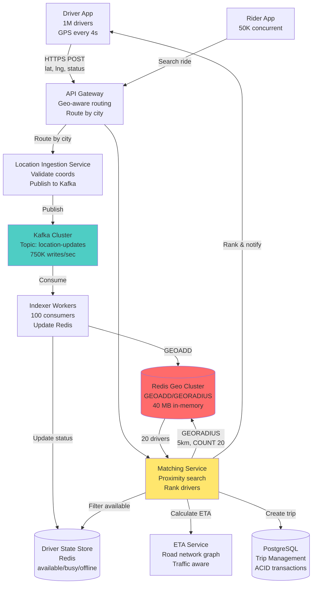

---

## 2. Geo-Spatial Indexing Architecture

**Flow Explanation:**

This diagram illustrates how 2D coordinates (latitude, longitude) are transformed into a 1D searchable index using
Geohash encoding, enabling fast proximity queries.

**Steps:**

1. **Input:** Driver reports lat=37.7749, lng=-122.4194 (San Francisco)
2. **Geohash Encoding:** Convert to geohash string "9q8yy9" (6 characters = ~600m precision)
3. **Redis Storage:** Store in sorted set with geohash as score
4. **Proximity Search:** Query by geohash prefix to find nearby drivers
5. **Result:** Return drivers within radius, sorted by distance

**Benefits:**

- **Fast lookups:** O(log N) for add, O(N log N) for radius search
- **Prefix matching:** Nearby locations share common prefixes
- **Range queries:** Single index scan for proximity search

**Trade-offs:**

- **Boundary problem:** Drivers near cell edges may be missed
- **Fixed grid:** Doesn't adapt to driver density (H3 is better)

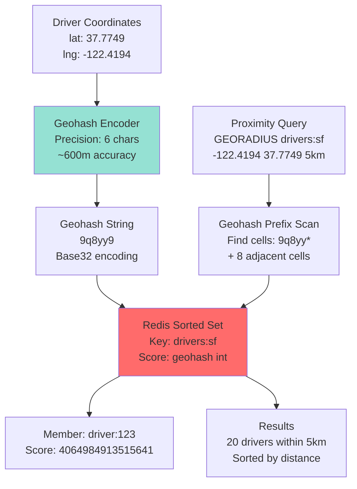

---

## 3. Location Ingestion Pipeline

**Flow Explanation:**

This diagram shows the asynchronous pipeline for processing 750K location updates per second from drivers, using Kafka
as a buffer to decouple producers from consumers.

**Steps:**

1. **Driver Update** (0ms): Driver app sends GPS coordinates via HTTPS POST
2. **API Gateway** (10ms): Load balancer routes to nearest datacenter
3. **Location Service** (20ms): Validates coordinates, checks driver authentication
4. **Kafka Publish** (5ms): Fire-and-forget, returns 200 OK to driver immediately
5. **Kafka Replication** (async): Replicate to 3 brokers for durability
6. **Indexer Consumption** (100-500ms): 100 workers pull from Kafka at sustainable rate
7. **Redis Update** (10ms): GEOADD updates driver position in geo-index

**Performance:**

- **Driver response time:** 35ms (driver doesn't wait for DB write)
- **End-to-end latency:** 200-500ms (update visible to riders)
- **Throughput:** 750K updates/sec buffered by Kafka

**Benefits:**

- **Non-blocking:** Drivers get instant response
- **Fault tolerant:** Kafka replication survives broker failures
- **Scalable:** Add more indexer workers to increase throughput

**Trade-offs:**

- **Eventual consistency:** Slight delay before riders see updated position
- **Kafka cost:** Requires 3-node Kafka cluster (~$15K/month)

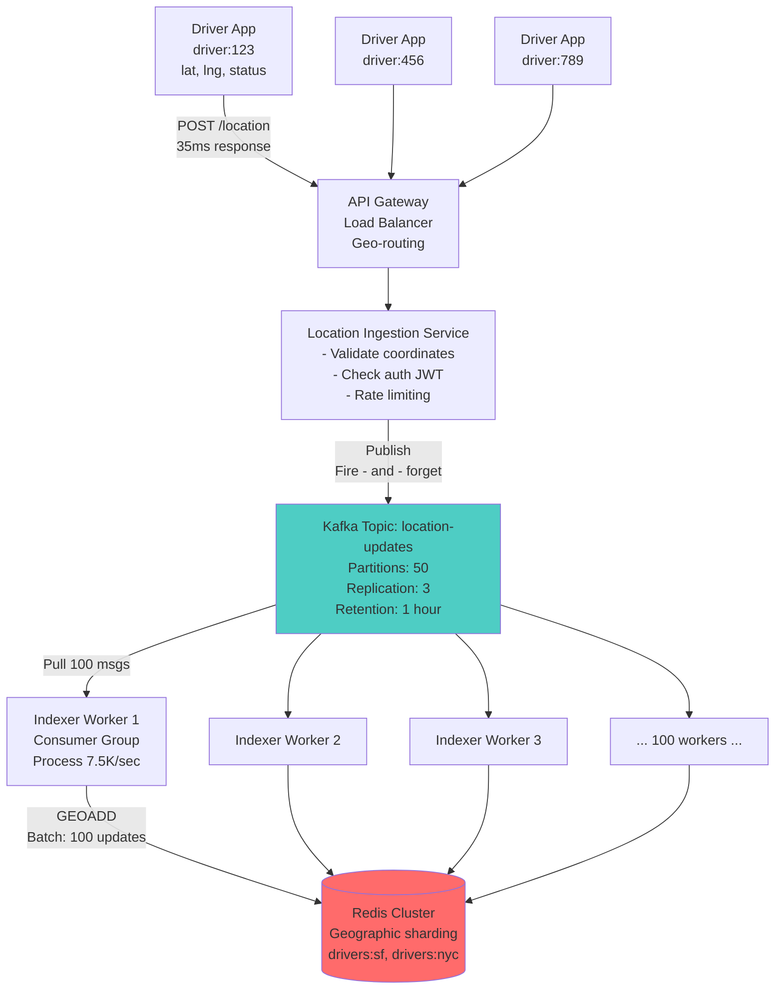

---

## 4. Matching Service Architecture

**Flow Explanation:**

This diagram illustrates the multi-stage pipeline for matching a rider with the optimal driver, considering proximity,
availability, ETA, and rating.

**Steps:**

1. **Rider Request:** Rider opens app, requests ride
2. **Proximity Search:** GEORADIUS query finds 20 nearest drivers within 5km
3. **Availability Filter:** Query Driver State Store, remove busy/offline drivers
4. **ETA Calculation:** For each available driver, calculate travel time using road network
5. **Ranking:** Score = 0.7 × distance + 0.2 × ETA + 0.1 × rating
6. **Top-K Selection:** Return top 5 drivers to rider
7. **Broadcast:** Send push notification to all 5 drivers
8. **First Accept Wins:** First driver to accept gets the trip

**Performance:**

- **Total latency:** 80-100ms (p99)
- **Breakdown:** Redis (10ms) + Filter (5ms) + ETA (50ms) + Ranking (5ms)

**Benefits:**

- **Fast matching:** Sub-100ms response time
- **High acceptance rate:** 5 drivers = 80% acceptance probability
- **Fair distribution:** Ranking considers multiple factors

**Trade-offs:**

- **Wasted notifications:** 4 drivers receive request but don't get trip
- **ETA cost:** External API call adds latency

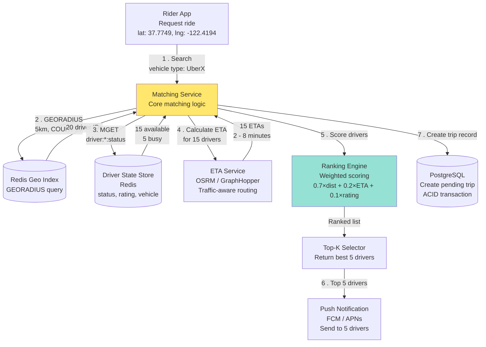

---

## 5. Driver State Management

**Flow Explanation:**

This diagram shows how driver status (available, busy, offline, on_break) is tracked in a separate Redis store,
independent of the geo-index.

**States:**

- **available:** Driver online, ready to accept trips
- **busy:** Driver on active trip
- **offline:** Driver logged out
- **on_break:** Driver online but not accepting trips

**Transitions:**

1. Driver logs in → **offline** → **available**
2. Driver accepts trip → **available** → **busy**
3. Trip ends → **busy** → **available**
4. Driver takes break → **available** → **on_break**
5. Driver logs out → any state → **offline**

**Data Model:**

```
Key: driver:{driver_id}:status
Value: {status: "available", rating: 4.8, vehicle: "UberX", updated_at: timestamp}
TTL: 60 seconds (refresh on each heartbeat)
```

**Benefits:**

- **Fast filtering:** MGET retrieves 20 driver statuses in <5ms
- **Separation of concerns:** Geo-index only stores location, not mutable state
- **TTL auto-cleanup:** Crashed drivers expire automatically

**Trade-offs:**

- **Two stores:** Need to maintain consistency between Redis Geo and State Store
- **Race conditions:** Driver might accept multiple trips if status update is slow

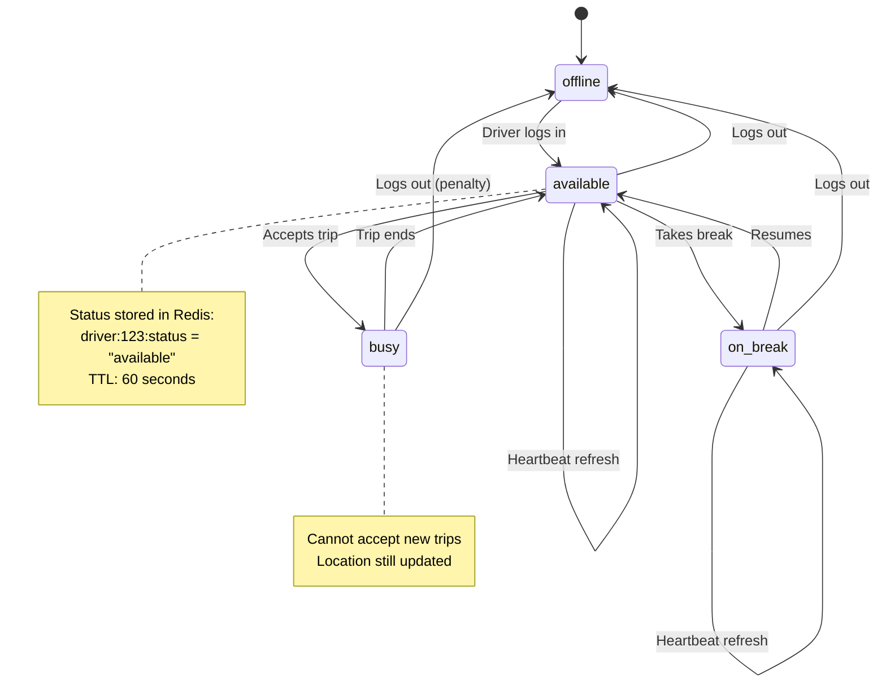

---

## 6. Geographic Sharding Strategy

**Flow Explanation:**

This diagram illustrates how the system shards data by city/region to achieve horizontal scalability and reduce
cross-region latency.

**Sharding Strategy:**

- **Key:** City code (sf, nyc, lon, par, tok)
- **Routing:** API Gateway routes based on GPS coordinates
- **Shard examples:**
    - drivers:sf → San Francisco Bay Area (37.7N, 122.4W)
    - drivers:nyc → New York City (40.7N, 74.0W)
    - drivers:lon → London (51.5N, 0.1W)

**Benefits:**

- **Horizontal scaling:** Add new Redis clusters per city
- **Low latency:** Riders query local shard (< 10ms)
- **Isolated failures:** NYC outage doesn't affect SF

**Trade-offs:**

- **Boundary problem:** Drivers near city edges may be in wrong shard
- **Cross-shard queries:** Riders near boundary need to query 2 shards
- **Shard imbalance:** Popular cities need larger clusters

**Edge Case Handling:**

- If rider is within 10 km of shard boundary, query both shards
- Merge results, sort by distance, return top 20

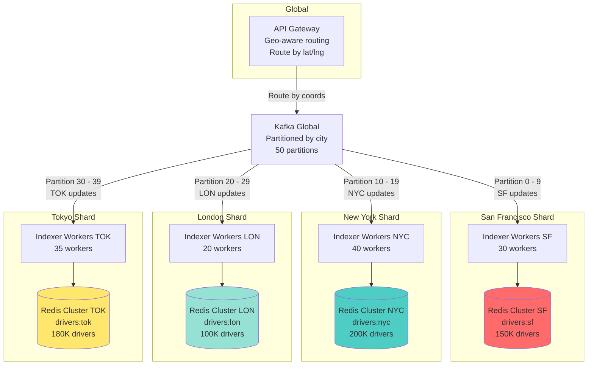

---

## 7. Geohash Cell Structure

**Flow Explanation:**

This diagram visualizes how Geohash divides the earth into a hierarchical grid of cells, with longer prefixes
representing smaller areas.

**Precision Levels:**

- **3 chars (9q8):** 156 km × 156 km (city level)
- **5 chars (9q8yy):** 4.9 km × 4.9 km (neighborhood level)
- **6 chars (9q8yy9):** 1.2 km × 0.6 km (street level)
- **7 chars (9q8yy9e):** 153 m × 153 m (building level)

**Proximity Search Algorithm:**

1. Convert rider coordinates to geohash: "9q8yy9"
2. Query target cell: "9q8yy9"
3. Query 8 adjacent cells: "9q8yy8", "9q8yyb", "9q8yyc", etc.
4. Merge results from all 9 cells
5. Filter by exact distance, sort, return top 20

**Benefits:**

- **Hierarchical:** Can zoom in/out by adjusting precision
- **Prefix matching:** Nearby cells share common prefix
- **Fixed grid:** Simple to implement and reason about

**Trade-offs:**

- **Boundary problem:** Drivers just outside cell boundary are missed
- **Non-uniform:** Cell sizes vary by latitude (smaller near poles)
- **Hotspots:** Popular areas cause uneven load distribution

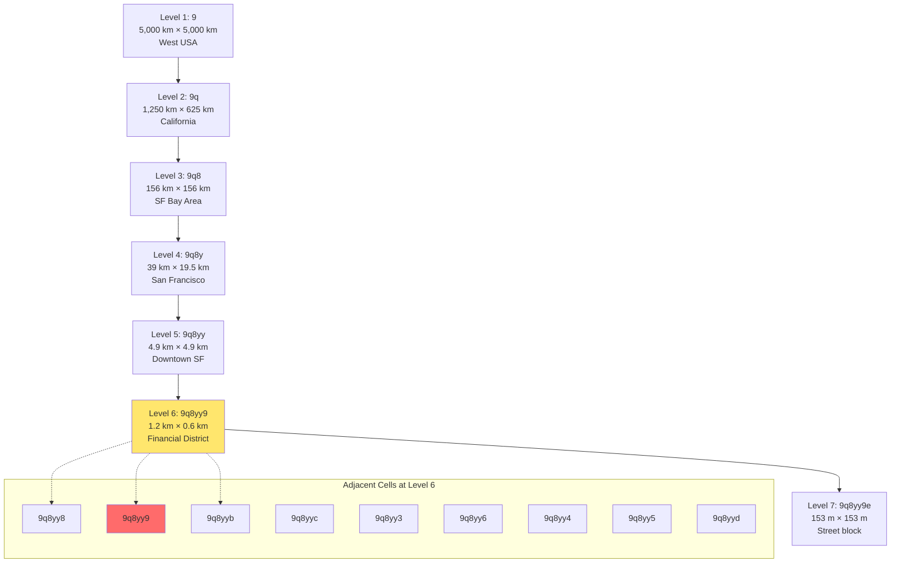

---

## 8. Redis Cluster Architecture

**Flow Explanation:**

This diagram shows the Redis Cluster setup for high availability, with 3 master nodes (sharded by geohash prefix) and 3
replica nodes for failover.

**Sharding Strategy:**

- **Master 1:** Geohash prefix 0-5 (9q8yy0 to 9q8yy5)
- **Master 2:** Geohash prefix 6-b (9q8yy6 to 9q8yyb)
- **Master 3:** Geohash prefix c-z (9q8yyc to 9q8yyz)

**Replication:**

- Each master has 1 replica (async replication)
- Replica auto-promotes to master on failure
- Sentinel monitors cluster health

**Performance:**

- **Throughput:** 250K writes/sec (distributed across 3 masters)
- **Latency:** <5ms p99 (in-memory)
- **Availability:** 99.99% (auto-failover)

**Benefits:**

- **Horizontal scaling:** Add more master nodes as load increases
- **High availability:** Survives single node failure
- **Read scaling:** Replicas can serve GEORADIUS queries

**Trade-offs:**

- **Eventual consistency:** Replicas lag by 10-100ms
- **Complex ops:** Cluster rebalancing requires downtime
- **Cost:** 6 nodes = ~$20K/month

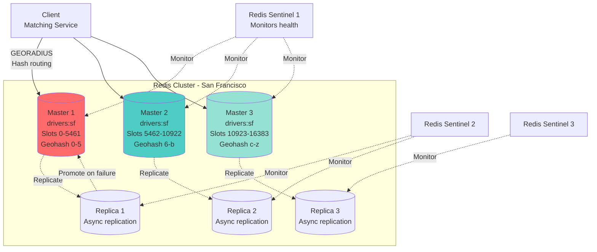

---

## 9. ETA Calculation Service

**Flow Explanation:**

This diagram illustrates the ETA calculation service that computes travel time from driver to rider using road network
graphs and real-time traffic data.

**Components:**

1. **Road Network Graph:** Pre-processed OpenStreetMap data with 100M+ nodes
2. **OSRM (Open Source Routing Machine):** Contraction Hierarchies algorithm
3. **Traffic Service:** Real-time traffic speeds from historical data + current conditions
4. **A* Pathfinding:** Finds shortest path considering traffic

**Steps:**

1. Matching Service sends driver_lat, driver_lng, rider_lat, rider_lng
2. OSRM queries graph to find shortest path
3. Traffic Service adjusts edge weights based on current traffic
4. Calculate total time = distance / speed (adjusted for traffic)
5. Return ETA: 5.2 minutes

**Performance:**

- **Latency:** 30-50ms per ETA calculation
- **Accuracy:** ±2 minutes (90% of the time)
- **Throughput:** 10K ETA calculations/sec

**Benefits:**

- **Accurate:** Considers real roads, not straight-line distance
- **Traffic-aware:** Adjusts for congestion
- **Scalable:** OSRM is optimized for high throughput

**Trade-offs:**

- **External dependency:** OSRM failure blocks matching
- **Cold start:** First query to new region is slow (cache miss)
- **Cost:** OSRM cluster + traffic data = ~$10K/month

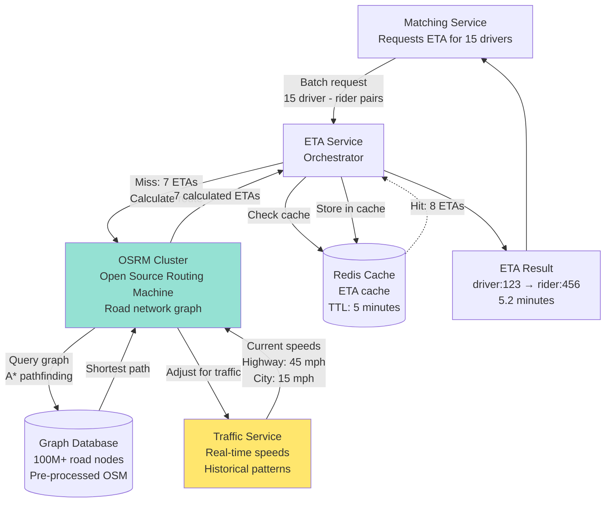

---

## 10. Trip State Machine

**Flow Explanation:**

This diagram shows the complete trip lifecycle state machine, from rider request to trip completion and payment.

**States:**

- **REQUESTED:** Rider submits ride request
- **SEARCHING:** Matching service finding drivers
- **PENDING:** Drivers notified, waiting for acceptance
- **ACCEPTED:** Driver accepted, navigating to pickup
- **ARRIVED:** Driver at pickup location
- **ACTIVE:** Trip in progress (rider in vehicle)
- **COMPLETED:** Trip ended, awaiting payment
- **PAID:** Payment processed successfully
- **CANCELLED:** Trip cancelled (by rider or driver)
- **FAILED:** Payment failed or system error

**Critical Transitions:**

- **PENDING → ACCEPTED:** First driver to accept wins (atomic CAS operation)
- **ACTIVE → COMPLETED:** Automatic on GPS detection (driver stopped at destination)
- **COMPLETED → PAID:** Payment processing with retry logic

**Data Model:**

```
trip_id: UUID
status: enum (REQUESTED, SEARCHING, PENDING, ...)
rider_id: user:123
driver_id: driver:456
pickup: {lat, lng, address}
destination: {lat, lng, address}
price: $15.50
created_at: timestamp
updated_at: timestamp
```

**Benefits:**

- **Clear state:** Easy to debug and monitor
- **Idempotent:** Can replay state transitions safely
- **Audit trail:** All transitions logged to PostgreSQL

**Trade-offs:**

- **Complex error handling:** Many edge cases (driver crash, payment failure)
- **State synchronization:** Mobile app state must match backend

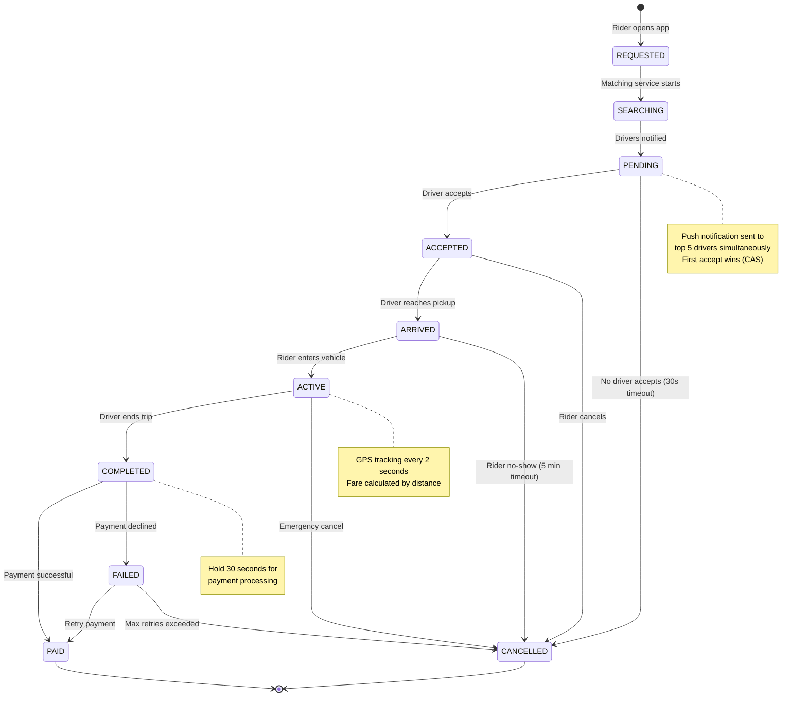

---

## 11. Surge Pricing Engine

**Flow Explanation:**

This diagram illustrates the surge pricing algorithm that dynamically adjusts prices based on supply (drivers) and
demand (riders) in each geohash cell.

**Algorithm:**

1. **Count Supply:** Number of available drivers in geohash cell "9q8yy"
2. **Count Demand:** Number of pending ride requests in same cell
3. **Calculate Ratio:** demand / supply
4. **Apply Multiplier:**
    - Ratio < 0.5: 1.0× (no surge)
    - Ratio 0.5-1.0: 1.2×
    - Ratio 1.0-2.0: 1.5×
    - Ratio 2.0-5.0: 2.0×
    - Ratio > 5.0: 3.0× (max cap)
5. **Update Price:** Base fare × multiplier
6. **Notify Riders:** "Prices are higher due to demand"

**Update Frequency:**

- Recalculate every 30 seconds per geohash cell
- Push updates to rider app via WebSocket

**Benefits:**

- **Balances supply/demand:** High prices incentivize more drivers
- **Revenue optimization:** Earn more during peak hours
- **Transparent:** Riders see multiplier before booking

**Trade-offs:**

- **Rider frustration:** High surge prices reduce bookings
- **PR risk:** "Price gouging" during emergencies
- **Gaming:** Drivers may go offline to trigger surge

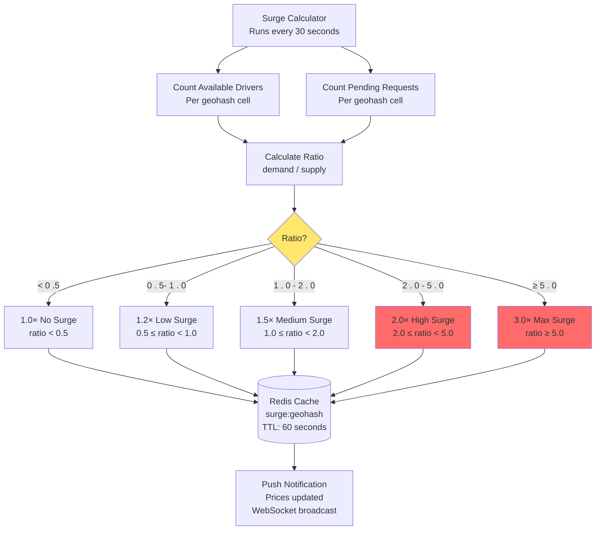

---

## 12. Multi-Region Deployment

**Flow Explanation:**

This diagram shows the global multi-region architecture for Uber, with independent deployments in each region and a
global coordination layer.

**Regions:**

- **US West (SF):** 150K drivers, 3 Redis clusters, 5 Kafka brokers
- **US East (NYC):** 200K drivers, 4 Redis clusters, 6 Kafka brokers
- **Europe (LON):** 100K drivers, 2 Redis clusters, 4 Kafka brokers
- **Asia (TOK):** 180K drivers, 3 Redis clusters, 5 Kafka brokers

**Global Services:**

- **Global API Gateway:** Routes to nearest region by IP geolocation
- **Global Trip DB:** PostgreSQL with multi-region replication (async)
- **Global Analytics:** Aggregates metrics from all regions

**Data Residency:**

- Driver locations stored locally in each region
- Trip data replicated to global DB (compliance: GDPR, CCPA)
- Analytics data aggregated to central warehouse

**Benefits:**

- **Low latency:** Riders query local datacenter (<50ms)
- **Regional isolation:** London outage doesn't affect SF
- **Compliance:** Data stored in region of origin

**Trade-offs:**

- **Complex deployment:** 4× infrastructure cost
- **Data synchronization:** Global DB lags by 1-5 seconds
- **Cross-region trips:** Requires special handling (rare)

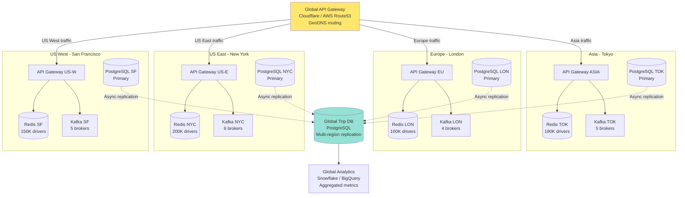

---

## 13. Hot Spot Mitigation Strategy

**Flow Explanation:**

This diagram illustrates strategies for handling hotspots (popular locations like airports, stadiums) where driver
density is 100× higher than normal.

**Problem:**

- Airport geohash "9q8yyy" has 5,000 drivers
- Single Redis master can't handle 50K writes/sec for one cell
- GEORADIUS queries become slow (O(N log N) where N=5,000)

**Solutions:**

**1. Sub-sharding (Spatial):**

- Split hotspot cell into 4 sub-cells (9q8yyy0, 9q8yyy1, 9q8yyy2, 9q8yyy3)
- Route drivers to sub-cell based on lat/lng hash
- Query all 4 sub-cells during search

**2. Read Replicas:**

- Add 3 read replicas for hotspot shard
- Route GEORADIUS queries to replicas
- Master only handles writes

**3. Local L1 Cache:**

- Cache top 100 drivers in each geohash in API Gateway
- TTL: 2 seconds
- Serve 80% of queries from cache

**4. Dynamic Precision:**

- If cell has > 1,000 drivers, increase geohash precision to 7 characters
- Subdivides area into smaller cells
- Reduces drivers per cell

**Benefits:**

- **Distributed load:** No single Redis master overwhelmed
- **Fast queries:** Smaller cells = faster GEORADIUS
- **Scalable:** Can handle 10× driver density

**Trade-offs:**

- **Complexity:** Need to detect and handle hotspots dynamically
- **Cost:** Additional read replicas + cache layers

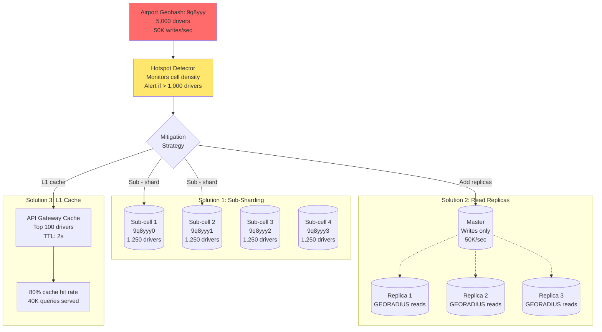

---

## 14. Monitoring and Observability Dashboard

**Flow Explanation:**

This diagram shows the key metrics and alerts monitored for the Uber ride matching system.

**Key Metrics:**

**Performance:**

- **GEORADIUS p99 latency:** <10ms (alert if >50ms)
- **Matching service p99 latency:** <100ms (alert if >200ms)
- **ETA calculation p99 latency:** <50ms (alert if >100ms)

**Throughput:**

- **Location updates/sec:** 750K (alert if <500K, indicates driver app issues)
- **Proximity searches/sec:** 50K (correlates with revenue)
- **Trip creations/sec:** 10K

**System Health:**

- **Kafka consumer lag:** <1,000 messages (alert if >10,000)
- **Redis cluster health:** All nodes online (alert on failover)
- **Driver connection rate:** >95% (alert if <90%)

**Business Metrics:**

- **Driver acceptance rate:** >70% (alert if <50%)
- **Rider abandonment rate:** <10% (alert if >20%)
- **Average matching time:** <5 seconds (alert if >10s)

**Alerts:**

- **P0 (Critical):** Redis cluster down, Kafka cluster down
- **P1 (High):** Matching latency >200ms, consumer lag >10K
- **P2 (Medium):** Acceptance rate <50%, abandonment >20%

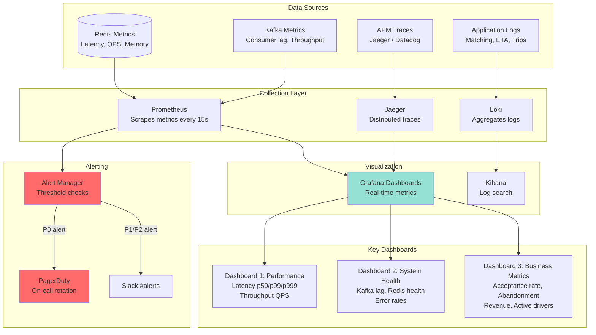
