# Uber/Lyft Ride Matching System - Sequence Diagrams

## Table of Contents

1. [Driver Location Update Flow](#1-driver-location-update-flow)
2. [Rider Search and Matching Flow](#2-rider-search-and-matching-flow)
3. [Trip Acceptance Flow (First Driver Wins)](#3-trip-acceptance-flow-first-driver-wins)
4. [Trip Lifecycle - Complete Flow](#4-trip-lifecycle---complete-flow)
5. [ETA Calculation Flow](#5-eta-calculation-flow)
6. [Surge Pricing Activation Flow](#6-surge-pricing-activation-flow)
7. [Driver Heartbeat and Timeout Flow](#7-driver-heartbeat-and-timeout-flow)
8. [Geohash Boundary Query Flow](#8-geohash-boundary-query-flow)
9. [Redis Cluster Failover Flow](#9-redis-cluster-failover-flow)
10. [Kafka Consumer Lag Recovery Flow](#10-kafka-consumer-lag-recovery-flow)
11. [Cross-City Trip Handoff Flow](#11-cross-city-trip-handoff-flow)
12. [Payment Processing with Retry Flow](#12-payment-processing-with-retry-flow)

---

## 1. Driver Location Update Flow

**Flow:**

Shows the asynchronous pipeline for processing a driver's GPS update, from mobile app to Redis geo-index.

**Steps:**
1. **Driver App** (0ms): GPS sensor detects new coordinates (lat, lng)
2. **HTTPS POST** (10ms): Send location to API Gateway with auth token
3. **API Gateway** (5ms): Validate JWT, rate limit check, route by city
4. **Location Service** (10ms): Validate coordinates (valid lat/lng range), enrich with timestamp
5. **Kafka Publish** (5ms): Publish to "location-updates" topic, return 200 OK immediately
6. **Driver receives ACK** (30ms total): Driver app doesn't wait for DB write
7. **Kafka Replication** (async, 50-100ms): Replicate to 3 brokers for durability
8. **Indexer Worker** (100-500ms): Consumer pulls message from Kafka partition
9. **Redis GEOADD** (10ms): Update driver position in geo-index
10. **Status Update** (5ms): Update driver status in separate Redis store

**Performance:**
- **Driver response time:** 30ms (fire-and-forget)
- **End-to-end latency:** 200-500ms (update visible to riders)
- **Throughput:** 750K updates/sec buffered by Kafka

**Benefits:**
- Non-blocking for driver (instant ACK)
- Kafka absorbs traffic spikes
- Decoupled pipeline (failure isolation)

**Trade-offs:**
- Eventual consistency (slight delay)
- Kafka operational complexity

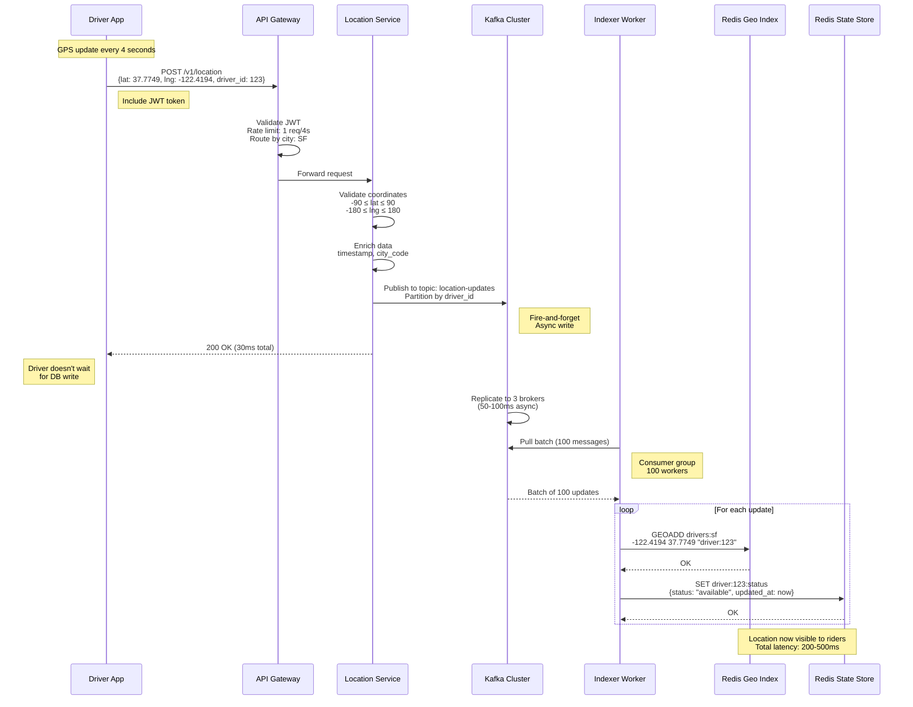

---

## 2. Rider Search and Matching Flow

**Flow:**

Shows the complete flow of a rider requesting a ride, from opening the app to receiving top 5 driver options.

**Steps:**
1. **Rider opens app** (0ms): App loads current GPS location
2. **Search request** (10ms): POST /v1/rides/search with pickup location
3. **Matching Service** (0ms): Receives request, starts matching algorithm
4. **GEORADIUS query** (10ms): Find 20 nearest drivers within 5km radius
5. **Filter availability** (5ms): Query driver status, remove busy/offline (15 available)
6. **Calculate ETAs** (50ms): For each driver, call ETA service (parallel batch request)
7. **Rank drivers** (5ms): Score = 0.7×distance + 0.2×ETA + 0.1×rating
8. **Select top 5** (1ms): Return best 5 drivers to rider
9. **Display on map** (100ms total): Rider sees 5 drivers with ETAs

**Performance:**
- **Total latency:** 80-100ms (p99)
- **Breakdown:** Redis (10ms) + Filter (5ms) + ETA (50ms) + Ranking (5ms)

**Benefits:**
- Fast matching prevents rider abandonment
- Parallel ETA calculation reduces latency
- Multiple drivers increase acceptance rate

**Trade-offs:**
- ETA service is bottleneck (50ms)
- 15 ETA calculations per search (expensive)

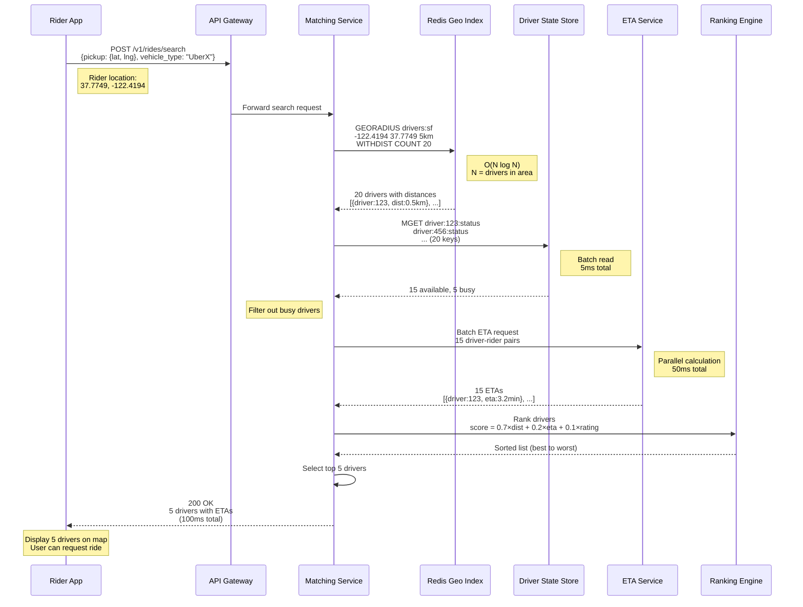

---

## 3. Trip Acceptance Flow (First Driver Wins)

**Flow:**

Shows the race condition when 5 drivers are notified simultaneously, and only the first to accept gets the trip.

**Steps:**
1. **Rider confirms ride** (0ms): Rider taps "Request UberX"
2. **Create pending trip** (20ms): Insert trip record in PostgreSQL with status=PENDING
3. **Broadcast to 5 drivers** (50ms): Send push notifications via FCM/APNs
4. **Drivers receive notification** (100-500ms): Variable latency due to mobile network
5. **Driver 1 accepts first** (200ms): Taps "Accept" button
6. **Atomic CAS operation** (10ms): UPDATE trips SET status=ACCEPTED, driver_id=123 WHERE trip_id=456 AND status=PENDING
7. **CAS succeeds for Driver 1** (success): Trip assigned to Driver 1
8. **Drivers 2-5 accept** (220-300ms): Slightly slower
9. **CAS fails for Drivers 2-5** (fail): status already ACCEPTED, no update
10. **Notify Driver 1** (success): "Trip assigned! Navigate to pickup."
11. **Notify Drivers 2-5** (fail): "Trip already taken"

**Performance:**
- **First driver response:** 200ms
- **Total acceptance window:** 30 seconds (timeout)

**Benefits:**
- Atomic operation prevents double-assignment
- Fair: Fastest driver wins
- High acceptance rate (5 drivers = 80% chance)

**Trade-offs:**
- 4 wasted notifications per trip
- Drivers frustrated by missed opportunities

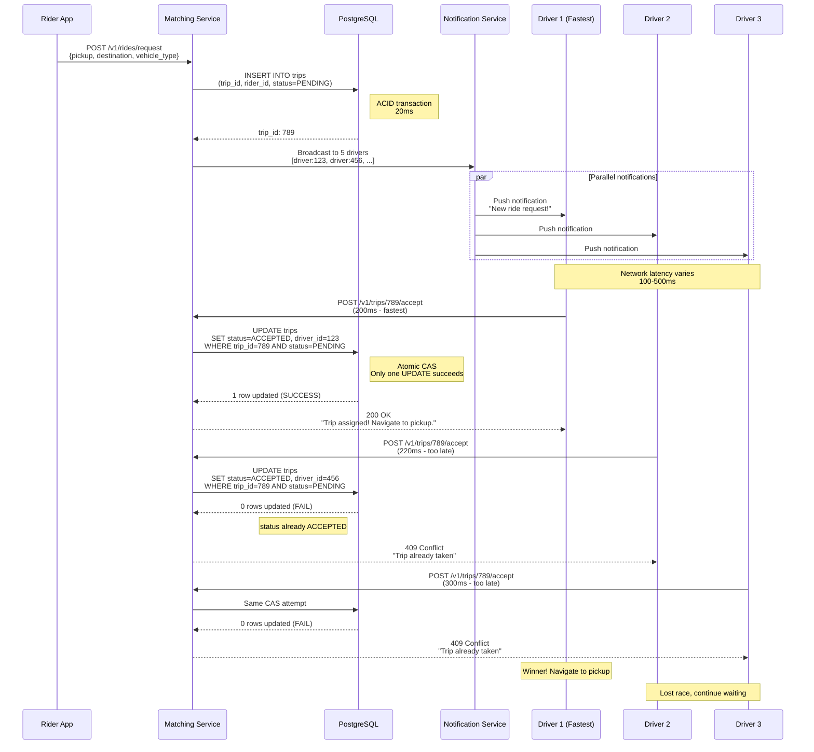

---

## 4. Trip Lifecycle - Complete Flow

**Flow:**

Shows the complete end-to-end trip lifecycle from request to payment completion.

**Steps:**
1. **REQUESTED** (0s): Rider submits ride request
2. **SEARCHING** (0-2s): Matching service finds drivers
3. **PENDING** (2-30s): Drivers notified, waiting for acceptance
4. **ACCEPTED** (30s): Driver 1 accepts, navigates to pickup
5. **ARRIVED** (5-10min): Driver reaches pickup location
6. **ACTIVE** (10-30min): Rider in vehicle, trip in progress
7. **COMPLETED** (30min): Driver ends trip at destination
8. **PAID** (30.5min): Payment processed successfully

**Performance:**
- **Average trip duration:** 15 minutes
- **Payment processing:** 10-30 seconds
- **Total lifecycle:** 20-40 minutes

**Benefits:**
- Clear state transitions
- Easy to debug and monitor
- Idempotent state machine

**Trade-offs:**
- Many edge cases (no-show, cancellation, payment failure)
- Complex error handling

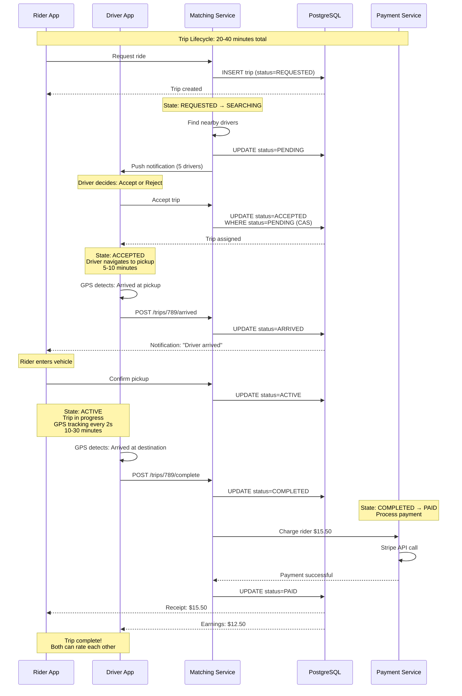

---

## 5. ETA Calculation Flow

**Flow:**

Shows how ETA is calculated using road network graphs and real-time traffic data.

**Steps:**
1. **Matching Service** (0ms): Needs ETA for 15 driver-rider pairs
2. **Batch request** (5ms): Send all 15 pairs to ETA Service
3. **Cache check** (5ms): Query Redis cache for recent ETAs (8 hits, 7 misses)
4. **Return cached** (10ms): Return 8 cached ETAs immediately
5. **Calculate new** (50ms): For 7 misses, query OSRM routing engine
6. **OSRM pathfinding** (30ms): A* algorithm finds shortest path on road graph
7. **Traffic adjustment** (10ms): Adjust edge weights based on current traffic speeds
8. **Total time calculation** (5ms): Sum edge weights, convert to minutes
9. **Cache result** (5ms): Store in Redis with TTL=5 minutes
10. **Return all 15 ETAs** (60ms): Merge cached + calculated ETAs

**Performance:**
- **Cache hit rate:** 60% (8 out of 15)
- **Cached ETA latency:** 10ms
- **Calculated ETA latency:** 50ms
- **Average latency:** (8×10 + 7×50) / 15 = 28ms

**Benefits:**
- Cache reduces load on OSRM
- Batch requests improve efficiency
- Traffic-aware ETAs are accurate

**Trade-offs:**
- OSRM is single point of failure
- Cold start (new region) is slow
- Traffic data costs money

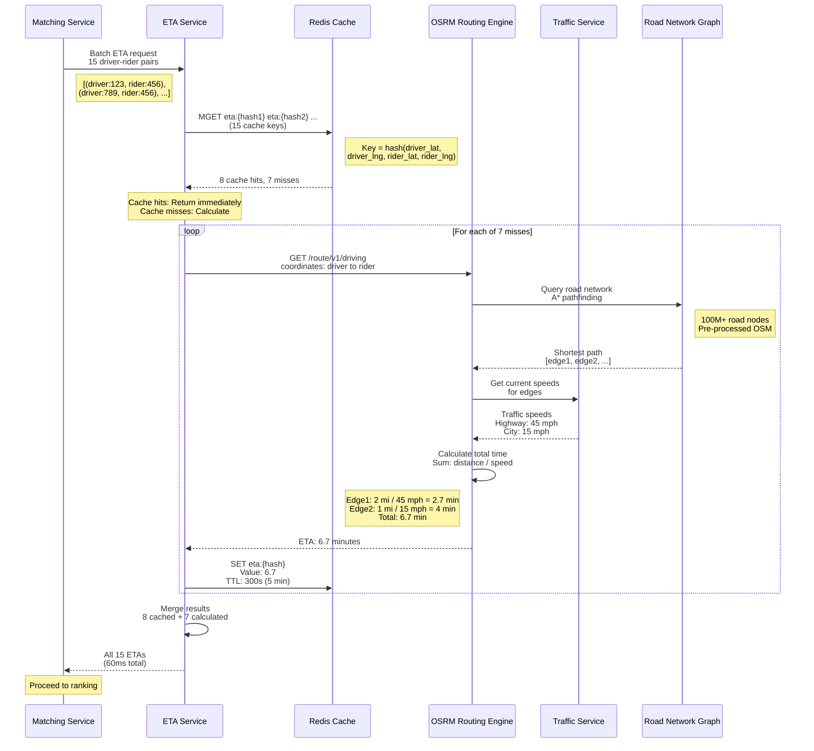

---

## 6. Surge Pricing Activation Flow

**Flow:**

Shows how surge pricing is dynamically calculated based on supply/demand ratio in each geohash cell.

**Steps:**
1. **Timer triggers** (every 30 seconds): Surge calculator runs
2. **Count available drivers** (10ms): Query Redis for drivers in geohash "9q8yy"
3. **Count pending requests** (10ms): Query PostgreSQL for pending trips in same cell
4. **Calculate ratio** (1ms): demand / supply = 50 requests / 20 drivers = 2.5
5. **Apply multiplier** (1ms): Ratio 2.5 → 2.0× surge (high surge bracket)
6. **Update cache** (5ms): SET surge:9q8yy = 2.0 with TTL=60s
7. **Notify riders** (100ms): WebSocket broadcast to all riders in cell
8. **Display surge** (0ms): Rider app shows "Prices are 2× higher due to increased demand"

**Performance:**
- **Calculation frequency:** Every 30 seconds per geohash
- **Total calculation time:** 30ms per cell
- **Cells monitored:** ~10,000 cells globally

**Benefits:**
- Balances supply and demand
- Incentivizes drivers to go to high-demand areas
- Revenue optimization

**Trade-offs:**
- Rider frustration with high prices
- PR risk ("price gouging")
- Drivers may game system

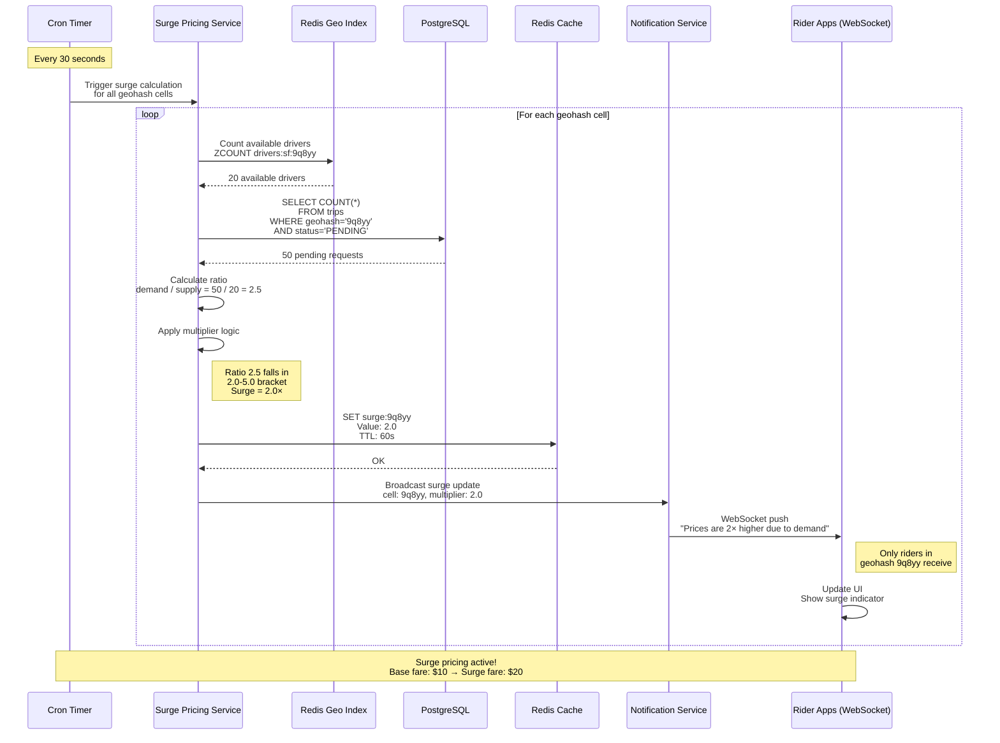

---

## 7. Driver Heartbeat and Timeout Flow

**Flow:**

Shows how the system detects crashed or disconnected drivers using heartbeat timeouts.

**Steps:**
1. **Driver online** (0s): Driver logs in, status=available
2. **Heartbeat sent** (every 4s): Driver sends location + heartbeat
3. **Update TTL** (4s): Redis key driver:123:status has TTL=60s, refresh on each heartbeat
4. **Network issue** (12s): Driver loses connection, no heartbeat for 60 seconds
5. **TTL expires** (72s): Redis automatically deletes driver:123:status key
6. **Cleanup job** (75s): Background job detects expired driver
7. **Remove from geo-index** (80s): ZREM drivers:sf driver:123
8. **Driver reappears** (100s): Network restored, driver sends heartbeat
9. **Re-add to index** (105s): GEOADD drivers:sf, driver visible again

**Performance:**
- **Heartbeat interval:** 4 seconds
- **Timeout threshold:** 60 seconds (15 missed heartbeats)
- **Cleanup delay:** 5-10 seconds after expiry

**Benefits:**
- Auto-cleanup of crashed drivers
- No manual intervention needed
- Riders don't see offline drivers

**Trade-offs:**
- 60-second delay before removal
- False positives during brief network issues
- Driver must re-authenticate after timeout

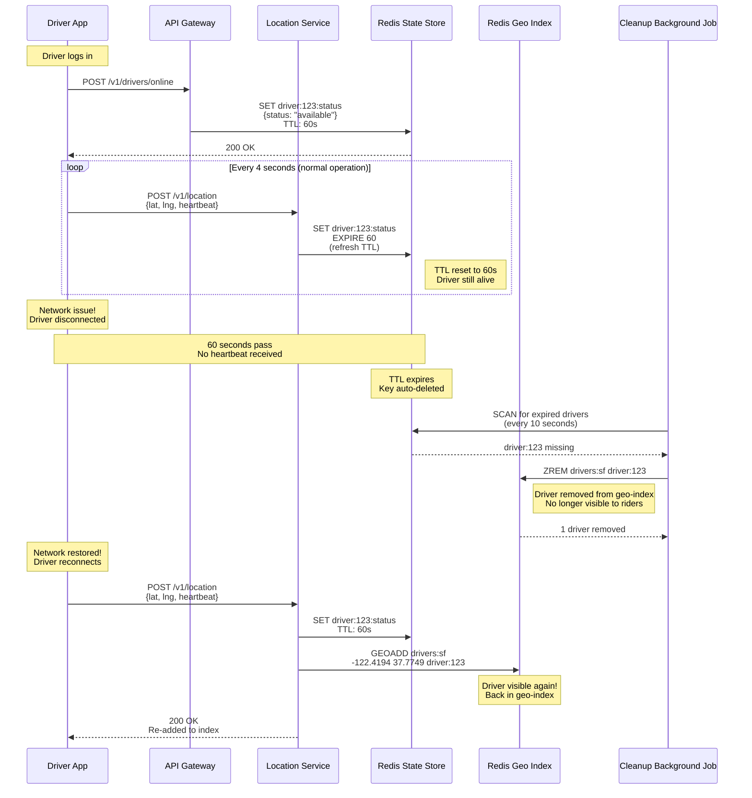

---

## 8. Geohash Boundary Query Flow

**Flow:**

Shows how to handle the edge case where a rider is near a geohash cell boundary, requiring queries to multiple adjacent cells.

**Steps:**
1. **Rider location** (0ms): Rider at lat=37.7749, lng=-122.4194 (cell "9q8yy9")
2. **Detect boundary** (5ms): Calculate distance to cell edges (150m to north edge)
3. **Query primary cell** (10ms): GEORADIUS in cell "9q8yy9" → 8 drivers found
4. **Insufficient results** (check): Need 20 drivers, only have 8
5. **Query adjacent cells** (30ms): Query 8 neighboring cells in parallel
6. **Merge results** (10ms): Combine all drivers from 9 cells → 45 drivers total
7. **Calculate exact distance** (20ms): Haversine formula for each driver
8. **Sort by distance** (5ms): Sort all 45 drivers
9. **Return top 20** (1ms): Select 20 nearest drivers

**Performance:**
- **Single cell query:** 10ms (fast)
- **Multi-cell query:** 80ms (slower but necessary)
- **Frequency:** 15% of queries are near boundaries

**Benefits:**
- No missed drivers near boundaries
- Complete coverage of search radius
- Accurate results

**Trade-offs:**
- 8× more Redis queries (expensive)
- Higher latency for boundary queries
- Increased Redis load

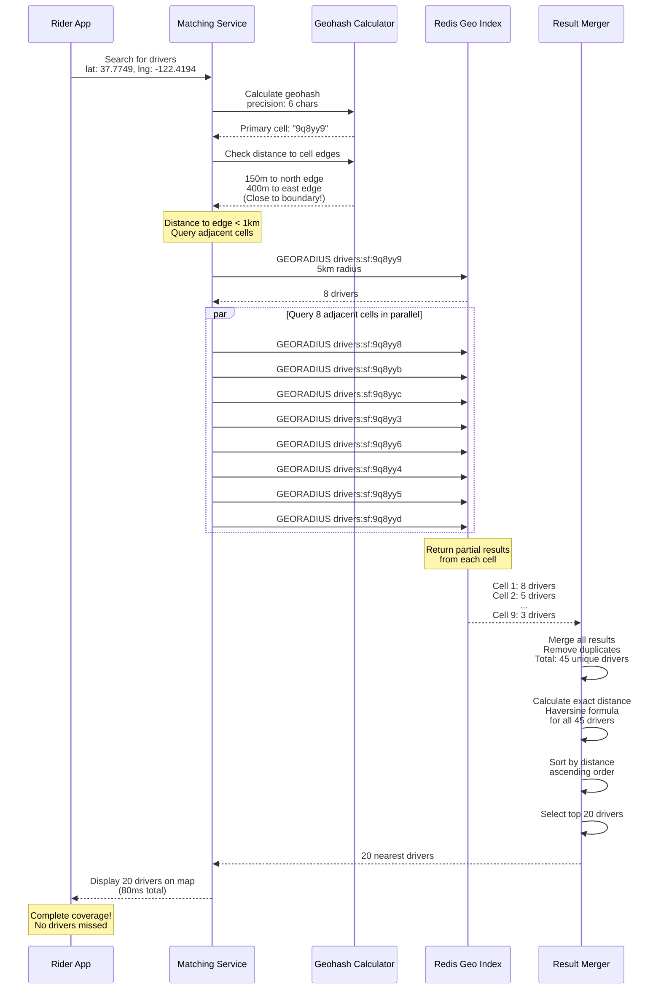

---

## 9. Redis Cluster Failover Flow

**Flow:**

Shows how the system handles Redis master node failure with automatic failover to replica.

**Steps:**
1. **Normal operation** (0s): Master node serving 250K writes/sec
2. **Master crashes** (10s): Master node becomes unresponsive
3. **Sentinel detects** (13s): Sentinel pings master, no response (3s timeout)
4. **Quorum vote** (15s): 3 Sentinels vote to promote replica
5. **Promote replica** (18s): Replica promoted to master
6. **Clients reconnect** (20s): Indexer workers detect master change, reconnect
7. **Resume writes** (25s): Writes resume to new master
8. **Data loss** (check): 0-100ms of writes lost (async replication lag)

**Performance:**
- **Detection time:** 3 seconds (Sentinel ping timeout)
- **Failover time:** 5 seconds (vote + promote)
- **Total downtime:** 8 seconds
- **Data loss:** 0-100ms of writes (acceptable)

**Benefits:**
- Automatic failover (no manual intervention)
- High availability (99.99%)
- Fast recovery

**Trade-offs:**
- 8-second write downtime
- Potential data loss (async replication)
- Requires 3+ Sentinel nodes

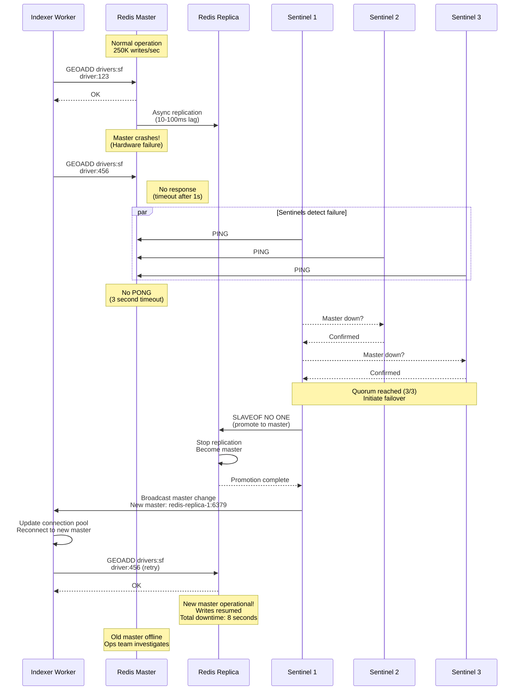

---

## 10. Kafka Consumer Lag Recovery Flow

**Flow:**

Shows how to recover when Kafka consumer lag exceeds 10,000 messages due to indexer worker crash or slowdown.

**Steps:**
1. **Normal operation** (0s): 100 workers consuming at 750K msgs/sec, lag=0
2. **Worker crashes** (60s): 10 workers crash, now only 90 workers
3. **Lag increases** (120s): Production rate > consumption rate, lag grows to 10,000
4. **Alert triggered** (125s): PagerDuty alert "Kafka consumer lag > 10K"
5. **Scale up workers** (180s): Deploy 20 new workers (total: 110)
6. **Catch up** (300s): Consumption rate > production rate, lag decreases
7. **Lag cleared** (600s): Lag back to 0, system stable

**Performance:**
- **Detection time:** 5 seconds (Prometheus alert)
- **Scale-up time:** 60 seconds (Kubernetes pod creation)
- **Recovery time:** 5 minutes (clear 10K backlog)

**Benefits:**
- Automatic detection via monitoring
- Scalable recovery (add more workers)
- No data loss (Kafka retains messages)

**Trade-offs:**
- Temporary delay in location updates (stale data)
- Riders may see outdated driver positions
- Cost of spinning up extra workers

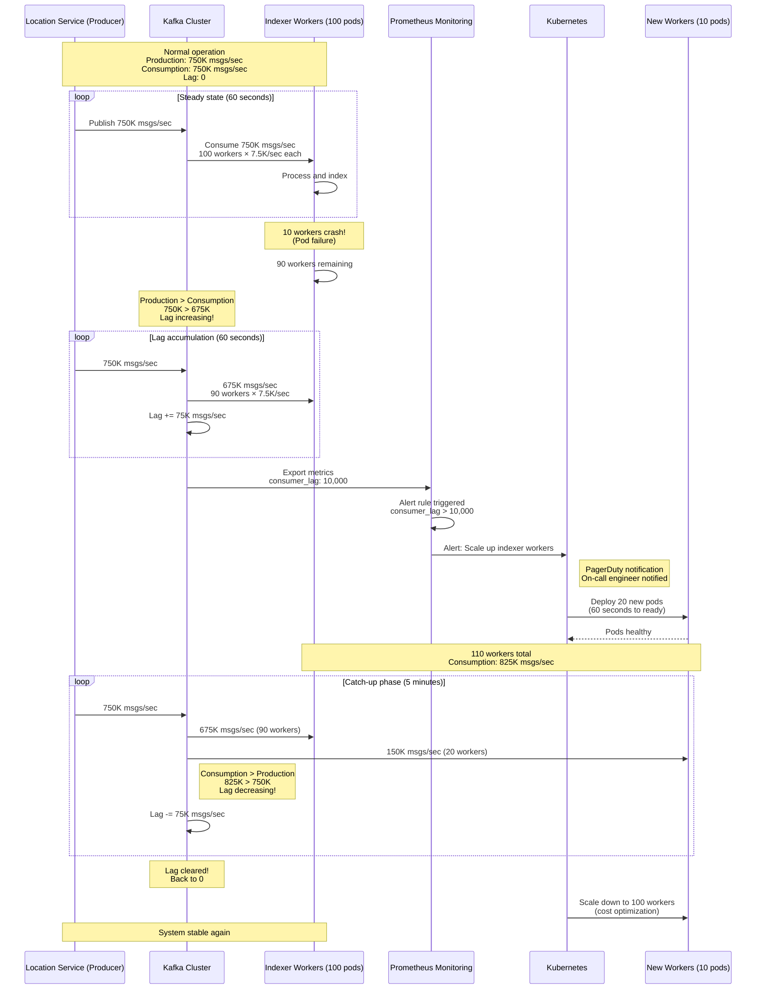

---

## 11. Cross-City Trip Handoff Flow

**Flow:**

Shows the rare but complex scenario where a trip starts in one city and ends in another (e.g., San Francisco to San Jose).

**Steps:**
1. **Trip starts** (0s): Rider in SF requests ride to San Jose (50 km away)
2. **Initial shard** (0s): Trip managed by SF shard (drivers:sf)
3. **Trip active** (10min): Driver driving south on Highway 101
4. **Boundary detection** (25min): GPS detects crossing city boundary (lat=37.3382)
5. **Trigger handoff** (25min): Trip Service initiates cross-shard handoff
6. **Update shards** (25.1min): Remove from SF shard, add to SJ shard
7. **Switch tracking** (25.1min): San Jose datacenter now tracks trip
8. **Trip completes** (40min): Arrival in San Jose, managed by SJ shard

**Performance:**
- **Handoff latency:** 100ms (seamless)
- **Frequency:** <1% of trips cross city boundaries

**Benefits:**
- Seamless experience for rider
- Correct regional attribution
- Local datacenter handles completion

**Trade-offs:**
- Complex coordination between shards
- Potential race conditions during handoff
- Edge case testing required

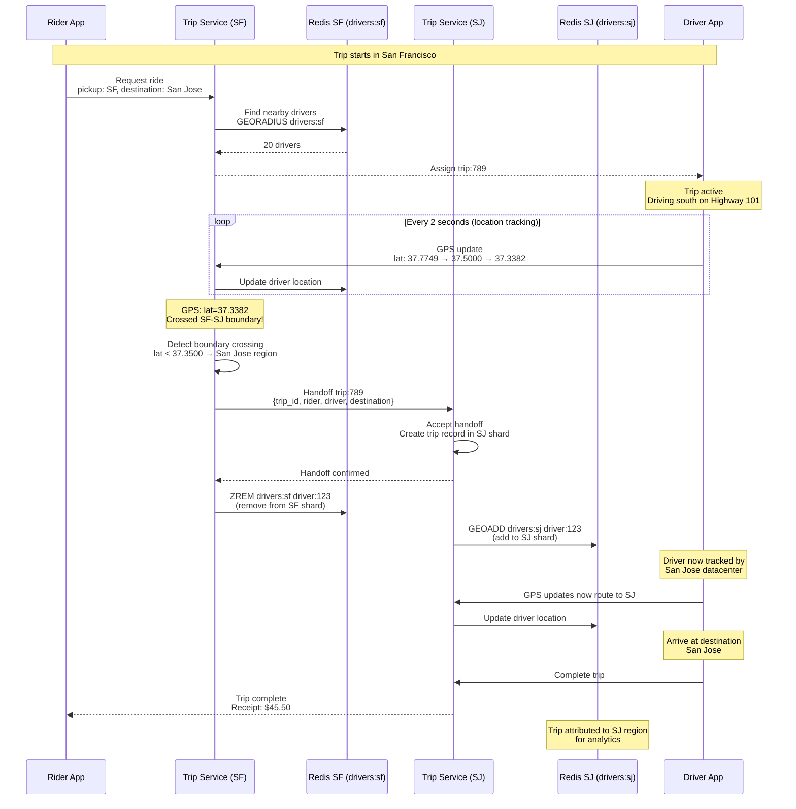

---

## 12. Payment Processing with Retry Flow

**Flow:**

Shows the payment processing flow with automatic retry logic for transient failures.

**Steps:**
1. **Trip completes** (0s): Driver ends trip, total fare: $15.50
2. **Payment request** (1s): Trip Service calls Payment Service
3. **Stripe API call** (2s): Payment Service charges card via Stripe
4. **Payment fails** (3s): Network timeout or card declined
5. **Retry attempt 1** (13s): Exponential backoff, retry after 10s
6. **Payment fails** (14s): Stripe still unavailable
7. **Retry attempt 2** (44s): Retry after 30s (exponential backoff)
8. **Payment succeeds** (45s): Stripe API returns success
9. **Update trip status** (46s): Trip status=PAID
10. **Notify rider** (47s): Receipt sent via email/push

**Performance:**
- **Success rate:** 99.5% (first attempt: 95%, retry: 4.5%)
- **Max retries:** 3 attempts
- **Total timeout:** 90 seconds

**Benefits:**
- Automatic retry handles transient failures
- Exponential backoff prevents overwhelming Stripe
- High success rate

**Trade-offs:**
- Delayed payment confirmation (up to 90s)
- Rider may wait for receipt
- Failed payments require manual follow-up

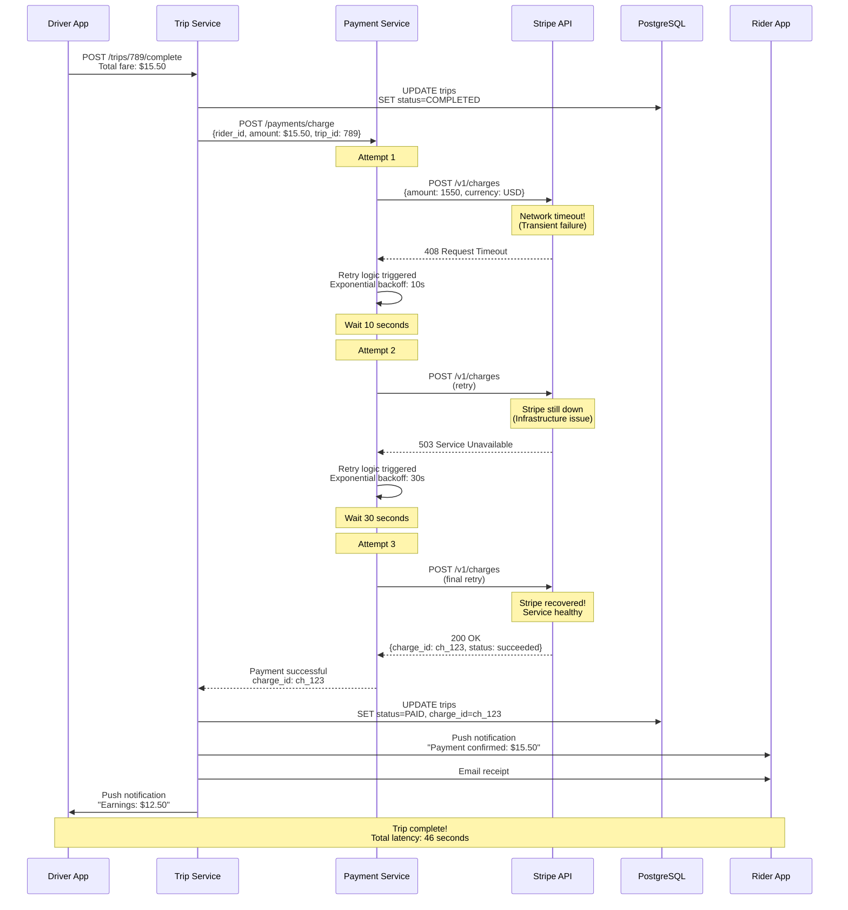
