# E-commerce Flash Sale System - High-Level Design

## Table of Contents

1. [Overall System Architecture](#1-overall-system-architecture)
2. [Inventory Management Flow](#2-inventory-management-flow)
3. [Multi-Layer Rate Limiting](#3-multi-layer-rate-limiting)
4. [Redis Atomic Operations](#4-redis-atomic-operations)
5. [Reservation System with TTL](#5-reservation-system-with-ttl)
6. [Split Counter Architecture](#6-split-counter-architecture)
7. [Payment Saga Pattern](#7-payment-saga-pattern)
8. [Load Shedding Strategy](#8-load-shedding-strategy)
9. [Idempotency Implementation](#9-idempotency-implementation)
10. [Redis Cluster Topology](#10-redis-cluster-topology)
11. [Cleanup Worker Process](#11-cleanup-worker-process)
12. [Bot Detection Pipeline](#12-bot-detection-pipeline)
13. [Monitoring Dashboard](#13-monitoring-dashboard)
14. [Failure Recovery Flow](#14-failure-recovery-flow)

---

## 1. Overall System Architecture

**Flow Explanation:**

This diagram shows the complete end-to-end architecture for the flash sale system, from user request to order
completion. The system handles 100K concurrent purchase attempts with only 100 items available, requiring aggressive
load shedding and atomic inventory operations.

**Key Components:**

1. **CDN + Load Balancer:** Geographic distribution, DDoS protection
2. **API Gateway:** Multi-layer rate limiting (Token bucket at edge)
3. **Reservation Service:** Core service managing atomic inventory operations
4. **Redis Cluster:** Hot key for inventory counter (100K ops/sec)
5. **Kafka:** Decouples reservation from slow payment processing
6. **Payment Saga:** Manages distributed transaction with compensation
7. **Cleanup Workers:** Background jobs for expired reservations

**Steps:**

1. 1M users click "Buy Now" at 12:00:00
2. CDN blocks 90% (900K) via token bucket rate limit
3. API Gateway queues 100K, processes 10K QPS
4. Reservation Service executes atomic Redis DECR
5. 100 succeed, 99,900 receive "SOLD_OUT" error
6. Kafka buffers 100 reservation events
7. Payment Service processes asynchronously (2-10 seconds)
8. Orders created in PostgreSQL (ACID)

**Performance:**

- User response time: <50ms (instant feedback)
- Rejection rate: 99.9% (expected)
- Throughput: 100K QPS peak (10K sustained)

**Benefits:**

- Prevents overselling (strong consistency)
- Fast user experience (async payment)
- Graceful degradation (load shedding)

**Trade-offs:**

- Complex architecture (many components)
- High infrastructure cost (~$7K/month)
- Eventual consistency (10-minute payment window)

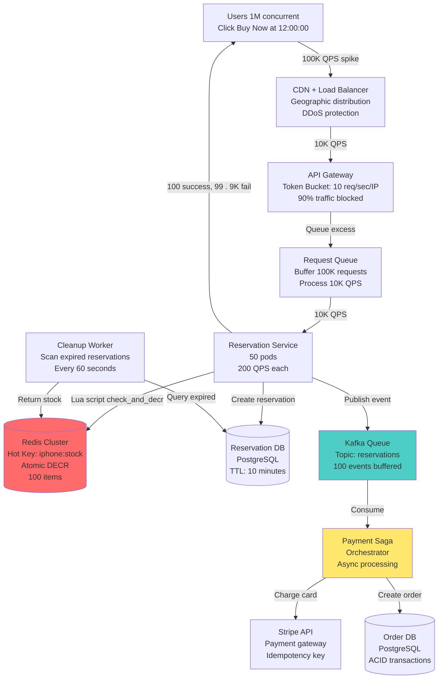

---

## 2. Inventory Management Flow

**Flow Explanation:**

This diagram illustrates the atomic inventory check-and-decrement operation using Redis Lua script. The Lua script
ensures that checking stock and decrementing happen atomically, preventing race conditions where two users could both
see stock available and both decrement (causing overselling).

**Steps:**

1. User sends reservation request
2. Reservation Service calls Redis with Lua script
3. Lua script executes atomically:
    - GET current stock (100)
    - IF stock > 0 THEN DECR (99)
    - ELSE return SOLD_OUT
4. Success → Create reservation record
5. Failure → Return error to user

**Why Lua Script?**

- **Atomicity:** Entire script executes as single operation
- **No race condition:** Other operations wait until script completes
- **Fast:** In-memory execution (<1ms)

**Performance:**

- Throughput: 100K ops/sec on single Redis master
- Latency: <1ms p99
- Accuracy: 100% (no overselling)

**Benefits:**

- Strong consistency (no overselling)
- High throughput (100K QPS)
- Simple implementation

**Trade-offs:**

- Single point of contention (one Redis key)
- Requires Lua scripting knowledge
- Redis crash loses data (mitigated by replication)

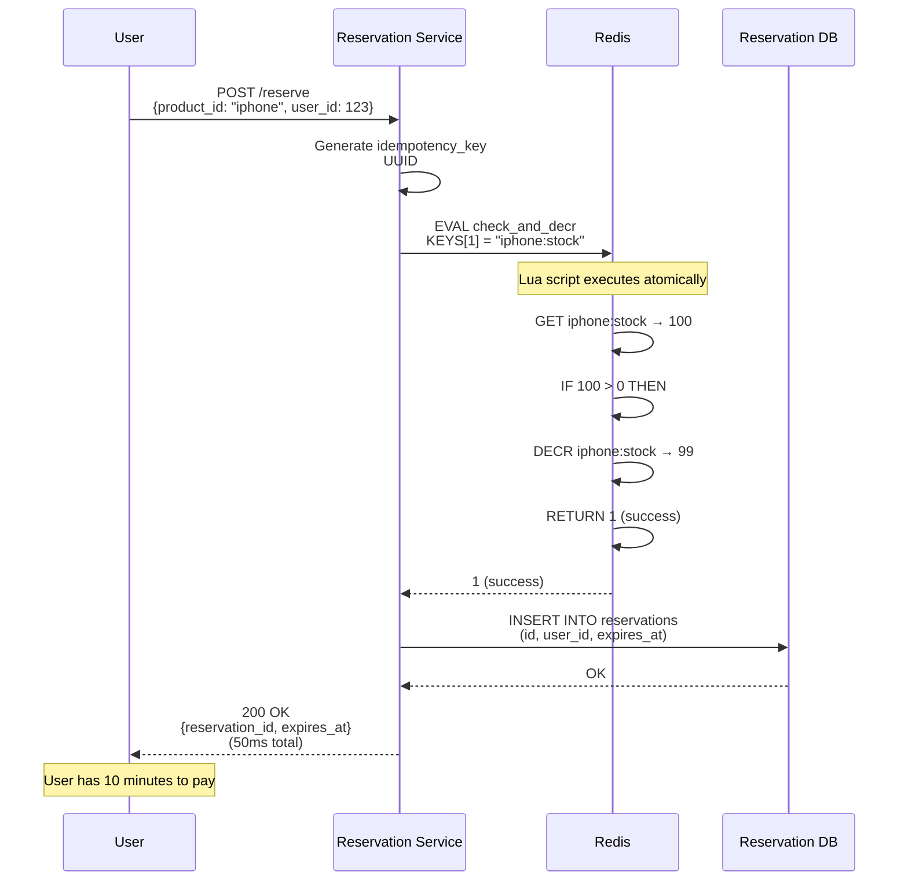

---

## 3. Multi-Layer Rate Limiting

**Flow Explanation:**

This diagram shows the three-layer rate limiting strategy that blocks 90% of traffic at the CDN edge, queues the
remaining 10% at API Gateway, and processes 10K QPS at the service layer.

**Layers:**

1. **CDN Edge (CloudFlare):**
    - Token Bucket: 10 requests/sec per IP
    - Blocks 90% (900K out of 1M users)
    - Cost: $0.0001 per request at edge (cheap)

2. **API Gateway (AWS):**
    - Leaky Bucket: 10K QPS total (all users)
    - Queues excess requests
    - Cost: $0.003 per request at gateway

3. **Service Layer:**
    - Concurrency Limit: 50 pods × 200 QPS = 10K total
    - Rejects when capacity exceeded
    - Cost: $0.05 per request at service (expensive)

**Why Multi-Layer?**

- Block most traffic at cheapest layer (CDN)
- Queue legitimate users at gateway
- Protect backend from overload

**Performance:**

- 1M users → 100K reach gateway → 10K reach service
- 99% rejection rate (expected for 100 items)
- $100 CDN cost vs $3K backend cost (30× savings)

**Benefits:**

- Cost optimization (block at edge)
- System stability (no overload)
- Fair access (token bucket allows bursts)

**Trade-offs:**

- High rejection rate (user frustration)
- False positives (legitimate users blocked)
- Complex configuration (3 systems)

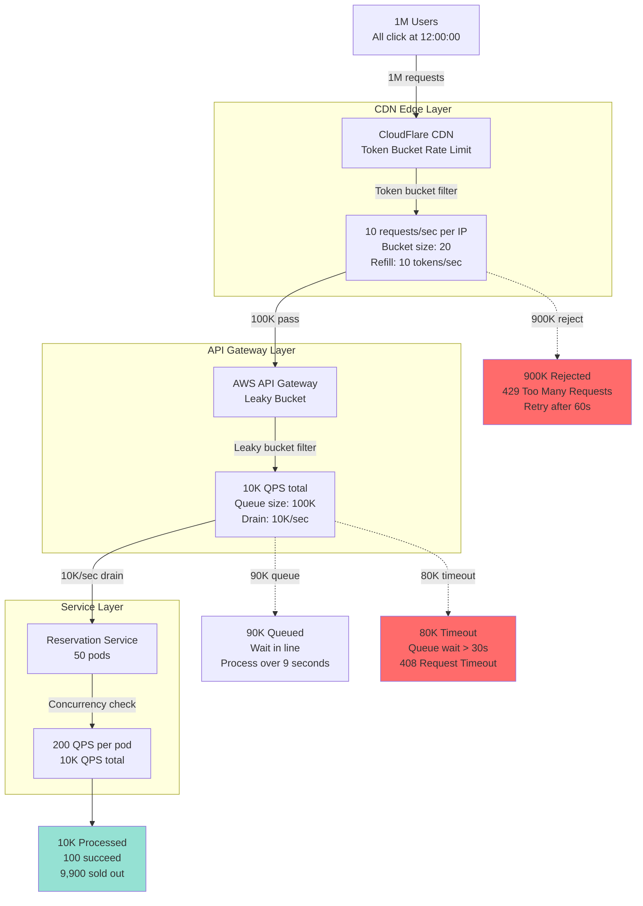

---

## 4. Redis Atomic Operations

**Flow Explanation:**

This diagram shows how Redis atomic operations prevent race conditions in high-concurrency scenarios. Without atomicity,
two users could both check stock (see 1 item), both think they can buy, and both decrement (resulting in overselling: -1
items).

**Without Atomicity (Race Condition):**

```
Time  User A              User B              Stock
0ms   GET stock → 1       GET stock → 1       1
1ms   Check 1 > 0 ✓       Check 1 > 0 ✓       1
2ms   DECR stock          DECR stock          -1 (OVERSOLD!)
```

**With Lua Script (Atomic):**

```
Time  User A                        User B          Stock
0ms   EVAL (script locked)         Wait...         1
1ms   - GET: 1                                      1
      - Check: 1 > 0 ✓                              1
      - DECR: 0                                     0
      - Return SUCCESS                              0
2ms   (script unlocked)             EVAL           0
3ms                                 - GET: 0        0
                                    - Check: 0 > 0 ✗ 0
                                    - Return FAIL   0
```

**Key:** Lua script executes atomically on Redis (single-threaded execution model prevents interleaving).

**Performance:**

- Lua script overhead: <0.1ms
- Total latency: <1ms (same as regular DECR)
- Throughput: 100K ops/sec (unchanged)

**Benefits:**

- Prevents overselling (100% accuracy)
- No deadlocks (atomic, not locks)
- Simple code (7-line Lua script)

**Trade-offs:**

- Requires Lua knowledge
- Debugging harder (script in Redis, not app code)
- Version control (Lua stored in Redis or app)

```mermaid
graph TB
    subgraph Without Atomicity - Race Condition
        A1[User A: GET stock]
        A2[User A: Check 1 gt 0]
        A3[User A: DECR stock]
        B1[User B: GET stock]
        B2[User B: Check 1 gt 0]
        B3[User B: DECR stock]
        Result1[Result: Stock = -1<br/>OVERSOLD!]
        A1 --> A2
        A2 --> A3
        B1 --> B2
        B2 --> B3
        A3 --> Result1
        B3 --> Result1
    end

subgraph With Lua Script - Atomic
Script[Lua Script Execution<br/>EVAL check_and_decr]

Lock[Redis Single-Threaded<br/>Script locked during execution]

StepA1[GET iphone:stock → 1]
StepA2[Check: 1 gt 0 ✓]
StepA3[DECR: 1 → 0]
StepA4[Return SUCCESS]

StepB1[User B waits...]
StepB2[GET iphone:stock → 0]
StepB3[Check: 0 gt 0 ✗]
StepB4[Return SOLD_OUT]

Result2[Result: Stock = 0<br/>100 items sold ✓]

Script --> Lock
Lock --> StepA1
StepA1 --> StepA2
StepA2 --> StepA3
StepA3 --> StepA4
StepA4 --> StepB1
StepB1 --> StepB2
StepB2 --> StepB3
StepB3 --> StepB4
StepB4 --> Result2
end

style Result1 fill: #ff6b6b
style Result2 fill: #95e1d3
```

---

## 5. Reservation System with TTL

**Flow Explanation:**

This diagram illustrates the soft lock reservation system with 10-minute TTL (Time-To-Live). When a user reserves an
item, inventory is decremented immediately (strong consistency), but a temporary reservation record is created with
10-minute expiration. If payment doesn't complete within 10 minutes, a background worker automatically returns the
inventory and cancels the reservation.

**States:**

- **PENDING:** Reservation created, waiting for payment (TTL active)
- **PAID:** Payment succeeded, converted to order
- **EXPIRED:** TTL elapsed, no payment (inventory returned)
- **CANCELLED:** User cancelled voluntarily

**Transitions:**

1. Reserve → PENDING (inventory decremented, TTL starts)
2. PENDING → PAID (payment succeeds within 10 min)
3. PENDING → EXPIRED (10 min elapsed, worker returns inventory)
4. PENDING → CANCELLED (user cancels, inventory returned immediately)

**TTL Mechanism:**

- Database column: `expires_at = created_at + INTERVAL '10 minutes'`
- Worker query: `WHERE expires_at < NOW() AND status = 'PENDING'`
- Worker frequency: Every 60 seconds

**Performance:**

- Reservation creation: <50ms
- Payment window: 10 minutes
- Cleanup delay: Max 60 seconds (worker frequency)

**Benefits:**

- Fair access (first-come-first-served)
- Automatic cleanup (no manual intervention)
- Inventory returned quickly (within 60s of expiration)

**Trade-offs:**

- Temporary overselling appearance (inventory reserved but not paid)
- Worker overhead (continuous scanning)
- Cleanup lag (up to 60s delay)

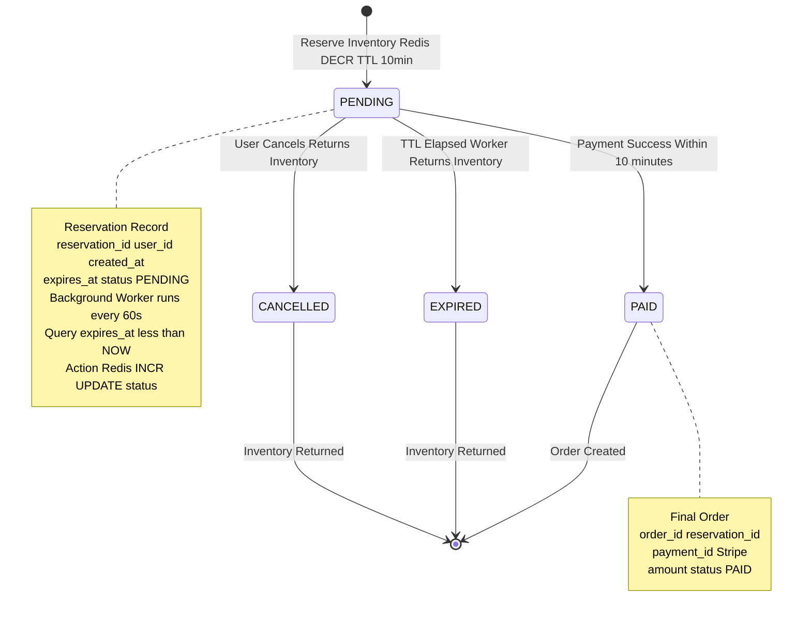

---

## 6. Split Counter Architecture

**Flow Explanation:**

This diagram shows the split counter optimization that divides the hot inventory key into 10 separate keys, distributing
write load across multiple Redis instances and increasing total throughput from 10K to 100K ops/sec.

**Single Key (Before):**

```
Key: iphone:stock = 100
Throughput: 10K ops/sec (single Redis master bottleneck)
All 100K requests → Single master
```

**Split Counter (After):**

```
Key: iphone:stock:0 = 10
Key: iphone:stock:1 = 10
... (10 keys, 10 items each)
Throughput: 100K ops/sec (10 × 10K)
100K requests distributed → 10 masters (10K each)
```

**Algorithm:**

1. Hash user_id → shard_id (0-9)
2. Try DECR on `iphone:stock:{shard_id}`
3. If success → Reserved
4. If failure (stock = 0) → Try next shard (round-robin)
5. If all shards fail → SOLD_OUT

**Benefits:**

- 10× throughput (10K → 100K ops/sec)
- Load distribution (10K per key instead of 100K on one)
- Reduced contention (less lock wait time)

**Trade-offs:**

- Complexity (track 10 keys instead of 1)
- Uneven distribution (some shards empty before others)
- Additional Redis instances (cost)

**When to Use:**

- Throughput exceeds 10K ops/sec
- Single Redis master saturated (CPU > 80%)
- Cost acceptable (10× infrastructure)

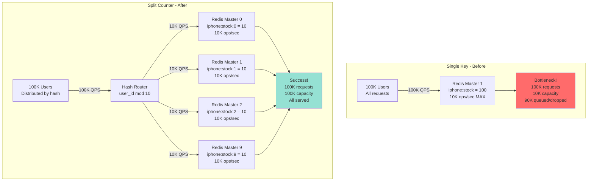

---

## 7. Payment Saga Pattern

**Flow Explanation:**

This diagram illustrates the Saga pattern workflow with three sequential steps and compensation transactions. Each step
has a corresponding compensation (undo) operation that executes if any subsequent step fails.

**Saga Steps:**

1. **Reserve Inventory** → Success → Proceed to Step 2
2. **Charge Customer** → Success → Proceed to Step 3
3. **Create Order** → Success → Complete

**Compensation Flow (if Step 2 fails):**

1. Execute compensation for Step 1: Return inventory (Redis INCR)
2. Notify user of failure

**Steps:**

1. **Step 1 (Reserve):** Atomic Redis DECR, create reservation record
2. **Step 2 (Charge):** Stripe API call with idempotency key (500ms-2s)
3. **Step 3 (Order):** PostgreSQL INSERT with ACID transaction

**Performance:**

- Happy path: 2-10 seconds total (Stripe latency dominates)
- Compensation: <100ms (Redis INCR + DB update)
- Success rate: ~95% (5% payment failures)

**Benefits:**

- Async processing (doesn't block user)
- Automatic rollback on failure
- Works with external APIs (Stripe)

**Trade-offs:**

- Eventual consistency (brief inconsistent state)
- Complex compensation logic
- Must handle partial failures

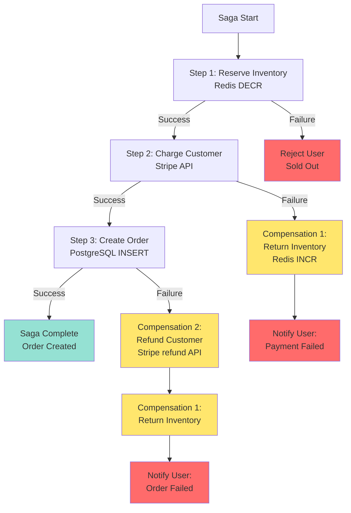

---

## 8. Load Shedding Strategy

**Flow Explanation:**

This diagram shows the progressive load shedding strategy across three layers (CDN, Gateway, Service) that reduces
traffic from 1M requests to 10K processed requests, protecting backend systems from overload.

**Layers:**

1. **CDN Layer:** Token bucket (90% blocked) → 100K pass
2. **Gateway Layer:** Leaky bucket queue (80K timeout) → 10K pass
3. **Service Layer:** Concurrency limit → 10K processed

**Algorithm:**

1. User request arrives at CDN
2. CDN checks token bucket (10 req/sec per IP)
3. If bucket empty → 429 Error (90% blocked)
4. If bucket has tokens → Forward to Gateway
5. Gateway queues excess (max 100K queue size)
6. Gateway drains 10K QPS to service layer
7. Service processes (100 succeed, 9,900 sold out)

**Performance:**

- CDN blocking: <1ms (edge computation)
- Queue wait time: 0-30 seconds (position dependent)
- Service processing: 50ms (reservation)

**Benefits:**

- Cost optimization ($100 CDN vs $3K backend)
- System stability (no overload)
- Fair queuing (FIFO order)

**Trade-offs:**

- High rejection rate (90% immediate)
- Queue timeouts (frustrating UX)
- False positives (legitimate users blocked)

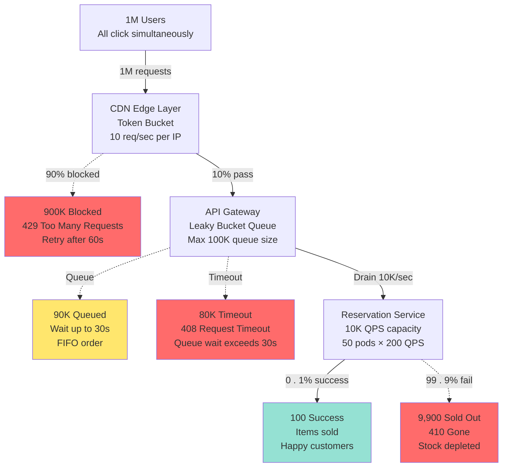

---

## 9. Idempotency Implementation

**Flow Explanation:**

This diagram shows how idempotency keys prevent double-charging when network failures cause request retries. The
idempotency store caches responses for 24 hours, returning cached results for duplicate requests.

**Flow:**

1. Client generates UUID idempotency key
2. Server checks idempotency store
3. **If key exists:**
    - Status = SUCCESS → Return cached response (no charge)
    - Status = PROCESSING → Return 409 Conflict (wait)
    - Status = FAILED → Return cached error
4. **If key not exists:**
    - Insert key (status = PROCESSING)
    - Process payment
    - Update key (status = SUCCESS/FAILED)
    - Return response

**States:**

- **PROCESSING:** Payment in progress (concurrent request)
- **SUCCESS:** Payment succeeded (cached for 24h)
- **FAILED:** Payment failed (cached to prevent retry)

**Performance:**

- Cache check: <1ms (Redis lookup)
- Duplicate request: <1ms (return cached)
- First request: 500ms-2s (Stripe API)

**Benefits:**

- Exactly-once semantics (no double-charge)
- Network fault tolerance (safe retries)
- Audit trail (all attempts logged)

**Trade-offs:**

- 24-hour cache per request (storage cost)
- Key collision risk (negligible with UUID)
- Cleanup overhead (purge expired keys)

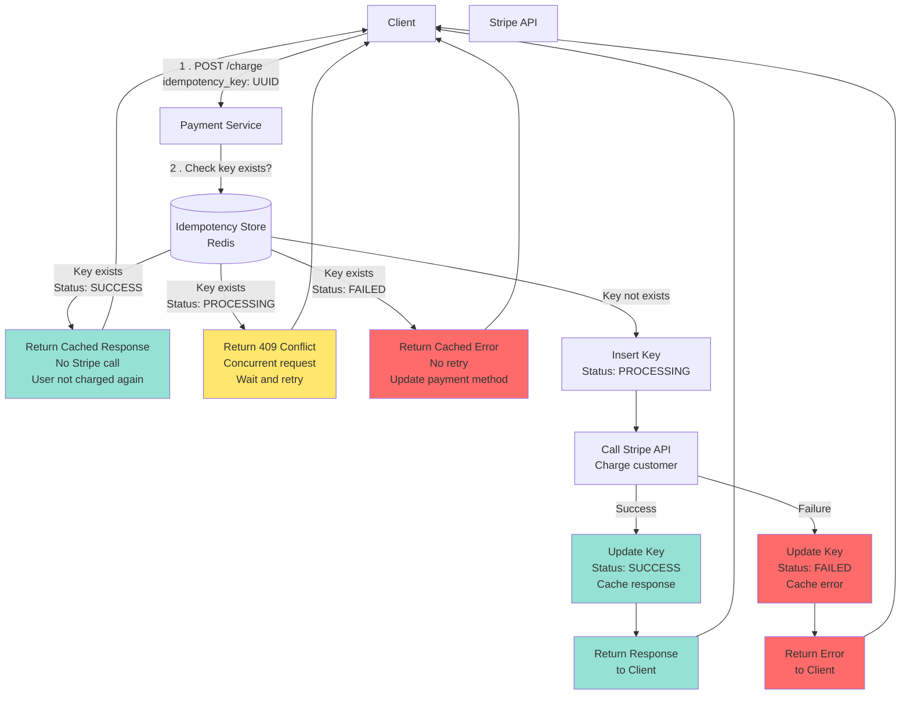

---

## 10. Redis Cluster Topology

**Flow Explanation:**

This diagram shows the Redis Cluster topology with 3 master nodes and 3 replica nodes, providing high availability and
automatic failover via Redis Sentinel.

**Architecture:**

- **3 Masters:** Each handles a hash slot range (0-16383 divided by 3)
- **3 Replicas:** One replica per master (async replication)
- **Redis Sentinel:** Monitors health, performs automatic failover

**Sharding Strategy:**

- Hash slot = CRC16(key) mod 16384
- Key `iphone:stock:0` → Hash slot 1234 → Master 1
- Key `iphone:stock:1` → Hash slot 5678 → Master 2
- Key `iphone:stock:2` → Hash slot 9012 → Master 3

**Failover Process:**

1. Sentinel detects master down (heartbeat timeout)
2. Sentinel initiates election (quorum: 2/3 sentinels)
3. Replica promoted to master (5 seconds total)
4. Clients redirect to new master

**Performance:**

- Normal operation: <1ms latency
- Failover time: 5 seconds (downtime)
- Throughput: 30K ops/sec (10K per master)

**Benefits:**

- High availability (99.99%)
- Automatic failover (no manual intervention)
- Linear scaling (add more masters)

**Trade-offs:**

- Replication lag (async, 1-5s delay)
- Failover downtime (5 seconds)
- Complex operations (cross-slot commands fail)

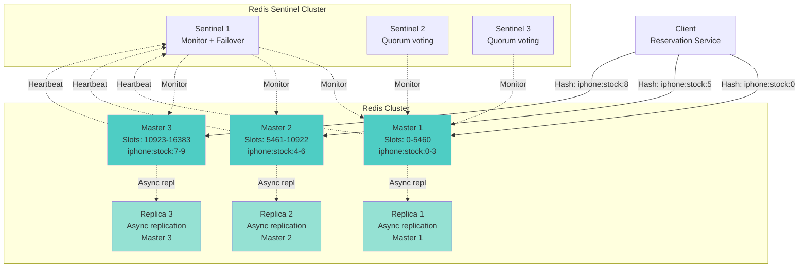

---

## 11. Cleanup Worker Process

**Flow Explanation:**

This diagram shows the background cleanup worker that runs every 60 seconds, scanning for expired reservations and
automatically returning inventory to Redis and notifying users.

**Workflow:**

1. **Cron Trigger:** Every 60 seconds
2. **Query Expired:** `WHERE expires_at < NOW() AND status = 'PENDING'`
3. **Batch Process:** Process up to 1,000 reservations per run
4. **For Each Reservation:**
    - Redis INCR (return inventory)
    - UPDATE status = 'EXPIRED'
    - Send push notification + email
5. **Sleep 60 seconds:** Wait for next run

**Edge Cases:**

- **Race Condition:** User pays while worker expires
    - Solution: Use DB row lock (`FOR UPDATE`)
    - Worker checks payment status before expiring
- **Redis Failure:** INCR fails
    - Solution: Retry with exponential backoff (3 attempts)
    - Log failure, alert on-call engineer

**Performance:**

- Query time: 100ms (index on expires_at)
- Redis INCR: 1ms per reservation
- DB update: 10ms per reservation
- Total: ~12ms per reservation × 1,000 = 12 seconds per batch

**Benefits:**

- Automatic cleanup (no manual intervention)
- Inventory returned quickly (<60s of expiration)
- Fair access (stock available for next users)

**Trade-offs:**

- Cleanup lag (up to 60 seconds)
- Worker overhead (continuous scanning)
- Race condition risk (mitigated by locks)

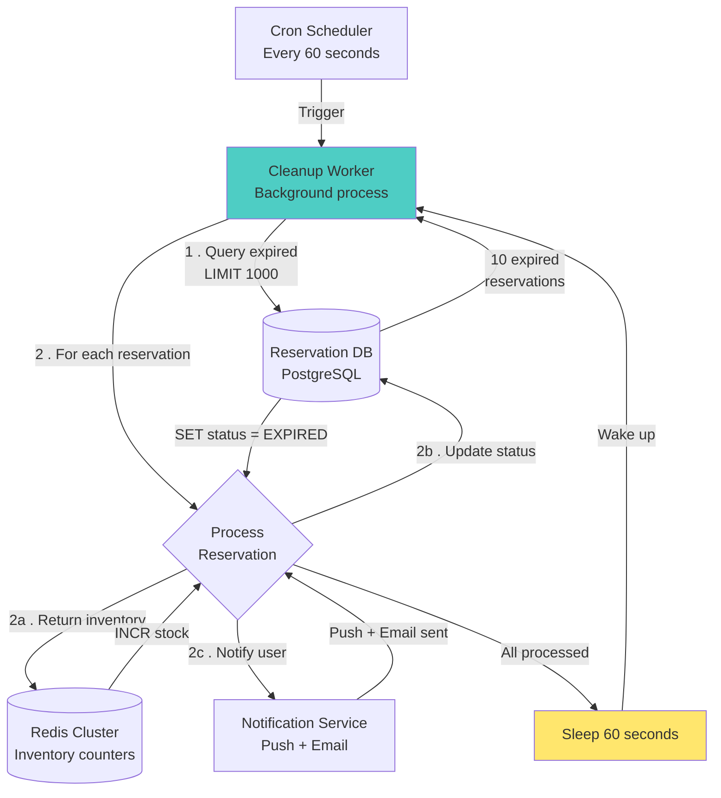

---

## 12. Bot Detection Pipeline

**Flow Explanation:**

This diagram shows the multi-stage bot detection pipeline that identifies and blocks automated scripts, ensuring fair
access for human users.

**Detection Stages:**

1. **Stage 1 (CDN):** Rate limiting (10 req/sec per IP)
2. **Stage 2 (Gateway):** Browser fingerprinting
3. **Stage 3 (Service):** Behavioral analysis

**Detection Techniques:**

- **Rate Limiting:** Bots send 1000+ req/sec, humans <10 req/sec
- **Fingerprinting:** Detect headless browsers (Puppeteer, Selenium)
    - Check: User-Agent, WebGL, Canvas rendering, fonts
- **Behavioral Analysis:** ML model scores:
    - Mouse movements (bots: none, humans: natural)
    - Click speed (bots: instant, humans: 200-500ms delay)
    - Session history (bots: fresh account, humans: 30+ day history)

**CAPTCHA Challenge:**

- Triggered when bot score > 80/100
- reCAPTCHA v3 (invisible, risk score)
- If fail → Block for 1 hour

**Performance:**

- Detection latency: <10ms per request
- False positive rate: <1% (99% accuracy)
- Bot block rate: 90% of bot traffic

**Benefits:**

- Fair access (humans prioritized)
- Reduced load (90% bot traffic blocked)
- Scalper prevention (limited edition items)

**Trade-offs:**

- False positives (1% legit users blocked)
- CAPTCHA friction (2-5s delay)
- Detection evasion (sophisticated bots bypass)

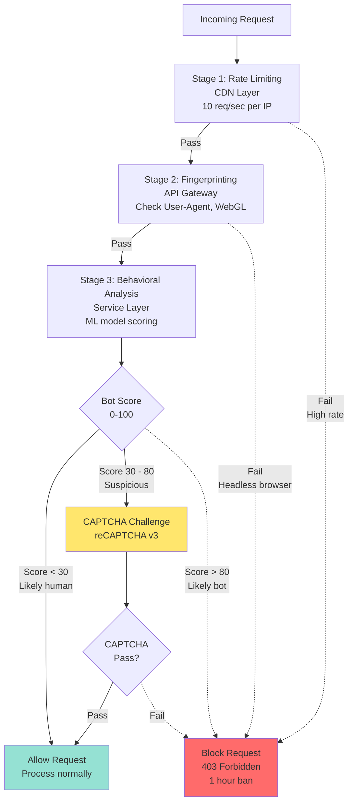

---

## 13. Monitoring Dashboard

**Flow Explanation:**

This diagram shows the comprehensive monitoring dashboard with key metrics for business, system, and infrastructure
layers, enabling rapid incident detection and response.

**Metric Categories:**

**1. Business Metrics (Revenue):**

- Items sold (target: 100)
- Revenue ($999 × 100 = $99,900)
- Success rate (0.1% expected)
- Conversion rate (reservations → orders)

**2. System Metrics (Performance):**

- API Gateway QPS (10K target)
- Reservation latency (p99 < 50ms)
- Redis throughput (100K ops/sec)
- Kafka consumer lag (<1000 messages)

**3. Infrastructure Metrics (Health):**

- Redis CPU (< 80%)
- PostgreSQL connections (< 500)
- Service pod count (50 pods)
- Error rate (< 1%)

**Alerts:**

- **P0 (Critical):** Redis cluster down, overselling detected
- **P1 (High):** Redis latency >100ms, payment rate <80%
- **P2 (Medium):** Kafka lag >1000, CPU >80%

**Dashboards:**

- **Real-time:** 1-second refresh (during flash sale)
- **Historical:** 5-minute aggregation (post-sale analysis)

**Benefits:**

- Rapid incident detection (<30s)
- Root cause analysis (correlated metrics)
- Capacity planning (historical trends)

**Trade-offs:**

- Monitoring overhead (~5% CPU)
- Alert fatigue (too many alerts)
- Cost ($100/month CloudWatch)

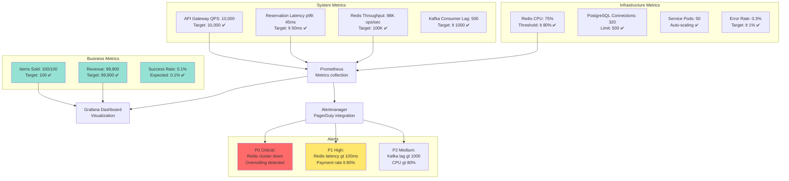

---

## 14. Failure Recovery Flow

**Flow Explanation:**

This diagram shows the complete failure recovery process when Redis master crashes mid-sale, including automatic
failover via Sentinel and resumption of service.

**Failure Scenario:**

- **Time T=0:** Flash sale starts, 50 items sold
- **Time T=30s:** Redis master crashes (hardware failure)
- **Time T=30-36s:** Sentinel detects failure and promotes replica
- **Time T=36s:** Service resumes, remaining 50 items sold

**Recovery Steps:**

1. **Detection (3s):** Sentinel detects master down (heartbeat timeout)
2. **Election (2s):** Sentinels vote (quorum: 2/3 agree)
3. **Promotion (1s):** Replica promoted to master
4. **Reconnection (1s):** Clients redirected to new master
5. **Resume (T=36s):** Reservations continue

**Data Loss:**

- **Worst case:** Last 5 seconds of writes (RDB snapshot interval)
- **Mitigation:** Use AOF with fsync every 1 second (max 1s loss)

**Impact:**

- **Downtime:** 6 seconds (detection + failover)
- **Lost sales:** 0 (reservations queued during failover)
- **User experience:** 429 errors for 6 seconds (retries succeed)

**Benefits:**

- Automatic recovery (no manual intervention)
- Minimal data loss (<1s with AOF)
- Service resumes quickly (6 seconds)

**Trade-offs:**

- 6-second downtime (users see errors)
- Potential data loss (last 1-5 seconds)
- Requires Sentinel cluster (complexity)

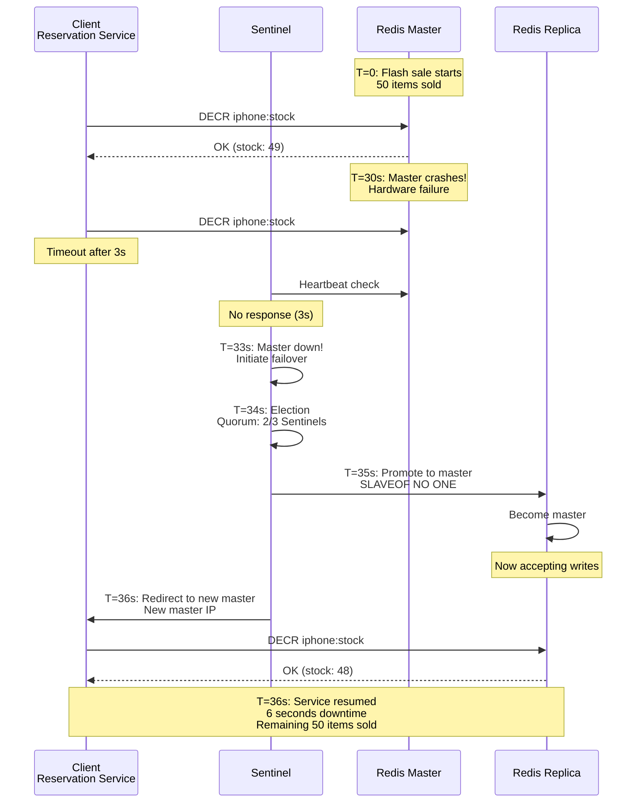

