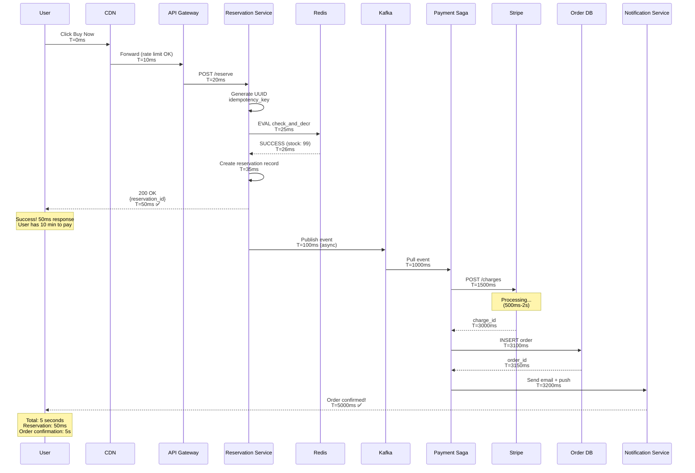

# E-commerce Flash Sale System - Sequence Diagrams

## Table of Contents

1. [User Reservation Flow (Happy Path)](#1-user-reservation-flow-happy-path)
2. [Payment Saga Success Flow](#2-payment-saga-success-flow)
3. [Payment Failure and Compensation](#3-payment-failure-and-compensation)
4. [Reservation Expiration and Cleanup](#4-reservation-expiration-and-cleanup)
5. [Concurrent Reservation Race Condition](#5-concurrent-reservation-race-condition)
6. [Split Counter Reservation Flow](#6-split-counter-reservation-flow)
7. [Idempotency Check Flow](#7-idempotency-check-flow)
8. [Rate Limiting Multi-Layer Flow](#8-rate-limiting-multi-layer-flow)
9. [Redis Failover Flow](#9-redis-failover-flow)
10. [Bot Detection and CAPTCHA Challenge](#10-bot-detection-and-captcha-challenge)
11. [Kafka Consumer Lag Recovery](#11-kafka-consumer-lag-recovery)
12. [Complete End-to-End Purchase Flow](#12-complete-end-to-end-purchase-flow)

---

## 1. User Reservation Flow (Happy Path)

**Flow:**

Shows the complete happy path from user clicking "Buy Now" to receiving reservation confirmation in under 50ms.

**Steps:**
1. **User clicks** (0ms): User taps "Buy Now" button
2. **API Gateway** (10ms): Token bucket rate limit check passes
3. **Reservation Service** (20ms): Generates idempotency key (UUID)
4. **Redis check** (25ms): Execute Lua script check_and_decr
5. **Lua execution** (26ms): GET stock (100), Check > 0, DECR (99)
6. **Create reservation** (35ms): INSERT into reservations table with TTL
7. **Kafka publish** (40ms): Publish reservation event (async)
8. **Response** (45ms): Return reservation_id to user
9. **Payment processing** (async): Kafka consumer processes payment (2-10s)

**Performance:**
- **User response time:** 45ms (instant feedback)
- **Success rate:** 0.1% (100 out of 100,000 attempts)
- **Payment latency:** 2-10 seconds (async, doesn't block user)

**Benefits:**
- Fast user experience (< 50ms)
- Async payment (doesn't block)
- Strong consistency (atomic DECR)

**Trade-offs:**
- Eventual consistency (payment async)
- High rejection rate (99.9% fail)

---

## 2. Payment Saga Success Flow

**Flow:**

Shows the complete Saga pattern with three steps: reserve inventory, charge customer, create order. All steps succeed in this happy path.

**Steps:**
1. **Kafka consumer** pulls reservation event
2. **Saga Step 1:** Check reservation still valid (not expired)
3. **Saga Step 2:** Charge customer via Stripe API (idempotency key)
4. **Stripe processing:** 500ms-2s latency
5. **Saga Step 3:** Create final order in PostgreSQL (ACID)
6. **Cleanup:** Delete reservation record
7. **Notify user:** Send confirmation email + push notification

**Performance:**
- **Step 1:** 10ms (DB query)
- **Step 2:** 500ms-2s (Stripe API)
- **Step 3:** 50ms (DB insert)
- **Total:** 560ms-2.06s end-to-end

**Benefits:**
- Async processing (doesn't block user)
- Idempotent payment (no double-charge)
- ACID order creation

**Trade-offs:**
- Long latency (2+ seconds)
- Complex error handling
- Requires compensation logic

---

## 3. Payment Failure and Compensation

**Flow:**

Shows the Saga compensation flow when payment fails. The system automatically rolls back the reservation and returns inventory to Redis.

**Steps:**
1. **Saga Step 1:** Validate reservation (success)
2. **Saga Step 2:** Charge customer (FAILURE - card declined)
3. **Compensation begins:** Rollback Step 1
4. **Redis INCR:** Return inventory (99 → 100)
5. **Update reservation:** SET status = FAILED
6. **Notify user:** Payment declined, please update card
7. **Result:** System state consistent (no partial transactions)

**Performance:**
- **Failure detection:** Immediate (Stripe API returns error)
- **Compensation time:** 50ms (Redis INCR + DB update)
- **Inventory returned:** Within 100ms

**Benefits:**
- Automatic rollback (no manual intervention)
- Inventory returned immediately
- User notified of failure

**Trade-offs:**
- Complex compensation logic
- Multiple DB writes (performance cost)
- Brief period of inconsistency (eventual consistency)

---

## 4. Reservation Expiration and Cleanup

**Flow:**

Shows the background worker process that scans for expired reservations (TTL elapsed) and automatically returns inventory to Redis.

**Steps:**
1. **Worker wakes** (every 60 seconds): Cron trigger
2. **Query expired:** `WHERE expires_at < NOW() AND status = PENDING`
3. **Found 10 expired:** Users didn't pay within 10 minutes
4. **For each reservation:**
   - Redis INCR (return inventory)
   - UPDATE status = EXPIRED
   - Notify user (reservation expired)
5. **Sleep 60 seconds:** Wait for next scan

**Performance:**
- **Worker frequency:** Every 60 seconds
- **Cleanup lag:** Max 60 seconds
- **Batch size:** 1,000 reservations per scan
- **Processing time:** 5-10 seconds per batch

**Benefits:**
- Automatic cleanup (no manual intervention)
- Inventory returned for next users
- Fair access (time-bound reservations)

**Trade-offs:**
- Cleanup lag (up to 60s delay)
- Worker overhead (continuous scanning)
- Race condition risk (user pays while worker expires)

---

## 5. Concurrent Reservation Race Condition

**Flow:**

Shows how two users attempting to reserve the last item simultaneously are handled atomically by Redis Lua script, preventing overselling.

**Steps:**
1. **User A and User B** both click "Buy Now" for last item (stock = 1)
2. **User A request** arrives at Redis first (by microseconds)
3. **Lua script for User A** locks Redis (single-threaded execution)
4. **Lua execution:** GET stock (1) → Check (1 > 0) → DECR (0) → Return SUCCESS
5. **User B request** waits until User A's Lua script completes
6. **Lua script for User B:** GET stock (0) → Check (0 > 0 fails) → Return SOLD_OUT
7. **Result:** User A succeeds, User B receives error (no overselling)

**Performance:**
- User A latency: <1ms (Lua script execution)
- User B latency: <1ms (queued, then executes)
- Total difference: <1ms (microseconds apart)

**Benefits:**
- Prevents race condition (atomicity)
- No deadlocks (Lua script is atomic)
- Accurate inventory (exactly 1 item sold)

**Trade-offs:**
- Sequential execution (B waits for A)
- Microsecond delays (negligible)

---

## 6. Split Counter Reservation Flow

**Flow:**

Shows how split counter optimization distributes load across 10 Redis keys, with fallback to next shard if current shard is empty.

**Steps:**
1. **User makes reservation** request
2. **Hash user_id** → shard_id (e.g., user_id 12345 mod 10 = 5)
3. **Try shard 5:** EVAL check_and_decr on `iphone:stock:5`
4. **If success:** Return reservation (fast path)
5. **If failure (shard empty):** Try next shard (round-robin)
6. **Try shards 6, 7, 8...** until success or all 10 fail
7. **If all fail:** Return SOLD_OUT

**Performance:**
- **Best case:** First try success (<1ms)
- **Worst case:** Try all 10 shards (~10ms)
- **Average case:** 2-3 tries (~2ms)

**Benefits:**
- 10× throughput (distributed load)
- No single bottleneck
- Automatic fallback (resilient)

**Trade-offs:**
- Uneven distribution (some shards empty first)
- Multiple Redis calls (worst case: 10)
- Complex logic (shard selection)

---

## 7. Idempotency Check Flow

**Flow:**

Shows how idempotency key prevents double-charging when network failure causes client retry.

**Steps:**
1. **Client generates** UUID idempotency_key
2. **First request:** POST /charge with key
3. **Server checks** idempotency store (key not found)
4. **Server inserts** key with status=PROCESSING
5. **Call Stripe API** (charge customer)
6. **Network timeout!** Client doesn't receive response
7. **Client retries** (same idempotency key)
8. **Server checks** idempotency store (key exists, status=SUCCESS)
9. **Server returns** cached response (no Stripe call)
10. **Result:** Customer charged exactly once

**Performance:**
- First request: 500ms-2s (Stripe latency)
- Retry: <1ms (cached response)
- Cache hit rate: ~5% (network failures)

**Benefits:**
- Exactly-once semantics
- Network fault tolerance
- No double-charge risk

**Trade-offs:**
- Storage overhead (24h cache)
- Additional Redis lookup
- Key management complexity

---

## 8. Rate Limiting Multi-Layer Flow

**Flow:**

Shows complete multi-layer rate limiting from CDN to service layer, progressively reducing traffic.

**Steps:**
1. **1M users** send requests simultaneously
2. **CDN Layer:** Token bucket (10 req/sec per IP) → 900K blocked
3. **100K pass** to API Gateway
4. **Gateway Layer:** Leaky bucket queue (max 100K) → 90K queued
5. **Gateway drains** 10K QPS to service
6. **Service Layer:** Concurrency limit (10K max) → Processes requests
7. **Result:** 100 succeed, 9,900 sold out, 990K rejected

**Performance:**
- CDN blocking: <1ms (instant rejection)
- Queue wait: 0-30 seconds (position dependent)
- Service processing: 50ms (reservation)

**Benefits:**
- Cost optimization (block at cheap CDN)
- System protection (no overload)
- Fair access (FIFO queue)

**Trade-offs:**
- High rejection rate (99%)
- Queue timeouts (frustrating)
- False positives possible

---

## 9. Redis Failover Flow

**Flow:**

Shows automatic failover when Redis master crashes, Sentinel promotes replica, and service resumes.

**Steps:**
1. **T=0:** Flash sale active, 50 items sold
2. **T=30s:** Redis master crashes (hardware failure)
3. **T=30-33s:** Client requests timeout (no response)
4. **T=33s:** Sentinel detects failure (heartbeat timeout)
5. **T=33-35s:** Sentinels vote (quorum 2/3)
6. **T=35s:** Replica promoted to master
7. **T=36s:** Clients reconnect to new master
8. **T=36s+:** Service resumes, remaining 50 items sold

**Performance:**
- Failure detection: 3 seconds (heartbeat)
- Failover time: 3 seconds (election + promotion)
- Total downtime: 6 seconds
- Data loss: 0-5 seconds of writes (depends on replication lag)

**Benefits:**
- Automatic recovery (no manual intervention)
- Minimal downtime (6 seconds)
- No lost reservations (queued)

**Trade-offs:**
- 6-second service interruption
- Potential data loss (last 1-5 seconds)
- Requires Sentinel cluster

---

## 10. Bot Detection and CAPTCHA Challenge

**Flow:**

Shows bot detection pipeline with fingerprinting, behavioral analysis, and CAPTCHA challenge.

**Steps:**
1. **Request arrives** from suspicious IP
2. **Stage 1:** Rate limit check (100+ req/min) → Suspicious
3. **Stage 2:** Browser fingerprint (headless browser detected)
4. **ML model scores** behavior (bot score: 85/100)
5. **Trigger CAPTCHA** (score > 80)
6. **User solves** CAPTCHA challenge
7. **CAPTCHA fails** (bot script can't solve)
8. **Block request** with 403 Forbidden (1-hour ban)

**Detection Signals:**
- Rate: 100+ req/min (humans: <10)
- Fingerprint: Missing WebGL, Canvas
- Behavior: No mouse movement, instant clicks
- Session: Fresh account (<1 day old)

**Performance:**
- Detection: <10ms per request
- CAPTCHA: 2-5 seconds (user time)
- Block duration: 1 hour

**Benefits:**
- 90% bot traffic blocked
- Fair human access
- Scalper prevention

**Trade-offs:**
- False positives (1%)
- CAPTCHA friction
- Sophisticated bots may bypass

---

## 11. Kafka Consumer Lag Recovery

**Flow:**

Shows recovery process when payment service crashes and Kafka consumer lag builds up.

**Steps:**
1. **T=0:** Normal operation, 0 lag
2. **T=60s:** Payment service crashes (OOM error)
3. **T=60-120s:** Messages pile up (lag: 5000)
4. **T=120s:** Alert triggers (lag > 1000)
5. **T=125s:** Auto-scaling triggers (5 → 20 pods)
6. **T=130s:** New consumers start processing backlog
7. **T=180s:** Lag cleared (back to 0)
8. **Impact:** Reservations delayed 2-3 minutes (TTL extended)

**Performance:**
- Detection: 60 seconds (monitoring lag)
- Scaling: 5 seconds (Kubernetes auto-scale)
- Recovery: 60 seconds (process 5000 messages)
- Total impact: 2-3 minutes delayed payments

**Benefits:**
- Automatic recovery (no manual intervention)
- No lost messages (Kafka durability)
- Auto-scaling handles burst

**Trade-offs:**
- Temporary delays (2-3 minutes)
- Increased costs (20 pods vs 5)
- TTL extension needed

---

## 12. Complete End-to-End Purchase Flow

**Flow:**

Shows complete journey from user clicking "Buy Now" to receiving order confirmation, including all systems.

**Steps:**
1. **User clicks** "Buy Now" (T=0ms)
2. **CDN + API Gateway:** Rate limiting, authentication (T=10ms)
3. **Reservation Service:** Generate UUID, atomic Redis DECR (T=50ms)
4. **User receives** reservation confirmation (T=50ms - fast!)
5. **Kafka:** Publish reservation event (async, T=100ms)
6. **Payment Saga:** Consume event, start processing (T=1s)
7. **Stripe API:** Charge customer (T=2-3s)
8. **Create Order:** PostgreSQL INSERT (T=3s)
9. **Send Notification:** Email + push notification (T=5s)
10. **User receives** order confirmation (T=5s total)

**Performance:**
- User feedback: 50ms (reservation)
- Payment processing: 2-5 seconds (async)
- Order confirmation: 5-10 seconds total

**Benefits:**
- Fast user experience (50ms)
- Async payment (doesn't block)
- Reliable (all systems involved)

**Trade-offs:**
- Complex (8 systems)
- Eventual consistency
- Cost (~$0.10 per transaction)

