# Distributed Database - High-Level Design Diagrams

## Table of Contents

1. [System Architecture Overview](#1-system-architecture-overview)
2. [Range-Based Sharding](#2-range-based-sharding)
3. [Raft Consensus Group](#3-raft-consensus-group)
4. [Write Path with Consensus](#4-write-path-with-consensus)
5. [Read Path (Leader vs Follower)](#5-read-path-leader-vs-follower)
6. [Dynamic Range Splitting](#6-dynamic-range-splitting)
7. [Two-Phase Commit (2PC) Flow](#7-two-phase-commit-2pc-flow)
8. [Timestamp Oracle Architecture](#8-timestamp-oracle-architecture)
9. [Metadata Store (etcd) Architecture](#9-metadata-store-etcd-architecture)
10. [Leader Election Flow](#10-leader-election-flow)
11. [Split Brain Prevention](#11-split-brain-prevention)
12. [Multi-Region Deployment](#12-multi-region-deployment)
13. [Hotspot Detection and Mitigation](#13-hotspot-detection-and-mitigation)
14. [Online Schema Migration](#14-online-schema-migration)

---

## 1. System Architecture Overview

**Flow Explanation:**

This diagram shows the complete architecture of a distributed database. Clients send SQL queries to stateless gateways, which consult the metadata store (etcd) to determine which Raft consensus group owns the data. The gateway then routes the request to the appropriate leader node, which coordinates with its followers using Raft consensus before committing the write.

**Components:**

1. **Client Layer:** Applications using SQL drivers
2. **Gateway/Router:** Stateless SQL parser and router
3. **Metadata Store:** etcd cluster storing range assignments
4. **Raft Groups:** Collections of 3 nodes forming quorums
5. **Storage Layer:** RocksDB (LSM tree) with WAL

**Key Characteristics:**

- **Stateless Gateways:** Can scale horizontally (add more gateways)
- **Metadata Caching:** Gateways cache range mappings (99% hit rate)
- **Automatic Sharding:** Data distributed across Raft groups by key range
- **Fault Tolerance:** Each Raft group survives 1 node failure (quorum=2/3)

**Performance:**

- Gateway routing: <1ms (cache hit)
- Cross-region metadata lookup: 50ms (cache miss)
- Raft consensus latency: 1-5ms (single region), 50-200ms (multi-region)


---

## 2. Range-Based Sharding

**Flow Explanation:**

This diagram illustrates how data is partitioned by key ranges rather than hash. A table with primary key `user_id` (UUID) is split into 3 ranges based on the UUID value. Each range is assigned to a different Raft consensus group. Range-based sharding enables efficient range queries but can suffer from hotspots if recent data is accessed more frequently.

**Sharding Logic:**

1. Extract primary key from query: `user_id = '7a3f2c1b...'`
2. Find range containing key: `[55555556...AAAAAAAA]` → Range 2
3. Route query to Raft Group B (Nodes 4, 5, 6)

**Benefits:**

- **Efficient Range Queries:** `WHERE user_id BETWEEN X AND Y` hits single range (not all shards)
- **Simple Split Logic:** Split at midpoint of key range
- **Ordered Scans:** Can iterate over keys in sorted order

**Trade-offs:**

- **Hotspot Risk:** Recent data (e.g., today's orders) may concentrate in one range
- **Uneven Distribution:** If keys not uniformly distributed, some ranges larger than others

**Mitigation:**

- Monitor QPS per range, auto-split hot ranges
- Use composite keys (e.g., `shard_id + user_id`) for better distribution


---

## 3. Raft Consensus Group

**Flow Explanation:**

A Raft consensus group consists of 3 nodes: 1 leader and 2 followers. The leader accepts writes, appends them to its log, and replicates to followers. Once a quorum (2 out of 3) acknowledges the write, it's committed. This ensures that even if 1 node fails, the data is safe. Followers can serve reads with eventual consistency or snapshot reads.

**Raft Roles:**

1. **Leader:** Accepts writes, coordinates replication
2. **Follower:** Replicates leader's log, can serve reads
3. **Candidate:** Temporary state during election

**Replication Flow:**

1. Client writes to Leader
2. Leader appends to log (uncommitted)
3. Leader sends AppendEntries RPC to Followers
4. Followers append to log, ACK to Leader
5. Leader receives quorum ACKs (2/3) → Mark committed
6. Leader applies to state machine (RocksDB)
7. Leader notifies Followers to apply

**Performance:**

- **Single-region latency:** 1-5ms (1 RTT: Leader → Follower → Leader)
- **Multi-region latency:** 50-200ms (cross-region network)
- **Throughput:** 10K writes/sec per Raft group (leader bottleneck)

**Fault Tolerance:**

- Tolerates 1 node failure (2/3 quorum still forms)
- Cannot tolerate 2 node failures (no quorum)
- Leader election: ~1-2 seconds downtime

```mermaid
graph TB
    subgraph Raft Consensus Group - Range A-F
        Leader[LEADER Node 1<br/>Term: 5<br/>Log Index: 1000<br/>Committed Index: 999<br/>Role: Accepts writes coordinates replication]
        
        Follower1[FOLLOWER Node 2<br/>Term: 5<br/>Log Index: 1000<br/>Committed Index: 999<br/>Role: Replicates leader log]
        
        Follower2[FOLLOWER Node 3<br/>Term: 5<br/>Log Index: 999<br/>Committed Index: 998<br/>Role: Replicates leader log]
    end
    
    subgraph Log Replication
        LeaderLog[Leader Log:<br/>Index 997: SET x=1 Committed<br/>Index 998: SET y=2 Committed<br/>Index 999: SET z=3 Committed<br/>Index 1000: SET w=4 Uncommitted]
        
        Follower1Log[Follower 1 Log:<br/>Index 997: SET x=1 Committed<br/>Index 998: SET y=2 Committed<br/>Index 999: SET z=3 Committed<br/>Index 1000: SET w=4 Uncommitted]
        
        Follower2Log[Follower 2 Log:<br/>Index 997: SET x=1 Committed<br/>Index 998: SET y=2 Committed<br/>Index 999: SET z=3 Committed<br/>Index 1000: Missing lagging]
    end
    
    subgraph Quorum
        Q[Quorum Requirement:<br/>2 out of 3 nodes must ACK<br/>Current: Leader + Follower1 = 2<br/>Status: Quorum formed can commit]
    end
    
    Client[Client Write Request<br/>SET w=4]
    
    Client -->|1. Write| Leader
    Leader -->|2. AppendEntries RPC| Follower1
    Leader -->|2. AppendEntries RPC| Follower2
    Follower1 -->|3. ACK Success| Leader
    Follower2 -.->|3. ACK Delayed network| Leader
    
    Leader --> LeaderLog
    Follower1 --> Follower1Log
    Follower2 --> Follower2Log
    
    Leader --> Q
    
    style Leader fill:#95e1d3
    style Follower1 fill:#a8dadc
    style Follower2 fill:#ffd93d
    style Q fill:#95e1d3
```



---

## 4. Write Path with Consensus

**Flow Explanation:**

This diagram shows the complete write path from client to storage. The client sends a write to the gateway, which routes it to the appropriate Raft leader. The leader proposes the write to followers via AppendEntries RPC. Once a quorum (2/3) acknowledges, the leader commits the write to RocksDB and returns success. This provides strong consistency: once committed, the write is durable even if nodes fail.

**Steps:**

1. **Client → Gateway** (1ms): SQL statement parsed
2. **Gateway → Metadata** (1ms): Lookup range owner (cache hit 99%)
3. **Gateway → Leader** (1ms): Route to Raft leader
4. **Leader → Followers** (2ms): AppendEntries RPC to 2 followers
5. **Followers → Leader** (2ms): ACKs from followers
6. **Leader commits** (1ms): Apply to RocksDB, mark committed
7. **Leader → Gateway → Client** (2ms): Return success

**Total Latency:** 10ms (single region), 150ms (multi-region)

**Benefits:**

- **Strong Consistency:** Quorum ensures durability
- **Fault Tolerance:** Write survives 1 node failure
- **No Single Point of Failure:** Leader can failover

**Trade-offs:**

- **Higher Latency:** Consensus adds network RTTs
- **Write Amplification:** 3× network traffic (1 leader + 2 followers)
- **Leader Bottleneck:** All writes through single leader


---

## 5. Read Path (Leader vs Follower)

**Flow Explanation:**

This diagram compares three read strategies: reading from leader (strong consistency), reading from follower (eventual consistency), and reading from follower with timestamp (snapshot isolation). Reading from leader provides linearizability but higher latency (cross-region). Reading from follower provides lower latency but may return stale data. Reading with timestamp allows strong consistency from followers by reading a historical snapshot.

**Strategies:**

1. **Read from Leader:**
   - Consistency: Strong (linearizable)
   - Latency: Higher (may be cross-region)
   - Use case: Financial transactions

2. **Read from Follower (Stale):**
   - Consistency: Eventual (may lag 100ms-1s)
   - Latency: Lower (nearest replica)
   - Use case: Analytics dashboards

3. **Read from Follower with Timestamp:**
   - Consistency: Strong (snapshot isolation at T-1min)
   - Latency: Lower (nearest replica)
   - Use case: Most application reads (90%)

**Performance Comparison:**

| Strategy | Latency | Consistency | QPS Capacity |
|----------|---------|-------------|--------------|
| Leader | 100ms | Strong | 30K reads/sec (1 node) |
| Follower (stale) | 10ms | Eventual | 90K reads/sec (3 nodes) |
| Follower (timestamp) | 15ms | Strong | 90K reads/sec (3 nodes) |

**Recommendation:** Use follower reads with timestamp for 90% of reads.


---

## 6. Dynamic Range Splitting

**Flow Explanation:**

This diagram shows how a range is automatically split when it becomes too large or too hot. The system monitors each range's size and QPS. When a range exceeds thresholds (>64 MB or >10K QPS for 60 seconds), it's split at the median key. A new Raft group is created, and data is migrated. This prevents hotspots and distributes load evenly.

**Split Triggers:**

1. **Size-Based:** Range >64 MB (or configurable threshold)
2. **Load-Based:** Range >10K QPS for 60 consecutive seconds
3. **Manual:** Operator-initiated split

**Split Process:**

1. **Detect:** Monitor thread detects hotspot (QPS >10K)
2. **Decide:** Calculate median key to split at
3. **Create:** Create new Raft group for right half
4. **Migrate:** Copy right half data to new group (background)
5. **Update Metadata:** Update etcd with new range mapping
6. **Complete:** Delete old data from original group, serve from both

**Downtime:** Zero (reads/writes continue during split)

**Duration:** 30 seconds - 5 minutes (depends on range size)


---

## 7. Two-Phase Commit (2PC) Flow

**Flow Explanation:**

This diagram illustrates distributed transaction management using Two-Phase Commit (2PC). When a transaction spans multiple shards (e.g., transferring money between accounts on different shards), a coordinator ensures atomicity. In Phase 1 (PREPARE), all participants lock resources and vote YES/NO. In Phase 2 (COMMIT/ABORT), the coordinator tells all participants to commit (if all voted YES) or abort (if any voted NO).

**Phases:**

**Phase 1 (PREPARE):**
1. Coordinator sends "PREPARE" to all participant shards
2. Each shard locks affected rows, checks constraints
3. Each shard votes "YES" (can commit) or "NO" (must abort)
4. Coordinator waits for all votes

**Phase 2 (COMMIT/ABORT):**
1. If all votes YES → Coordinator sends "COMMIT" to all
2. If any vote NO → Coordinator sends "ABORT" to all
3. Participants execute command, release locks
4. Participants ACK to coordinator
5. Coordinator returns result to client

**Failure Scenarios:**

| Failure | Handling |
|---------|----------|
| Participant crashes after YES | Coordinator retries COMMIT until participant recovers (locks held) |
| Participant crashes before vote | Timeout → Coordinator ABORTs |
| Coordinator crashes | Participants timeout, ABORT (conservative) |

**Performance:**

- **Latency:** 20-50ms (2 network RTTs)
- **Throughput:** 5K transactions/sec (coordinator bottleneck)
- **Lock Duration:** 20-50ms (during 2PC)


---

## 8. Timestamp Oracle Architecture

**Flow Explanation:**

This diagram shows the Timestamp Oracle service, which provides globally unique, monotonically increasing timestamps for transactions. The oracle is a highly available Raft cluster that issues timestamps on demand. Each transaction receives a unique timestamp, which is used for MVCC (Multi-Version Concurrency Control) and determining transaction order across shards.

**How it Works:**

1. **Transaction Start:** Client requests timestamp from oracle
2. **Oracle:** Increments counter, returns unique timestamp (e.g., 1640000000001)
3. **Transaction Execution:** All writes tagged with this timestamp
4. **Transaction Commit:** Timestamp used to determine visibility in MVCC

**Timestamp Structure:**

```
64-bit timestamp: [Physical Time: 48 bits][Logical Counter: 16 bits]

Physical Time: Unix milliseconds (1640000000000)
Logical Counter: Monotonic counter for same millisecond (0-65535)
```

**High Availability:**

- **Raft Cluster:** 3 oracle nodes (1 leader, 2 followers)
- **Failover:** <2 seconds (Raft election)
- **Throughput:** 1M timestamps/sec (leader bottleneck)

**Google Spanner's TrueTime:**
- Uses atomic clocks + GPS for global sync
- Provides uncertainty bound: [earliest, latest] (<7ms)
- Commits wait out uncertainty ("commit wait")


---

## 9. Metadata Store (etcd) Architecture

**Flow Explanation:**

This diagram shows the metadata store (etcd) that manages cluster state. Etcd stores range assignments (which nodes own which key ranges), node health status, schema definitions, and cluster configuration. Gateways watch etcd for changes and cache metadata locally. When a range splits or a leader changes, etcd is updated, and gateways are notified.

**Metadata Stored:**

1. **Range Assignments:** range_id → (start_key, end_key, leader_node, replicas)
2. **Node Status:** node_id → (health, cpu, disk, last_heartbeat)
3. **Schema:** table definitions, indexes, constraints
4. **Configuration:** replication factor, quorum size, timeouts

**Watch Mechanism:**

- Gateways "watch" etcd for changes
- When metadata changes (e.g., leader election), etcd sends notification
- Gateway invalidates cache, fetches new metadata

**Performance:**

- **Read Latency:** <1ms (gateway cache hit 99%)
- **Write Latency:** 10-50ms (etcd Raft consensus)
- **Watch Notification:** <100ms (push-based)

**High Availability:**

- 3-node etcd cluster (Raft)
- Tolerates 1 node failure
- Automatic leader election


---

## 10. Leader Election Flow

**Flow Explanation:**

This diagram shows the Raft leader election process when a leader fails. Followers detect leader failure via missing heartbeats (timeout after 1 second). A follower transitions to CANDIDATE, increments the term (epoch), and requests votes from peers. If it receives a majority of votes, it becomes the new leader and starts sending heartbeats. This process typically completes in 1-2 seconds.

**Election Process:**

1. **Normal Operation:** Leader sends heartbeats every 100ms
2. **Failure:** Followers don't receive heartbeat for 1 second (election timeout)
3. **Candidate:** Follower transitions to CANDIDATE, increments term
4. **Vote Request:** CANDIDATE sends RequestVote RPC to all peers
5. **Voting:** Each node votes for at most one candidate per term
6. **Win Election:** CANDIDATE receives majority votes (2 out of 3)
7. **New Leader:** CANDIDATE transitions to LEADER, sends heartbeats
8. **Update Metadata:** New leader updates etcd with its node ID

**Split Vote:** If two candidates split votes (each gets 1 vote), election times out, and they retry with higher term.

**Downtime:** ~1-2 seconds (election timeout + vote + metadata update)


---

## 11. Split Brain Prevention

**Flow Explanation:**

This diagram demonstrates how Raft prevents split brain during network partitions. When a cluster is partitioned, only the partition with a majority of nodes (>N/2) can elect a leader and accept writes. The minority partition cannot form a quorum and rejects all writes. This ensures that conflicting writes never occur in different partitions.

**Scenario:**

- 5-node cluster: Nodes 1, 2, 3, 4, 5
- Network partition splits into:
  - Partition A: Nodes 1, 2, 3 (3 nodes = majority)
  - Partition B: Nodes 4, 5 (2 nodes = minority)

**Behavior:**

**Partition A (Majority):**
- 3 out of 5 nodes = >50% ✅
- Can elect leader (Node 1)
- Can accept writes (quorum = 2 out of 3)
- System operational

**Partition B (Minority):**
- 2 out of 5 nodes = <50% ❌
- Cannot elect leader (need 3 votes)
- Reject all writes (no quorum)
- System read-only or unavailable

**After Partition Heals:**

- Partition B rejoins
- Nodes 4, 5 discover higher term in Partition A
- Nodes 4, 5 sync from Partition A leader
- Cluster unified with single leader

**Key Insight:** Raft requires **strictly more than half** (N/2 + 1) to form quorum, preventing split brain.


---

## 12. Multi-Region Deployment

**Flow Explanation:**

This diagram shows a multi-region distributed database deployment. Data is replicated across 3 geographic regions (US, EU, APAC) for high availability and disaster recovery. Regional Raft groups keep replicas close together (low latency), while cross-region replication provides global durability. Clients read from the nearest region for low latency. Cross-region writes are slower (100-200ms) due to network latency.

**Architecture:**

**Per-Region Raft Groups:**
- US Region: Range US-data → US Raft Group (3 nodes in US)
- EU Region: Range EU-data → EU Raft Group (3 nodes in EU)
- APAC Region: Range APAC-data → APAC Raft Group (3 nodes in APAC)

**Global Raft Groups:**
- Critical data: Global Raft Group (1 replica per region = 3 total)
- Consensus across regions (200ms latency)

**Latency:**

| Operation | Single Region | Multi-Region |
|-----------|--------------|--------------|
| **Read (local)** | 10ms | 10ms (nearest replica) |
| **Read (cross-region)** | 100ms | 100ms |
| **Write (regional)** | 10ms | 10ms (in-region consensus) |
| **Write (global)** | 200ms | 200ms (cross-region consensus) |

**Data Placement Strategy:**

- **Regional Data (80%):** User profiles, content (in-region writes: 10ms)
- **Global Data (20%):** Financial transactions, audit logs (cross-region writes: 200ms)


---

## 13. Hotspot Detection and Mitigation

**Flow Explanation:**

This diagram shows the hotspot detection and mitigation system. A monitoring thread continuously tracks QPS, storage size, and CPU usage for each range. When a range exceeds thresholds (>10K QPS for 60 seconds or >64 MB size), it's flagged as a hotspot. The split coordinator automatically splits the range at the median key, creates a new Raft group, and migrates data. This prevents node overload and distributes traffic evenly.

**Detection Metrics:**

1. **QPS (Queries Per Second):** >10K QPS for 60 seconds
2. **Storage Size:** >64 MB (or 128 MB, 256 MB configurable)
3. **CPU Usage:** >80% CPU for 5 minutes
4. **Network Bandwidth:** >1 GB/sec for 5 minutes

**Mitigation Actions:**

1. **Split Range:** Divide hot range into two
2. **Load Shedding:** Rate limit requests temporarily
3. **Add Replicas:** Increase replication factor (3 → 5)
4. **Rebalance:** Move range to less loaded nodes

**Split Strategy:**

- **Median Split:** Split at median key (balanced sizes)
- **Hot Key Split:** Isolate hot key into separate range
- **Time-Based Split:** Split by timestamp (recent vs old data)

**Performance:**

- **Detection Latency:** 60 seconds (metrics aggregation)
- **Split Duration:** 30 seconds - 5 minutes (copy data)
- **Downtime:** Zero (reads/writes continue)


---

## 14. Online Schema Migration

**Flow Explanation:**

This diagram illustrates the online schema migration process that allows adding/removing columns without downtime. The migration happens in 4 phases: (1) Write Both old and new schemas, (2) Backfill old rows with new schema in background, (3) Switch reads to new schema, (4) Drop old schema. Different rows can temporarily have different schema versions, tracked via MVCC. This enables zero-downtime schema changes on tables with billions of rows.

**Phases:**

**Phase 1 (Write Both - Week 1):**
- New writes: Include new column (email)
- Old writes (in-flight): Old schema (no email)
- Reads: Return old schema only (backwards compatible)

**Phase 2 (Backfill - Week 2-4):**
- Background worker: Update all old rows to include email
- Progress: 0% → 100% over 2-3 weeks (for billion-row table)
- Reads: Still return old schema (users don't see partial data)

**Phase 3 (Read New - Week 5):**
- Reads: Switch to new schema (include email)
- Writes: Continue writing new schema
- All rows now have new schema

**Phase 4 (Cleanup - Week 6):**
- Drop old schema version
- Delete old column metadata
- Reclaim storage space

**Duration:** 4-6 weeks for billion-row table (depends on size)

**Downtime:** Zero (all operations continue during migration)

```mermaid
stateDiagram-v2
    [*] --> Phase1 : Schema change initiated
    
    state Phase1 {
        state "Phase 1 Write Both" as P1
        P1 : Writes - user_id name email new
        P1 : Writes - user_id name old still exist
        P1 : Reads - user_id name old schema
        P1 : Duration - 1 week
    }
    
    Phase1 --> Phase2 : Backfill starts
    
    state Phase2 {
        state "Phase 2 Backfill" as P2
        P2 : Background worker
        P2 : UPDATE users SET email NULL WHERE missing
        P2 : Progress - 0 percent to 100 percent
        P2 : Reads - user_id name old schema
        P2 : Duration - 2 to 3 weeks
        
        state "Backfill Progress" as BP
        BP : Day 1 at 10 percent
        BP : Day 7 at 50 percent
        BP : Day 14 at 90 percent
        BP : Day 21 at 100 percent
    }
    
    Phase2 --> Phase3 : Backfill complete
    
    state Phase3 {
        state "Phase 3 Read New" as P3
        P3 : Writes - user_id name email
        P3 : Reads - user_id name email new schema
        P3 : All rows have new schema
        P3 : Duration - 1 week validation
    }
    
    Phase3 --> Phase4 : Validation complete
    
    state Phase4 {
        state "Phase 4 Cleanup" as P4
        P4 : Drop old schema metadata
        P4 : Reclaim storage space
        P4 : Update documentation
        P4 : Duration - 1 day
    }
    
    Phase4 --> [*] : Migration complete
    
    note right of Phase1
        Multi-version schema Row 1 v1 old Row 2 v2 new MVCC tracks version per row
    end note
    
    note right of Phase2
        Backfill rate 10K rows per sec equals 28 hours for 1 billion rows
    end note
    
    note right of Phase3
        Gradual rollout 10 percent Monitor for errors then 100 percent
    end note

