# Distributed Database - Sequence Diagrams

## Table of Contents

1. [Write Path with Raft Consensus](#1-write-path-with-raft-consensus)
2. [Read from Leader](#2-read-from-leader)
3. [Read from Follower with Timestamp](#3-read-from-follower-with-timestamp)
4. [Two-Phase Commit Transaction](#4-two-phase-commit-transaction)
5. [Leader Election After Failure](#5-leader-election-after-failure)
6. [Range Split Operation](#6-range-split-operation)
7. [Timestamp Oracle Request](#7-timestamp-oracle-request)
8. [Metadata Lookup and Caching](#8-metadata-lookup-and-caching)
9. [Transaction Abort Scenario](#9-transaction-abort-scenario)
10. [Follower Lag and Catch-Up](#10-follower-lag-and-catch-up)
11. [Node Crash Recovery](#11-node-crash-recovery)
12. [Online Schema Migration](#12-online-schema-migration)

---

## 1. Write Path with Raft Consensus

**Flow:**

Complete write path from client to durable storage. Client sends write to gateway, which routes to Raft leader. Leader proposes to followers via AppendEntries. Quorum ACKs commit the write.

**Steps:**

1. **Client → Gateway** (1ms): Parse SQL INSERT statement
2. **Gateway → Metadata** (1ms): Lookup which range owns key (99% cache hit)
3. **Gateway → Leader** (1ms): Route write to appropriate Raft leader
4. **Leader** (1ms): Append to local log (uncommitted state)
5. **Leader → Followers** (2ms): Send AppendEntries RPC to 2 followers (parallel)
6. **Followers** (1ms each): Append to local log, ACK to leader
7. **Leader** (1ms): Receive 2/3 ACKs → Mark committed
8. **Leader → RocksDB** (1ms): Apply write to state machine (durable)
9. **Leader → Gateway → Client** (2ms): Return success

**Total Latency:** 10ms (single region), 150ms (multi-region due to cross-region network)

**Performance:**

- Throughput: 10K writes/sec per Raft group (leader bottleneck)
- Write amplification: 3× (1 leader + 2 followers)
- Durability: 99.999999999% (11 nines)

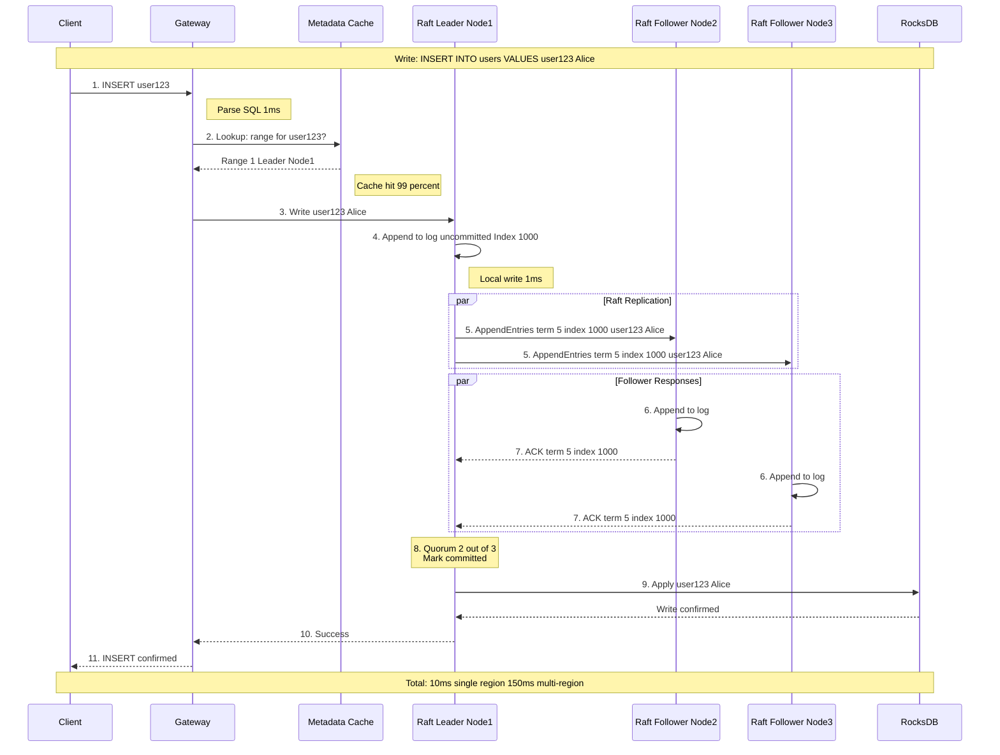

---

## 2. Read from Leader

**Flow:**

Read with strong consistency (linearizable). Client query routed to Raft leader. Leader serves read from its state machine (RocksDB). Guarantees latest committed value.

**Steps:**

1. **Client → Gateway** (1ms): SELECT query
2. **Gateway → Metadata** (1ms): Lookup range owner (cache hit)
3. **Gateway → Leader** (1ms): Route read to leader
4. **Leader → RocksDB** (2ms): Read from state machine
5. **Leader → Gateway → Client** (2ms): Return result

**Total Latency:** 7ms (local), 100ms (cross-region if leader far away)

**Use Cases:**
- Financial transactions (strong consistency required)
- Write-then-read consistency (read-your-writes)
- Critical operations (account balance, inventory)

**Trade-offs:**
- Higher latency if leader is far from client
- Leader becomes read bottleneck (can't scale horizontally)
- 30K reads/sec per Raft group (leader limit)

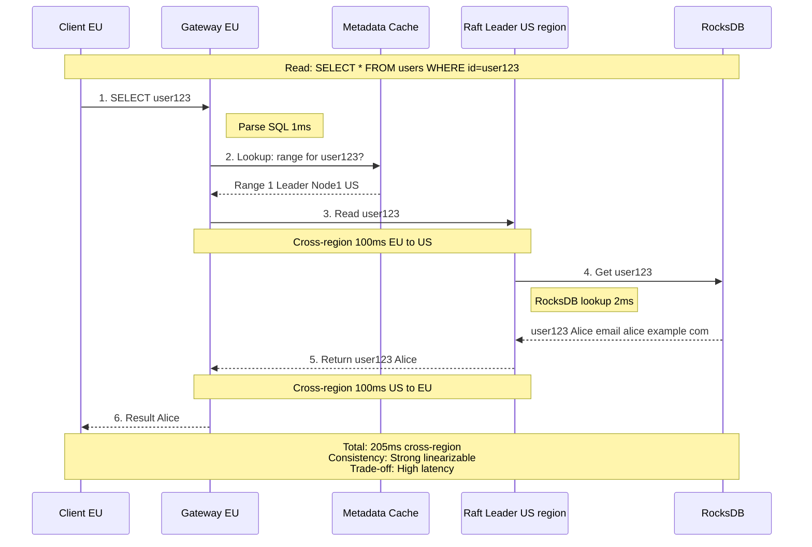

---

## 3. Read from Follower with Timestamp

**Flow:**

Read with snapshot isolation using historical timestamp. Client specifies "AS OF SYSTEM TIME 1 min ago". Gateway routes to nearest follower. Follower checks if it has data for that timestamp (via MVCC). If yes, returns immediately. If no, waits for replication.

**Steps:**

1. **Client → Gateway** (1ms): SELECT ... AS OF SYSTEM TIME T-1min
2. **Gateway → Metadata** (1ms): Lookup range, find nearest follower
3. **Gateway → Follower** (5ms): Route to local follower (same region)
4. **Follower checks** (1ms): Do I have data for timestamp T-1min?
5. **If YES** (1ms): Read from RocksDB, return
6. **If NO** (wait): Wait for replication to catch up to T-1min
7. **Follower → Gateway → Client** (2ms): Return result

**Total Latency:** 10ms (local follower), much faster than 100ms cross-region leader read

**Benefits:**
- Low latency (read from nearest replica)
- Strong consistency (snapshot at specific timestamp)
- Scales horizontally (utilize all replicas)
- 90K reads/sec (3 replicas × 30K each)

**Trade-offs:**
- Cannot read absolute latest (must specify past timestamp)
- If follower too far behind, must wait for catch-up

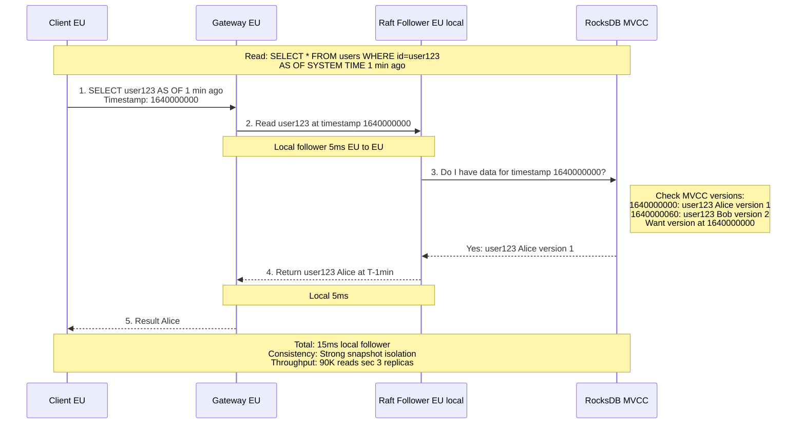

---

## 4. Two-Phase Commit Transaction

**Flow:**

Multi-shard transaction transferring money from Account A (Shard 1) to Account B (Shard 2). Coordinator ensures atomicity using 2PC. Phase 1 (PREPARE): All shards lock rows and vote. Phase 2 (COMMIT): If all YES, commit; else abort.

**Steps:**

**Transaction Start:**
1. Client → Coordinator: BEGIN TRANSACTION
2. Client → Coordinator: UPDATE account A (Shard 1)
3. Client → Coordinator: UPDATE account B (Shard 2)
4. Client → Coordinator: COMMIT

**Phase 1 (PREPARE):**
5. Coordinator → Shard 1: PREPARE (can you commit? lock row A)
6. Coordinator → Shard 2: PREPARE (can you commit? lock row B)
7. Shard 1: Lock row A, check balance >= $50 → Vote YES
8. Shard 2: Lock row B, check constraints → Vote YES
9. Both vote YES → Proceed to Phase 2

**Phase 2 (COMMIT):**
10. Coordinator → Shard 1: COMMIT (apply change)
11. Coordinator → Shard 2: COMMIT (apply change)
12. Shard 1: Apply, release lock → ACK
13. Shard 2: Apply, release lock → ACK
14. Coordinator → Client: Transaction SUCCESS

**Total Latency:** 20-50ms (2 network RTTs: PREPARE + COMMIT)

**Failure Handling:**
- If any shard votes NO → Coordinator sends ABORT to all
- If shard crashes after YES → Coordinator retries COMMIT (locks held)
- If coordinator crashes → Participants timeout, abort (conservative)

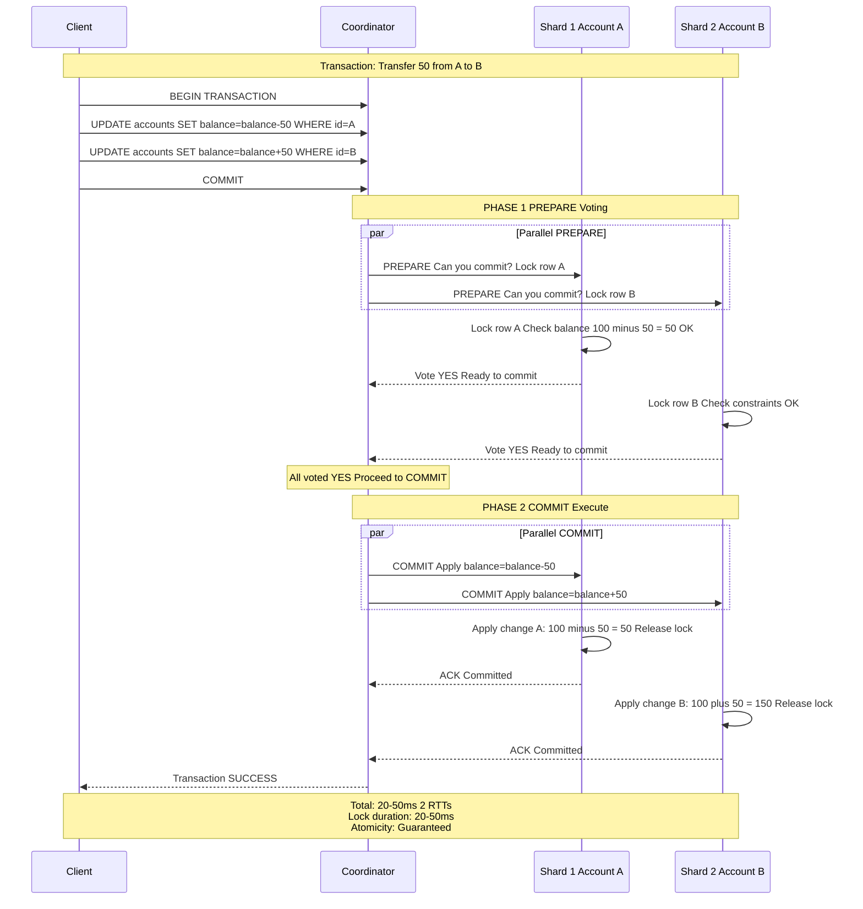

---

## 5. Leader Election After Failure

**Flow:**

Leader fails (crash or network partition). Followers detect missing heartbeats (1 second timeout). One follower transitions to CANDIDATE, increments term, requests votes. Majority votes → New leader elected. New leader updates metadata, sends heartbeats.

**Steps:**

1. **Normal Operation** (0-1000ms): Leader sends heartbeats every 100ms
2. **Leader Fails** (1000ms): Node 1 crashes/partitioned
3. **Followers Timeout** (1000-1500ms): No heartbeat for 1 second
4. **Candidate Emerges** (1500ms): Node 2 transitions to CANDIDATE, term 5 → 6
5. **Request Votes** (1500-1700ms): Node 2 sends RequestVote to Node 2, 3
6. **Voting** (1700-1900ms): Node 2 votes for self, Node 3 votes for Node 2
7. **Win Election** (1900ms): Node 2 receives 2/3 votes → Becomes LEADER
8. **Update Metadata** (1900-2000ms): Write to etcd: range 1 leader = Node 2
9. **Send Heartbeats** (2000ms): New leader establishes authority
10. **Resume Operations** (2000ms): Cluster operational with new leader

**Total Downtime:** ~1-2 seconds

**Split Vote Scenario:** If two candidates split votes, election times out, retry with higher term.

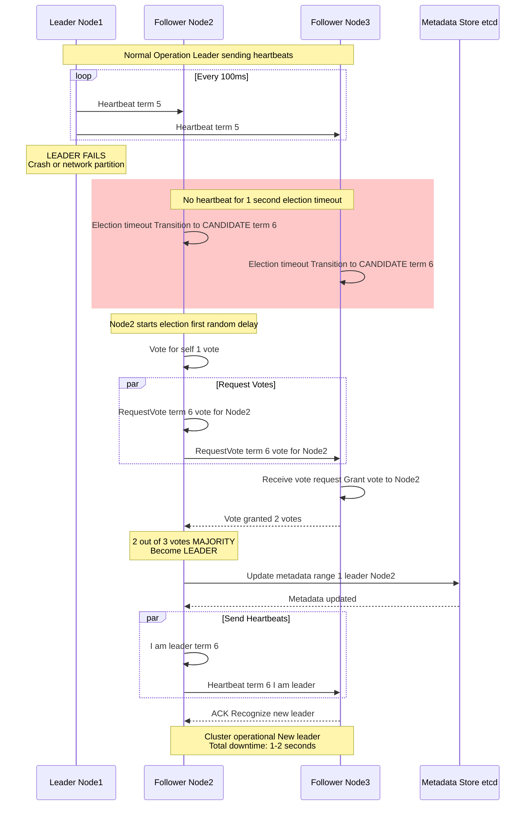

---

## 6. Range Split Operation

**Flow:**

Range becomes hot (>10K QPS) or too large (>64 MB). Split coordinator detects hotspot, calculates median key, creates new Raft group, migrates data, updates metadata. Zero downtime (reads/writes continue).

**Steps:**

1. **Monitoring** (continuous): Track QPS, size for all ranges
2. **Detection** (T+60s): Range 1 exceeds 10K QPS for 60 seconds → Flag hotspot
3. **Split Decision** (T+61s): Calculate median key "M" to split at
4. **Create New Group** (T+62s): Allocate Nodes 4, 5, 6 for new Raft Group B
5. **Copy Data** (T+62s - T+5min): Background copy of data [N-Z] to Group B
6. **Dual Write** (T+62s - T+5min): Writes to [N-Z] go to both groups (temporary)
7. **Update Metadata** (T+5min): etcd update: range 1a [A-M] Node 1, range 1b [N-Z] Node 4
8. **Delete Old Data** (T+6min): Delete [N-Z] from Group A
9. **Complete** (T+6min): Split complete, both ranges healthy

**Duration:** 30 seconds (small range) to 5 minutes (large range)

**Performance Impact:** None (reads/writes continue, slight write amplification during dual-write phase)

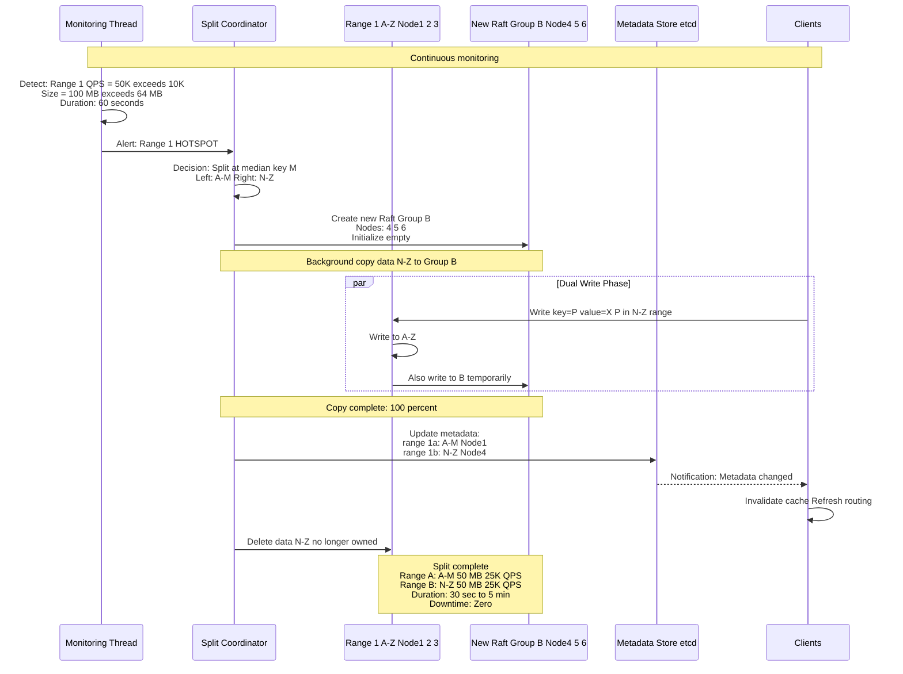

---

## 7. Timestamp Oracle Request

**Flow:**

Transaction needs globally unique timestamp for MVCC. Client requests timestamp from timestamp oracle (HA Raft cluster). Oracle increments counter, returns unique timestamp. Transaction uses this timestamp for all writes.

**Steps:**

1. **Transaction Start:** Client begins transaction
2. **Request Timestamp:** Client → Timestamp Oracle: "Give me a timestamp"
3. **Oracle Process** (1ms):
   - Increment counter: 1640000000001 → 1640000000002
   - Log to Raft group (durability)
4. **Return Timestamp:** Oracle → Client: "1640000000002"
5. **Transaction Execution:** All writes tagged with timestamp 1640000000002
6. **MVCC:** Row stored as: (key=X, value=Y, timestamp=1640000000002)

**Timestamp Structure:**

```
64-bit: [Physical Time: 48 bits][Logical Counter: 16 bits]
Example: 1640000000.0002
```

**Performance:**

- Latency: 1-2ms per timestamp request
- Throughput: 1M timestamps/sec (oracle leader limit)
- Batch optimization: Pre-allocate 1000 timestamps per request

**Failure:** Oracle is HA (Raft). If leader fails, new leader elected (<2s downtime).

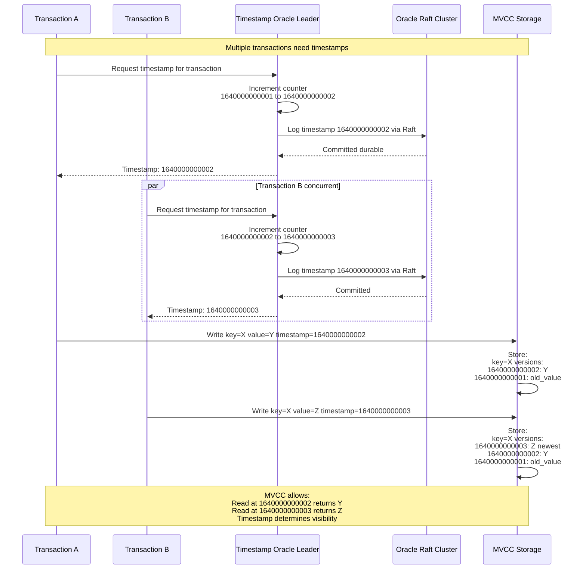

---

## 8. Metadata Lookup and Caching

**Flow:**

Gateway needs to route query to correct Raft group. First checks local cache (99% hit). On cache miss, queries etcd metadata store. Caches result with 60-second TTL. When metadata changes (e.g., range split, leader failover), etcd sends notification, gateway invalidates cache.

**Steps:**

**Cache Hit (99% of requests):**
1. Client → Gateway: SELECT user123
2. Gateway checks cache: range for user123?
3. Cache hit: Range 1, Leader Node 1
4. Gateway → Leader Node 1: Execute query
5. Total: <1ms overhead

**Cache Miss (1% of requests):**
1. Client → Gateway: SELECT user999
2. Gateway checks cache: Miss
3. Gateway → etcd: Query range for user999
4. etcd → Gateway: Range 3, Leader Node 7
5. Gateway caches: user999 → Range 3, Node 7 (TTL: 60s)
6. Gateway → Leader Node 7: Execute query
7. Total: 50ms overhead (etcd query)

**Metadata Change (e.g., leader failover):**
1. Leader Node 1 fails → Node 2 becomes leader
2. Node 2 → etcd: Update range 1 leader = Node 2
3. etcd → All Gateways: Notification (watch mechanism)
4. Gateway: Invalidate cache entry for Range 1
5. Next query: Cache miss, fetch new metadata

**Benefits:**

- 99% cache hit rate → 1ms metadata lookup
- 1% cache miss → 50ms metadata lookup
- Average: 1.5ms metadata overhead

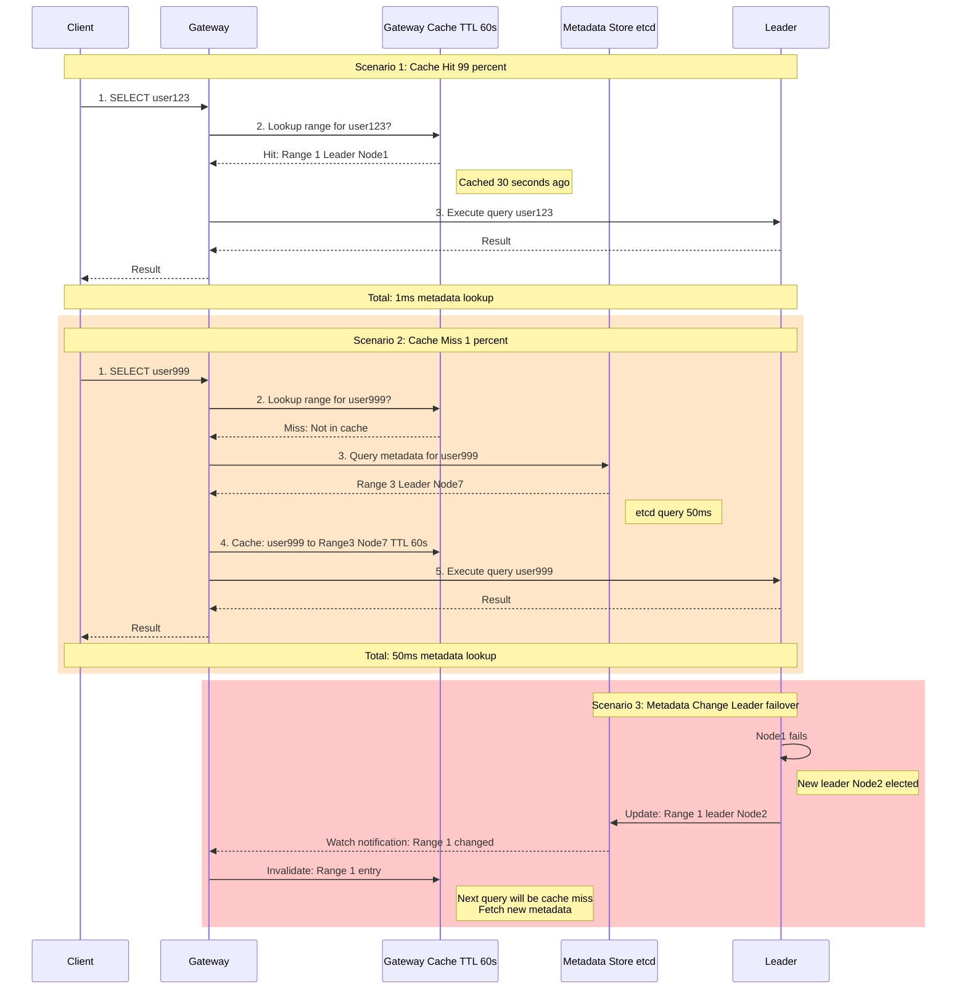

---

## 9. Transaction Abort Scenario

**Flow:**

Two-phase commit transaction where one participant votes NO (e.g., insufficient balance). Coordinator sends ABORT to all participants. All participants roll back changes and release locks. Client receives error.

**Steps:**

1. **Transaction Start:** Client begins transfer $100 from A to B
2. **Phase 1 PREPARE:**
   - Coordinator → Shard 1 (Account A): PREPARE
   - Coordinator → Shard 2 (Account B): PREPARE
3. **Shard 1 Processing:**
   - Lock row A
   - Check: balance = $50 < $100 → Insufficient
   - Vote: NO (cannot commit)
4. **Shard 2 Processing:**
   - Lock row B
   - Check: constraints OK
   - Vote: YES (can commit)
5. **Coordinator Decision:**
   - Receives NO from Shard 1 → Must ABORT
6. **Phase 2 ABORT:**
   - Coordinator → Shard 1: ABORT
   - Coordinator → Shard 2: ABORT
7. **Participants Roll Back:**
   - Shard 1: Release lock (no changes made)
   - Shard 2: Release lock, roll back any changes
8. **Coordinator → Client:** Transaction FAILED (insufficient balance)

**Result:** No changes made, locks released, consistent state maintained.

**Latency:** 20-30ms (same as successful commit, just different outcome)

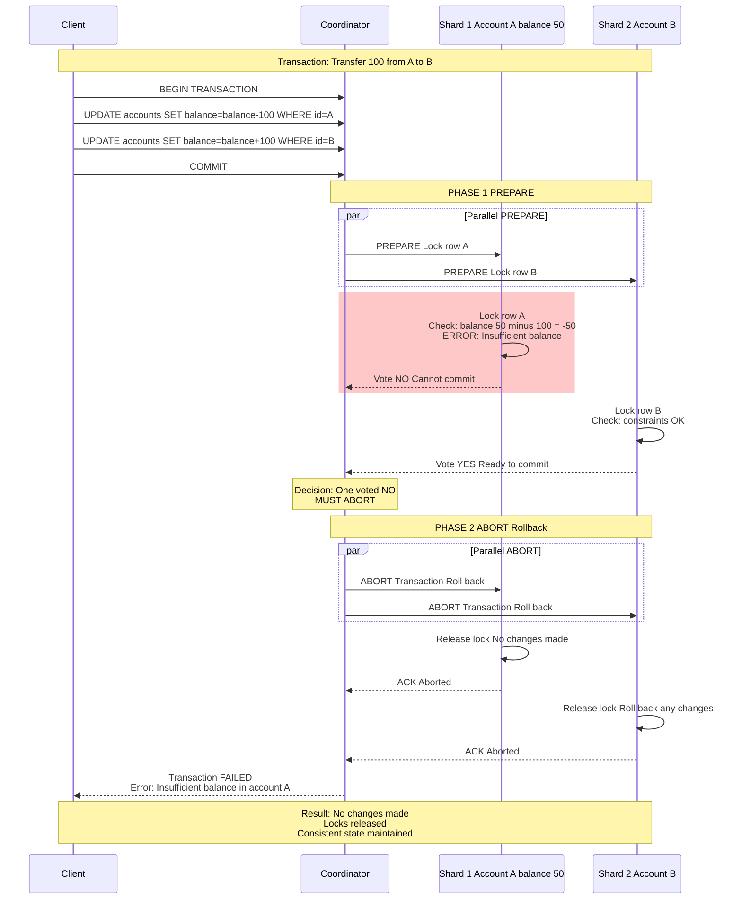

---

## 10. Follower Lag and Catch-Up

**Flow:**

Follower falls behind leader due to network slowness or high load. Leader continues accepting writes, log index increases. Follower eventually catches up by receiving batch of AppendEntries. Shows how Raft handles temporary network issues without losing data.

**Steps:**

1. **Normal Replication:** Leader index 1000, Follower 1 index 1000, Follower 2 index 1000
2. **Network Delay:** Follower 2 experiences network delay (200ms latency spike)
3. **Leader Continues:** Leader commits index 1001, 1002, 1003, 1004, 1005
4. **Follower 2 Lags:** Follower 2 still at index 1000 (lagging by 5 entries)
5. **Leader Detects Lag:** Next heartbeat, leader sees Follower 2 at index 1000
6. **Batch Catch-Up:** Leader sends AppendEntries with entries 1001-1005 (batch)
7. **Follower Processes Batch:** Follower 2 appends 1001, 1002, 1003, 1004, 1005
8. **Follower Catches Up:** Follower 2 index now 1005 (caught up)
9. **Resume Normal:** All nodes at index 1005, normal replication resumes

**Performance:**

- Typical follower lag: <100ms (network latency)
- Max acceptable lag: 10 seconds (configurable alert threshold)
- Catch-up throughput: 100 MB/sec (network limited)

**Failure Scenario:** If follower lags >1 hour, may trigger full snapshot transfer (expensive).

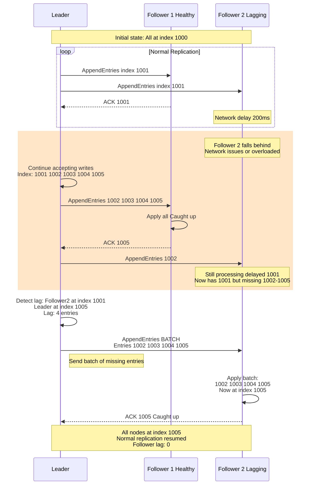

---

## 11. Node Crash Recovery

**Flow:**

Node crashes (power loss, kernel panic). Node restarts, reads Write-Ahead Log (WAL) to recover uncommitted entries. Rejoins Raft group as follower, catches up from leader, applies missing committed entries. Demonstrates durability guarantee of Raft.

**Steps:**

1. **Normal Operation:** Node 2 operating normally, index 1500
2. **Crash:** Node 2 crashes (power loss), in-memory state lost
3. **Restart:** Node 2 restarts, loads WAL from disk
4. **WAL Recovery:**
   - Read WAL: Find committed index was 1499
   - Replay uncommitted entry 1500 (was in log but not committed)
5. **Rejoin Cluster:** Node 2 contacts leader (Node 1)
6. **Sync State:**
   - Node 2: "I'm at index 1500"
   - Leader: "I'm at index 1600, you're missing 1501-1600"
7. **Catch-Up:** Leader sends AppendEntries 1501-1600 (batch)
8. **Apply Entries:** Node 2 applies 1501-1600
9. **Fully Recovered:** Node 2 at index 1600, rejoins as healthy follower
10. **Resume Replication:** Participates in quorum again

**Duration:** 10-60 seconds (depends on log size)

**Data Loss:** None (WAL ensures durability)

**Downtime for Node:** 10-60 seconds. **Downtime for Cluster:** Zero (quorum maintained with other 2 nodes).

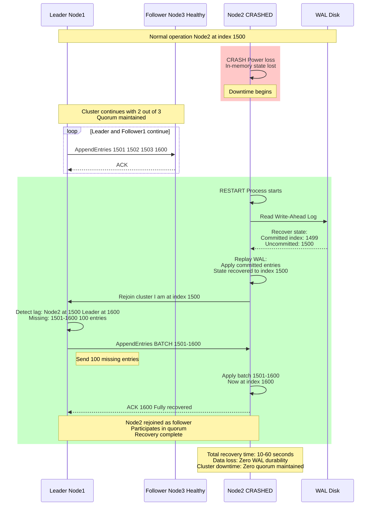

---

## 12. Online Schema Migration

**Flow:**

Add column to table without downtime. Migration happens in 4 phases: (1) Write both schemas, (2) Backfill old rows, (3) Switch reads to new schema, (4) Drop old schema. Shows how MVCC enables multi-version schema coexistence.

**Steps:**

**Phase 1 (Week 1):**
1. Deploy new code: Writes include new column (email)
2. Old rows: (user_id, name)
3. New rows: (user_id, name, email)
4. Reads: Return old schema only (backwards compatible)

**Phase 2 (Week 2-4):**
5. Background worker: UPDATE users SET email=NULL WHERE email IS MISSING
6. Progress: 0% → 100% over 2-3 weeks
7. Reads: Still return old schema (consistent view)

**Phase 3 (Week 5):**
8. Deploy new code: Reads include new column (email)
9. All rows now have email (backfill complete)
10. Clients see new schema

**Phase 4 (Week 6):**
11. Drop old schema version from metadata
12. Reclaim storage space

**Duration:** 4-6 weeks for billion-row table

**Downtime:** Zero (all operations continue)

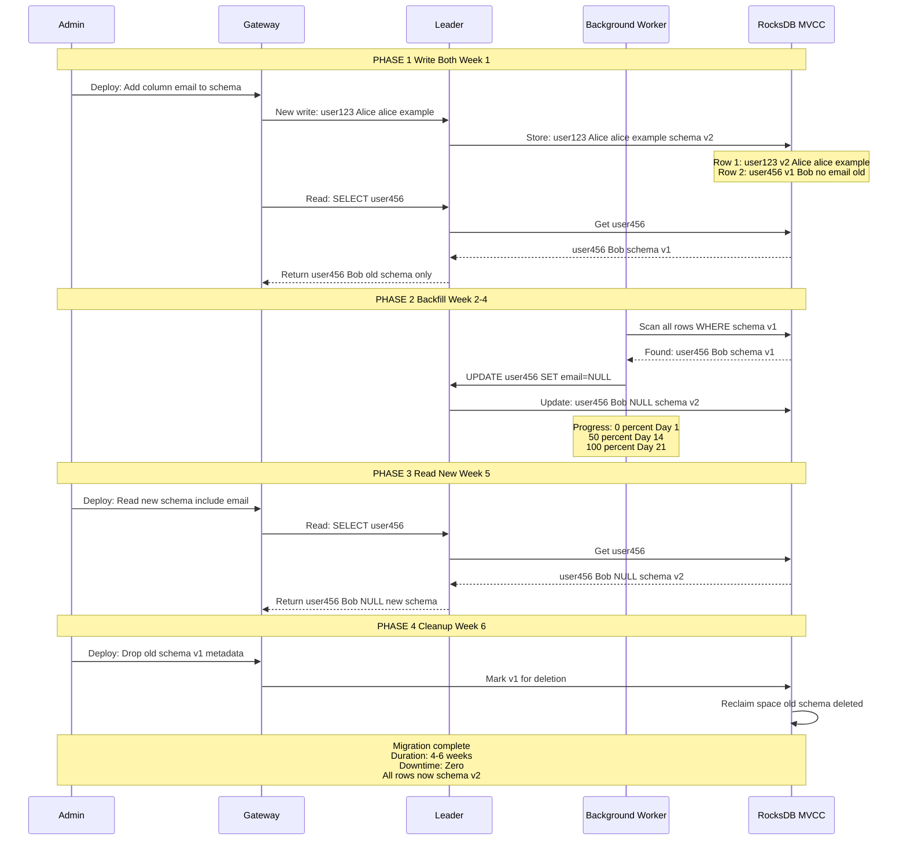

