# Stock Exchange Matching Engine - High-Level Design

## Table of Contents

1. [Complete System Architecture](#1-complete-system-architecture)
2. [Order Book Data Structure](#2-order-book-data-structure)
3. [Single-Threaded Matching Engine](#3-single-threaded-matching-engine)
4. [Ring Buffer (Lock-Free Queue)](#4-ring-buffer-lock-free-queue)
5. [DPDK Kernel Bypass Networking](#5-dpdk-kernel-bypass-networking)
6. [Audit Log (Write-Ahead Log)](#6-audit-log-write-ahead-log)
7. [Market Data Fanout Architecture](#7-market-data-fanout-architecture)
8. [Crash Recovery Flow](#8-crash-recovery-flow)
9. [Sharding by Symbol](#9-sharding-by-symbol)
10. [CPU Affinity and NUMA](#10-cpu-affinity-and-numa)
11. [Object Pool Memory Management](#11-object-pool-memory-management)
12. [Multi-Region Deployment](#12-multi-region-deployment)
13. [Circuit Breaker System](#13-circuit-breaker-system)
14. [Monitoring and Observability](#14-monitoring-and-observability)

---

## 1. Complete System Architecture

**Flow Explanation:**

This diagram shows the end-to-end architecture of the stock exchange matching engine, optimized for sub-100μs latency.

**Key Components:**

1. **Client Layer:** Traders, HFT algorithms, market makers connect via FIX protocol
2. **Low-Latency Gateway:** Validates orders, uses DPDK kernel bypass for <5μs network latency
3. **Ring Buffer:** Lock-free shared memory queue (<100ns latency) for inter-process communication
4. **Matching Engine:** Single-threaded core processes orders from in-memory order book
5. **Audit Log:** Asynchronous writes to NVMe SSD for durability (272 MB/sec throughput)
6. **Market Data Feed:** Kafka + WebSocket broadcasts to 1M+ subscribers
7. **Ledger Service:** ACID database for user balances (async updates, eventual consistency)

**Performance Characteristics:**

- **End-to-end latency:** <100μs (p99)
- **Throughput:** 1M orders/sec per matching engine
- **Scalability:** Shard by symbol (10K engines = 10B orders/sec)

**Trade-offs:**

- ✅ **Ultra-low latency:** Single-threaded design avoids lock overhead
- ❌ **Single-core limit:** Must shard by symbol to scale beyond 1-2M orders/sec
- ⚠️ **Eventual consistency:** Ledger updates async (user balances lag by 1-10ms)

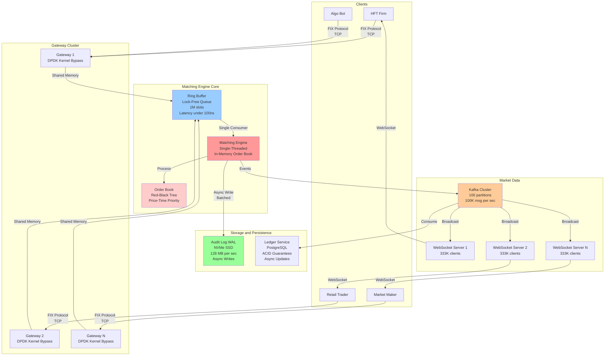

---

## 2. Order Book Data Structure

**Flow Explanation:**

This diagram illustrates the in-memory order book data structure using Red-Black Tree + Linked Lists for optimal
matching performance.

**Structure:**

1. **Bid Side (Buy Orders):** Red-Black Tree sorted in descending order (highest price first)
2. **Ask Side (Sell Orders):** Red-Black Tree sorted in ascending order (lowest price first)
3. **Price Level:** Each tree node contains a linked list of orders at that price (FIFO time priority)
4. **Order Lookup:** HashMap for O(1) cancellation by order_id

**Algorithmic Complexity:**

- **Insert Order:** O(log N) tree insert + O(1) linked list append = O(log N)
- **Best Bid/Ask:** O(1) cached at tree root
- **Match Order:** O(log N) tree traversal + O(K) matches (K = orders matched)
- **Cancel Order:** O(1) hash lookup + O(log N) tree update

**Memory Layout:**

- **Order:** 64 bytes (cache-line aligned)
- **Tree Node:** 40 bytes (parent, left, right, color, data)
- **10K orders:** 640 KB (fits in L2 cache: 1-2 MB)

**Trade-offs:**

- ✅ **Fast matching:** O(log N) for best price, O(1) for execution
- ✅ **Cache-friendly:** Sequential access within price level (linked list)
- ❌ **Memory overhead:** Tree nodes + linked list pointers (~40% overhead)

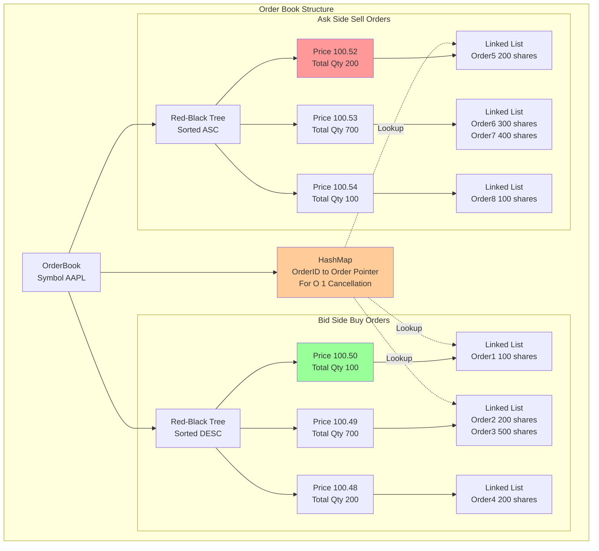

---

## 3. Single-Threaded Matching Engine

**Flow Explanation:**

This diagram shows why single-threaded design is faster than multi-threaded for ultra-low-latency matching.

**Single-Threaded Benefits:**

1. **No Locks:** No mutex acquire/release overhead (50-100 cycles saved)
2. **No Cache Coherency:** All data in L1 cache (no ping-pong between cores)
3. **No Context Switches:** No OS scheduler interruption (1000-10000 cycles saved)
4. **Predictable Latency:** Sequential execution, no contention

**Multi-Threaded Problems:**

1. **Lock Contention:** Multiple threads competing for order book lock
2. **False Sharing:** Cache line invalidation when threads access adjacent memory
3. **Priority Inversion:** Low-priority thread holds lock, blocking high-priority thread

**Performance Comparison:**

| Design                 | Latency (p50) | Latency (p99) | Throughput       |
|------------------------|---------------|---------------|------------------|
| Single-Threaded        | 50μs          | 100μs         | 1-2M orders/sec  |
| Multi-Threaded + Locks | 500μs         | 5ms           | 5-10M orders/sec |

**When to Use Multi-Threaded:**

- Latency requirement >1ms (locks acceptable)
- Throughput priority (>10M orders/sec needed)
- Complex business logic (not pure matching)

**Trade-offs:**

- ✅ **Minimal latency:** <100μs consistently
- ❌ **Throughput limit:** Single core maxes at 1-2M orders/sec
- ⚠️ **Scaling:** Must shard by symbol (deploy multiple engines)

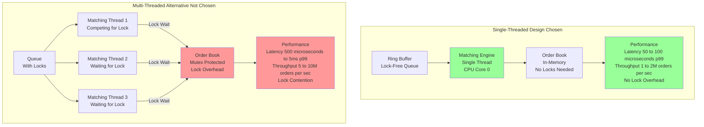

---

## 4. Ring Buffer (Lock-Free Queue)

**Flow Explanation:**

This diagram illustrates the LMAX Disruptor ring buffer pattern for lock-free communication between gateway and matching
engine.

**How It Works:**

1. **Pre-Allocated Array:** 1M slots allocated at startup (no dynamic allocation)
2. **Write Index:** Producer (gateway) atomically increments write pointer
3. **Read Index:** Consumer (matching engine) atomically increments read pointer
4. **Cache Line Alignment:** Write index and read index on separate cache lines (no false sharing)

**Performance:**

- **Enqueue:** Atomic CAS (compare-and-swap) + memory copy = 50-100 cycles = 33ns at 3 GHz
- **Dequeue:** Atomic CAS + memory copy = 50-100 cycles = 33ns
- **Total:** <100ns round-trip (10× faster than mutex lock)

**Key Optimizations:**

1. **Single Producer, Single Consumer:** No contention (no CAS retry loop)
2. **Power-of-2 Size:** Modulo becomes bitwise AND (fast: `index & (SIZE-1)`)
3. **Huge Pages:** Reduce TLB misses (2 MB pages instead of 4 KB)

**Trade-offs:**

- ✅ **Ultra-low latency:** <100ns per operation
- ✅ **Lock-free:** No blocking, no priority inversion
- ❌ **Fixed size:** Must pre-allocate (cannot grow dynamically)
- ⚠️ **Backpressure:** If full, producer must block or drop orders

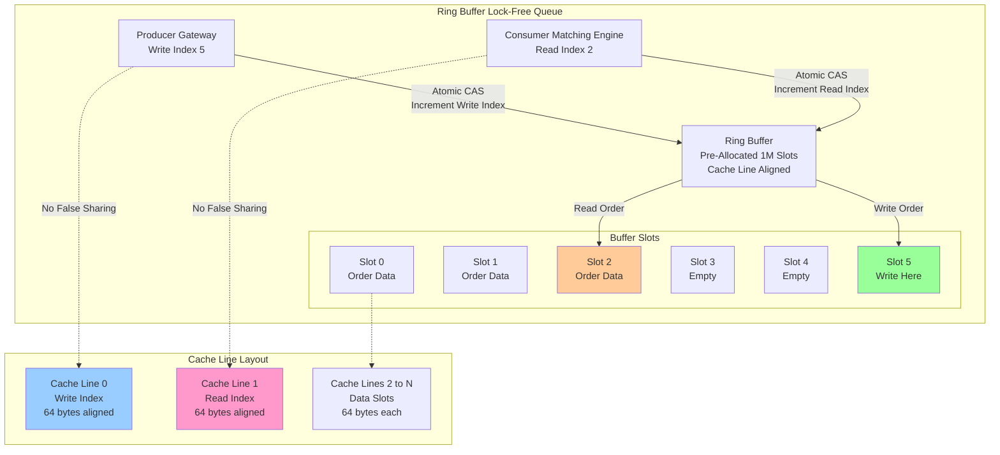

---

## 5. DPDK Kernel Bypass Networking

**Flow Explanation:**

This diagram compares traditional Linux networking stack with DPDK kernel bypass for low-latency packet processing.

**Traditional Stack Problems:**

1. **Interrupt Overhead:** NIC generates interrupt, CPU context switches (1000+ cycles)
2. **Kernel Copy:** Packet copied from NIC buffer to kernel buffer to application buffer (3× memory copy)
3. **Network Stack:** TCP/IP processing in kernel (checksums, fragmentation, routing)
4. **Latency:** 10-50μs total (too slow for HFT)

**DPDK (Data Plane Development Kit):**

1. **Poll Mode:** Application polls NIC directly (no interrupts, no context switches)
2. **Zero-Copy:** Packet data accessed directly in NIC memory (DMA)
3. **Userspace Stack:** TCP/IP processing in application (optimized for latency)
4. **Latency:** 1-5μs (10× faster!)

**Requirements:**

- **Dedicated CPU Cores:** Polling loop runs at 100% CPU utilization
- **Huge Pages:** Reduce TLB misses (2 MB pages)
- **NIC Support:** Intel X710, Mellanox ConnectX-6 (DPDK drivers)

**Trade-offs:**

- ✅ **10× latency reduction:** 50μs → 5μs
- ❌ **CPU overhead:** 100% utilization for polling (1-2 cores dedicated)
- ❌ **Complexity:** Custom userspace TCP/IP stack required

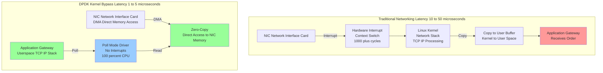

---

## 6. Audit Log (Write-Ahead Log)

**Flow Explanation:**

This diagram shows the async write strategy for the audit log to achieve durability without blocking the matching
engine.

**Synchronous Write Problem:**

```
Order → Match → fsync() disk write → Return to client
                   ↑
               10-50μs latency (blocks matching engine!)
```

**Async Write Solution:**

```
Order → Match → Copy to ring buffer → Return to client
                     ↓
                Background thread → Batch write → fsync()
```

**Write Strategy:**

1. **Matching Engine:** Copies log entry to ring buffer (100ns, non-blocking)
2. **Background Thread:** Consumes ring buffer, batches 1000 entries
3. **Disk Write:** Single fsync() for 1000 entries (amortizes disk latency)
4. **Throughput:** 1M entries/sec × 272 bytes = 272 MB/sec (well within NVMe 3 GB/sec)

**Crash Recovery:**

1. **Read Log:** Sequential read (3 GB/sec) = 90ms for 272 MB
2. **Replay:** 1M orders × 1μs = 1 second
3. **Total Downtime:** ~1 second

**Battery-Backed Cache:**

- NVMe SSD with capacitor backup
- Guarantees persistence on power loss
- Trade-off: +$500 per drive

**Performance:**

- ✅ **Non-blocking writes:** Matching engine latency unaffected
- ✅ **High throughput:** 272 MB/sec sustainable
- ⚠️ **Crash window:** Last 1-10ms of data at risk (mitigated by battery backup)

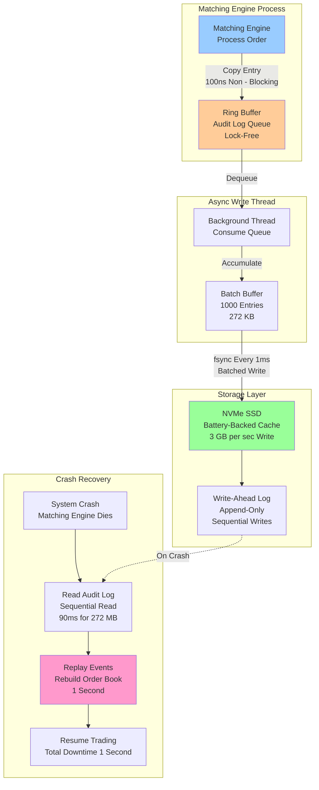

---

## 7. Market Data Fanout Architecture

**Flow Explanation:**

This diagram shows the hierarchical fanout architecture for broadcasting market data to 1M+ subscribers.

**Challenge:**

- **100K updates/sec** × **1M subscribers** = 100 billion messages/sec (impossible from single server)

**Solution: Hierarchical Fanout**

1. **Matching Engine:** Publishes to Kafka (100K msg/sec)
2. **Kafka Cluster:** 100 partitions (shard by symbol)
3. **WebSocket Servers:** 100 servers, each handles 10K clients
4. **Per-Client Rate:** 100K msg/sec ÷ 1M clients = 0.1 msg/sec (manageable)

**Optimizations:**

**Conflation:**

```
Raw updates (within 10ms):
  $100.50 → $100.51 → $100.52 → $100.50

Conflated (send only last):
  $100.50

Reduction: 10× fewer messages
```

**Protocol Buffers (Not JSON):**

- JSON: 48 bytes, 5μs encoding
- ProtoBuf: 16 bytes, 0.5μs encoding
- **Result:** 3× smaller, 10× faster

**Latency Breakdown:**

```
Matching Engine → Kafka:    100μs
Kafka → WS Server:           500μs
WS Server → Client:          500μs
Total:                       1.1ms (acceptable)
```

**HFT Optimization:**

- Direct feed from matching engine (bypass Kafka)
- Co-location: HFT servers in same datacenter
- Latency: <10μs

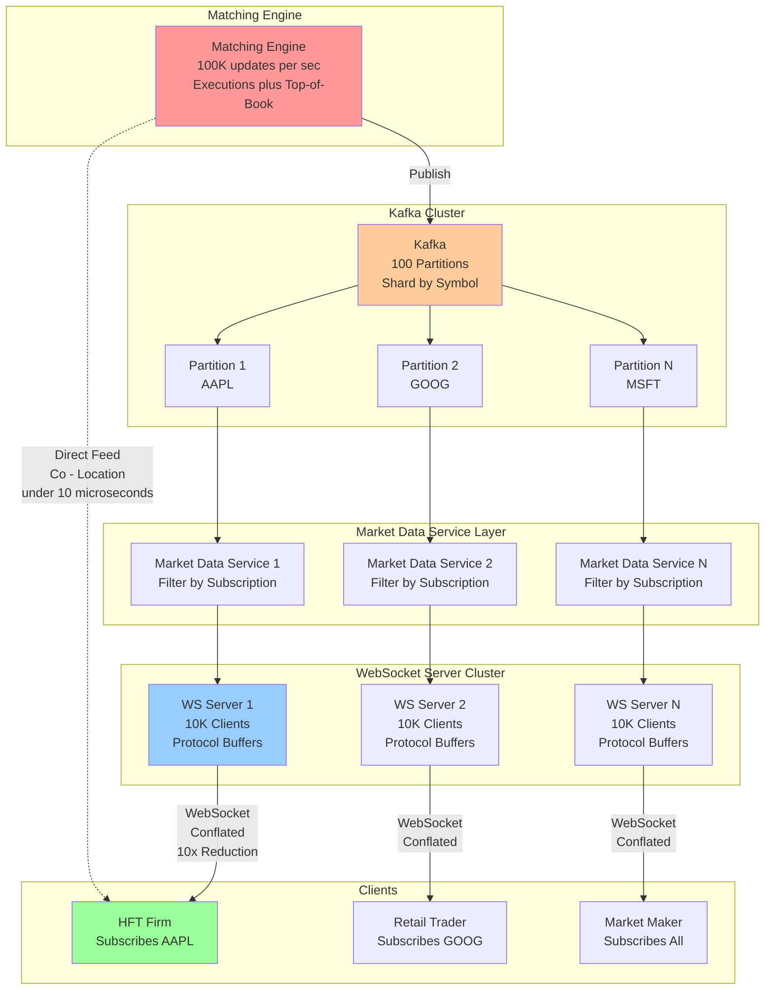

---

## 8. Crash Recovery Flow

**Flow Explanation:**

This diagram illustrates the crash recovery process using audit log replay to rebuild the order book.

**Recovery Steps:**

1. **Detect Crash:** Heartbeat monitor (1-second timeout)
2. **Read Audit Log:** Sequential read from NVMe SSD (90ms for 272 MB)
3. **Replay Events:** Process each log entry to rebuild order book state
4. **Validate State:** Verify best bid/ask, total volumes
5. **Resume Trading:** Accept new orders (<1 second total downtime)

**Hot Standby Failover:**

- **Primary Engine:** Processes orders, writes audit log
- **Standby Engine:** Receives audit log (async replication), maintains shadow order book
- **On Crash:** Promote standby to primary (<1 second failover)

**Event Replay:**

```
Log Entry 1: ORDER_RECEIVED → Insert into order book
Log Entry 2: ORDER_MATCHED → Remove from book, generate execution
Log Entry 3: ORDER_CANCELLED → Remove from book
...
Log Entry N: Rebuild complete → Resume trading
```

**Performance:**

- **Downtime:** ~1 second (hot standby) or 10-60 seconds (cold start)
- **Data Loss:** 0 orders (with battery-backed cache)
- **Recovery Rate:** 1M orders/sec × 1μs = 1 second replay time

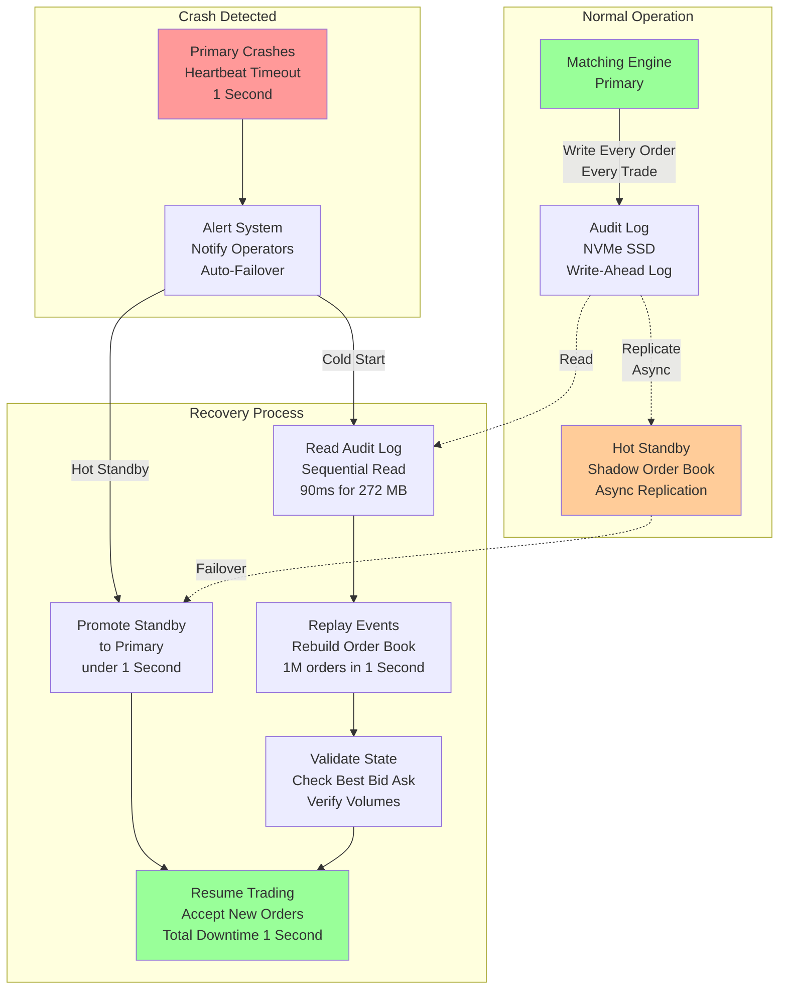

---

## 9. Sharding by Symbol

**Flow Explanation:**

This diagram shows how to scale beyond single-core throughput limits by deploying separate matching engines per stock
symbol.

**Scaling Challenge:**

- **Single Engine:** 1-2M orders/sec (single CPU core limit)
- **Target:** 10B orders/sec (10,000 symbols × 1M orders/sec)

**Sharding Strategy:**

1. **Symbol-Based Partitioning:** Each stock symbol assigned to dedicated matching engine
2. **Independent Engines:** Separate CPU core, memory, order book per symbol
3. **Gateway Routing:** Gateway routes order to correct engine based on symbol
4. **No Cross-Symbol Coordination:** Each engine operates independently

**Routing Table:**

```
Symbol AAPL → Engine 1 (CPU Core 0, Port 10001)
Symbol GOOG → Engine 2 (CPU Core 1, Port 10002)
Symbol MSFT → Engine 3 (CPU Core 2, Port 10003)
...
Symbol TSLA → Engine 10000 (CPU Core 27, Port 20000)
```

**Cross-Symbol Orders:**

- Rare: <1% of orders (e.g., pairs trading, spreads)
- Handle via slow path: Two-phase commit across engines
- Latency: 1-10ms (acceptable for rare case)

**Benefits:**

- ✅ **Linear Scalability:** 10K symbols × 1M orders/sec = 10B orders/sec
- ✅ **Fault Isolation:** One engine crash doesn't affect others
- ❌ **Resource Overhead:** Each engine needs dedicated core + memory

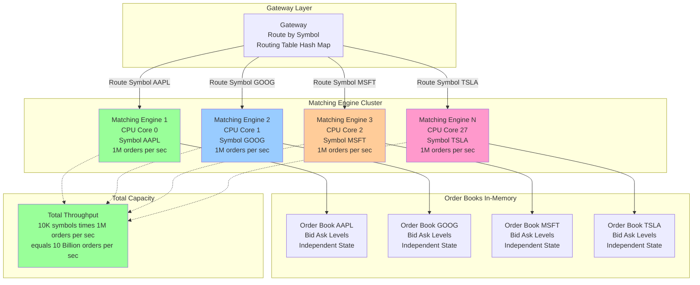

---

## 10. CPU Affinity and NUMA

**Flow Explanation:**

This diagram illustrates CPU affinity and NUMA (Non-Uniform Memory Access) optimizations for minimizing memory latency.

**NUMA Architecture:**

- **2 CPU Sockets:** Each socket has local RAM
- **Local Access:** CPU accesses local RAM in 50-100ns
- **Remote Access:** CPU accesses remote RAM in 150-300ns (3× slower!)

**Optimization Strategy:**

1. **Pin Matching Engine:** Bind thread to specific CPU core (taskset)
2. **Allocate Local Memory:** Allocate order book data on same NUMA node
3. **Disable Hyperthreading:** Avoid sharing L1/L2 cache between threads

**Commands:**

```bash
# Pin to CPU core 0 (Socket 0)
taskset -c 0 ./matching_engine

# Allocate memory on NUMA node 0
numactl --cpunodebind=0 --membind=0 ./matching_engine

# Disable hyperthreading
echo 0 > /sys/devices/system/cpu/cpu1/online
```

**Performance Impact:**

| Optimization                  | Latency Reduction |
|-------------------------------|-------------------|
| CPU Pinning (avoid migration) | 10-20%            |
| NUMA Local Memory             | 30-40%            |
| Disable Hyperthreading        | 5-10%             |
| **Total**                     | **~50% faster**   |

**Trade-offs:**

- ✅ **30% latency reduction:** Remote RAM avoided
- ✅ **Predictable performance:** No CPU migration, no cache eviction
- ❌ **Reduced flexibility:** Cannot use all cores for other tasks

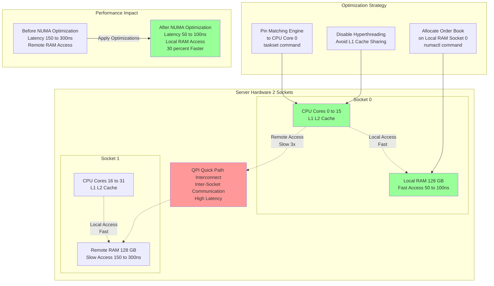

---

## 11. Object Pool Memory Management

**Flow Explanation:**

This diagram shows the object pool pattern for avoiding malloc/free overhead in the hot path.

**malloc/free Problems:**

1. **Latency:** 50-500ns per allocation (syscall overhead)
2. **Fragmentation:** Long-running process accumulates fragmentation
3. **Non-Deterministic:** Latency varies based on heap state

**Object Pool Solution:**

1. **Pre-Allocate:** Allocate 10M Order objects at startup
2. **Free List:** Maintain linked list of available slots
3. **Allocate:** Pop from free list (O(1), 5-10ns)
4. **Deallocate:** Push to free list (O(1), 5-10ns)

**Implementation:**

```cpp
struct ObjectPool {
  Order* pool;           // Pre-allocated array (10M orders)
  Order* free_list;      // Linked list of available slots
  
  Order* allocate() {
    Order* obj = free_list;
    free_list = free_list->next;
    return obj;  // 5-10ns
  }
  
  void deallocate(Order* obj) {
    obj->next = free_list;
    free_list = obj;  // 5-10ns
  }
};
```

**Memory Layout:**

- **Pool Size:** 10M orders × 64 bytes = 640 MB
- **Cache-Line Aligned:** Each order on 64-byte boundary
- **NUMA Local:** Allocated on same node as matching engine

**Performance:**

- ✅ **10× faster:** 5-10ns vs 50-500ns (malloc)
- ✅ **Predictable:** Constant-time allocation
- ❌ **Fixed capacity:** Cannot grow beyond 10M orders

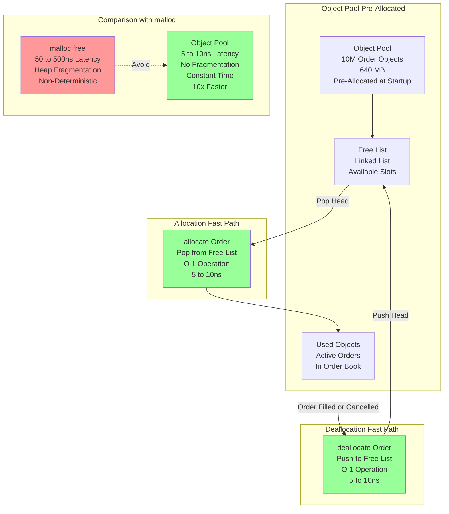

---

## 12. Multi-Region Deployment

**Flow Explanation:**

This diagram shows a multi-region deployment strategy for global exchanges with failover capabilities.

**Architecture:**

1. **Primary Region (US East):** Handles all trading, writes audit log
2. **Standby Region (US West):** Receives audit log replication, maintains shadow order book
3. **Disaster Recovery Region (EU):** Cold standby, only activated on regional failure

**Replication Strategy:**

- **Audit Log Replication:** Async replication (<10ms lag)
- **Order Book Snapshot:** Hourly snapshots to S3 (backup)
- **Failover Time:** <5 seconds (promote standby to primary)

**Latency Considerations:**

- **US East Client → US East Exchange:** 1-5ms
- **US West Client → US East Exchange:** 30-50ms (cross-coast)
- **EU Client → US East Exchange:** 80-120ms (cross-Atlantic)

**Optimization for Global Clients:**

- **Smart Order Routing:** Route to nearest region for market data
- **Execution Always Primary:** All trades execute in primary region (consistency)

**Trade-offs:**

- ✅ **High availability:** <5 seconds failover on regional outage
- ✅ **Disaster recovery:** EU region as last resort
- ❌ **Cost:** 3× infrastructure (primary + 2 standbys)

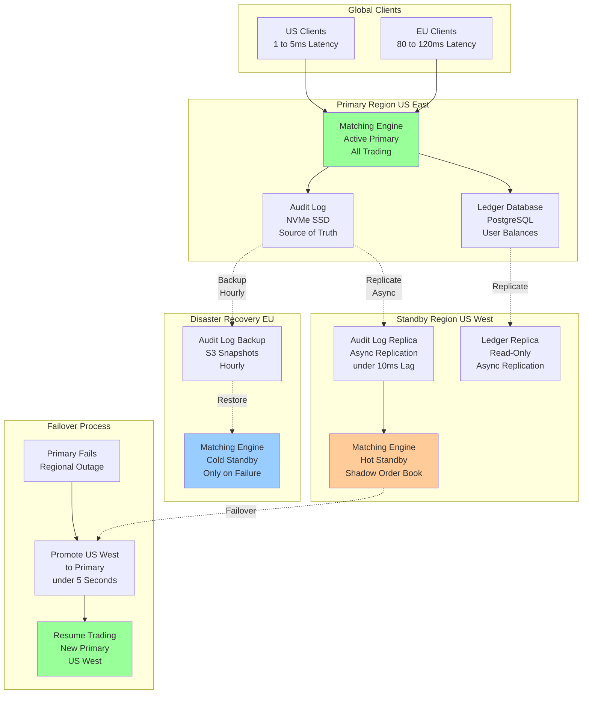

---

## 13. Circuit Breaker System

**Flow Explanation:**

This diagram illustrates the circuit breaker system for handling flash crashes and abnormal market conditions.

**Trigger Conditions:**

1. **Price Movement:** >10% change in 5 minutes
2. **Volume Spike:** 100× normal volume
3. **Order Imbalance:** 95% buy or 95% sell orders
4. **Manual Trigger:** Operator command

**Circuit Breaker Levels:**

**Level 1 (Warning):**

- Slow down order acceptance (rate limiting)
- Alert market participants
- Continue trading

**Level 2 (Pause):**

- Reject new orders for 5 minutes
- Cancel aggressive orders (market orders)
- Preserve limit orders in book

**Level 3 (Halt):**

- Stop all trading
- Cancel all orders
- Notify regulators
- Manual resume (30-60 minutes)

**Implementation:**

```
Monitor Thread (every 1 second):
  1. Check last_trade_price vs VWAP (volume-weighted average)
  2. If delta > 10%: Trigger Level 2
  3. If delta > 20%: Trigger Level 3
  4. Broadcast halt message to all clients
```

**Recovery:**

- **Level 1:** Auto-resume after 1 minute
- **Level 2:** Auto-resume after 5 minutes
- **Level 3:** Manual operator approval required

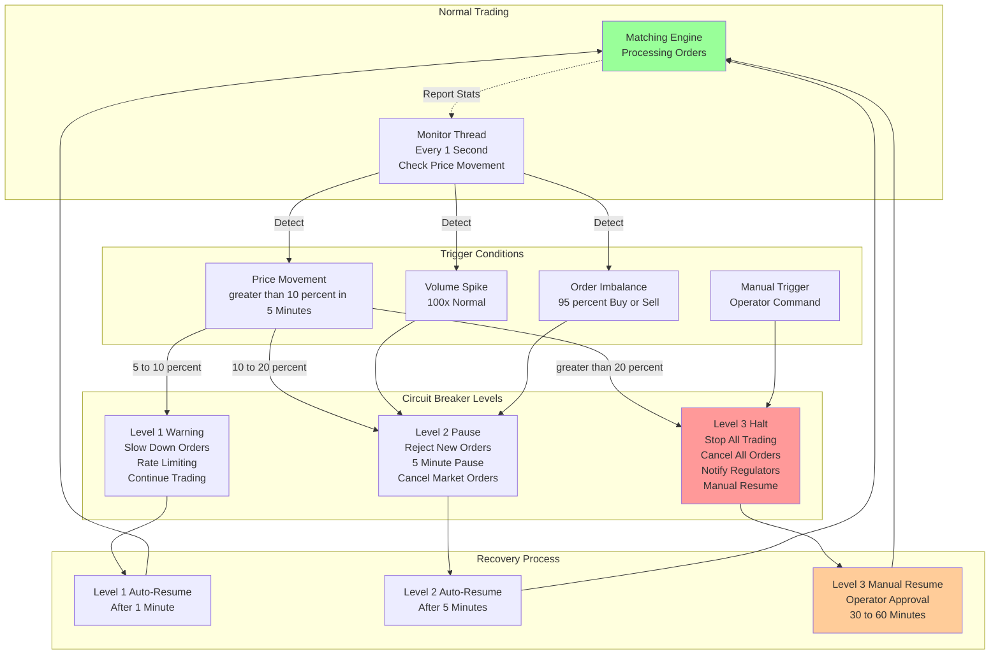

---

## 14. Monitoring and Observability

**Flow Explanation:**

This diagram shows the comprehensive monitoring and observability system for detecting performance degradation and
failures.

**Key Metrics:**

**Latency Metrics:**

- **p50 (Median):** <50μs (half of orders faster than this)
- **p99:** <100μs (99% of orders faster than this)
- **p99.9:** <1ms (worst-case outliers)

**Throughput Metrics:**

- **Orders/sec:** Target 1M, alert if <500K
- **Executions/sec:** Target 100K, alert if <50K
- **Order Reject Rate:** Target <0.1%, alert if >1%

**System Health:**

- **CPU Utilization:** Target 70-80% (matching engine), alert if >95%
- **Memory Usage:** Target <80%, alert if >90%
- **Audit Log Lag:** Target <10ms, alert if >100ms

**Tracing:**

```
Order ID: 12345 (Distributed Trace)
  0μs:    Gateway receive
  5μs:    Ring buffer enqueue
 10μs:    Matching engine dequeue
 50μs:    Match complete (executed)
 60μs:    Audit log written (async)
100μs:    Market data published

Bottleneck: Matching (40μs of 100μs)
Action: Optimize order book traversal
```

**Alerting:**

1. **Critical (Page Oncall):** Matching engine down, p99 >500μs
2. **Warning (Slack):** p99 >200μs, CPU >90%
3. **Info (Dashboard):** Normal metrics, trends

**Tools:**

- **Prometheus:** Metric collection (1-second granularity)
- **Grafana:** Dashboards (real-time visualization)
- **Jaeger:** Distributed tracing (per-order trace)
- **PagerDuty:** Alerting (oncall rotation)

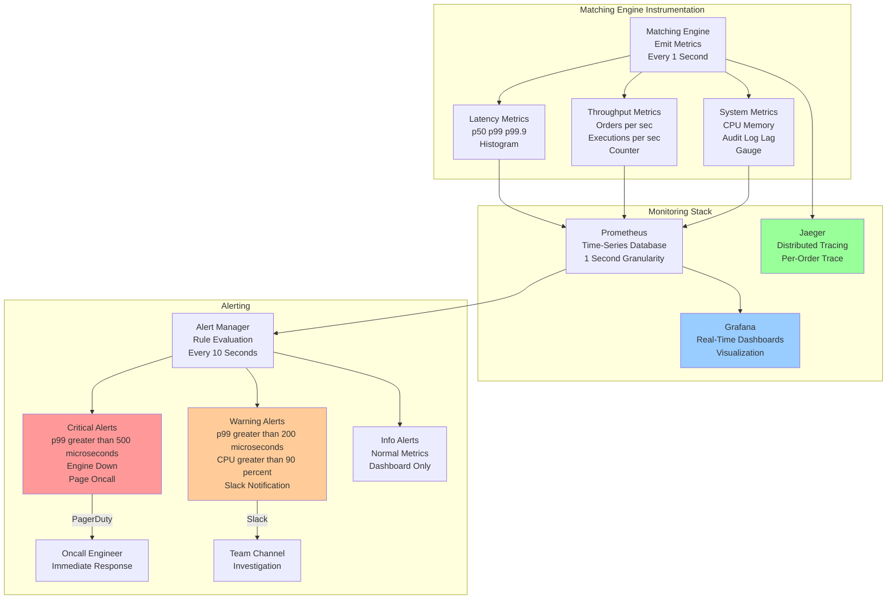

