# Global News Feed - High-Level Design

## Table of Contents

1. [System Architecture Overview](#1-system-architecture-overview)
2. [Ingestion Pipeline](#2-ingestion-pipeline)
3. [Deduplication System (Bloom Filter + LSH)](#3-deduplication-system-bloom-filter--lsh)
4. [Stream Processing Pipeline (Kafka)](#4-stream-processing-pipeline-kafka)
5. [NLP and Content Processing](#5-nlp-and-content-processing)
6. [Elasticsearch Indexing Architecture](#6-elasticsearch-indexing-architecture)
7. [Write Buffer (Redis Streams)](#7-write-buffer-redis-streams)
8. [Personalization Architecture](#8-personalization-architecture)
9. [Real-Time Feature Store](#9-real-time-feature-store)
10. [Feed Serving Flow](#10-feed-serving-flow)
11. [Trending Topics Detection](#11-trending-topics-detection)
12. [Multi-Region Deployment](#12-multi-region-deployment)
13. [Caching Strategy](#13-caching-strategy)
14. [Monitoring Dashboard](#14-monitoring-dashboard)

---

## 1. System Architecture Overview

**Flow Explanation:**

This diagram shows the complete end-to-end architecture of the Global News Feed system.

**Components:**

1. **Ingestion Service** - Fetches articles from RSS feeds, APIs, web scrapers
2. **Kafka Stream** - Central event bus for all article events
3. **Deduplication Service** - Removes duplicate articles using Bloom Filters and LSH
4. **NLP Service** - Extracts keywords, sentiment, quality scores
5. **Elasticsearch** - Full-text search and article storage
6. **Personalization Engine** - ML models for user preferences
7. **Feed Service** - Serves personalized feeds to users
8. **Redis Cache** - Fast article content retrieval

**Performance:**

- Ingestion: 1,157 writes/sec (100M articles/day)
- Read QPS: 300,000 peak
- Feed latency: <50ms

**Trade-offs:**

- Eventual consistency between ingestion and search index
- 24-hour lag in ML personalization (mitigated by real-time feature store)

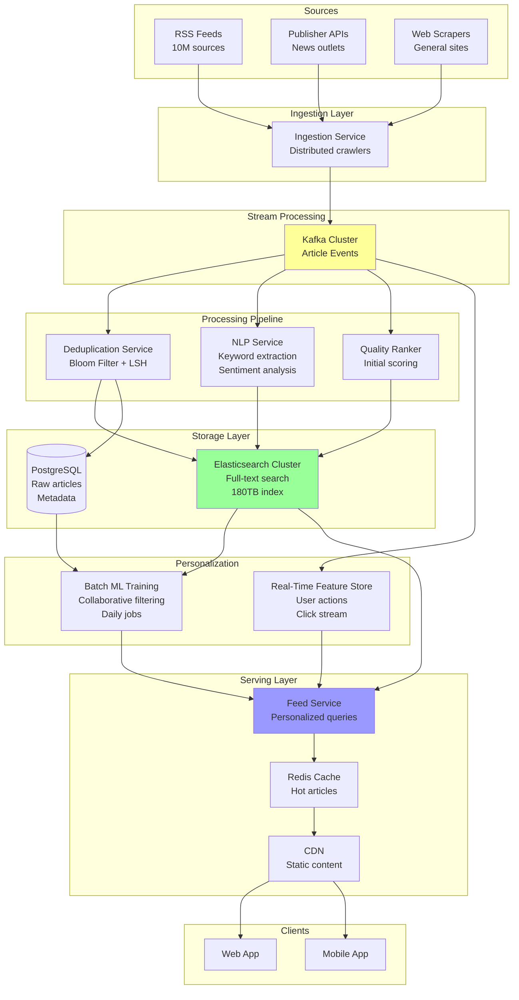

---

## 2. Ingestion Pipeline

**Flow Explanation:**

This diagram shows how articles are ingested from multiple sources with different strategies.

**Ingestion Strategies:**

1. **RSS Feeds** - Poll every 5-15 minutes using RSS parsers
2. **Publisher APIs** - Webhook push or polling with OAuth authentication
3. **Web Scrapers** - Crawl general news sites with rate limiting

**Components:**

1. **Scheduler** - Manages polling intervals per source
2. **Crawler Pool** - Distributed workers (1000+ instances)
3. **Rate Limiter** - Prevents overwhelming sources
4. **Parser** - Extracts structured data from HTML/RSS/JSON
5. **Kafka Producer** - Publishes article events

**Performance:**

- 100M articles/day = 1,157 articles/sec average
- Peak ingestion: 5,000 articles/sec during major news events
- Each crawler handles 10-20 sources

**Benefits:**

- Multi-protocol support (RSS, REST APIs, HTML scraping)
- Fault-tolerant with retry logic
- Scalable crawler pool

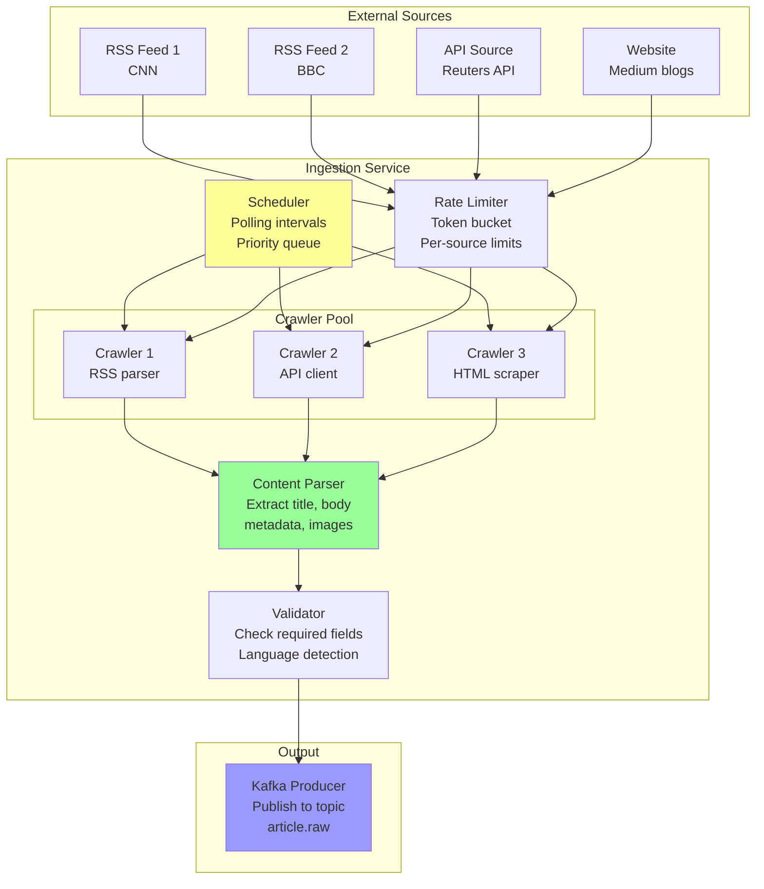

---

## 3. Deduplication System (Bloom Filter + LSH)

**Flow Explanation:**

This diagram shows the two-stage deduplication process to identify exact and near-duplicate articles.

**Deduplication Stages:**

**Stage 1: Bloom Filter (Exact URL Check)**

- Check if URL hash has been seen before (O(1) lookup)
- 99.9% accuracy with 0.1% false positive rate
- Stores 1B URLs in ~1.2GB memory

**Stage 2: LSH (Content Similarity)**

- For new URLs, compute content hash using Locality-Sensitive Hashing
- Check if similar content exists (cosine similarity > 0.85)
- Groups articles about the same story from different sources

**Process Flow:**

1. Article arrives from Kafka
2. Extract URL and compute hash
3. Check Bloom Filter for exact URL match
4. If new URL, extract content and compute LSH signature
5. Query LSH index for similar articles (similarity > 85%)
6. If duplicate, group with existing story; else, create new story cluster

**Performance:**

- Bloom Filter check: <1ms
- LSH similarity search: 10-50ms
- Overall deduplication: <100ms per article

**Benefits:**

- Reduces index size by 60% (eliminates duplicates)
- Groups related stories for better UX
- Fast probabilistic checks

**Trade-offs:**

- 0.1% false positives (some duplicates may slip through)
- LSH is compute-intensive (requires GPU for large scale)

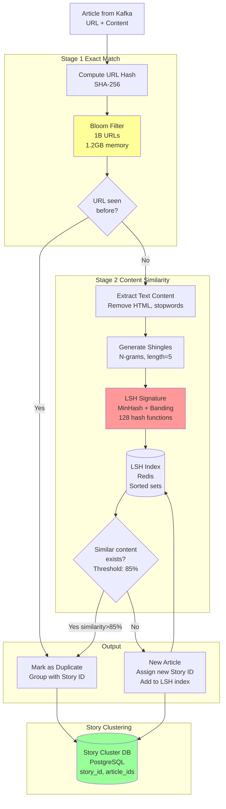

---

## 4. Stream Processing Pipeline (Kafka)

**Flow Explanation:**

This diagram shows the Kafka-based stream processing pipeline following the Kappa Architecture.

**Kappa Architecture:**

- All data flows through Kafka as the single source of truth
- No separate batch layer (everything is streaming)
- Reprocessing is done by replaying Kafka topics

**Kafka Topics:**

1. **article.raw** - Raw articles from ingestion (retention: 7 days)
2. **article.deduplicated** - After deduplication (retention: 7 days)
3. **article.nlp** - After NLP processing (retention: 30 days)
4. **article.ranked** - Final ranked articles (retention: 90 days)
5. **user.actions** - User clicks, shares, likes (retention: 7 days)

**Consumer Groups:**

- **dedup-workers** - 10 instances, consume article.raw
- **nlp-workers** - 20 instances (CPU/GPU intensive)
- **indexer-workers** - 15 instances, write to Elasticsearch
- **ml-workers** - 5 instances, update feature store

**Performance:**

- Total throughput: 10,000 messages/sec
- Latency (producer to consumer): <10ms (p99)
- Kafka cluster: 12 brokers, 3x replication

**Benefits:**

- Fault-tolerant with message replay
- Decoupled services (each can scale independently)
- Audit trail (all events retained)

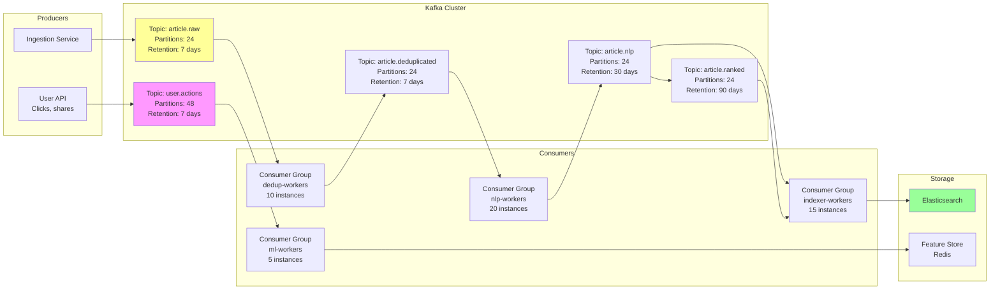

---

## 5. NLP and Content Processing

**Flow Explanation:**

This diagram shows the NLP pipeline that extracts structured information from article text.

**NLP Tasks:**

**1. Keyword Extraction**

- TF-IDF (Term Frequency-Inverse Document Frequency)
- Extract top 10-20 keywords per article
- Purpose: Tagging, search, topic classification

**2. Named Entity Recognition (NER)**

- Identify: People, Organizations, Locations, Events
- Library: spaCy or Stanford NER
- Purpose: Entity-based search, knowledge graph

**3. Sentiment Analysis**

- Classify: Positive, Negative, Neutral
- Score: -1.0 (very negative) to +1.0 (very positive)
- Purpose: Filter toxic content, personalization signal

**4. Topic Classification**

- Categories: Politics, Sports, Tech, Business, Entertainment, etc.
- Multi-label classification (an article can belong to multiple categories)
- Model: BERT fine-tuned on news dataset

**5. Quality Scoring**

- Factors: Source reputation, grammar, readability, click-through rate
- Score: 0-100
- Purpose: Ranking signal

**Performance:**

- Processing time: 200-500ms per article
- GPU acceleration for BERT models
- Batch processing (32 articles per batch)

**Benefits:**

- Rich metadata for search and ranking
- Better personalization signals
- Content quality filter

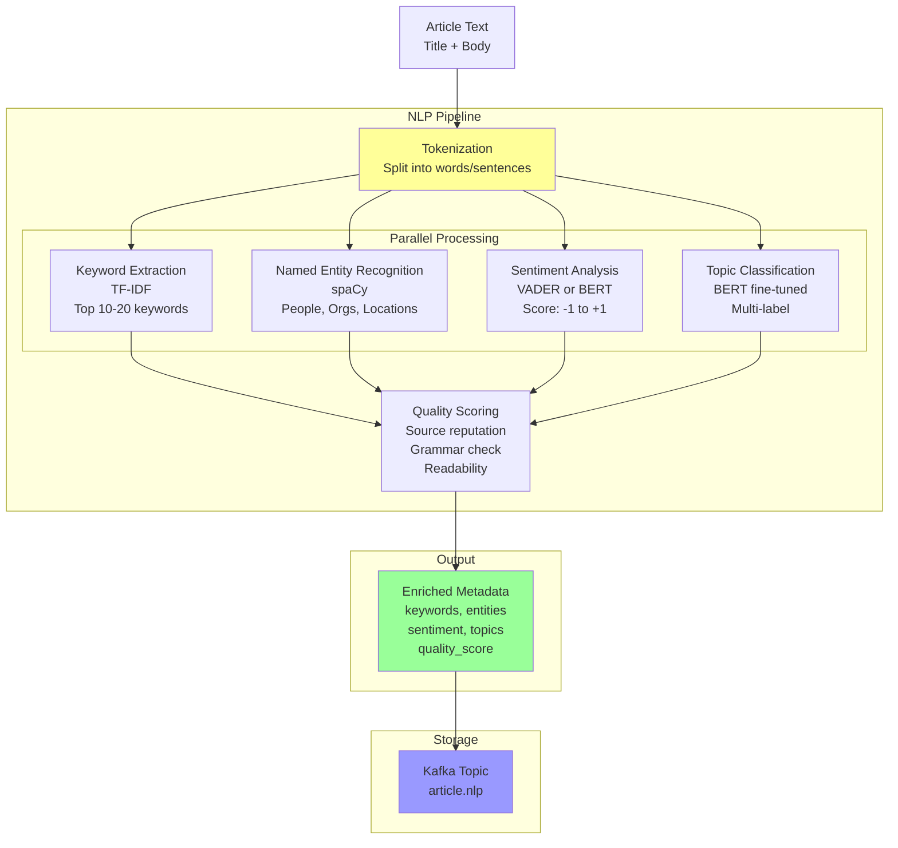

---

## 6. Elasticsearch Indexing Architecture

**Flow Explanation:**

This diagram shows the Elasticsearch cluster architecture for storing and searching 100M articles/day.

**Cluster Configuration:**

- **Nodes:** 30 data nodes + 3 master nodes
- **Shards:** 120 primary shards (4 shards per node)
- **Replicas:** 1 replica per shard (2x redundancy)
- **Storage:** 180TB total (90TB primary + 90TB replicas)

**Index Strategy:**

- **Time-based indices:** news-2025-01, news-2025-02, etc.
- **Hot-Warm-Cold architecture:**
    - Hot (0-7 days): SSD, high memory, recent articles
    - Warm (7-90 days): SSD, less memory
    - Cold (>90 days): HDD, archived
- **Index lifecycle:** Auto-rollover every 50GB or 30 days

**Document Schema:**

```
{
  "article_id": "uuid",
  "story_id": "uuid",
  "title": "text",
  "body": "text",
  "source": "keyword",
  "published_at": "date",
  "keywords": ["keyword"],
  "entities": {"person": [], "org": [], "location": []},
  "sentiment": "float",
  "topics": ["keyword"],
  "quality_score": "float",
  "url": "keyword"
}
```

**Query Patterns:**

- Full-text search on title + body (match query)
- Filter by topics, sentiment, date range (bool query)
- Aggregations for trending topics (terms aggregation)
- Personalized ranking (function_score query)

**Performance:**

- Index rate: 1,157 docs/sec sustained, 5,000 docs/sec peak
- Query latency: p50=20ms, p99=100ms
- Search QPS: 300,000 reads/sec

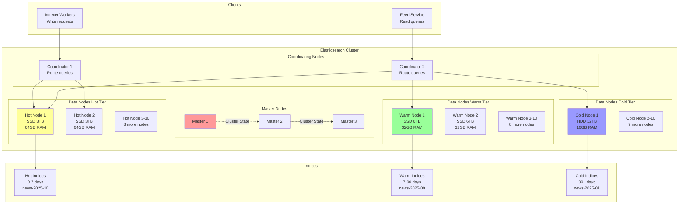

---

## 7. Write Buffer (Redis Streams)

**Flow Explanation:**

This diagram shows how Redis Streams is used as a write buffer to absorb burst traffic before writing to Elasticsearch.

**Problem:**

- Direct writes to Elasticsearch during traffic spikes cause:
    - Index fragmentation (too many small segments)
    - High CPU usage for merging segments
    - Increased query latency
    - Potential cluster instability

**Solution: Write Buffer Pattern**

1. **Indexer workers** write to Redis Streams instead of Elasticsearch
2. **Bulk writer** reads from Redis Streams in batches (1000 docs or 5 sec)
3. **Bulk write** to Elasticsearch using `_bulk` API (much more efficient)
4. **Acknowledge** messages in Redis after successful write

**Redis Streams Configuration:**

- Stream key: `es:write:buffer`
- Consumer group: `es:bulk:writers`
- Max length: 100,000 messages (capped for memory)
- TTL: 1 hour (prevent unbounded growth)

**Benefits:**

- **Smooths write spikes** - Burst of 5,000/sec absorbed, written at 1,500/sec
- **Efficient bulk writes** - 30x better throughput than individual writes
- **Backpressure handling** - If Elasticsearch is slow, buffer grows temporarily
- **Durability** - Redis persistence ensures no data loss

**Performance:**

- Write to Redis: <1ms
- Bulk write latency: 100-500ms for 1000 docs
- End-to-end indexing delay: <10 seconds (p99)

**Trade-offs:**

- Slight delay (5-10 seconds) before articles appear in search
- Requires Redis cluster with sufficient memory

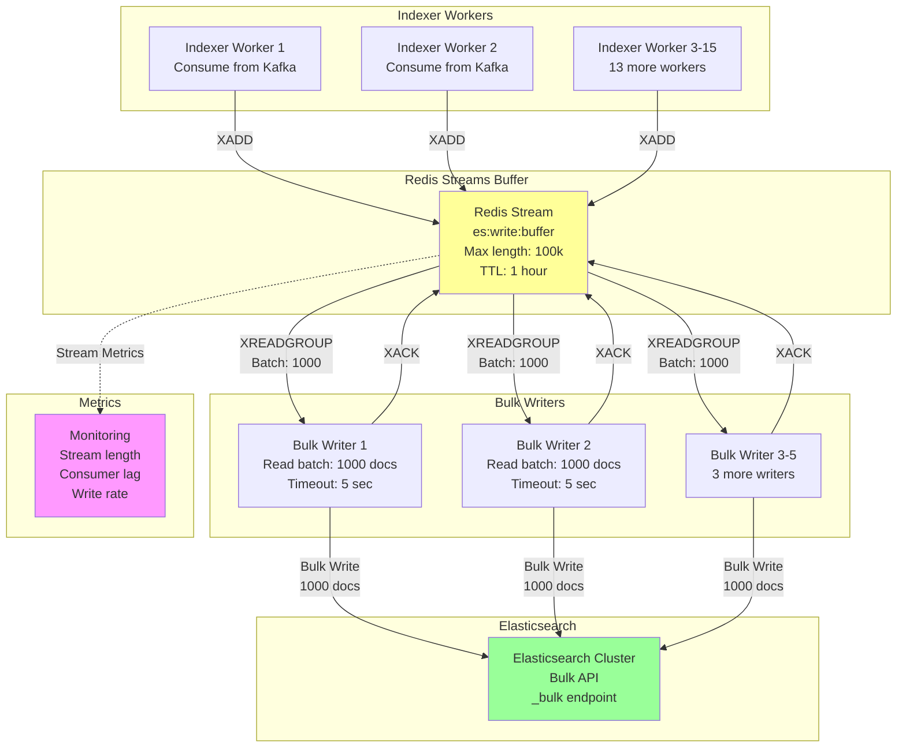

---

## 8. Personalization Architecture

**Flow Explanation:**

This diagram shows the batch ML training pipeline for user personalization.

**Batch Processing (Daily Job):**

**1. Data Collection**

- User actions: clicks, reads, shares, likes (from Kafka user.actions topic)
- User profile: demographics, stated interests
- Article features: topics, keywords, entities, sentiment, quality_score
- Implicit feedback: time spent reading, scroll depth

**2. Feature Engineering**

- User features: read history vector, topic preferences, recency weighting
- Article features: TF-IDF vector, entity vector, quality score
- Interaction features: click-through rate (CTR) per topic, dwell time

**3. Model Training**

- **Collaborative Filtering** - Matrix factorization (user-article matrix)
- **Content-Based Filtering** - Cosine similarity between user profile and article
- **Hybrid Model** - Ensemble of collaborative + content-based
- Framework: Apache Spark MLlib for distributed training

**4. Model Output**

- User embedding vectors (128 dimensions)
- Article embedding vectors (128 dimensions)
- Stored in Feature Store (Redis)

**Batch Job Schedule:**

- Runs daily at 2 AM UTC
- Processes previous 24 hours of data
- Takes 2-4 hours to complete

**Performance:**

- Training data: 100M user actions/day
- Training time: 2-4 hours
- Model size: 10GB (100M users × 128D embeddings)

**Limitations:**

- 24-hour lag (user's actions today won't affect recommendations until tomorrow)
- Cold start problem (new users have no history)

**Mitigation:**

- Real-Time Feature Store (next diagram) handles recent actions
- New users get popular articles + topic-based recommendations

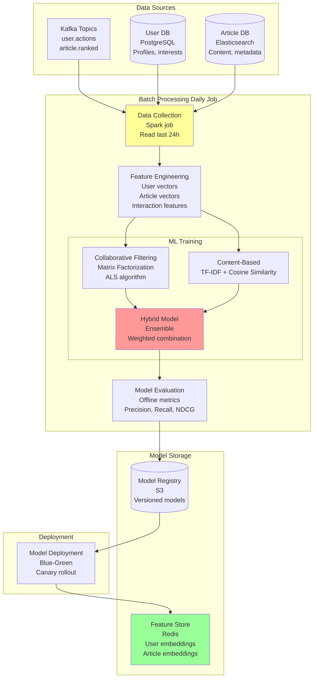

---

## 9. Real-Time Feature Store

**Flow Explanation:**

This diagram shows the real-time feature store that captures immediate user actions to overcome the 24-hour batch lag.

**Real-Time Processing:**

**1. Event Stream**

- User actions (clicks, shares, likes) published to Kafka topic `user.actions`
- Low latency: <50ms from action to Kafka

**2. Stream Processor**

- Kafka Streams application (or Flink)
- Stateful processing: maintains user session state in memory
- Operations:
    - Count clicks per topic (rolling 1-hour window)
    - Track recently read articles (last 20 articles)
    - Compute recency score (exponential decay: recent articles weighted more)

**3. Feature Store (Redis)**

- Key structure: `user:{user_id}:recent_topics` → Sorted Set (topic, score)
- Key structure: `user:{user_id}:recent_reads` → List (article_ids, max 20)
- TTL: 7 days (features expire if user inactive)

**4. Feed Service Integration**

- Feed Service reads BOTH:
    - Batch embeddings (from daily ML job) - long-term preferences
    - Real-time features (from Redis) - recent interests
- Ranking formula:
  ```
  score = 0.7 × batch_score + 0.3 × realtime_score
  ```

**Benefits:**

- Immediate personalization (user's actions reflected within 1 minute)
- Handles trending topics and viral articles
- Solves cold start problem (new users get recommendations immediately)

**Performance:**

- Event-to-feature latency: <100ms
- Redis read latency: <1ms
- Combined scoring: <5ms

**Trade-offs:**

- More complex architecture (two parallel systems)
- Higher infrastructure cost (real-time processing + Redis memory)

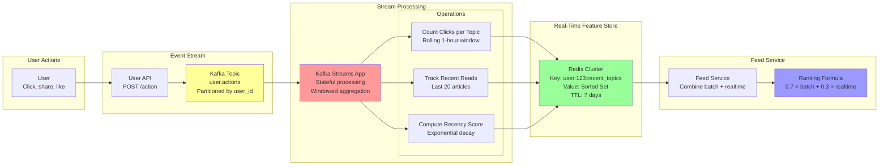

---

## 10. Feed Serving Flow

**Flow Explanation:**

This diagram shows the complete request flow when a user opens their personalized news feed.

**Step-by-Step Flow:**

**1. User Request (0ms)**

- Mobile/web app sends GET request to Feed Service
- Headers: user_id, auth_token, device_type, location

**2. Authentication & Rate Limiting (5ms)**

- API Gateway validates JWT token
- Rate limiter checks if user exceeded quota (100 requests/hour)

**3. Personalization (10ms)**

- Feed Service fetches:
    - User embedding vector from Redis (batch ML model)
    - Real-time features from Redis (recent clicks/topics)
- Computes combined preference score

**4. Elasticsearch Query (20ms)**

- Constructs personalized query:
  ```
  function_score:
    - filter: topics IN user_topics
    - filter: published_at > now-24h
    - function: field_value_factor(quality_score)
    - function: decay(published_at, scale=12h)
    - function: script(user_embedding · article_embedding)
  ```
- Returns top 50 article IDs ranked by score

**5. Article Enrichment (15ms)**

- Fetch full article content from Redis cache (MGET for batch read)
- Cache hit rate: 80% (hot articles cached)
- Cache miss: Read from Elasticsearch (slower)

**6. Response (Total: ~50ms)**

- Return JSON with article list (title, snippet, image, source)
- Client renders feed

**Caching Strategy:**

- **User embedding cache** - Redis, TTL=24h (refreshed after batch job)
- **Article content cache** - Redis, TTL=1h (hot articles)
- **Feed cache** - CDN, TTL=5min (generic feeds for anonymous users)

**Performance:**

- p50 latency: 30ms
- p99 latency: 80ms
- QPS: 300,000 peak

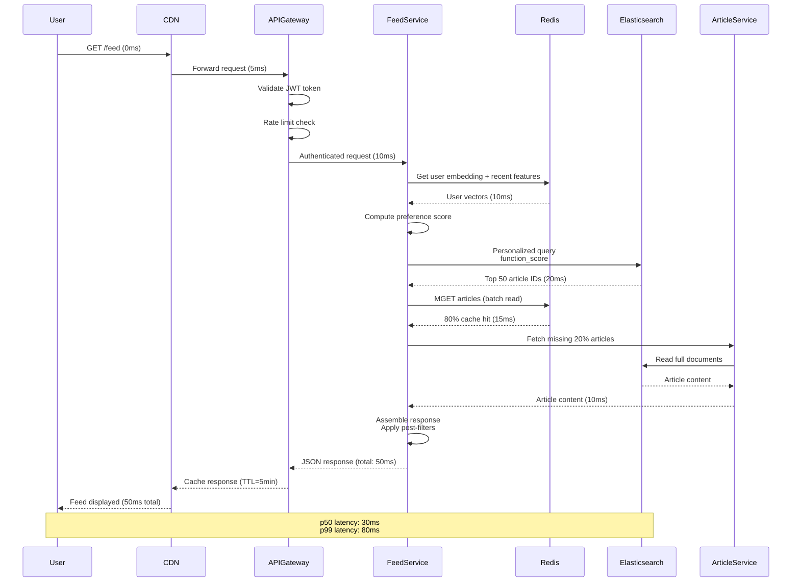

---

## 11. Trending Topics Detection

**Flow Explanation:**

This diagram shows how trending topics are detected in real-time using sliding window aggregations.

**Trending Detection Algorithm:**

**1. Event Collection**

- Track article views, clicks, shares for every article
- Events streamed to Kafka topic `user.actions`

**2. Windowed Aggregation**

- Sliding window: 1 hour, updated every 5 minutes
- Count events per topic per window
- Compare to baseline (average count for this topic over last 24 hours)

**3. Trend Score Calculation**

```
trend_score = (current_count - baseline) / baseline

If trend_score > 2.0 (200% increase), mark as trending
```

**4. Velocity Tracking**

- Compute acceleration (rate of change of counts)
- Fast-rising topics get boosted in ranking

**5. Storage**

- Trending topics stored in Redis Sorted Set
- Key: `trending:topics:{region}`
- Score: trend_score
- TTL: 2 hours

**6. Feed Integration**

- Feed Service reads trending topics
- Boosts articles in trending topics by 50% in ranking
- Separate "Trending" tab in UI

**Real-Time Aggregation:**

- Uses Kafka Streams or Apache Flink
- Stateful processing with tumbling windows
- Emit results every 5 minutes

**Performance:**

- Detection latency: <5 minutes (window update interval)
- Processing throughput: 50,000 events/sec
- Storage: <100MB for trending topics

**Examples:**

- "Breaking news: Earthquake in Tokyo" - spike in clicks
- "Apple announces iPhone 16" - viral topic

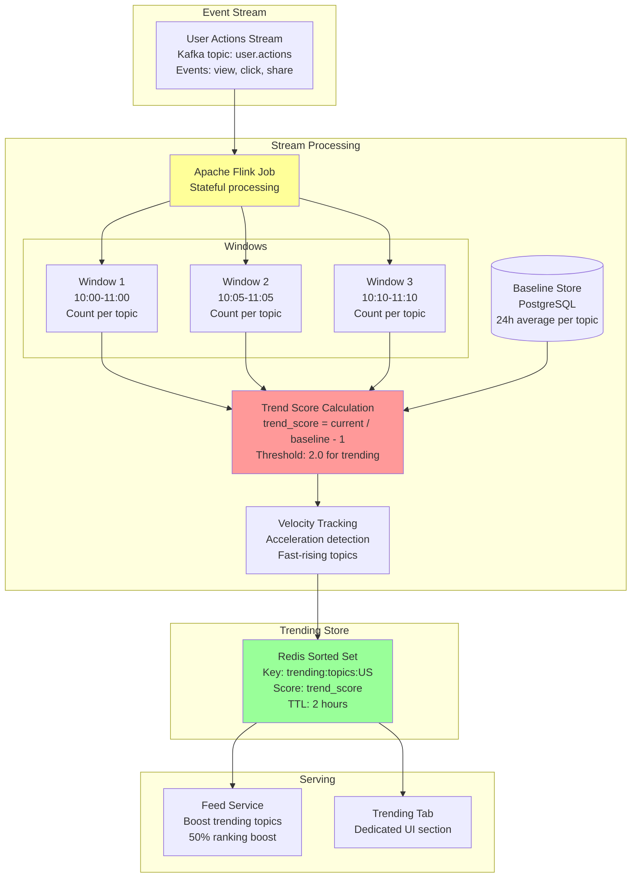

---

## 12. Multi-Region Deployment

**Flow Explanation:**

This diagram shows the multi-region architecture for global low-latency access.

**Regions:**

- **US-East** (Primary) - Handles US traffic
- **EU-West** (Secondary) - Handles Europe traffic
- **AP-Southeast** (Secondary) - Handles Asia-Pacific traffic

**Components per Region:**

- **CDN PoP** (Point of Presence) - Edge caching (CloudFront, Cloudflare)
- **API Gateway** - Regional entry point
- **Feed Service** - Stateless, deployed in all regions
- **Redis Cluster** - Regional cache (replicated from primary)
- **Elasticsearch** - Regional read replicas (searchable snapshots)

**Data Replication:**

**1. Kafka Cross-Region Replication**

- MirrorMaker 2 replicates topics from US-East to other regions
- Lag: 2-5 seconds
- One-way replication (all writes go to primary)

**2. Elasticsearch Cross-Cluster Search**

- Regional clusters are read replicas
- Snapshot & restore from S3 every hour
- Eventual consistency: up to 1 hour lag

**3. Redis Replication**

- Active-passive replication using Redis Streams
- Lag: <1 second
- Only hot articles replicated (last 24 hours)

**Write Path:**

- All writes (ingestion, user actions) go to US-East primary
- Replicated asynchronously to other regions

**Read Path:**

- Reads served from nearest region (geolocation-based routing)
- 95% of reads hit regional cache/index

**Performance:**

- US users: 30ms latency (nearest region)
- EU users: 50ms latency (transatlantic)
- AP users: 80ms latency (transpacific)
- Global average: 50ms

**Benefits:**

- Low latency for global users
- High availability (region failover)
- Compliance (GDPR data residency)

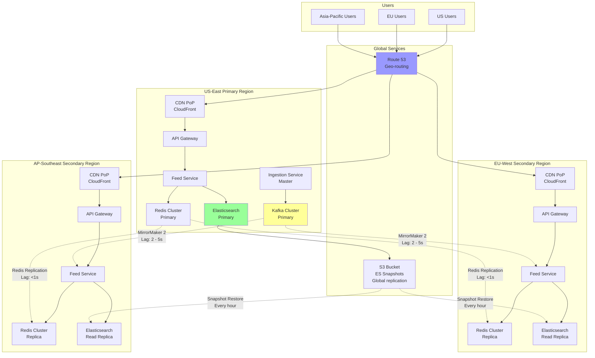

---

## 13. Caching Strategy

**Flow Explanation:**

This diagram shows the multi-layer caching strategy to minimize database load and latency.

**Cache Layers:**

**Layer 1: CDN Edge Cache**

- Location: Distributed globally (200+ PoPs)
- Content: Static assets (images, CSS, JS) + Generic feeds
- TTL: 5 minutes for feeds, 24 hours for static assets
- Cache key: URL + query params
- Hit rate: 60% (anonymous users)

**Layer 2: Application Cache (Redis)**

- Location: Regional Redis clusters
- Content: Hot articles, user embeddings, trending topics
- TTL: 1 hour for articles, 24 hours for embeddings
- Cache key: `article:{article_id}`, `user:{user_id}:embedding`
- Hit rate: 80% (logged-in users)

**Layer 3: Query Result Cache (Elasticsearch)**

- Location: Elasticsearch request cache
- Content: Aggregation results (trending topics, top articles per category)
- TTL: Auto-managed by Elasticsearch (invalidated on index refresh)
- Hit rate: 40% (popular queries)

**Cache Invalidation:**

**1. Time-based Expiration (TTL)**

- Most common strategy
- Articles: 1 hour TTL
- Trending topics: 5 minutes TTL

**2. Event-based Invalidation**

- When article updated → invalidate cache key
- Kafka event → Cache invalidation service → Redis DELETE

**3. Cache Stampede Prevention**

- Problem: 1000 requests hit an expired cache key simultaneously
- Solution: Probabilistic early expiration (refresh cache 10 seconds before expiry with 10% probability)

**Performance Impact:**

- With cache: p50=30ms, p99=80ms
- Without cache: p50=200ms, p99=1000ms
- Cost savings: 90% reduction in Elasticsearch load

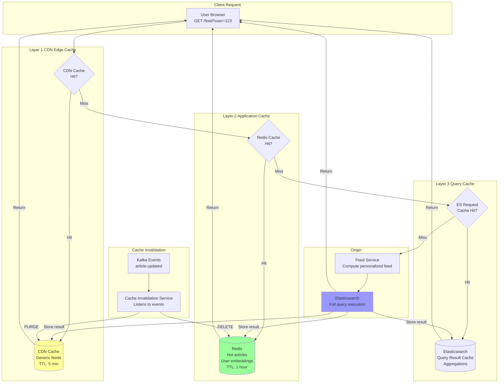

---

## 14. Monitoring Dashboard

**Flow Explanation:**

This diagram shows the key metrics monitored for the Global News Feed system.

**Monitoring Categories:**

**1. Business Metrics**

- Articles ingested per minute
- Active users (DAU, MAU)
- Feed engagement rate (click-through rate)
- Trending topics count

**2. System Metrics**

- Feed API latency (p50, p95, p99)
- Elasticsearch query latency
- Redis cache hit rate
- Kafka consumer lag

**3. Infrastructure Metrics**

- CPU, memory, disk usage per service
- Network bandwidth
- Elasticsearch cluster health
- Kafka broker health

**4. Alerts**

- Ingestion pipeline lag >5 minutes
- Elasticsearch cluster RED status
- Feed API p99 latency >500ms
- Kafka consumer lag >10,000 messages
- Redis cache hit rate <70%

**Tools:**

- **Prometheus** - Metrics collection
- **Grafana** - Visualization dashboards
- **PagerDuty** - On-call alerting
- **ELK Stack** - Log aggregation and analysis

**Dashboard Panels:**

1. Articles ingested (time series, last 24h)
2. Feed API latency (histogram, p50/p95/p99)
3. Elasticsearch query latency (heatmap)
4. Cache hit rate (gauge, target: 80%)
5. Kafka consumer lag (time series, per consumer group)
6. Error rate (time series, 4xx, 5xx)
7. Top trending topics (table, updated every 5 min)

**Performance:**

- Metrics scraped every 15 seconds
- Dashboard refresh: 30 seconds
- Alert evaluation: 1 minute

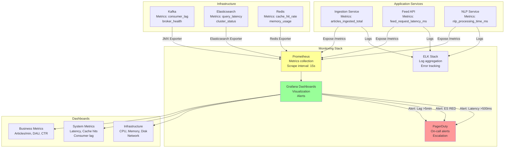

