# Global News Feed - Sequence Diagrams

## Table of Contents

1. [Article Ingestion Flow (RSS)](#1-article-ingestion-flow-rss)
2. [Article Deduplication Flow](#2-article-deduplication-flow)
3. [NLP Processing Pipeline](#3-nlp-processing-pipeline)
4. [Elasticsearch Bulk Indexing Flow](#4-elasticsearch-bulk-indexing-flow)
5. [Personalized Feed Request (Happy Path)](#5-personalized-feed-request-happy-path)
6. [Real-Time Feature Store Update](#6-real-time-feature-store-update)
7. [Trending Topics Detection](#7-trending-topics-detection)
8. [Batch ML Training Job](#8-batch-ml-training-job)
9. [Cache Miss Fallback Flow](#9-cache-miss-fallback-flow)
10. [Multi-Region Read Request](#10-multi-region-read-request)
11. [Cache Invalidation Flow](#11-cache-invalidation-flow)
12. [Failure Recovery - Kafka Consumer Lag](#12-failure-recovery---kafka-consumer-lag)

---

## 1. Article Ingestion Flow (RSS)

**Flow:**

Shows the complete flow of ingesting an RSS article from external source to Kafka topic.

**Steps:**

1. **Scheduler (0ms)** - Cron job triggers polling for RSS feed (every 5 minutes)
2. **Crawler (10ms)** - HTTP GET request to fetch RSS XML feed
3. **Rate Limiter (1ms)** - Check token bucket, allow if tokens available
4. **Parser (50ms)** - Parse XML, extract title, body, published_at, author
5. **Validator (10ms)** - Validate required fields, detect language
6. **Kafka Producer (5ms)** - Publish to `article.raw` topic with partition key = source_id
7. **Scheduler (76ms total)** - Mark source as successfully polled, schedule next poll

**Performance:**

- Total ingestion latency: ~76ms per article
- Throughput: 1,157 articles/sec sustained
- Failure handling: Retry with exponential backoff (max 3 retries)

**Edge Cases:**

- RSS feed unavailable (404/500) → Retry after 1 hour
- Malformed XML → Log error, skip article
- Duplicate URL detected → Skip (will be caught by deduplication stage)

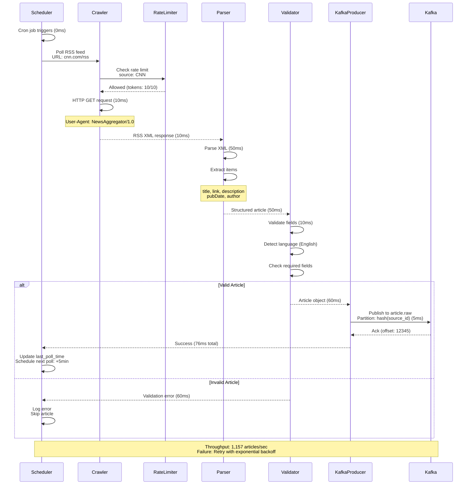

---

## 2. Article Deduplication Flow

**Flow:**

Shows the two-stage deduplication process using Bloom Filter and LSH to identify exact and near-duplicate articles.

**Steps:**

1. **Dedup Service (0ms)** - Consume from Kafka `article.raw` topic
2. **Stage 1: URL Hash Check (1ms)** - Compute SHA-256 hash of URL
3. **Bloom Filter Lookup (1ms)** - Check if URL hash exists in Bloom Filter
4. **Stage 2: Content Similarity (50ms)** - If new URL, compute LSH signature
5. **LSH Index Query (20ms)** - Search for similar articles (threshold: 85%)
6. **Decision (71ms total)**:
    - **Duplicate found** → Group with existing story_id, publish to `article.deduplicated`
    - **New article** → Assign new story_id, add to LSH index, publish to `article.deduplicated`

**Performance:**

- Bloom Filter check: <1ms (in-memory)
- LSH similarity search: 10-50ms (Redis Sorted Set query)
- Overall deduplication latency: <100ms (p99)
- Accuracy: 99.9% (0.1% false positives)

**Edge Cases:**

- False positive (Bloom Filter) → Stage 2 LSH catches it
- Near-duplicate but <85% similarity → Treated as new article (acceptable)
- High-traffic burst → Redis read replicas handle load

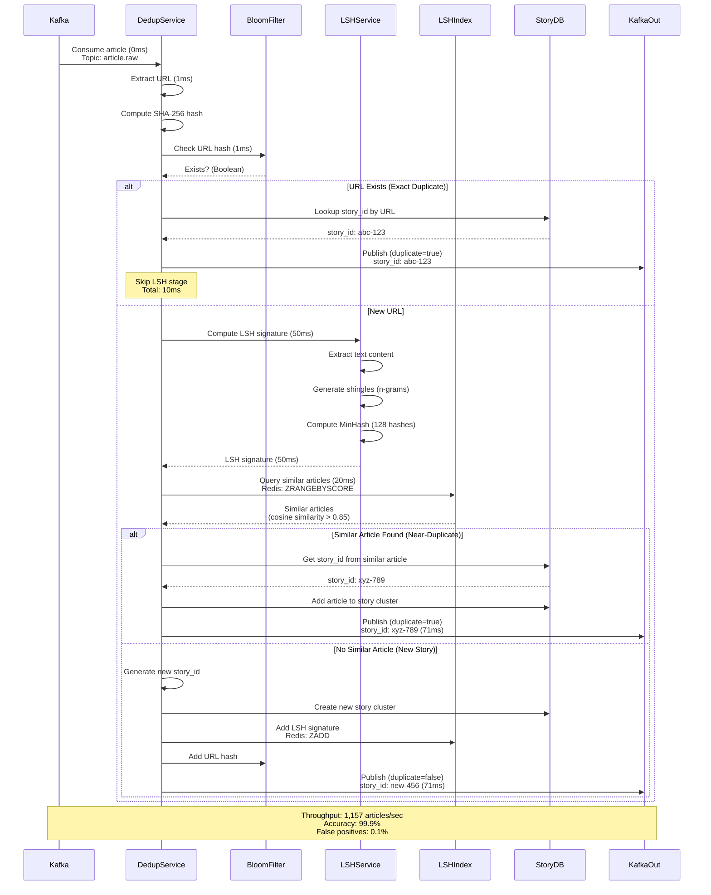

---

## 3. NLP Processing Pipeline

**Flow:**

Shows the parallel NLP processing pipeline that extracts keywords, entities, sentiment, topics, and quality scores.

**Steps:**

1. **NLP Service (0ms)** - Consume from Kafka `article.deduplicated` topic
2. **Tokenization (20ms)** - Split text into sentences and words using spaCy
3. **Parallel Processing (200ms)** - Run 4 NLP tasks in parallel:
    - **Keyword Extraction** - TF-IDF, top 20 keywords
    - **Named Entity Recognition** - Extract people, organizations, locations
    - **Sentiment Analysis** - VADER or BERT, score: -1 to +1
    - **Topic Classification** - BERT multi-label classifier
4. **Quality Scoring (50ms)** - Compute quality score based on source reputation, grammar, readability
5. **Output (270ms total)** - Publish enriched article to Kafka `article.nlp` topic

**Performance:**

- Processing time per article: 200-500ms
- GPU acceleration: 8x NVIDIA T4 GPUs for BERT models
- Batch processing: 32 articles per batch
- Throughput: 20 NLP workers × 5 articles/sec = 100 articles/sec per worker
- Total capacity: 2,000 articles/sec

**Edge Cases:**

- Non-English article → Use multilingual BERT model (slower)
- Very long article (>10,000 words) → Truncate to first 2,000 words
- GPU OOM error → Fallback to CPU (10x slower)

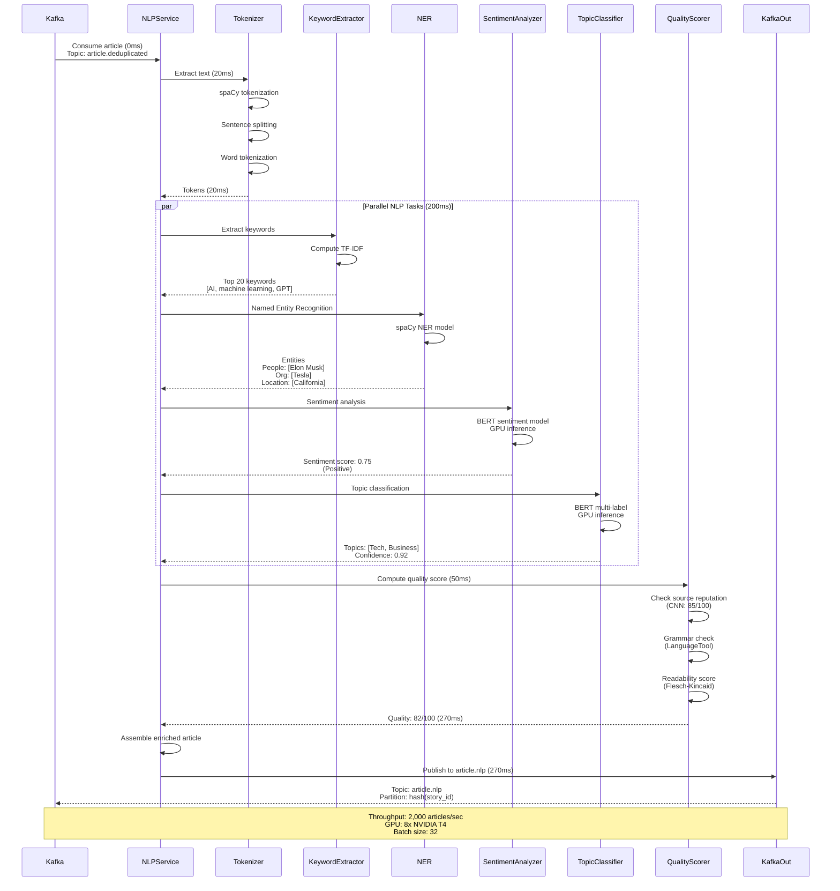

---

## 4. Elasticsearch Bulk Indexing Flow

**Flow:**

Shows the write buffer pattern using Redis Streams to absorb burst traffic before bulk writing to Elasticsearch.

**Steps:**

1. **Indexer Worker (0ms)** - Consume from Kafka `article.nlp` topic
2. **Write to Redis Streams (1ms)** - XADD to stream `es:write:buffer`
3. **Bulk Writer (5000ms)** - Poll Redis Streams every 5 seconds or when 1000 messages accumulated
4. **Read Batch (10ms)** - XREADGROUP to read 1000 messages
5. **Transform (50ms)** - Convert to Elasticsearch bulk format
6. **Bulk Write (200ms)** - POST to Elasticsearch `_bulk` API
7. **Acknowledge (5ms)** - XACK messages in Redis Streams

**Performance:**

- Write to Redis: <1ms per article
- Bulk write latency: 200-500ms for 1000 docs
- End-to-end indexing delay: <10 seconds (p99)
- Throughput: 1,500 docs/sec sustained, 5,000 docs/sec peak

**Benefits:**

- Smooths write spikes (burst of 5,000/sec absorbed, written at 1,500/sec)
- Efficient bulk writes (30x better throughput than individual writes)
- Backpressure handling (if ES is slow, buffer grows temporarily)

**Edge Cases:**

- Redis Streams full (>100k messages) → Reject new writes, return 503 Service Unavailable
- Elasticsearch bulk error (partial failure) → Retry failed documents
- Bulk writer crash → Consumer group rebalance, another worker takes over

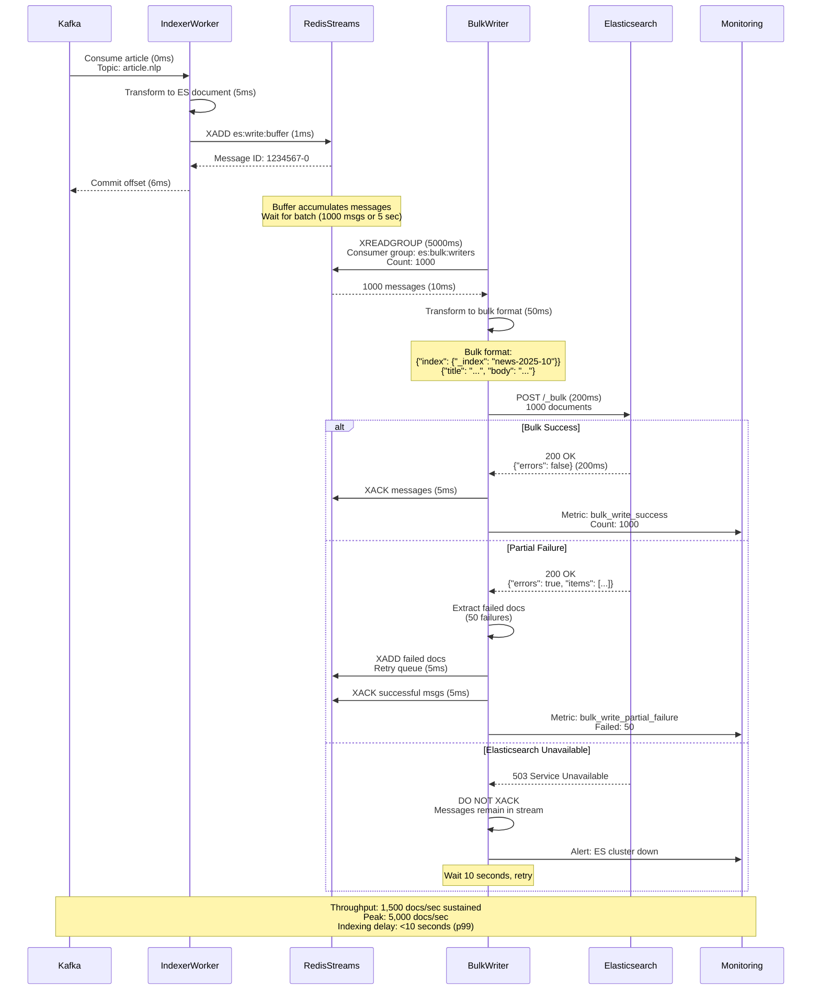

---

## 5. Personalized Feed Request (Happy Path)

**Flow:**

Shows the complete request flow when a user opens their personalized news feed.

**Steps:**

1. **User Request (0ms)** - Mobile app sends GET /feed request
2. **CDN Check (5ms)** - CDN checks cache, MISS for personalized feed
3. **API Gateway (10ms)** - Validates JWT token, checks rate limit (100 req/hour)
4. **Feed Service (15ms)** - Fetches user embedding from Redis (batch ML model)
5. **Real-Time Features (20ms)** - Fetches recent clicks/topics from Redis (real-time feature store)
6. **Elasticsearch Query (40ms)** - Personalized query with function_score
7. **Article Enrichment (55ms)** - Fetch article content from Redis cache (80% hit rate)
8. **Response (60ms total)** - Return JSON with 50 articles

**Performance:**

- p50 latency: 30ms
- p99 latency: 80ms
- QPS: 300,000 peak
- Cache hit rate: 80% (articles), 95% (user embeddings)

**Query:**

```
function_score:
  - filter: topics IN [Tech, Business] (user interests)
  - filter: published_at > now-24h (recent articles)
  - function: field_value_factor(quality_score)
  - function: decay(published_at, scale=12h)
  - function: script(user_embedding · article_embedding)
```

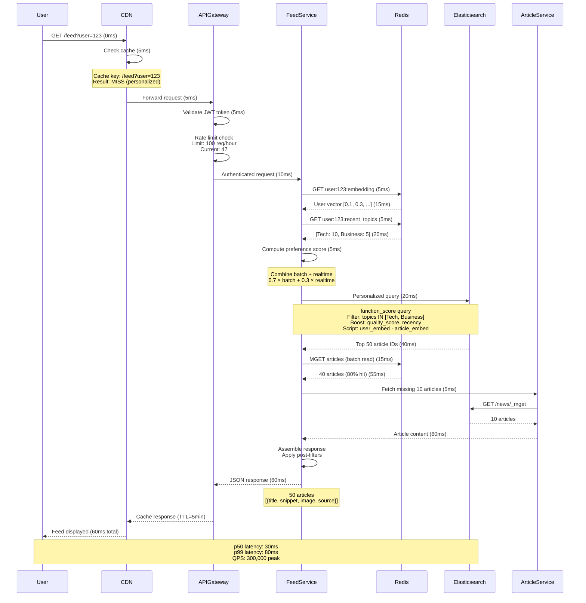

---

## 6. Real-Time Feature Store Update

**Flow:**

Shows how user actions (clicks) are captured in real-time and stored in the feature store to overcome the 24-hour batch
ML lag.

**Steps:**

1. **User Action (0ms)** - User clicks on article (Tech category)
2. **User API (10ms)** - POST /action (click event)
3. **Kafka Producer (15ms)** - Publish to `user.actions` topic
4. **Kafka Streams (20ms)** - Consume event, update stateful aggregation
5. **Window Aggregation (25ms)** - Count clicks per topic (rolling 1-hour window)
6. **Redis Update (30ms)** - Update user's recent topics in Redis Sorted Set
7. **Feed Service (next request)** - Reads updated features, reflects user's immediate interest

**Performance:**

- Event-to-feature latency: <100ms (p99)
- Throughput: 50,000 events/sec
- Redis read latency: <1ms
- Feature TTL: 7 days

**Benefits:**

- Immediate personalization (user's actions reflected within 1 minute)
- Handles trending topics and viral articles
- Solves cold start problem

**Example:**

- User clicks 5 Tech articles in 10 minutes
- Feature store updates: `user:123:recent_topics` → {Tech: 5, Business: 2}
- Next feed request: Tech articles ranked higher

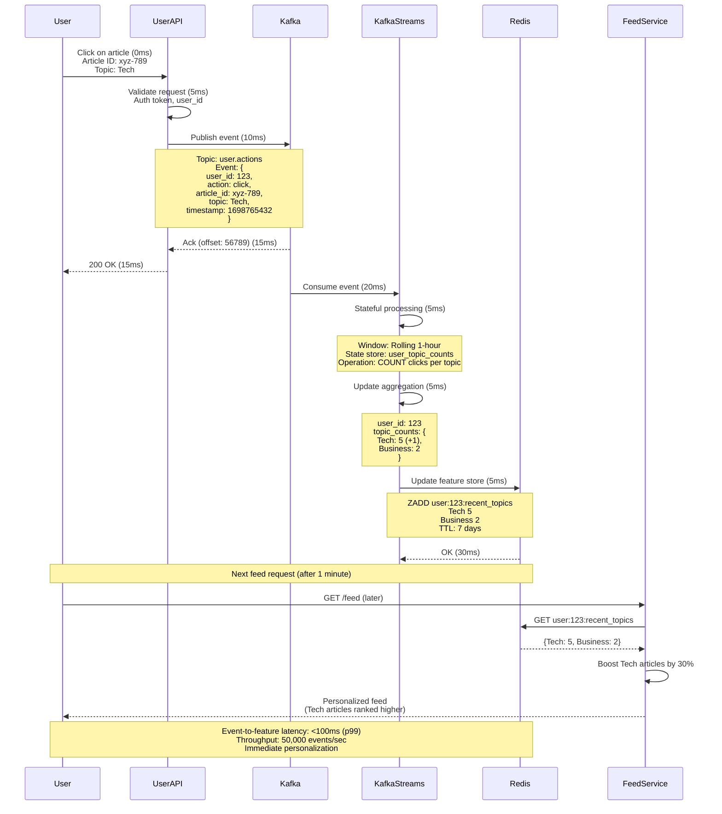

---

## 7. Trending Topics Detection

**Flow:**

Shows how trending topics are detected in real-time using windowed aggregations and velocity tracking.

**Steps:**

1. **Event Stream (0ms)** - User actions (clicks, shares) published to Kafka
2. **Flink Job (5ms)** - Consume events, maintain windowed state
3. **Window Aggregation (5 min)** - Count events per topic per 1-hour sliding window
4. **Baseline Comparison (5 min)** - Compare to 24-hour average from PostgreSQL
5. **Trend Score Calculation (5 min)** - Compute trend_score = (current - baseline) / baseline
6. **Velocity Tracking (5 min)** - Compute acceleration (rate of change)
7. **Redis Update (5 min)** - Store trending topics in Sorted Set with trend_score
8. **Feed Service** - Reads trending topics, boosts articles by 50%

**Detection Latency:** <5 minutes (window update interval)

**Example:**

- Topic: "Earthquake in Tokyo"
- Baseline (24h avg): 100 clicks/hour
- Current (last hour): 10,000 clicks/hour
- Trend score: (10,000 - 100) / 100 = 99.0 (9900% increase)
- Result: Marked as TRENDING

**Algorithm:**

```
trend_score = (current_count - baseline) / baseline

If trend_score > 2.0 (200% increase):
  Mark as trending
```

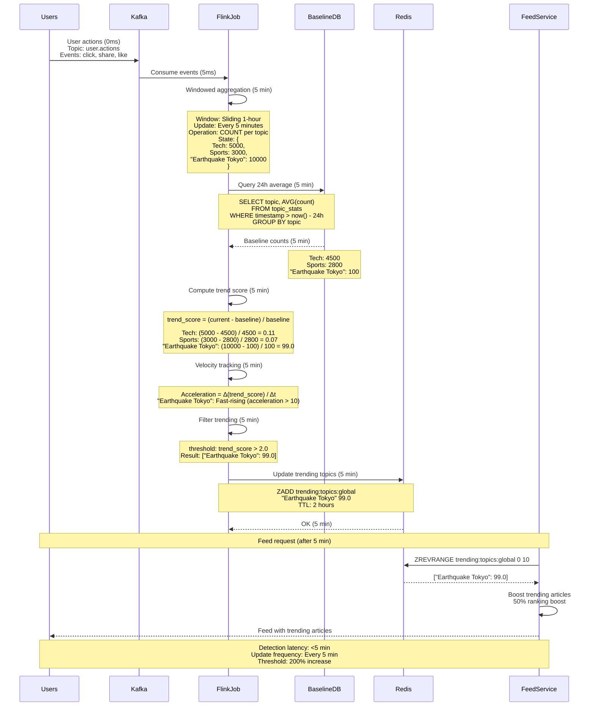

---

## 8. Batch ML Training Job

**Flow:**

Shows the daily batch ML training pipeline for user personalization using collaborative filtering.

**Steps:**

1. **Scheduler (2 AM UTC)** - Cron job triggers daily ML training
2. **Data Collection (30 min)** - Spark job reads last 24 hours of user actions from Kafka
3. **Feature Engineering (1 hour)** - Compute user vectors and article vectors
4. **Model Training (2 hours)** - Train collaborative filtering model (ALS algorithm)
5. **Model Evaluation (30 min)** - Compute offline metrics (Precision, Recall, NDCG)
6. **Model Deployment (30 min)** - Blue-green deployment to production
7. **Embedding Update (30 min)** - Store user/article embeddings in Redis

**Total Runtime:** 2-4 hours

**Performance:**

- Training data: 100M user actions/day
- Model size: 10GB (100M users × 128D embeddings)
- Infrastructure: 50 Spark executors (4 cores, 16GB each)

**Limitations:**

- 24-hour lag (user's actions today won't affect recommendations until tomorrow)
- Mitigated by Real-Time Feature Store

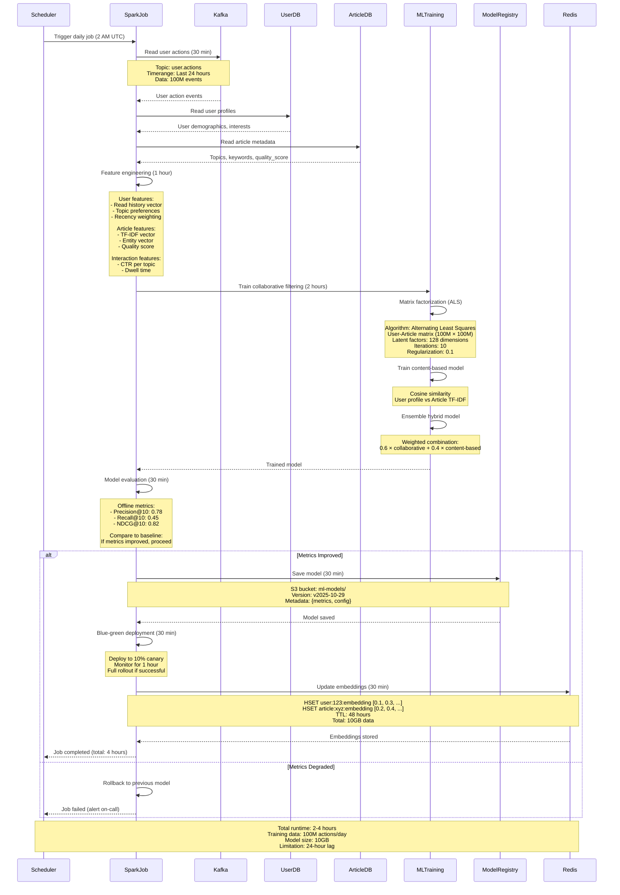

---

## 9. Cache Miss Fallback Flow

**Flow:**

Shows the fallback flow when cache misses occur at multiple layers (CDN, Redis, Elasticsearch).

**Steps:**

1. **User Request (0ms)** - GET /feed request
2. **CDN Miss (10ms)** - Personalized feed not cached at edge
3. **Redis Miss (30ms)** - User embedding not in cache (cold user)
4. **Elasticsearch Query (100ms)** - Query user embedding from dedicated index
5. **Redis Miss (130ms)** - Article content not in cache (cold articles)
6. **Elasticsearch Query (200ms)** - Fetch full article documents
7. **Backfill Cache (250ms)** - Store fetched data in Redis for next request
8. **Response (300ms total)** - Return to user (slow path)

**Performance:**

- Cache hit latency: 30ms (p50)
- Cache miss latency: 300ms (p99)
- Cache miss rate: 20% (articles), 5% (user embeddings)

**Cache Miss Scenarios:**

- **Cold user** - New user, no embedding in cache
- **Cold article** - New article just published, not yet cached
- **Cache eviction** - LRU eviction due to memory pressure
- **Cache invalidation** - Article updated, cache intentionally purged

**Mitigation:**

- **Cache warming** - Pre-populate cache with popular articles
- **TTL tuning** - Balance freshness vs hit rate
- **Cache tiering** - Hot (Redis) + Warm (Elasticsearch request cache) + Cold (Elasticsearch disk)

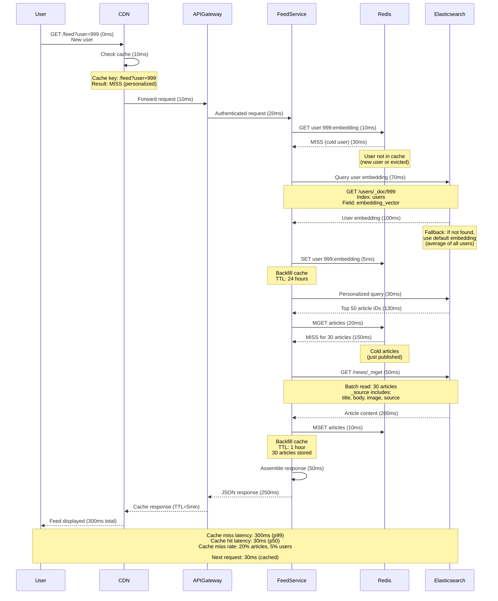

---

## 10. Multi-Region Read Request

**Flow:**

Shows how a user request is routed to the nearest region for low-latency access.

**Steps:**

1. **User Request (Tokyo, 0ms)** - User in Tokyo sends GET /feed request
2. **Route 53 Geo-Routing (10ms)** - DNS resolves to AP-Southeast region
3. **Regional CDN (20ms)** - CloudFront PoP in Tokyo serves cached content
4. **Regional API Gateway (30ms)** - Asia-Pacific API Gateway
5. **Regional Feed Service (50ms)** - Reads from regional Elasticsearch read replica
6. **Regional Redis (60ms)** - Fetches from regional Redis replica
7. **Response (80ms total)** - User receives feed (low latency)

**Multi-Region Architecture:**

- **Primary Region:** US-East (all writes)
- **Secondary Regions:** EU-West, AP-Southeast (read replicas)

**Replication Lag:**

- Kafka: 2-5 seconds (MirrorMaker 2)
- Elasticsearch: up to 1 hour (snapshot & restore)
- Redis: <1 second (active-passive replication)

**Performance:**

- US users: 30ms latency
- EU users: 50ms latency
- AP users: 80ms latency (without multi-region: 300ms transpacific)

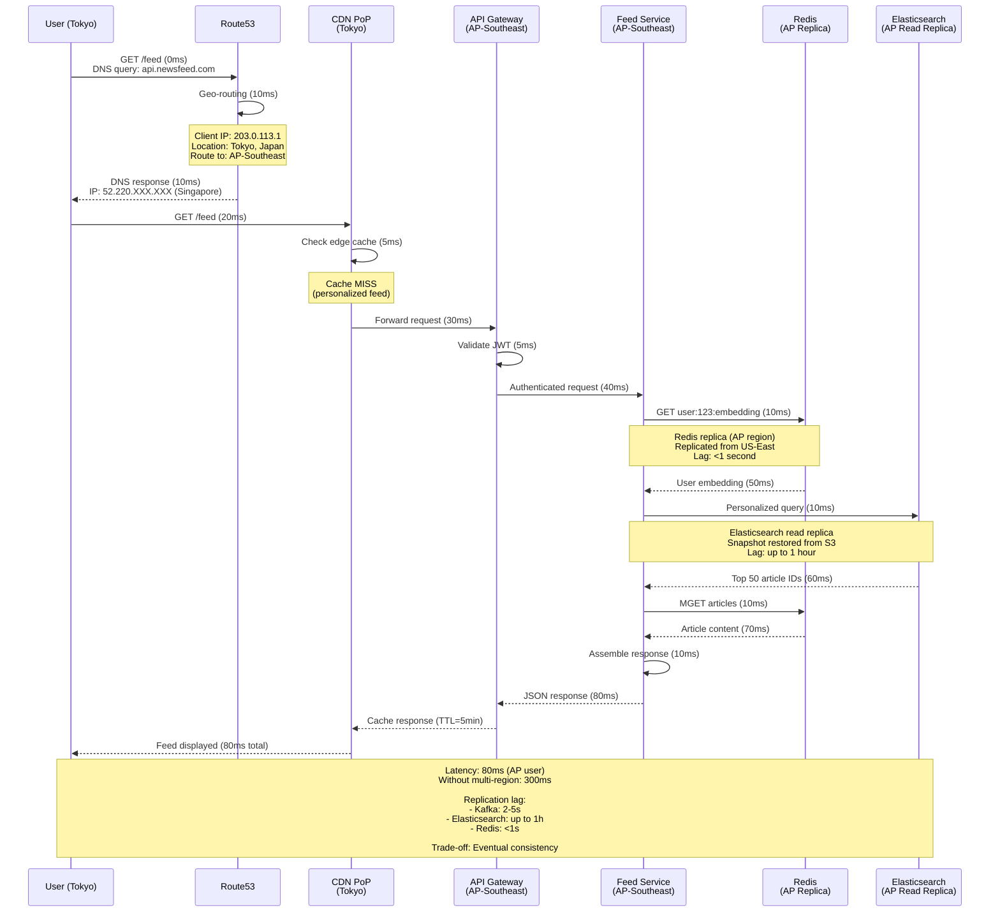

---

## 11. Cache Invalidation Flow

**Flow:**

Shows the event-driven cache invalidation flow when an article is updated.

**Steps:**

1. **Article Update (0ms)** - Admin updates article content via CMS
2. **Update Service (50ms)** - Update article in Elasticsearch
3. **Kafka Event (55ms)** - Publish `article.updated` event to Kafka
4. **Cache Invalidation Service (60ms)** - Consume event
5. **Redis Invalidation (65ms)** - DELETE article cache key
6. **CDN Purge (200ms)** - Purge CDN cache via API
7. **Next Request (after 1 min)** - User fetches feed, cache miss, fresh data served

**Invalidation Strategies:**

1. **Event-based** - Invalidate on update (this flow)
2. **Time-based** - TTL expiration (most common)
3. **Version-based** - Cache key includes version number
4. **Lazy invalidation** - Stale data acceptable for non-critical content

**Performance:**

- Invalidation latency: <5 seconds (Redis), <30 seconds (CDN)
- Kafka event lag: <100ms

**Edge Cases:**

- Kafka event lost → Cache serves stale data until TTL expires (acceptable)
- CDN purge fails → Retry with exponential backoff
- Multiple updates in quick succession → Coalesce invalidations (debounce)

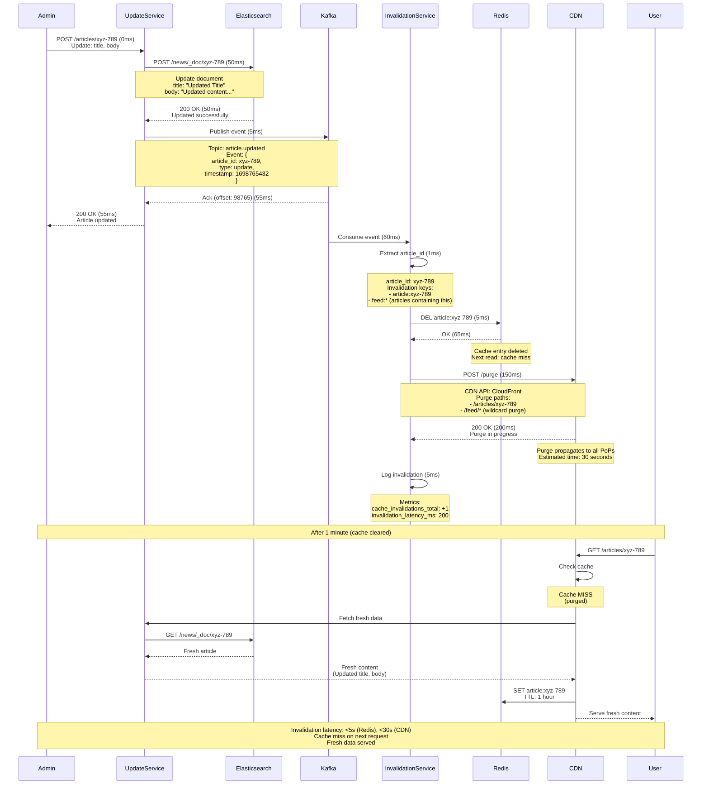

---

## 12. Failure Recovery - Kafka Consumer Lag

**Flow:**

Shows the failure recovery process when Kafka consumers fall behind due to slow processing or downtime.

**Scenario:**

- **NLP Service** experiences high CPU load due to spike in articles (breaking news event)
- Consumer lag increases from 0 to 50,000 messages
- Alert triggered when lag > 10,000

**Steps:**

1. **Monitoring (0ms)** - Prometheus detects consumer lag > 10,000
2. **Alert (30s)** - PagerDuty alert sent to on-call engineer
3. **Diagnosis (2 min)** - Engineer checks metrics, identifies high CPU
4. **Scale Up (5 min)** - Auto-scaling increases NLP workers from 20 to 40
5. **Catch Up (30 min)** - Consumers process backlog at 2x rate
6. **Recovery (60 min)** - Lag returns to normal (<1,000 messages)

**Failure Modes:**

1. **Slow processing** - NLP service overwhelmed (this scenario)
2. **Consumer crash** - Worker dies, consumer group rebalances
3. **Network partition** - Consumer can't reach Kafka brokers
4. **Kafka broker down** - Leader election, temporary unavailability

**Recovery Strategies:**

1. **Auto-scaling** - Increase consumer instances
2. **Backpressure** - Slow down producers (not applicable for news ingestion)
3. **Dead letter queue** - Move problematic messages to DLQ
4. **Skip and catch up** - Process only recent messages (trade-off: data loss)

**Monitoring Metrics:**

- `kafka_consumer_lag` - Messages behind
- `kafka_consumer_lag_seconds` - Time behind
- `consumer_processing_rate` - Messages/sec
- `consumer_error_rate` - Failures/sec

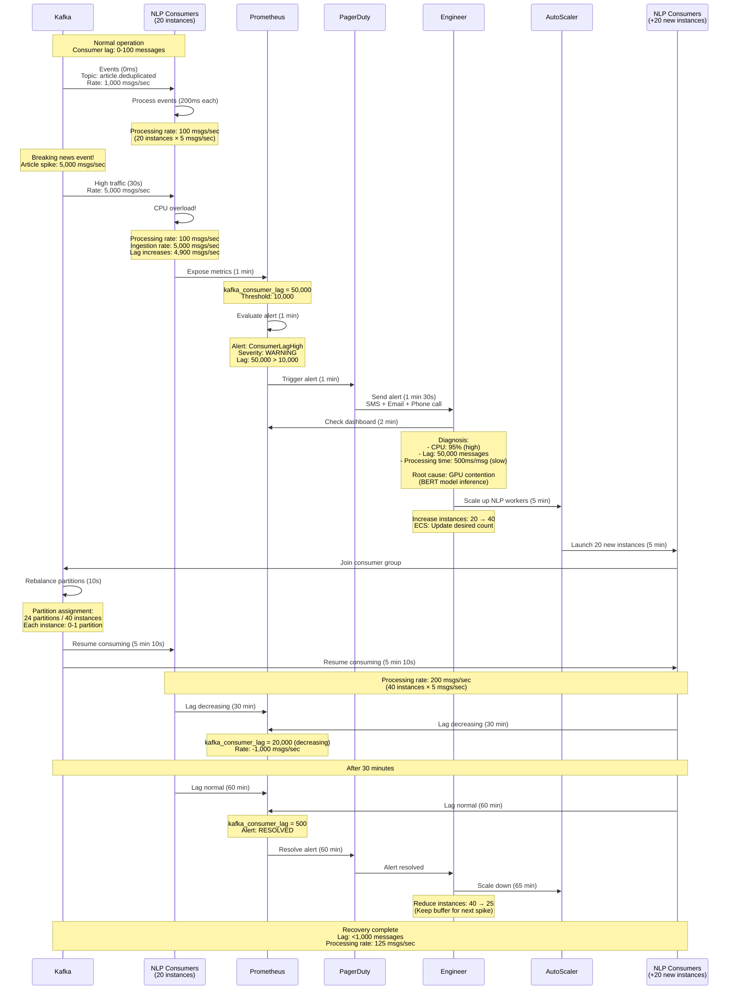

