# Distributed Monitoring System - High-Level Design

## Table of Contents

1. [System Architecture Overview](#1-system-architecture-overview)
2. [Metrics Collection Flow (Pull-Based)](#2-metrics-collection-flow-pull-based)
3. [Metrics Collection Flow (Push-Based)](#3-metrics-collection-flow-push-based)
4. [Kafka Buffer Architecture](#4-kafka-buffer-architecture)
5. [TSDB Storage Architecture (M3DB)](#5-tsdb-storage-architecture-m3db)
6. [Data Compression Pipeline](#6-data-compression-pipeline)
7. [Rollup and Aggregation Pipeline](#7-rollup-and-aggregation-pipeline)
8. [Alerting Engine Architecture](#8-alerting-engine-architecture)
9. [Query Service Architecture](#9-query-service-architecture)
10. [Multi-Region Deployment](#10-multi-region-deployment)
11. [Tiered Storage Strategy](#11-tiered-storage-strategy)
12. [Cardinality Control System](#12-cardinality-control-system)
13. [Meta-Monitoring Architecture](#13-meta-monitoring-architecture)
14. [Scaling Strategy](#14-scaling-strategy)

---

## 1. System Architecture Overview

**Flow Explanation:**

This diagram shows the complete end-to-end architecture of the distributed monitoring system.

**Key Components:**
1. **Monitored Infrastructure** - 1M endpoints (servers, containers, applications)
2. **Collection Layer** - 100 Prometheus collectors (pull) + agents (push)
3. **Kafka Buffer** - 24 partitions, 100M msgs/sec throughput
4. **TSDB (M3DB)** - 10 PB compressed storage, 100 M3DB nodes
5. **Alerting Engine** - Apache Flink with stateful processing
6. **Real-Time Aggregation** - Stream processor for rollups
7. **Query Service** - API layer with Redis caching
8. **Grafana** - Visualization dashboards

**Performance:**
- Write throughput: 100M data points/sec
- Write latency: <100ms p99
- Query latency: <1 second (dashboard queries)
- Storage: 10 PB (after 10:1 compression)

**Benefits:**
- Decoupled architecture (Kafka buffer prevents TSDB overload)
- Real-time alerting (< 5 seconds)
- Horizontal scalability (add nodes to scale writes/reads)
- Cost-effective storage (tiered storage + compression)

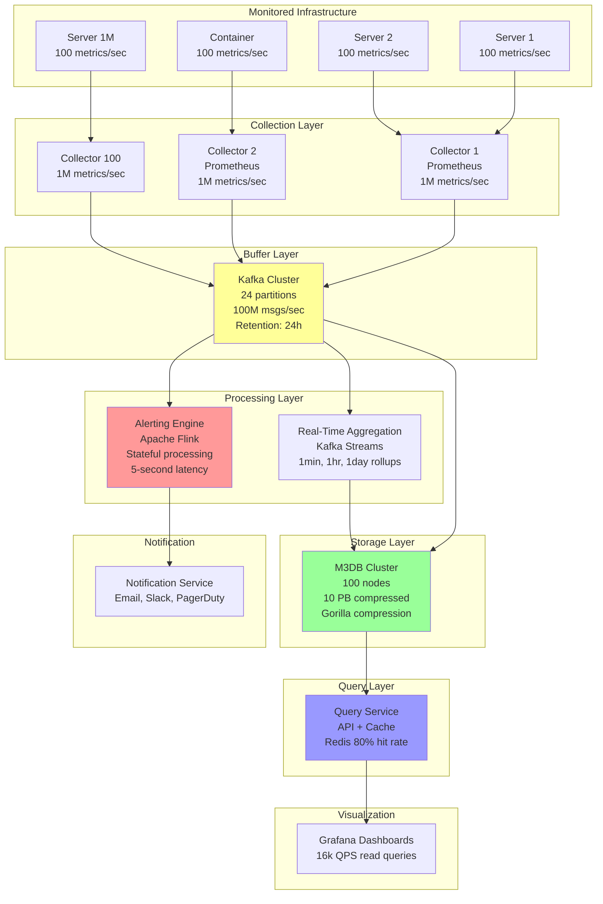

---

## 2. Metrics Collection Flow (Pull-Based)

**Flow Explanation:**

This diagram shows the pull-based collection model (Prometheus style) where collectors scrape metrics from endpoints.

**Steps:**
1. **Service Discovery (0s)** - Consul/Kubernetes API returns list of endpoints
2. **Scrape Scheduling (1s)** - Collector schedules scrape every 1 second per endpoint
3. **HTTP GET (10ms)** - Collector sends GET request to `/metrics` endpoint
4. **Parse Response (5ms)** - Parse Prometheus text format
5. **Local Buffer (1ms)** - Write to local buffer (100 metrics batched)
6. **Kafka Write (10ms)** - Batch write to Kafka (async)
7. **Total latency:** ~26ms from scrape to Kafka

**Benefits:**
- Centralized control (collector knows all endpoints)
- Endpoint discovery automatic (Kubernetes integration)
- Dead endpoint detection (failed scrapes)

**Trade-offs:**
- Requires inbound network access to endpoints
- Collector becomes bottleneck (horizontal scaling needed)
- Pull interval fixed (1 second minimum)

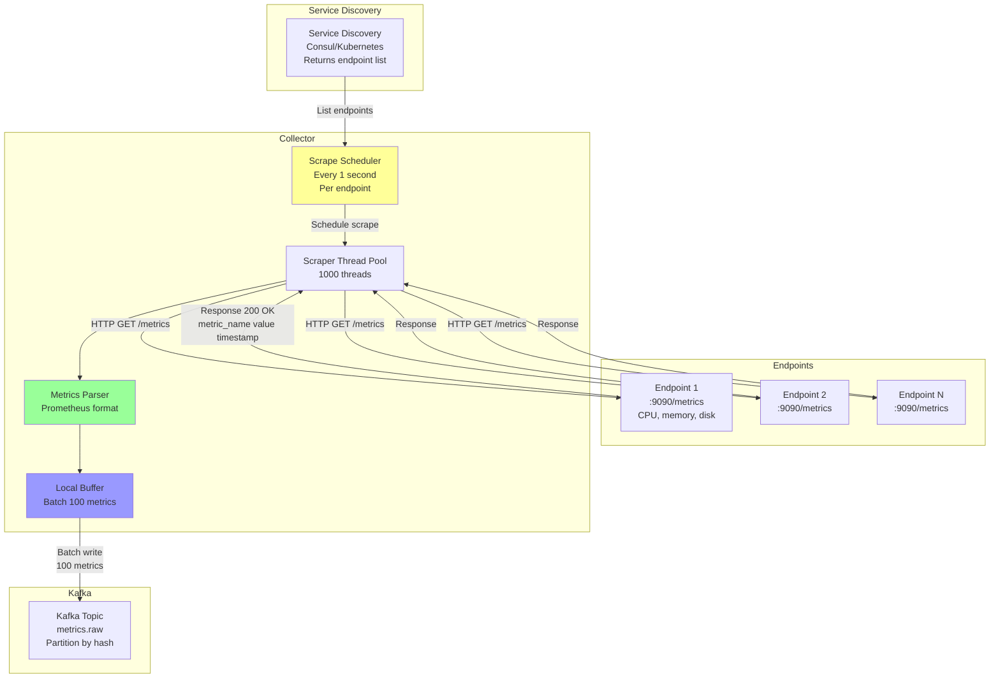

---

## 3. Metrics Collection Flow (Push-Based)

**Flow Explanation:**

This diagram shows the push-based collection model where agents installed on endpoints push metrics to collectors.

**Steps:**
1. **Agent Collection (0s)** - Agent collects system metrics (CPU, memory, disk, network)
2. **Local Aggregation (1s)** - Agent aggregates metrics over 1-second window
3. **Batching (1s)** - Agent batches 100 metrics before sending
4. **HTTP POST (10ms)** - Agent sends POST request to collector
5. **Collector Processing (5ms)** - Collector validates and formats metrics
6. **Kafka Write (10ms)** - Write to Kafka (async)
7. **Total latency:** ~26ms from collection to Kafka

**Benefits:**
- No inbound network access required (agent initiates connection)
- Edge devices supported (firewalls, NAT)
- Agent retries on failure (reliability)

**Trade-offs:**
- Agent installation overhead (deploy on every endpoint)
- Agent resource usage (CPU, memory)
- Endpoint-initiated (more network connections)

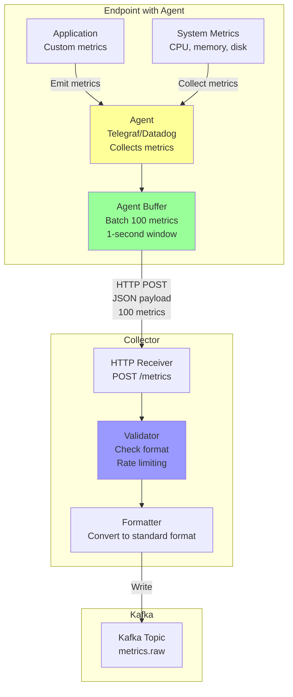

---

## 4. Kafka Buffer Architecture

**Flow Explanation:**

This diagram shows the Kafka cluster architecture for buffering 100M metrics/sec with partitioning and replication strategy.

**Kafka Configuration:**
- **Partitions:** 24 (distributes load across TSDB writers)
- **Replication:** 3x (durability, no data loss)
- **Retention:** 24 hours (replay window for backfill)
- **Compression:** snappy (5x reduction in storage)

**Partitioning Strategy:**
- Partition by `hash(metric_name + labels)` to ensure all data points for a specific time series go to the same partition (maintains ordering)

**Consumer Groups:**
1. **tsdb-writers** (24 consumers) - Write to M3DB
2. **alerting-engine** (12 consumers) - Real-time alert evaluation
3. **rollup-aggregators** (12 consumers) - Downsampling and rollups

**Performance:**
- Write throughput: 100M msgs/sec sustained
- Per-partition throughput: 4.2M msgs/sec (comfortable for Kafka)
- Latency: p99 <10ms (producer to consumer)
- Durability: 3x replication (no data loss on broker failure)

**Benefits:**
- Decouples collectors from TSDB (if TSDB slow, Kafka absorbs)
- Replay capability (reprocess metrics for backfill)
- Multiple consumers (TSDB, alerting, rollups) read same stream

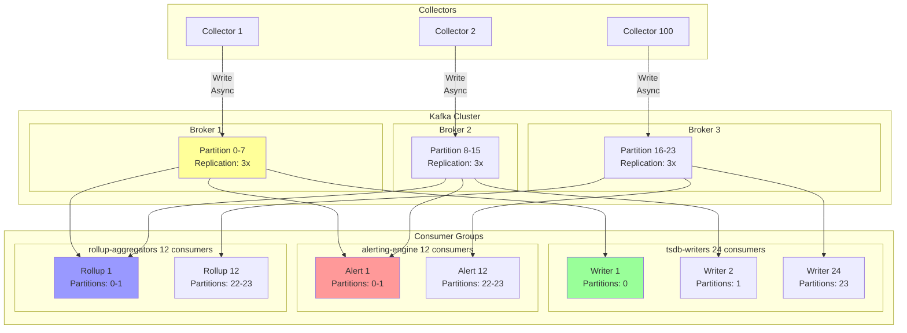

---

## 5. TSDB Storage Architecture (M3DB)

**Flow Explanation:**

This diagram shows the M3DB cluster architecture with sharding, replication, and query coordination.

**M3DB Components:**
1. **M3DB Nodes (100 nodes)** - Distributed storage, 100 GB memory + 1 TB SSD each
2. **M3Coordinator (3 nodes)** - Query aggregator and router
3. **M3Aggregator (10 nodes)** - Real-time aggregation for rollups
4. **M3Query (5 nodes)** - PromQL-compatible query engine

**Sharding Strategy:**
- **Shard count:** 4096 virtual shards
- **Shard distribution:** Consistent hashing by `hash(metric_name + labels)`
- **Replication factor:** 3x (each shard stored on 3 nodes)
- **Shard placement:** RF=3 means each time series stored on 3 different nodes

**Data Flow:**
1. **Write:** M3Coordinator → Shard placement → 3 M3DB nodes (parallel writes)
2. **Read:** M3Query → M3Coordinator → Query all relevant shards → Merge results

**Performance:**
- Write throughput: 1M writes/sec per node × 100 nodes = 100M writes/sec
- Storage: 100 TB raw per node × 100 nodes = 10 PB (after compression)
- Query latency: p50=50ms, p99=500ms (depends on time range)

**Benefits:**
- Horizontal scalability (add nodes linearly)
- High availability (3x replication, survives 2 node failures)
- Consistent hashing (no resharding on node add/remove)

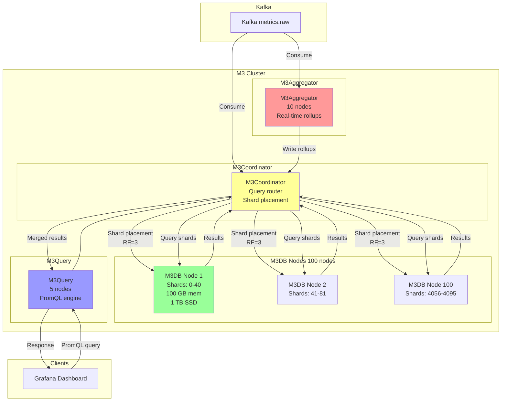

---

## 6. Data Compression Pipeline

**Flow Explanation:**

This diagram shows the Gorilla compression algorithm used by M3DB to achieve 10:1 compression ratio.

**Gorilla Compression (Facebook's Algorithm):**

**1. Timestamp Compression (Delta-of-Delta Encoding)**
- Store first timestamp as-is (64 bits)
- Store delta from previous timestamp (e.g., 1 second = 1000ms)
- Store delta-of-delta (if interval constant, delta-of-delta = 0)
- Result: 1-2 bits per timestamp (vs 64 bits raw)

**2. Value Compression (XOR Encoding)**
- XOR current value with previous value
- If XOR result has leading/trailing zeros, store only significant bits
- Result: Average 1.37 bits per value (vs 64 bits for double)

**Example:**
```
Raw timestamps: [1000, 2000, 3000, 4000] (256 bits total)
Deltas: [-, 1000, 1000, 1000]
Delta-of-deltas: [-, -, 0, 0]
Compressed: 64 + 12 + 1 + 1 = 78 bits (3.3x compression)

Raw values: [65.2, 67.5, 70.1, 72.3] (256 bits total)
XOR compression: 64 + 8 + 12 + 10 = 94 bits (2.7x compression)

Total: 78 + 94 = 172 bits (vs 512 bits raw = 3x compression for 4 points)
```

**Overall Compression:**
- 100 PB raw data → 10 PB compressed (10:1 ratio)
- Compression CPU cost: <5% (acceptable overhead)

**Benefits:**
- Massive storage savings (10x reduction)
- Faster queries (less data to scan)
- Lower network transfer (less data to send)

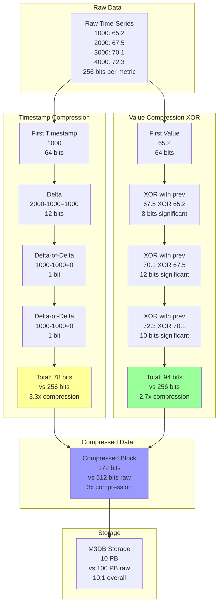

---

## 7. Rollup and Aggregation Pipeline

**Flow Explanation:**

This diagram shows the real-time aggregation pipeline for downsampling metrics from 1-second resolution to 1-minute, 5-minute, 1-hour, and 1-day rollups.

**Rollup Strategy:**
- **Raw (1-second):** Retained for 1 day (8.64 trillion points)
- **1-minute rollup:** Retained for 7 days (1.4 trillion points)
- **5-minute rollup:** Retained for 30 days (8.6 billion points)
- **1-hour rollup:** Retained for 1 year (876 million points)
- **1-day rollup:** Retained for 2+ years (730,000 points per metric)

**Aggregation Functions:**
- `count` - Number of samples in window
- `sum` - Sum of values
- `min`, `max` - Min/max values
- `avg` - Average value
- `p50`, `p95`, `p99` - Percentiles

**Processing:**
1. **Kafka Streams** consumes `metrics.raw` topic
2. **Windowed aggregation** (tumbling windows: 1min, 5min, 1hr, 1day)
3. **Compute aggregates** (count, sum, min, max, avg, percentiles)
4. **Write to TSDB** rollup tables
5. **Auto-expire** old raw data (1 day retention)

**Benefits:**
- Storage reduction: 100 PB raw → 10 PB (with rollups)
- Query performance: 3600x faster (1-hour rollup vs raw for 30-day query)
- Long-term retention: Store 2+ years of data cost-effectively

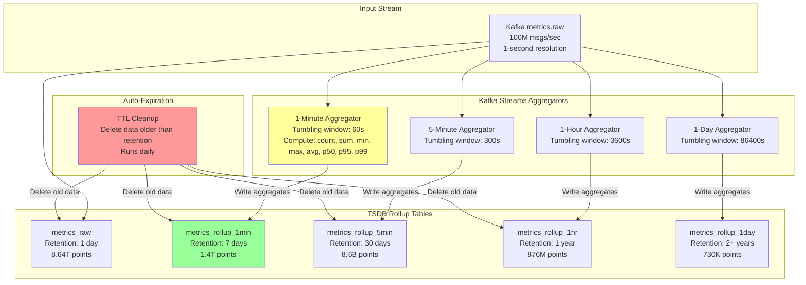

---

## 8. Alerting Engine Architecture

**Flow Explanation:**

This diagram shows the stateful stream processing architecture for real-time alert evaluation using Apache Flink.

**Alert Processing Flow:**
1. **Consume metrics** from Kafka `metrics.raw`
2. **Group by alert rule** (e.g., all `cpu_usage` for `service=api-gateway`)
3. **Windowed aggregation** (e.g., 5-minute tumbling window)
4. **Evaluate condition** (e.g., `avg > 80%`)
5. **State management** (track if alert already firing)
6. **Deduplicate** (don't send duplicate alerts)
7. **Trigger notification** (email, Slack, PagerDuty)

**Stateful Processing:**
- **State store:** RocksDB (embedded key-value store)
- **State:** Current alert status (firing, resolved), window aggregations
- **Checkpointing:** Periodic snapshots every 60 seconds for fault tolerance
- **Exactly-once semantics:** No duplicate alert notifications

**Alert Rule Example:**
```
name: HighCPUUsage
condition: avg(cpu_usage{service="api-gateway"}) > 80 for 5 minutes
severity: warning
notification: slack-channel=#alerts
```

**Performance:**
- Alert evaluation latency: <5 seconds (from metric arrival to notification)
- Throughput: 10k alert rules evaluated concurrently
- State size: <10 GB per Flink task (for 10k rules)

**Benefits:**
- Real-time (<5 seconds latency)
- Stateful (remembers alert state)
- Scalable (horizontal scaling with Flink parallelism)
- Fault-tolerant (checkpointing and recovery)

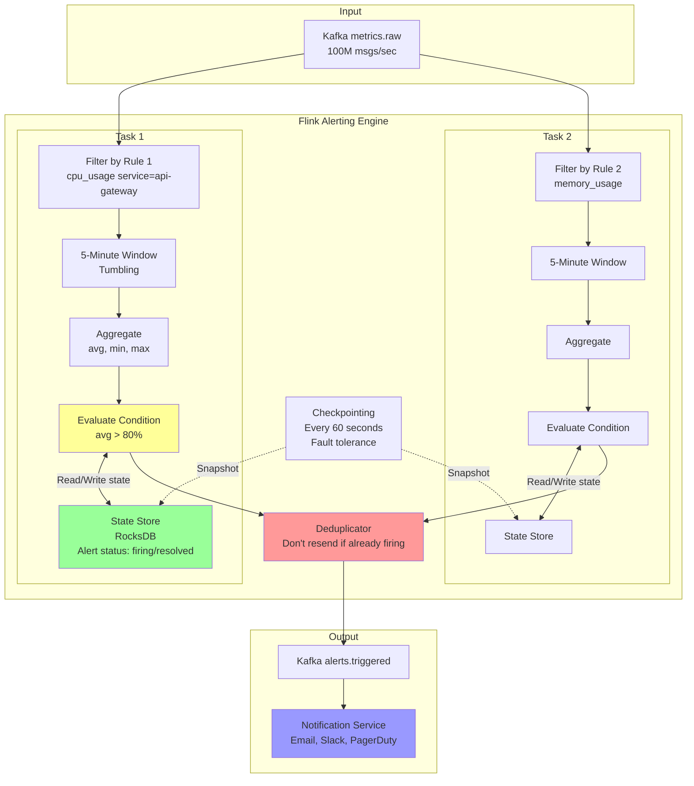

---

## 9. Query Service Architecture

**Flow Explanation:**

This diagram shows the query service architecture with caching, query optimization, and parallel execution.

**Query Processing Flow:**
1. **Receive query** from Grafana (PromQL or HTTP API)
2. **Query optimization** (automatic rollup selection, predicate pushdown)
3. **Check cache** (Redis query result cache, 80% hit rate)
4. **If cache miss:** Execute query on TSDB
5. **Parallel execution** (query multiple shards in parallel)
6. **Merge results** from all shards
7. **Store in cache** (TTL: 1 minute for recent data, 1 hour for old data)
8. **Return to client**

**Query Optimization:**

**1. Automatic Rollup Selection**
- Query: "Show CPU for last 30 days"
- Optimizer: Use 1-hour rollup (not raw)
- Benefit: 3600x fewer data points (720 vs 2.6M)

**2. Predicate Pushdown**
- Push filters to TSDB storage layer
- Example: `region=us-east-1` filtered at shard level

**3. Query Parallelization**
- Split query across shards
- Execute in parallel
- Merge results

**Caching:**
- **L1 Cache (Redis):** Query result cache, 80% hit rate
- **L2 Cache (M3DB):** Block cache (1-hour chunks), 60% hit rate

**Performance:**
- Cache hit: <10ms (Redis)
- Cache miss: <1 second (for last 1 hour query)
- Long-range query (30 days): <2 seconds (with 1-hour rollup)

**Benefits:**
- Fast dashboard queries (<1 second)
- Reduced TSDB load (80% cache hit rate)
- Automatic optimization (rollup selection)

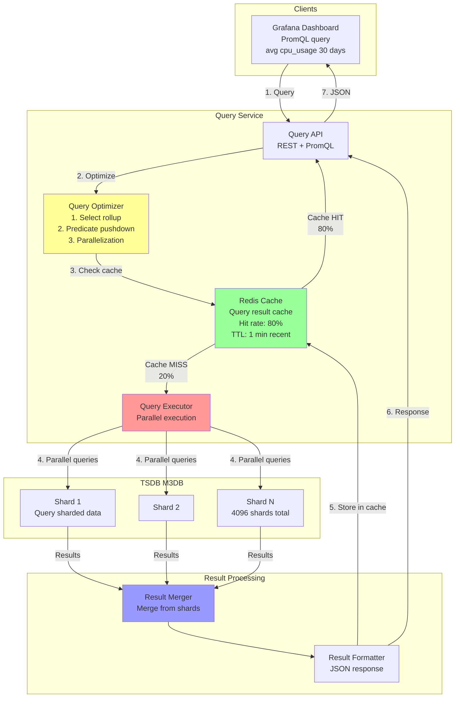

---

## 10. Multi-Region Deployment

**Flow Explanation:**

This diagram shows the multi-region deployment architecture for low-latency global metric collection.

**Regional Deployment:**
- **3 Regions:** US-East, EU-West, AP-Southeast
- **Per-region stack:** Collectors → Kafka → TSDB → Query Service
- **Local collection:** Metrics collected in the region where endpoints are located
- **Regional dashboards:** Fast queries (local TSDB)

**Global Aggregation:**
- **Cross-region replication:** Kafka MirrorMaker 2 replicates metrics to central region
- **Global TSDB:** Aggregates metrics from all regions
- **Global dashboards:** View metrics across all regions

**Replication Lag:**
- Regional to global: 5-30 seconds (acceptable for most use cases)
- Eventually consistent (global metrics lag behind regional)

**Benefits:**
- Low-latency collection (<50ms in-region)
- Regional dashboards for local troubleshooting
- Global view for cross-region analysis
- Region failover (if one region fails, others continue)

**Trade-offs:**
- Higher cost (3x infrastructure)
- Eventual consistency (global lag)
- Cross-region networking complexity

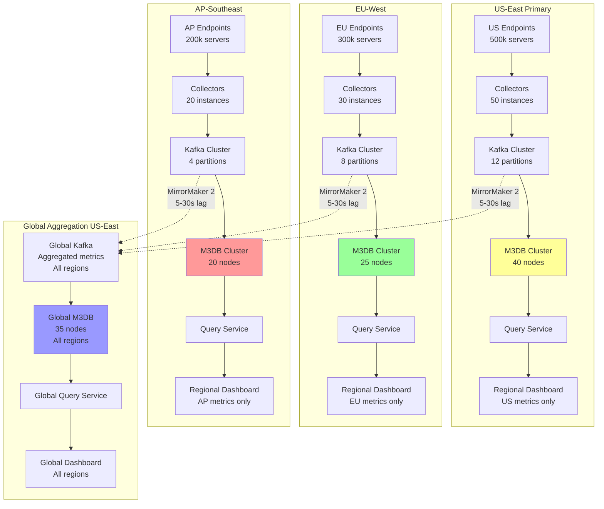

---

## 11. Tiered Storage Strategy

**Flow Explanation:**

This diagram shows the tiered storage strategy (hot/warm/cold) for cost-effective long-term retention.

**Storage Tiers:**

**1. Hot Tier (0-7 days)**
- **Storage:** SSD (NVMe)
- **Speed:** Very fast (<10ms read latency)
- **Cost:** $0.10/GB-month
- **Size:** 800 TB
- **Use Case:** Recent metrics, real-time dashboards

**2. Warm Tier (7-90 days)**
- **Storage:** HDD (SATA)
- **Speed:** Fast (<50ms read latency)
- **Cost:** $0.02/GB-month
- **Size:** 8 PB
- **Use Case:** Historical analysis, troubleshooting

**3. Cold Tier (90+ days)**
- **Storage:** S3/Glacier
- **Speed:** Slow (seconds to minutes)
- **Cost:** $0.004/GB-month
- **Size:** 1 PB
- **Use Case:** Compliance, long-term archival

**Data Lifecycle:**
1. **Day 0-7:** Store in hot tier (SSD)
2. **Day 7:** Transition to warm tier (HDD)
3. **Day 90:** Transition to cold tier (S3)
4. **Day 730:** Delete (optional, based on retention policy)

**Cost Analysis:**
```
Hot tier (7 days): 800 TB × $0.10 = $80k/month
Warm tier (83 days): 8 PB × $0.02 = $160k/month
Cold tier (2 years): 1 PB × $0.004 = $4k/month

Total storage cost: $244k/month
vs Single-tier (SSD): 10 PB × $0.10 = $1M/month (4x more expensive)
```

**Benefits:**
- Cost-effective (4x cheaper than SSD-only)
- Fast recent data access (hot tier)
- Long-term retention (cold tier)

**Trade-offs:**
- Complexity (manage 3 storage tiers)
- Query latency varies (hot: 10ms, cold: seconds)

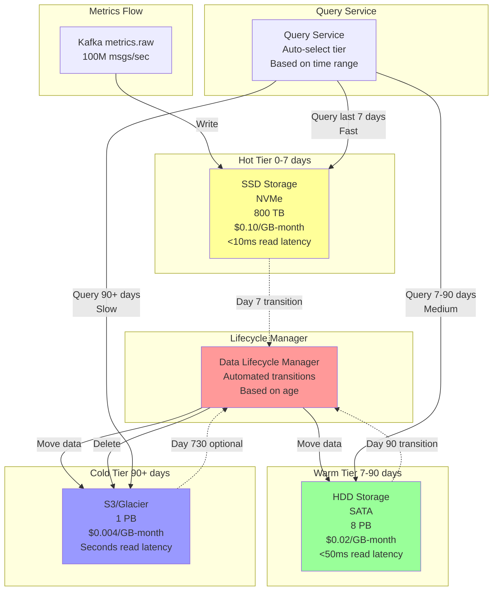

---

## 12. Cardinality Control System

**Flow Explanation:**

This diagram shows the cardinality control system to prevent label explosion (high-cardinality problem).

**Cardinality Problem:**
- Each unique label combination = new time series
- Example: `request_id` label with 1B unique values = 1B time series
- High cardinality → Memory explosion, slow queries, TSDB crashes

**Cardinality Control:**

**1. Label Validation (Ingestion Time)**
- Whitelist approved labels (only allow specific label keys)
- Blacklist high-cardinality labels (`user_id`, `request_id`, `session_id`)
- Reject metrics with invalid labels

**2. Cardinality Monitoring**
- Track unique label combinations per metric
- Alert if cardinality growth >10% per day
- Dashboard shows top high-cardinality metrics

**3. Cardinality Limits**
- Max 20 labels per metric
- Max 10k unique label combinations per metric
- Reject metrics exceeding limits

**Example:**
```
❌ BAD (high cardinality):
http_requests{request_id="abc123", user_id="user456"}
→ 1B unique request_ids × 100M users = 100 quadrillion time series

✅ GOOD (low cardinality):
http_requests{service="api-gateway", endpoint="/users", method="POST", status_code="200"}
→ 10 services × 100 endpoints × 5 methods × 10 status_codes = 50k time series
```

**Benefits:**
- Prevents memory explosion (keeps TSDB stable)
- Faster queries (fewer time series to scan)
- Lower cost (less storage)

**Trade-offs:**
- Less flexibility (can't use any label)
- Requires label design discipline

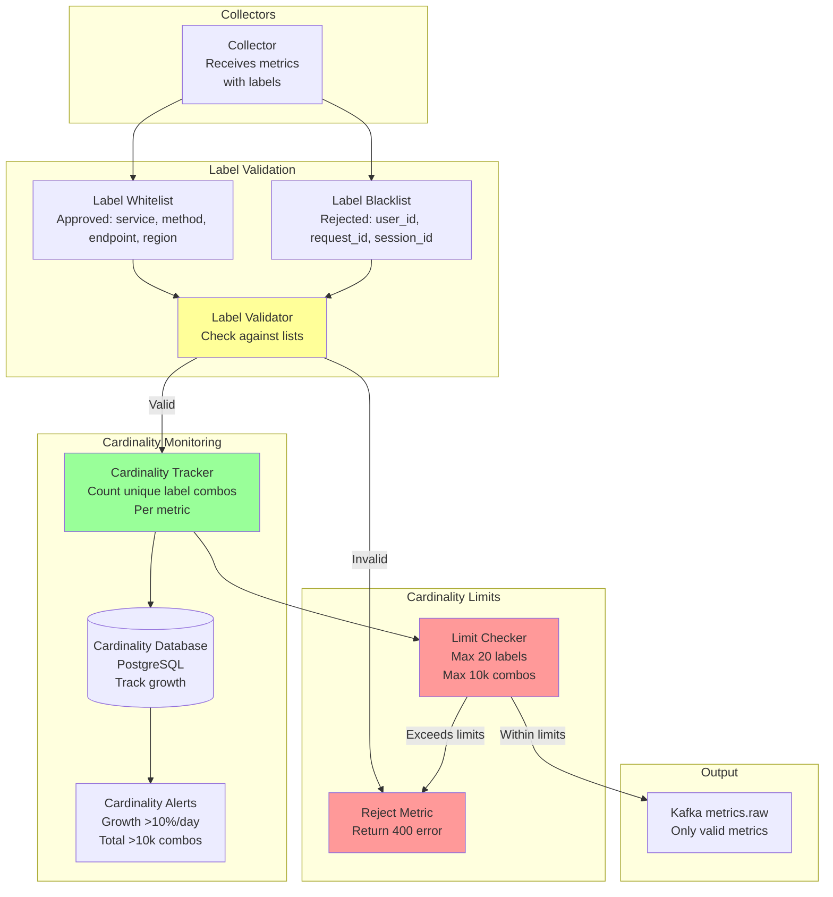

---

## 13. Meta-Monitoring Architecture

**Flow Explanation:**

This diagram shows the dual-layered monitoring architecture for monitoring the monitoring system itself.

**Challenge:** How do you monitor the monitoring system? If the monitoring system is down, how do you know?

**Solution: Dual-Layered Monitoring**

**Layer 1: Self-Monitoring**
- Primary monitoring system monitors itself
- Collectors emit metrics about themselves (scrape duration, errors)
- Kafka emits metrics (consumer lag, broker health)
- TSDB emits metrics (write throughput, query latency, disk usage)
- Alerts configured for self-monitoring metrics

**Layer 2: External Monitoring**
- Separate lightweight monitoring system (e.g., standalone Prometheus)
- Deployed on separate infrastructure (different cluster, different region)
- Monitors critical metrics of primary monitoring system
- Alerts if primary system is down or degraded

**Key Metrics Monitored:**

| Component | Metric | Alert Threshold |
|-----------|--------|-----------------|
| Collectors | `scrape_duration_seconds` | >5 seconds |
| Collectors | `scrape_errors_total` | >10 errors/min |
| Kafka | `consumer_lag` | >1M messages |
| TSDB | `write_throughput_qps` | <50M QPS (expected 100M) |
| TSDB | `query_latency_p99_ms` | >5000ms |
| Alerting | `alert_evaluation_duration_ms` | >10 seconds |

**Benefits:**
- Catches primary monitoring system failures
- Independent external monitoring (different failure domain)
- Lightweight external system (simple, reliable)

**Trade-offs:**
- Additional infrastructure cost (external monitoring)
- Two monitoring systems to maintain

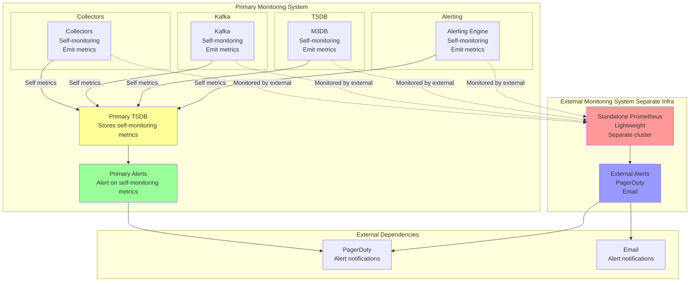

---

## 14. Scaling Strategy

**Flow Explanation:**

This diagram shows the horizontal scaling strategy for each component to handle growth from 100M writes/sec to 1B writes/sec.

**Scaling Approach:**

**1. Collectors (Pull-Based)**
- **Current:** 100 collectors, 1M metrics/sec each
- **Scale to 1B:** 1000 collectors, 1M metrics/sec each
- **Strategy:** Deploy more collector instances, service discovery auto-assigns endpoints

**2. Kafka**
- **Current:** 24 partitions, 4.2M msgs/sec each
- **Scale to 1B:** 240 partitions, 4.2M msgs/sec each
- **Strategy:** Add more partitions (requires rebalancing), add more brokers

**3. M3DB**
- **Current:** 100 nodes, 1M writes/sec each
- **Scale to 1B:** 1000 nodes, 1M writes/sec each
- **Strategy:** Add more nodes, consistent hashing automatically redistributes shards

**4. Alerting Engine (Flink)**
- **Current:** 12 Flink tasks
- **Scale to 1B:** 120 Flink tasks
- **Strategy:** Increase Flink parallelism, add more task managers

**5. Query Service**
- **Current:** 5 query service instances
- **Scale to 1B:** 50 query service instances
- **Strategy:** Add more instances behind load balancer, cache layer scales with Redis cluster

**Scaling Formula:**
```
To scale from X to 10X writes/sec:
- Collectors: 10x more instances
- Kafka: 10x more partitions (or increase per-partition throughput)
- M3DB: 10x more nodes (linear scaling)
- Alerting: 10x more Flink parallelism
- Query Service: Minimal scaling (reads don't scale linearly with writes)
```

**Performance:**
- 100M writes/sec → $244k/month infrastructure cost
- 1B writes/sec → $2.4M/month infrastructure cost (linear scaling)

**Benefits:**
- Horizontal scalability (add nodes, not bigger nodes)
- Linear cost scaling (10x writes = 10x cost)
- No major architectural changes needed

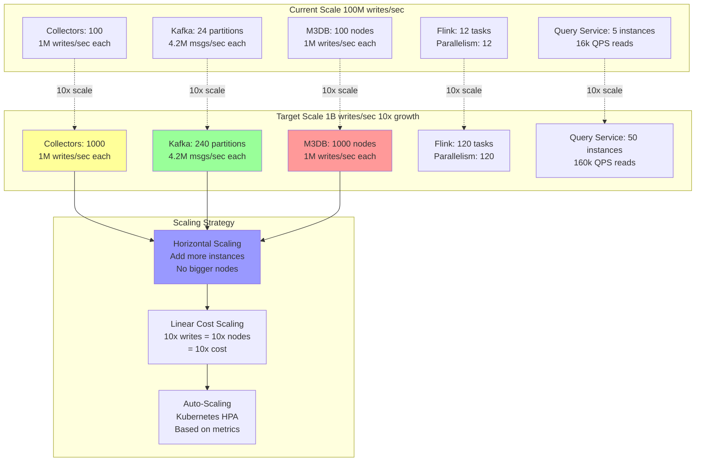

---

**Total:** This comprehensive diagram document covers all aspects of the distributed monitoring system architecture with 14 detailed Mermaid diagrams and flow explanations.
