# Distributed Monitoring System - Sequence Diagrams

## Table of Contents

1. [Metrics Collection Flow (Pull-Based Scrape)](#1-metrics-collection-flow-pull-based-scrape)
2. [Metrics Collection Flow (Push-Based Agent)](#2-metrics-collection-flow-push-based-agent)
3. [Kafka Buffering and TSDB Write](#3-kafka-buffering-and-tsdb-write)
4. [Real-Time Alert Evaluation](#4-real-time-alert-evaluation)
5. [Rollup Aggregation Processing](#5-rollup-aggregation-processing)
6. [Dashboard Query Execution (Cache Hit)](#6-dashboard-query-execution-cache-hit)
7. [Dashboard Query Execution (Cache Miss)](#7-dashboard-query-execution-cache-miss)
8. [Alert Notification Flow](#8-alert-notification-flow)
9. [Cardinality Limit Rejection](#9-cardinality-limit-rejection)
10. [Multi-Region Metric Replication](#10-multi-region-metric-replication)
11. [Tiered Storage Transition](#11-tiered-storage-transition)
12. [Failure Recovery - Collector Restart](#12-failure-recovery---collector-restart)

---

## 1. Metrics Collection Flow (Pull-Based Scrape)

**Flow:**

Shows the complete pull-based metrics collection flow from endpoint scraping to Kafka write.

**Steps:**

1. **Service Discovery (0ms)** - Collector queries Kubernetes API for pod list
2. **Schedule Scrape (1000ms)** - Collector schedules scrape for endpoint every 1 second
3. **HTTP GET (10ms)** - Collector sends GET to `/metrics` endpoint
4. **Endpoint Response (5ms)** - Endpoint returns Prometheus text format
5. **Parse Metrics (3ms)** - Parse metric name, labels, value, timestamp
6. **Local Buffer (1ms)** - Write to local buffer (batch 100 metrics)
7. **Kafka Write (8ms)** - Async write to Kafka (non-blocking)
8. **Total latency:** ~27ms from scrape to Kafka

**Performance:**

- Scrape frequency: 1 second per endpoint
- Batch size: 100 metrics per Kafka write
- Parallelism: 1000 scraper threads per collector
- Throughput: 1M metrics/sec per collector

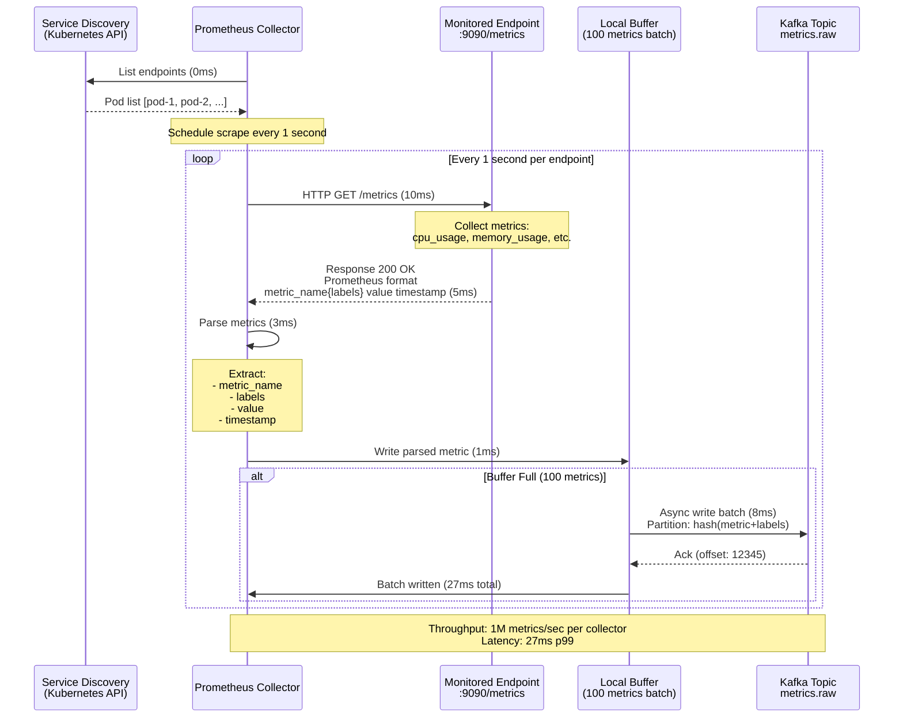

---

## 2. Metrics Collection Flow (Push-Based Agent)

**Flow:**

Shows push-based metrics collection where agents on endpoints push metrics to collectors.

**Steps:**

1. **Agent Collection (0ms)** - Agent collects system metrics (CPU, memory, disk)
2. **Aggregation (1000ms)** - Agent aggregates over 1-second window
3. **Batching (1000ms)** - Agent batches 100 metrics before sending
4. **HTTP POST (15ms)** - Agent POSTs batch to collector
5. **Collector Validation (3ms)** - Collector validates format and rate limits
6. **Kafka Write (8ms)** - Collector writes to Kafka
7. **Total latency:** ~26ms from collection to Kafka

**Performance:**

- Agent collection frequency: 1 second
- Batch size: 100 metrics per POST
- Retry logic: Exponential backoff (1s, 2s, 4s, 8s)
- Agent resource usage: 50 MB memory, 2% CPU

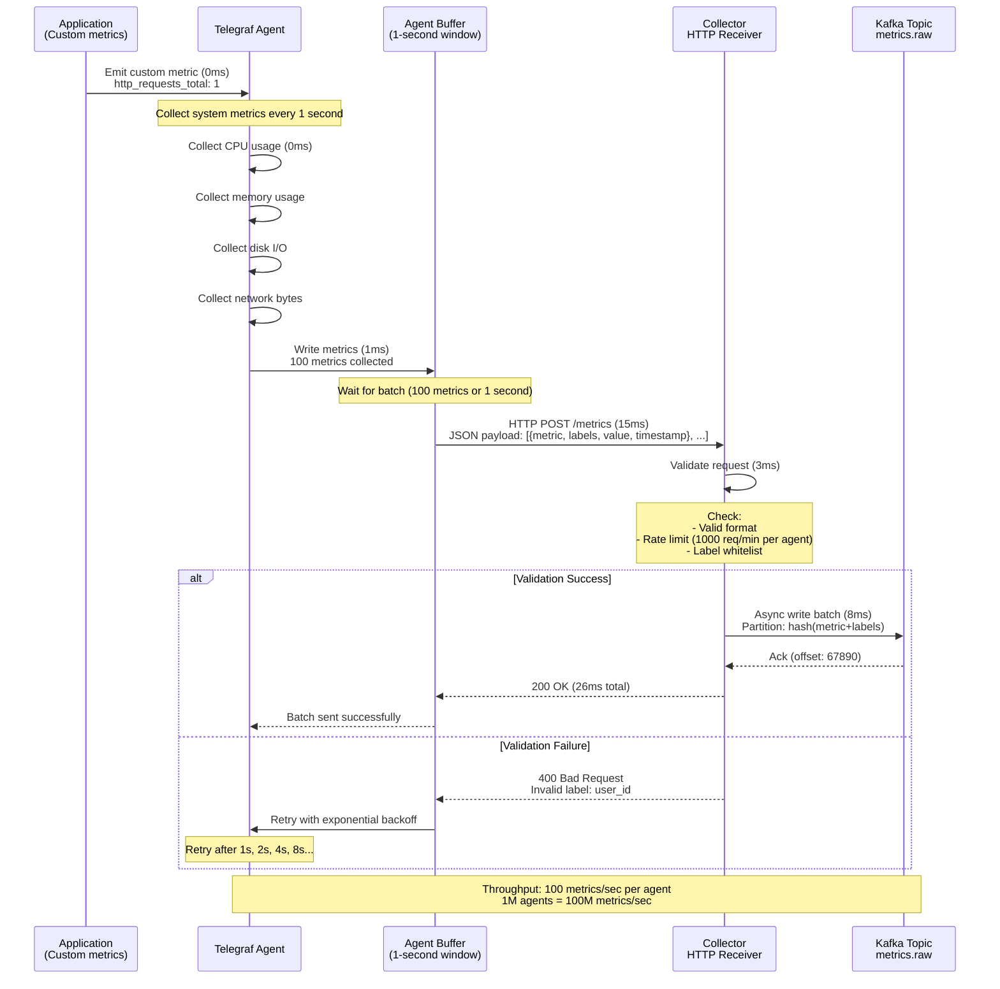

---

## 3. Kafka Buffering and TSDB Write

**Flow:**

Shows how Kafka buffers metrics and TSDB writers consume and write to M3DB.

**Steps:**

1. **Produce to Kafka (0ms)** - Collector writes metrics to Kafka
2. **Kafka Persistence (5ms)** - Kafka persists to disk (3x replication)
3. **Consumer Poll (10ms)** - TSDB writer polls Kafka (batch size: 1000)
4. **Transform (5ms)** - Transform to M3DB format
5. **M3DB Write (20ms)** - Write to M3DB (batch write to 3 replicas)
6. **Kafka Commit (2ms)** - Commit offset back to Kafka
7. **Total latency:** ~42ms from Kafka produce to M3DB write

**Performance:**

- Kafka throughput: 100M msgs/sec (24 partitions)
- Consumer lag: <1000 messages (healthy)
- TSDB write throughput: 100M writes/sec (100 nodes)
- Durability: 3x replication (no data loss)

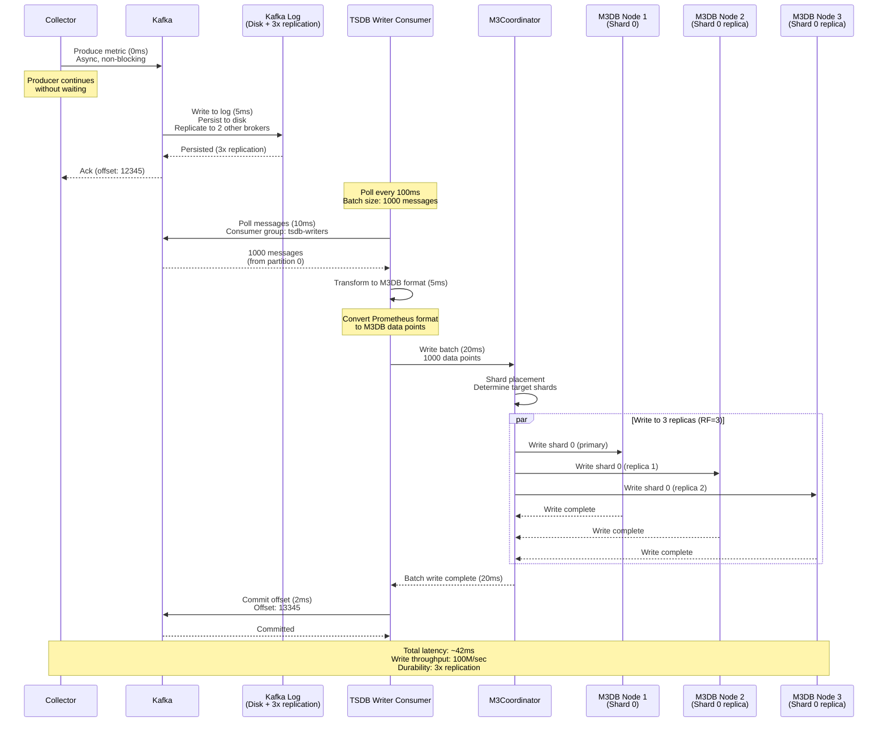

---

## 4. Real-Time Alert Evaluation

**Flow:**

Shows the stateful stream processing flow for real-time alert evaluation using Apache Flink.

**Steps:**

1. **Consume Metrics (0ms)** - Flink consumes from Kafka
2. **Group by Rule (5ms)** - Group metrics by alert rule
3. **Windowed Aggregation (5000ms)** - 5-minute tumbling window
4. **Evaluate Condition (10ms)** - Check if avg > 80%
5. **State Check (5ms)** - Check if alert already firing
6. **Trigger Alert (20ms)** - Publish to alerts.triggered topic
7. **Total latency:** ~4 seconds from metric to alert notification

**Performance:**

- Alert evaluation latency: <5 seconds (p99)
- Concurrent alert rules: 10,000 rules
- State size: <10 GB per Flink task
- Exactly-once semantics: No duplicate alerts

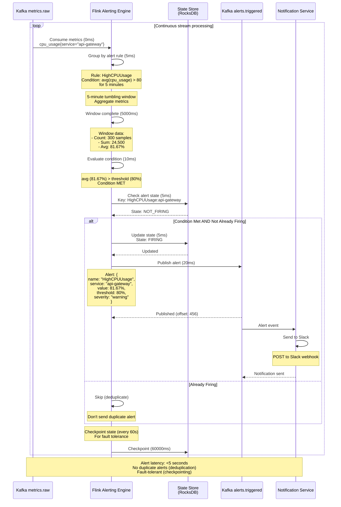

---

## 5. Rollup Aggregation Processing

**Flow:**

Shows the real-time aggregation flow for downsampling raw metrics to 1-minute rollups.

**Steps:**

1. **Consume Raw Metrics (0ms)** - Kafka Streams consumes raw metrics
2. **Group by Metric (5ms)** - Group by metric_name + labels
3. **1-Minute Window (60000ms)** - Tumbling window aggregation
4. **Compute Aggregates (10ms)** - Count, sum, min, max, avg, p50, p95, p99
5. **Write Rollup (15ms)** - Write to M3DB rollup table
6. **Emit Rollup (60025ms total)** - Emit aggregated data point

**Performance:**

- Window size: 1 minute (tumbling)
- Aggregation latency: <30 seconds after window close
- Storage reduction: 60x (1-minute vs 1-second)
- Rollup throughput: 1.7M rollups/sec (100M raw / 60)

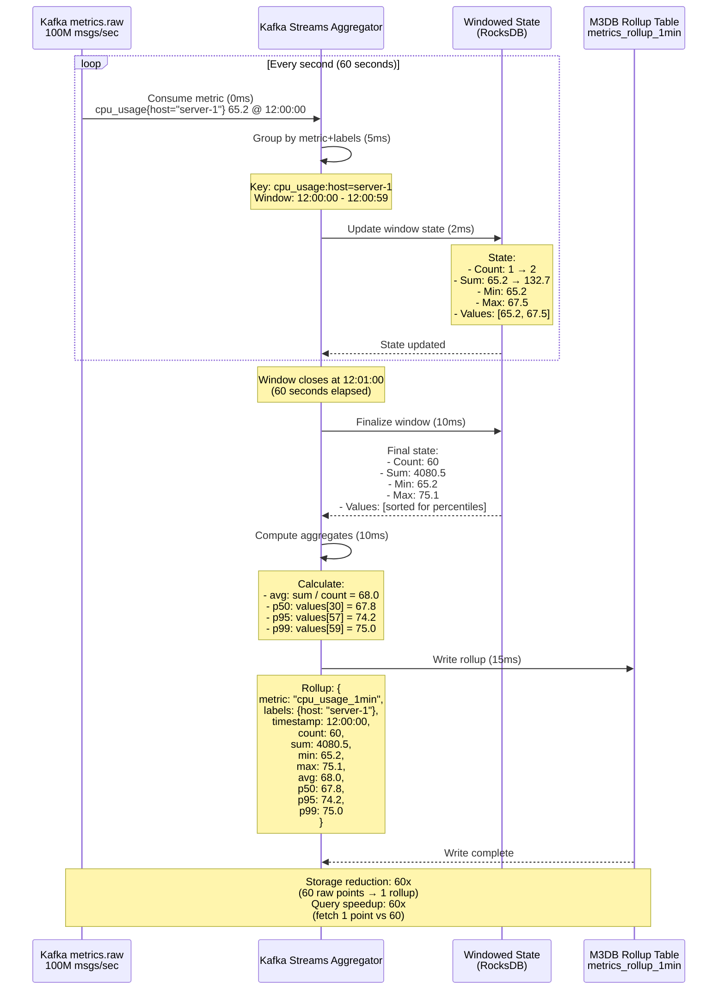

---

## 6. Dashboard Query Execution (Cache Hit)

**Flow:**

Shows the fast dashboard query execution flow when query result is cached in Redis.

**Steps:**

1. **Grafana Query (0ms)** - User opens dashboard
2. **Query API (5ms)** - API receives PromQL query
3. **Query Optimizer (3ms)** - Optimize query (select rollup)
4. **Redis Lookup (2ms)** - Check cache for query result
5. **Cache HIT (2ms)** - Result found in cache
6. **Return Response (10ms total)** - Return cached result to Grafana

**Performance:**

- Cache hit latency: <10ms (p50)
- Cache hit rate: 80% (popular dashboards)
- Redis cluster: 3 nodes, 100 GB memory
- TTL: 1 minute (recent data), 1 hour (old data)

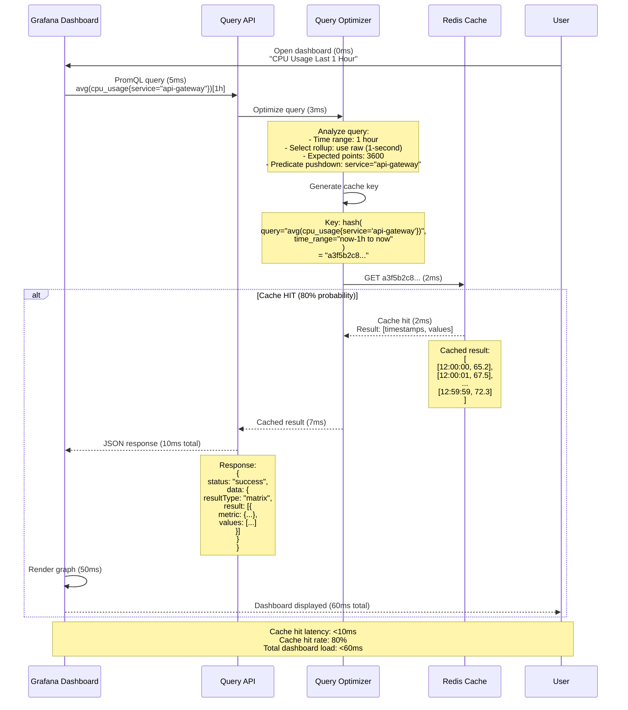

---

## 7. Dashboard Query Execution (Cache Miss)

**Flow:**

Shows the query execution flow when cache miss occurs, requiring query to TSDB.

**Steps:**

1. **Grafana Query (0ms)** - User opens dashboard
2. **Query API (5ms)** - API receives query
3. **Query Optimizer (3ms)** - Optimize query
4. **Redis Lookup (2ms)** - Check cache (MISS)
5. **M3DB Query (500ms)** - Execute on M3DB (parallel across shards)
6. **Store in Cache (10ms)** - Cache result for future requests
7. **Return Response (520ms total)** - Return result to Grafana

**Performance:**

- Cache miss latency: <1 second (p99)
- M3DB query: 500ms (depends on time range and cardinality)
- Parallel execution: Query 4096 shards in parallel
- Result merge: <50ms

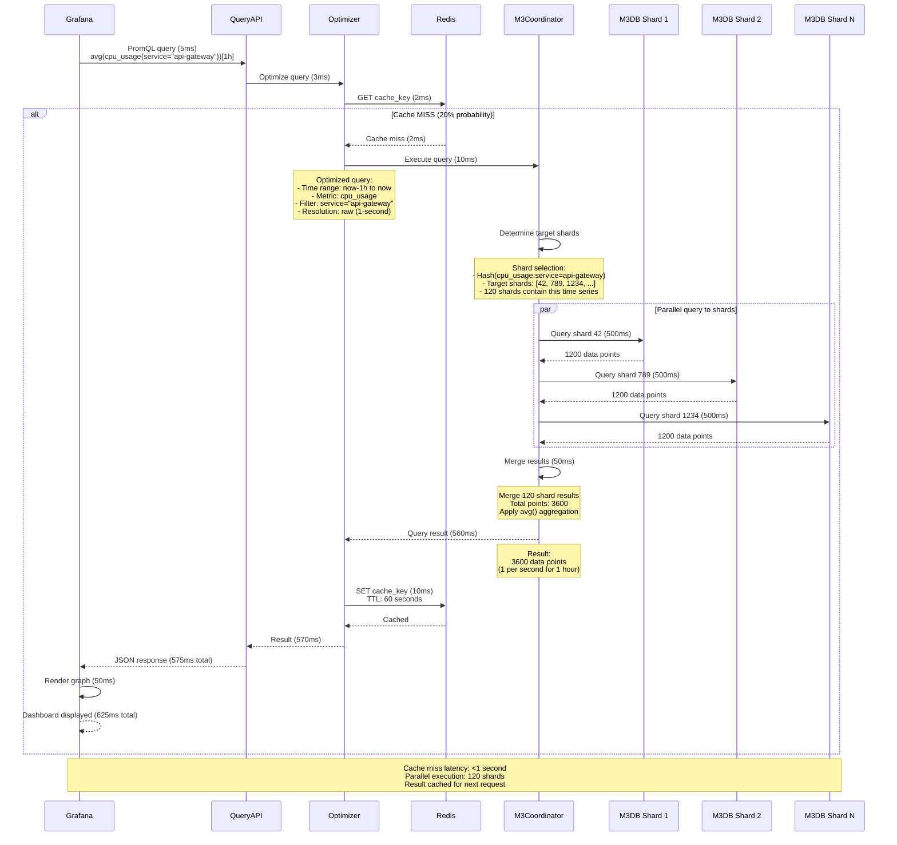

---

## 8. Alert Notification Flow

**Flow:**

Shows the end-to-end alert notification flow from alert trigger to external notification systems.

**Steps:**

1. **Alert Triggered (0ms)** - Flink publishes to alerts.triggered topic
2. **Notification Service Consumes (5ms)** - Consume alert event
3. **Deduplicate (2ms)** - Check if alert already sent recently
4. **Route Notification (3ms)** - Determine notification channels (email, Slack, PagerDuty)
5. **Send Notifications (200ms)** - Parallel send to all channels
6. **Update State (5ms)** - Mark alert as notified
7. **Total latency:** ~215ms from alert trigger to notification sent

**Performance:**

- Notification latency: <500ms (p99)
- Throughput: 1000 alerts/sec
- Retry logic: 3 retries with exponential backoff
- Notification channels: Email, Slack, PagerDuty, Webhook

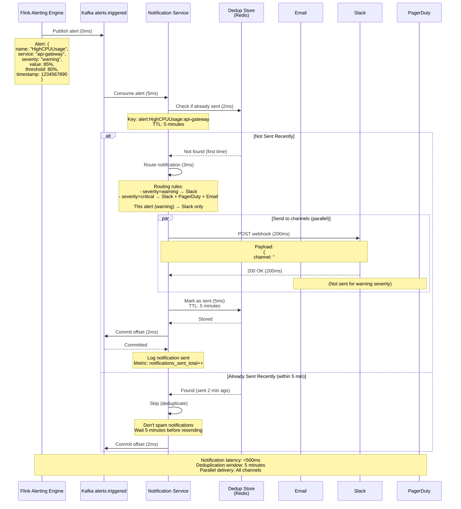

---

## 9. Cardinality Limit Rejection

**Flow:**

Shows the cardinality control flow where metrics with too many unique label combinations are rejected.

**Steps:**

1. **Collector Receives Metric (0ms)** - Metric with high-cardinality label
2. **Label Validation (2ms)** - Check against whitelist/blacklist
3. **Cardinality Check (5ms)** - Query current cardinality for this metric
4. **Limit Check (2ms)** - Check if adding this would exceed limit (10k unique combos)
5. **Rejection (9ms total)** - Return 400 error
6. **Alert on High Cardinality (10ms)** - Alert SRE team

**Performance:**

- Validation latency: <10ms
- Cardinality limit: 10k unique label combinations per metric
- Label limit: Max 20 labels per metric
- Blacklist: `user_id`, `request_id`, `session_id`, `trace_id`

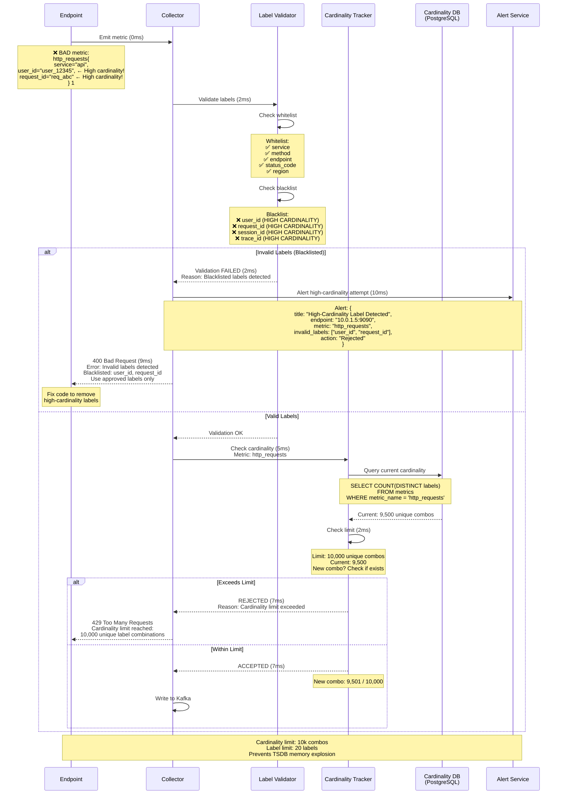

---

## 10. Multi-Region Metric Replication

**Flow:**

Shows cross-region metric replication from regional Kafka to global Kafka using MirrorMaker 2.

**Steps:**

1. **Regional Collection (0ms)** - Metrics collected in EU-West region
2. **Regional Kafka (5ms)** - Write to EU-West Kafka
3. **MirrorMaker 2 Consume (1000ms)** - MirrorMaker polls regional Kafka
4. **Transform (10ms)** - Transform and enrich with region metadata
5. **Global Kafka Write (20ms)** - Write to global Kafka in US-East
6. **Global Processing (1030ms total)** - Process in global TSDB
7. **Replication lag:** 1-5 seconds (acceptable)

**Performance:**

- Replication lag: 1-5 seconds (p99)
- Throughput: 30M metrics/sec (EU region)
- Cross-region bandwidth: 50 Gbps
- Failover time: <30 seconds (if regional Kafka fails)

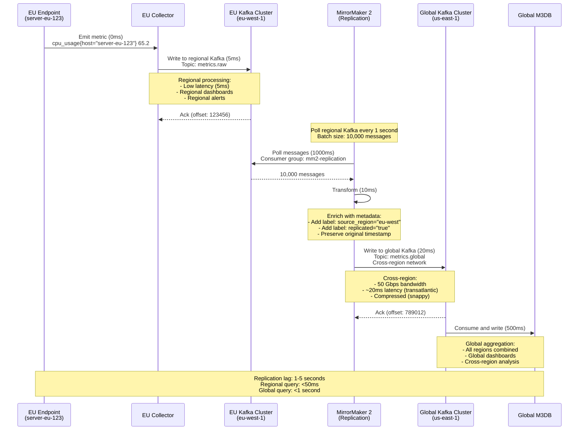

---

## 11. Tiered Storage Transition

**Flow:**

Shows the automated data lifecycle management flow for transitioning data from hot (SSD) to warm (HDD) to cold (S3)
tiers.

**Steps:**

1. **Day 0-7: Hot Tier (0ms)** - Data written to SSD (fast access)
2. **Day 7: Lifecycle Manager (0ms)** - Detects data >7 days old
3. **Transition to Warm (3600000ms)** - Copy to HDD, verify, delete from SSD
4. **Day 90: Lifecycle Manager (0ms)** - Detects data >90 days old
5. **Transition to Cold (7200000ms)** - Copy to S3, verify, delete from HDD
6. **Day 730 (optional): Delete (0ms)** - Delete from S3 based on retention policy

**Performance:**

- Hot tier latency: <10ms (SSD)
- Warm tier latency: <50ms (HDD)
- Cold tier latency: 1-5 seconds (S3)
- Transition time: 1-2 hours (background process)

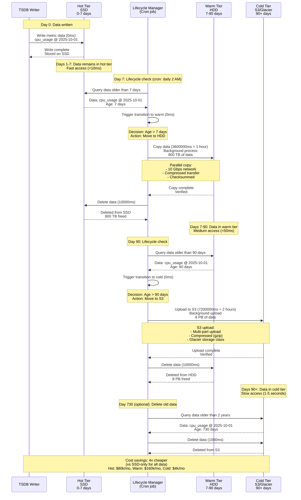

---

## 12. Failure Recovery - Collector Restart

**Flow:**

Shows the failure recovery flow when a Prometheus collector crashes and restarts.

**Steps:**

1. **Collector Crash (0ms)** - Collector process dies (OOM, crash, etc.)
2. **Kubernetes Detects (10000ms)** - Liveness probe fails
3. **Pod Restart (30000ms)** - Kubernetes restarts pod
4. **Service Discovery (5000ms)** - New collector fetches endpoint list
5. **Resume Scraping (36000ms)** - Resume scraping from last checkpoint
6. **Gap Detection (40000ms)** - Detect missing data for 36-second window
7. **Alerting (45000ms)** - Alert on collector downtime

**Performance:**

- Detection time: 10 seconds (liveness probe interval)
- Recovery time: 36 seconds (total downtime)
- Data loss: 36 seconds of metrics (acceptable for non-critical)
- Alert threshold: >60 seconds downtime

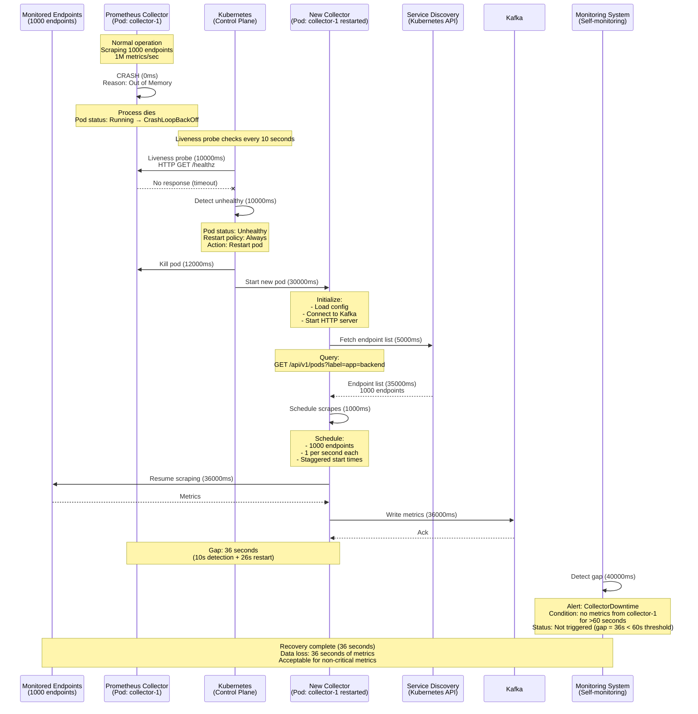