# Recommendation System - High-Level Design

## Table of Contents

1. [System Architecture (Lambda Architecture)](#system-architecture-lambda-architecture)
2. [Real-Time Serving Path](#real-time-serving-path)
3. [Batch Training Pipeline](#batch-training-pipeline)
4. [Feature Store Architecture](#feature-store-architecture)
5. [Model Serving Infrastructure](#model-serving-infrastructure)
6. [Candidate Generation Strategy](#candidate-generation-strategy)
7. [Item-to-Item Similarity (FAISS/ANN)](#item-to-item-similarity-faiss-ann)
8. [Redis Feature Store Sharding](#redis-feature-store-sharding)
9. [Multi-Region Deployment](#multi-region-deployment)
10. [Pre-Computed Recommendations Cache](#pre-computed-recommendations-cache)
11. [A/B Testing Infrastructure](#ab-testing-infrastructure)
12. [Cold Start Handling](#cold-start-handling)
13. [Model Training DAG (Airflow)](#model-training-dag-airflow)
14. [Monitoring and Alerting Dashboard](#monitoring-and-alerting-dashboard)

---

## System Architecture (Lambda Architecture)

**Flow Explanation:**

This diagram shows the complete Lambda Architecture with two independent processing paths:

**Batch Layer (Slow Path):**

1. Historical clickstream data (5B events/day) stored in Cassandra/ClickHouse
2. Daily Spark jobs process petabytes of data to train ML models
3. Trained models stored in Model Store (S3/MLflow)
4. Takes 20 hours to complete

**Speed Layer (Fast Path):**

1. Real-time events ingested via Kafka (100k events/sec)
2. Kafka Streams computes real-time features (last 5 views, last action timestamp)
3. Features stored in Redis for <5ms lookups
4. Updates continuously in real-time

**Serving Layer:**

- Fetches features from Redis (fast path)
- Loads model from Model Store (slow path)
- Combines both to generate recommendations in <50ms

**Benefits:**

- High accuracy (trained on full historical data)
- Low latency (real-time features available instantly)
- Scalable (batch and stream layers scale independently)

**Trade-offs:**

- Complex (two separate pipelines to maintain)
- Model freshness lag (24h for batch retrain)

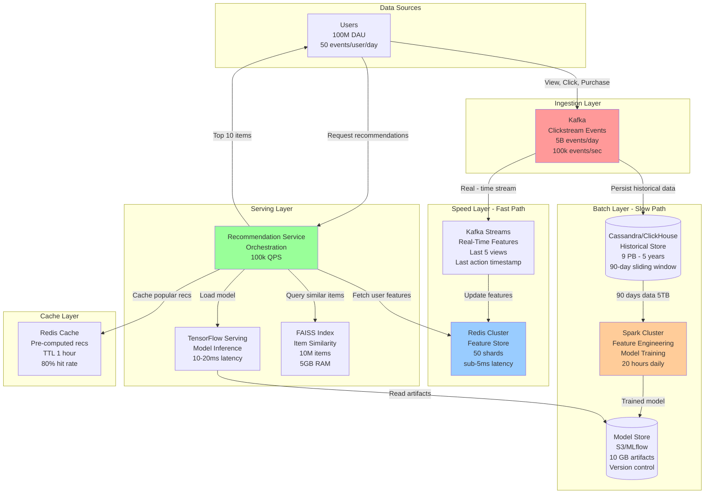

---

## Real-Time Serving Path

**Flow Explanation:**

This diagram shows the critical serving path that must complete in <50ms:

**Steps:**

1. **Client Request** (0ms): User requests recommendations (user_id, context)
2. **Cache Check** (2ms): Check Redis for pre-computed recommendations (80% hit rate)
3. **Parallel Feature Fetch** (5ms): Fetch user features + query FAISS for candidates
    - User features: Redis lookup (2ms)
    - Item candidates: FAISS ANN search (5ms)
4. **Model Inference** (20ms): TensorFlow Serving scores all candidates
5. **Ranking & Filtering** (3ms): Apply business rules, diversify, re-rank
6. **Response** (30ms total): Return top 10 recommendations

**Performance:**

- P50 latency: 25ms (cache hits)
- P99 latency: 45ms (cache misses + full inference)
- Throughput: 100k QPS (horizontally scaled)

**Benefits:**

- Meets <50ms SLA
- Cache dramatically reduces load (80% of requests skip inference)
- Parallel calls minimize sequential latency

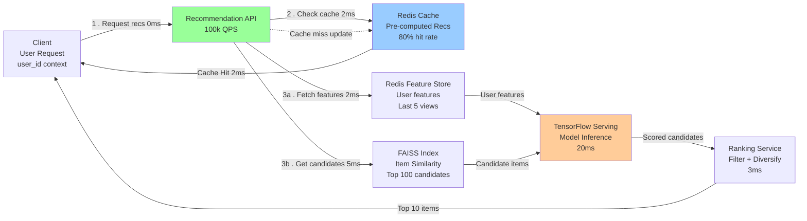

---

## Batch Training Pipeline

**Flow Explanation:**

This diagram shows the daily batch training pipeline (20-hour cycle):

**Phase 1: Data Extraction** (4 hours)

1. Read 90 days of clickstream data from Cassandra (5 TB)
2. Filter bots, outliers, and noise
3. Output: Clean Parquet files in S3

**Phase 2: Feature Engineering** (6 hours)

1. Compute user features (total purchases, avg session length, preferred categories)
2. Compute item features (popularity, engagement rate, category distribution)
3. Output: Feature tables (Parquet in S3)

**Phase 3: Model Training** (10 hours)

1. **Collaborative Filtering:** ALS (Alternating Least Squares) on user-item matrix
2. **Deep Learning:** Two-tower neural network (user tower + item tower)
3. Output: Model artifacts (10 GB)

**Phase 4: Model Deployment** (1 hour)

1. Save to Model Store (S3/MLflow)
2. Gradual rollout (10% → 50% → 100% traffic)
3. Monitor A/B test metrics (CTR, conversion rate)

**Performance:**

- Total time: 21 hours (3-hour buffer before next cycle)
- Training data: 5 TB (90 days × 5 GB/day)
- Model size: 10 GB (compressed embeddings)

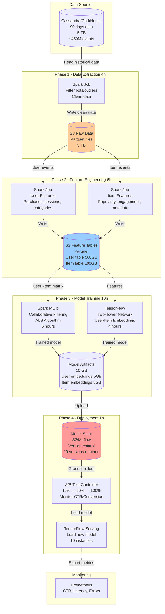

---

## Feature Store Architecture

**Flow Explanation:**

The Feature Store bridges the batch and speed layers, providing two types of features:

**Real-Time Features (Redis):**

- Updated continuously from Kafka stream
- Sub-5ms lookup latency
- Examples: last 5 viewed items, last action timestamp, current session duration
- TTL: 7 days (auto-expire old data)

**Batch Features (S3):**

- Computed daily from historical data
- Loaded into Redis periodically (every 1 hour)
- Examples: user embeddings, lifetime purchase count, preferred categories
- Size: 600 GB (100M users × 6 KB/user)

**Access Pattern:**

1. Recommendation Service requests features for `user_id`
2. Fetch from Redis (combines real-time + batch features in single key)
3. If cache miss: Fall back to S3 (slow path, rare)

**Performance:**

- Read latency: <2ms (Redis)
- Write throughput: 100k events/sec (Kafka Streams)
- Storage: 1 TB total (Redis + S3 snapshots)

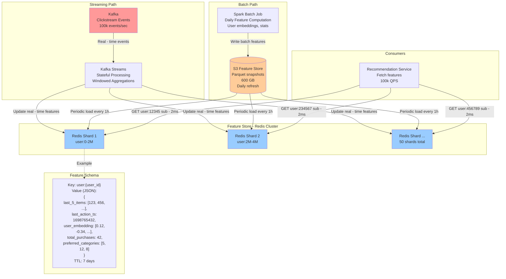

---

## Model Serving Infrastructure

**Flow Explanation:**

This diagram shows how trained models are served at scale:

**Components:**

1. **Model Store (S3/MLflow):** Centralized storage for all model versions
2. **TensorFlow Serving:** Stateless inference servers (10+ instances)
3. **Load Balancer:** Distributes inference requests across instances
4. **Model Registry:** Tracks model versions, A/B test assignments, performance metrics

**Model Loading:**

- Each TensorFlow Serving instance loads model into RAM (10 GB)
- Models are versioned (e.g., v42, v43)
- Gradual rollout: 10% of traffic tests new model before full rollout

**Inference Flow:**

1. Recommendation Service sends gRPC request with user/item features
2. Load balancer routes to available TensorFlow Serving instance
3. Model computes scores for all candidate items (batch inference)
4. Returns top-N scored items

**Performance:**

- Inference latency: 10-20ms per request
- Throughput: 10k QPS per instance (100k total with 10 instances)
- GPU acceleration: Optional (4x faster but 10x more expensive)

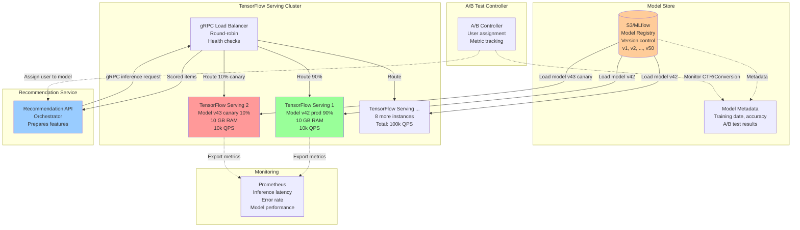

---

## Candidate Generation Strategy

**Flow Explanation:**

This diagram shows how the system generates candidate items using multiple strategies:

**4 Parallel Strategies:**

1. **Collaborative Filtering** (50 candidates, 20ms):
    - "Users who liked items similar to yours also liked..."
    - Uses ALS-trained embeddings
    - High relevance but prone to filter bubble

2. **Content-Based** (30 candidates, 5ms):
    - Items similar to user's past interactions (based on metadata)
    - Uses TF-IDF or BERT embeddings
    - Good for new items (cold start)

3. **Item-to-Item Similarity** (50 candidates, 5ms):
    - Items similar to currently viewed item
    - Uses FAISS ANN search
    - Effective for browse/discovery

4. **Trending/Popular** (20 candidates, 2ms):
    - Globally trending items in user's preferred categories
    - Pre-computed daily
    - Ensures exploration

**Blending:**

- Total: ~150 candidates
- Model scores all candidates
- Re-rank and diversify
- Return top 10

**Benefits:**

- Multi-strategy prevents filter bubble
- Parallel execution minimizes latency (20ms = max of all strategies)
- Redundancy improves robustness

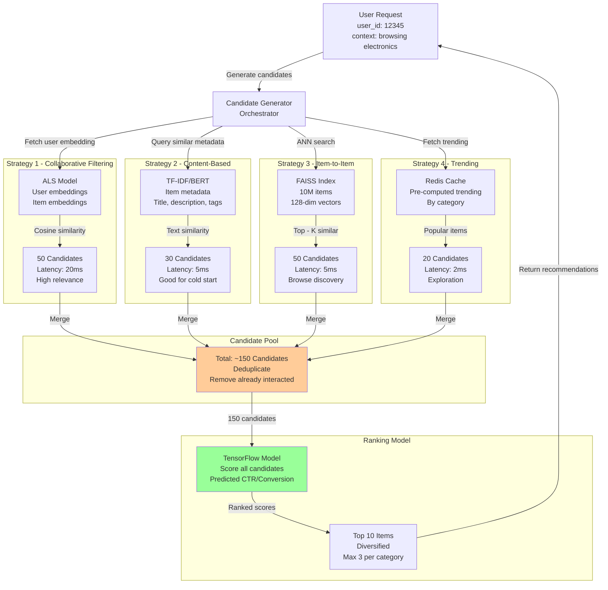

---

## Item-to-Item Similarity (FAISS/ANN)

**Flow Explanation:**

This diagram shows how item-to-item similarity search works using FAISS:

**Index Building (Offline, once per day):**

1. Extract item embeddings from trained model (10M items × 128 dims)
2. Build FAISS index using HNSW algorithm
3. Load index into RAM (5 GB)

**Query Flow (Online, <5ms):**

1. User views item `item_id=42`
2. Fetch item embedding from FAISS index (128-dim vector)
3. Run ANN search to find top-50 similar items (cosine distance)
4. Return similar item IDs

**HNSW Algorithm:**

- Hierarchical graph structure (multi-layer skip list)
- Trade-off: 95% recall (acceptable) for 10x speedup
- Exact K-NN would take 100ms+ for 10M items

**Performance:**

- Query latency: <5ms per lookup
- Index size: 5 GB (fits in RAM)
- Throughput: 100k QPS (horizontally scaled)

**Partitioning:**

- Split by category (electronics, fashion, books)
- Each partition: 1M items, 500 MB
- Reduces search space for faster queries

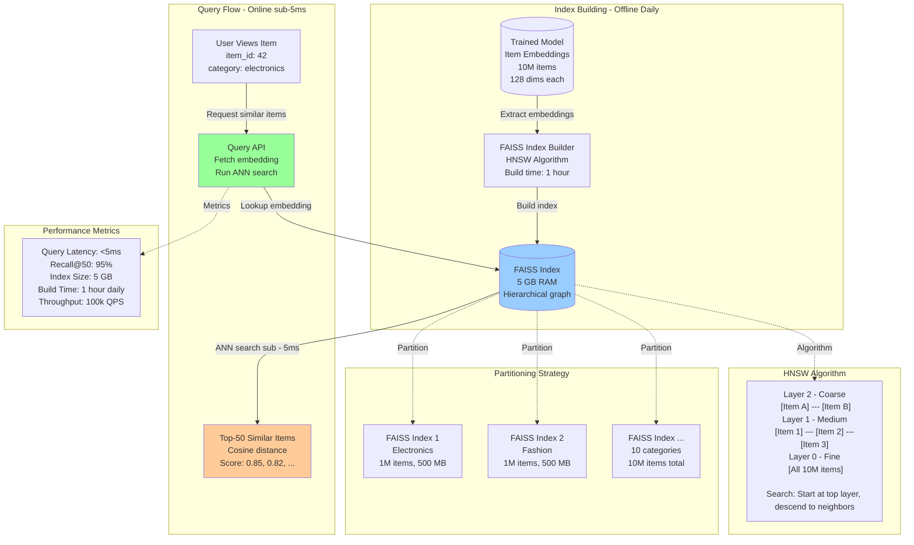

---

## Redis Feature Store Sharding

**Flow Explanation:**

This diagram shows how the Redis Feature Store is sharded for horizontal scalability:

**Sharding Strategy:**

- **Key:** `user:{user_id}` (e.g., `user:12345`)
- **Hash Function:** CRC32(user_id) % 50 = shard_id
- **50 Shards:** Each shard handles ~2M users (100M users / 50)

**Per-Shard Architecture:**

- **1 Master:** Handles all writes (real-time feature updates)
- **2 Replicas:** Handle reads (recommendation serving)
- **Async Replication:** Master → Replicas (eventual consistency acceptable)

**Throughput:**

- Writes: 100k events/sec / 50 shards = 2k writes/sec per shard
- Reads: 1.1M lookups/sec / 50 shards = 22k reads/sec per shard
- Per-shard capacity: 25k ops/sec (within Redis limit)

**Failover:**

- If master fails, promote replica to master (Redis Sentinel)
- Downtime: <5 seconds
- Data loss: Minimal (replication lag <100ms)

**Benefits:**

- Horizontal scalability (add more shards as users grow)
- Read scaling (2 replicas per master = 3x read capacity)
- High availability (automatic failover)

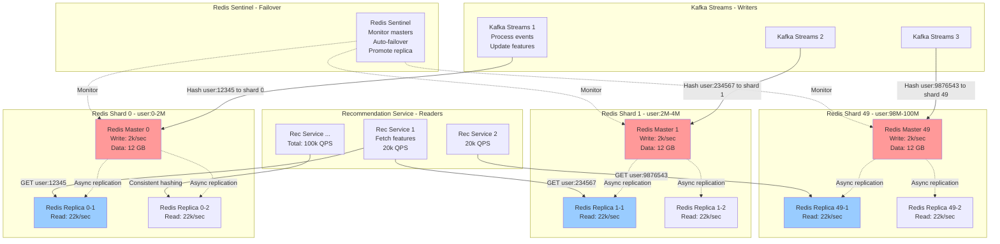

---

## Multi-Region Deployment

**Flow Explanation:**

This diagram shows the global deployment across 3 regions for low latency:

**Regions:**

1. **US-East-1** (Primary): Batch training, model store, full feature store
2. **EU-West-1** (Secondary): Read replicas, cached recommendations
3. **AP-South-1** (Secondary): Read replicas, cached recommendations

**Data Replication:**

- **Kafka:** Multi-region replication (MirrorMaker2) for clickstream events
- **Redis:** Cross-region async replication for feature store
- **Model Store (S3):** Replicated to all regions for low-latency model loading

**Request Routing:**

- **GeoDNS:** Routes users to nearest region
- **All writes:** Routed to US-East-1 (primary)
- **Reads:** Served locally in each region

**Trade-offs:**

- Write latency: Higher for EU/AP users (cross-region network)
- Read latency: Low for all users (local cache)
- Consistency: Eventual (replication lag <1 second)

**Failover:**

- If primary region fails, promote EU-West-1 to primary
- Downtime: <1 minute
- Data loss: Minimal (Kafka replication lag <1 second)

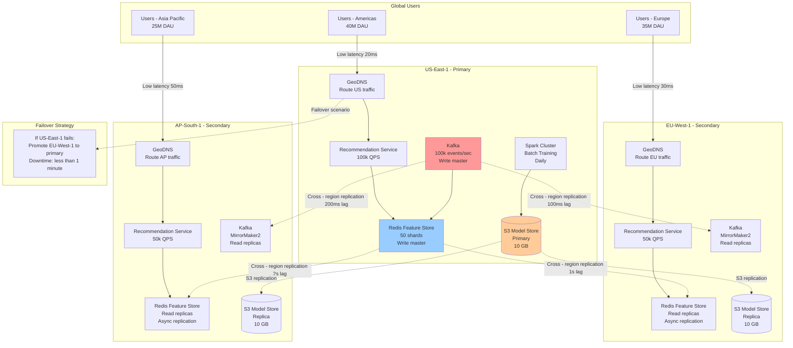

---

## Pre-Computed Recommendations Cache

**Flow Explanation:**

This diagram shows the caching strategy for pre-computed recommendations:

**Cache Workflow:**

**Batch Pre-Computation (Every 1 hour):**

1. Background job computes recommendations for all users
2. Stores top 10 recommendations in Redis cache
3. TTL: 1 hour (refreshes every hour)

**Serving:**

1. User requests recommendations
2. Check cache first (key: `recs:{user_id}`)
3. **Cache Hit (80% of requests):** Return instantly (<2ms)
4. **Cache Miss (20%):** Compute in real-time (30ms)

**Cache Segmentation:**

- **VIP Users (10M users, 10%):** Always cached (updated every 10 minutes)
- **Active Users (40M users, 40%):** Cached during peak hours
- **Inactive Users (50M users, 50%):** Not cached (low request rate)

**Benefits:**

- **80% cache hit rate** reduces load on model serving by 5x
- **<2ms latency** for cache hits (vs 30ms for cold path)
- **Cost savings:** Avoid expensive model inference for most requests

**Storage:**

- 50M cached users × 10 items/user × 100 bytes/item = 50 GB
- Redis cluster: 10 shards × 5 GB/shard

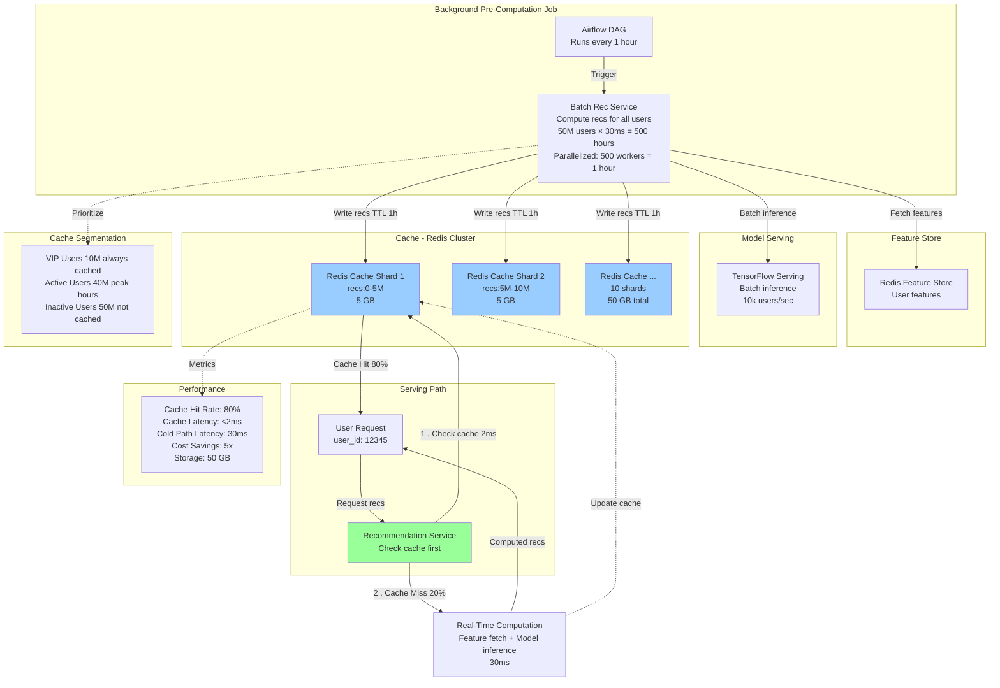

---

## A/B Testing Infrastructure

**Flow Explanation:**

This diagram shows the A/B testing infrastructure for model experiments:

**Experiment Flow:**

1. **User Request:** User hits Recommendation Service
2. **Experiment Assignment:** A/B controller assigns user to experiment group
    - Control Group (90%): Model v42 (current production)
    - Treatment Group (10%): Model v43 (new candidate)
3. **Feature Fetch + Model Inference:** Based on group assignment
4. **Metric Tracking:** Log experiment ID, user ID, recommendations served, user actions

**Metric Collection:**

- **Impressions:** Recommendations shown to user
- **Clicks:** User clicked on recommendation
- **Conversions:** User purchased/engaged with recommended item
- **Latency:** Time to serve recommendations

**Analysis:**

- Compare CTR (Click-Through Rate) between control and treatment
- Statistical significance test (p-value < 0.05)
- If treatment wins, promote to production (gradual rollout)

**Benefits:**

- Safe model deployment (catch regressions early)
- Data-driven decisions (measure actual user impact)
- Parallel experiments (test multiple models simultaneously)

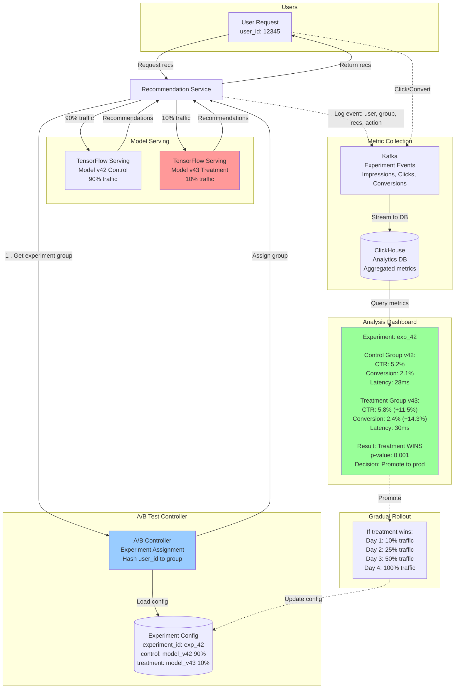

---

## Cold Start Handling

**Flow Explanation:**

This diagram shows how the system handles cold start for new users and new items:

**New User Cold Start:**

1. **Onboarding:** Explicit preference collection during signup (select interests)
2. **Default Recommendations:** Serve globally popular items in selected categories
3. **Aggressive Exploration:** Show diverse content (10 categories) to learn preferences fast
4. **Fast Learning:** After 10 interactions, switch to personalized recommendations

**New Item Cold Start:**

1. **Content-Based Features:** Use item metadata (title, description, category) for similarity
2. **Editorial Curation:** Manual picks for high-quality new items
3. **Exploration Budget:** Show new items to 5% of users, monitor engagement
4. **Bootstrapping:** If engagement > threshold, promote to wider audience

**Hybrid Approach:**

- First 7 days: 70% exploration (diverse content) + 30% exploitation (popular items)
- After 7 days: 30% exploration + 70% personalized

**Benefits:**

- Prevents poor experience for new users (avoid "empty feed")
- Gives new items visibility (avoid "rich get richer")
- Fast learning (10 interactions sufficient for basic personalization)

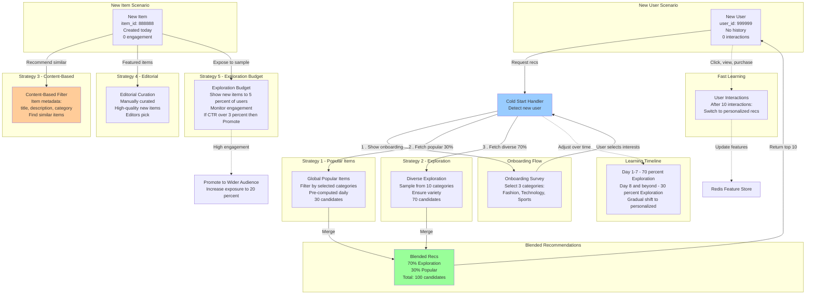

---

## Model Training DAG (Airflow)

**Flow Explanation:**

This diagram shows the Airflow DAG (Directed Acyclic Graph) for daily model training:

**DAG Structure (21-hour pipeline):**

**Phase 1: Data Extraction (4 hours)**

- Task 1: Read clickstream data from Cassandra (90 days, 5 TB)
- Task 2: Filter bots and outliers
- Task 3: Write clean data to S3 (Parquet)

**Phase 2: Feature Engineering (6 hours, parallel)**

- Task 4a: Compute user features (Spark job)
- Task 4b: Compute item features (Spark job)
- Task 5: Merge features and write to S3

**Phase 3: Model Training (10 hours, parallel)**

- Task 6a: Train collaborative filtering model (ALS, Spark MLlib, 6 hours)
- Task 6b: Train deep learning model (TensorFlow, 4 hours)
- Task 7: Combine models and save artifacts

**Phase 4: Model Deployment (1 hour, sequential)**

- Task 8: Upload model to Model Store (S3/MLflow)
- Task 9: Run A/B test on 10% traffic
- Task 10: Monitor metrics for 30 minutes
- Task 11: Gradual rollout to 100% (if metrics pass)

**Scheduling:**

- Runs daily at 2 AM UTC
- SLA: Must complete within 24 hours
- Retry: Up to 3 retries per task on failure
- Alerts: Email/Slack on task failure

**Benefits:**

- Fully automated pipeline
- Clear dependencies (tasks run in correct order)
- Fault tolerance (retries on failure)
- Observability (DAG visualization, logs, metrics)

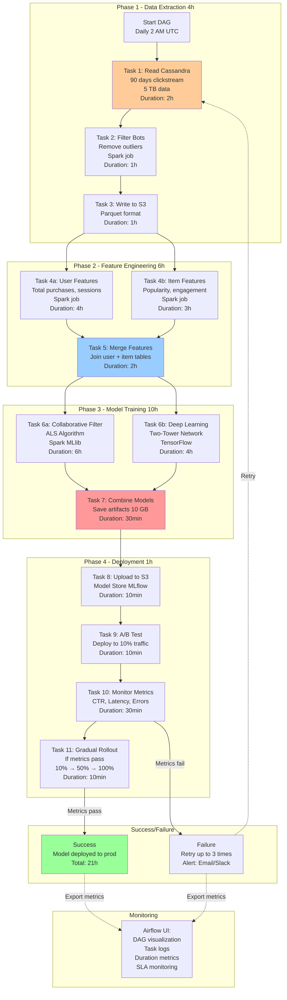

---

## Monitoring and Alerting Dashboard

**Flow Explanation:**

This diagram shows the comprehensive monitoring and alerting infrastructure:

**Key Metrics Monitored:**

**1. Serving Latency:**

- P50, P95, P99 latency for recommendation requests
- Target: P99 < 50ms
- Alert: P99 > 100ms

**2. Cache Hit Rate:**

- Percentage of requests served from cache
- Target: > 80%
- Alert: < 70%

**3. Model Performance:**

- CTR (Click-Through Rate): Target 5-10%
- Conversion Rate: Target 2-5%
- Alert: CTR < 3% (model degradation)

**4. Feature Store Performance:**

- Redis latency: Target < 5ms
- Redis QPS: Target 1.1M
- Alert: Latency > 10ms

**5. Batch Training Status:**

- Training duration: Target < 20 hours
- Training success rate: Target 100%
- Alert: Duration > 24 hours or failure

**Alerting Channels:**

- PagerDuty (critical alerts, on-call rotation)
- Slack (warning alerts, team channel)
- Email (daily summary reports)

**Dashboard Tools:**

- Grafana (real-time metrics visualization)
- Kibana (log analysis)
- Custom dashboard (business metrics: CTR, revenue impact)

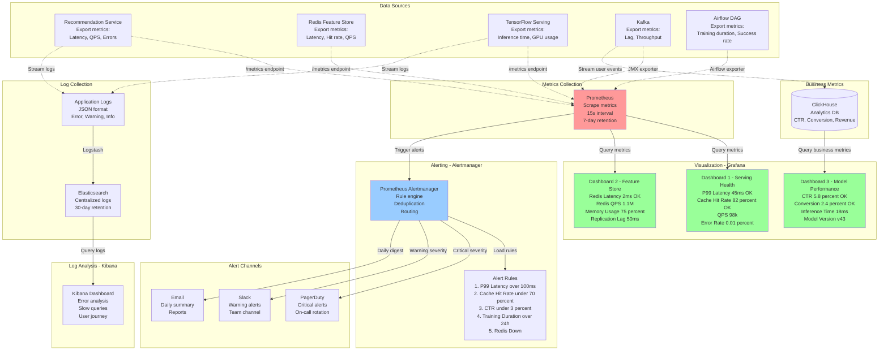