# Recommendation System - Sequence Diagrams

## Table of Contents

1. [Real-Time Recommendation Serving (Cache Hit)](#real-time-recommendation-serving-cache-hit)
2. [Real-Time Recommendation Serving (Cache Miss)](#real-time-recommendation-serving-cache-miss)
3. [Clickstream Event Ingestion](#clickstream-event-ingestion)
4. [Feature Store Update (Real-Time)](#feature-store-update-real-time)
5. [Model Training Pipeline (Batch)](#model-training-pipeline-batch)
6. [Model Deployment and A/B Test](#model-deployment-and-ab-test)
7. [Item-to-Item Similarity Search (FAISS)](#item-to-item-similarity-search-faiss)
8. [Multi-Strategy Candidate Generation](#multi-strategy-candidate-generation)
9. [Cold Start - New User](#cold-start---new-user)
10. [Cold Start - New Item](#cold-start---new-item)
11. [Feature Store Failover (Redis Master Down)](#feature-store-failover-redis-master-down)
12. [Model Serving Failure Fallback](#model-serving-failure-fallback)

---

## Real-Time Recommendation Serving (Cache Hit)

**Flow:**

This sequence shows the happy path where recommendations are served from cache (80% of requests).

**Steps:**

1. **Client Request** (0ms): User requests recommendations via mobile/web app
2. **API Gateway** (5ms): JWT validation, rate limit check
3. **Recommendation Service** (2ms): Check Redis cache for pre-computed recommendations
4. **Cache Hit** (2ms): Retrieve top 10 recommendations from Redis
5. **Response** (10ms total): Return recommendations to client

**Performance:**

- Total latency: ~10ms (within 50ms SLA)
- Cache hit rate: 80%
- No model inference needed (cost savings)

**Benefits:**

- Ultra-low latency for majority of requests
- Reduces load on model serving by 5x
- Scalable (Redis handles 1M+ QPS)

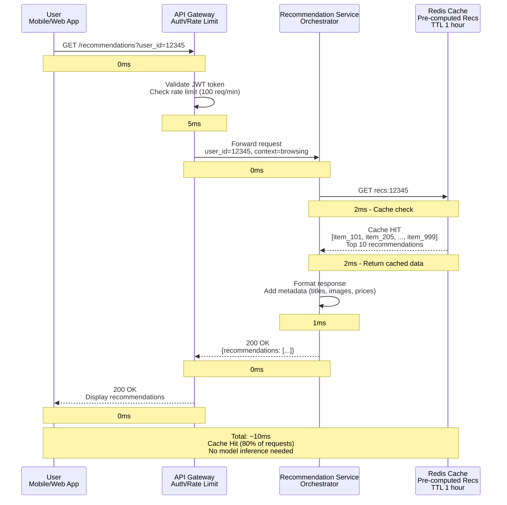

---

## Real-Time Recommendation Serving (Cache Miss)

**Flow:**

This sequence shows the cold path where recommendations must be computed in real-time (20% of requests).

**Steps:**

1. **Client Request** (0ms): User requests recommendations
2. **API Gateway** (5ms): Validation
3. **Cache Miss** (2ms): Recommendations not in cache
4. **Parallel Feature Fetch** (5ms):
    - Fetch user features from Redis Feature Store (2ms)
    - Query FAISS for item-to-item candidates (5ms)
5. **Model Inference** (20ms): TensorFlow Serving scores all candidates
6. **Ranking** (3ms): Apply business rules, diversify, re-rank
7. **Update Cache** (async): Store result in cache for future requests
8. **Response** (35ms total): Return top 10 recommendations

**Performance:**

- Total latency: ~35ms (still within 50ms SLA)
- Parallel feature fetch minimizes sequential latency
- Cache update ensures next request is fast

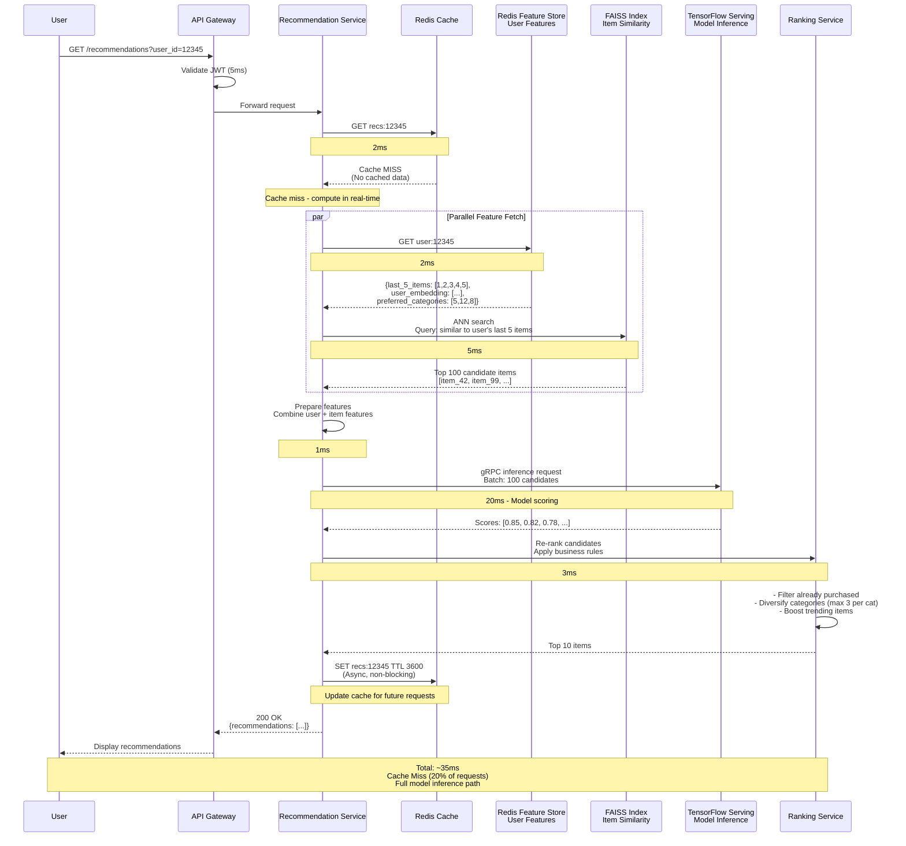

---

## Clickstream Event Ingestion

**Flow:**

This sequence shows how user events (views, clicks, purchases) are captured and ingested into the system.

**Steps:**

1. **User Action** (0ms): User views/clicks/purchases an item
2. **Client SDK** (5ms): Track event, batch locally (reduce network calls)
3. **Event Collector** (10ms): Validate event schema, enrich with metadata
4. **Kafka** (5ms): Write event to topic `clickstream.events` (partition by user_id)
5. **Kafka Consumers** (async):
    - Real-time feature computation (Kafka Streams)
    - Historical storage (Cassandra/ClickHouse)
    - Analytics dashboard (Real-time metrics)

**Performance:**

- Client latency: <20ms (non-blocking, async)
- Kafka throughput: 100k events/sec
- Event durability: Replicated 3x (no data loss)

**Benefits:**

- Decoupled ingestion (client doesn't wait for processing)
- Scalable (Kafka partitions distribute load)
- Multiple consumers (fan-out pattern)

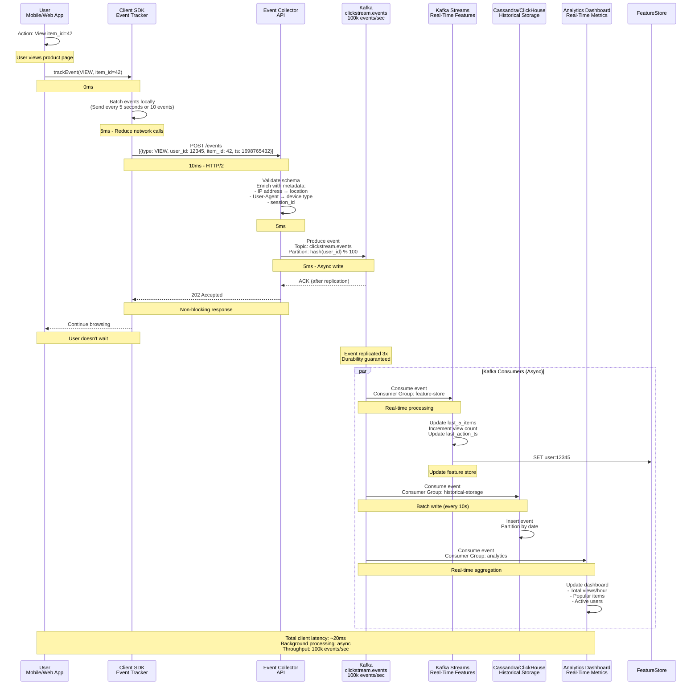

---

## Feature Store Update (Real-Time)

**Flow:**

This sequence shows how real-time features are computed and updated in Redis from the Kafka stream.

**Steps:**

1. **Kafka Event** (0ms): Clickstream event arrives in Kafka topic
2. **Kafka Streams** (5ms): Stateful stream processing
    - Maintain windowed aggregations (last 5 viewed items, last action timestamp)
    - Group by user_id
    - Output update command
3. **Redis Update** (2ms): Atomic update of user features
    - Use ZADD for sorted sets (last 5 items)
    - Use SET for simple values (last action timestamp)
    - TTL: 7 days (auto-expire inactive users)
4. **Confirmation** (0ms): ACK back to Kafka Streams

**Performance:**

- End-to-end latency: <10ms (event → feature store)
- Throughput: 100k events/sec
- Exactly-once semantics (Kafka Streams)

**Trade-offs:**

- Eventual consistency (slight lag between event and feature update)
- Memory overhead (stateful processing)

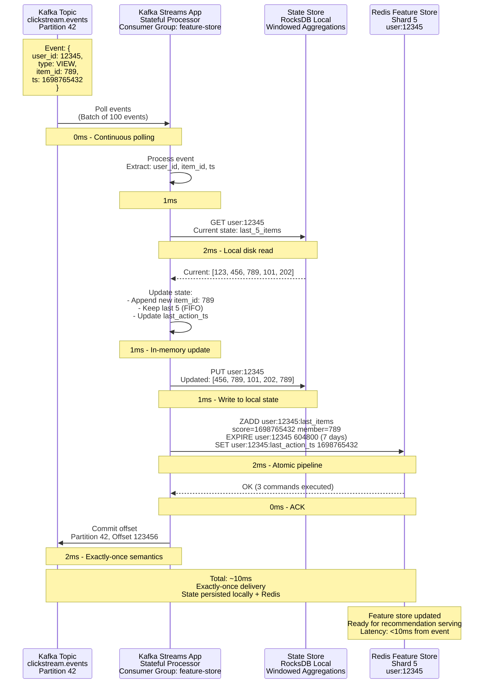

---

## Model Training Pipeline (Batch)

**Flow:**

This sequence shows the end-to-end batch training pipeline that runs daily.

**Steps:**

1. **Airflow Scheduler** (0ms): Trigger DAG at 2 AM UTC
2. **Data Extraction** (4 hours):
    - Read 90 days of clickstream data from Cassandra (5 TB)
    - Filter bots, outliers, noise
    - Write clean data to S3 (Parquet)
3. **Feature Engineering** (6 hours):
    - Compute user features (Spark job, 4 hours)
    - Compute item features (Spark job, 3 hours)
    - Merge and write to S3
4. **Model Training** (10 hours):
    - Collaborative filtering (ALS, 6 hours)
    - Deep learning (Two-tower network, 4 hours)
    - Save artifacts (10 GB) to Model Store
5. **Model Deployment** (1 hour):
    - Upload to MLflow
    - A/B test on 10% traffic
    - Monitor metrics (CTR, latency)
    - Gradual rollout to 100%

**Performance:**

- Total duration: 21 hours (3-hour buffer)
- Training data: 5 TB (90 days)
- Model artifacts: 10 GB

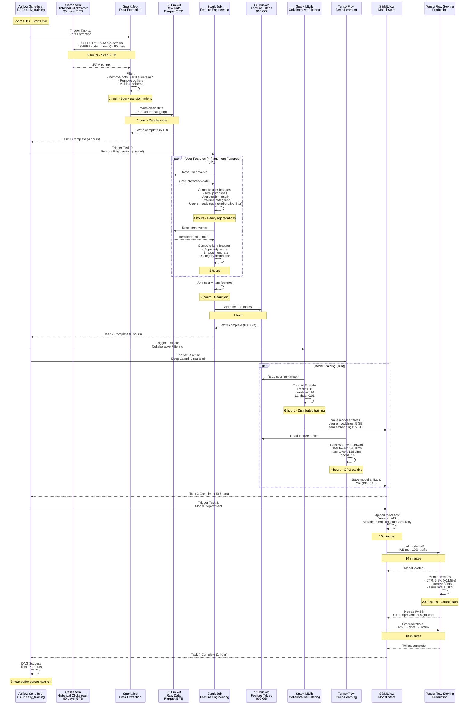

---

## Model Deployment and A/B Test

**Flow:**

This sequence shows how a new model is deployed with A/B testing to validate performance before full rollout.

**Steps:**

1. **Model Store** (0ms): New model v43 is trained and ready
2. **A/B Controller** (1ms): Configure experiment (10% canary traffic)
3. **TensorFlow Serving** (5ms): Load new model alongside old model
4. **Request Routing** (0ms): Route 10% of traffic to new model (hash-based on user_id)
5. **Metric Collection** (30 min): Collect metrics (CTR, latency, errors)
6. **Statistical Analysis** (5 min): Compare control vs treatment
7. **Decision** (0ms): If p-value < 0.05 and CTR improved → Promote
8. **Gradual Rollout** (10 min): 10% → 50% → 100%

**Performance:**

- Deployment time: <1 hour (from training to 100% rollout)
- Safety: Catch regressions before impacting all users
- Data-driven: Statistical significance testing

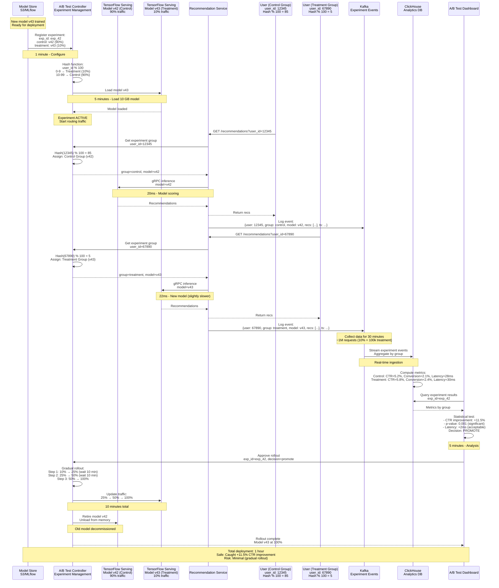

---

## Item-to-Item Similarity Search (FAISS)

**Flow:**

This sequence shows how item-to-item recommendations are generated using FAISS approximate nearest neighbor search.

**Steps:**

1. **User Views Item** (0ms): User lands on product page (item_id=42)
2. **Recommendation Service** (1ms): Request similar items
3. **FAISS Index** (5ms):
    - Fetch item embedding (128-dim vector)
    - Run HNSW algorithm (approximate search)
    - Return top-50 similar items (cosine distance)
4. **Metadata Fetch** (2ms): Fetch item details from PostgreSQL/cache
5. **Response** (10ms total): Return "You May Also Like" recommendations

**Performance:**

- Query latency: <5ms for 10M items
- Accuracy: 95% recall@50 (acceptable trade-off)
- Throughput: 100k QPS (horizontally scaled)

**Trade-offs:**

- Approximate (not exact K-NN) for speed
- Index size: 5 GB RAM (must fit in memory)

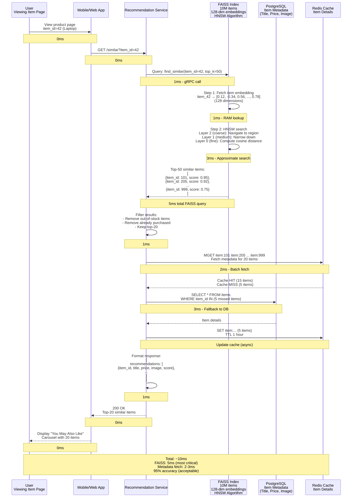

---

## Multi-Strategy Candidate Generation

**Flow:**

This sequence shows how the system generates candidates using 4 parallel strategies and then re-ranks them.

**Steps:**

1. **Request** (0ms): User requests recommendations
2. **Parallel Candidate Generation** (20ms max):
    - Strategy 1: Collaborative Filtering (50 candidates, 20ms)
    - Strategy 2: Content-Based (30 candidates, 5ms)
    - Strategy 3: Item-to-Item (50 candidates, 5ms)
    - Strategy 4: Trending (20 candidates, 2ms)
3. **Merge & Deduplicate** (2ms): Combine all candidates (~150 items)
4. **Model Scoring** (20ms): Score all candidates with ML model
5. **Re-Ranking** (3ms): Apply business rules, diversify categories
6. **Response** (25ms total): Return top 10

**Performance:**

- Parallel execution: 20ms (max of all strategies)
- Total latency: ~25ms (well within 50ms SLA)
- Coverage: Multiple strategies prevent filter bubble

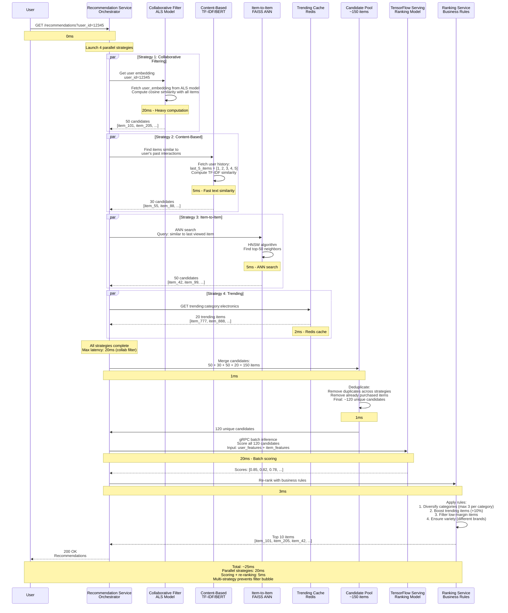

---

## Cold Start - New User

**Flow:**

This sequence shows how the system handles a brand new user with no interaction history.

**Steps:**

1. **New User Signup** (0ms): User creates account
2. **Onboarding Survey** (30s): Explicit preference collection
    - Select 3 categories of interest
    - Rate sample items
3. **Generate Recommendations** (10ms):
    - Serve popular items in selected categories (30%)
    - Serve diverse exploration items (70%)
4. **Fast Learning** (after 10 interactions):
    - Build basic user profile
    - Switch to personalized recommendations

**Performance:**

- Initial recommendations: <10ms (pre-computed popular items)
- Learning speed: 10 interactions for basic personalization
- Exploration: 70% diverse content in first 7 days

**Benefits:**

- Avoid empty feed (poor UX)
- Fast learning (aggressive exploration)
- Explicit signals (onboarding survey)

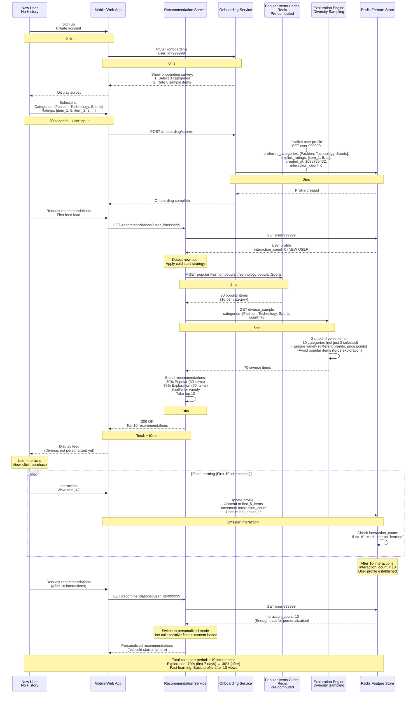

---

## Cold Start - New Item

**Flow:**

This sequence shows how the system handles a newly added item with no engagement history.

**Steps:**

1. **Item Added** (0ms): Merchant uploads new product (item_id=888888)
2. **Metadata Extraction** (5s): Extract features (title, description, category, images)
3. **Content-Based Embedding** (10s): Generate embedding using BERT (text similarity)
4. **Exploration Strategy** (ongoing):
    - Show to 5% of users (random sample)
    - Monitor engagement (CTR, purchases)
    - If CTR > threshold (3%) → Promote to wider audience
5. **Bootstrapping** (24 hours): Collect enough interactions to train embeddings

**Performance:**

- Initial visibility: 5% of users (exploration budget)
- Promotion threshold: CTR > 3% after 1000 impressions
- Full personalization: After 24 hours (next batch training)

**Benefits:**

- New items get visibility (avoid "rich get richer")
- Data-driven promotion (only boost high-quality items)
- Content-based fallback (before collaborative signals available)

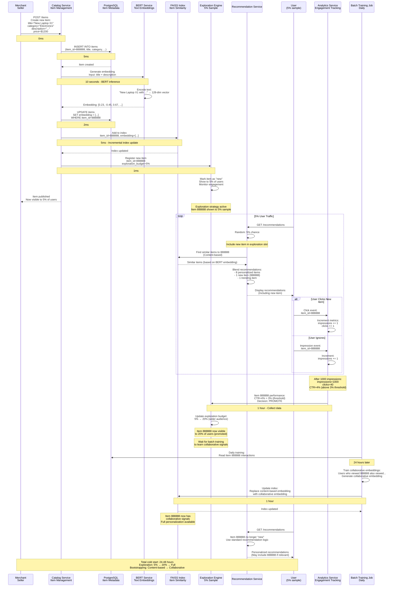

---

## Feature Store Failover (Redis Master Down)

**Flow:**

This sequence shows the failover process when a Redis master shard fails.

**Steps:**

1. **Failure Detection** (5s): Redis Sentinel detects master is down
2. **Leader Election** (3s): Sentinel promotes replica to new master
3. **DNS Update** (2s): Update service discovery (new master endpoint)
4. **Client Reconnect** (1s): Recommendation Service reconnects to new master
5. **Resume Operations** (0s): System back to normal

**Performance:**

- Total downtime: <10 seconds
- Data loss: Minimal (replication lag <100ms)
- Automatic recovery: No manual intervention

**Trade-offs:**

- Eventual consistency (replicas lag behind master by ~100ms)
- Brief unavailability during failover

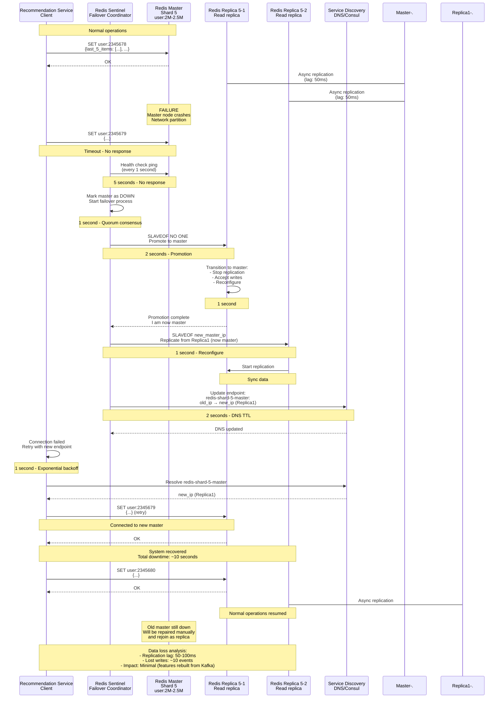

---

## Model Serving Failure Fallback

**Flow:**

This sequence shows the fallback strategy when TensorFlow Serving (model inference) fails.

**Steps:**

1. **Normal Request** (0ms): User requests recommendations
2. **Model Serving Failure** (5s timeout): TensorFlow Serving is down or overloaded
3. **Fallback Strategy** (5ms):
    - Serve pre-computed recommendations from cache
    - If cache miss: Serve popular items (degraded mode)
4. **Alerting** (1s): Notify on-call engineer via PagerDuty
5. **Mitigation** (10 min): Restart TensorFlow Serving or route to backup instance

**Performance:**

- Fallback latency: <5ms (cache-based)
- Availability: 99.99% (graceful degradation)
- Impact: Reduced personalization quality during incident

**Trade-offs:**

- Recommendations are stale (pre-computed)
- No real-time personalization during incident
- But system remains available (better than 500 errors)

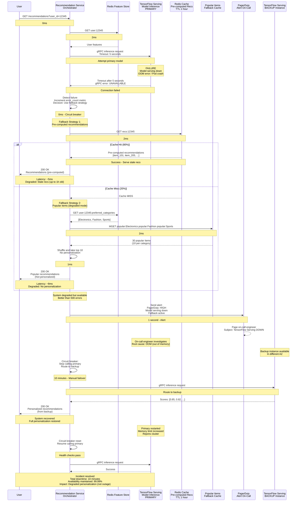