# Stock Brokerage Platform - High-Level Design

## Table of Contents

1. [System Architecture Overview](#system-architecture-overview)
2. [Multi-Level Pub/Sub Architecture](#multi-level-pubsub-architecture)
3. [Real-Time Market Data Flow](#real-time-market-data-flow)
4. [Order Entry and Execution Flow](#order-entry-and-execution-flow)
5. [WebSocket Server Topology](#websocket-server-topology)
6. [Event Sourcing Architecture](#event-sourcing-architecture)
7. [Search and Discovery Flow](#search-and-discovery-flow)
8. [Risk Management System](#risk-management-system)
9. [FIX Protocol Integration](#fix-protocol-integration)
10. [Multi-Region Deployment](#multi-region-deployment)
11. [Audit Logging Architecture](#audit-logging-architecture)
12. [Performance Optimization Pipeline](#performance-optimization-pipeline)
13. [Failure Scenarios and Recovery](#failure-scenarios-and-recovery)
14. [Monitoring and Observability Dashboard](#monitoring-and-observability-dashboard)

---

## System Architecture Overview

**Flow Explanation:**

This diagram shows the complete end-to-end architecture of the stock brokerage platform.

**Key Components:**

1. **Exchange (NSE/BSE):** Source of market data and order execution
2. **Market Data Ingestor:** Receives FIX protocol messages (100k updates/sec)
3. **Redis Quote Cache:** In-memory storage for latest quotes (<1ms reads)
4. **Kafka Message Bus:** Distributes data to 1,000 WebSocket servers
5. **WebSocket Broadcast Layer:** Pushes updates to 10M concurrent users
6. **Order Entry Gateway:** Validates and routes orders via FIX protocol
7. **PostgreSQL Ledger:** ACID-compliant storage for balances and holdings
8. **Elasticsearch:** Fast ticker search (<50ms)

**Performance:**

- Ingestion latency: <10ms
- Quote distribution: <100ms end-to-end
- Order execution: <1 second
- Search queries: <50ms

**Benefits:**

- Scalable: Handles 10M users, 200M WebSocket streams
- Low latency: <200ms quote updates
- Strong consistency: ACID transactions for financial data
- High availability: Multi-region, fault-tolerant

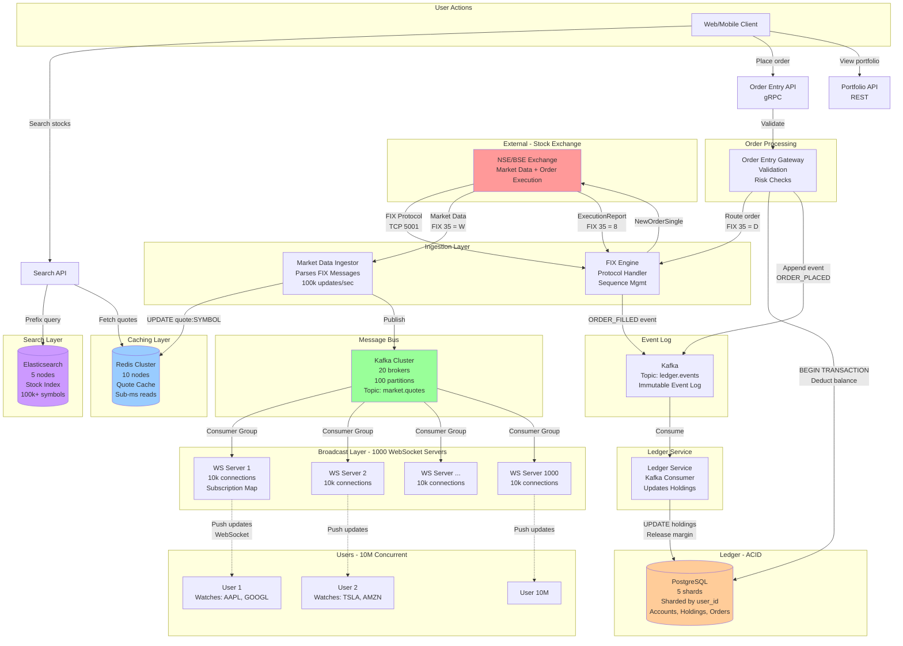

---

## Multi-Level Pub/Sub Architecture

**Flow Explanation:**

This diagram illustrates the solution to the broadcast fanout problem (100k updates/sec → 200M WebSocket streams).

**Problem:**

- Naive approach: Each update triggers 2,000 user notifications (if 2,000 users watch each stock)
- Total: 100k × 2,000 = **200M messages/sec** (impossible for single server)

**Solution: Three-Level Hierarchy**

**Level 1: Centralized Ingestion (1 node)**

- Market Data Ingestor receives all 100k updates/sec
- Publishes to Kafka (partitioned by symbol)

**Level 2: Kafka Distribution (100 partitions)**

- Kafka distributes load across 1,000 WebSocket servers
- Each server consumes from 1 partition (~1,000 symbols)

**Level 3: Selective Fanout (1,000 servers)**

- Each WebSocket server maintains in-memory subscription map
- Pushes updates ONLY to subscribed users on that server
- Per-server fanout: 100 updates/sec × 2,000 users = 200k msg/sec (manageable)

**Performance:**

- Ingestion: <10ms
- Kafka propagation: <20ms
- WebSocket push: <50ms
- **End-to-end: <100ms** (within 200ms SLA)

**Benefits:**

- Scalable: Add more WebSocket servers horizontally
- Efficient: No wasted bandwidth (push only subscribed symbols)
- Fault-tolerant: Kafka consumer groups handle server failures

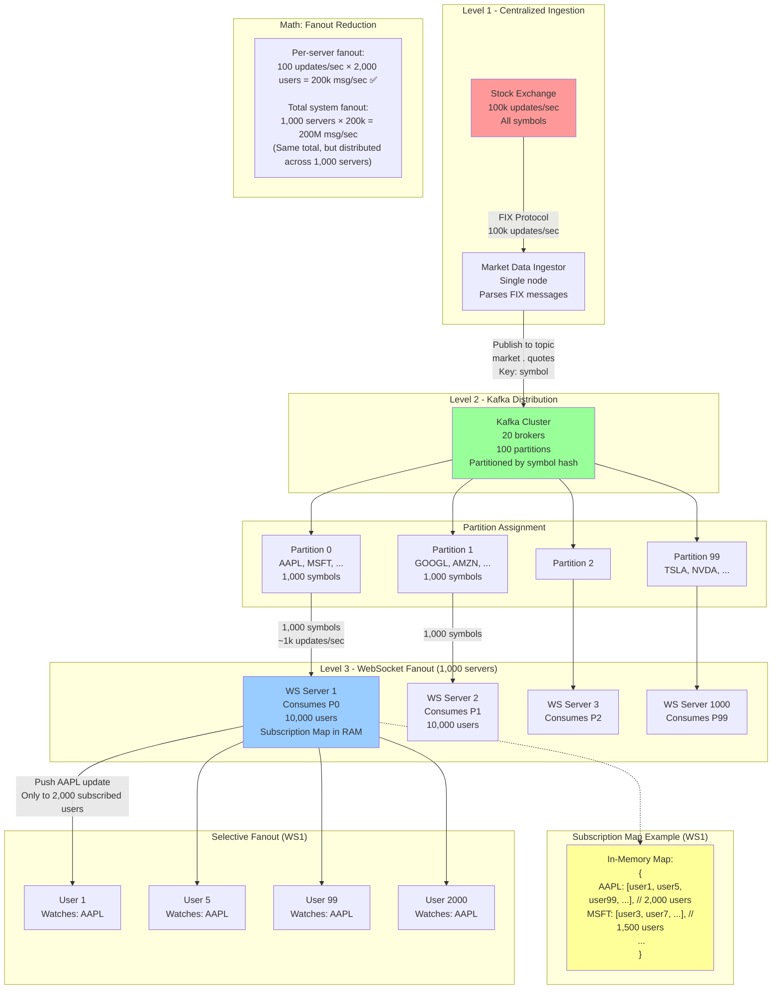

---

## Real-Time Market Data Flow

**Flow Explanation:**

This diagram shows the complete journey of a stock quote from the exchange to the user's screen.

**Steps:**

1. **Exchange publishes quote** (t=0ms): RELIANCE LTP=2450.75
2. **FIX message received** (t=5ms): Market Data Ingestor parses FIX 35=W
3. **Redis update** (t=10ms): SET quote:RELIANCE {"ltp": 2450.75, "bid": 2450.50, "ask": 2451.00}
4. **Kafka publish** (t=15ms): Produce to partition 42 (symbol hash)
5. **WebSocket consume** (t=35ms): WS Server 42 receives message
6. **Lookup subscribers** (t=38ms): subscriptionMap["RELIANCE"] → [user123, user456, ...]
7. **Push to users** (t=50ms): Send JSON message to 2,000 WebSocket connections
8. **User receives** (t=80ms): Client updates UI with new price

**Latency Breakdown:**

- Exchange → Ingestor: 5ms (network)
- Ingestor → Redis: 5ms (write)
- Ingestor → Kafka: 5ms (produce)
- Kafka → WebSocket: 20ms (consumer lag)
- WebSocket → User: 15ms (push)
- User network: 30ms (4G/WiFi)
- **Total: ~80ms** (well within 200ms SLA)

**Benefits:**

- Low latency: <100ms end-to-end
- Fault-tolerant: Kafka retains messages for replay
- Scalable: Add more WebSocket servers

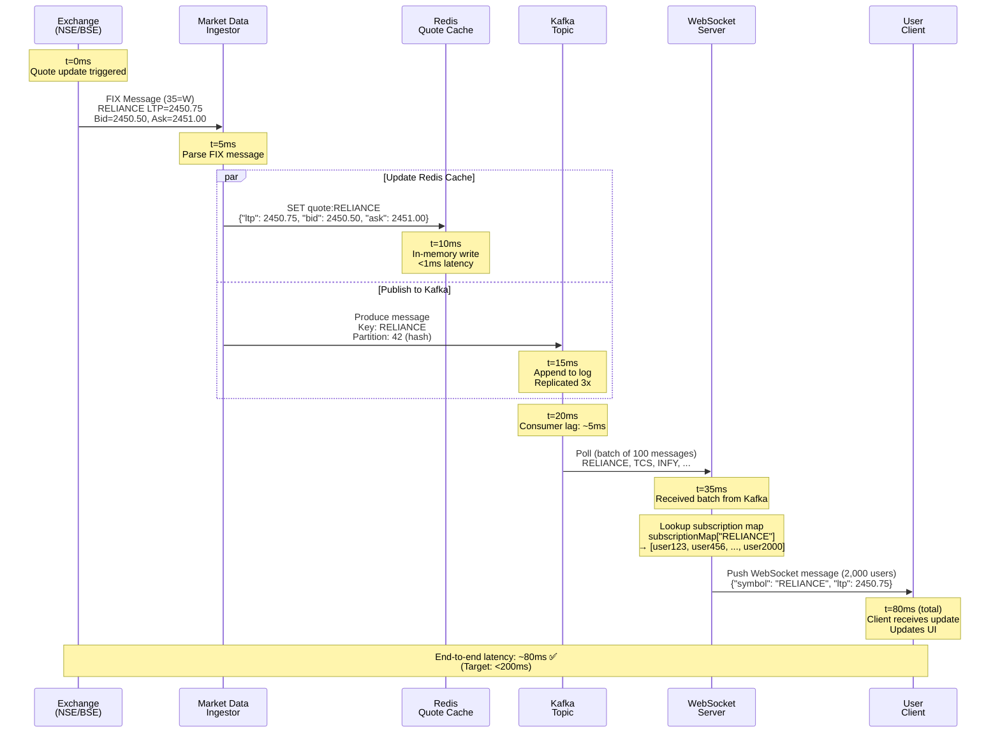

---

## Order Entry and Execution Flow

**Flow Explanation:**

This diagram shows the complete flow of placing a stock order, from user click to ledger update.

**Steps:**

1. **User places order** (t=0ms): Buy 100 RELIANCE @ 2450
2. **API validation** (t=50ms): Check balance, risk limits, market hours
3. **ACID transaction** (t=150ms): Lock account, deduct balance, insert order
4. **FIX order routing** (t=200ms): Send NewOrderSingle to exchange
5. **Exchange matching** (t=205ms): Match with sell order (see 3.4.1 Stock Exchange)
6. **ExecutionReport** (t=210ms): FIX 35=8 (Order Filled)
7. **Kafka event** (t=220ms): Publish ORDER_FILLED event
8. **Ledger update** (t=10s, async): Update holdings, release margin
9. **User notification** (t=250ms): WebSocket push "Order filled"

**Latency:**

- User → Order filled notification: ~250ms
- User → Ledger updated: ~10 seconds (async)

**Benefits:**

- Fast: User sees confirmation in <1 second
- Reliable: ACID transaction ensures atomicity
- Auditable: Kafka event log for compliance

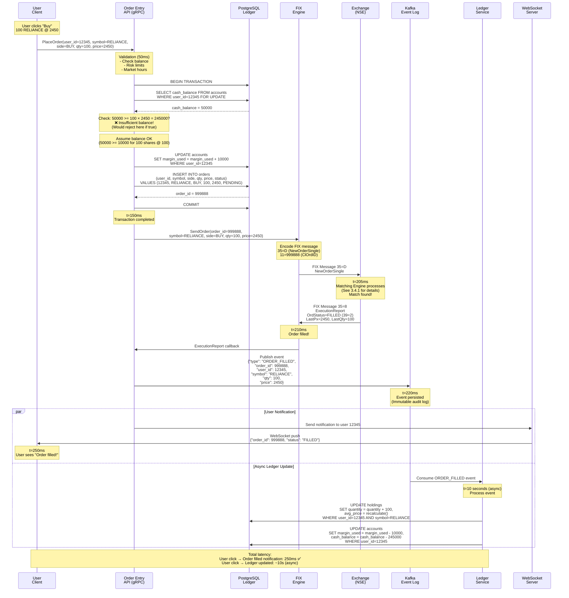

---

## WebSocket Server Topology

**Flow Explanation:**

This diagram shows the WebSocket server cluster architecture and connection routing.

**Components:**

1. **Load Balancer (ALB):** Routes initial WebSocket handshake based on `user_id` hash
2. **1,000 WebSocket Servers:** Each handles 10,000 concurrent connections
3. **Sticky Sessions:** User always connects to same server (maintains subscription state)
4. **Health Checks:** ALB pings servers every 5 seconds

**Connection Flow:**

1. User initiates WebSocket connection
2. ALB computes: `user_id % 1000` → routes to specific server
3. Server accepts connection, stores in memory
4. User sends `subscribe` message with watchlist
5. Server updates subscription map
6. Kafka pushes quote updates → Server filters by subscription → Push to user

**Failover:**

1. Server crashes → ALB detects (15 seconds)
2. User's client detects disconnection
3. Client reconnects (exponential backoff)
4. ALB routes to different server
5. Client resubscribes to watchlist

**Memory per Server:**

- 10,000 connections × 50 KB = 500 MB
- Subscription map: ~10 MB
- **Total: ~600 MB** (fits in 8 GB RAM)

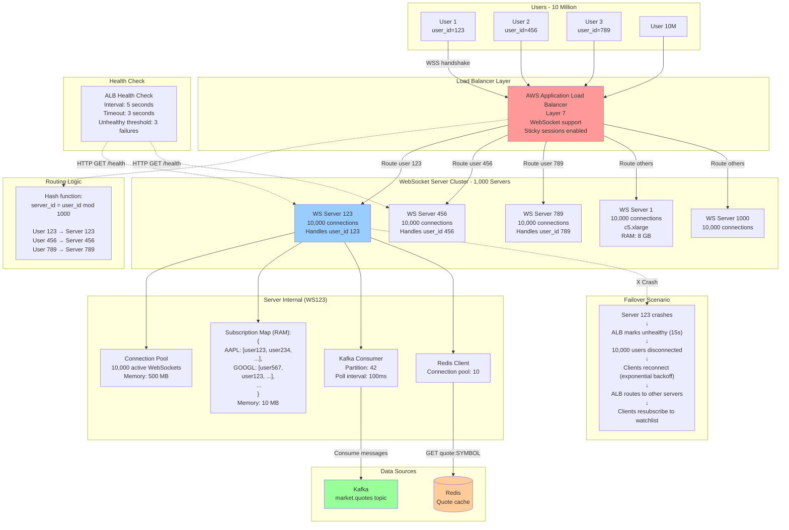

---

## Event Sourcing Architecture

**Flow Explanation:**

This diagram shows the Event Sourcing pattern for the account ledger, solving the lock contention problem.

**Problem:**

- Traditional approach: `UPDATE accounts SET cash_balance = cash_balance - 1500 WHERE user_id=12345`
- Requires exclusive lock on row → Serializes all concurrent updates → Slow

**Solution: Event Sourcing**

**Concept:** Instead of updating balance directly, append immutable events to a log. Balance is derived by replaying
events.

**Components:**

1. **Kafka Event Log:** Immutable, append-only log (compacted topic)
2. **Event Producer:** Order Entry API appends events (ORDER_PLACED, ORDER_FILLED, DEPOSIT, WITHDRAWAL)
3. **Event Consumer:** Ledger Service replays events, updates materialized view
4. **Materialized View:** PostgreSQL snapshot (read-optimized, updated every 1 second)

**Benefits:**

- ✅ No locks: Kafka appending is lock-free (partition-level ordering)
- ✅ Audit trail: Complete history of all transactions (regulatory requirement)
- ✅ Replayable: Reconstruct balance at any point in time
- ✅ Scalable: Kafka handles 100k+ writes/sec

**Trade-offs:**

- ❌ Eventual consistency: Snapshot lags behind event log by ~1 second
- ❌ Complexity: Requires event replay logic

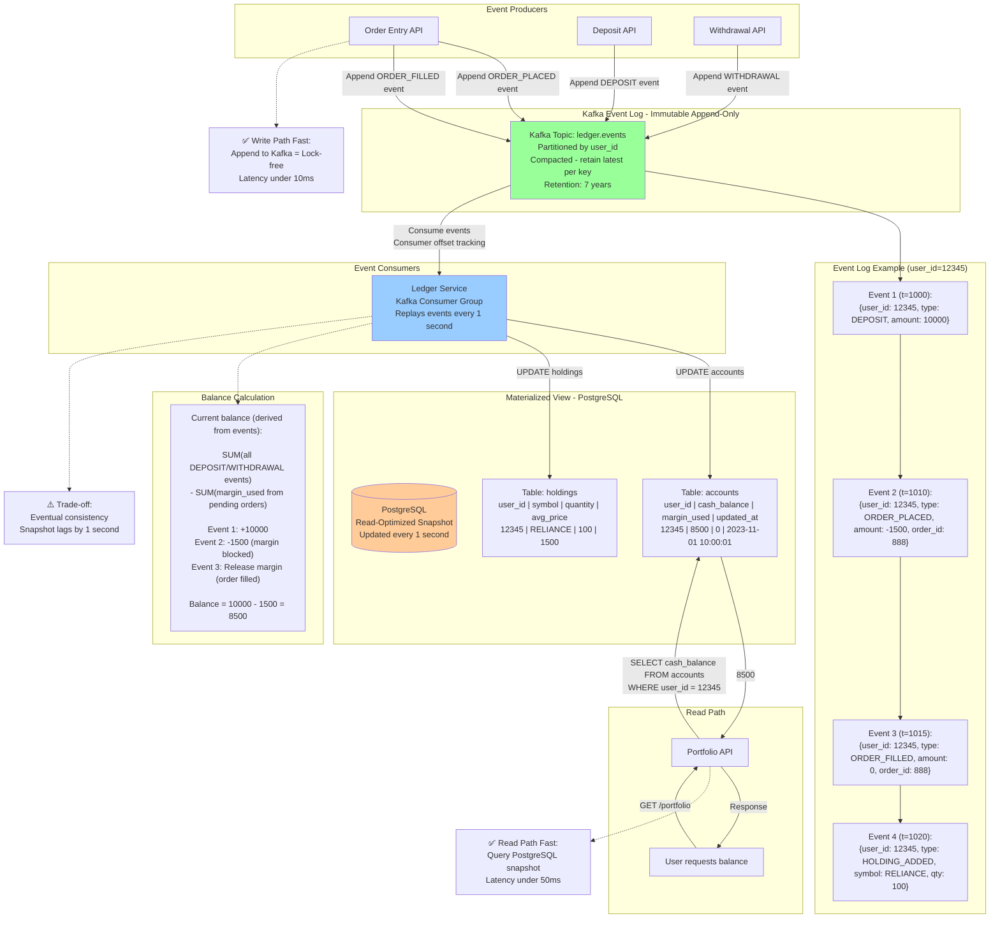

---

## Search and Discovery Flow

**Flow Explanation:**

This diagram shows the flow when a user searches for a stock ticker.

**Steps:**

1. **User types "AP"** in search box
2. **UI debounces** (wait 300ms after last keystroke)
3. **Search API** queries Elasticsearch with prefix query `"AP*"`
4. **Elasticsearch** returns top 10 matches: [AAPL, APPL, APHA, ...]
5. **Search API** fetches current quotes from Redis: MGET quote:AAPL quote:APPL ...
6. **UI displays** results with live prices
7. **User clicks AAPL** → WebSocket subscribes to AAPL stream

**Performance:**

- Elasticsearch query: <30ms
- Redis MGET (10 keys): <5ms
- **Total: <50ms** (within SLA)

**Optimization:**

- **Caching:** Cache popular queries (e.g., "AAPL") in Redis (1-minute TTL)
- **Debouncing:** Reduce load by waiting 300ms
- **Pagination:** Return top 10, fetch more on scroll

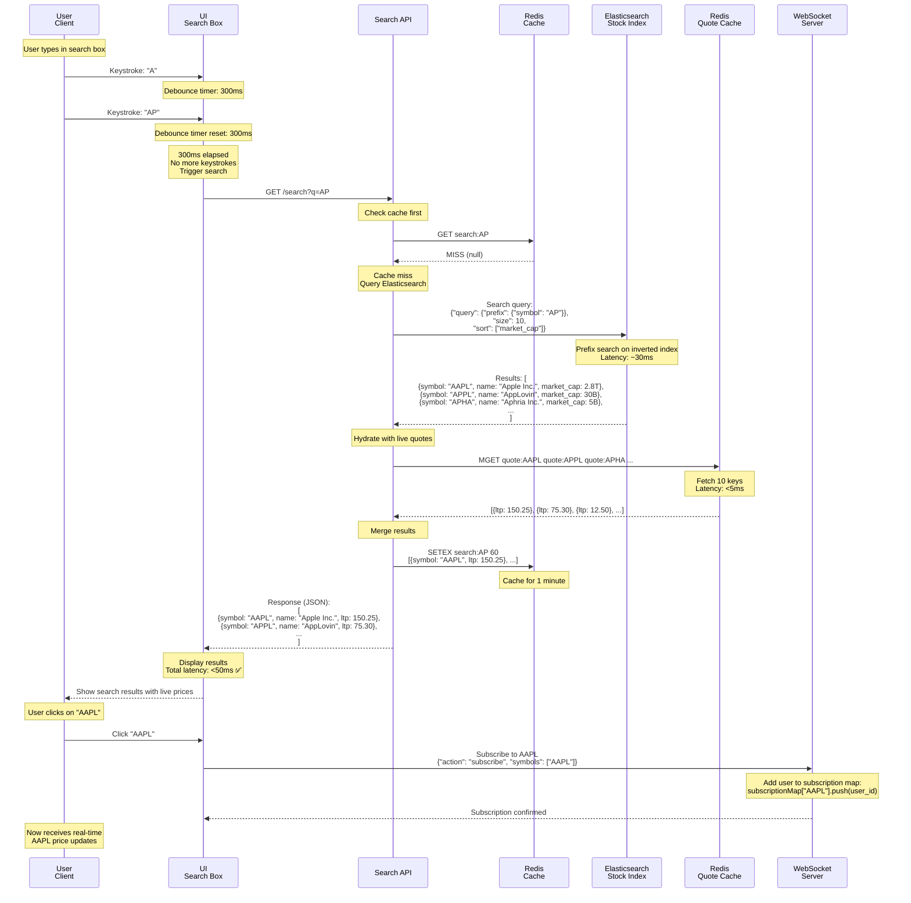

---

## Risk Management System

**Flow Explanation:**

This diagram shows the real-time risk management system that monitors margin positions and triggers alerts.

**Components:**

1. **Margin Monitor:** Runs every 1 minute during market hours
2. **Quote Stream:** Live prices from Redis
3. **Holdings Database:** User positions from PostgreSQL
4. **Alert System:** Sends margin calls, auto-liquidates positions

**Monitoring Logic:**

1. For each user with margin positions:
2. Fetch current holdings from PostgreSQL
3. Calculate position value using live quotes from Redis
4. Calculate equity ratio: `equity / position_value`
5. If equity ratio < 30% → Trigger margin call
6. If grace period expired → Auto-liquidate positions

**Margin Call Example:**

```
User: 12345
Holdings: 100 RELIANCE @ avg buy price $200
Current price: $130 (30% drop)

Position value: 100 × $130 = $13,000
Margin borrowed: $10,000
Equity: $13,000 - $10,000 = $3,000
Equity ratio: $3,000 / $13,000 = 23% ❌ (below 30%)

Action: Trigger margin call
```

**Circuit Breaker:**

- Monitors index level (NIFTY) every 1 second
- If decline > 10%/15%/20% → Halt trading

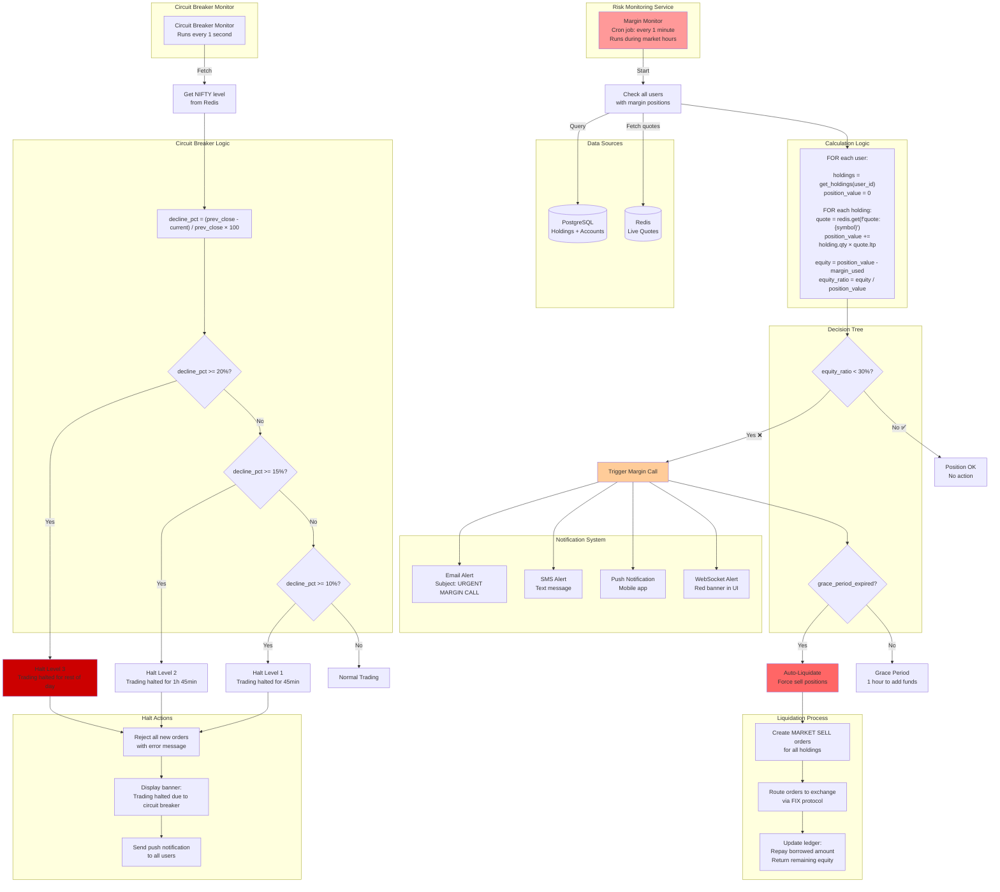

---

## FIX Protocol Integration

**Flow Explanation:**

This diagram shows the FIX protocol session lifecycle and message exchange with the stock exchange.

**FIX (Financial Information eXchange) Protocol:**

- Industry-standard protocol for order routing
- Session-based: Persistent TCP connection
- Sequence numbers: Every message has `MsgSeqNum` (prevents duplicates, detects gaps)
- Heartbeats: Keepalive messages every 30 seconds

**Session Lifecycle:**

1. **Logon (35=A):** Establish session, authenticate
2. **Heartbeats (35=0):** Keep session alive every 30 seconds
3. **Market Data (35=W):** Receive quote updates
4. **Order Flow (35=D, 35=8):** Place orders, receive fills
5. **Resend Requests (35=2):** Handle sequence number gaps
6. **Logout (35=5):** Gracefully close session

**Performance:**

- Order placement latency: ~100ms (end-to-end)
- Throughput: 1,000 orders/sec per session

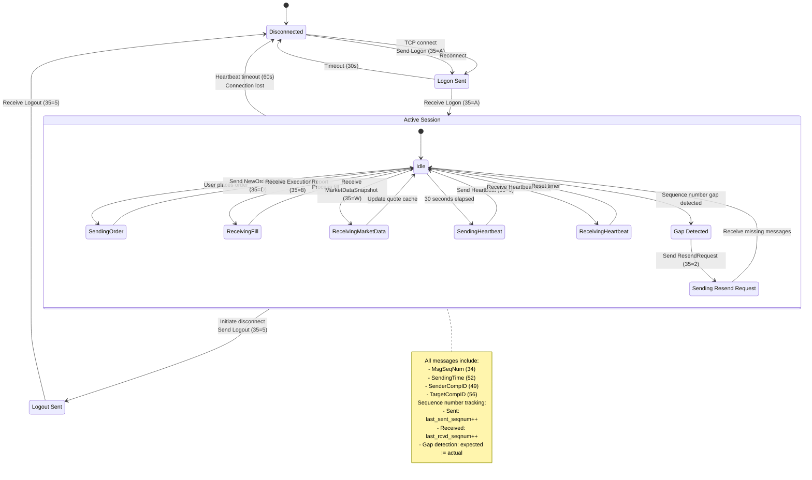

---

## Multi-Region Deployment

**Flow Explanation:**

This diagram shows the multi-region architecture for low-latency global access and data residency compliance.

**Regions:**

1. **Mumbai (Primary):** Nearest to NSE/BSE exchanges (Indian users)
2. **Singapore (Secondary):** Southeast Asia (Singapore users)
3. **London (Secondary):** Europe, Middle East (EU users)

**Data Residency Requirements:**

- **SEBI (India):** All Indian user data MUST be stored in India
- **GDPR (Europe):** European user data MUST stay in EU
- **Solution:** Shard database by region, replicate read-only data cross-region

**Cross-Region Replication:**

- **Quote Data:** Mumbai → Singapore/London via Kafka (~100ms latency)
- **User Data:** NO cross-region replication (compliance)

**Disaster Recovery:**

- **RTO:** 1 hour (recovery time objective)
- **RPO:** 15 minutes (recovery point objective - max data loss)

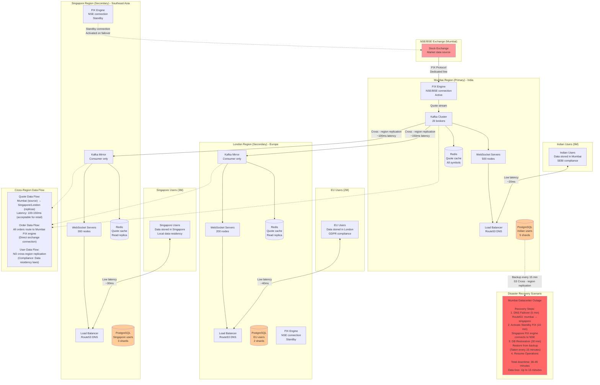

---

## Audit Logging Architecture

**Flow Explanation:**

This diagram shows the complete audit logging system for regulatory compliance (7-year retention).

**Requirements:**

- **Immutable:** Logs cannot be modified (regulatory requirement)
- **Comprehensive:** Log every order, trade, deposit, withdrawal
- **Queryable:** Fast queries for compliance reporting
- **Long retention:** 7 years (SEBI/SEC requirement)

**Architecture:**

1. **Event Capture:** All critical events published to Kafka
2. **ClickHouse:** OLAP database optimized for time-series queries
3. **Tiered Storage:** Hot (6 months, SSD) → Warm (2 years, HDD) → Cold (7 years, S3 Glacier)

**Compliance Queries:**

- Reconstruct user's trading history
- Detect wash sales (buy/sell within 30 days)
- Best execution analysis (slippage measurement)
- GDPR compliance (pseudonymization)

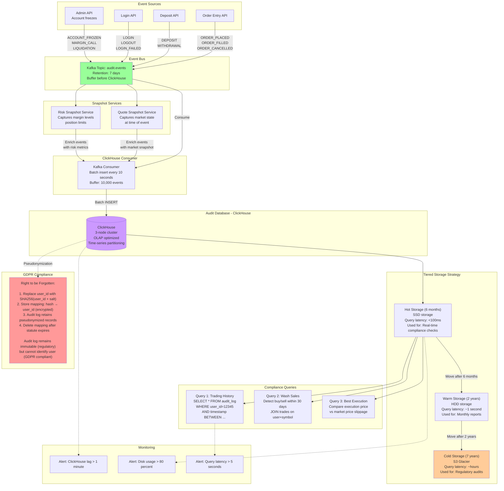

---

## Performance Optimization Pipeline

**Flow Explanation:**

This diagram shows the various performance optimization techniques applied at each layer of the stack.

**Optimizations:**

1. **WebSocket Layer:** Message compression (55 percent reduction), connection pooling
2. **Redis Layer:** Pipelining (20x faster), cluster sharding
3. **Kafka Layer:** Producer batching (100x fewer network calls), compression
4. **CDN Layer:** Cache historical charts (99.9999 percent hit rate)

**Impact:**

- Bandwidth: 6.8 GB/sec saved (compression)
- Latency: 100ms → 5ms (Redis pipelining)
- Network calls: 100k/sec → 1k/sec (Kafka batching)
- Cost: $500k/month → $50k/month (CDN caching)

```mermaid
graph LR
    subgraph "Optimization 1 - WebSocket Compression"
        WS_Before["Before:<br/>Uncompressed message:<br/>62 bytes<br/><br/>200M msg/sec × 62 bytes<br/>= 12.4 GB/sec bandwidth"]
        WS_Opt[Per-Message Deflate<br/>RFC 7692<br/>zlib compression level 1]
        WS_After["After:<br/>Compressed message:<br/>28 bytes<br/><br/>200M msg/sec × 28 bytes<br/>= 5.6 GB/sec bandwidth<br/><br/>✅ Savings: 6.8 GB/sec<br/>✅ Cost savings: $50k/month"]
    end

    WS_Before --> WS_Opt
    WS_Opt --> WS_After

    subgraph "Optimization 2 - Redis Pipelining"
        R_Before["Before:<br/>Sequential SET commands:<br/><br/>FOR 100 quotes:<br/> redis.SET<br/>(1ms per command)<br/><br/>Total: 100ms"]
        R_Opt[Redis Pipeline<br/>Batch 100 commands<br/>Single network round-trip]
        R_After["After:<br/>Batched execution:<br/><br/>pipeline.SET (100x)<br/>pipeline.execute<br/><br/>Total: 5ms<br/><br/>✅ 20x faster"]
    end

    R_Before --> R_Opt
    R_Opt --> R_After

    subgraph "Optimization 3 - Kafka Batching"
        K_Before["Before:<br/>Individual produces:<br/><br/>100k messages/sec<br/>= 100k network calls/sec"]
        K_Opt[Producer Config:<br/>linger.ms = 10<br/>batch.size = 100KB<br/>compression.type = snappy]
        K_After["After:<br/>Batched produces:<br/><br/>~1k batches/sec<br/>(100 messages per batch)<br/><br/>✅ 100x fewer network calls<br/>✅ 60 percent compression"]
    end

    K_Before --> K_Opt
    K_Opt --> K_After

    subgraph "Optimization 4 - CDN Caching"
        CDN_Before["Before:<br/>Historical chart API:<br/><br/>1M requests/hour<br/>= 1M backend queries/hour<br/><br/>Backend cost: $500k/month"]
        CDN_Opt[Cloudflare CDN<br/>Cache-Control: max-age=3600<br/>Edge caching]
        CDN_After["After:<br/>CDN serves from cache:<br/><br/>1M requests/hour<br/>= 1 backend query/hour<br/>(99.9999 percent cache hit)<br/><br/>CDN cost: $5k/month<br/><br/>✅ 100x reduction<br/>✅ $495k/month saved"]
    end

    CDN_Before --> CDN_Opt
    CDN_Opt --> CDN_After
    style WS_After fill: #99ff99
    style R_After fill: #99ff99
    style K_After fill: #99ff99
    style CDN_After fill: #99ff99
```

---

## Failure Scenarios and Recovery

**Flow Explanation:**

This diagram shows common failure scenarios and automated recovery procedures.

**Scenarios:**

1. **WebSocket Server Crash:** 10,000 users disconnected
2. **PostgreSQL Primary Failure:** Promote replica to primary
3. **Kafka Broker Failure:** Rebalance partitions
4. **Redis Node Failure:** Failover to replica

**Recovery:**

- **Automated:** Most failures handled automatically (health checks, failover)
- **Manual:** Complex scenarios require human intervention (data corruption)

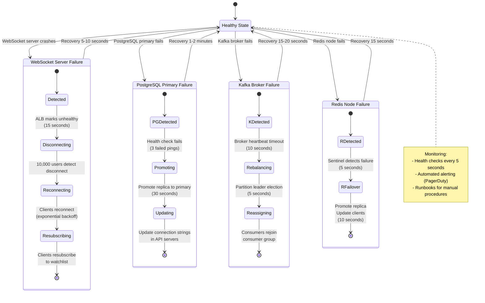

---

## Monitoring and Observability Dashboard

**Flow Explanation:**

This diagram shows the complete monitoring architecture with Prometheus, Grafana, and ClickHouse.

**Key Metrics:**

1. **Quote Latency (E2E):** Target <200ms, alert if >500ms
2. **Order Placement Latency:** Target <1s, alert if >3s
3. **WebSocket Connection Count:** Capacity planning
4. **Order Success Rate:** Detect exchange connectivity issues
5. **Kafka Consumer Lag:** Real-time pipeline health

**Alerting:**

- **Critical:** PagerDuty (24/7 oncall)
- **Warning:** Slack channel
- **Info:** Email digest

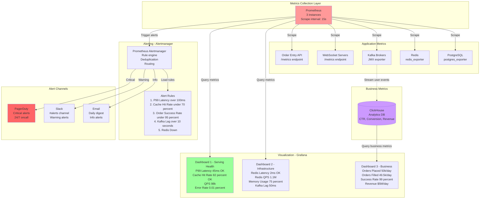