# Stock Brokerage Platform - Sequence Diagrams

## Table of Contents

1. [User Login with TOTP Authentication](#user-login-with-totp-authentication)
2. [WebSocket Quote Subscription](#websocket-quote-subscription)
3. [Stock Search and Quote Hydration](#stock-search-and-quote-hydration)
4. [Order Placement (Happy Path)](#order-placement-happy-path)
5. [Order Placement (Insufficient Balance)](#order-placement-insufficient-balance)
6. [Order Fill and Ledger Update](#order-fill-and-ledger-update)
7. [Margin Call and Auto-Liquidation](#margin-call-and-auto-liquidation)
8. [FIX Session Establishment](#fix-session-establishment)
9. [FIX Sequence Number Gap Recovery](#fix-sequence-number-gap-recovery)
10. [WebSocket Server Failover](#websocket-server-failover)
11. [Circuit Breaker Triggered](#circuit-breaker-triggered)
12. [Dividend Credit Process](#dividend-credit-process)

---

## User Login with TOTP Authentication

**Flow:** User login with two-factor authentication (password + TOTP code)

**Steps:**

1. **User submits credentials** (t=0ms): Username + password
2. **API validates password** (t=50ms): Check against bcrypt hash in database
3. **API requests TOTP** (t=100ms): Return "Enter 6-digit code"
4. **User enters TOTP** (t=10s): Opens Google Authenticator, sees 847362
5. **API validates TOTP** (t=10.1s): Generate expected code using HMAC-SHA1, compare with user input
6. **API issues JWT** (t=10.15s): Signed token with user_id, expires in 24 hours
7. **User authenticated** (t=10.2s): Client stores JWT in localStorage

**Performance:**

- Password validation: 50ms (bcrypt cost factor)
- TOTP validation: <10ms (HMAC computation)
- Total latency: ~10.2 seconds (mostly user time entering code)

**Security:**

- TOTP time window: 30 seconds
- TOTP tolerance: ±1 time step (90-second window total)
- Rate limiting: Max 5 login attempts per 15 minutes

---

## WebSocket Quote Subscription

**Flow:** User establishes WebSocket connection and subscribes to real-time stock quotes

**Steps:**

1. **User initiates connection** (t=0ms): WSS handshake to wss://broker.com/quotes
2. **Load balancer routes** (t=10ms): Hash user_id % 1000 → Server 123
3. **Server accepts connection** (t=50ms): Upgrade HTTP to WebSocket
4. **User sends subscribe message** (t=100ms): ["AAPL", "GOOGL", "TSLA"]
5. **Server updates subscription map** (t=105ms): Add user to symbol lists
6. **Kafka delivers quote** (t=1s): AAPL LTP=150.25
7. **Server pushes to user** (t=1.05s): JSON message with new price
8. **Heartbeat exchange** (every 30s): PING/PONG to keep connection alive

**Performance:**

- Connection establishment: <50ms
- Subscription update: <5ms
- Quote delivery: <100ms after Kafka message

---

## Stock Search and Quote Hydration

**Flow:** User searches for a stock ticker and sees live prices in results

**Steps:**

1. **User types "AP"** (t=0ms): Keystroke in search box
2. **UI debounces** (t=300ms): Wait for user to finish typing
3. **Search API queries Elasticsearch** (t=330ms): Prefix search "AP*"
4. **Elasticsearch returns matches** (t=360ms): AAPL, APPL, APHA, ...
5. **Search API fetches quotes** (t=365ms): Redis MGET for hydration
6. **UI displays results** (t=380ms): Stock names with live prices
7. **User clicks result** (t=5s): Navigate to stock detail page

**Performance:**

- Elasticsearch query: ~30ms
- Redis MGET (10 keys): <5ms
- **Total latency: <50ms** (within SLA)

```mermaid
sequenceDiagram
    participant User as User<br/>Browser
    participant UI as UI<br/>Search Component
    participant API as Search API
    participant Cache as Redis<br/>Search Cache
    participant ES as Elasticsearch<br/>Stock Index
    participant Redis as Redis<br/>Quote Cache
    Note over User: User focuses search box
    User ->> UI: Keystroke: "A"
    Note over UI: Start debounce timer: 300ms
    User ->> UI: Keystroke: "P" (within 300ms)
    Note over UI: Reset debounce timer: 300ms
    Note over UI: 300ms elapsed, no more keystrokes<br/>Trigger search
    UI ->> API: GET /api/search?q=AP
    Note over API: t=300ms<br/>Check cache first
    API ->> Cache: GET search_cache:AP
    Cache -->> API: MISS (null)
    Note over API: Cache miss<br/>Query Elasticsearch
    API ->> ES: POST /_search<br/>{<br/> "query": {<br/> "bool": {<br/> "should": [<br/> {"prefix": {"symbol": "AP"}},<br/> {"match": {"name": "AP"}}<br/> ]<br/> }<br/> },<br/> "size": 10,<br/> "sort": [{"market_cap": "desc"}]<br/>}
    Note over ES: t=330ms<br/>Search inverted index<br/>Score and rank results
    ES -->> API: Response (10 results):<br/>[<br/> {"symbol": "AAPL", "name": "Apple Inc.", "market_cap": 2.8T},<br/> {"symbol": "APPL", "name": "AppLovin Corp.", "market_cap": 30B},<br/> {"symbol": "APHA", "name": "Aphria Inc.", "market_cap": 5B},<br/> {"symbol": "APO", "name": "Apollo Global", "market_cap": 60B},<br/> ...<br/>]
    Note over API: t=360ms<br/>Hydrate with live quotes
    API ->> Redis: MGET quote:AAPL quote:APPL quote:APHA ...
    Note over Redis: Fetch 10 keys in parallel<br/>In-memory lookup<br/>Latency: <5ms
    Redis -->> API: [<br/> {"ltp": 150.25, "change": +1.5, "volume": 50M},<br/> {"ltp": 75.30, "change": -0.8, "volume": 5M},<br/> {"ltp": 12.50, "change": +0.3, "volume": 2M},<br/> ...<br/>]
    Note over API: t=365ms<br/>Merge results
    API ->> API: merged_results = []<br/>FOR i in range(10):<br/> merged_results.append({<br/> "symbol": es_results[i].symbol,<br/> "name": es_results[i].name,<br/> "ltp": redis_results[i].ltp,<br/> "change": redis_results[i].change<br/> })
    Note over API: Cache merged results
    API ->> Cache: SETEX search_cache:AP 60<br/>[{"symbol": "AAPL", "ltp": 150.25}, ...]
    Note over Cache: Cache for 1 minute<br/>(Reduce Elasticsearch load)
    API -->> UI: 200 OK (JSON):<br/>[<br/> {"symbol": "AAPL", "name": "Apple Inc.", "ltp": 150.25, "change": +1.5},<br/> {"symbol": "APPL", "name": "AppLovin", "ltp": 75.30, "change": -0.8},<br/> ...<br/>]
    Note over UI: t=380ms<br/>Render search results<br/>Total latency: 80ms ✅
    UI -->> User: Display results:<br/>📈 AAPL - Apple Inc.<br/> $150.25 (+1.5)<br/>📈 APPL - AppLovin<br/> $75.30 (-0.8)<br/>...
    Note over User: User reviews results<br/>Decides to view AAPL
    User ->> UI: Click "AAPL"
    Note over UI: Navigate to stock detail page<br/>Trigger WebSocket subscription
    UI ->> API: GET /api/stock/AAPL<br/>(Fetch detailed info)
```

---

## Order Placement (Happy Path)

**Flow:** User successfully places a buy order for 100 shares of RELIANCE

**Steps:**

1. **User clicks "Buy"** (t=0ms): Order form submitted
2. **API validates order** (t=50ms): Check balance, limits, market hours
3. **API starts ACID transaction** (t=100ms): Lock account row
4. **API deducts balance** (t=120ms): Block margin for order
5. **API inserts order** (t=140ms): Create order record
6. **Transaction commits** (t=160ms): Changes persisted
7. **FIX order sent** (t=180ms): Route to exchange
8. **Exchange fills order** (t=300ms): Match with sell order
9. **User notified** (t=320ms): WebSocket push

**Total Latency:** ~320ms (user click to notification)

```mermaid
sequenceDiagram
    participant User as User<br/>Client
    participant API as Order Entry<br/>API
    participant PG as PostgreSQL<br/>Ledger
    participant FIX as FIX<br/>Engine
    participant Exchange as Exchange<br/>(NSE)
    participant Kafka as Kafka<br/>Event Log
    participant WS as WebSocket<br/>Server
    Note over User: User views RELIANCE stock<br/>Current price: $2450
    User ->> API: POST /api/orders<br/>{<br/> "user_id": 12345,<br/> "symbol": "RELIANCE",<br/> "side": "BUY",<br/> "quantity": 100,<br/> "price": 2450,<br/> "order_type": "LIMIT"<br/>}
    Note over API: t=0ms<br/>Order request received
    Note over API: Validation checks
    API ->> API: 1. Check market hours<br/> (9:15 AM - 3:30 PM IST)<br/> ✅ Currently 10:30 AM
    API ->> API: 2. Check order amount<br/> 100 × $2450 = $245,000<br/> User must have this balance
    API ->> PG: SELECT cash_balance, margin_used<br/>FROM accounts<br/>WHERE user_id = 12345
    PG -->> API: {cash_balance: 500000, margin_used: 0}
    Note over API: t=50ms<br/>Balance check: $500k >= $245k ✅
    API ->> API: 3. Check position limit<br/> Max 25% in single stock<br/> Portfolio value: $500k<br/> Max RELIANCE: $125k<br/> New position: $245k<br/> ❌ Would exceed limit!
    Note over API: For demo, assume limit OK<br/>(First purchase of RELIANCE)
    Note over API: t=100ms<br/>All validations passed<br/>Start ACID transaction
    API ->> PG: BEGIN TRANSACTION
    API ->> PG: SELECT cash_balance FROM accounts<br/>WHERE user_id = 12345<br/>FOR UPDATE<br/>(Lock row)
    Note over PG: Row locked<br/>Other orders will wait
    PG -->> API: cash_balance = 500000
    API ->> PG: UPDATE accounts<br/>SET margin_used = margin_used + 245000<br/>WHERE user_id = 12345
    Note over API: t=120ms<br/>Balance blocked for order
    API ->> PG: INSERT INTO orders<br/>(user_id, symbol, side, quantity, price, status, created_at)<br/>VALUES (12345, 'RELIANCE', 'BUY', 100, 2450, 'PENDING', now())<br/>RETURNING order_id
    PG -->> API: order_id = 999888
    Note over API: t=140ms<br/>Order record created
    API ->> PG: COMMIT
    Note over PG: t=160ms<br/>Transaction committed<br/>Row unlocked
    Note over API: ACID transaction complete<br/>Balance deducted, order created
    API ->> Kafka: Publish event:<br/>{<br/> "type": "ORDER_PLACED",<br/> "order_id": 999888,<br/> "user_id": 12345,<br/> "symbol": "RELIANCE",<br/> "side": "BUY",<br/> "quantity": 100,<br/> "price": 2450,<br/> "timestamp": 1609459200000<br/>}
    Note over Kafka: Event persisted<br/>(Audit trail)
    API -->> User: 200 OK<br/>{<br/> "order_id": 999888,<br/> "status": "PENDING",<br/> "message": "Order placed successfully"<br/>}
    Note over User: t=180ms<br/>User sees confirmation<br/>"Order placed!"
    Note over API: t=180ms<br/>Route order to exchange
    API ->> FIX: SendOrder(order_id=999888,<br/>symbol="RELIANCE", side=BUY,<br/>qty=100, price=2450)
    Note over FIX: Encode FIX message<br/>35=D (NewOrderSingle)
    FIX ->> Exchange: FIX Message:<br/>35=D|11=999888|55=RELIANCE|54=1|38=100|40=2|44=2450
    Note over Exchange: t=200ms<br/>Matching Engine processes<br/>(See 3.4.1 Stock Exchange)
    Exchange -->> FIX: FIX Message:<br/>35=8 (ExecutionReport)<br/>11=999888|39=0 (New)
    Note over FIX: t=220ms<br/>Order accepted by exchange
    Note over Exchange: t=300ms<br/>Match found!<br/>Sell order at $2450
    Exchange ->> FIX: FIX Message:<br/>35=8 (ExecutionReport)<br/>11=999888|39=2 (Filled)<br/>31=2450|32=100
    Note over FIX: t=300ms<br/>Order filled!
    FIX ->> Kafka: Publish event:<br/>{<br/> "type": "ORDER_FILLED",<br/> "order_id": 999888,<br/> "fill_price": 2450,<br/> "fill_quantity": 100<br/>}
    FIX ->> WS: Notify user 12345<br/>Order 999888 filled
    WS ->> User: WebSocket push:<br/>{<br/> "type": "order_update",<br/> "order_id": 999888,<br/> "status": "FILLED",<br/> "message": "Your order has been filled at $2450"<br/>}
    Note over User: t=320ms<br/>User sees notification<br/>"Order filled at $2450!"
    Note over User: Total latency:<br/>User click → Order filled notification<br/>= 320ms ✅
```

---

## Order Placement (Insufficient Balance)

**Flow:** User attempts to place an order but has insufficient balance

**Steps:**

1. **User clicks "Buy"** (t=0ms): Order for 1000 shares @ $2450
2. **API validates** (t=50ms): Check balance
3. **Balance check fails** (t=60ms): $500k < $2.45M required
4. **Transaction rolls back** (t=70ms): No changes made
5. **User receives error** (t=80ms): "Insufficient balance"

**Performance:**

- Fast failure: <100ms
- No database changes (rollback)
- Clear error message

---

## Order Fill and Ledger Update

**Flow:** Async ledger update after order is filled by the exchange

**Steps:**

1. **Exchange fills order** (t=0s): ExecutionReport via FIX
2. **Kafka event published** (t=0.1s): ORDER_FILLED event
3. **Ledger Service consumes** (t=5s): Process event from Kafka
4. **Update holdings** (t=5.2s): Add shares to user's portfolio
5. **Release margin** (t=5.3s): Deduct cash, release blocked amount
6. **Update complete** (t=5.5s): Ledger synchronized

**Latency:**

- Order fill → Ledger updated: ~5 seconds (async)
- User doesn't wait for this (already notified at fill time)

```mermaid
sequenceDiagram
    participant Exchange as Exchange<br/>(NSE)
    participant FIX as FIX<br/>Engine
    participant Kafka as Kafka<br/>ledger.events topic
    participant Ledger as Ledger<br/>Service
    participant PG as PostgreSQL<br/>Ledger DB
    Note over Exchange: t=0s<br/>Order 999888 filled<br/>100 RELIANCE @ $2450
    Exchange ->> FIX: FIX Message 35=8<br/>ExecutionReport<br/>OrdStatus=FILLED
    Note over FIX: Parse execution details
    FIX ->> Kafka: Publish event:<br/>{<br/> "type": "ORDER_FILLED",<br/> "order_id": 999888,<br/> "user_id": 12345,<br/> "symbol": "RELIANCE",<br/> "side": "BUY",<br/> "quantity": 100,<br/> "fill_price": 2450,<br/> "fill_value": 245000,<br/> "timestamp": 1609459200000,<br/> "exchange_execution_id": "EXEC_789"<br/>}
    Note over Kafka: t=0.1s<br/>Event persisted<br/>(Replication factor: 3)
    Note over Ledger: t=5s (async)<br/>Ledger Service polls Kafka<br/>Consumer lag: ~5 seconds
    Kafka ->> Ledger: Poll messages (batch of 100):<br/>[<br/> {"type": "ORDER_FILLED", "order_id": 999888, ...},<br/> ...<br/>]
    Note over Ledger: Process ORDER_FILLED event
    Ledger ->> PG: BEGIN TRANSACTION
    Note over Ledger: t=5.1s<br/>Update holdings table
    Ledger ->> PG: SELECT * FROM holdings<br/>WHERE user_id = 12345 AND symbol = 'RELIANCE'<br/>FOR UPDATE
    PG -->> Ledger: Empty result<br/>(User doesn't own RELIANCE yet)
    Ledger ->> PG: INSERT INTO holdings<br/>(user_id, symbol, quantity, avg_price, total_invested)<br/>VALUES (12345, 'RELIANCE', 100, 2450, 245000)
    Note over Ledger: If user already owned RELIANCE:<br/>Calculate new avg_price:<br/>(old_qty × old_avg + new_qty × new_price) / (old_qty + new_qty)
    Note over Ledger: t=5.2s<br/>Update account balance
    Ledger ->> PG: UPDATE accounts<br/>SET cash_balance = cash_balance - 245000,<br/> margin_used = margin_used - 245000<br/>WHERE user_id = 12345
    Note over Ledger: Release blocked margin<br/>Deduct actual cash
    Note over Ledger: t=5.3s<br/>Update order status
    Ledger ->> PG: UPDATE orders<br/>SET status = 'FILLED',<br/> filled_at = now(),<br/> fill_price = 2450,<br/> fill_quantity = 100<br/>WHERE order_id = 999888
    Ledger ->> PG: COMMIT
    Note over PG: t=5.5s<br/>Transaction committed<br/>Ledger updated
    Note over Ledger: Acknowledge Kafka offset<br/>(Mark event as processed)
    Ledger ->> Kafka: Commit offset for partition 42
    Note over Ledger: Total latency:<br/>Order fill → Ledger update<br/>= ~5 seconds (async)<br/><br/>User was already notified<br/>at fill time (t=0s)
```

---

## Margin Call and Auto-Liquidation

**Flow:** User's margin position drops below maintenance margin, triggering auto-liquidation

**Steps:**

1. **Price drops** (t=0s): RELIANCE drops from $200 to $130 (35% decline)
2. **Monitor detects breach** (t=60s): Equity ratio = 23% < 30% threshold
3. **Margin call triggered** (t=61s): Urgent notifications sent
4. **Grace period starts** (t=61s): User has 1 hour to add funds
5. **User doesn't respond** (t=3661s): Grace period expires
6. **Auto-liquidation** (t=3662s): Force sell all positions
7. **Debt repaid** (t=3670s): Use proceeds to repay borrowed amount

**Timeline:**

- Grace period: 1 hour (3,600 seconds)
- If user adds funds: Cancel liquidation
- If user doesn't respond: Auto-liquidate

```mermaid
sequenceDiagram
    participant Market as Market<br/>Price Feed
    participant Monitor as Margin<br/>Monitor
    participant PG as PostgreSQL<br/>Holdings
    participant Redis as Redis<br/>Quotes
    participant Alert as Alert<br/>System
    participant User as User
    participant Liquidator as Liquidation<br/>Service
    participant Exchange as Exchange
    Note over Market: t=0s<br/>RELIANCE price drops<br/>$200 → $130 (35% decline)
    Market ->> Redis: Update quote:<br/>SET quote:RELIANCE<br/>{"ltp": 130, "change": -35%}
    Note over Monitor: t=60s<br/>Margin Monitor runs<br/>(Cron: every 1 minute)
    Monitor ->> PG: SELECT user_id, symbol, quantity, avg_price<br/>FROM holdings<br/>WHERE user_id IN (users with margin positions)
    PG -->> Monitor: [<br/> {user_id: 12345, symbol: "RELIANCE", qty: 100, avg_price: 200}<br/>]
    Note over Monitor: User 12345 has margin position<br/>Bought 100 @ $200 = $20,000<br/>Borrowed: $10,000 (50% margin)
    Monitor ->> Redis: GET quote:RELIANCE
    Redis -->> Monitor: {"ltp": 130}
    Note over Monitor: Calculate metrics:<br/>Position value: 100 × $130 = $13,000<br/>Debt: $10,000<br/>Equity: $13,000 - $10,000 = $3,000<br/>Equity ratio: $3,000 / $13,000 = 23%<br/>❌ Below 30% threshold!
    Note over Monitor: t=61s<br/>MARGIN CALL TRIGGERED
    Monitor ->> PG: INSERT INTO margin_calls<br/>(user_id, equity_ratio, threshold, grace_period_end)<br/>VALUES (12345, 0.23, 0.30, now() + interval '1 hour')
    Monitor ->> Alert: send_margin_call_alert(user_id=12345,<br/>equity_ratio=0.23,<br/>required_funds=1000)

    par Notification Channels
        Alert ->> User: Email:<br/>"URGENT: Margin Call<br/>Your equity ratio is 23% (below 30%)<br/>Add $1,000 or positions will be liquidated"
    and
        Alert ->> User: SMS:<br/>"URGENT MARGIN CALL. Add funds within 1 hour."
    and
        Alert ->> User: Push Notification:<br/>"⚠️ Margin Call Alert"
    and
        Alert ->> User: WebSocket (Red Banner):<br/>"URGENT: Add $1,000 to avoid liquidation"
    end

    Note over User: Grace period: 1 hour<br/>User can:<br/>1. Deposit funds<br/>2. Sell other holdings<br/>3. Let system auto-liquidate
    Note over User: t=3661s (1 hour later)<br/>User did NOT respond<br/>Grace period expired
    Monitor ->> PG: SELECT * FROM margin_calls<br/>WHERE user_id = 12345<br/>AND grace_period_end < now()<br/>AND status = 'ACTIVE'
    PG -->> Monitor: {user_id: 12345, status: 'ACTIVE'}
    Note over Monitor: t=3662s<br/>Initiate auto-liquidation
    Monitor ->> Liquidator: liquidate_user_positions(user_id=12345)
    Note over Liquidator: Force sell all positions
    Liquidator ->> PG: SELECT * FROM holdings<br/>WHERE user_id = 12345
    PG -->> Liquidator: [{symbol: "RELIANCE", qty: 100}]
    Liquidator ->> Exchange: Place MARKET SELL order:<br/>100 RELIANCE @ MARKET<br/>(Aggressive: Sell at any price)
    Note over Exchange: Execute immediately<br/>Fill at current bid: $130
    Exchange -->> Liquidator: Order filled:<br/>100 shares @ $130<br/>Proceeds: $13,000
    Note over Liquidator: t=3670s<br/>Update ledger
    Liquidator ->> PG: BEGIN TRANSACTION
    Liquidator ->> PG: DELETE FROM holdings<br/>WHERE user_id = 12345 AND symbol = 'RELIANCE'
    Liquidator ->> PG: UPDATE accounts<br/>SET cash_balance = cash_balance + 13000 - 10000<br/>WHERE user_id = 12345<br/>(Repay debt: $10k, Return equity: $3k)
    Liquidator ->> PG: UPDATE margin_calls<br/>SET status = 'LIQUIDATED'<br/>WHERE user_id = 12345
    Liquidator ->> PG: COMMIT
    Note over User: Final account state:<br/>Cash: +$3,000 (returned equity)<br/>Debt: $0 (repaid)<br/>Holdings: 0 (position closed)<br/><br/>Loss: $7,000 (35% of investment)
    Liquidator ->> User: Email:<br/>"Position Liquidated<br/>100 RELIANCE sold @ $130<br/>Debt repaid: $10,000<br/>Returned equity: $3,000"
```

---

## FIX Session Establishment

**Flow:** Establish FIX protocol session with stock exchange

**Steps:**

1. **TCP connect** (t=0ms): Connect to exchange:5001
2. **Send Logon** (t=10ms): FIX 35=A message with credentials
3. **Receive Logon** (t=30ms): Exchange accepts session
4. **Heartbeat exchange** (every 30s): Keep session alive
5. **Session active** (t=30ms): Ready to send/receive orders and market data

**Performance:**

- Session establishment: <50ms
- Heartbeat overhead: Negligible (1 msg every 30s)

```mermaid
sequenceDiagram
    participant FIX as FIX Engine<br/>(Broker)
    participant TCP as TCP<br/>Connection
    participant Exchange as Exchange<br/>Gateway
    Note over FIX: Initialize FIX session
    FIX ->> TCP: socket.connect(exchange_host, port=5001)
    Note over TCP: t=10ms<br/>TCP handshake (SYN, SYN-ACK, ACK)
    TCP -->> FIX: Connection established
    Note over FIX: Build Logon message<br/>FIX 4.2
    FIX ->> FIX: msg = create_fix_message()<br/>msg.set(35, "A") // Logon<br/>msg.set(49, "BROKER_ID") // SenderCompID<br/>msg.set(56, "NSE") // TargetCompID<br/>msg.set(34, 1) // MsgSeqNum<br/>msg.set(52, "20231101-09:00:00") // SendingTime<br/>msg.set(98, 0) // EncryptMethod: None<br/>msg.set(108, 30) // HeartBtInt: 30 seconds<br/>msg.set(553, "broker_user") // Username<br/>msg.set(554, "secret_password") // Password
    Note over FIX: Calculate checksum
    FIX ->> FIX: checksum = calculate_checksum(msg)<br/>msg.set(10, checksum) // Checksum
    Note over FIX: t=15ms<br/>Send Logon message
    FIX ->> Exchange: FIX Message (pipe-delimited):<br/>8=FIX.4.2|9=120|35=A|49=BROKER_ID|56=NSE|34=1|52=...|98=0|108=30|553=...|554=...|10=123|
    Note over Exchange: t=25ms<br/>Validate credentials<br/>Check IP whitelist<br/>Authenticate
    Exchange ->> Exchange: validate_credentials(username, password)<br/>check_ip_whitelist(source_ip)<br/>✅ Authentication successful
    Note over Exchange: t=30ms<br/>Accept session<br/>Send Logon response
    Exchange ->> FIX: FIX Message:<br/>8=FIX.4.2|9=110|35=A|49=NSE|56=BROKER_ID|34=1|52=...|98=0|108=30|10=098|
    Note over FIX: t=30ms<br/>Logon received!<br/>Session ACTIVE
    FIX ->> FIX: session_state = ACTIVE<br/>last_sent_seqnum = 1<br/>last_received_seqnum = 1<br/>heartbeat_interval = 30 seconds<br/>start_heartbeat_timer()
    Note over FIX: Persist session state
    FIX ->> FIX: save_to_db({<br/> session_id: "NSE",<br/> state: "ACTIVE",<br/> last_sent_seqnum: 1,<br/> last_received_seqnum: 1<br/>})

    loop Heartbeat Exchange (every 30 seconds)
        Note over FIX: t=30s, 60s, 90s, ...<br/>Send heartbeat
        FIX ->> Exchange: FIX Message:<br/>35=0 (Heartbeat)<br/>34=2 (MsgSeqNum incremented)
        Note over Exchange: Heartbeat received<br/>Session alive
        Exchange ->> FIX: FIX Message:<br/>35=0 (Heartbeat)<br/>34=2
        Note over FIX: Heartbeat received<br/>Reset timeout timer<br/>(If no heartbeat for 60s → disconnect)
    end

    Note over FIX, Exchange: Session established ✅<br/>Ready for order flow and market data
```

---

## FIX Sequence Number Gap Recovery

**Flow:** Handle sequence number gap (missing messages) in FIX session

**Steps:**

1. **Receive message** (t=0ms): Sequence number 50
2. **Detect gap** (t=1ms): Expected 48, received 50 (missing 48, 49)
3. **Send ResendRequest** (t=5ms): FIX 35=2 requesting 48-49
4. **Exchange resends** (t=20ms): Retransmit missing messages
5. **Process messages** (t=30ms): Handle 48, 49, then continue with 50
6. **Resume normal flow** (t=40ms): Sequence synchronized

**Performance:**

- Gap detection: <1ms
- Recovery time: <100ms
- No message loss (FIX guarantees delivery)

```mermaid
sequenceDiagram
    participant FIX as FIX Engine<br/>(Broker)
    participant Exchange as Exchange<br/>Gateway
    Note over FIX: Active FIX session<br/>Expecting MsgSeqNum: 48
    Exchange ->> FIX: FIX Message:<br/>35=W (MarketDataSnapshot)<br/>34=50 (MsgSeqNum)
    Note over FIX: t=0ms<br/>Received MsgSeqNum: 50<br/>Expected: 48<br/>❌ GAP DETECTED!<br/>Missing: 48, 49
    FIX ->> FIX: gap_start = last_received_seqnum + 1 = 48<br/>gap_end = received_seqnum - 1 = 49<br/>missing_messages = [48, 49]
    Note over FIX: Queue current message (50)<br/>for processing after gap is filled
    FIX ->> FIX: queued_messages.append(msg_50)
    Note over FIX: t=5ms<br/>Send ResendRequest
    FIX ->> Exchange: FIX Message:<br/>35=2 (ResendRequest)<br/>34=51 (MsgSeqNum continues)<br/>7=48 (BeginSeqNo)<br/>16=49 (EndSeqNo)
    Note over Exchange: t=10ms<br/>Lookup missing messages<br/>from persistent log
    Exchange ->> Exchange: resend_messages = fetch_from_log(<br/> session_id="BROKER_ID",<br/> seq_range=[48, 49]<br/>)
    Note over Exchange: Found messages:<br/>48: ExecutionReport (Order 888 filled)<br/>49: MarketDataSnapshot (RELIANCE)
    Note over Exchange: t=15ms<br/>Resend messages<br/>Set PossDupFlag (43=Y)
    Exchange ->> FIX: FIX Message:<br/>35=8 (ExecutionReport)<br/>34=48 (MsgSeqNum)<br/>43=Y (PossDupFlag: Possible duplicate)<br/>11=888 (Order ID)<br/>39=2 (Filled)
    Note over FIX: t=20ms<br/>Received missing message 48<br/>PossDupFlag=Y (duplicate, but needed)
    FIX ->> FIX: process_message(msg_48)<br/>update_order_status(order_id=888, status="FILLED")
    Exchange ->> FIX: FIX Message:<br/>35=W (MarketDataSnapshot)<br/>34=49 (MsgSeqNum)<br/>43=Y (PossDupFlag)<br/>55=RELIANCE (Symbol)
    Note over FIX: t=25ms<br/>Received missing message 49
    FIX ->> FIX: process_message(msg_49)<br/>update_quote_cache("RELIANCE", quote_data)
    Note over FIX: t=30ms<br/>Gap filled!<br/>Process queued message 50
    FIX ->> FIX: msg_50 = queued_messages.pop()<br/>process_message(msg_50)
    Note over FIX: Update sequence tracking
    FIX ->> FIX: last_received_seqnum = 50<br/>save_to_db(session_id="NSE", last_received_seqnum=50)
    Note over FIX: t=40ms<br/>Resume normal message flow<br/>Sequence synchronized ✅
    Exchange ->> FIX: FIX Message:<br/>35=W<br/>34=51 (Next message in sequence)
    Note over FIX: Expected: 51<br/>Received: 51<br/>✅ No gap, process normally
```

---

## WebSocket Server Failover

**Flow:** WebSocket server crashes, users automatically reconnect to healthy server

**Steps:**

1. **Server crashes** (t=0s): Server 123 goes down (10,000 users affected)
2. **Health check fails** (t=15s): Load balancer marks unhealthy
3. **Users detect disconnect** (t=16s): TCP connection closed
4. **Clients reconnect** (t=20s): Exponential backoff, retry
5. **Load balancer routes** (t=25s): Route to Server 456 (healthy)
6. **Connection established** (t=27s): New WebSocket connection
7. **Clients resubscribe** (t=28s): Send watchlist again
8. **Resume streaming** (t=30s): Live quotes flowing

**Downtime:** ~30 seconds per user (graceful degradation)

```mermaid
sequenceDiagram
    participant User as User<br/>Client
    participant ALB as Load Balancer<br/>(ALB)
    participant WS123 as WebSocket<br/>Server 123
    participant WS456 as WebSocket<br/>Server 456
    participant HC as Health<br/>Check
    Note over User: t=0s<br/>Connected to Server 123<br/>Receiving live quotes

    loop Normal Operation
        WS123 ->> User: Quote update (AAPL: $150.25)
        User -->> WS123: Active connection
    end

    Note over WS123: t=0s<br/>💥 SERVER CRASH<br/>(Out of memory, segfault, etc.)
    WS123 -x User: Connection lost
    Note over User: t=1s<br/>Detect disconnection<br/>onclose event fired
    User ->> User: console.log("WebSocket disconnected")<br/>Start reconnection logic
    Note over HC: t=5s<br/>Health check (every 5s)
    HC ->> WS123: HTTP GET /health
    Note over WS123: No response<br/>(Server down)
    Note over HC: t=10s<br/>Retry health check
    HC ->> WS123: HTTP GET /health
    Note over HC: Still no response<br/>(2 failures)
    Note over HC: t=15s<br/>Third health check failure<br/>Mark unhealthy
    HC ->> ALB: Mark Server 123 as UNHEALTHY<br/>Remove from rotation
    Note over ALB: Server 123 removed<br/>Route new connections to other servers
    Note over User: t=16s<br/>Attempt reconnection<br/>(Exponential backoff: 1s, 2s, 4s, ...)
    User ->> ALB: WebSocket handshake<br/>GET wss://broker.com/quotes<br/>Authorization: Bearer eyJhbGci...
    Note over ALB: t=20s<br/>Health servers:<br/>Server 123: ❌ UNHEALTHY<br/>Server 456: ✅ HEALTHY<br/>Route to Server 456
    ALB ->> WS456: Forward handshake
    Note over WS456: t=25s<br/>Accept connection<br/>New user (previously on Server 123)
    WS456 -->> ALB: 101 Switching Protocols
    ALB -->> User: WebSocket established
    Note over User: t=27s<br/>Connection restored!<br/>Rebuild state
    User ->> User: localStorage.getItem("watchlist")<br/>// ["AAPL", "GOOGL", "TSLA"]
    User ->> WS456: Subscribe message:<br/>{<br/> "action": "subscribe",<br/> "symbols": ["AAPL", "GOOGL", "TSLA"]<br/>}
    Note over WS456: Update subscription map
    WS456 ->> WS456: subscriptionMap["AAPL"].push(user_id)<br/>subscriptionMap["GOOGL"].push(user_id)<br/>subscriptionMap["TSLA"].push(user_id)
    WS456 -->> User: Subscription confirmed<br/>Sending initial snapshot...
    Note over User: t=30s<br/>Subscription restored<br/>Receiving live quotes again ✅

    loop Resumed Operation
        WS456 ->> User: Quote update (AAPL: $150.30)
    end

    Note over User: Total downtime:<br/>t=0s (crash) to t=30s (restored)<br/>= 30 seconds<br/><br/>Impact: Temporary gap in quotes<br/>No data loss (Kafka replay available)
```

---

## Circuit Breaker Triggered

**Flow:** Market crashes 15%, triggering circuit breaker Level 2 (trading halted for 105 minutes)

**Steps:**

1. **Market crashes** (t=0s): NIFTY drops from 20,000 to 17,000 (15%)
2. **Monitor detects** (t=1s): Circuit breaker threshold breached
3. **Trading halted** (t=2s): Reject all new orders
4. **Users notified** (t=3s): Push notification, banner, email
5. **Wait period** (t=105 min): Trading suspended
6. **Resume trading** (t=105 min): Accept orders again

**Impact:**

- All pending orders remain in order book
- Users cannot place new orders during halt
- Market data continues streaming (quotes still update)

---

## Dividend Credit Process

**Flow:** Automatically credit dividends to user accounts on ex-date

**Steps:**

1. **Exchange announces dividend** (t=-7 days): RELIANCE $10/share, ex-date 2023-11-01
2. **Broker fetches announcement** (t=-7 days): Store in database
3. **Ex-date arrives** (t=0s): Daily job runs at 00:00
4. **Fetch eligible users** (t=1s): All users holding RELIANCE
5. **Calculate dividends** (t=2s): quantity × $10 per user
6. **Credit accounts** (t=10s): Update cash_balance
7. **Notify users** (t=15s): Email, push notification

**Timeline:**

- Announcement: 7 days before ex-date
- Processing: 00:00 on ex-date
- Users see credit: Morning of ex-date

