# Collaborative Editor - High-Level Design Diagrams

This document contains high-level design diagrams for the Collaborative Editor system, including system architecture,
data flow, conflict resolution, and scaling strategies.

---

## Table of Contents

1. [System Architecture Overview](#1-system-architecture-overview)
2. [Client-Server Communication Flow](#2-client-server-communication-flow)
3. [Operational Transformation (OT) Architecture](#3-operational-transformation-ot-architecture)
4. [CRDT Architecture](#4-crdt-architecture)
5. [Event Sourcing and CQRS Pattern](#5-event-sourcing-and-cqrs-pattern)
6. [WebSocket Connection Management](#6-websocket-connection-management)
7. [Sharding Strategy](#7-sharding-strategy)
8. [Multi-Layer Caching Architecture](#8-multi-layer-caching-architecture)
9. [Offline Sync Architecture](#9-offline-sync-architecture)
10. [Presence and Cursor Tracking](#10-presence-and-cursor-tracking)
11. [Multi-Region Deployment](#11-multi-region-deployment)
12. [Auto-Scaling Strategy](#12-auto-scaling-strategy)
13. [Disaster Recovery](#13-disaster-recovery)
14. [Security Architecture](#14-security-architecture)

---

## 1. System Architecture Overview

**Flow Explanation:**

This diagram shows the complete end-to-end architecture of the collaborative editor system, from client to persistence
layer.

**Layers:**

1. **Client Layer**: Web browsers and mobile apps with WebSocket connections
2. **Connection Layer**: Load balancer with sticky sessions and WebSocket server cluster
3. **Processing Layer**: Kafka event stream and OT worker cluster for conflict resolution
4. **Persistence Layer**: Event store (PostgreSQL), snapshots (Redis), cold storage (S3), metadata (PostgreSQL)

**Key Design Decisions:**

- WebSocket for bi-directional real-time communication (< 100ms latency)
- Kafka for strict ordering guarantee (partitioned by document ID)
- Event sourcing for complete version history
- CQRS pattern (Redis snapshots) for fast reads

**Performance:**

- Edit propagation: < 100ms end-to-end
- Document load: < 500ms from snapshot cache
- Throughput: 1M+ events/sec


---

## 2. Client-Server Communication Flow

**Flow Explanation:**

This diagram illustrates the complete write and read flow for collaborative editing operations.

**Write Path (User types character):**

1. Client generates operation locally
2. Applies optimistically to local UI (< 10ms perceived latency)
3. Sends operation via WebSocket to server
4. Server publishes to Kafka (partitioned by doc_id)
5. OT Worker consumes, transforms against concurrent ops
6. Appends to PostgreSQL event log
7. Broadcasts to all connected clients
8. Clients apply transformation and acknowledge

**Read Path (User opens document):**

1. Client requests document via REST API
2. API Gateway checks Redis snapshot cache
3. If hit: Return snapshot (< 10ms)
4. If miss: Reconstruct from event log since last snapshot
5. Client subscribes to WebSocket for real-time updates

**Benefits:**

- Optimistic UI: User sees changes instantly (no blocking)
- Kafka ordering: All workers see operations in same order (deterministic OT)
- Snapshot caching: Fast document load (no replay of millions of events)


---

## 3. Operational Transformation (OT) Architecture

**Flow Explanation:**

This diagram shows how Operational Transformation resolves conflicting concurrent edits to maintain consistency.

**Steps:**

1. **Initial State**: Document at version 0: "Hello"
2. **Concurrent Operations**: User A and User B both insert at position 5 simultaneously
3. **Server Receives A First**: Applies User A's operation → "HelloX" (version 1)
4. **Server Receives B**: Detects B was created at version 0 (stale)
5. **Transformation**: OT transforms User B's operation against User A's already-applied operation
6. **Position Adjustment**: User B's position 5 → 6 (shifted by User A's insert)
7. **Apply Transformed**: Server applies transformed operation → "HelloXY" (version 2)
8. **Broadcast**: All clients receive transformed operations and converge to "HelloXY"

**Why OT Works:**

- Central server maintains canonical operation sequence
- All operations transformed against same sequence (deterministic)
- Transformation rules preserve user intent (insert positions adjusted)
- All clients eventually see identical state (convergence guarantee)

**Performance:**

- Transformation latency: 20-50ms (in-memory processing)
- Total propagation: < 100ms (network + transformation + broadcast)

```mermaid
graph TB
    subgraph Initial["Initial State (Version 0)"]
        Doc0["Document: 'Hello'"]
    end

    subgraph Concurrent["Concurrent Operations"]
        UserA["User A:<br/>insert('X', pos=5)<br/>at version 0"]
        UserB["User B:<br/>insert('Y', pos=5)<br/>at version 0"]
    end

    subgraph Server["Server-Side OT Processing"]
        Received["Operation Queue:<br/>1. User A's op<br/>2. User B's op"]
        ApplyA["Apply A:<br/>'Hello' → 'HelloX'<br/>(Version 1)"]
        TransformB["Transform B:<br/>Context: version 0<br/>Preceding: User A's insert<br/>Adjust: pos 5 → 6"]
        ApplyB["Apply Transformed B:<br/>'HelloXY'<br/>(Version 2)"]
    end

    subgraph Broadcast["Broadcast to All Clients"]
        ClientA["Client A:<br/>Receives transformed B<br/>Final: 'HelloXY'"]
        ClientB["Client B:<br/>Receives transformed B<br/>Final: 'HelloXY'"]
    end

    Doc0 --> UserA
    Doc0 --> UserB
    UserA --> Received
    UserB --> Received
    Received --> ApplyA
    ApplyA --> TransformB
    TransformB --> ApplyB
    ApplyB --> ClientA
    ApplyB --> ClientB
    style ApplyA fill: #90EE90
    style TransformB fill: #FFD700
    style ApplyB fill: #87CEEB
```



---

## 4. CRDT Architecture

**Flow Explanation:**

This diagram illustrates Conflict-Free Replicated Data Type (CRDT) architecture for offline-friendly collaboration.

**Key Concepts:**

1. **Unique IDs**: Each character has globally unique identifier `{siteId, logicalClock}`
2. **Fractional Indexing**: New characters inserted with fractional IDs (5.5, 5.7, etc.)
3. **Tombstones**: Deletions don't remove characters, just mark as deleted
4. **Commutative Merge**: Merging any two states always produces same result (order-independent)

**Example Flow:**

- Initial: "Hello" → `[H(1), e(2), l(3), l(4), o(5)]`
- User A inserts "X": Generates ID between 5 and end → `X(5.5)`
- User B inserts "Y": Generates ID between 5 and end → `Y(5.7)`
- Merge: Sort by ID → `[H(1), e(2), l(3), l(4), o(5), X(5.5), Y(5.7)]`
- Result: "HelloXY" (deterministic, all clients converge)

**Benefits:**

- **No central authority**: Clients can merge peer-to-peer
- **Offline support**: Works without server connection
- **Partition tolerant**: Multi-region writes merge automatically
- **Simple logic**: No complex transformation functions

**Trade-offs:**

- **Memory overhead**: 3-10x storage (IDs for each character)
- **Tombstone accumulation**: Deleted characters remain (requires periodic GC)
- **Bandwidth**: Larger payloads (metadata transmitted)

**Use Cases in Our System:**

- Offline editing (mobile app disconnected)
- Multi-region conflict resolution (WAN latency too high for OT)


---

## 5. Event Sourcing and CQRS Pattern

**Flow Explanation:**

This diagram shows how event sourcing (write model) and CQRS (read model) work together for performance and consistency.

**Write Model (Event Sourcing):**

1. All edits stored as immutable events in append-only log
2. Event: `{event_id: 42, doc_id: abc, type: "insert", pos: 5, content: "X"}`
3. PostgreSQL partitioned by doc_id for scalability
4. Complete history preserved (version control, audit trail)

**Read Model (CQRS - Snapshots):**

1. Periodically save document snapshots (every 100 operations)
2. Redis cache: `doc:{doc_id}:snapshot` → Full document state
3. Document load: Read snapshot + replay events since snapshot (typically < 100 events)
4. Snapshot updated asynchronously (doesn't block writes)

**Storage Tiering:**

- **Hot (Redis)**: Last 1000 events per doc (< 1 hour) → 5 GB
- **Warm (PostgreSQL)**: Last 30 days → 500 GB
- **Cold (S3)**: Full history → 1 PB

**Benefits:**

- **Fast Writes**: Append-only log (no updates, no locks)
- **Fast Reads**: Snapshot cache (no replay of millions of events)
- **Complete History**: Every edit preserved (audit, compliance, version control)
- **Reproducibility**: Reconstruct document at any point in time

**Performance:**

- Write latency: 10ms (PostgreSQL append)
- Read latency (cache hit): < 10ms (Redis)
- Read latency (cache miss): 100-200ms (replay + cache write)


---

## 6. WebSocket Connection Management

**Flow Explanation:**

This diagram shows how WebSocket connections are managed for real-time collaboration with sticky sessions.

**Connection Lifecycle:**

1. **Client Connects**: Establishes WebSocket to load balancer
2. **Sticky Session**: Load balancer routes by doc_id hash to specific WebSocket server
3. **All Collaborators**: All users editing same document connect to same server
4. **In-Memory Broadcast**: Server maintains connection pool, broadcasts efficiently
5. **Heartbeat**: Client sends heartbeat every 5 seconds to keep connection alive
6. **Disconnection**: Client detects timeout, reconnects with last known version

**Why Sticky Sessions?**

- **Efficient Broadcast**: All collaborators on same document connect to same server (no network hops)
- **In-Memory State**: Server maintains connection pool in memory (fast lookup)
- **Presence Tracking**: Easy to track who's online (same server)

**Reconnection Strategy:**

- Client stores last acknowledged event ID locally
- On reconnect, sends: `{doc_id: abc, last_event_id: 42}`
- Server replays events 43+ from Redis cache or Kafka log
- Exponential backoff: 1s, 2s, 4s, 8s (max 30s)

**Scalability:**

- Each WebSocket server: 50k connections
- Total cluster: 10 servers × 50k = 500k concurrent connections
- Auto-scale based on connection count (Kubernetes HPA)


---

## 7. Sharding Strategy

**Flow Explanation:**

This diagram illustrates how documents are sharded across multiple OT workers for horizontal scalability.

**Sharding Algorithm:**

```
Shard ID = hash(doc_id) % N
```

**Example:**

- Document ID: `abc123` → hash → `12345` → `12345 % 10` → **Shard 5**
- All operations for `abc123` route to Shard 5

**Shard Components:**
Each shard contains:

1. **OT Worker**: Processes all operations for documents in this shard
2. **Kafka Partition**: Dedicated partition for this shard (ordering guarantee)
3. **PostgreSQL Partition**: Table partition for this shard's events
4. **Redis Partition**: Cache partition for this shard's snapshots

**Benefits:**

- **Linear Scalability**: Add more shards to handle more documents
- **No Distributed Transactions**: All operations for a document go to same shard
- **Load Balancing**: Hash function distributes documents evenly
- **Fault Isolation**: Shard failure only affects subset of documents

**Hot Document Handling:**

- Document with 100+ simultaneous editors (rare but possible)
- **Problem**: Single OT worker bottleneck, broadcast fanout (100² messages)
- **Solution**: Read replicas for broadcast, primary shard handles writes only

**Scalability:**

- 10 shards: 100k documents, 10k docs per shard
- 100 shards: 1M documents, 10k docs per shard
- Add shards dynamically (rebalance via consistent hashing)


---

## 8. Multi-Layer Caching Architecture

**Flow Explanation:**

This diagram shows the three-layer caching strategy for optimizing read performance.

**Layer 1: Client-Side Cache (Browser/Mobile)**

- Full document in memory (local state)
- IndexedDB for persistence (offline support)
- Service Worker caches document snapshots
- **Benefit**: Zero latency for repeated opens (instant)

**Layer 2: CDN/Edge Cache**

- CloudFlare/Fastly caches public document snapshots
- TTL: 60 seconds (short-lived, balance freshness vs caching)
- Only for public/read-only documents
- **Benefit**: Geographic distribution (< 20ms latency globally)

**Layer 3: Server-Side Cache (Redis)**

- Document snapshots: `doc:{doc_id}:snapshot`
- Recent operations: `doc:{doc_id}:operations` (last 1000)
- Presence data: `doc:{doc_id}:presence` (active users)
- TTL: 1 hour (hot), 10 minutes (warm)
- **Benefit**: Fast reconstruction (< 10ms cache hit)

**Cache Miss Path:**

1. Check client cache → Miss
2. Check CDN → Miss
3. Check Redis → Miss
4. **Reconstruct from Event Log:**
    - Load last snapshot from PostgreSQL (if exists)
    - Replay events since snapshot (typically < 100 events)
    - Write to Redis cache
    - Return to client
5. Total latency: 100-200ms (acceptable for cache miss)

**Cache Hit Rates:**

- Client: 70% (users reopen docs)
- CDN: 80% (public docs)
- Redis: 95% (server-side)
- **Overall**: 98% hit rate

**Cache Invalidation:**

- **Write-through**: Snapshot updates immediately invalidate cache
- **Lazy expiry**: Operations expire via TTL
- **Presence**: Self-expiring via heartbeat


---

## 9. Offline Sync Architecture

**Flow Explanation:**

This diagram shows how offline editing works and how changes sync when reconnecting.

**Offline Editing Flow:**

1. **Client Goes Offline**: Network disconnected (airplane mode, subway, etc.)
2. **Local Editing**: User continues editing, all operations stored locally
3. **CRDT Operations**: Each operation generates unique ID `{siteId, logicalClock}`
4. **IndexedDB Storage**: Operations persisted in browser storage
5. **Local State**: Document state updated optimistically

**Reconnection Flow:**

1. **Network Restored**: Client detects connectivity
2. **Send Last Version**: Client sends last known server version + all local CRDT operations
3. **Server Merge**: Server merges client CRDT state with server state (which may have changed)
4. **Conflict Resolution**: CRDT merge is commutative (order-independent, deterministic)
5. **Receive Missing Ops**: Server sends operations that happened while client was offline
6. **Client Reconciliation**: Client applies missing operations to local state
7. **Convergence**: Client and server states now identical

**Example Conflict:**

```
Before disconnect: "Hello World"
Client (offline): "Hello Beautiful World" (insert at pos 6)
Server (online): "Hello Wonderful World" (insert at pos 6)

CRDT Merge:
- Client op: insert("Beautiful ", pos 6, id={client_a, clock_1})
- Server op: insert("Wonderful ", pos 6, id={client_b, clock_2})
- Merge: Sort by ID → "Hello Beautiful Wonderful World"
```

**Benefits:**

- **No Data Loss**: Both edits preserved
- **Deterministic**: Same result regardless of merge order
- **Partition Tolerant**: Works without server connection

**Limitations:**

- **Unexpected Merges**: Users might be surprised by merged result (UX consideration)
- **Conflict UI**: Show notification "Merged offline changes" to inform user

```mermaid
graph TB
    subgraph Offline["Client Goes Offline"]
        Online["Client Online:<br/>Document: 'Hello World'<br/>Version: 42"]
        Disconnect["Network Disconnected<br/>(airplane mode)"]
        Edit["User Edits Offline:<br/>insert('Beautiful ', pos=6)<br/>CRDT ID: {client_a, clock_1}"]
        LocalStorage["IndexedDB:<br/>Store operations locally<br/>Pending: [op1, op2, op3]"]
    end

    subgraph Server["Server While Client Offline"]
        ServerState["Server Document:<br/>'Hello World'<br/>Version: 42"]
        OtherUser["Other User Edits:<br/>insert('Wonderful ', pos=6)<br/>CRDT ID: {client_b, clock_2}"]
        ServerUpdate["Server State:<br/>'Hello Wonderful World'<br/>Version: 43"]
    end

    subgraph Reconnect["Client Reconnects"]
        NetworkRestore["Network Restored"]
        SendLocal["Client Sends:<br/>last_version: 42<br/>operations: [offline_ops]"]
        ServerMerge["Server CRDT Merge:<br/>Client: 'Hello Beautiful World'<br/>Server: 'Hello Wonderful World'<br/>Merged: 'Hello Beautiful Wonderful World'"]
        SendMissing["Server Sends:<br/>missing_operations: [op_43]<br/>merged_state: '...'"]
        ClientReconcile["Client Applies:<br/>Reconcile local + server<br/>Final: 'Hello Beautiful Wonderful World'"]
    end

    subgraph Result["Final State"]
        Convergence["✅ Both Client & Server:<br/>'Hello Beautiful Wonderful World'<br/>Version: 44<br/>Convergence achieved"]
    end

    Online --> Disconnect
    Disconnect --> Edit
    Edit --> LocalStorage
    ServerState --> OtherUser
    OtherUser --> ServerUpdate
    LocalStorage --> NetworkRestore
    NetworkRestore --> SendLocal
    SendLocal --> ServerMerge
    ServerUpdate --> ServerMerge
    ServerMerge --> SendMissing
    SendMissing --> ClientReconcile
    ClientReconcile --> Convergence
    style ServerMerge fill: #FFD700
    style Convergence fill: #90EE90
```



---

## 10. Presence and Cursor Tracking

**Flow Explanation:**

This diagram shows how real-time cursor positions and user presence are tracked and displayed.

**Cursor Tracking:**

1. **User Moves Cursor**: Client detects cursor movement
2. **Throttle Updates**: Send at most 10 updates/sec (every 100ms) to avoid spam
3. **Broadcast via WebSocket**: Server broadcasts to all collaborators on same document
4. **Display Remote Cursors**: Each client renders other users' cursors with color-coded labels

**Presence Tracking:**

1. **User Opens Document**: Client sends presence event
2. **Redis Set**: Server adds user to `doc:{doc_id}:presence` set with 10-second TTL
3. **Heartbeat**: Client sends heartbeat every 5 seconds to refresh TTL
4. **Query Presence**: Any client can query active users (SMEMBERS Redis command)
5. **Auto-Expiry**: If heartbeat stops (disconnect), presence expires automatically after 10 seconds

**Data Structures:**

```
Cursor Event: {
    type: "cursor",
    user_id: "alice",
    doc_id: "abc123",
    position: 42,
    selection: [42, 50]
}

Redis Presence:
Key: doc:abc123:presence
Value: Set{"alice", "bob", "charlie"}
TTL: 10 seconds
```

**Optimization:**

- **No Persistence**: Cursors and presence are ephemeral (not saved to database)
- **In-Memory Only**: WebSocket server maintains cursor positions in memory (fast lookup)
- **Same-Doc Only**: Only broadcast to clients editing same document (no cross-doc leak)
- **Batching**: Batch multiple cursor updates (reduce WebSocket messages 10x)

**Performance:**

- Cursor propagation: < 50ms
- Presence query: < 5ms (Redis in-memory)
- Bandwidth per user: ~1 KB/sec (10 cursor updates/sec × 100 bytes)


---

## 11. Multi-Region Deployment

**Flow Explanation:**

This diagram illustrates multi-region deployment for global latency reduction and disaster recovery.

**Architecture:**

- **Primary Region (US-East)**: Handles all writes (strong consistency)
- **Secondary Regions (EU-West, Asia-Pacific)**: Read replicas with 1-2 second replication lag

**Read Flow (Regional):**

1. User in Europe opens document
2. Request routed to EU-West region (nearest)
3. Read from local PostgreSQL read replica
4. Latency: < 50ms (vs 200ms from US)

**Write Flow (Global):**

1. User in Europe edits document
2. Write operation sent to US-East primary region
3. Primary applies OT transformation and persists
4. Replicates to EU-West asynchronously (1-2 sec lag)
5. User sees operation immediately (optimistic UI)
6. Other users in EU see update after 1-2 sec (acceptable)

**Multi-Region Conflict (Advanced):**

- **Problem**: Two users in different regions edit while network partitioned
- **Solution**: CRDT-based merge (commutative, works across regions)
- **Trade-off**: Eventual consistency (users might see different states for 1-2 seconds)

**Disaster Recovery:**

- **Failover**: If US-East fails, promote EU-West to primary
- **RTO (Recovery Time)**: 5 minutes (manual promotion)
- **RPO (Recovery Point)**: 1 minute (max data loss from async replication)

**Benefits:**

- **Low Latency**: Read from nearest region (< 50ms globally)
- **High Availability**: Survive region failure
- **Scalability**: Distribute read load across regions

**Trade-offs:**

- **Replication Lag**: 1-2 seconds (eventual consistency for reads)
- **Complexity**: Multi-region coordination, failover procedures
- **Cost**: 3x infrastructure (3 regions)


---

## 12. Auto-Scaling Strategy

**Flow Explanation:**

This diagram shows how the system auto-scales based on load metrics.

**Scaling Triggers:**

**1. WebSocket Server Scaling (Connection Count):**

- **Scale Up**: If connections > 80% capacity (40k/50k per server)
- **Scale Down**: If connections < 40% capacity (20k/50k per server)
- **Metric**: Current connections per server
- **Action**: Add/remove WebSocket server pods (Kubernetes HPA)

**2. OT Worker Scaling (CPU/Latency):**

- **Scale Up**: If CPU > 70% or OT latency > 100ms (p99)
- **Scale Down**: If CPU < 30% for 10+ minutes
- **Metric**: CPU utilization, processing latency
- **Action**: Add/remove OT worker pods, rebalance Kafka partitions

**3. Database Scaling (Query Latency):**

- **Scale Up**: If query latency > 50ms (p99) or QPS > 10k
- **Scale Down**: Manual (avoid thrashing)
- **Metric**: Query latency, queries per second
- **Action**: Add read replicas, increase instance size (vertical scaling)

**4. Kafka Scaling (Consumer Lag):**

- **Scale Up**: If consumer lag > 5 seconds or partition backlog > 10k messages
- **Scale Down**: Manual (partition rebalancing is expensive)
- **Metric**: Consumer lag, partition size
- **Action**: Add Kafka brokers, increase partitions

**Auto-Scaling Configuration (Kubernetes HPA):**

```yaml
apiVersion: autoscaling/v2
kind: HorizontalPodAutoscaler
metadata:
  name: websocket-server-hpa
spec:
  minReplicas: 10
  maxReplicas: 50
  metrics:
    - type: Resource
      resource:
        name: cpu
        target:
          type: Utilization
          averageUtilization: 70
    - type: Pods
      pods:
        metric:
          name: websocket_connections
        target:
          type: AverageValue
          averageValue: "40000"
```

**Scaling Response Time:**

- WebSocket servers: 30 seconds (pod startup + load balancer registration)
- OT workers: 60 seconds (pod startup + Kafka rebalancing)
- Database replicas: 5-10 minutes (instance provisioning + replication sync)

**Benefits:**

- **Cost Optimization**: Scale down during off-peak hours (save 50% cost)
- **Performance**: Scale up proactively before user impact
- **Resilience**: Gradual degradation (not sudden failure)


---

## 13. Disaster Recovery

**Flow Explanation:**

This diagram shows the disaster recovery strategy for complete region failure.

**Normal Operation:**

- Primary region (US-East) handles all writes
- Secondary region (EU-West) replicates asynchronously (1-2 sec lag)
- Clients write to primary, read from nearest region

**Disaster Scenario: Primary Region Failure**

1. **Detection** (30 seconds): Health checks fail for all primary region services
2. **Alert** (immediate): On-call engineer paged
3. **Decision** (2 minutes): Confirm permanent failure (not transient network issue)
4. **Promote Secondary** (2 minutes):
    - Promote EU-West PostgreSQL replica to primary (write access)
    - Reconfigure Kafka to accept writes in EU-West
    - Update DNS to point to EU-West
5. **Resume Operations** (5 minutes total): System fully operational

**RTO (Recovery Time Objective): 5 minutes**

- Time from failure detection to full service restoration

**RPO (Recovery Point Objective): 1 minute**

- Max data loss (operations in-flight during failure)
- Async replication lag: 1-2 seconds
- Buffered operations in Kafka: ~30 seconds
- Total potential loss: < 1 minute of operations

**Data Loss Mitigation:**

- Kafka replication factor 3 (survive 2 node failures)
- PostgreSQL WAL (Write-Ahead Log) archiving to S3 every 30 seconds
- Client retries for unacknowledged operations

**Testing:**

- Disaster recovery drills quarterly
- Automated failover tests in staging
- Chaos engineering (randomly kill services)

**Post-Recovery:**

- Investigate root cause
- Restore primary region (when available)
- Rebalance traffic gradually


---

## 14. Security Architecture

**Flow Explanation:**

This diagram shows the multi-layered security architecture protecting the collaborative editor system.

**Security Layers:**

**1. Network Security:**

- **DDoS Protection**: CloudFlare/AWS Shield (filters malicious traffic)
- **WAF (Web Application Firewall)**: Blocks SQL injection, XSS attacks
- **Rate Limiting**: API Gateway limits (100 req/sec per IP)

**2. Authentication & Authorization:**

- **User Authentication**: OAuth 2.0 (Google/Microsoft SSO) or JWT tokens
- **WebSocket Auth**: JWT token in WebSocket handshake (validated before connection)
- **Document Permissions**: Row-level security in PostgreSQL (enforced on every query)

**3. Data Encryption:**

- **In Transit**: TLS 1.3 for all connections (WebSocket, HTTP, DB)
- **At Rest**: PostgreSQL TDE (Transparent Data Encryption), S3 SSE-S3
- **End-to-End (Optional)**: Client-side encryption for sensitive documents (trade-off: no server-side search)

**4. Input Validation:**

- **Operation Validation**: Server validates every operation (type, position, length)
- **Content Filtering**: Block malicious content (XSS scripts, SQL injection)
- **Rate Limiting**: Max 100 operations/sec per user (prevents spam/bots)

**5. Audit Logging:**

- **Access Logs**: Who accessed which document and when
- **Operation Logs**: Complete history of all edits (compliance requirement)
- **Anomaly Detection**: Flag unusual patterns (excessive edits, large payloads)

**6. Secrets Management:**

- **API Keys**: Stored in AWS Secrets Manager (rotated every 90 days)
- **Database Credentials**: Rotated automatically, never in code
- **Encryption Keys**: KMS (Key Management Service) for master key

**Threat Mitigation:**

| Threat                  | Mitigation                                |
|-------------------------|-------------------------------------------|
| **DDoS Attack**         | CloudFlare rate limiting + auto-scaling   |
| **Unauthorized Access** | JWT authentication + document permissions |
| **Data Breach**         | Encryption at rest + TLS in transit       |
| **XSS/Injection**       | Input validation + content sanitization   |
| **Malicious Edits**     | Server-side validation + rate limiting    |
| **Account Compromise**  | 2FA (two-factor auth) + anomaly detection |

**Compliance:**

- **GDPR**: Right to erasure (delete user data), data portability
- **SOC 2**: Audit logs, access controls, encryption
- **HIPAA** (optional): PHI encryption, audit trails

