# Collaborative Editor - Sequence Diagrams

This document contains detailed sequence diagrams showing interaction flows for the Collaborative Editor system, including real-time collaboration, conflict resolution, offline sync, and failure scenarios.

---

## Table of Contents

1. [Document Open Flow (Happy Path)](#1-document-open-flow-happy-path)
2. [Real-Time Edit Propagation](#2-real-time-edit-propagation)
3. [Operational Transformation (OT) Conflict Resolution](#3-operational-transformation-ot-conflict-resolution)
4. [CRDT-Based Offline Sync](#4-crdt-based-offline-sync)
5. [Document Save and Snapshot Creation](#5-document-save-and-snapshot-creation)
6. [Cursor Position Broadcast](#6-cursor-position-broadcast)
7. [User Presence Tracking](#7-user-presence-tracking)
8. [WebSocket Reconnection](#8-websocket-reconnection)
9. [Document Permission Check](#9-document-permission-check)
10. [Version History Retrieval](#10-version-history-retrieval)
11. [OT Worker Failure and Recovery](#11-ot-worker-failure-and-recovery)
12. [Database Failover](#12-database-failover)
13. [Multi-User Formatting Conflict](#13-multi-user-formatting-conflict)
14. [Rate Limiting](#14-rate-limiting)

---

## 1. Document Open Flow (Happy Path)

**Flow:**

Shows the complete flow when a user opens an existing document, including authentication, permission check, document retrieval from cache, and WebSocket subscription.

**Steps:**
1. **Client Request** (0ms): User clicks "Open Document" in browser
2. **Authentication** (50ms): REST API validates JWT token
3. **Permission Check** (10ms): Query PostgreSQL for user permissions (owner/editor/viewer)
4. **Cache Lookup** (5ms): Check Redis for document snapshot
5. **Cache Hit** (5ms): Return snapshot from Redis (typical case, 95% hit rate)
6. **WebSocket Subscribe** (20ms): Client establishes WebSocket connection for real-time updates
7. **Presence Update** (10ms): Add user to Redis presence set
8. **Broadcast Join** (20ms): Notify other collaborators that user joined
9. **Render Document** (50ms): Client renders document in editor
10. **Total Latency**: ~170ms (user sees document ready to edit)

**Performance:**
- Cache hit: 170ms total (excellent UX)
- Cache miss: Add 150ms (reconstruct from event log) = 320ms total

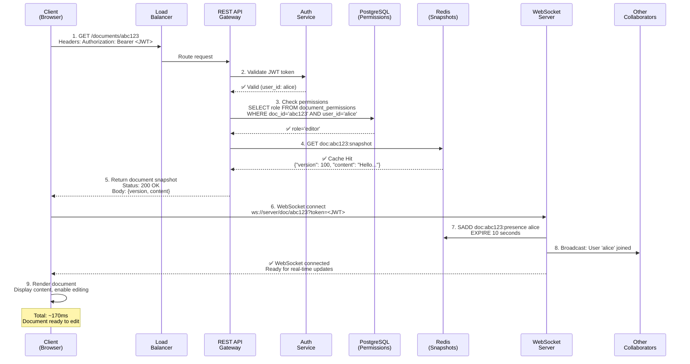
```mermaid
sequenceDiagram
    participant Client as Client<br/>(Browser)
    participant LB as Load<br/>Balancer
    participant API as REST API<br/>Gateway
    participant Auth as Auth<br/>Service
    participant PermDB as PostgreSQL<br/>(Permissions)
    participant Redis as Redis<br/>(Snapshots)
    participant WS as WebSocket<br/>Server
    participant Others as Other<br/>Collaborators

    Client->>LB: 1. GET /documents/abc123<br/>Headers: Authorization: Bearer <JWT>
    LB->>API: Route request
    API->>Auth: 2. Validate JWT token
    Auth-->>API: ✅ Valid (user_id: alice)
    
    API->>PermDB: 3. Check permissions<br/>SELECT role FROM document_permissions<br/>WHERE doc_id='abc123' AND user_id='alice'
    PermDB-->>API: ✅ role='editor'
    
    API->>Redis: 4. GET doc:abc123:snapshot
    Redis-->>API: ✅ Cache Hit<br/>{"version": 100, "content": "Hello..."}
    
    API-->>Client: 5. Return document snapshot<br/>Status: 200 OK<br/>Body: {version, content}
    
    Client->>WS: 6. WebSocket connect<br/>ws://server/doc/abc123?token=<JWT>
    WS->>Redis: 7. SADD doc:abc123:presence alice<br/>EXPIRE 10 seconds
    WS->>Others: 8. Broadcast: User 'alice' joined
    
    WS-->>Client: ✅ WebSocket connected<br/>Ready for real-time updates
    
    Client->>Client: 9. Render document<br/>Display content, enable editing
    
    Note over Client: Total: ~170ms<br/>Document ready to edit
```

---

## 2. Real-Time Edit Propagation

**Flow:**

Shows how a single character insertion propagates from one user to all other collaborators in real-time.

**Steps:**
1. **User Types** (0ms): User types character "X" in browser
2. **Optimistic UI** (< 5ms): Client immediately displays "X" locally (no waiting for server)
3. **Send Operation** (10ms): Client sends operation via WebSocket: `{type: "insert", pos: 42, char: "X"}`
4. **Publish to Kafka** (15ms): WebSocket server publishes to Kafka partition (by doc_id)
5. **OT Worker Consumes** (10ms): OT worker consumes event from Kafka
6. **Transform** (20ms): OT worker checks for concurrent operations, transforms if needed
7. **Persist** (10ms): Append transformed operation to PostgreSQL event log
8. **Update Snapshot** (5ms): Update Redis snapshot (async, doesn't block broadcast)
9. **Broadcast** (15ms): WebSocket server broadcasts to all connected clients
10. **Apply on Clients** (5ms): Other users' clients apply operation and render "X"
11. **Acknowledge** (10ms): Server sends ACK to original client
12. **Total Latency**: ~100ms (from user keystroke to all collaborators seeing it)

**Why Fast:**
- Optimistic UI: User sees change immediately (< 5ms perceived latency)
- In-memory processing: OT transformation in-memory (no disk I/O)
- Async persistence: Snapshot update doesn't block broadcast
- Efficient broadcast: All collaborators on same WebSocket server (no network hops)

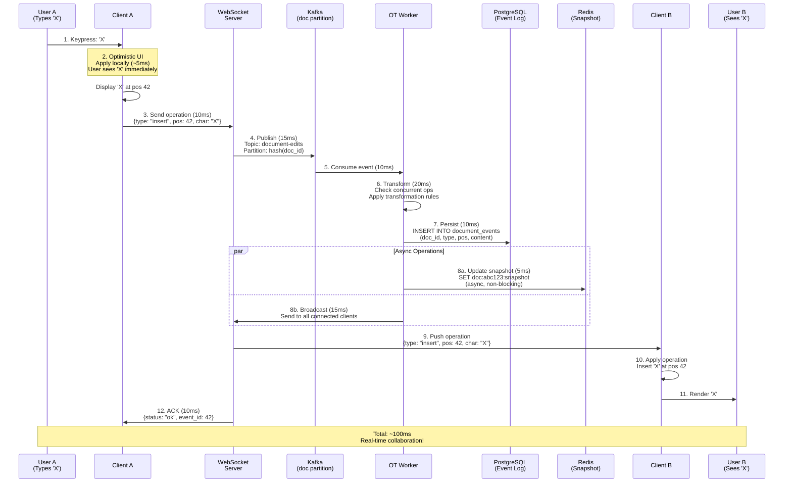
```mermaid
sequenceDiagram
    participant UserA as User A<br/>(Types 'X')
    participant ClientA as Client A
    participant WS as WebSocket<br/>Server
    participant Kafka as Kafka<br/>(doc partition)
    participant OT as OT Worker
    participant PG as PostgreSQL<br/>(Event Log)
    participant Redis as Redis<br/>(Snapshot)
    participant ClientB as Client B
    participant UserB as User B<br/>(Sees 'X')

    UserA->>ClientA: 1. Keypress: 'X'
    
    Note over ClientA: 2. Optimistic UI<br/>Apply locally (~5ms)<br/>User sees 'X' immediately
    ClientA->>ClientA: Display 'X' at pos 42
    
    ClientA->>WS: 3. Send operation (10ms)<br/>{type: "insert", pos: 42, char: "X"}
    
    WS->>Kafka: 4. Publish (15ms)<br/>Topic: document-edits<br/>Partition: hash(doc_id)
    
    Kafka->>OT: 5. Consume event (10ms)
    
    OT->>OT: 6. Transform (20ms)<br/>Check concurrent ops<br/>Apply transformation rules
    
    OT->>PG: 7. Persist (10ms)<br/>INSERT INTO document_events<br/>(doc_id, type, pos, content)
    
    par Async Operations
        OT->>Redis: 8a. Update snapshot (5ms)<br/>SET doc:abc123:snapshot<br/>(async, non-blocking)
    and
        OT->>WS: 8b. Broadcast (15ms)<br/>Send to all connected clients
    end
    
    WS->>ClientB: 9. Push operation<br/>{type: "insert", pos: 42, char: "X"}
    
    ClientB->>ClientB: 10. Apply operation<br/>Insert 'X' at pos 42
    
    ClientB->>UserB: 11. Render 'X'
    
    WS->>ClientA: 12. ACK (10ms)<br/>{status: "ok", event_id: 42}
    
    Note over UserA,UserB: Total: ~100ms<br/>Real-time collaboration!
```

---

## 3. Operational Transformation (OT) Conflict Resolution

**Flow:**

Shows how OT resolves a conflict when two users simultaneously insert characters at the same position.

**Steps:**
1. **Initial State** (T0): Document = "Hello" (version 0)
2. **User A Inserts** (T1): User A inserts "X" at position 5 → "HelloX"
3. **User B Inserts** (T1): User B (simultaneously) inserts "Y" at position 5 → "HelloY"
4. **Server Receives A First** (T2): Server applies User A's operation → "HelloX" (version 1)
5. **Server Receives B** (T3): Detects User B's operation was created at version 0 (stale context)
6. **OT Transformation** (T4): Transform User B's operation against User A's operation:
   - User A inserted at pos 5, so shift User B's position: `pos 5 → pos 6`
   - Transformed operation: `{type: "insert", pos: 6, char: "Y"}`
7. **Apply Transformed** (T5): Server applies transformed operation → "HelloXY" (version 2)
8. **Broadcast to User A**: Send transformed operation for Y
9. **Broadcast to User B**: Send transformed operation for both X and Y (reconcile)
10. **Convergence** (T6): Both users see "HelloXY" (identical state)

**Why OT Works:**
- Central server maintains canonical sequence
- Transformations preserve user intent (both inserts preserved, positions adjusted)
- Deterministic result (all clients converge to same state)

**Performance:**
- Transformation latency: 20-50ms (in-memory processing)
- Total conflict resolution: < 100ms

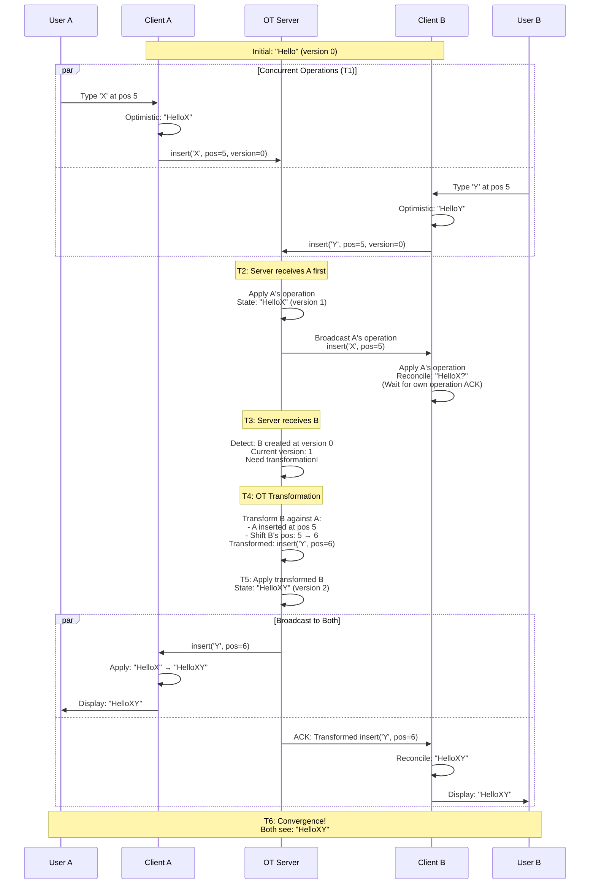
```mermaid
sequenceDiagram
    participant UserA as User A
    participant ClientA as Client A
    participant Server as OT Server
    participant ClientB as Client B
    participant UserB as User B

    Note over ClientA,ClientB: Initial: "Hello" (version 0)

    par Concurrent Operations (T1)
        UserA->>ClientA: Type 'X' at pos 5
        ClientA->>ClientA: Optimistic: "HelloX"
        ClientA->>Server: insert('X', pos=5, version=0)
    and
        UserB->>ClientB: Type 'Y' at pos 5
        ClientB->>ClientB: Optimistic: "HelloY"
        ClientB->>Server: insert('Y', pos=5, version=0)
    end

    Note over Server: T2: Server receives A first

    Server->>Server: Apply A's operation<br/>State: "HelloX" (version 1)
    
    Server->>ClientB: Broadcast A's operation<br/>insert('X', pos=5)
    
    ClientB->>ClientB: Apply A's operation<br/>Reconcile: "HelloX?"<br/>(Wait for own operation ACK)

    Note over Server: T3: Server receives B

    Server->>Server: Detect: B created at version 0<br/>Current version: 1<br/>Need transformation!

    Note over Server: T4: OT Transformation

    Server->>Server: Transform B against A:<br/>- A inserted at pos 5<br/>- Shift B's pos: 5 → 6<br/>Transformed: insert('Y', pos=6)

    Server->>Server: T5: Apply transformed B<br/>State: "HelloXY" (version 2)

    par Broadcast to Both
        Server->>ClientA: insert('Y', pos=6)
        ClientA->>ClientA: Apply: "HelloX" → "HelloXY"
        ClientA->>UserA: Display: "HelloXY"
    and
        Server->>ClientB: ACK: Transformed insert('Y', pos=6)
        ClientB->>ClientB: Reconcile: "HelloXY"
        ClientB->>UserB: Display: "HelloXY"
    end

    Note over UserA,UserB: T6: Convergence!<br/>Both see: "HelloXY"
```

---

## 4. CRDT-Based Offline Sync

**Flow:**

Shows how offline edits are merged when a user reconnects after editing while disconnected.

**Steps:**
1. **Client Online** (T0): User editing document "Hello World" (version 42)
2. **Network Disconnected** (T1): User goes offline (airplane mode, subway, etc.)
3. **Offline Edit** (T2): User inserts "Beautiful " at position 6 → "Hello Beautiful World"
   - Operation stored locally in IndexedDB with CRDT ID: `{siteId: client_a, clock: 1}`
4. **Server Update While Offline** (T3): Another user inserts "Wonderful " at position 6 → Server state: "Hello Wonderful World" (version 43)
5. **Network Reconnected** (T4): User comes back online
6. **Send Offline Operations** (T5): Client sends: `{last_version: 42, operations: [offline_op]}`
7. **Server CRDT Merge** (T6): Server merges client CRDT state with server state:
   - Client op: `insert("Beautiful ", pos=6, id={client_a, clock_1})`
   - Server op: `insert("Wonderful ", pos=6, id={client_b, clock_2})`
   - Merge: Sort by ID → `client_a < client_b` → "Beautiful" before "Wonderful"
   - Result: "Hello Beautiful Wonderful World"
8. **Send Missing Operations** (T7): Server sends operations that happened while client was offline
9. **Client Reconciliation** (T8): Client applies missing operations and reconciles
10. **Convergence** (T9): Both client and server have "Hello Beautiful Wonderful World" (version 44)

**Why CRDT Works for Offline:**
- Operations have globally unique IDs (deterministic ordering)
- Merge is commutative (order of merge doesn't matter)
- No data loss (both edits preserved)

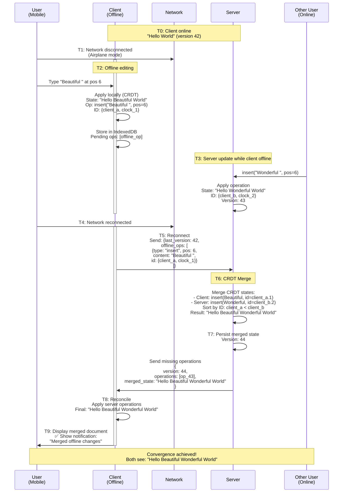
```mermaid
sequenceDiagram
    participant User as User<br/>(Mobile)
    participant Client as Client<br/>(Offline)
    participant Network as Network
    participant Server as Server
    participant OtherUser as Other User<br/>(Online)

    Note over Client,Server: T0: Client online<br/>"Hello World" (version 42)

    User->>Network: T1: Network disconnected<br/>(Airplane mode)
    
    activate Client
    Note over Client: T2: Offline editing

    User->>Client: Type "Beautiful " at pos 6
    Client->>Client: Apply locally (CRDT)<br/>State: "Hello Beautiful World"<br/>Op: insert("Beautiful ", pos=6)<br/>ID: {client_a, clock_1}
    Client->>Client: Store in IndexedDB<br/>Pending ops: [offline_op]

    Note over Server: T3: Server update while client offline

    OtherUser->>Server: insert("Wonderful ", pos=6)
    Server->>Server: Apply operation<br/>State: "Hello Wonderful World"<br/>ID: {client_b, clock_2}<br/>Version: 43

    deactivate Client

    User->>Network: T4: Network reconnected

    activate Client
    Client->>Server: T5: Reconnect<br/>Send: {last_version: 42,<br/>offline_ops: [<br/>  {type: "insert", pos: 6,<br/>   content: "Beautiful ",<br/>   id: {client_a, clock_1}}<br/>]}

    Note over Server: T6: CRDT Merge

    Server->>Server: Merge CRDT states:<br/>- Client: insert(Beautiful, id=client_a.1)<br/>- Server: insert(Wonderful, id=client_b.2)<br/>Sort by ID: client_a < client_b<br/>Result: "Hello Beautiful Wonderful World"

    Server->>Server: T7: Persist merged state<br/>Version: 44

    Server->>Client: Send missing operations<br/>{<br/>  version: 44,<br/>  operations: [op_43],<br/>  merged_state: "Hello Beautiful Wonderful World"<br/>}

    Client->>Client: T8: Reconcile<br/>Apply server operations<br/>Final: "Hello Beautiful Wonderful World"

    Client->>User: T9: Display merged document<br/>✅ Show notification:<br/>"Merged offline changes"

    deactivate Client

    Note over User,OtherUser: Convergence achieved!<br/>Both see: "Hello Beautiful Wonderful World"
```

---

## 5. Document Save and Snapshot Creation

**Flow:**

Shows the periodic snapshot creation process for fast document loading (CQRS pattern).

**Steps:**
1. **Event Threshold** (T0): Document reaches 100 operations since last snapshot
2. **Trigger Snapshot** (T1): OT Worker detects threshold, initiates snapshot creation
3. **Reconstruct State** (T2): Replay last 100 events to compute current document state
4. **Create Snapshot** (T3): Serialize document state (content + metadata)
5. **Write to Redis** (T4): Store snapshot in Redis: `doc:{doc_id}:snapshot` (TTL: 1 hour)
6. **Write to PostgreSQL** (T5): Store snapshot in PostgreSQL `document_snapshots` table
7. **Archive to S3** (T6): Async upload snapshot to S3 for long-term retention
8. **Update Metadata** (T7): Update snapshot version pointer
9. **Complete** (T8): Snapshot creation complete, next 100 operations will trigger new snapshot

**Benefits:**
- **Fast Document Load**: Load snapshot + replay < 100 events (vs millions of events)
- **Reduced Database Load**: 95% of document loads hit Redis cache
- **Version Control**: Snapshots stored permanently in S3

**Performance:**
- Snapshot creation: 50-100ms (doesn't block operations)
- Snapshot load: < 10ms from Redis, 50ms from PostgreSQL, 200ms from S3

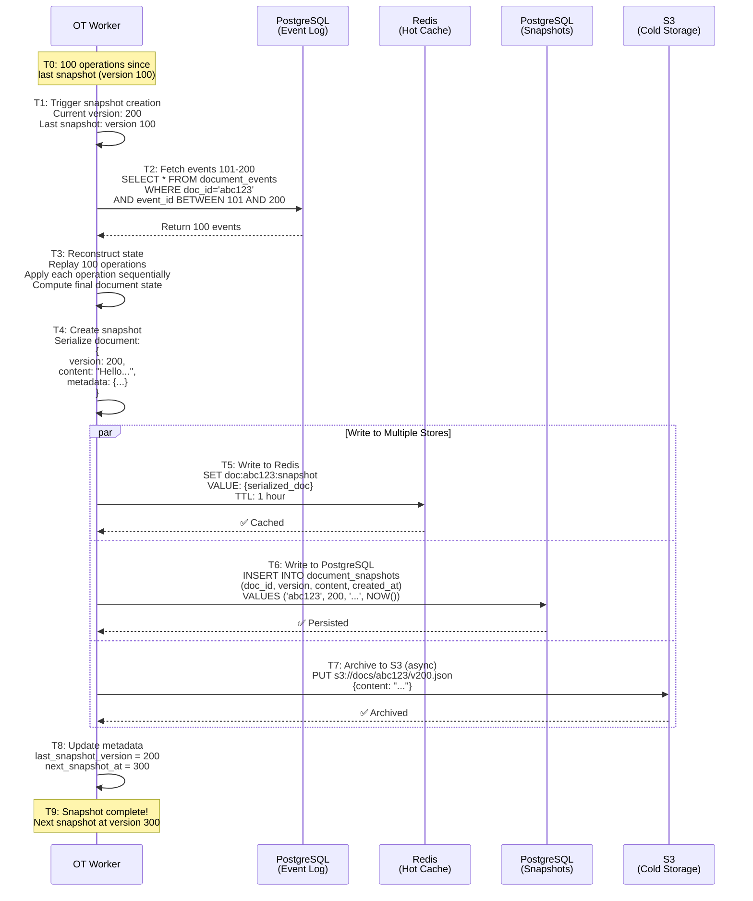
```mermaid
sequenceDiagram
    participant OT as OT Worker
    participant EventLog as PostgreSQL<br/>(Event Log)
    participant Redis as Redis<br/>(Hot Cache)
    participant PGWARM as PostgreSQL<br/>(Snapshots)
    participant S3 as S3<br/>(Cold Storage)

    Note over OT: T0: 100 operations since<br/>last snapshot (version 100)

    OT->>OT: T1: Trigger snapshot creation<br/>Current version: 200<br/>Last snapshot: version 100

    OT->>EventLog: T2: Fetch events 101-200<br/>SELECT * FROM document_events<br/>WHERE doc_id='abc123'<br/>AND event_id BETWEEN 101 AND 200

    EventLog-->>OT: Return 100 events

    OT->>OT: T3: Reconstruct state<br/>Replay 100 operations<br/>Apply each operation sequentially<br/>Compute final document state

    OT->>OT: T4: Create snapshot<br/>Serialize document:<br/>{<br/>  version: 200,<br/>  content: "Hello...",<br/>  metadata: {...}<br/>}

    par Write to Multiple Stores
        OT->>Redis: T5: Write to Redis<br/>SET doc:abc123:snapshot<br/>VALUE: {serialized_doc}<br/>TTL: 1 hour
        Redis-->>OT: ✅ Cached

    and
        OT->>PGWARM: T6: Write to PostgreSQL<br/>INSERT INTO document_snapshots<br/>(doc_id, version, content, created_at)<br/>VALUES ('abc123', 200, '...', NOW())
        PGWARM-->>OT: ✅ Persisted

    and
        OT->>S3: T7: Archive to S3 (async)<br/>PUT s3://docs/abc123/v200.json<br/>{content: "..."}
        S3-->>OT: ✅ Archived
    end

    OT->>OT: T8: Update metadata<br/>last_snapshot_version = 200<br/>next_snapshot_at = 300

    Note over OT: T9: Snapshot complete!<br/>Next snapshot at version 300
```

---

## 6. Cursor Position Broadcast

**Flow:**

Shows how cursor positions are broadcast in real-time to display remote collaborators' cursors.

**Steps:**
1. **User Moves Cursor** (T0): User clicks or navigates to position 42
2. **Throttle Check** (T1): Client checks if 100ms elapsed since last cursor update (throttle to 10/sec)
3. **Send Cursor Event** (T2): Client sends: `{type: "cursor", user_id: "alice", pos: 42, selection: [42, 50]}`
4. **WebSocket Broadcast** (T3): WebSocket server broadcasts to all collaborators (in-memory, no database)
5. **Render Remote Cursor** (T4): Other clients receive cursor position and render colored cursor at position 42
6. **Update Cursor Label** (T5): Display label "Alice" next to cursor

**Optimization:**
- **Throttling**: Max 10 cursor updates/sec per user (prevents spam)
- **No Persistence**: Cursors not stored in database (ephemeral data)
- **In-Memory**: WebSocket server maintains cursor positions in memory (fast)
- **Same-Doc Only**: Only broadcast to clients editing same document

**Performance:**
- Cursor propagation: < 50ms
- Bandwidth: ~100 bytes × 10/sec = 1 KB/sec per user

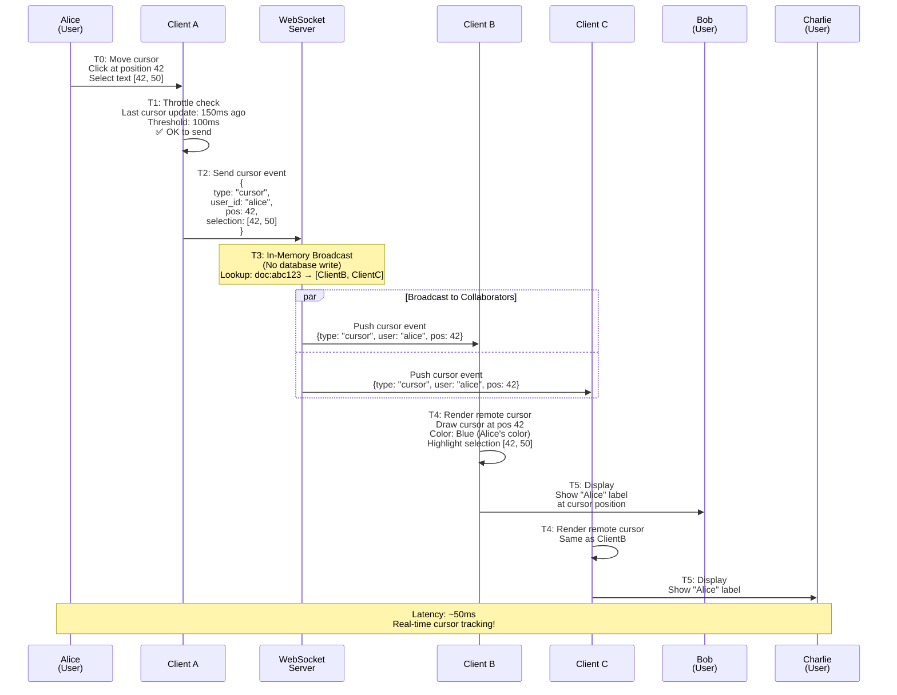
```mermaid
sequenceDiagram
    participant Alice as Alice<br/>(User)
    participant ClientA as Client A
    participant WS as WebSocket<br/>Server
    participant ClientB as Client B
    participant ClientC as Client C
    participant Bob as Bob<br/>(User)
    participant Charlie as Charlie<br/>(User)

    Alice->>ClientA: T0: Move cursor<br/>Click at position 42<br/>Select text [42, 50]

    ClientA->>ClientA: T1: Throttle check<br/>Last cursor update: 150ms ago<br/>Threshold: 100ms<br/>✅ OK to send

    ClientA->>WS: T2: Send cursor event<br/>{<br/>  type: "cursor",<br/>  user_id: "alice",<br/>  pos: 42,<br/>  selection: [42, 50]<br/>}

    Note over WS: T3: In-Memory Broadcast<br/>(No database write)<br/>Lookup: doc:abc123 → [ClientB, ClientC]

    par Broadcast to Collaborators
        WS->>ClientB: Push cursor event<br/>{type: "cursor", user: "alice", pos: 42}
    and
        WS->>ClientC: Push cursor event<br/>{type: "cursor", user: "alice", pos: 42}
    end

    ClientB->>ClientB: T4: Render remote cursor<br/>Draw cursor at pos 42<br/>Color: Blue (Alice's color)<br/>Highlight selection [42, 50]

    ClientB->>Bob: T5: Display<br/>Show "Alice" label<br/>at cursor position

    ClientC->>ClientC: T4: Render remote cursor<br/>Same as ClientB

    ClientC->>Charlie: T5: Display<br/>Show "Alice" label

    Note over Alice,Charlie: Latency: ~50ms<br/>Real-time cursor tracking!
```

---

## 7. User Presence Tracking

**Flow:**

Shows how user presence (online/offline status) is tracked and broadcast to collaborators.

**Steps:**
1. **User Opens Document** (T0): Client establishes WebSocket connection
2. **Add to Presence Set** (T1): Server adds user to Redis set: `doc:{doc_id}:presence` with 10-second TTL
3. **Broadcast Join** (T2): Server broadcasts "user joined" event to all collaborators
4. **Heartbeat Loop** (T3-T6): Client sends heartbeat every 5 seconds to refresh TTL
5. **User Disconnects** (T7): User closes browser or network drops
6. **Heartbeat Stops** (T8): No more heartbeats from client
7. **TTL Expiry** (T9): After 10 seconds, Redis expires user from presence set
8. **Broadcast Leave** (T10): Server detects expiry, broadcasts "user left" event

**Why This Works:**
- **Self-Expiring**: No manual cleanup needed (TTL handles disconnections)
- **Fast Queries**: Redis set operations are O(1)
- **Fault Tolerant**: If client crashes, presence expires automatically after 10 seconds

**Performance:**
- Presence query: < 5ms (Redis SMEMBERS)
- Heartbeat overhead: 100 bytes × 0.2/sec = 20 bytes/sec per user (negligible)

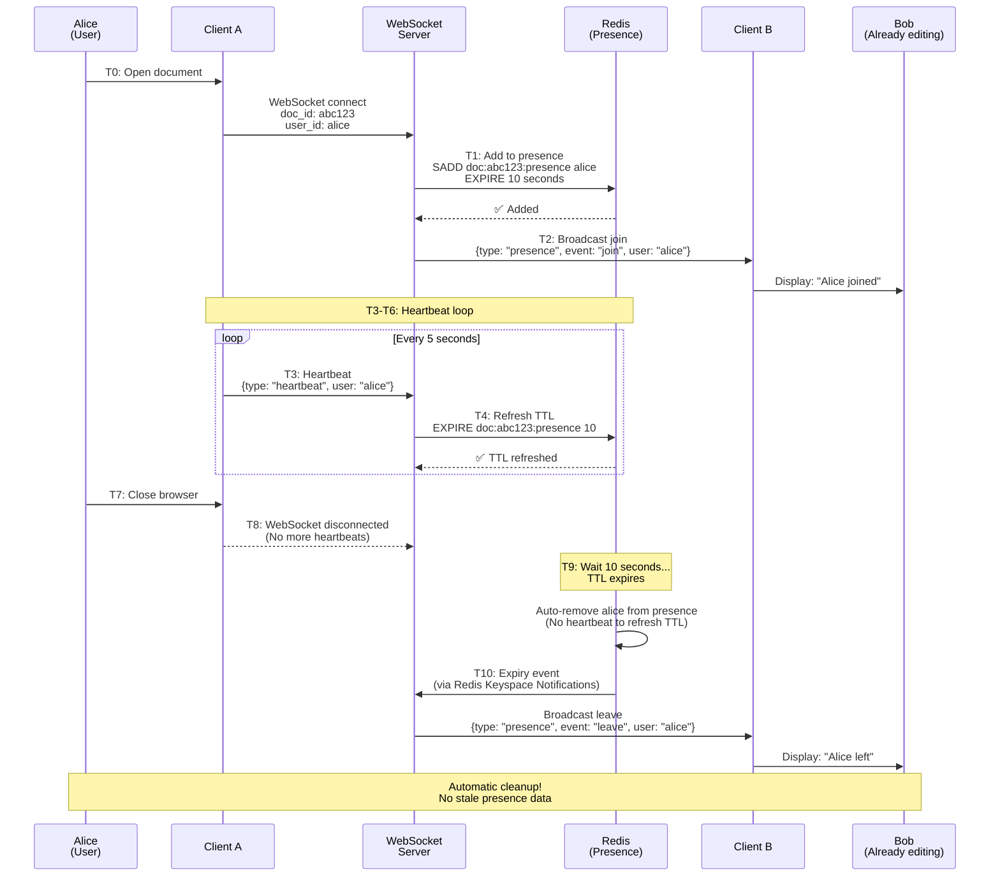
```mermaid
sequenceDiagram
    participant Alice as Alice<br/>(User)
    participant ClientA as Client A
    participant WS as WebSocket<br/>Server
    participant Redis as Redis<br/>(Presence)
    participant ClientB as Client B
    participant Bob as Bob<br/>(Already editing)

    Alice->>ClientA: T0: Open document

    ClientA->>WS: WebSocket connect<br/>doc_id: abc123<br/>user_id: alice

    WS->>Redis: T1: Add to presence<br/>SADD doc:abc123:presence alice<br/>EXPIRE 10 seconds

    Redis-->>WS: ✅ Added

    WS->>ClientB: T2: Broadcast join<br/>{type: "presence", event: "join", user: "alice"}

    ClientB->>Bob: Display: "Alice joined"

    Note over ClientA,Redis: T3-T6: Heartbeat loop

    loop Every 5 seconds
        ClientA->>WS: T3: Heartbeat<br/>{type: "heartbeat", user: "alice"}
        WS->>Redis: T4: Refresh TTL<br/>EXPIRE doc:abc123:presence 10
        Redis-->>WS: ✅ TTL refreshed
    end

    Alice->>ClientA: T7: Close browser

    ClientA-->>WS: T8: WebSocket disconnected<br/>(No more heartbeats)

    Note over Redis: T9: Wait 10 seconds...<br/>TTL expires

    Redis->>Redis: Auto-remove alice from presence<br/>(No heartbeat to refresh TTL)

    Redis->>WS: T10: Expiry event<br/>(via Redis Keyspace Notifications)

    WS->>ClientB: Broadcast leave<br/>{type: "presence", event: "leave", user: "alice"}

    ClientB->>Bob: Display: "Alice left"

    Note over Alice,Bob: Automatic cleanup!<br/>No stale presence data
```

---

## 8. WebSocket Reconnection

**Flow:**

Shows how clients handle WebSocket disconnection and reconnect without data loss.

**Steps:**
1. **Connected** (T0): Client editing document, WebSocket connection active
2. **Network Issue** (T1): Network drops (WiFi disconnect, mobile signal loss)
3. **Detect Disconnection** (T2): Client detects WebSocket close event (or heartbeat timeout after 10 seconds)
4. **Buffer Operations** (T3): User continues typing, operations buffered locally
5. **Reconnection Attempt** (T4): Client attempts reconnection (exponential backoff: 1s, 2s, 4s, 8s)
6. **Establish Connection** (T5): New WebSocket connection established
7. **Send Last Event ID** (T6): Client sends: `{last_event_id: 42, doc_id: abc123}`
8. **Fetch Missed Events** (T7): Server queries Redis cache or Kafka for events 43+
9. **Send Missed Events** (T8): Server sends all operations that happened while client was disconnected
10. **Send Buffered Ops** (T9): Client sends all locally buffered operations
11. **Reconcile** (T10): Client applies missed events, server processes buffered events
12. **Synchronized** (T11): Client and server state synchronized, resume normal operation

**Why This Works:**
- **Client Buffering**: No data loss during disconnection (operations stored locally)
- **Event IDs**: Server knows exactly what client missed (fetch events after last_event_id)
- **Exponential Backoff**: Prevents thundering herd on reconnection

**Performance:**
- Reconnection latency: 1-5 seconds (depending on backoff)
- Sync latency: 50-200ms (depends on number of missed events)

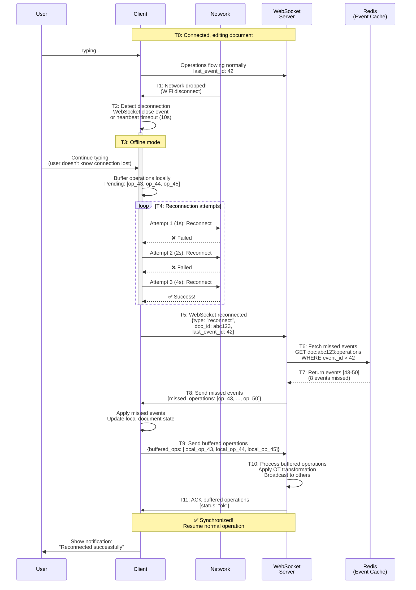
```mermaid
sequenceDiagram
    participant User as User
    participant Client as Client
    participant Network as Network
    participant WS as WebSocket<br/>Server
    participant Redis as Redis<br/>(Event Cache)

    Note over Client,WS: T0: Connected, editing document

    User->>Client: Typing...
    Client->>WS: Operations flowing normally<br/>last_event_id: 42

    Network->>Client: T1: Network dropped!<br/>(WiFi disconnect)

    Client->>Client: T2: Detect disconnection<br/>WebSocket close event<br/>or heartbeat timeout (10s)

    activate Client
    Note over Client: T3: Offline mode

    User->>Client: Continue typing<br/>(user doesn't know connection lost)

    Client->>Client: Buffer operations locally<br/>Pending: [op_43, op_44, op_45]

    loop T4: Reconnection attempts
        Client->>Network: Attempt 1 (1s): Reconnect
        Network-->>Client: ❌ Failed
        Client->>Network: Attempt 2 (2s): Reconnect
        Network-->>Client: ❌ Failed
        Client->>Network: Attempt 3 (4s): Reconnect
        Network-->>Client: ✅ Success!
    end

    deactivate Client

    Client->>WS: T5: WebSocket reconnected<br/>{type: "reconnect",<br/> doc_id: abc123,<br/> last_event_id: 42}

    WS->>Redis: T6: Fetch missed events<br/>GET doc:abc123:operations<br/>WHERE event_id > 42

    Redis-->>WS: T7: Return events [43-50]<br/>(8 events missed)

    WS->>Client: T8: Send missed events<br/>{missed_operations: [op_43, ..., op_50]}

    Client->>Client: Apply missed events<br/>Update local document state

    Client->>WS: T9: Send buffered operations<br/>{buffered_ops: [local_op_43, local_op_44, local_op_45]}

    WS->>WS: T10: Process buffered operations<br/>Apply OT transformation<br/>Broadcast to others

    WS->>Client: T11: ACK buffered operations<br/>{status: "ok"}

    Note over Client,WS: ✅ Synchronized!<br/>Resume normal operation

    Client->>User: Show notification:<br/>"Reconnected successfully"
```

---

## 9. Document Permission Check

**Flow:**

Shows how document permissions are enforced on every operation.

**Steps:**
1. **User Action** (T0): User attempts to edit document (insert character)
2. **Client Check** (T1): Client checks cached permissions (editor role required)
3. **Send Operation** (T2): Client sends operation to server
4. **Server Permission Check** (T3): Server queries PostgreSQL for user's role
5. **Authorization** (T4): Verify user has 'editor' or 'owner' role (viewers can't edit)
6. **If Authorized** (T5a): Process operation normally (OT, persist, broadcast)
7. **If Unauthorized** (T5b): Reject operation with error
8. **Client Handles Rejection** (T6): Revert local optimistic update, show error message

**Permission Levels:**
- **Owner**: Full access (edit, comment, share, delete)
- **Editor**: Can edit and comment
- **Commenter**: Can only comment (no edits)
- **Viewer**: Read-only (no edits, no comments)

**Performance:**
- Permission check: < 10ms (PostgreSQL indexed query)
- Cached on client (check every 5 minutes, not every operation)

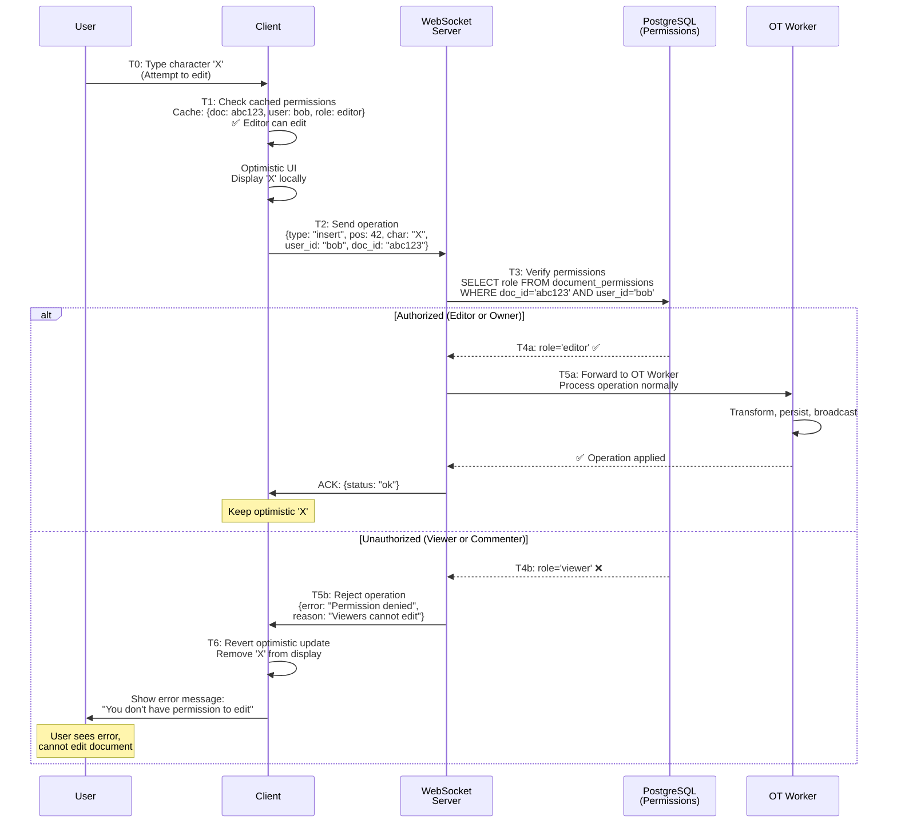
```mermaid
sequenceDiagram
    participant User as User
    participant Client as Client
    participant WS as WebSocket<br/>Server
    participant PermDB as PostgreSQL<br/>(Permissions)
    participant OT as OT Worker

    User->>Client: T0: Type character 'X'<br/>(Attempt to edit)

    Client->>Client: T1: Check cached permissions<br/>Cache: {doc: abc123, user: bob, role: editor}<br/>✅ Editor can edit

    Client->>Client: Optimistic UI<br/>Display 'X' locally

    Client->>WS: T2: Send operation<br/>{type: "insert", pos: 42, char: "X",<br/> user_id: "bob", doc_id: "abc123"}

    WS->>PermDB: T3: Verify permissions<br/>SELECT role FROM document_permissions<br/>WHERE doc_id='abc123' AND user_id='bob'

    alt Authorized (Editor or Owner)
        PermDB-->>WS: T4a: role='editor' ✅

        WS->>OT: T5a: Forward to OT Worker<br/>Process operation normally

        OT->>OT: Transform, persist, broadcast

        OT-->>WS: ✅ Operation applied

        WS->>Client: ACK: {status: "ok"}

        Note over Client: Keep optimistic 'X'

    else Unauthorized (Viewer or Commenter)
        PermDB-->>WS: T4b: role='viewer' ❌

        WS->>Client: T5b: Reject operation<br/>{error: "Permission denied",<br/> reason: "Viewers cannot edit"}

        Client->>Client: T6: Revert optimistic update<br/>Remove 'X' from display

        Client->>User: Show error message:<br/>"You don't have permission to edit"

        Note over User: User sees error,<br/>cannot edit document
    end
```

---

## 10. Version History Retrieval

**Flow:**

Shows how users view and restore previous versions of a document.

**Steps:**
1. **User Requests History** (T0): User clicks "View Version History"
2. **Query Snapshots** (T1): Client requests list of snapshots from server
3. **Fetch Snapshot List** (T2): Server queries PostgreSQL `document_snapshots` table
4. **Return Snapshot List** (T3): Server returns list of versions with timestamps
5. **User Selects Version** (T4): User clicks on specific version (e.g., "Version 100 - 2 hours ago")
6. **Fetch Snapshot** (T5): Client requests full snapshot for version 100
7. **Load from S3** (T6): Server loads snapshot from S3 cold storage (if not in Redis/PostgreSQL)
8. **Return Snapshot** (T7): Server returns full document state at version 100
9. **Display Preview** (T8): Client displays read-only preview of version 100
10. **User Restores** (T9): User clicks "Restore this version"
11. **Create Restore Operation** (T10): Server creates new operation: "Restore to version 100"
12. **Apply Restore** (T11): Server applies restore, broadcasts to all collaborators

**Benefits:**
- **Audit Trail**: Complete history preserved (compliance)
- **Undo/Redo**: Restore any previous version
- **Collaboration**: See who made what changes when

**Performance:**
- Snapshot list: 50ms (PostgreSQL query)
- Snapshot load (S3): 200-500ms (cold storage)
- Snapshot load (Redis): < 10ms (hot cache)

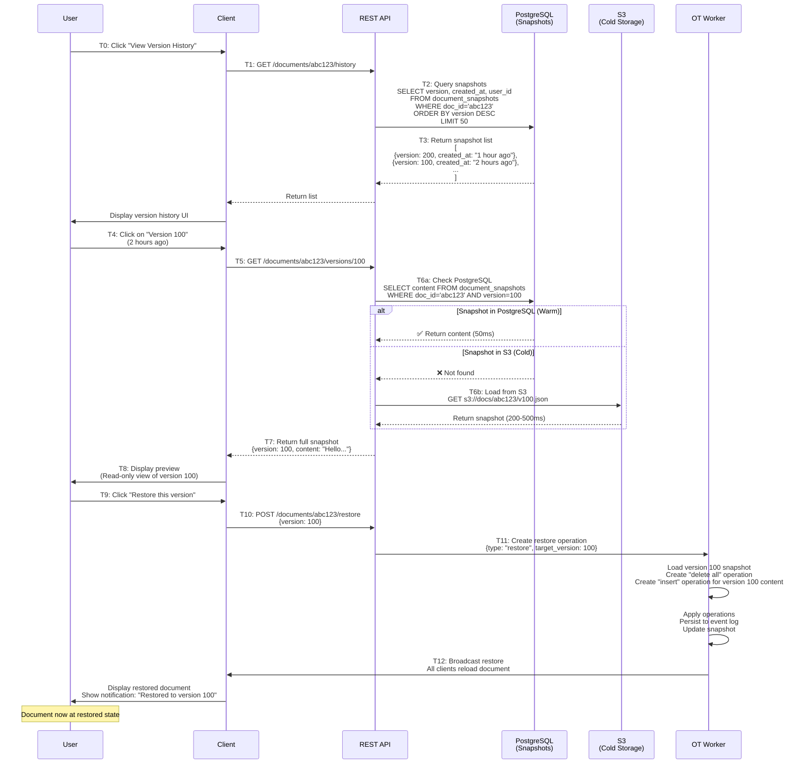
```mermaid
sequenceDiagram
    participant User as User
    participant Client as Client
    participant API as REST API
    participant PG as PostgreSQL<br/>(Snapshots)
    participant S3 as S3<br/>(Cold Storage)
    participant OT as OT Worker

    User->>Client: T0: Click "View Version History"

    Client->>API: T1: GET /documents/abc123/history

    API->>PG: T2: Query snapshots<br/>SELECT version, created_at, user_id<br/>FROM document_snapshots<br/>WHERE doc_id='abc123'<br/>ORDER BY version DESC<br/>LIMIT 50

    PG-->>API: T3: Return snapshot list<br/>[<br/>  {version: 200, created_at: "1 hour ago"},<br/>  {version: 100, created_at: "2 hours ago"},<br/>  ...<br/>]

    API-->>Client: Return list

    Client->>User: Display version history UI

    User->>Client: T4: Click on "Version 100"<br/>(2 hours ago)

    Client->>API: T5: GET /documents/abc123/versions/100

    API->>PG: T6a: Check PostgreSQL<br/>SELECT content FROM document_snapshots<br/>WHERE doc_id='abc123' AND version=100

    alt Snapshot in PostgreSQL (Warm)
        PG-->>API: ✅ Return content (50ms)
    else Snapshot in S3 (Cold)
        PG-->>API: ❌ Not found
        API->>S3: T6b: Load from S3<br/>GET s3://docs/abc123/v100.json
        S3-->>API: Return snapshot (200-500ms)
    end

    API-->>Client: T7: Return full snapshot<br/>{version: 100, content: "Hello..."}

    Client->>User: T8: Display preview<br/>(Read-only view of version 100)

    User->>Client: T9: Click "Restore this version"

    Client->>API: T10: POST /documents/abc123/restore<br/>{version: 100}

    API->>OT: T11: Create restore operation<br/>{type: "restore", target_version: 100}

    OT->>OT: Load version 100 snapshot<br/>Create "delete all" operation<br/>Create "insert" operation for version 100 content

    OT->>OT: Apply operations<br/>Persist to event log<br/>Update snapshot

    OT->>Client: T12: Broadcast restore<br/>All clients reload document

    Client->>User: Display restored document<br/>Show notification: "Restored to version 100"

    Note over User: Document now at restored state
```

---

## 11. OT Worker Failure and Recovery

**Flow:**

Shows how the system handles OT worker failure without data loss.

**Steps:**
1. **Normal Operation** (T0): OT Worker 1 processing operations for documents 1-10k
2. **Worker Crashes** (T1): OT Worker 1 crashes (process killed, out of memory, etc.)
3. **Kafka Consumer Group Rebalance** (T2): Kafka detects consumer (OT Worker 1) is down
4. **Reassign Partitions** (T3): Kafka reassigns partitions to remaining workers
5. **OT Worker 2 Takes Over** (T4): OT Worker 2 now handles both its original partitions and Worker 1's partitions
6. **Resume from Checkpoint** (T5): Worker 2 resumes processing from last committed offset
7. **Idempotent Processing** (T6): Worker 2 may reprocess last few events (idempotent, safe)
8. **Broadcast Queued Operations** (T7): Worker 2 broadcasts all queued operations to clients
9. **Clients Receive Operations** (T8): Clients receive operations (slight delay, but no data loss)
10. **New Worker Starts** (T9): Auto-scaling starts new OT Worker to replace crashed worker
11. **Rebalance Again** (T10): Kafka rebalances partitions across all workers
12. **Normal Operation Restored** (T11): System back to normal with proper load distribution

**Why No Data Loss:**
- **Kafka Persistence**: Operations persisted in Kafka (survive worker crash)
- **Consumer Groups**: Automatic partition reassignment
- **Idempotent Operations**: Safe to reprocess (same result)
- **At-Least-Once Delivery**: Guaranteed delivery (no message loss)

**Recovery Time:**
- Detection: 10-30 seconds (Kafka session timeout)
- Rebalance: 10-30 seconds (reassign partitions)
- **Total**: 20-60 seconds (clients see brief delay)

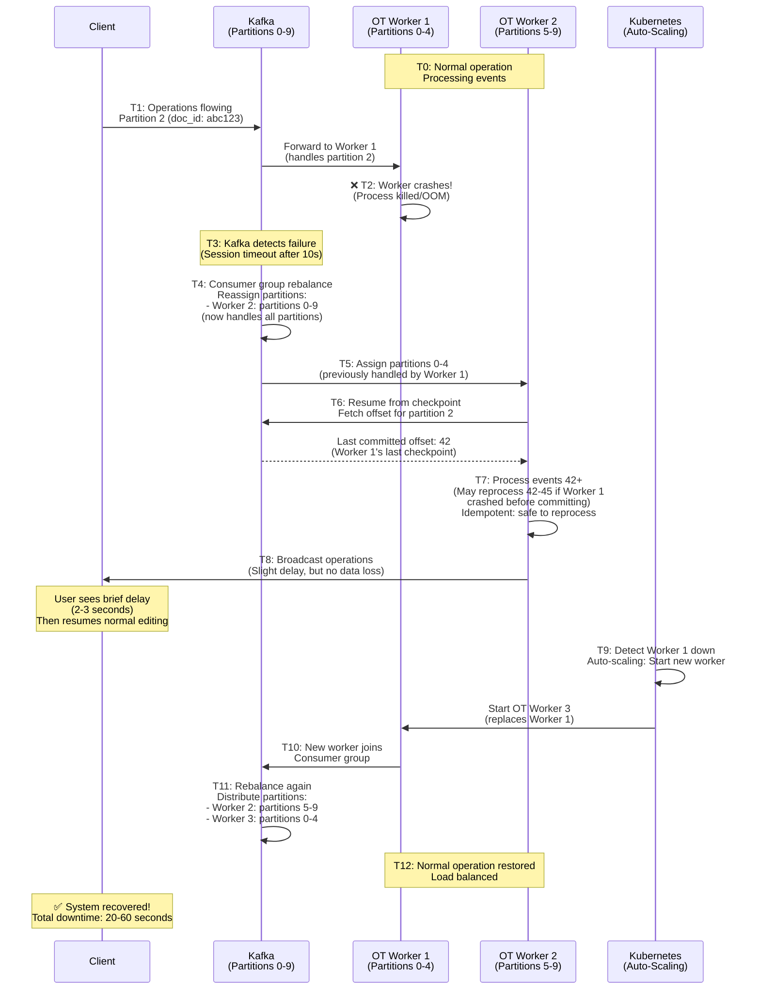
```mermaid
sequenceDiagram
    participant Client as Client
    participant Kafka as Kafka<br/>(Partitions 0-9)
    participant Worker1 as OT Worker 1<br/>(Partitions 0-4)
    participant Worker2 as OT Worker 2<br/>(Partitions 5-9)
    participant K8s as Kubernetes<br/>(Auto-Scaling)

    Note over Worker1,Worker2: T0: Normal operation<br/>Processing events

    Client->>Kafka: T1: Operations flowing<br/>Partition 2 (doc_id: abc123)

    Kafka->>Worker1: Forward to Worker 1<br/>(handles partition 2)

    Worker1->>Worker1: ❌ T2: Worker crashes!<br/>(Process killed/OOM)

    Note over Kafka: T3: Kafka detects failure<br/>(Session timeout after 10s)

    Kafka->>Kafka: T4: Consumer group rebalance<br/>Reassign partitions:<br/>- Worker 2: partitions 0-9<br/>(now handles all partitions)

    Kafka->>Worker2: T5: Assign partitions 0-4<br/>(previously handled by Worker 1)

    Worker2->>Kafka: T6: Resume from checkpoint<br/>Fetch offset for partition 2

    Kafka-->>Worker2: Last committed offset: 42<br/>(Worker 1's last checkpoint)

    Worker2->>Worker2: T7: Process events 42+<br/>(May reprocess 42-45 if Worker 1<br/>crashed before committing)<br/>Idempotent: safe to reprocess

    Worker2->>Client: T8: Broadcast operations<br/>(Slight delay, but no data loss)

    Note over Client: User sees brief delay<br/>(2-3 seconds)<br/>Then resumes normal editing

    K8s->>K8s: T9: Detect Worker 1 down<br/>Auto-scaling: Start new worker

    K8s->>Worker1: Start OT Worker 3<br/>(replaces Worker 1)

    Worker1->>Kafka: T10: New worker joins<br/>Consumer group

    Kafka->>Kafka: T11: Rebalance again<br/>Distribute partitions:<br/>- Worker 2: partitions 5-9<br/>- Worker 3: partitions 0-4

    Note over Worker1,Worker2: T12: Normal operation restored<br/>Load balanced

    Note over Client: ✅ System recovered!<br/>Total downtime: 20-60 seconds
```

---

## 12. Database Failover

**Flow:**

Shows how the system handles PostgreSQL primary database failure with automatic failover to replica.

**Steps:**
1. **Normal Operation** (T0): PostgreSQL primary handling writes, replica replicating
2. **Primary Failure** (T1): Primary database crashes (hardware failure, network partition)
3. **Health Check Failure** (T2): Load balancer detects primary is down (TCP health check fails)
4. **Failover Decision** (T3): HA (High Availability) controller decides to promote replica
5. **Promote Replica** (T4): Replica promoted to primary (accepts writes)
6. **Update DNS** (T5): DNS updated to point to new primary
7. **OT Workers Reconnect** (T6): OT workers reconnect to new primary
8. **Buffer Writes in Kafka** (T7): Operations buffered in Kafka during failover (no data loss)
9. **Resume Writes** (T8): OT workers resume writing to new primary
10. **Process Buffered Operations** (T9): Process all buffered operations from Kafka
11. **Normal Operation** (T10): System fully recovered, new primary handling writes

**Why No Data Loss:**
- **Synchronous Replication**: Primary waits for replica ACK before committing (0 data loss)
- **Kafka Buffering**: Operations queued in Kafka during failover
- **Idempotent Writes**: Safe to retry writes

**Recovery Time:**
- Detection: 10-30 seconds (health check timeout)
- Promotion: 10-20 seconds (promote replica)
- **Total RTO**: 20-50 seconds

**Recovery Point:**
- **RPO**: 0 seconds (synchronous replication, no data loss)

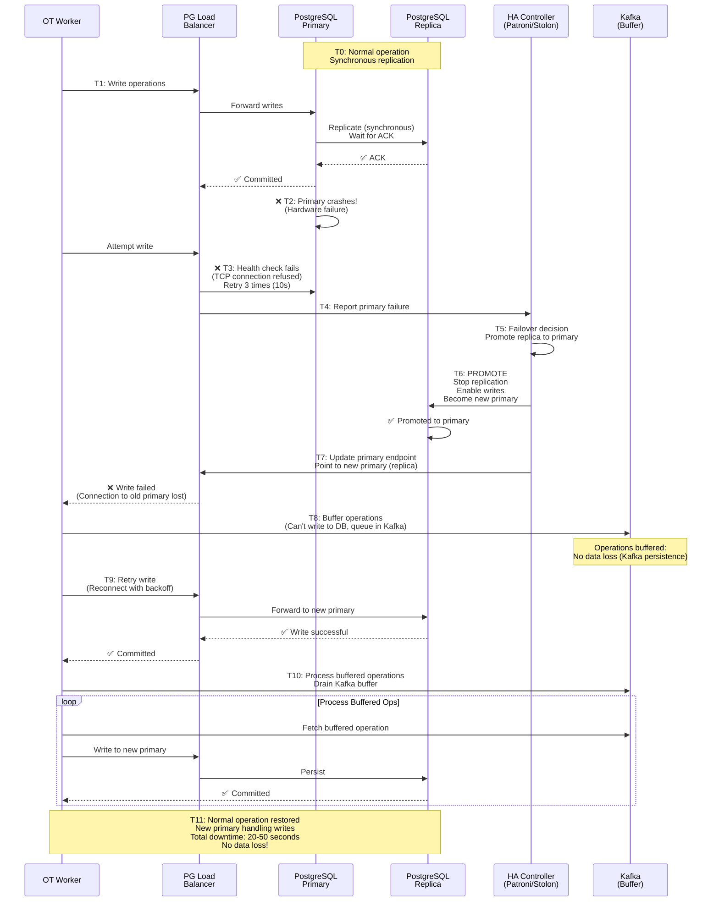
```mermaid
sequenceDiagram
    participant OT as OT Worker
    participant LB as PG Load<br/>Balancer
    participant Primary as PostgreSQL<br/>Primary
    participant Replica as PostgreSQL<br/>Replica
    participant HA as HA Controller<br/>(Patroni/Stolon)
    participant Kafka as Kafka<br/>(Buffer)

    Note over Primary,Replica: T0: Normal operation<br/>Synchronous replication

    OT->>LB: T1: Write operations

    LB->>Primary: Forward writes

    Primary->>Replica: Replicate (synchronous)<br/>Wait for ACK

    Replica-->>Primary: ✅ ACK

    Primary-->>LB: ✅ Committed

    Primary->>Primary: ❌ T2: Primary crashes!<br/>(Hardware failure)

    OT->>LB: Attempt write

    LB->>Primary: ❌ T3: Health check fails<br/>(TCP connection refused)<br/>Retry 3 times (10s)

    LB->>HA: T4: Report primary failure

    HA->>HA: T5: Failover decision<br/>Promote replica to primary

    HA->>Replica: T6: PROMOTE<br/>Stop replication<br/>Enable writes<br/>Become new primary

    Replica->>Replica: ✅ Promoted to primary

    HA->>LB: T7: Update primary endpoint<br/>Point to new primary (replica)

    LB-->>OT: ❌ Write failed<br/>(Connection to old primary lost)

    OT->>Kafka: T8: Buffer operations<br/>(Can't write to DB, queue in Kafka)

    Note over Kafka: Operations buffered:<br/>No data loss (Kafka persistence)

    OT->>LB: T9: Retry write<br/>(Reconnect with backoff)

    LB->>Replica: Forward to new primary

    Replica-->>LB: ✅ Write successful

    LB-->>OT: ✅ Committed

    OT->>Kafka: T10: Process buffered operations<br/>Drain Kafka buffer

    loop Process Buffered Ops
        OT->>Kafka: Fetch buffered operation
        OT->>LB: Write to new primary
        LB->>Replica: Persist
        Replica-->>OT: ✅ Committed
    end

    Note over OT,Replica: T11: Normal operation restored<br/>New primary handling writes<br/>Total downtime: 20-50 seconds<br/>No data loss!
```

---

## 13. Multi-User Formatting Conflict

**Flow:**

Shows how concurrent formatting operations (bold, italic) are resolved.

**Steps:**
1. **Initial State** (T0): Text "Hello" with no formatting
2. **User A Applies Bold** (T1): User A selects range [0, 5] and applies bold
3. **User B Applies Italic** (T2): User B (simultaneously) selects range [0, 5] and applies italic
4. **Server Receives Both** (T3): Server receives both formatting operations
5. **Commutative Merge** (T4): Formatting operations are commutative (order doesn't matter)
6. **Apply Both** (T5): Server applies both: `{bold: true, italic: true}`
7. **Broadcast** (T6): Broadcast both formatting operations to all clients
8. **Final State** (T7): All clients see "Hello" with both bold and italic applied

**Why This Works:**
- **Commutative**: `bold(italic(text)) = italic(bold(text))`
- **Attribute Merge**: Attributes are merged (not overwritten)
- **No Transformation Needed**: Unlike position-based operations, formatting is range-based (no position shift)

**Edge Case: Conflicting Formats:**
- User A sets color to red, User B sets color to blue
- **Solution**: Last-write-wins with Lamport timestamp (tie-breaker: user_id)

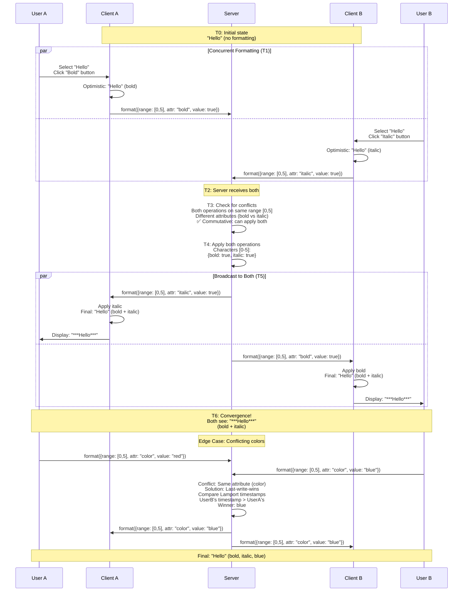
```mermaid
sequenceDiagram
    participant UserA as User A
    participant ClientA as Client A
    participant Server as Server
    participant ClientB as Client B
    participant UserB as User B

    Note over ClientA,ClientB: T0: Initial state<br/>"Hello" (no formatting)

    par Concurrent Formatting (T1)
        UserA->>ClientA: Select "Hello"<br/>Click "Bold" button
        ClientA->>ClientA: Optimistic: "Hello" (bold)
        ClientA->>Server: format({range: [0,5], attr: "bold", value: true})
    and
        UserB->>ClientB: Select "Hello"<br/>Click "Italic" button
        ClientB->>ClientB: Optimistic: "Hello" (italic)
        ClientB->>Server: format({range: [0,5], attr: "italic", value: true})
    end

    Note over Server: T2: Server receives both

    Server->>Server: T3: Check for conflicts<br/>Both operations on same range [0,5]<br/>Different attributes (bold vs italic)<br/>✅ Commutative: can apply both

    Server->>Server: T4: Apply both operations<br/>Characters [0-5]:<br/>  {bold: true, italic: true}

    par Broadcast to Both (T5)
        Server->>ClientA: format({range: [0,5], attr: "italic", value: true})
        ClientA->>ClientA: Apply italic<br/>Final: "Hello" (bold + italic)
        ClientA->>UserA: Display: "***Hello***"
    and
        Server->>ClientB: format({range: [0,5], attr: "bold", value: true})
        ClientB->>ClientB: Apply bold<br/>Final: "Hello" (bold + italic)
        ClientB->>UserB: Display: "***Hello***"
    end

    Note over UserA,UserB: T6: Convergence!<br/>Both see: "***Hello***"<br/>(bold + italic)

    Note over Server: Edge Case: Conflicting colors

    UserA->>Server: format({range: [0,5], attr: "color", value: "red"})
    UserB->>Server: format({range: [0,5], attr: "color", value: "blue"})

    Server->>Server: Conflict: Same attribute (color)<br/>Solution: Last-write-wins<br/>Compare Lamport timestamps<br/>UserB's timestamp > UserA's<br/>Winner: blue

    Server->>ClientA: format({range: [0,5], attr: "color", value: "blue"})
    Server->>ClientB: format({range: [0,5], attr: "color", value: "blue"})

    Note over UserA,UserB: Final: "Hello" (bold, italic, blue)
```

---

## 14. Rate Limiting

**Flow:**

Shows how rate limiting is enforced to prevent abuse.

**Steps:**
1. **User Edits Rapidly** (T0): User sends 150 operations/second (above limit)
2. **Rate Limit Check** (T1): WebSocket server checks Redis rate limit counter
3. **Increment Counter** (T2): Redis increments counter for user (key: `ratelimit:{user_id}`)
4. **Check Threshold** (T3): Counter = 100, threshold = 100 ops/sec
5. **Allow Operations 1-100** (T4): Operations 1-100 processed normally
6. **Reject Operations 101-150** (T5): Operations 101-150 rejected with error
7. **Client Receives Error** (T6): Client receives rate limit error
8. **Backoff Strategy** (T7): Client implements exponential backoff (wait before retrying)
9. **Show User Notification** (T8): Display notification: "Editing too quickly, please slow down"

**Rate Limits:**
- **Per User**: 100 operations/sec (prevents spam)
- **Per Document**: 1000 operations/sec total (prevents single doc overload)
- **Per IP**: 1000 requests/sec (DDoS protection)

**Implementation (Token Bucket):**
```
Redis Key: ratelimit:{user_id}
Value: 100 (tokens available)
TTL: 1 second (refill rate)

Algorithm:
1. Check tokens available
2. If tokens > 0: Allow, decrement
3. If tokens = 0: Reject
4. Refill tokens every second
```

**Why This Works:**
- **Prevents Abuse**: Blocks malicious users or bots
- **Fair Usage**: Ensures resources available for all users
- **Graceful Degradation**: System doesn't crash, just rejects excess

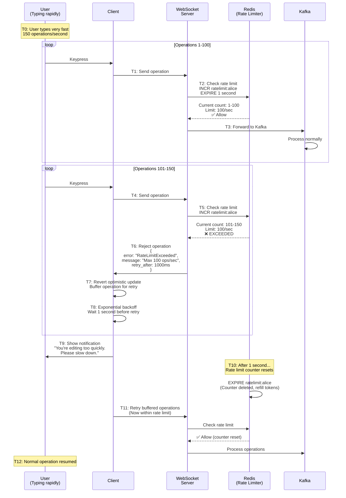
```mermaid
sequenceDiagram
    participant User as User<br/>(Typing rapidly)
    participant Client as Client
    participant WS as WebSocket<br/>Server
    participant Redis as Redis<br/>(Rate Limiter)
    participant Kafka as Kafka

    Note over User: T0: User types very fast<br/>150 operations/second

    loop Operations 1-100
        User->>Client: Keypress
        Client->>WS: T1: Send operation #1-100
        WS->>Redis: T2: Check rate limit<br/>INCR ratelimit:alice<br/>EXPIRE 1 second
        Redis-->>WS: Current count: 1-100<br/>Limit: 100/sec<br/>✅ Allow
        WS->>Kafka: T3: Forward to Kafka
        Kafka->>Kafka: Process normally
    end

    loop Operations 101-150
        User->>Client: Keypress
        Client->>WS: T4: Send operation #101-150
        WS->>Redis: T5: Check rate limit<br/>INCR ratelimit:alice
        Redis-->>WS: Current count: 101-150<br/>Limit: 100/sec<br/>❌ EXCEEDED
        WS->>Client: T6: Reject operation<br/>{<br/>  error: "RateLimitExceeded",<br/>  message: "Max 100 ops/sec",<br/>  retry_after: 1000ms<br/>}
        Client->>Client: T7: Revert optimistic update<br/>Buffer operation for retry
        Client->>Client: T8: Exponential backoff<br/>Wait 1 second before retry
    end

    Client->>User: T9: Show notification<br/>"You're editing too quickly.<br/>Please slow down."

    Note over Redis: T10: After 1 second...<br/>Rate limit counter resets

    Redis->>Redis: EXPIRE ratelimit:alice<br/>(Counter deleted, refill tokens)

    Client->>WS: T11: Retry buffered operations<br/>(Now within rate limit)

    WS->>Redis: Check rate limit
    Redis-->>WS: ✅ Allow (counter reset)

    WS->>Kafka: Process operations

    Note over User: T12: Normal operation resumed
```