# Online Code Judge - High-Level Design Diagrams

This document contains high-level design diagrams for the Online Code Judge system, including system architecture,
execution pipeline, sandboxing architecture, and scaling strategies.

---

## Table of Contents

1. [System Architecture Overview](#1-system-architecture-overview)
2. [Submission Flow Pipeline](#2-submission-flow-pipeline)
3. [Docker Sandboxing Architecture](#3-docker-sandboxing-architecture)
4. [Security Layers (Defense in Depth)](#4-security-layers-defense-in-depth)
5. [Queue-Based Asynchronous Architecture](#5-queue-based-asynchronous-architecture)
6. [Judge Worker Execution Pipeline](#6-judge-worker-execution-pipeline)
7. [Auto-Scaling Strategy](#7-auto-scaling-strategy)
8. [Test Case Distribution](#8-test-case-distribution)
9. [Real-Time Status Updates](#9-real-time-status-updates)
10. [Language Runtime Architecture](#10-language-runtime-architecture)
11. [Failure Recovery Flow](#11-failure-recovery-flow)
12. [Multi-Region Deployment](#12-multi-region-deployment)

---

## 1. System Architecture Overview

**Flow Explanation:**

This diagram shows the complete end-to-end architecture of the online code judge system, from client submission to
result delivery.

**Layers:**

1. **Client Layer**: Web UI, mobile apps, CLI tools for code submission
2. **API Gateway**: Authentication, rate limiting, request validation
3. **Submission Service**: Code validation, metadata storage, queue publishing
4. **Message Queue**: Kafka topics for buffering submissions (decouples submission from execution)
5. **Execution Layer**: Judge Manager and Worker fleet for code execution
6. **Sandboxed Execution**: Docker containers with security layers (seccomp, AppArmor, cgroups)
7. **Persistence**: PostgreSQL (metadata), Redis (cache), S3 (test cases)

**Key Design Decisions:**

- Queue-based for absorbing traffic spikes (10x during contests)
- Docker containers for lightweight sandboxing (< 1 second startup)
- Auto-scaling workers based on queue depth (not CPU)
- Multi-layer security (defense in depth)

**Performance:**

- Submission to queue: < 100ms
- Queue to execution: < 2 seconds (queue wait)
- Execution: 1-10 seconds (depends on code complexity)
- Result delivery: < 200ms (Redis cache)

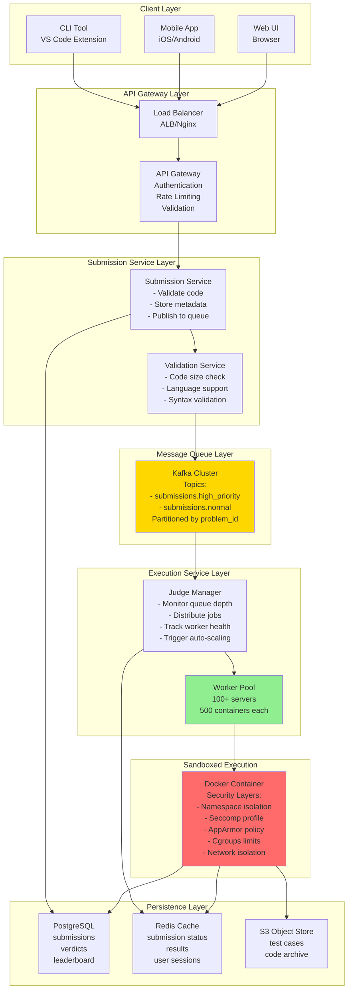

---

## 2. Submission Flow Pipeline

**Flow Explanation:**

This diagram illustrates the complete submission flow from user clicking "Submit" to receiving verdict.

**Steps:**

1. **User Submits**: Code submitted via Web UI (POST /api/submit)
2. **API Gateway**: Validates authentication (JWT), rate limit check (100 submissions/hour)
3. **Submission Service**: Validates code size (< 64 KB), language support, stores in PostgreSQL
4. **Queue Publish**: Publishes to Kafka topic (high_priority or normal)
5. **Queue Wait**: Submission waits in queue (average 2 seconds during normal load)
6. **Worker Pickup**: Judge Manager assigns to available worker
7. **Container Creation**: Worker creates Docker container with security policies (800ms)
8. **Compilation**: Compile code if needed (Java/C++: 500ms, Python: skip)
9. **Execution**: Run against test cases (2-5 seconds)
10. **Verdict**: Compare output, determine AC/WA/TLE/MLE/RE/CE
11. **Result Write**: Update PostgreSQL and Redis (50ms)
12. **Client Notification**: WebSocket push or polling returns result

**Total Latency:**

- Best case (Hello World): 2 seconds
- Average case: 6 seconds
- Worst case (complex code): 15 seconds

```mermaid
graph LR
    subgraph ClientSide["Client Side"]
        User["User<br/>Clicks Submit"]
        UI["Web UI<br/>Code Editor"]
    end

    subgraph Validation["Validation Pipeline"]
        Auth["Authentication<br/>JWT Validation"]
        RateLimit["Rate Limit<br/>100 submissions/hour"]
        CodeValidation["Code Validation<br/>Size: < 64 KB<br/>Language: Whitelist<br/>Syntax: Basic check"]
    end

    subgraph Storage["Metadata Storage"]
        CreateRecord["Create Submission<br/>status: Queued<br/>PostgreSQL INSERT"]
    end

    subgraph Queue["Queue Layer"]
        QueuePublish["Publish to Kafka<br/>topic: submissions.normal<br/>partition: hash problem_id"]
        QueueWait["Queue Wait<br/>avg: 2 seconds<br/>peak: 10 seconds"]
    end

    subgraph Execution["Execution Pipeline"]
        ManagerAssign["Judge Manager<br/>Assign to Worker"]
        WorkerPickup["Worker Pickup<br/>Kafka Consumer"]
        ContainerCreate["Create Container<br/>800ms startup"]
        Compile["Compile Code<br/>if needed"]
        Execute["Execute Tests<br/>2-5 seconds"]
        Judge["Compare Output<br/>Determine Verdict"]
    end

    subgraph Results["Result Delivery"]
        UpdateDB["Update DB<br/>verdict, runtime<br/>memory usage"]
        UpdateCache["Update Redis<br/>submission:id"]
        Notify["Notify Client<br/>WebSocket or Polling"]
    end

    User --> UI
    UI --> Auth
    Auth --> RateLimit
    RateLimit --> CodeValidation
    CodeValidation --> CreateRecord
    CreateRecord --> QueuePublish
    QueuePublish --> QueueWait
    QueueWait --> ManagerAssign
    ManagerAssign --> WorkerPickup
    WorkerPickup --> ContainerCreate
    ContainerCreate --> Compile
    Compile --> Execute
    Execute --> Judge
    Judge --> UpdateDB
    UpdateDB --> UpdateCache
    UpdateCache --> Notify
    Notify --> UI
    style ContainerCreate fill: #FFD700
    style Execute fill: #FF6B6B
    style Judge fill: #90EE90
```

---

## 3. Docker Sandboxing Architecture

**Flow Explanation:**

This diagram shows the Docker container architecture with all security layers for safe code execution.

**Container Configuration:**

- **Base Image**: Alpine Linux (minimal, 5 MB)
- **Runtime Layers**: Python 3.9, Java 11, GCC 10, Node.js 16
- **Security Layers**: Seccomp, AppArmor, cgroups, network isolation
- **Filesystem**: Read-only root, writable /tmp (100 MB limit)
- **Resources**: 1 CPU, 512 MB RAM, 100 processes max

**Security Guarantees:**

- Cannot access host filesystem (except /tmp)
- Cannot access network (no internet)
- Cannot fork bomb (pid limit)
- Cannot memory bomb (memory limit)
- Cannot escape container (seccomp blocks dangerous syscalls)

**Performance:**

- Container creation: 800ms (image cached)
- Container destruction: 100ms
- Total overhead: 900ms per submission

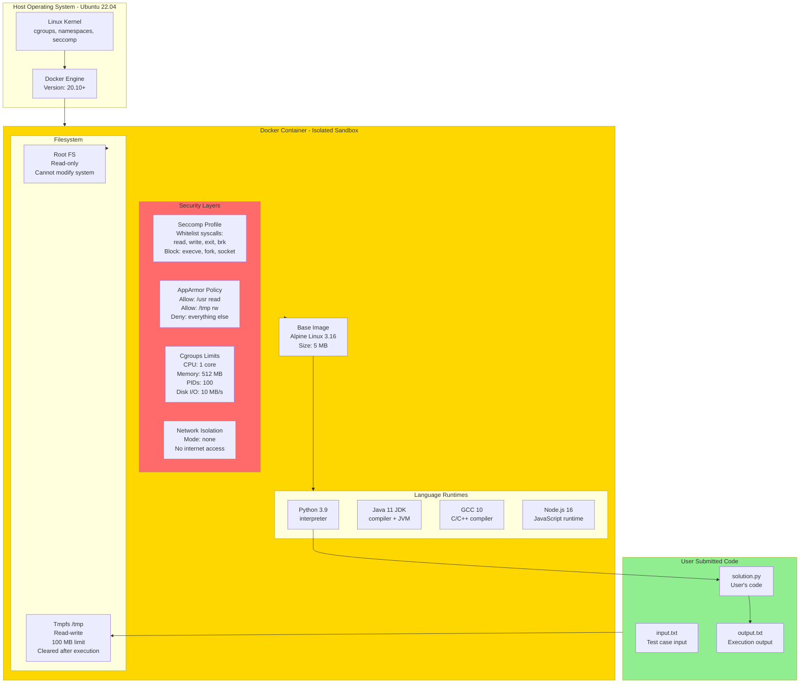

---

## 4. Security Layers (Defense in Depth)

**Flow Explanation:**

This diagram illustrates the multiple layers of security protecting the host system from malicious code.

**Layer 1: Docker Namespace Isolation**

- Separate PID namespace (cannot see host processes)
- Separate network namespace (no host network access)
- Separate mount namespace (isolated filesystem)

**Layer 2: Seccomp (System Call Filtering)**

- Whitelist only safe syscalls (read, write, brk, mmap, exit)
- Block dangerous syscalls (execve, fork, clone, socket, connect, bind)
- Prevents privilege escalation attacks

**Layer 3: AppArmor (Mandatory Access Control)**

- Define accessible paths (/usr for libraries, /tmp for temporary files)
- Block access to sensitive files (/etc/passwd, /proc, /sys)
- Prevents filesystem-based attacks

**Layer 4: Cgroups (Resource Limits)**

- CPU limit: 1 core (prevent CPU hogging)
- Memory limit: 512 MB (prevent memory bomb)
- PIDs limit: 100 (prevent fork bomb)
- Disk I/O: 10 MB/sec (prevent disk thrashing)

**Layer 5: Network Isolation**

- Container on isolated network (--network none)
- Cannot access internet or other containers
- Prevents DDoS attacks and data exfiltration

**Layer 6: Read-Only Filesystem**

- Root filesystem mounted read-only
- Only /tmp writable (with size limit)
- Prevents code from modifying system files

**Attack Mitigation:**

- Fork bomb: Blocked by PID limit (100)
- Memory bomb: Blocked by memory limit (512 MB)
- Infinite loop: Blocked by timeout (5-10 seconds)
- Network attack: Blocked by network isolation
- File access: Blocked by AppArmor + read-only filesystem
- Syscall exploit: Blocked by seccomp whitelist

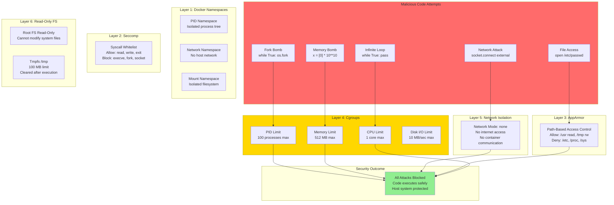

---

## 5. Queue-Based Asynchronous Architecture

**Flow Explanation:**

This diagram shows why queue-based architecture is essential for handling traffic spikes and ensuring no submission is
lost.

**Why Queue?**

- Execution is slow (1-10 seconds per submission)
- Traffic is bursty (10x spike during contests)
- Workers can fail (need retry mechanism)
- Need fair scheduling (FIFO or priority)

**Kafka Configuration:**

- **Topics**: high_priority (contests), normal (practice)
- **Partitions**: 10 partitions per topic (load balancing)
- **Replication Factor**: 3 (survive 2 broker failures)
- **Retention**: 7 days (debug recent submissions)

**Consumer Groups:**

- Workers join "judge-workers" consumer group
- Kafka automatically distributes partitions across workers
- If worker dies, Kafka rebalances partitions to remaining workers

**Retry Mechanism:**

- Worker crashes mid-execution → Message not acknowledged
- Kafka redelivers message to another worker
- Idempotent execution (check if submission already judged)

**Throughput:**

- Normal load: 100 submissions/sec → 100 messages/sec
- Peak load: 10,000 submissions/sec → 10,000 messages/sec
- Queue absorbs spike, workers process at their capacity

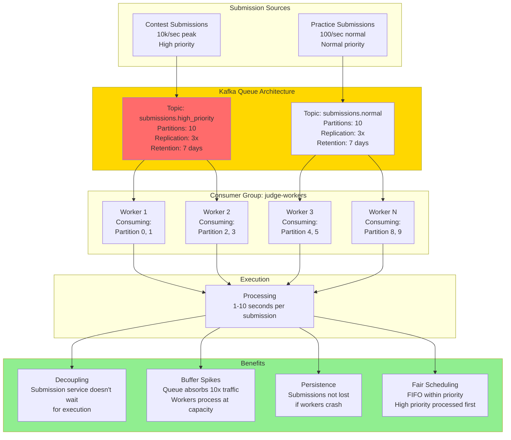

---

## 6. Judge Worker Execution Pipeline

**Flow Explanation:**

This diagram shows the detailed execution pipeline within a judge worker from picking up a submission to reporting
verdict.

**Steps:**

1. **Consume Message**: Worker pulls submission from Kafka (100ms)
2. **Create Container**: Docker create with security policies (800ms)
3. **Copy Code**: Write user code to /tmp/solution.py (10ms)
4. **Copy Test Cases**: Fetch from cache or S3 (50ms cached, 200ms S3)
5. **Compile** (if needed): javac Solution.java (500ms for Java, skip for Python)
6. **Execute Test Cases** (loop):
    - Read input: cat test_input.txt (1ms)
    - Run code: timeout 5s python3 solution.py < input (2-5s)
    - Capture output: stdout > output.txt (1ms)
    - Compare: diff output.txt expected.txt (5ms)
    - Check time: Must complete within limit
    - Check memory: Must not exceed limit
7. **Determine Verdict**:
    - All passed → AC (Accepted)
    - Any wrong → WA (Wrong Answer)
    - Timeout → TLE (Time Limit Exceeded)
    - Segfault → RE (Runtime Error)
    - OOM → MLE (Memory Limit Exceeded)
    - Compilation failed → CE (Compilation Error)
8. **Cleanup**: Remove container (100ms)
9. **Report Result**: Update PostgreSQL + Redis (50ms)
10. **Acknowledge**: Kafka commit offset (10ms)

**Total Time:**

- Setup: 1 second (container + test cases)
- Execution: 2-5 seconds (depends on code)
- Cleanup: 0.2 seconds
- **Total: 3-6 seconds**

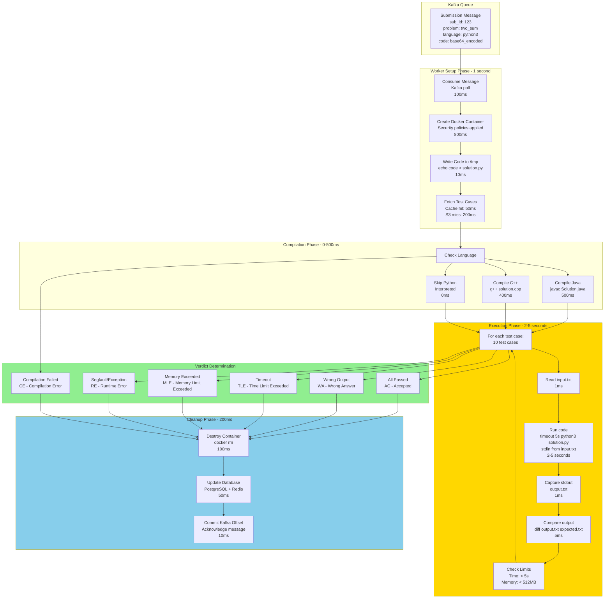

---

## 7. Auto-Scaling Strategy

**Flow Explanation:**

This diagram shows how the system auto-scales workers based on queue depth (not CPU).

**Why Queue Depth (Not CPU)?**

- Workers may be idle but queue backing up (slow executions)
- CPU low but queue depth high → Need more workers
- Queue depth directly indicates backlog

**Scaling Policy:**

```
Target: < 1000 messages per worker
Scale Up: Queue depth > 1000 × worker_count
Scale Down: Queue depth < 500 × worker_count
Cooldown: 5 minutes (avoid thrashing)
```

**Example:**

- 10 workers, queue depth 15,000 → 15,000 / 10 = 1,500/worker → Scale up to 15 workers
- 20 workers, queue depth 8,000 → 8,000 / 20 = 400/worker → Scale down to 16 workers

**Response Time:**

- Kubernetes HPA detects high queue: 30 seconds
- EC2 instance launch: 90 seconds
- Container pull + startup: 60 seconds
- **Total: 3 minutes** to add new workers

**Pre-Warming for Contests:**

- Contests scheduled in advance (known start time)
- Pre-scale workers 30 minutes before contest
- Gradually scale down 30 minutes after (avoid sudden drop)

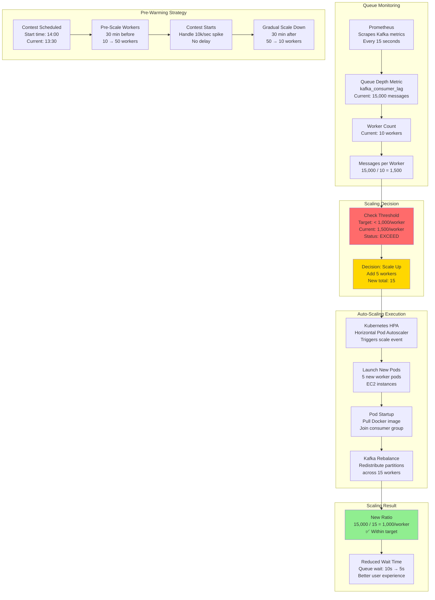

---

## 8. Test Case Distribution

**Flow Explanation:**

This diagram shows the three-tier test case distribution strategy for fast access.

**Tier 1: Worker Local Cache (Hottest)**

- Each worker caches test cases on local SSD
- Cache size: 50 GB (covers 5,000 problems × 10 MB avg)
- Access time: < 10ms (local disk read)
- Hit rate: 95% (hot problems cached)

**Tier 2: S3 with CloudFront (Warm)**

- All test cases stored in S3 (source of truth)
- CloudFront CDN caches at edge locations
- Access time: 50-100ms (CloudFront edge)
- Hit rate: 99% (CloudFront cache)

**Tier 3: S3 Origin (Cold)**

- Original S3 bucket (us-east-1)
- Access time: 200-500ms (S3 direct)
- Hit rate: 1% (CloudFront miss)

**Cache Invalidation:**

- Problem updated → Publish event to Redis Pub/Sub: `channel:problem:{id}:updated`
- All workers subscribed to channel
- On event: Delete local cached test cases for that problem
- Next execution fetches fresh from S3

**Storage:**

- Total test cases: 10,000 problems
- Average size: 1 MB per problem
- Total: 10 GB in S3
- S3 cost: $0.23/month (dirt cheap)

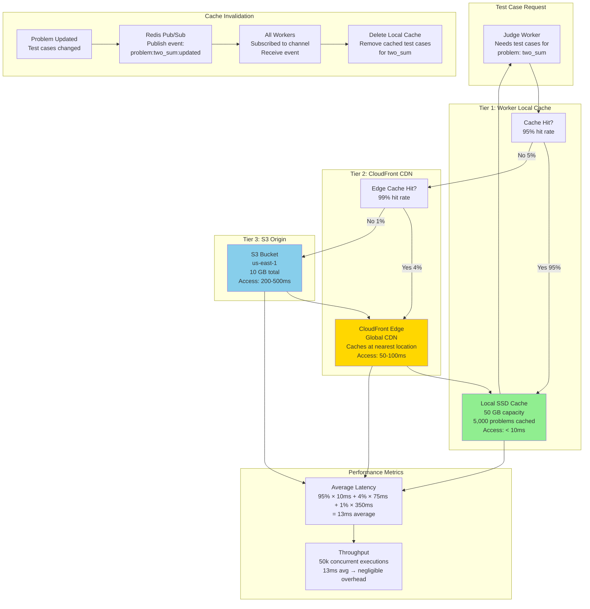

---

## 9. Real-Time Status Updates

**Flow Explanation:**

This diagram shows how clients receive real-time status updates using WebSocket and Redis Pub/Sub.

**Flow:**

1. **User Submits**: Code submitted, submission ID returned (sub_123)
2. **Client Subscribes**: WebSocket connection to `ws://server/submissions/sub_123`
3. **Worker Updates**: Worker publishes status updates to Redis Pub/Sub channel
4. **WebSocket Server**: Subscribes to Redis channel, receives updates
5. **Push to Client**: WebSocket server pushes updates to client in real-time

**Status Updates:**

- Queued: Submission accepted, waiting in queue
- Running: Worker picked up, executing test case 5/10
- Completed: All test cases done, verdict determined
- Accepted/WA/TLE/MLE/RE/CE: Final verdict

**Alternative: Polling (Fallback)**

- Client polls `GET /api/submissions/sub_123/status` every 1 second
- Server returns cached status from Redis
- Works when WebSocket not supported (old browsers, firewalls)

**Performance:**

- WebSocket: Real-time (< 50ms update delay)
- Polling: 1-second delay (acceptable fallback)
- Redis Pub/Sub latency: < 10ms

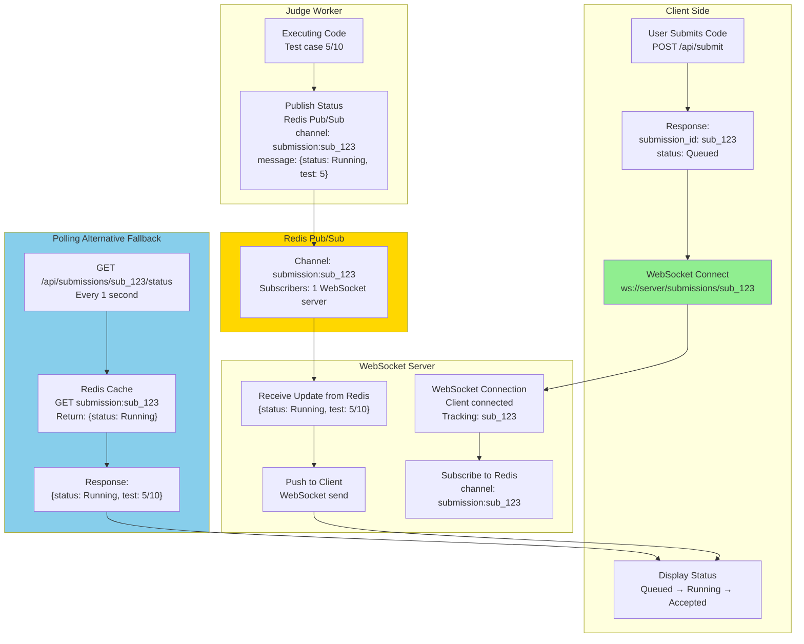

---

## 10. Language Runtime Architecture

**Flow Explanation:**

This diagram shows how multiple language runtimes are organized in Docker images.

**Multi-Stage Docker Image:**

- **Base Layer**: Alpine Linux (5 MB)
- **System Layer**: gcc, make, binutils (50 MB)
- **Language Layers**:
    - Python 3.9 (150 MB)
    - Java 11 JDK (300 MB)
    - GCC 10 C/C++ (200 MB)
    - Node.js 16 (100 MB)
    - Go 1.19 (500 MB)
    - Rust 1.65 (1 GB)
- **Total**: 2.3 GB per image

**Language Selection:**

- Worker checks submission language: `language: python3`
- Runs appropriate command: `python3 solution.py`
- No image pulling needed (all languages pre-baked)

**Image Management:**

- All workers pre-pull image (cached locally)
- No network overhead on execution
- Updated weekly with security patches
- Versioned images: `judge-runtime:v2.3`

**Compilation Commands:**

```
Python: No compilation (interpreted)
Java: javac Solution.java
C++: g++ -std=c++17 -O2 solution.cpp -o solution
JavaScript: node solution.js (no compilation)
Go: go build solution.go
Rust: rustc solution.rs
```

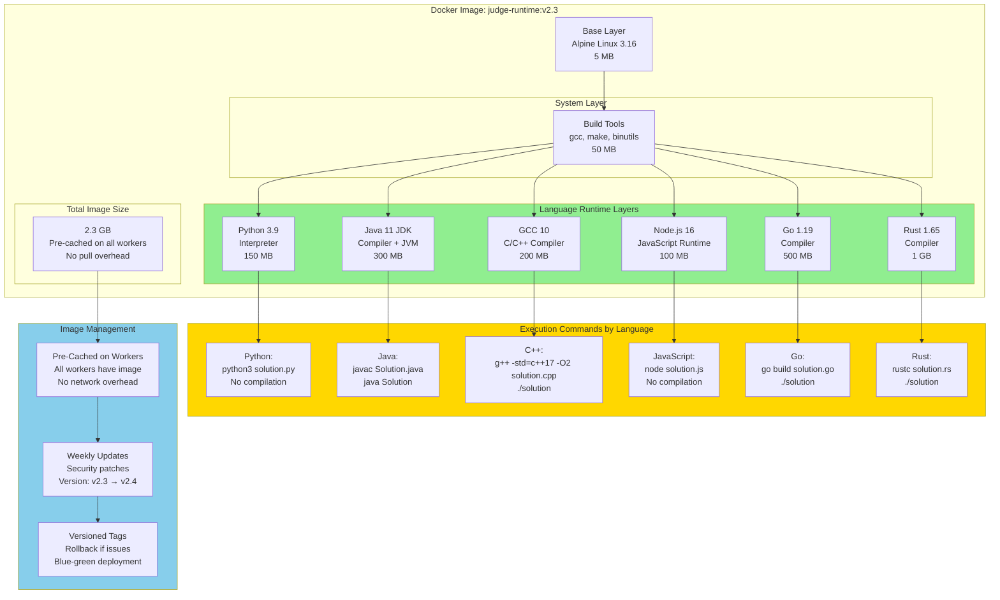

---

## 11. Failure Recovery Flow

**Flow Explanation:**

This diagram shows how the system handles worker failures without losing submissions.

**Failure Scenario: Worker Crashes Mid-Execution**

**Detection:**

- Worker sends heartbeat every 10 seconds to Judge Manager
- No heartbeat for 30 seconds → Worker marked dead

**Recovery:**

- Worker was processing submission sub_123
- Message not acknowledged to Kafka
- Kafka redelivers message to another worker after 60 seconds
- New worker picks up, executes, reports result

**Client Experience:**

- Submission status: Running
- Worker crash: Status stays Running (client doesn't know)
- New worker picks up: Status continues Running
- Execution complete: Status changes to Accepted
- **Total delay: 60-90 seconds** (acceptable for retry)

**Idempotency:**

- New worker checks: Has sub_123 been judged already?
- If yes: Skip execution, return cached result
- If no: Execute normally
- Prevents duplicate execution

**Graceful Shutdown:**

- Worker receives SIGTERM (Kubernetes pod termination)
- Finish current executions (max 30 seconds)
- Stop consuming new messages from Kafka
- Acknowledge all completed messages
- Exit cleanly (no lost submissions)

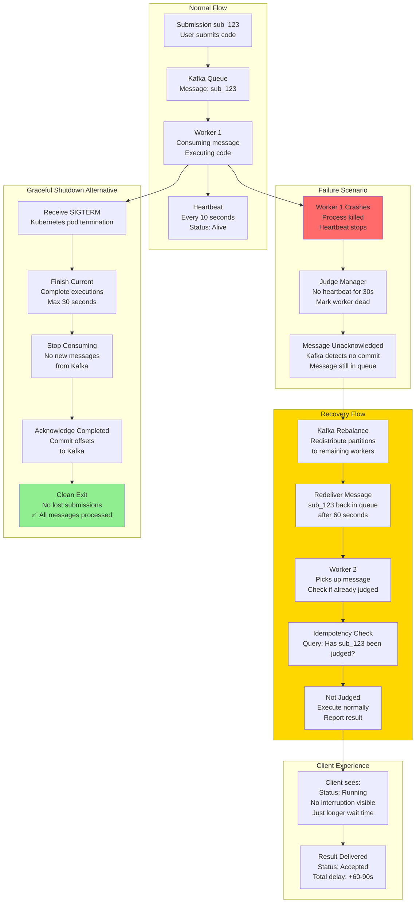

---

## 12. Multi-Region Deployment

**Flow Explanation:**

This diagram shows multi-region deployment for global latency reduction and disaster recovery.

**Architecture:**

- **Primary Region (US-East)**: Handles all submissions and execution
- **Secondary Regions (EU-West, Asia-Pacific)**: Read replicas for leaderboard, problem data

**Submission Flow (Global):**

1. User in Asia submits code
2. Request routed to nearest API Gateway (Asia-Pacific)
3. Submission forwarded to US-East (primary region) for execution
4. Result replicated back to Asia-Pacific (1-2 second lag)
5. User queries result from local region (low latency)

**Why Single Primary for Execution?**

- Contest fairness requires consistent execution environment
- Multi-region execution has timing differences (different hardware, network)
- Leaderboard must be globally consistent (single source of truth)

**Disaster Recovery:**

- Primary failure: Promote EU-West to primary
- RTO: 10 minutes (manual promotion)
- RPO: 1 minute (queue messages buffered in Kafka)

**Benefits:**

- Low latency API (< 100ms globally)
- High availability (survive region failure)
- Contest fairness (consistent execution)

**Trade-offs:**

- Higher latency for Asia users (submission → US → result: +200ms)
- Single region execution (no geographic distribution of load)

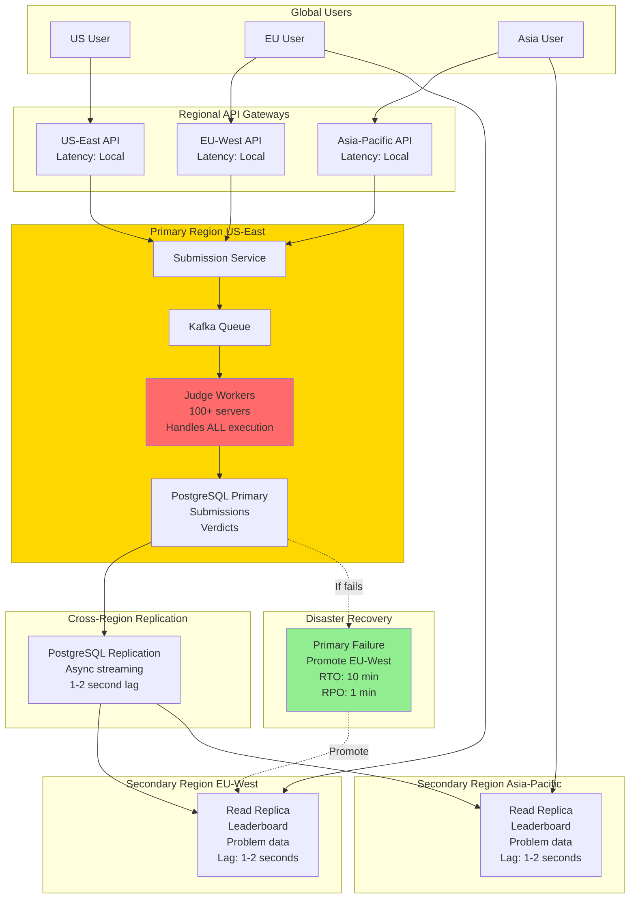