# Video Streaming System - High-Level Design

This document contains Mermaid diagrams showing the architecture and data flow for the Video Streaming System.

---

## Table of Contents

1. [Overall System Architecture](#1-overall-system-architecture)
2. [Upload Service Architecture](#2-upload-service-architecture)
3. [Resumable Upload Flow](#3-resumable-upload-flow)
4. [Transcoding Pipeline Architecture](#4-transcoding-pipeline-architecture)
5. [HLS Adaptive Bitrate Streaming](#5-hls-adaptive-bitrate-streaming)
6. [CDN Multi-Tier Architecture](#6-cdn-multi-tier-architecture)
7. [Metadata Database Design](#7-metadata-database-design)
8. [Search and Discovery Architecture](#8-search-and-discovery-architecture)
9. [Recommendation Engine Architecture](#9-recommendation-engine-architecture)
10. [Multi-Region Deployment](#10-multi-region-deployment)
11. [Analytics Pipeline](#11-analytics-pipeline)
12. [Live Streaming Architecture](#12-live-streaming-architecture)

---

## 1. Overall System Architecture

**Flow Explanation:**

This diagram shows the complete end-to-end architecture of the video streaming system.

**Components:**

1. **Upload Path**: Creator uploads video → Upload Service → S3 → Kafka → Transcode Workers
2. **Streaming Path**: Viewer requests video → API Gateway → Metadata DB → CDN → Client
3. **Search Path**: User searches → Elasticsearch → Results
4. **Analytics Path**: Watch events → Kafka → Stream Processing → Data Warehouse

**Benefits:**

- **Separation of Concerns**: Upload, streaming, search, and analytics are decoupled
- **Scalability**: Each component can scale independently
- **High Availability**: Multi-region deployment with CDN

**Trade-offs:**

- **Complexity**: Many components to manage
- **Consistency**: Eventual consistency between components

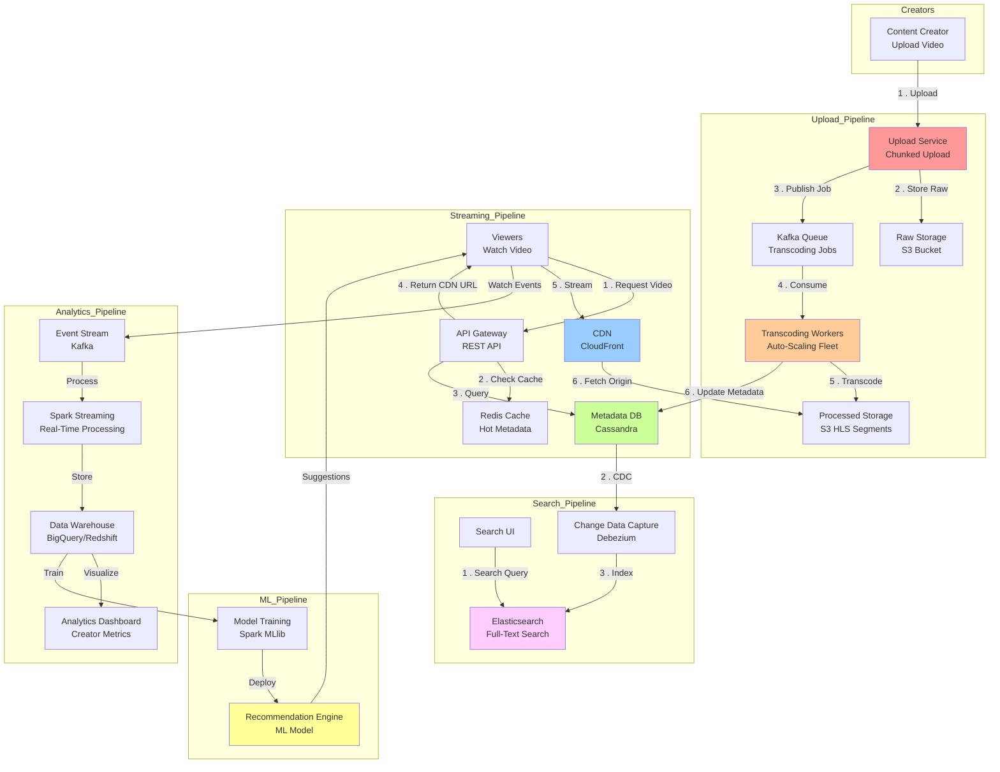

---

## 2. Upload Service Architecture

**Flow Explanation:**

Shows the architecture of the Upload Service handling resumable uploads.

**Steps:**

1. **Load Balancer**: Distributes upload requests across multiple instances
2. **Upload Instances**: Stateless servers handling chunk uploads
3. **Redis**: Tracks upload state (completed chunks per upload_id)
4. **S3**: Stores raw video chunks using Multipart Upload API

**Benefits:**

- **Resumability**: Client can resume from last successful chunk
- **Horizontal Scaling**: Add more upload instances to handle load
- **Fault Tolerance**: Redis persists upload state

**Performance:**

- **Throughput**: 10k concurrent uploads
- **Latency**: < 100ms per chunk acknowledgment
- **Storage**: Temporary state in Redis (1 hour TTL)

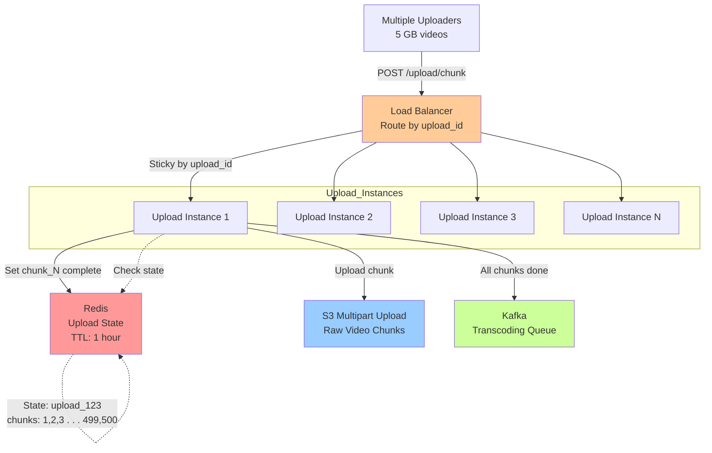

---

## 3. Resumable Upload Flow

**Flow Explanation:**

Details the step-by-step process of resumable chunk upload.

**Steps:**

1. **Init Upload**: Client POST /upload/init → Server returns upload_id
2. **Chunk Loop**: For each 10 MB chunk:
    - Client uploads chunk with (upload_id, chunk_number)
    - Server validates, stores in S3, marks chunk complete in Redis
3. **Complete Upload**: Client POST /upload/complete → Server assembles file
4. **Trigger Transcode**: Server publishes job to Kafka

**Failure Handling:**

- **Chunk Upload Fails**: Client retries specific chunk (idempotent)
- **Server Crashes**: New instance reads state from Redis
- **Network Interruption**: Client resumes from last acknowledged chunk

**Performance:**

- **Upload Speed**: 10 Mbps = 1.25 MB/sec = 8 seconds per 10 MB chunk
- **5 GB Video**: 500 chunks × 8 sec = 4000 sec = ~67 minutes

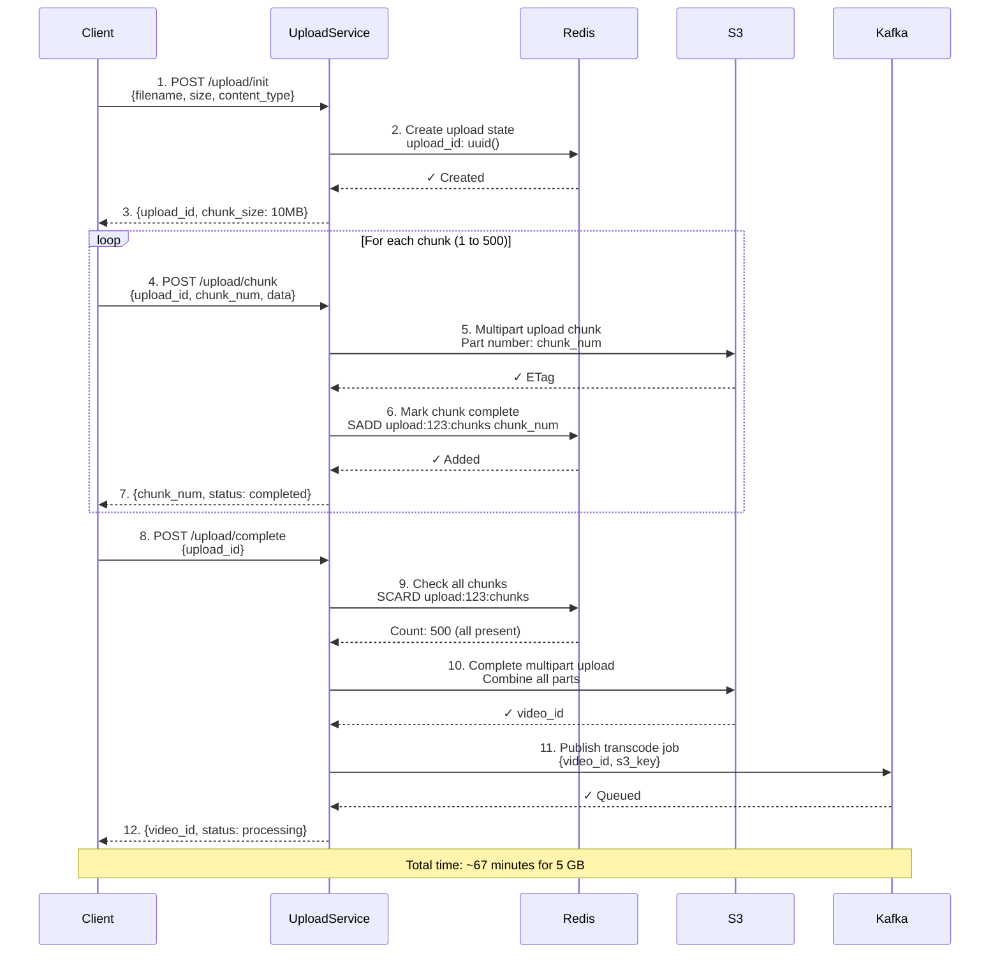

---

## 4. Transcoding Pipeline Architecture

**Flow Explanation:**

Shows the complete transcoding pipeline from raw video to HLS segments.

**Steps:**

1. **Kafka Consumer**: Worker picks up transcode job from queue
2. **Download**: Fetch raw video from S3 (5 GB)
3. **Decode**: Extract audio and video tracks
4. **Parallel Encode**: Transcode to 6 qualities simultaneously
5. **Segment**: Split into 10-second chunks
6. **Upload**: Store segments in S3
7. **Manifest**: Generate HLS manifest file
8. **Notify**: Update metadata DB with status "Ready"

**Benefits:**

- **Parallel Processing**: All qualities processed simultaneously (5x faster)
- **Auto-Scaling**: Workers scale based on queue depth
- **Fault Tolerance**: Failed jobs redelivered by Kafka

**Performance:**

- **Sequential**: 6 qualities × 5 min = 30 min
- **Parallel**: 6 qualities in parallel = 5 min (with 6 workers)
- **Real-Time Ratio**: 1x (5-min video takes 5 min to transcode)

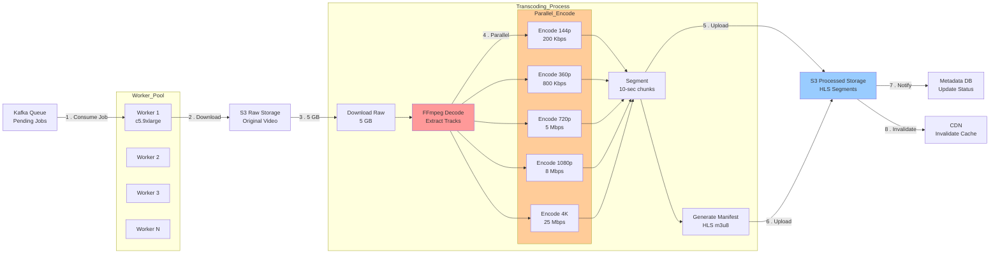

---

## 5. HLS Adaptive Bitrate Streaming

**Flow Explanation:**

Shows how clients adapt video quality based on bandwidth.

**Steps:**

1. **Initial Request**: Client requests master manifest (m3u8)
2. **Quality Selection**: Client estimates bandwidth, selects initial quality (720p)
3. **Segment Download**: Client downloads segments sequentially
4. **Bandwidth Monitoring**: Client measures download time per segment
5. **Quality Switch**: If bandwidth decreases, switch to lower quality (480p)
6. **Seamless Playback**: No interruption during quality change

**Benefits:**

- **No Buffering**: Always downloads quality that fits bandwidth
- **Optimal Experience**: Best quality for available bandwidth
- **Automatic**: No user intervention required

**Performance:**

- **Initial Startup**: < 2 seconds (manifest + first segment)
- **Quality Switch**: < 1 second (during segment boundary)
- **Buffer Size**: 30 seconds (3 segments × 10 sec)

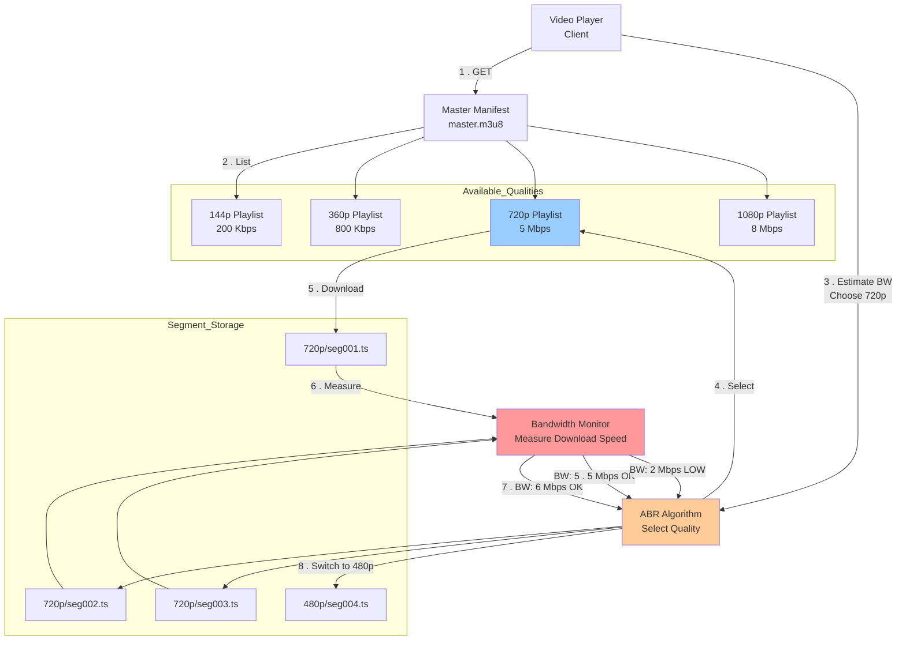

---

## 6. CDN Multi-Tier Architecture

**Flow Explanation:**

Shows the three-tier CDN architecture with edge, regional, and origin caches.

**Layers:**

1. **Edge Locations** (1000+): Closest to users, serve 99% of requests
2. **Regional Caches** (50+): Aggregate requests from multiple edges
3. **Origin (S3)**: Source of truth, serves cache misses

**Cache Strategy:**

- **Hot Videos** (1M+ views): Cached at edge for 7 days
- **Warm Videos** (10k-1M views): Cached at regional for 24 hours
- **Cold Videos** (<10k views): Fetched from origin on demand

**Performance:**

- **Edge Hit** (99%): 20ms latency
- **Regional Hit** (0.9%): 50ms latency
- **Origin Hit** (0.1%): 200ms latency

**Cost Savings**:

- **Without CDN**: 300 PB/month × $0.09/GB = $27M
- **With CDN (99% hit)**: 3 PB origin × $0.09/GB + 297 PB edge × $0.01/GB = $3.24M
- **Savings**: $23.76M/month (88% reduction)

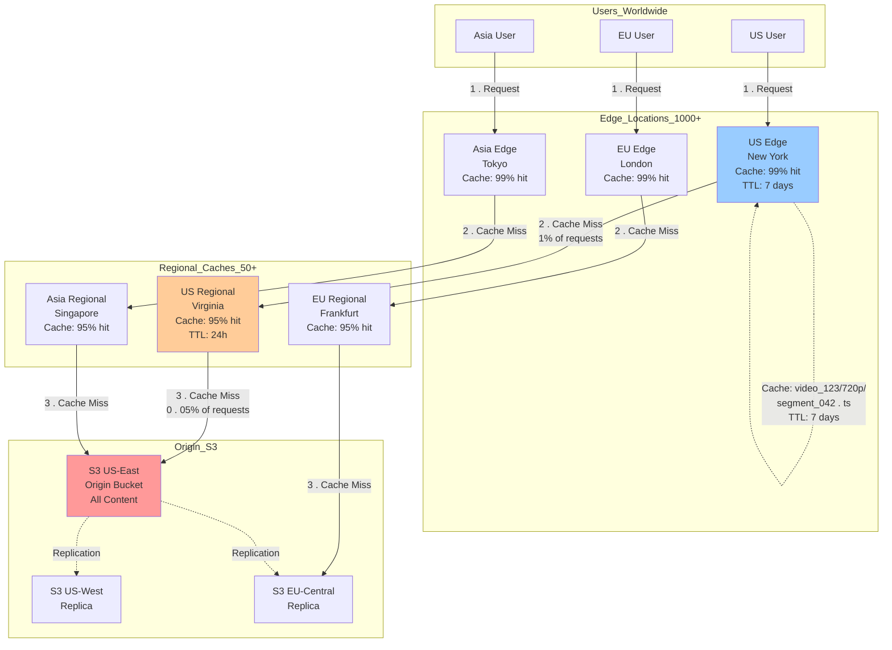

---

## 7. Metadata Database Design

**Flow Explanation:**

Shows the metadata storage architecture with Cassandra and Redis caching.

**Schema Design:**

- **Partition Key**: video_id (ensures single-partition queries)
- **Columns**: title, description, duration, views (counter), cdn_urls (map)

**Caching Strategy:**

- **Redis Cache-Aside**: Cache popular video metadata
- **TTL**: 1 hour for metadata, 5 minutes for view counts
- **Cache Hit Rate**: 80% for popular videos

**Performance:**

- **Cache Hit**: 1ms (Redis)
- **Cache Miss**: 10ms (Cassandra)
- **Write**: 5ms (async, not critical path)

**Scalability**:

- **Cassandra**: 1 billion videos partitioned across 100 nodes
- **Redis**: Hot metadata for 10 million videos (10 GB)

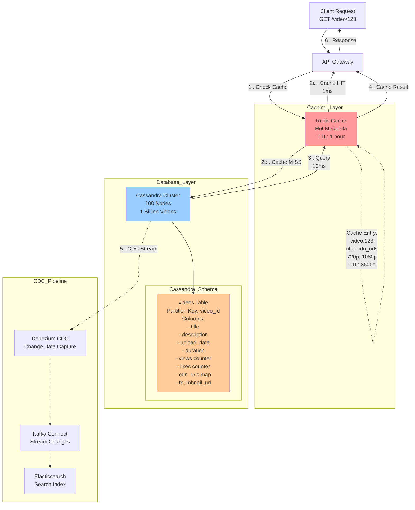

---

## 8. Search and Discovery Architecture

**Flow Explanation:**

Shows the search architecture with Elasticsearch powered by CDC from Cassandra.

**Components:**

1. **Cassandra**: Source of truth for video metadata
2. **Debezium**: Captures changes from Cassandra
3. **Kafka**: Streams changes to Elasticsearch
4. **Elasticsearch**: Full-text search index

**Search Features:**

- **Full-Text Search**: Title, description, transcript
- **Filters**: Duration, upload date, views, category
- **Ranking**: Relevance score + popularity + personalization

**Performance:**

- **Search Latency**: < 100ms (p95)
- **Index Size**: 1 billion documents, 500 GB
- **Refresh Rate**: Near real-time (< 1 second delay)

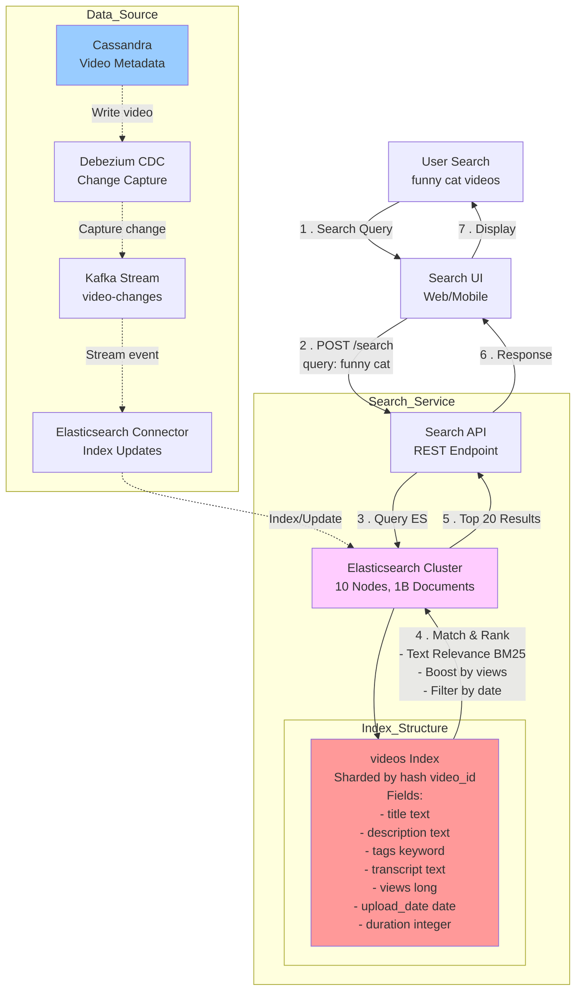

---

## 9. Recommendation Engine Architecture

**Flow Explanation:**

Shows the ML-based recommendation system architecture.

**Components:**

1. **Watch History**: User viewing patterns stored in Cassandra
2. **Feature Engineering**: Extract user and video features
3. **ML Model**: Collaborative filtering + content-based filtering
4. **Batch Processing**: Offline training daily with Spark
5. **Online Serving**: Real-time recommendations from Redis

**Models:**

- **Collaborative Filtering**: Matrix factorization (users × videos)
- **Content-Based**: Similar videos based on tags, category
- **Hybrid**: Combine both approaches

**Performance:**

- **Training**: 24 hours daily (Spark cluster)
- **Serving**: < 10ms (Redis cache)
- **Accuracy**: 60% click-through rate on recommendations

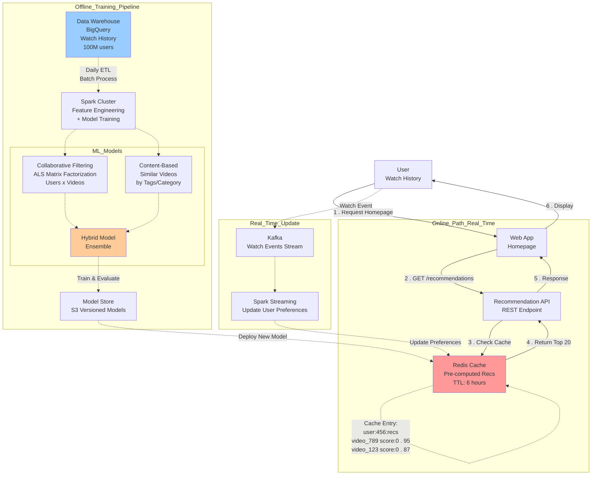

---

## 10. Multi-Region Deployment

**Flow Explanation:**

Shows the global multi-region deployment for low latency worldwide.

**Regions:**

1. **US-East**: Primary region, full stack
2. **EU-West**: Full stack, serves European users
3. **Asia-Pacific**: Full stack, serves Asian users

**Routing Strategy:**

- **GeoDNS**: Route users to nearest region based on IP
- **Active-Active**: All regions serve traffic simultaneously
- **Replication**: Cassandra multi-master, S3 cross-region replication

**Failover:**

- **Health Checks**: Monitor each region every 10 seconds
- **Automatic Failover**: If region unhealthy, route to next nearest
- **Recovery Time Objective (RTO)**: < 1 minute

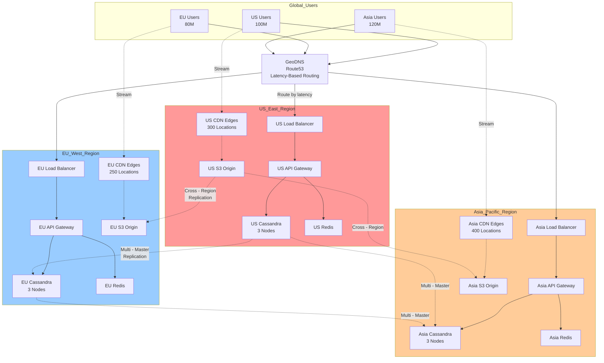

---

## 11. Analytics Pipeline

**Flow Explanation:**

Shows the analytics pipeline for tracking views, watch time, and engagement.

**Events Tracked:**

- Video started, paused, resumed, completed
- Quality switched, buffering events
- Likes, comments, shares

**Processing:**

1. **Client**: Sends events to Kafka every 10 seconds
2. **Spark Streaming**: Real-time aggregation (views, watch time)
3. **Data Warehouse**: Store for historical analysis
4. **Dashboard**: Creator analytics, platform metrics

**Metrics Calculated:**

- **View Count**: Unique views per video
- **Watch Time**: Total minutes watched
- **Audience Retention**: % who watch X% of video
- **Engagement Rate**: (Likes + Comments + Shares) / Views

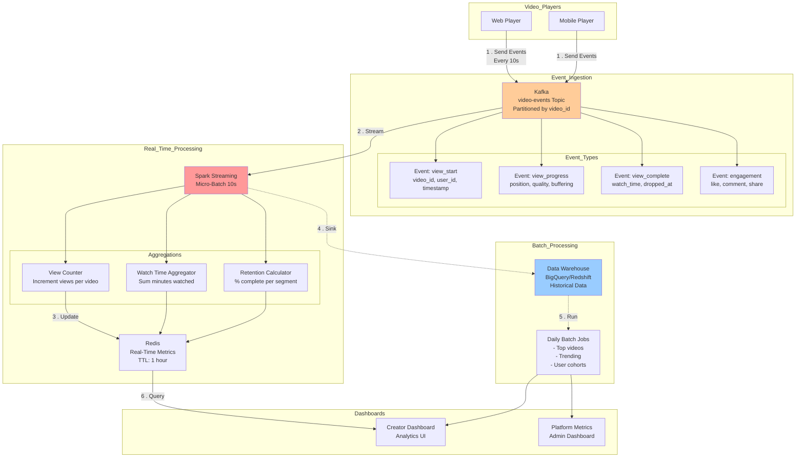

---

## 12. Live Streaming Architecture

**Flow Explanation:**

Shows the architecture for live streaming (e.g., Twitch, YouTube Live).

**Key Differences from VOD:**

- **No Pre-Transcoding**: Must transcode in real-time
- **Ultra-Low Latency**: < 5 seconds delay (vs 30 seconds for VOD)
- **Protocols**: RTMP/WebRTC/SRT instead of HLS

**Components:**

1. **Ingest**: Streamer sends video via RTMP
2. **Live Transcoder**: Real-time transcoding to multiple qualities
3. **Origin**: WebRTC/LL-HLS for low latency
4. **CDN**: Distribute to millions of viewers
5. **Chat**: Real-time chat via WebSocket

**Performance:**

- **Latency**: 3-5 seconds (WebRTC), 10-15 seconds (LL-HLS)
- **Concurrent Viewers**: 1M+ per stream (major events)
- **Cost**: 5x higher than VOD (real-time processing)

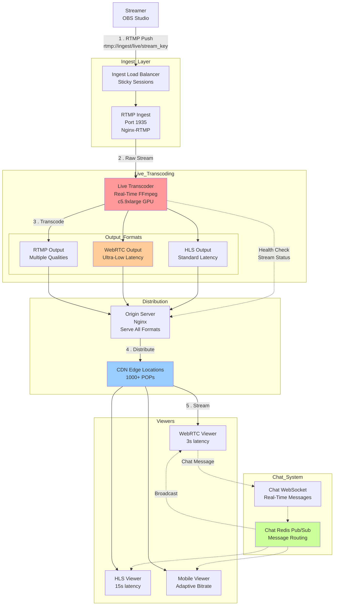