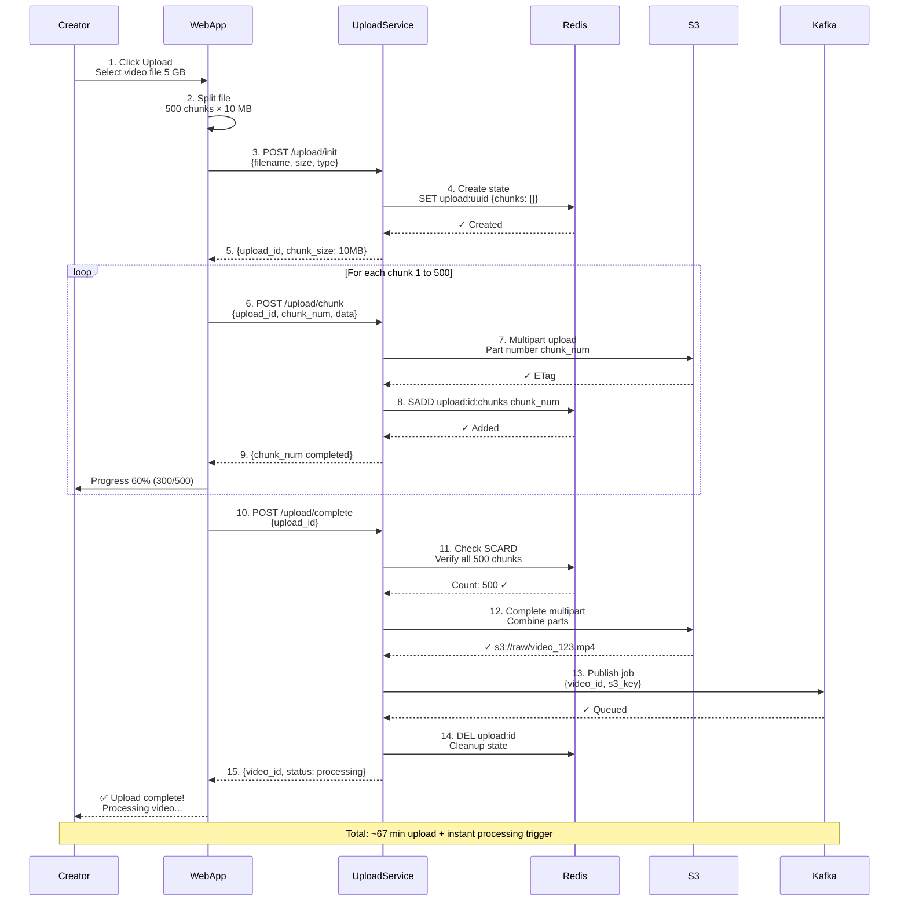
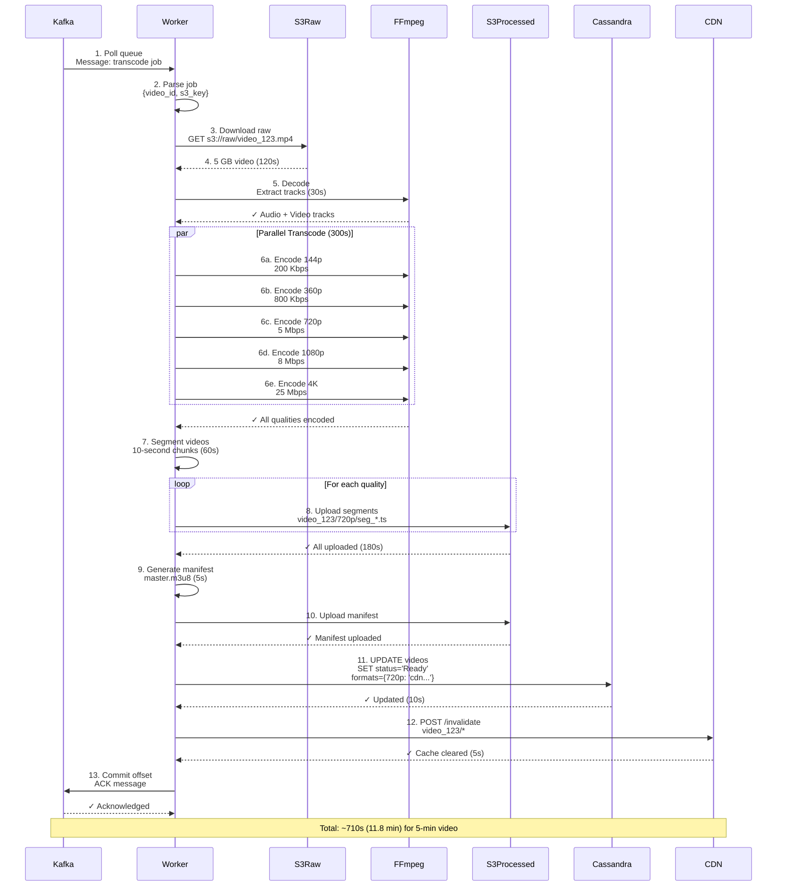
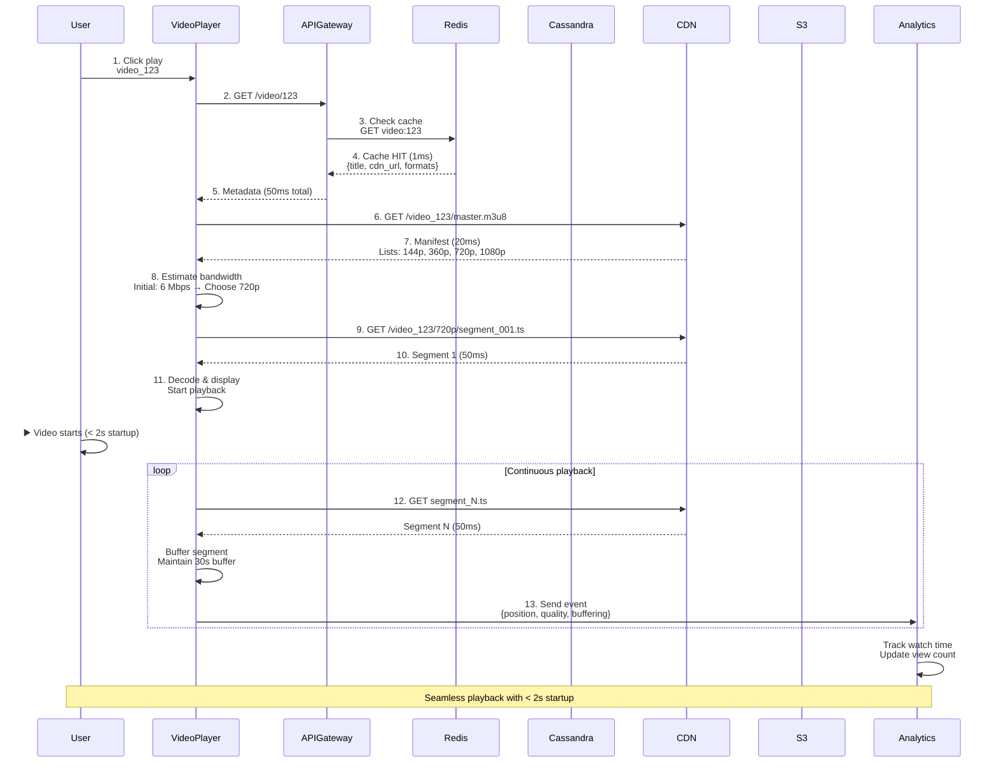
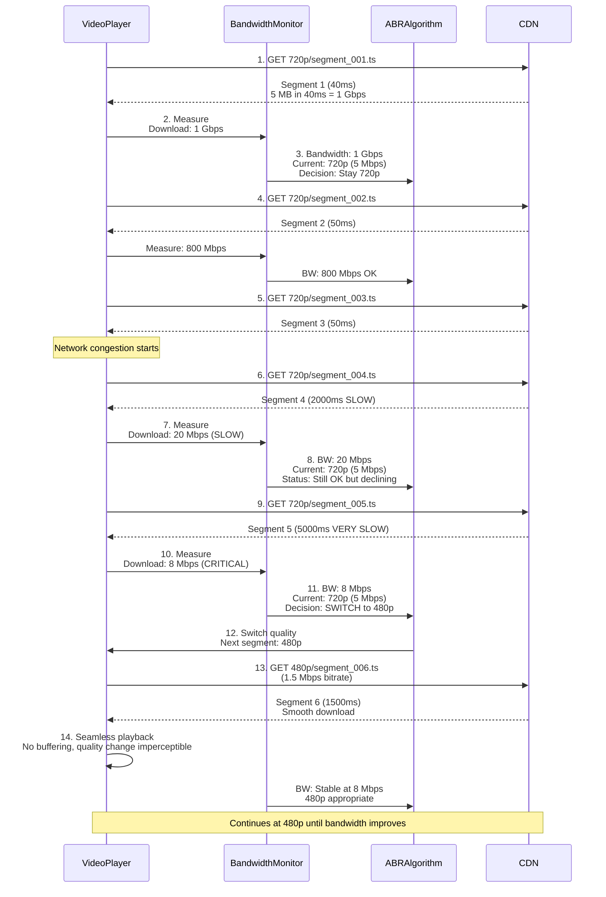
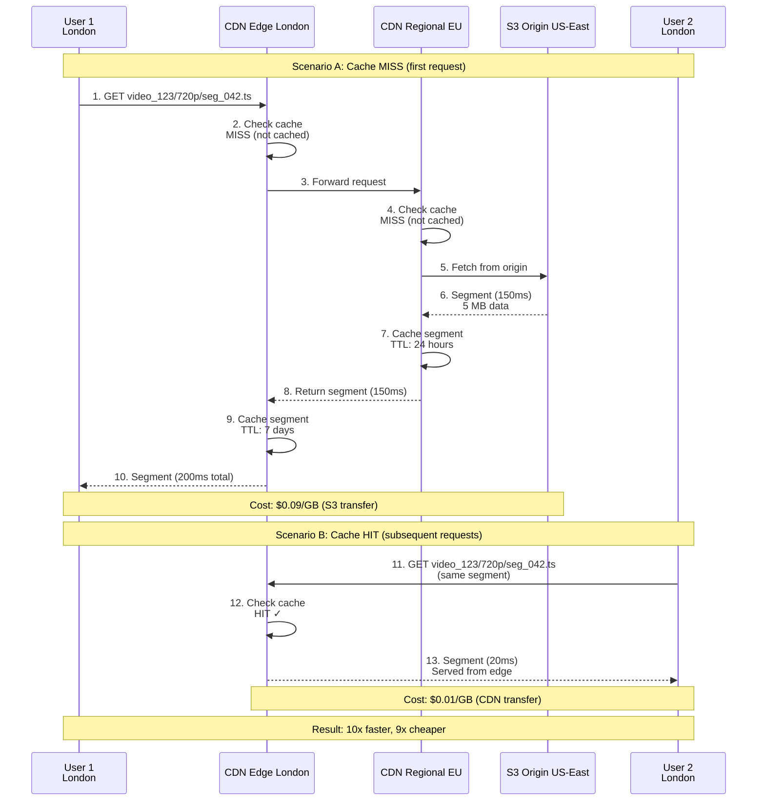
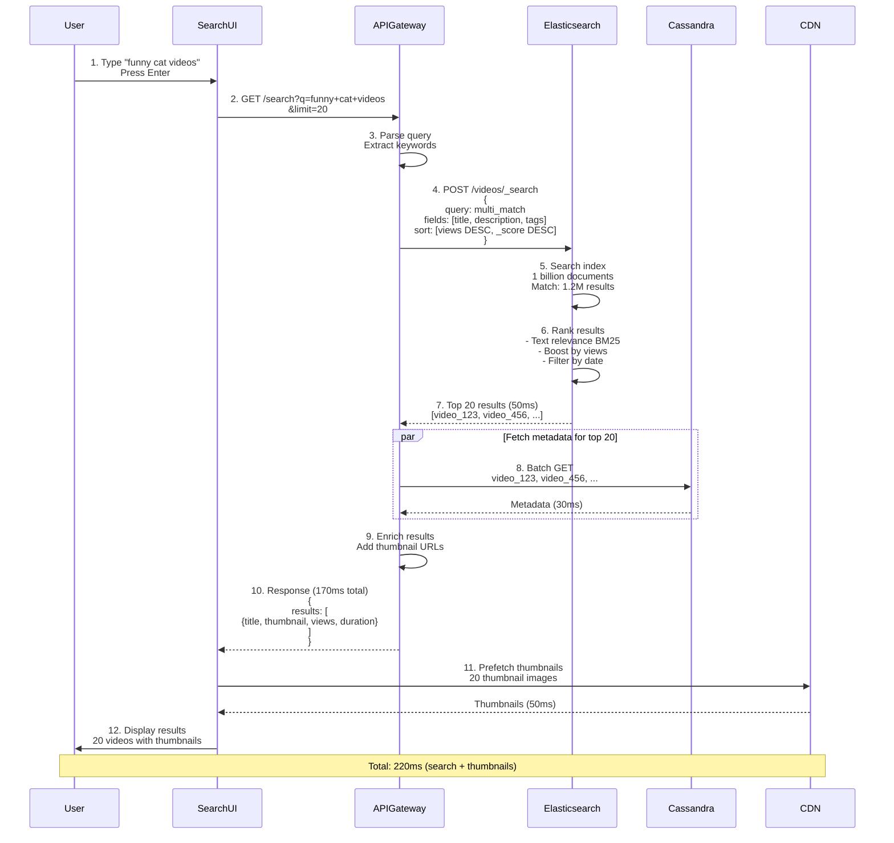
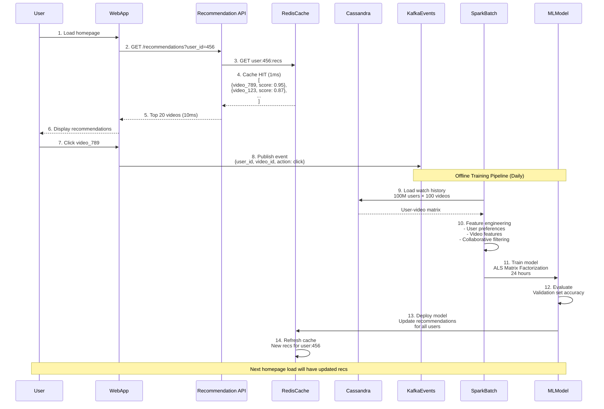
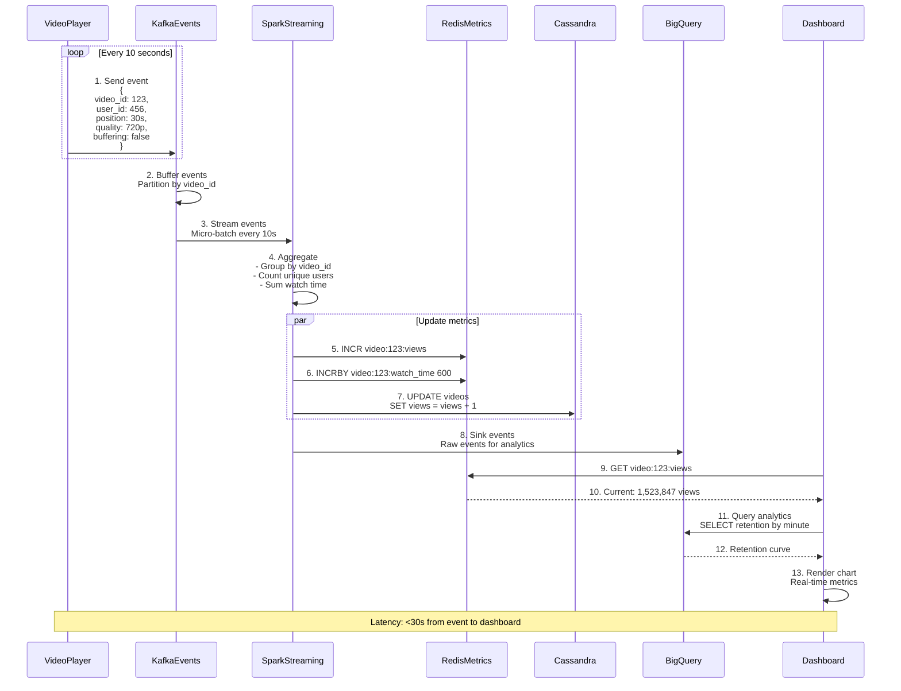
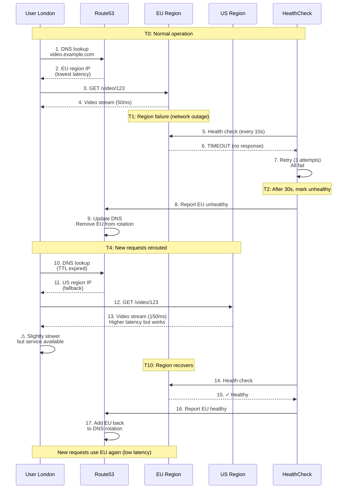
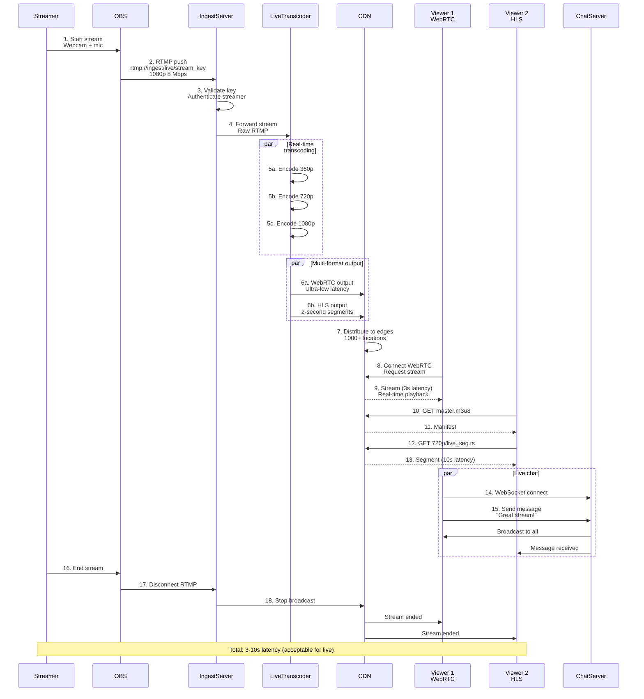

# Video Streaming System - Sequence Diagrams

This document contains detailed sequence diagrams showing interaction flows for the Video Streaming System.

---

## Table of Contents

1. [Video Upload Flow (Chunked Upload)](#1-video-upload-flow-chunked-upload)
2. [Transcoding Pipeline Execution](#2-transcoding-pipeline-execution)
3. [Video Streaming Flow (HLS Playback)](#3-video-streaming-flow-hls-playback)
4. [Adaptive Bitrate Switching](#4-adaptive-bitrate-switching)
5. [CDN Cache Hit and Miss](#5-cdn-cache-hit-and-miss)
6. [Search Query Execution](#6-search-query-execution)
7. [Recommendation Generation](#7-recommendation-generation)
8. [Analytics Event Processing](#8-analytics-event-processing)
9. [Multi-Region Failover](#9-multi-region-failover)
10. [Live Streaming Flow](#10-live-streaming-flow)

---

## 1. Video Upload Flow (Chunked Upload)

**Flow:**

Complete flow of a creator uploading a 5 GB video using resumable chunked upload.

**Steps:**

1. **Init Upload** (0ms): Creator requests upload, receives upload_id
2. **Chunk Loop** (4000s): Upload 500 chunks of 10 MB each
3. **S3 Multipart** (per chunk): Store each chunk in S3
4. **Redis State** (per chunk): Mark chunk complete for resumability
5. **Complete Upload** (100ms): Assemble all chunks into final video
6. **Trigger Transcode** (50ms): Publish job to Kafka queue
7. **Return Response** (50ms): Creator receives video_id

**Performance:**

- Upload speed: 10 Mbps = ~67 minutes for 5 GB
- Resumable: If interrupted, resume from last chunk
- Failure handling: Retry individual chunks (idempotent)

---

## 2. Transcoding Pipeline Execution

**Flow:**

Worker picks up transcode job and processes video into multiple formats.

**Steps:**

1. **Consume Job** (0ms): Worker polls Kafka, gets transcode job
2. **Download Raw** (120s): Fetch 5 GB from S3 (42 MB/sec)
3. **Decode** (30s): Extract audio/video tracks with FFmpeg
4. **Parallel Transcode** (300s): 6 qualities processed simultaneously
5. **Segment** (60s): Split each quality into 10-second chunks
6. **Upload Segments** (180s): Store HLS segments in S3
7. **Generate Manifest** (5s): Create master.m3u8 file
8. **Update Metadata** (10s): Mark video as "Ready" in Cassandra
9. **CDN Invalidate** (5s): Clear CDN cache for new video
10. **Acknowledge** (1s): Commit Kafka offset

**Total Time**: ~710 seconds (11.8 minutes) for 5-minute video

**Performance**: 2.4x real-time (5-min video takes 11.8 min)

---

## 3. Video Streaming Flow (HLS Playback)

**Flow:**

User watches a video from start to finish using HLS adaptive streaming.

**Steps:**

1. **Request Metadata** (50ms): Fetch video info from API
2. **Check Cache** (1ms): Redis cache hit for metadata
3. **Fetch Manifest** (20ms): Download master.m3u8 from CDN
4. **Select Quality** (10ms): Client estimates bandwidth, chooses 720p
5. **Download Segments** (loop): Fetch segments sequentially
6. **Playback** (continuous): Decode and display video
7. **Buffer Management** (ongoing): Maintain 30-second buffer
8. **Send Analytics** (every 10s): Track watch progress

**Total Startup**: < 2 seconds (metadata + manifest + first segment)

---

## 4. Adaptive Bitrate Switching

**Flow:**

Client dynamically switches video quality based on network conditions.

**Steps:**

1. **Initial Playback** (0s): Start at 720p based on initial bandwidth estimate
2. **Monitor Bandwidth** (ongoing): Measure download time per segment
3. **Detect Degradation** (30s): Bandwidth drops from 6 Mbps to 2 Mbps
4. **Switch Quality** (31s): Download next segment at 480p instead
5. **Seamless Transition** (31s): No interruption to playback
6. **Continue Monitoring** (ongoing): Ready to switch back to 720p if bandwidth improves

**Performance:**

- Quality switch latency: < 1 second (at segment boundary)
- Buffer maintained: 30 seconds (prevents buffering during switch)
- User experience: Smooth, no interruption

---

## 5. CDN Cache Hit and Miss

**Flow:**

Shows the difference between CDN cache hit (fast) and cache miss (slow).

**Steps:**

**Cache Hit** (99% of requests):

1. User requests segment → Edge location
2. Edge has segment cached → Return immediately (20ms)

**Cache Miss** (1% of requests):

1. User requests segment → Edge location
2. Edge cache miss → Query regional cache
3. Regional cache miss → Fetch from S3 origin
4. S3 returns segment → Cache at regional and edge
5. Edge returns to user (200ms total)

**Performance:**

- Cache hit: 20ms latency
- Cache miss: 200ms latency (10x slower)
- Cost: Hit $0.01/GB, Miss $0.09/GB (9x more expensive)

---

## 6. Search Query Execution

**Flow:**

User searches for videos using full-text search powered by Elasticsearch.

**Steps:**

1. **Search Query** (0ms): User types "funny cat videos"
2. **API Gateway** (10ms): Parse query, validate
3. **Elasticsearch** (50ms): Full-text search across 1B videos
4. **Ranking** (20ms): Score by relevance + popularity
5. **Fetch Thumbnails** (30ms): Get thumbnail URLs from metadata
6. **Return Results** (10ms): Top 20 videos
7. **Display** (50ms): Render search results page

**Total Latency**: ~170ms (fast enough for real-time search)

**Ranking Factors:**

- Text relevance (BM25 score)
- View count (popularity boost)
- Upload date (recency boost)
- User preferences (personalization)

---

## 7. Recommendation Generation

**Flow:**

System generates personalized recommendations for a user.

**Steps:**

1. **User Request** (0ms): User loads homepage
2. **Check Cache** (1ms): Redis has pre-computed recommendations
3. **Return Recommendations** (10ms): Top 20 videos
4. **Background Update** (async): Track view, update model
5. **Batch Training** (daily): Train ML model on all user data
6. **Deploy Model** (daily): Update recommendations in Redis

**Performance:**

- Serving latency: < 10ms (cached)
- Model training: 24 hours (Spark cluster)
- Accuracy: 60% click-through rate

---

## 8. Analytics Event Processing

**Flow:**

Real-time processing of video watch events for analytics.

**Steps:**

1. **Client Events** (every 10s): Player sends watch progress
2. **Kafka Ingestion** (10ms): Buffer events in Kafka topic
3. **Spark Streaming** (micro-batch 10s): Aggregate events
4. **Update Metrics** (50ms): Increment view count, watch time
5. **Sink to Warehouse** (async): Store for historical analysis
6. **Creator Dashboard** (real-time): Show live metrics

**Metrics Tracked:**

- View count (unique views per video)
- Watch time (total minutes watched)
- Audience retention (% who watch X% of video)
- Engagement rate (likes + comments + shares / views)

---

## 9. Multi-Region Failover

**Flow:**

Automatic failover when a region becomes unavailable.

**Steps:**

1. **Normal Operation** (T0): User in London routed to EU region
2. **Region Failure** (T1): EU region health check fails
3. **Detection** (T2): Route53 detects unhealthy region (30s)
4. **DNS Update** (T3): Remove EU from DNS records
5. **Reroute** (T4): New requests routed to US region
6. **Graceful Degradation** (T4): Slightly higher latency, but service available
7. **Recovery** (T10): EU region recovers, added back to DNS

**RTO** (Recovery Time Objective): < 1 minute

**RPO** (Recovery Point Objective): 0 (no data loss, multi-master Cassandra)

---

## 10. Live Streaming Flow

**Flow:**

Streamer broadcasts live video to millions of viewers.

**Steps:**

1. **RTMP Ingest** (0ms): Streamer pushes via OBS
2. **Live Transcoder** (real-time): Convert to multiple qualities
3. **HLS/WebRTC Output** (real-time): Generate segments on-the-fly
4. **CDN Distribution** (100ms): Push to edge locations
5. **Viewer Playback** (3-5s latency): Watch with minimal delay
6. **Chat Integration** (real-time): WebSocket for live chat

**Latency:**

- WebRTC: 3 seconds (ultra-low latency)
- LL-HLS: 10 seconds (low latency)
- Standard HLS: 30 seconds (higher latency but scalable)

