# Payment Gateway - High-Level Design Diagrams

This document contains Mermaid diagrams showing the architecture and data flow for the Payment Gateway system.

---

## Table of Contents

1. [Overall System Architecture](#1-overall-system-architecture)
2. [Payment Flow (Authorization)](#2-payment-flow-authorization)
3. [Idempotency System](#3-idempotency-system)
4. [Tokenization Service](#4-tokenization-service)
5. [Database Sharding Architecture](#5-database-sharding-architecture)
6. [Fraud Detection Pipeline](#6-fraud-detection-pipeline)
7. [Webhook Delivery System](#7-webhook-delivery-system)
8. [Multi-Region Deployment](#8-multi-region-deployment)
9. [Circuit Breaker Pattern](#9-circuit-breaker-pattern)
10. [Subscription Billing Flow](#10-subscription-billing-flow)
11. [Split Payment Architecture](#11-split-payment-architecture)
12. [Monitoring and Observability](#12-monitoring-and-observability)

---

## 1. Overall System Architecture

**Flow Explanation:**

High-level view of all major components in the payment gateway system.

**Key Components:**

1. API Gateway handles TLS termination and rate limiting
2. Payment Service orchestrates transaction flow
3. Tokenization Service manages card data (PCI scope)
4. Fraud Detection scores transactions in real-time
5. Ledger Database stores immutable transaction records
6. Bank Processor integrates with Visa/Mastercard networks

**Performance:**

- Total latency: < 500ms for authorization
- Throughput: 20,000 QPS peak
- Availability: 99.99% uptime

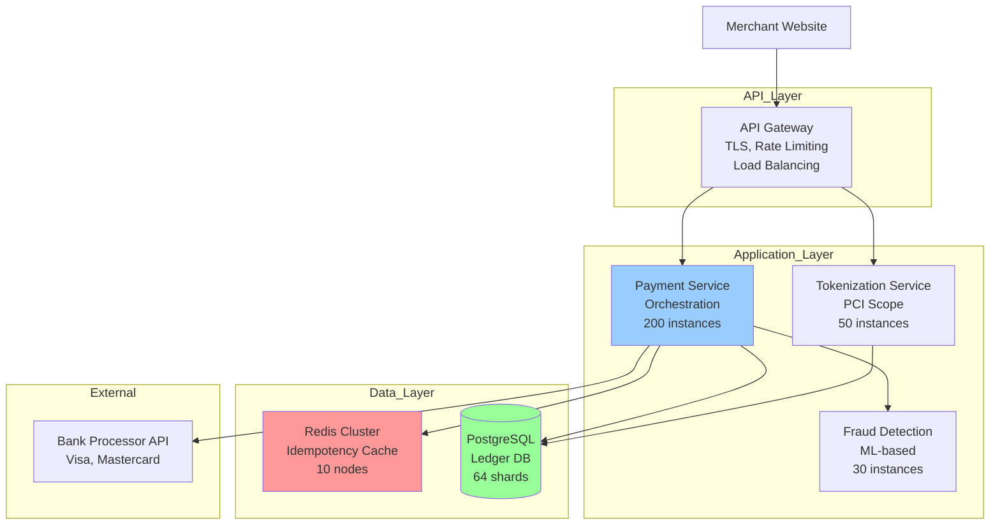

---

## 2. Payment Flow (Authorization)

**Flow Explanation:**

Two-phase commit pattern: Authorization reserves funds, Capture transfers money.

**Steps:**

1. Client sends payment request with idempotency key
2. Check Redis for duplicate request
3. Fraud detection scores transaction (< 50ms)
4. Call bank API for authorization
5. Write to ledger database
6. Return authorization result

**Benefits:**

- Merchant can cancel before capture
- Reduces refund rate
- Handles inventory checks

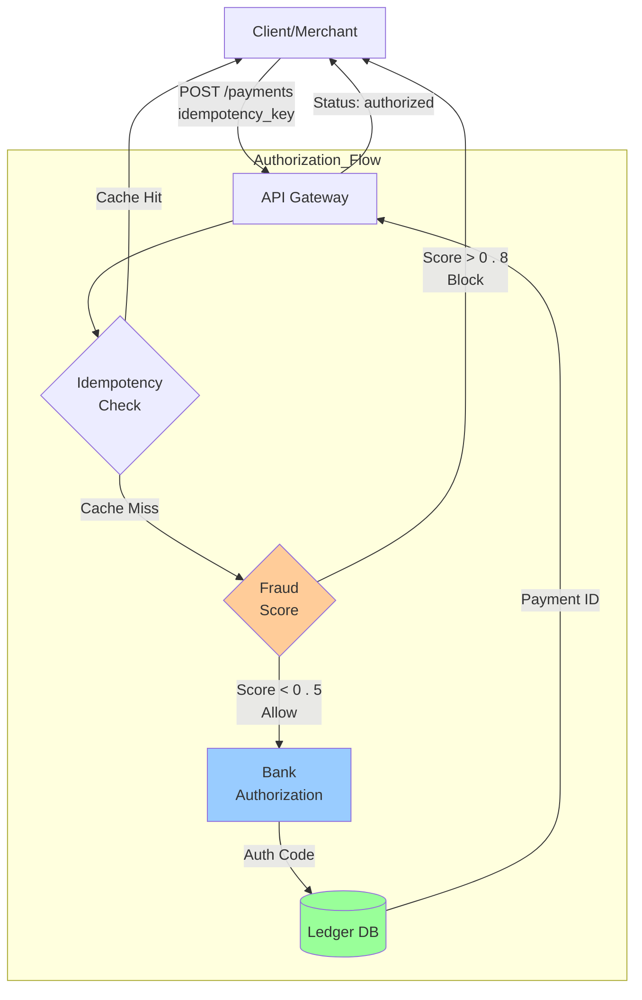

---

## 3. Idempotency System

**Flow Explanation:**

Prevents double charging when clients retry failed requests.

**Mechanism:**

1. Client generates UUID (idempotency_key)
2. Server checks Redis cache
3. If exists, return cached result
4. If not, process and cache result (24h TTL)

**Edge Cases:**

- Concurrent requests: Use Redis SETNX for atomic check
- Expired keys: Allow reprocessing after 24h
- Redis failure: Fall back to database query

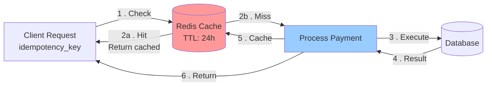

---

## 4. Tokenization Service

**Flow Explanation:**

Replaces sensitive card data with non-sensitive tokens to reduce PCI scope.

**Process:**

1. Client sends card number
2. Validate with Luhn algorithm
3. Generate unique token
4. Encrypt card with AES-256
5. Store encrypted card
6. Return token to client

**Security:**

- Only service in PCI scope
- Isolated VPC
- HSM for key management

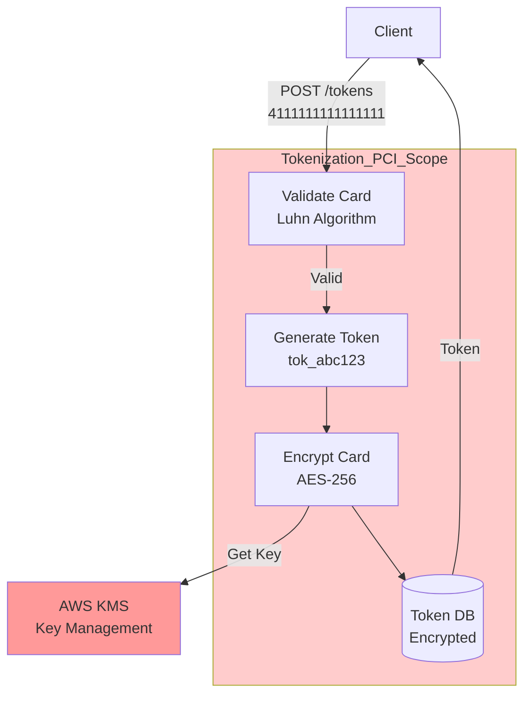

---

## 5. Database Sharding Architecture

**Flow Explanation:**

Horizontal sharding by merchant_id distributes load across 64 PostgreSQL shards.

**Sharding Strategy:**

- Shard key: merchant_id
- Shard calculation: hash(merchant_id) % 64
- Each shard: 3 replicas (primary + 2 read replicas)

**Benefits:**

- Linear scalability
- All merchant data on same shard
- Enables merchant-scoped queries

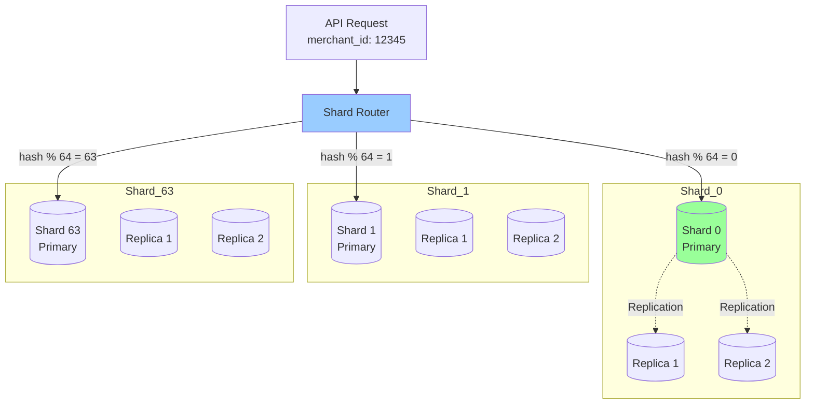

---

## 6. Fraud Detection Pipeline

**Flow Explanation:**

Real-time ML-based fraud scoring happens synchronously during authorization.

**Features:**

- Transaction: amount, currency, time
- Card: brand, country, decline history
- Customer: email, IP, device fingerprint
- Behavioral: velocity, spending patterns

**Actions:**

- Risk < 0.5: Auto-approve
- Risk 0.5-0.8: 3D Secure challenge
- Risk > 0.8: Block transaction

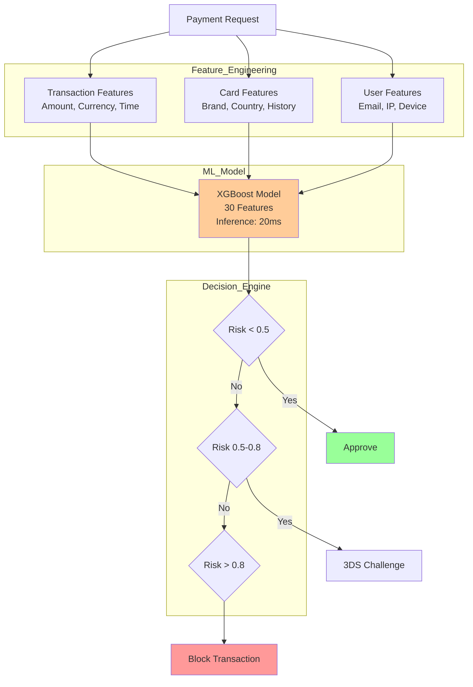

---

## 7. Webhook Delivery System

**Flow Explanation:**

Asynchronous webhook delivery with retry logic ensures merchants receive event notifications.

**Delivery Guarantees:**

- At-least-once delivery
- Up to 10 retry attempts
- Exponential backoff: 1m, 5m, 30m, 1h, 6h, 12h, 24h

**Signature:**

- HMAC-SHA256 signature in header
- Merchant verifies authenticity

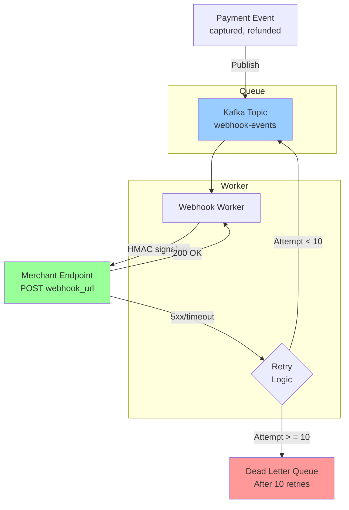

---

## 8. Multi-Region Deployment

**Flow Explanation:**

Active-active deployment across 4 regions for low latency and high availability.

**Regions:**

- US-East-1: Primary, largest capacity
- US-West-2: Secondary US
- EU-West-1: European users (GDPR)
- AP-Southeast-1: Asian users

**Routing:**

- Route53 latency-based routing
- Async database replication (1-2s lag)

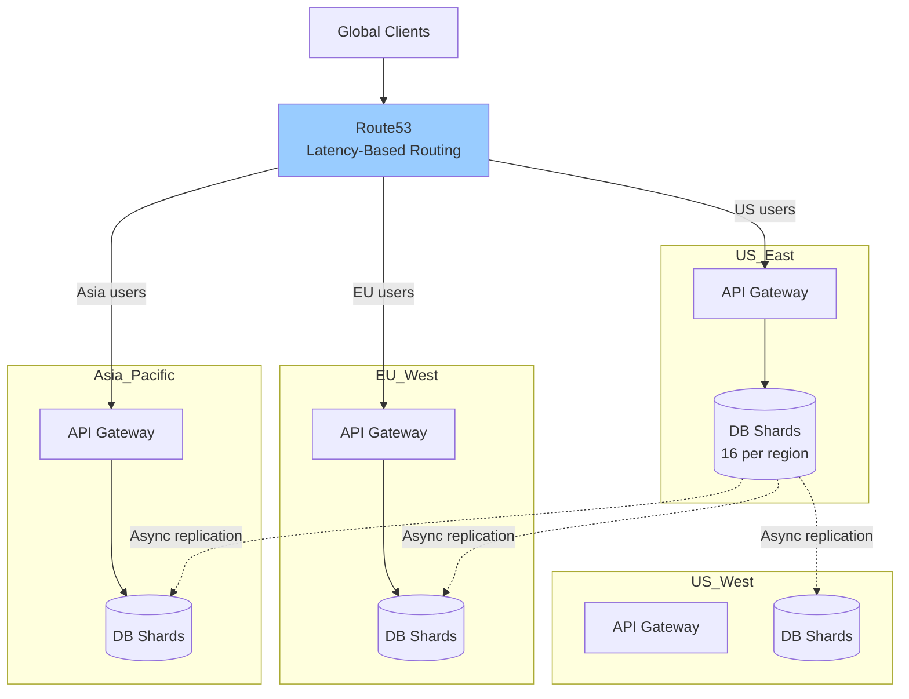

---

## 9. Circuit Breaker Pattern

**Flow Explanation:**

Protects system from cascading failures when bank API is slow or unavailable.

**States:**

- Closed: Normal operation, requests pass through
- Open: Bank is down, fail fast (don't call bank)
- Half-Open: Testing recovery, send probe request

**Configuration:**

- Failure threshold: 50% error rate over 10 seconds
- Cooldown: 60 seconds
- Success threshold: 5 consecutive successes

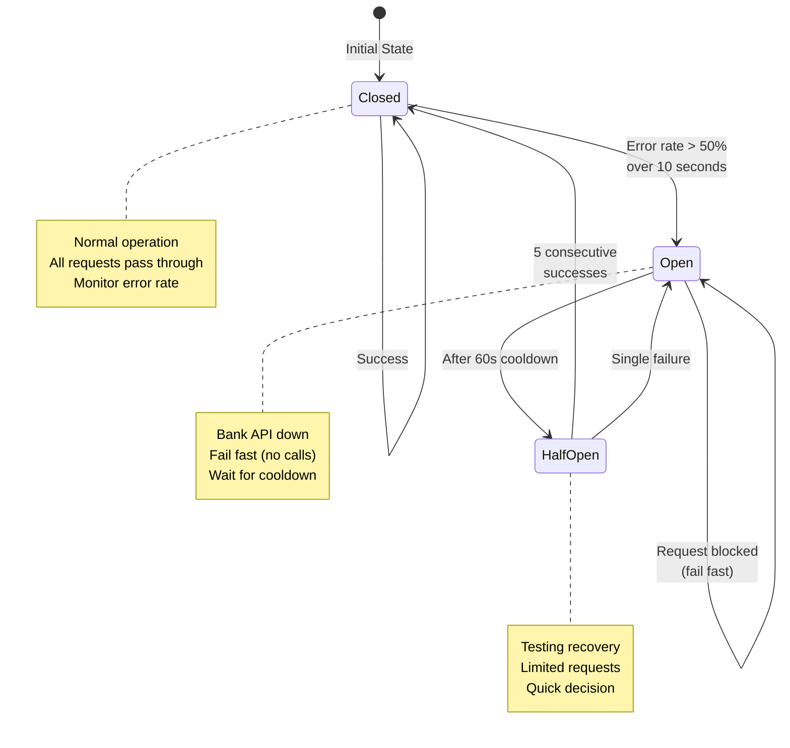

---

## 10. Subscription Billing Flow

**Flow Explanation:**

Automated recurring billing for subscription services (Netflix, Spotify model).

**Lifecycle:**

1. Customer creates subscription
2. Daily cron checks for due subscriptions
3. Charge payment method on billing date
4. Retry failed charges (Day 0, 3, 7)
5. Mark past_due if all retries fail
6. Cancel after 30 days past_due

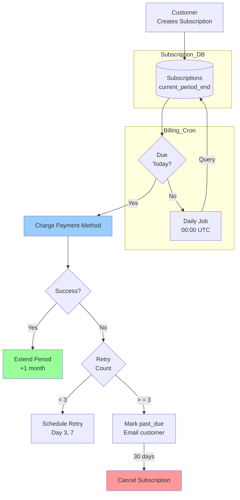

---

## 11. Split Payment Architecture

**Flow Explanation:**

Marketplace model where platform takes commission and transfers funds to merchants (Uber, Airbnb).

**Money Flow:**

- Customer pays $100
- Platform receives $20 (application_fee)
- Merchant receives $80 (automatic transfer)

**Use Cases:**

- Ride-sharing platforms
- Freelance marketplaces
- E-commerce marketplaces

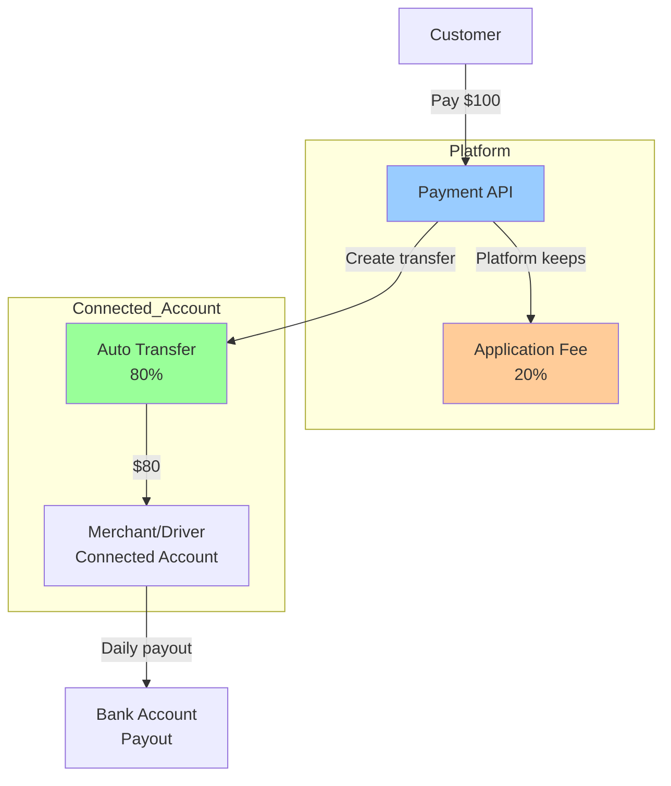

---

## 12. Monitoring and Observability

**Flow Explanation:**

Comprehensive monitoring of business and system metrics.

**Key Metrics:**

- Authorization success rate (target: > 98%)
- Fraud detection rate (target: 0.1%)
- API latency p95 (target: < 500ms)
- Database query time (target: < 50ms)

**Alerting:**

- Critical: Authorization rate < 95% → Page on-call
- High: Latency > 1s → Slack alert
- Medium: Fraud spike → Email security team

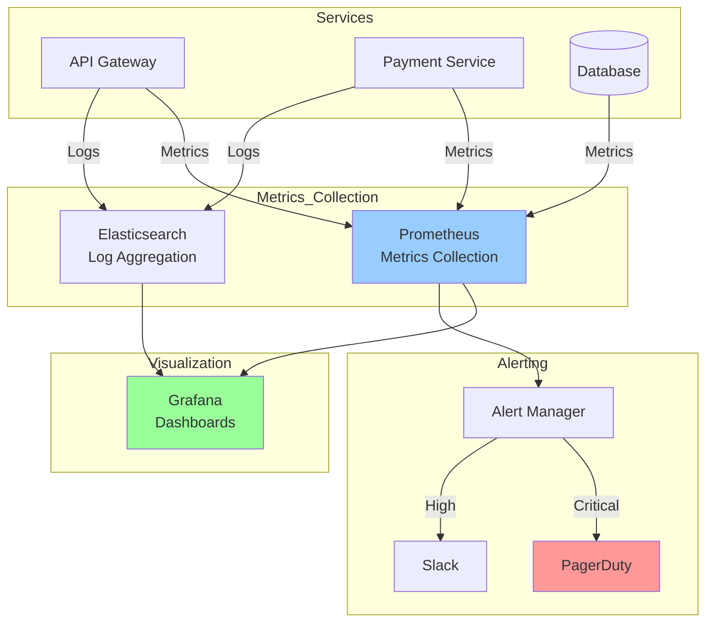